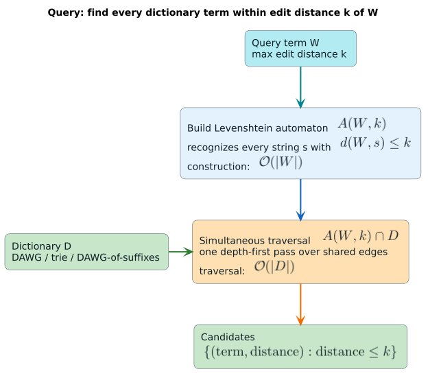
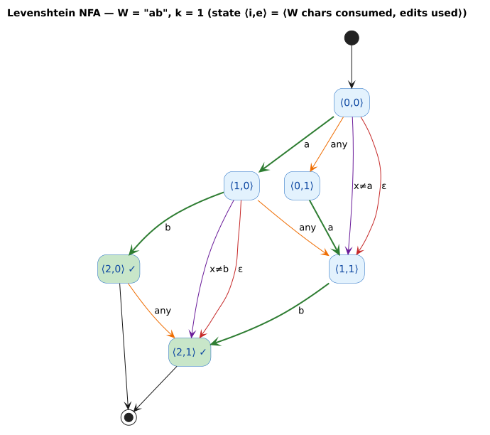
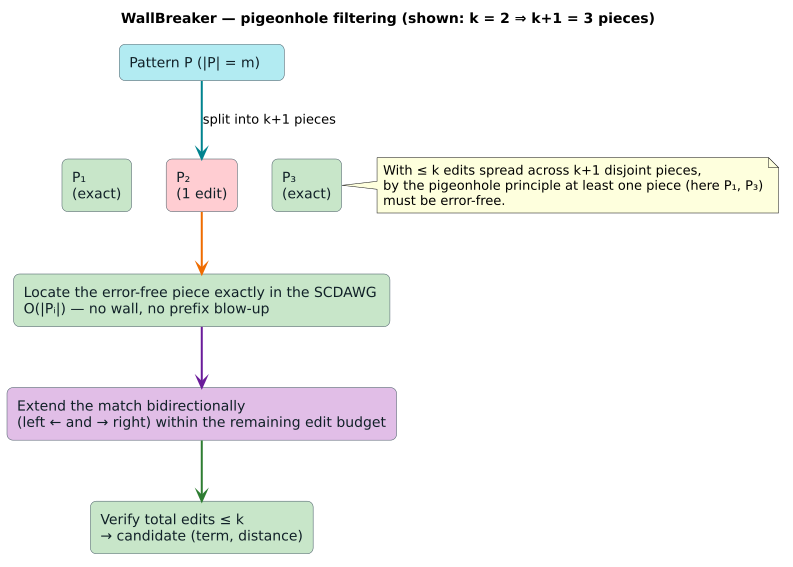

# liblevenshtein-rust

[](https://crates.io/crates/liblevenshtein)
[](https://github.com/universal-automata/liblevenshtein-rust/actions/workflows/ci.yml)
[](https://github.com/universal-automata/liblevenshtein-rust/actions/workflows/nightly.yml)
[](https://github.com/universal-automata/liblevenshtein-rust/actions/workflows/release.yml)
[](LICENSE)

**Approximate string matching that scales with matches, not dictionary size.** Instead of computing an edit distance against every entry, `liblevenshtein` represents the query `W` and an error bound `k` as a **Levenshtein automaton** — the set of still-viable `⟨position, errors⟩` states that together accept exactly the strings within distance `k` of `W` — and walks it **in lock-step** with the dictionary (a trie/DAWG), advancing both together and pruning a branch the instant no automaton state survives. The automaton is **simulated on the fly**, never built as a standalone table. Per-query setup is `𝒪(∣W∣)`; each automaton step costs `𝒪(k)` — a constant for fixed `k` — so total work tracks the explored near-match frontier rather than the size of the dictionary.

On top of that core it ships a toolbox: Unicode-correct dictionaries, restricted/weighted edits, **phonetic** matching (53 built-in languages), **time-series** similarity (Move–Split–Merge), the **WallBreaker** filter for very large error bounds, IDE-style **contextual completion**, composable fuzzy **caches**, and **WFST** adapters for language-model composition (in the companion **duallity** crate). Every dictionary is `Send + Sync` and cheap to share across threads; reads run concurrently — lock-free on the static backends and `DynamicDawgU64`, reader-locked on the `RwLock`-backed dynamic ones.

> Based on Schulz & Mihov, *Fast String Correction with Levenshtein-Automata* (2002) [[1]](#references), and the universal construction of Mitankin, Mihov & Schulz (2009) [[2]](#references).

---

## Table of Contents

- [Why automata?](#why-automata)
- [Notation & Terminology](#notation--terminology)
- [Quick Start](#quick-start)
- [Architecture](#architecture)
- [Common Use Cases](#common-use-cases)
- [Thread Safety & Parallelism](#thread-safety--parallelism)
- [Dictionary Types](#dictionary-types)
- [Levenshtein Automata](#levenshtein-automata)
- [Restricted & Custom Substitutions](#restricted--custom-substitutions)
- [Weighted & Generalized Automata](#weighted--generalized-automata)
- [Articulatory Distance](#articulatory-distance)
- [Time Series (Move–Split–Merge)](#time-series-movesplitmerge)
- [WallBreaker (Large Error Bounds)](#wallbreaker-large-error-bounds)
- [Phonetic Matching](#phonetic-matching)
- [WFST Integration](#wfst-integration)
- [Contextual Completion Engine](#contextual-completion-engine)
- [Fuzzy Maps & Caching](#fuzzy-maps--caching)
- [Additional Features](#additional-features)
- [Performance](#performance)
- [Formal Verification](#formal-verification)
- [Feature Flags](#feature-flags)
- [References](#references)
- [License](#license)

---

## Why automata?

The **Levenshtein (edit) distance** `d(W, s)` between two strings is the minimum number of single-character **insertions**, **deletions**, and **substitutions** that turn `W` into `s`. The textbook way to compute it fills a dynamic-programming matrix (Wagner–Fischer [[3]](#references)):

```text
edit_distance(W, s):
  D[i,0] ← i   for i in 0..∣W∣          # delete every char of W
  D[0,j] ← j   for j in 0..∣s∣          # insert every char of s
  for i in 1..∣W∣, j in 1..∣s∣:
    D[i,j] ← min( D[i−1, j  ] + 1,                     # delete  Wᵢ
                  D[i,   j−1] + 1,                     # insert  sⱼ
                  D[i−1, j−1] + (Wᵢ ≠ sⱼ ? 1 : 0) )   # match / substitute
  return D[∣W∣, ∣s∣]
```

Spell-checking a query against a dictionary `D` this way costs `𝒪(∣D∣ · ∣W∣ · ∣s∣)` — you re-pay the *∣W∣* factor for every entry. The automaton approach avoids that:

1. **Simulate** a Levenshtein automaton `A(W, k)` whose language is exactly the strings `s` with `d(W, s) ≤ k`. Each of its states is a *set* of still-viable `⟨position, errors⟩` positions; for fixed `k` only `𝒪(∣W∣)` distinct states ever arise, and each is computed lazily as the search needs it.
2. **Walk** `A(W, k)` and the dictionary — a trie/DAWG — together in one shared depth-first traversal (their language **intersection**). A subtree is pruned the instant no automaton state survives, so the cost tracks the matching frontier, not the dictionary size.



The decisive insight of Schulz & Mihov [[1]](#references) is that the automaton's transition on an input symbol `x` depends only on a small **characteristic vector** — a bit pattern marking where `x` matches inside the relevant window of `W` — and **not** on the concrete symbols. So one fixed, `W`-independent transition rule drives *every* query: the crate **simulates** the automaton's moves on the fly (the paper's *imitation* method) rather than constructing one. Restricting which symbol pairs may substitute generalizes this further, to the *universal* Levenshtein automata of Mitankin, Mihov & Schulz [[2]](#references).

---

## Notation & Terminology

Defined once, used throughout.

| Symbol / term | Meaning |
|---|---|
| `Σ` | the *alphabet* (bytes `u8`, Unicode scalars `char`/`u32`, or arbitrary `u64` labels) |
| `W`, `∣W∣` | the *query* (pattern) string and its length |
| `s` | a *candidate* string drawn from the dictionary |
| `D`, `∣D∣` | the *dictionary* and its number of edges (transitions) |
| `k` | the maximum edit distance / *error bound* |
| `d(W, s)` | edit distance between `W` and `s` |
| **edit operations** | insertion, deletion, substitution (+ transposition, merge/split — see below) |
| **position** `⟨i, e⟩` | automaton state: `i` characters of `W` consumed, `e` edits spent (`e ≤ k`) |
| **characteristic vector** `χ` | bit pattern marking where the input symbol matches inside `W`'s active window |
| **subsumption** | a cheaper position dominating a costlier nearby one, pruned to keep states minimal |
| **NFA / DFA** | non-deterministic / deterministic finite automaton |
| **DAWG** | Directed Acyclic Word Graph — a trie with shared suffixes (Blumer et al. [[8]](#references)) |
| **DAT** | Double-Array Trie — a trie packed into two integer arrays for `𝒪(1)`-per-transition lookups (Aoe [[11]](#references)) |
| **SCDAWG** | Symmetric Compact DAWG — indexes *all substrings*, traversable in both directions (Inenaga et al. [[9]](#references)) |
| **ART** | Adaptive Radix Tree — a space-adaptive radix trie (Leis et al. [[12]](#references)) |
| **transducer** | here, the object that runs an automaton against a dictionary and *yields* matches |
| **WFST** | Weighted Finite-State Transducer (for composition with language models) |
| **MSM** | Move–Split–Merge, a metric for real-valued time series (Stefan et al. [[10]](#references)) |

---

## Quick Start

```rust
use liblevenshtein::prelude::*;

// A static dictionary (fast, read-only).
let dict = DoubleArrayTrie::from_terms(vec!["test", "testing", "tested"]);

// A transducer using Standard Levenshtein distance.
let transducer = Transducer::new(dict, Algorithm::Standard);

// Every term within edit distance 2 of "tset".
for candidate in transducer.query_with_distance("tset", 2) {
    println!("{}: distance {}", candidate.term, candidate.distance);
}
// → test: distance 1   (transpose-free: delete 's', insert 's')
```

### Installation

```toml
[dependencies]
liblevenshtein = "0.8"

# Phonetic rules, time-series, persistence, etc. are opt-in features:
# liblevenshtein = { version = "0.8", features = ["phonetic-rules"] }
```

SIMD (AVX2/SSE4.1) is automatic on `x86_64` via runtime CPU detection — no feature flag. Dictionary backends live in the companion crate **`libdictenstein`** and are re-exported through `liblevenshtein::prelude` (byte-level types) or imported directly (`use libdictenstein::double_array_trie_char::DoubleArrayTrieChar;` for the Unicode variants).

> **crates.io note:** the optional `pathmap-backend` uses a git dependency and is unavailable from a plain `crates.io` install; build from source with `--features pathmap-backend` to use it.

---

## Architecture

Three layers, built bottom-up: dictionary backends (`libdictenstein`) → the core transducer & automata → higher-level engines.


You pick a **dictionary** for your access pattern, wrap it in a **`Transducer`** with an **`Algorithm`**, and either query directly or reach for a higher-level engine (phonetic, time-series, completion, cache).

---

## Common Use Cases

| Task | Solution | Section |
|------|----------|---------|
| **Spell checking** | Standard Levenshtein + static dictionary | [Levenshtein Automata](#levenshtein-automata) |
| **Autocomplete / prefix search** | Dictionary prefix iteration | [Prefix search](#prefix-search-command-completion) |
| **IDE code completion** | Hierarchical scopes with draft management | [Contextual Completion](#contextual-completion-engine) |
| **Fuzzy search returning metadata** | Value-yielding queries / value aggregation | [Fuzzy Maps](#fuzzy-maps--caching) |
| **Phonetic matching** | Pattern NFAs composed with Levenshtein | [Phonetic Matching](#phonetic-matching) |
| **Pronunciation-aware costs** | Weighted articulatory feature distance | [Articulatory Distance](#articulatory-distance) |
| **Time-series similarity** | Move–Split–Merge metric | [Time Series](#time-series-movesplitmerge) |
| **Keyboard typo correction** | Transposition algorithm + QWERTY substitutions | [Algorithm Variants](#algorithm-variants) |
| **OCR error correction** | MergeAndSplit + restricted substitutions | [Restricted Substitutions](#restricted--custom-substitutions) |
| **Large error bounds** (`k ≥ 5`) | WallBreaker with SCDAWG | [WallBreaker](#wallbreaker-large-error-bounds) |
| **Substring / infix fuzzy search** | SuffixAutomaton / SCDAWG | [Dictionary Types](#dictionary-types) |
| **Persistent / mmap dictionaries** | Memory-mapped ARTrie | [Dictionary Types](#dictionary-types) |
| **Language-model composition** | WFST adapters (`duallity` crate) | [WFST Integration](#wfst-integration) |
| **Caching with eviction** | Composable TTL / LRU / LFU / cost-aware policies | [Fuzzy Maps & Caching](#fuzzy-maps--caching) |

---

## Thread Safety & Parallelism

Built for concurrent workloads from the ground up. **All dictionary types are `Send + Sync`.**

| Operation | Semantics |
|-----------|-----------|
| **Query / Contains** | Concurrent; lock-free on static dicts & `DynamicDawgU64` (atomics), reader-lock (`RwLock`) on the other dynamic dicts |
| **Insert / Remove** (dynamic dicts) | Atomic; lock-free on `DynamicDawgU64`, writer-exclusive on the `RwLock`-backed dicts |

```rust
use std::thread;
use liblevenshtein::prelude::*;

let dict: DynamicDawg = DynamicDawg::from_terms(vec!["hello", "world"]);

let handles: Vec<_> = (0..4).map(|_| {
    let dict = dict.clone();           // cheap: the handle is Arc-backed and shares state
    thread::spawn(move || {
        let transducer = Transducer::new(dict, Algorithm::Standard);
        transducer.query("helo", 1).collect::<Vec<_>>()
    })
}).collect();

for handle in handles {
    let _results = handle.join().expect("thread panicked");
}
```

Concurrency is fine-grained and needs no external locking — clone the (`Arc`-backed) handle and share it; all clones observe each other's writes. `DoubleArrayTrie`/`DoubleArrayTrieChar` (immutable after build) and `DynamicDawgU64` (`ArcSwap`) give **wait-free reads**; `DynamicDawg`, `DynamicDawgChar`, `SuffixAutomaton`, and `Scdawg` guard their state with a `parking_lot` **reader–writer lock**, so many reads proceed concurrently and a write briefly excludes readers. Writes are always atomic from a reader's perspective.

---

## Dictionary Types

### Label types

Dictionaries store *labels*. Though named for characters, they hold arbitrary values of the same width:

| Label width | Types | Character use | Arbitrary use |
|---|---|---|---|
| **1 byte** (`u8`) | `DoubleArrayTrie`, `DynamicDawg`, `SuffixAutomaton`, `Scdawg` | ASCII | bytes, small ints (0–255), flags |
| **4 bytes** (`char`/`u32`) | `DoubleArrayTrieChar`, `DynamicDawgChar`, `SuffixAutomatonChar`, `ScdawgChar` | Unicode scalars | 32-bit ints, bit-cast `f32` |
| **8 bytes** (`u64`) | `DynamicDawgU64` | — | 64-bit ints, bit-cast `f64`, compound keys |

#### Why the `*Char` variants matter (UTF-8 correctness)

Byte-level distance over-counts multi-byte characters. "café" is **5 bytes** but **4 characters**, so a byte dictionary scores `café → cafe` as 2 edits (rewriting the 2-byte `é`). The `*Char` variants operate on Unicode scalars, giving the correct `1` substitution.

| Text | Bytes | Chars | Edits to ASCII |
|------|------:|------:|---------------:|
| café | 5 | 4 | 1 (é→e) |
| 中文 | 6 | 2 | 2 |
| 🎉 | 4 | 1 | 1 |

Use `*Char` for any non-ASCII, internationalized, CJK, Cyrillic, Arabic, accented, or emoji text.

### Choosing a backend

| Dictionary | Best for | Characteristics |
|------------|----------|-----------------|
| **DoubleArrayTrie** [[11]](#references) | static ASCII dictionaries | `𝒪(1)` per transition, fastest queries; read-only after build |
| **DynamicDawg** [[8]](#references) | dynamic ASCII dictionaries | atomic insert/remove, SIMD + Bloom-filter pruning |
| **DynamicDawgU64** | large 64-bit label spaces | identifiers, hashes, compound keys |
| **SuffixAutomaton** | substring / infix search | match a pattern anywhere within terms |
| **Scdawg** [[9]](#references) | substring search + WallBreaker | bidirectional traversal; backs large-`k` search |
| **PersistentARTrie** [[12]](#references) | huge dictionaries | memory-mapped, zero-copy disk access (`persistent-artrie`) |
| **PathMapDictionary** | update-heavy workloads | persistent-map backend (`pathmap-backend`) |

Each has a `*Char` Unicode counterpart. Static backends (DoubleArrayTrie, PersistentARTrie) are immutable after construction; dynamic backends (DynamicDawg, SuffixAutomaton, Scdawg) support atomic concurrent modification.

```rust
use liblevenshtein::prelude::*;
use libdictenstein::double_array_trie_char::DoubleArrayTrieChar;   // Unicode (4-byte) variant

let ascii = DoubleArrayTrie::from_terms(vec!["hello", "world"]);
let unicode: DoubleArrayTrieChar = DoubleArrayTrieChar::from_terms(vec!["café", "naïve", "中文"]);

// Dynamic: thread-safe runtime modification.
let dawg: DynamicDawg = DynamicDawg::new();
dawg.insert("initial");
dawg.insert("added");
dawg.remove("initial");
assert!(dawg.contains("added") && !dawg.contains("initial"));
```

### Substring / suffix search

```rust
use libdictenstein::suffix_automaton::SuffixAutomaton;

let sa = SuffixAutomaton::<()>::from_text("hello world");
assert!(!sa.match_positions("llo wo").is_empty());   // substring present
assert!(sa.match_positions("xyz").is_empty());        // absent
```

The **SCDAWG** (`Scdawg` / `ScdawgChar`) additionally supports *left and right* extension of a matched substring — the property the [WallBreaker](#wallbreaker-large-error-bounds) filter relies on — at the cost of a little extra space for the reverse links.

### Prefix search (command completion)

Navigate to a prefix and iterate only the matching terms:

```rust
use liblevenshtein::prelude::*;
use libdictenstein::double_array_trie_zipper::DoubleArrayTrieZipper;
use libdictenstein::prefix_zipper::PrefixZipper;   // brings with_prefix into scope

let dict = DoubleArrayTrie::from_terms(vec!["getValue", "getVariable", "setValue"]);
let zipper = DoubleArrayTrieZipper::new_from_dict(&dict);

if let Some(iter) = zipper.with_prefix(b"get") {
    for (path, _zipper) in iter {            // item = (Vec<u8>, zipper at the final node)
        println!("Found: {}", String::from_utf8(path).expect("valid UTF-8"));
        // → getValue, getVariable
    }
}
```

---

## Levenshtein Automata

### Algorithm variants

| `Algorithm` | Extra operation | Typical use |
|-------------|-----------------|-------------|
| **Standard** | — (insert, delete, substitute) | general fuzzy matching |
| **Transposition** | swap of adjacent characters (Damerau [[4]](#references)) | typing errors (`teh → the` costs 1) |
| **MergeAndSplit** | two characters ↔ one | OCR errors (`rn → m`, `vv → w`) |

```rust
use liblevenshtein::prelude::*;
let dict = DoubleArrayTrie::from_terms(vec!["the", "them", "then"]);

let standard      = Transducer::new(dict.clone(), Algorithm::Standard);      // teh→the = 2
let transposition = Transducer::new(dict.clone(), Algorithm::Transposition); // teh→the = 1
let merge_split   = Transducer::new(dict,        Algorithm::MergeAndSplit);  // rn↔m  = 1
```

### How the automaton transitions (literate pseudocode)

A state is a **set of positions** `⟨i, e⟩` (`i` chars of `W` matched, `e` errors spent). Reading a candidate symbol `x` advances every position in lock-step; the four elementary edits are exactly the colored edges below.



```text
transition(State, x):
  Next ← ∅
  for ⟨i, e⟩ in State:
    χ ← characteristic_vector(x, W[i .. i + (k − e)])   # where does x match ahead?
    if χ[0] = 1:                                         # x = Wᵢ₊₁
      Next ← Next ∪ { ⟨i+1, e⟩ }                         #   match        (+0)
    else if e < k:
      Next ← Next ∪ { ⟨i,   e+1⟩ }                       #   insertion    (+1)
      Next ← Next ∪ { ⟨i+1, e+1⟩ }                       #   substitution (+1)
      for j in 1 ..= (k − e) where χ[j] = 1:
        Next ← Next ∪ { ⟨i+j+1, e+j⟩ }                   #   delete j, then match
  return reduce(Next)        # drop subsumed positions

# ⟨i,e⟩ subsumes ⟨i′,e′⟩  ⟺  e < e′  and  ∣i′ − i∣ ≤ e′ − e
#   (a position reachable with fewer errors dominates nearby costlier ones)
```

Accept when some position reaches `i = ∣W∣`; that position's `e` is the match distance. Because the update depends only on `χ`, one fixed transition rule (independent of `W`) serves every query. This crate **simulates** the deterministic Levenshtein automaton's states — reduced sets of positions, kept minimal by subsumption — directly during the dictionary walk, never materializing a standalone automaton: this is Schulz & Mihov's *imitation* method [[1]](#references). The pseudocode above *is* that simulation. (A separate eager `universal` automaton, and the bit-vector *universal* construction of Mitankin et al. [[2]](#references), are alternatives — not the default `query` path.)

### Query methods

```rust
use liblevenshtein::prelude::*;
let dict = DoubleArrayTrie::from_terms(vec!["apple", "apply", "ape"]);
let t = Transducer::new(dict, Algorithm::Standard);

for term in t.query("aple", 1) { /* matching terms (String)          */ }
for c in t.query_with_distance("aple", 1) { /* c.term, c.distance     */ }
for c in t.query_ordered("aple", 1) { /* by distance, then alpha      */ }
for c in t.query_filtered("aple", 2, |v| *v > 100) { /* by predicate  */ }
```

For dictionaries that store values, **`query_values`** yields `(term, distance, value)` in a *single* traversal — no second lookup per hit — and **`query_by_value_set`** filters by set membership (ideal for hierarchical scope visibility):

```rust
use std::collections::HashSet;
let visible: HashSet<u32> = [1, 2, 3].into_iter().collect();
for c in t.query_by_value_set("func", 2, &visible) { /* only scopes 1,2,3 */ }
```

---

## Restricted & Custom Substitutions

A **restricted** policy lets specific character pairs substitute at **zero cost**, so chosen confusions are treated as equivalent rather than as errors. It is a substitution **policy** layered on the ordinary transducer (`Transducer::with_substitutions`) — the restricted-substitution generalization studied for *universal* Levenshtein automata [[2]](#references).

```rust
use liblevenshtein::prelude::*;
use liblevenshtein::transducer::SubstitutionSet;

let mut set = SubstitutionSet::new();
set.allow('c', 'k');          // c ↔ k free
set.allow('f', 'p');          // f ↔ p free

let dict = DoubleArrayTrie::from_terms(vec!["kat", "cat", "fat"]);
let transducer = Transducer::with_substitutions(dict, Algorithm::Standard, set);
```

Prebuilt sets cover the common cases:

```rust
use liblevenshtein::transducer::SubstitutionSet;
let phonetic = SubstitutionSet::phonetic_basic();   // f↔ph, c↔k, s↔z, …
let keyboard = SubstitutionSet::keyboard_qwerty();  // physically adjacent keys
let ocr      = SubstitutionSet::ocr_friendly();     // 0↔O, 1↔l↔I, …
let leet     = SubstitutionSet::leet_speak();       // 3↔e, 4↔a, 0↔o, …
```

Unicode pairs use `SubstitutionSetChar` (`.allow('é', 'e')`, `.allow('ñ', 'n')`, …) for accent-insensitive matching.

---

## Weighted & Generalized Automata

Two complementary ways to go beyond unit-cost edits.

**Discrete operations** — choose *which* edits exist at runtime via an `OperationSet`, then run a generalized automaton or compose it as a [WFST](#wfst-integration):

```rust,ignore
// `GeneralizedWfstBuilder` lives in the companion `duallity` crate.
use duallity::GeneralizedWfstBuilder;
use libdictenstein::dynamic_dawg_char::DynamicDawgChar;
let dict: DynamicDawgChar = DynamicDawgChar::from_terms(vec!["example", "examples"]);

let wfst = GeneralizedWfstBuilder::new(&dict)
    .query("exmaple")
    .max_distance(2)
    .with_transposition()      // or .with_merge_split(), .with_phonetic_digraphs()
    .build()
    .expect("build failed");
```

**Real-valued costs** — `OperationCostsF64` assigns a floating-point cost to each operation (the base for [articulatory](#articulatory-distance) weighting):

```rust
use liblevenshtein::transducer::OperationCostsF64;

let costs = OperationCostsF64 {
    substitution: 1.5,         // substitutions cost more …
    transposition: 0.5,        // … transpositions cost less
    ..OperationCostsF64::standard()   // insertion/deletion/split/merge = 1.0, match = 0.0
};
assert!(costs.is_valid());
```

---

## Articulatory Distance

Spelling errors track **pronunciation**: `b`↔`p` (a voicing flip) is a smaller slip than `b`↔`s`. Articulatory distance scores a substitution by how far apart two phones sit in **distinctive-feature** space — place and manner of articulation, voicing, and vowel height/backness/rounding — instead of the flat “1 for any mismatch”.

```rust
// requires features = ["phonetic-rules"]
use liblevenshtein::phonetic::feature_distance::{
    articulatory_distance, articulatory_distance_weighted, FeatureDistanceWeights,
};

let d_bp = articulatory_distance('b', 'p');   // small — differ only in voicing
let d_bs = articulatory_distance('b', 's');   // larger — differ in manner & place
assert!(d_bp < d_bs);

// Tune the seven feature weights to your domain (defaults reproduce the base model):
let weights = FeatureDistanceWeights { voicing: 0.5, place_step: 0.25, ..Default::default() };
let d = articulatory_distance_weighted('d', 't', &weights);
```

Plug the weights into a transducer's substitution cost via `ArticulatoryCosts::with_feature_weights(weights)`. The metric properties (symmetry, identity, non-negativity, boundedness, per-dimension monotonicity) are **machine-checked, admit-free** in Coq/Rocq — see [Formal Verification](#formal-verification).

---

## Time Series (Move–Split–Merge)

**MSM** [[10]](#references) is a metric for real-valued sequences built from three operations: **Move** a value (cost `∣Δ∣`), **Split** one element into two equal copies, and **Merge** two equal adjacent elements (Split/Merge share a configurable cost `c`). Unlike DTW it is a true metric (it obeys the triangle inequality), and it is robust to temporal misalignment. The cost obeys the recurrence

```text
Cost(i, j) = min(
    Cost(i−1, j−1) + ∣xᵢ − yⱼ∣,                  # Move
    Cost(i−1, j  ) + splitmerge(xᵢ, xᵢ₋₁, yⱼ),   # Split/Merge on X
    Cost(i,   j−1) + splitmerge(yⱼ, yⱼ₋₁, xᵢ) )  # Split/Merge on Y
```

where `splitmerge(a, b, c) = c` when `a` lies between `b` and `c`, else `c + min(∣a−b∣, ∣a−c∣)`.

**`MsmTransducer`** indexes a set of reference series in a *quantized trie* and answers **exact** range and `k`-NN queries by walking that trie with an *interval-relaxed* MSM dynamic program. Its column lower bounds are admissible — so no true neighbor within the threshold is ever pruned — and surviving candidates are re-scored at full precision:

```rust
use liblevenshtein::time_series::{MsmConfig, MsmTransducer, QuantizationConfig};

let series = vec![
    vec![1.0, 2.0, 3.0, 4.0],
    vec![1.0, 2.0, 2.0, 4.0],
    vec![5.0, 6.0, 7.0, 8.0],
];
let index = MsmTransducer::from_series(
    QuantizationConfig::for_u8(0.0, 100.0),   // value range → 256 bins
    MsmConfig::new(1.0),                       // split/merge cost c
    &series,
);

let query = vec![1.0, 2.0, 3.0, 4.0];
let within = index.search_range(&query, 2.0);   // Vec<(id, msm_distance)> with distance ≤ 2.0
let nearest = index.search_knn(&query, 2, 5.0);  // exact 2 nearest (initial threshold 5.0)
```

The interval lower bounds and quantization soundness carry **admit-free** Coq/Rocq proofs and a TLA⁺ model — see [Formal Verification](#formal-verification).

---

## WallBreaker (Large Error Bounds)

A plain Levenshtein automaton hits a **wall** at large `k`: the first `k` steps must explore *every* prefix of length `≤ k`, regardless of the data. At `k = 16` that is ruinous. **WallBreaker** sidesteps it with the **pigeonhole principle**.



```text
wallbreaker(P, k, scdawg):
  p ← pieces_for(algorithm, k)               # k+1 (Standard); 2k+1 (Transposition / MergeAndSplit)
  results ← ∅
  for piece in split(P, p):                  # disjoint, near-equal pieces
    for (term, locus) in scdawg.exact_occurrences(piece):    # 𝒪(∣piece∣) — no wall
      cand ← extend_bidirectionally(term, locus, P, k)        # grow ← and → within budget
      if edit_distance(P, cand) ≤ k:
        results ← results ∪ { (cand, edit_distance(P, cand)) }
  return dedup(results)
```

**Why `p` pieces?** Spread `≤ k` edits across `p` disjoint pieces. A Standard edit corrupts at most **one** piece, so `k + 1` pieces guarantee a survivor that matches exactly; a transposition or merge/split can straddle a boundary and corrupt **two**, needing `2k + 1`. These bounds are proved in Coq/Rocq (`WallBreakerPigeonhole.v`).

| `Algorithm` | Minimum pieces | Reason |
|-------------|---------------:|--------|
| **Standard** | `k + 1` | each edit corrupts `≤ 1` piece |
| **Transposition** | `2k + 1` | a swap can straddle a boundary |
| **MergeAndSplit** | `2k + 1` | merge/split can span a boundary |

```rust
use liblevenshtein::prelude::*;

let scdawg: Scdawg = Scdawg::from_terms(vec!["misspelled", "misspelling", "dispelled"]);
let wallbreaker = WallBreaker::new(&scdawg, 4);   // or WallBreaker::with_algorithm(&scdawg, 4, Algorithm::Standard)

for result in wallbreaker.query("mispeled") {
    println!("{}: distance {}", result.term, result.distance);
}
```

For long patterns and large `k` this turns the exponential wall into a handful of `𝒪(∣piece∣)` substring lookups; the project's design analysis projects **~2,000–3,300×** over a plain transducer at `k ≈ 16` on a 750k-word lexicon ([decision matrix](docs/research/wallbreaker/decision-matrix.md)). Use the plain transducer for short queries and small `k` (`≤ 3`); reach for WallBreaker when `k ≥ 5` or patterns exceed ~50 characters.

---

## Phonetic Matching

Three layers, all behind the `phonetic-rules` feature. *(The exhaustive feature-class and syntax tables live in [`docs/llre/`](docs/llre/README.md), the [phonetic-rules developer guide](docs/guides/phonetic-rules-developer-guide.md), and the grammars [`docs/grammar/llev.ebnf`](docs/grammar/llev.ebnf) · [`docs/grammar/llre.ebnf`](docs/grammar/llre.ebnf); a representative slice is shown here.)*

### 1. Phonetic NFA × Levenshtein composition

Recognize several spellings of a sound, *then* allow edits on top, via a product automaton:

```rust
// requires features = ["phonetic-rules"]
use liblevenshtein::phonetic::nfa::{compile, ProductAutomatonChar};
use liblevenshtein::phonetic::regex::parse;

let regex = parse("(ph|f)one").expect("parse failed");
let nfa = compile(&regex).expect("compile failed");
let product = ProductAutomatonChar::new(nfa, 2);   // pattern ∘ Levenshtein(k=2)

assert!(product.accepts("phone"));   // exact      (distance 0)
assert!(product.accepts("fone"));    // alt spelling (distance 0)
assert!(product.accepts("phon"));    // delete 'e'   (distance 1)
assert_eq!(product.min_distance("fon"), Some(1));
assert_eq!(product.min_distance("xyz"), None);       // outside the budget
```

The `PhoneticGrep` convenience API wraps this for one-off matching, with optional case/accent insensitivity (`(?ia:cafe)` matches `CAFÉ`).

### 2. `.llev` rewrite rules

A small language of context-sensitive phonetic rewrites with metadata, named feature classes, and syllable conditions:

```text
[id: 1, name: "ph to f", group: orthography]
ph -> f;                       # phone → fone
gh -> / [:vowel:]_;            # silent gh after a vowel: night → nit
c  -> s / _[:front_vowel:];    # soft c: city → sity
```

```rust
use liblevenshtein::phonetic::llev::{parse_str, RuleSetChar};
let file = parse_str("ph -> f;\ngh -> / [:vowel:]_;").expect("parse failed");
let ruleset = RuleSetChar::from_llev(&file).expect("build failed");
let normalized = ruleset.apply("phone");   // → "fone"
```

**53 languages** ship as pre-compiled Rust modules (Romance, Germanic, Slavic, Celtic, Indic, East/Southeast Asian, Semitic, and more); **123** have `.llev` rule data loadable at runtime. `english::base()`, `spanish::base()`, `german::base()`, plus helpers like `english::homophones()` and `english::text_speak()`.

### 3. `.llre` fuzzy regular expressions

Regex with phonetic feature classes (`[:fricative:]`, `[:voiced:]`, `[:nasal:]`, …), accent/case flags `(?ia:…)`, Unicode normalization `(?u:NFC)`, and per-group edit budgets `(?;N)`:

```rust
use liblevenshtein::phonetic::llre;
let pattern = llre::compile_pattern("[:fricative:]one").expect("compile failed");
assert!(pattern.matches("fone"));    // f  ∈ fricative
assert!(pattern.matches("shone"));   // sh ∈ fricative
assert!(!pattern.matches("bone"));   // b  ∉ fricative
```

---

## WFST Integration

liblevenshtein's automata can be exposed as lazy **Weighted Finite-State Transducers** (WFSTs) for composition with language models — phonetic rewrites, n-gram LMs, and more. As of liblevenshtein 0.9, these adapters live in the companion **[`duallity`](https://github.com/f1r3fly-io/duallity)** crate, which depends on both liblevenshtein and [lling-llang](https://github.com/f1r3fly-io/lling-llang):

```rust,ignore
use duallity::{LevenshteinWfst, PhoneticWfstBuilder, WallBreakerWfstBuilder};
use libdictenstein::dynamic_dawg_char::DynamicDawgChar;
use lling_llang::composition::compose;

let dict: DynamicDawgChar = DynamicDawgChar::from_terms(vec!["hello", "help", "world"]);

// Levenshtein × dictionary product, ready to compose with an n-gram LM.
let lev = LevenshteinWfst::new(&dict, "helo", 2);
let composed = compose(lev, language_model);
```

See the **[`duallity`](https://github.com/f1r3fly-io/duallity)** crate for the phonetic / WallBreaker / generalized WFST builders and composition recipes.

---

## Contextual Completion Engine

IDE-style completion with **hierarchical scopes** and **draft management** — a typed-but-unfinished identifier is visible to completion before it is committed, and edits can be checkpointed and undone.

```rust
// requires features = ["pathmap-backend"]
use liblevenshtein::contextual::DynamicContextualCompletionEngine;
use liblevenshtein::transducer::Algorithm;

let engine = DynamicContextualCompletionEngine::with_algorithm(Algorithm::Standard);

// global → function → block scope hierarchy
let global   = engine.create_root_context(0);
let function = engine.create_child_context(1, global).expect("create failed");
let block    = engine.create_child_context(2, function).expect("create failed");

engine.finalize_direct(global, "std::vector").expect("insert failed");
engine.insert_str(block, "local_var").expect("insert failed");        // draft

// Completion sees drafts + finalized terms from every visible scope.
for comp in engine.complete(block, "loc", 1) {
    println!("{} (draft: {}, distance: {})", comp.term, comp.is_draft, comp.distance);
}

engine.checkpoint(block).expect("checkpoint failed");
engine.insert_str(block, "iable").expect("insert failed");            // "local_variable"
engine.undo(block).expect("undo failed");                            // back to "local_var"
```

A full IDE simulation lives in [`examples/contextual_completion.rs`](examples/contextual_completion.rs).

---

## Fuzzy Maps & Caching

### Value aggregation across fuzzy matches

`FuzzyMultiMap` unions/concatenates the values of every key within distance `k` — handy when several spellings should resolve to one merged result (e.g., a document-ID set):

```rust
use std::collections::HashSet;
use liblevenshtein::prelude::*;
use liblevenshtein::cache::multimap::FuzzyMultiMap;

let dict: DynamicDawgChar<HashSet<u32>> = DynamicDawgChar::new();
dict.insert_with_value("color",  HashSet::from([1, 2, 5]));
dict.insert_with_value("colour", HashSet::from([3, 4]));

let fuzzy = FuzzyMultiMap::new(dict, Algorithm::Standard);
let ids = fuzzy.query("colur", 1).expect("no matches");  // {1,2,3,4,5} — union of both
for (key, distance, vals) in fuzzy.query_with_distance("colur", 1) {
    println!("'{}' (distance {}): {:?}", key, distance, vals);
}
```

`HashSet`/`BTreeSet` values are unioned; `Vec` values are concatenated.

### Composable eviction policies

Cache wrappers stack via the **decorator pattern** (innermost applied first); all are thread-safe.

| Policy | Eviction criterion | Use case |
|--------|--------------------|----------|
| **Noop** / **LazyInit** | none / deferred init | benchmarking; sparse memoization |
| **Ttl** | age &gt; duration | session caches |
| **Lru** / **Age** | least-recently-used / FIFO | general / fair |
| **Lfu** | lowest access count | long-lived caches |
| **CostAware** | `(age × size) / (hits + 1)` | balance regeneration cost vs. space |
| **MemoryPressure** | `size / (hit_rate + 0.1)` | memory-constrained |

```rust
use liblevenshtein::prelude::*;
use liblevenshtein::cache::eviction::{Lru, Ttl, MemoryPressure};
use std::time::Duration;

let dict: DynamicDawg = DynamicDawg::from_terms(vec!["alpha", "beta", "gamma"]);
// MemoryPressure → TTL(5 min) → LRU, all applied together:
let cache = Lru::new(Ttl::new(MemoryPressure::new(dict), Duration::from_secs(300)));
let transducer = Transducer::new(cache, Algorithm::Standard);
let _ = transducer.query("alfa", 1).collect::<Vec<_>>();
```

---

## Additional Features

**Serialization** (`serialization`, `compression`) — save/load dictionaries, with optional gzip (~85% smaller):

```rust
use liblevenshtein::prelude::*;
use std::fs::File;
let dict = DoubleArrayTrie::from_terms(vec!["test", "testing"]);
GzipSerializer::<BincodeSerializer>::serialize(&dict, File::create("dict.bin.gz")?)?;
let dict: DoubleArrayTrie = GzipSerializer::<BincodeSerializer>::deserialize(File::open("dict.bin.gz")?)?;
# Ok::<(), Box<dyn std::error::Error>>(())
```

**CLI** (`cli`) — `cargo install liblevenshtein --features cli,compression`, then `liblevenshtein query "test" --dict words.txt -m 2`, `… convert`, or `… repl`.

**WASM** (`wasm`) — `wasm-bindgen` bindings for browser/Node.js. **Grep** (`grep-documents`, `grep-full`, `parallel-grep`) — fuzzy/phonetic search across PDF, DOCX, XLSX, EPUB, and archives.

---

## Performance

| Operation | Complexity |
|-----------|------------|
| Per-query setup | `𝒪(∣W∣)` — linear in query length |
| Per-symbol transition | `𝒪(k)` — constant for fixed `k` |
| Traversal | `𝒪(∣D∣)` worst case — pruned to the near-match frontier in practice |
| Space | `𝒪(∣W∣)` live states for fixed `k` |

Measured backend comparison — 10,000-word dictionary, AMD Ryzen Threadripper PRO 5975WX, `target-cpu=native`, 2025-10-28 ([full report](docs/benchmarks/BACKEND_PERFORMANCE_COMPARISON.md)):

| Backend | Construction | Exact match | Distance 1 | Distance 2 |
|---------|-------------:|------------:|-----------:|-----------:|
| **DoubleArrayTrie** | 3.33 ms | 4.13 µs | 8.07 µs | 12.68 µs |
| **DynamicDawg** | 4.17 ms | 21.78 µs | 321 µs | 2,912 µs |
| **PathMap** | 3.33 ms | 59.01 µs | 863 µs | 5,583 µs |

For static dictionaries, `DoubleArrayTrie` is the clear leader (38–175× faster fuzzy matching than the alternatives here). Bloom-filter pre-filtering and runtime SIMD further accelerate the dynamic backends; methodology and more metrics are in [`docs/benchmarks/`](docs/benchmarks/README.md).

---

## Formal Verification

Selected components carry machine-checked proofs (Coq/Rocq) and model-checked specifications (TLA⁺), under [`docs/verification/`](docs/verification/README.md):

| Component | Artifact | Status |
|-----------|----------|--------|
| **MSM indexing** (interval cost, quantization & column lower bounds) | `docs/verification/msm/theories/Indexing/*.v` | **admit-free** Coq/Rocq |
| **Articulatory distance** (metric & per-dimension monotonicity) | `docs/verification/articulatory/theories/*.v` | **admit-free** Coq/Rocq |
| **WallBreaker piece counts** (*k+1* / *2k+1*) | `docs/verification/wallbreaker/.../WallBreakerPigeonhole.v` | proved; one `Nat.divmod` arithmetic helper admitted |
| **Query iterators, product automaton, online scanner, MSM trie search** | `docs/verification/tla/*.tla` (Subsumption, ValueYieldingQuery, PriorityQuery, ProductAutomaton, OnlineScanner, MsmTrieSearch) | TLC model-checked |

See [`docs/formal-verification/README.md`](docs/formal-verification/README.md) for scope and methodology.

---

## Feature Flags

| Feature | Enables |
|---------|---------|
| `phonetic-rules` | `.llev` / `.llre` languages, NFA composition, articulatory distance |
| `pathmap-backend` | PathMap dictionary, contextual completion, fuzzy caches |
| `persistent-artrie` | memory-mapped ARTrie dictionaries |
| `wfst` | lling-llang WFST adapters |
| `serialization` / `compression` / `protobuf` | save/load; gzip; Protocol Buffers |
| `cli` | command-line tool + REPL |
| `wasm` | WebAssembly bindings |
| `grep-documents` / `grep-full` / `parallel-grep` | fuzzy/phonetic document & archive search (PDF, DOCX, XLSX, EPUB, …) |

(See [`Cargo.toml`](Cargo.toml) for the complete set, including eviction-optimization profiles.)

---

## References

1. K. U. Schulz and S. Mihov. "Fast String Correction with Levenshtein-Automata." *International Journal on Document Analysis and Recognition (IJDAR)*, 5(1):67–85, 2002. [doi:10.1007/s10032-002-0082-8](https://doi.org/10.1007/s10032-002-0082-8)
2. P. Mitankin, S. Mihov, and K. U. Schulz. "Universal Levenshtein automata for a generalization of the Levenshtein distance." *Annuaire de l'Université de Sofia "St. Kl. Ohridski", Faculté de Mathématique et Informatique*, 99:5–23, 2009. (Foundational treatment: P. Mitankin, *Universal Levenshtein Automata. Building and Properties*, MSc thesis, Sofia University, 2005 — [PDF](https://store.fmi.uni-sofia.bg/fmi/logic/theses/mitankin-en.pdf).)
3. R. A. Wagner and M. J. Fischer. "The String-to-String Correction Problem." *Journal of the ACM*, 21(1):168–173, 1974. [doi:10.1145/321796.321811](https://doi.org/10.1145/321796.321811)
4. F. J. Damerau. "A technique for computer detection and correction of spelling errors." *Communications of the ACM*, 7(3):171–176, 1964. [doi:10.1145/363958.363994](https://doi.org/10.1145/363958.363994)
5. V. I. Levenshtein. "Binary codes capable of correcting deletions, insertions, and reversals." *Soviet Physics Doklady*, 10(8):707–710, 1966.
6. S. Mihov and K. U. Schulz. "Fast approximate search in large dictionaries." *Computational Linguistics*, 30(4):451–477, 2004. [doi:10.1162/0891201042544938](https://doi.org/10.1162/0891201042544938)
7. S. Gerdjikov, S. Mihov, P. Mitankin, and K. U. Schulz. "WallBreaker — Overcoming the wall effect in similarity search." *Joint EDBT/ICDT 2013 Workshops*, pp. 366–369, 2013. (Full technical version: "Good parts first," [arXiv:1301.0722](https://arxiv.org/abs/1301.0722).)
8. A. Blumer, J. Blumer, D. Haussler, R. McConnell, and A. Ehrenfeucht. "Complete inverted files for efficient text retrieval and analysis." *Journal of the ACM*, 34(3):578–595, 1987. [doi:10.1145/28869.28873](https://doi.org/10.1145/28869.28873)
9. S. Inenaga, H. Hoshino, A. Shinohara, M. Takeda, S. Arikawa, G. Mauri, and G. Pavesi. "On-line construction of compact directed acyclic word graphs." *Discrete Applied Mathematics*, 146(2):156–179, 2005. [doi:10.1016/j.dam.2004.04.012](https://doi.org/10.1016/j.dam.2004.04.012)
10. A. Stefan, V. Athitsos, and G. Das. "The Move-Split-Merge Metric for Time Series." *IEEE Transactions on Knowledge and Data Engineering*, 25(6):1425–1438, 2013. [doi:10.1109/TKDE.2012.88](https://doi.org/10.1109/TKDE.2012.88)
11. J. Aoe. "An Efficient Digital Search Algorithm by Using a Double-Array Structure." *IEEE Transactions on Software Engineering*, 15(9):1066–1077, 1989. [doi:10.1109/32.31365](https://doi.org/10.1109/32.31365)
12. V. Leis, A. Kemper, and T. Neumann. "The adaptive radix tree: ARTful indexing for main-memory databases." *IEEE ICDE 2013*, pp. 38–49. [doi:10.1109/ICDE.2013.6544812](https://doi.org/10.1109/ICDE.2013.6544812)
13. B. H. Bloom. "Space/time trade-offs in hash coding with allowable errors." *Communications of the ACM*, 13(7):422–426, 1970. [doi:10.1145/362686.362692](https://doi.org/10.1145/362686.362692)

**Project documentation:** [algorithm research](docs/research/levenshtein-automata/README.md) · [implementation mapping](docs/research/levenshtein-automata/implementation-mapping.md) · [architecture](docs/developer-guide/architecture.md) · [benchmarks](docs/benchmarks/README.md) · [formal verification](docs/verification/README.md). Upstream: [original Java implementation](https://github.com/universal-automata/liblevenshtein-java).

---

## License

Licensed under the Apache License, Version 2.0. See [LICENSE](LICENSE).
