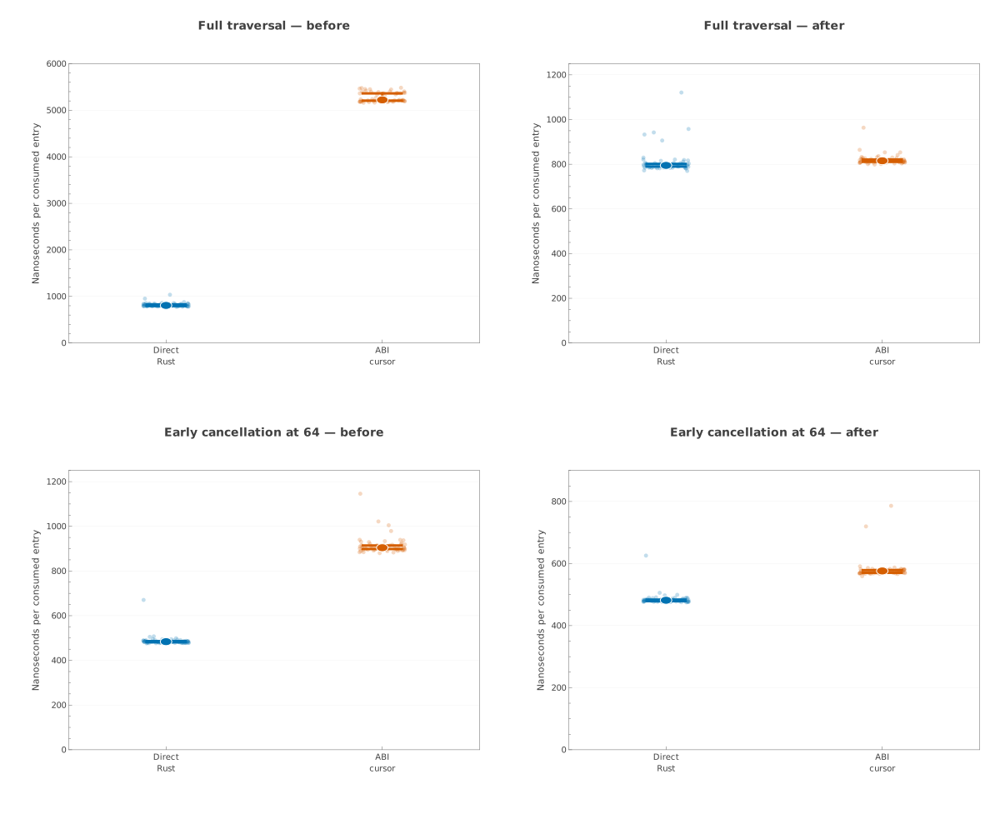

# Closing AMD uProf evidence

These are the final post-optimization, CLI-only AMD uProf 5.3.521.0 captures
for the Java-parity campaign. Both binaries were built with
`RUSTFLAGS='-C target-cpu=native'`, pinned to CPU 3 by `profile-headless.sh`,
and captured with the `hotspots` preset and call-stack depth 64.

| capture | exact binary SHA-256 | report SHA-256 |
|---|---|---|
| query | `ab520efc3dacc8891d60b0c1c16960670abd1ce2705f586dad88d29431f11a0a` | `fc8bc953a3d94b733b4bb4dc6b45628ba1d2ffe09d923335039c6becbe070810` |
| unordered construction | `7886db69c52dc8fb8ca04db290890a11b7b88573935562b05d22dda25f666808` | `c370d90ab6049bc500c5ad52b54b4db7ee38d75d4f061d96346407a888efa16e` |

The query capture contains 500 full 1,000-query `standard/d1/hits` passes.
The construction capture contains five warmups and 300 builds of the shuffled
79,343-term byte dictionary through `from_terms`. Each directory's
`environment.txt` records the exact command, machine, kernel, tool versions,
and affinity; `collect.log` retains program output; `report.csv` is the
detailed text report; and `uprof/` contains the raw session.

`uprof-profile-host-load.jsonl` is the topology ledger (SHA-256
`eb930eab8d7f2580ce23de2ff5a97c9923111c2e8045e523c49f1e764bcc8105`).
The first sample, taken immediately after compilation, was rejected at 11.49%
LLC-mean utilization and did not start a profile. The admitted retry and both
pre/post capture gates satisfy 10% selected-CPU, SMT-sibling, and LLC-mean
limits plus the 20% LLC-peer limit.

No GUI command was used. The wrapper invokes only `AMDuProfCLI collect` and
`AMDuProfCLI report`; the campaign's Heaptrack mode likewise mandates
`--record-only` and `heaptrack_print`.

## Collection traversal: allocation mechanism and admitted latency

The collection-contract campaign uses the release binary with SHA-256
`14240c311ad855fc950071a7ced5ed00663b1b3932cd90a18843c70713f7987c`.
The workload contains 65,536 deterministic prefix-sharing byte keys and drains
the same immutable snapshot eight times per arm. The checksum, work count,
binary digest, and topology admission agree for all 51 alternating pairs.

| arm | median ns/entry | deterministic 95% bootstrap interval | MAD |
|---|---:|---:|---:|
| owned Rust iterator | 811.545 | [808.213, 816.581] | 5.932 |
| borrowed visitor/fold | 782.140 | [777.504, 788.686] | 8.846 |

The paired median speedup of the visitor is 1.0405× (95% interval
[1.0370×, 1.0454×]); its geometric-mean speedup is 1.0440×. The small latency
difference, despite the much larger allocation difference below, establishes
that compact-graph transition traversal remains the dominant full-drain cost.
The visitor is consequently an important low-allocation surface, not a
substitute for the idiomatic owned iterator.

The isolated allocation census explains the memory mechanism without using
instrumented times as latency evidence:

| entries | arm | allocations | allocated bytes | peak live bytes |
|---:|---|---:|---:|---:|
| 4,096 | owned | 4,379 | 227,296 | 12,257 |
| 4,096 | visitor | 282 | 92,000 | 12,096 |
| 4,096 | materialized | 4,379 | 391,008 | 311,104 |
| 65,536 | owned | 69,914 | 3,303,264 | 12,385 |
| 65,536 | visitor | 4,378 | 1,140,576 | 12,352 |
| 65,536 | materialized | 69,915 | 5,924,704 | 4,796,480 |

At 65,536 entries, the reusable visitor performs about 16× fewer allocations
than owned iteration. Complete materialization has essentially the same
allocation count as owned iteration but intentionally retains all output,
raising peak live memory from about 12 KiB to 4.57 MiB. This is why every
foreign facade exposes a host-owned ordinary collection and a separate bounded,
deterministically closeable stream.

The accepted sample ledger, admission ledger, analyzer output, and allocation
census have SHA-256 digests `73cb2a93329d2c2deac92ff94c28228d2ca5a53797fcdb1e4a7f4e4020772287`,
`20a8a33bbdb46fa9cc3a8070bbe3876f6120c10536e4c092e4fd7e499ec2137f`,
`549d10c7cf4e7575b3a41cea9283da57c2f5eb7e05ddfa2cbbbd9ce13fcfbec0`,
and `aa06afcd36cf54e441f27f46922b0f0c2fc3eb3be453a09e7c06b4c39bb91c4b`,
respectively. The two `rejected-*` files preserve non-evidence from an earlier
contention episode. The ABI-256 warmup ledger is also intentionally retained
as rejected evidence: its cache-complex admission exceeded the strict limit,
so it must not contribute to a performance claim.

## Collection ABI: root cause, optimization, and confirmation

The first admitted ABI cohort used binary
`14240c311ad855fc950071a7ced5ed00663b1b3932cd90a18843c70713f7987c`.
It isolated a large full-scan regression even though both arms traversed the
same immutable DynamicDAWG revision and produced the same checksum:

| workload | direct Rust median | ABI median | direct/ABI paired median | ABI calls/invocation |
|---|---:|---:|---:|---:|
| full traversal, batch 256 | 807.133 ns/entry | 5,222.955 ns/entry | 0.1532× | 4,128 |
| cancel after 64 | 483.707 ns/entry | 904.314 ns/entry | 0.5351× | 6,144 |

The full-scan slowdown was 6.47×, but the boundary-call count alone did not
explain it. A headless AMD uProf 5.3.521.0 capture pinned to CPU 3 attributed
76.11% of sampled CPU time in the ABI arm to
`TraversalSnapshot::copy_node`. The entry cursor was routing a sequential,
trusted walk through the generic random-access ABI node arena. That arena is
necessary when a consumer supplies arbitrary node identifiers through the
graph interface, but it is redundant for an entry cursor whose entire state is
producer-owned.

The optimization adds one generic exact-dictionary snapshot stream. Dynamic
and persistent exact dictionaries now feed the entry cursor through the same
`ExactSnapshotEntryIterator` traversal selector used by the pure Rust
collection API. It retains the captured root once and selects the best compact
graph, native cursor, or owned-node fallback for that backend. The validated
random-access arena remains available for graph operations, and substring
families retain their distinct source-record streams. The specialization is
therefore shared across byte, Unicode-scalar, and `u64` domains without
exposing pointer cursors or weakening ABI validation.

The second admitted cohort used rebuilt binary
`aeeeffee5a5be3d6b6ebb3abfb9971ea987bf270e38d5c33ed27a403a443977c`:

| workload | direct Rust median | ABI median | direct/ABI paired median | ABI change from pre-optimization |
|---|---:|---:|---:|---:|
| full traversal, batch 256 | 794.779 ns/entry | 815.493 ns/entry | 0.9728× | 84.39% lower median latency |
| cancel after 64 | 481.679 ns/entry | 576.112 ns/entry | 0.8393× | 36.29% lower median latency |

The post-optimization full ABI traversal is 2.61% slower than direct owned
Rust by the ratio of medians; its paired geometric-mean ratio is 0.9879×. The
remaining early-cancel premium is 19.60% by the ratio of medians and represents
the fixed interface discovery, open, next, generation release, cancel, and
close lifecycle amortized over only 64 entries. The post-optimization uProf
capture contains no `copy_node` hotspot: native-frame traversal accounts for
37.71%, exact-iterator advancement for 14.83%, and bounded batch filling for
6.09%. These are the intended data-movement operations, not arena locking or
foreign-language allocation.

The pinned exploratory Criterion batch curve found no monotone batch-size
winner after removing the arena indirection:

| entries | batch 64 | batch 256 | batch 1,024 |
|---:|---:|---:|---:|
| 4,096 | 3.164 ms | 3.098 ms | 3.116 ms |
| 65,536 | 57.206 ms | 58.025 ms | 57.438 ms |

The intervals overlap at both sizes. Batch capacity is consequently a bounded
memory and host-call amortization policy, not a remaining native traversal
bottleneck; 256 remains the conservative default while every facade exposes a
bounded override. These Criterion rows are explicitly exploratory because
they are not alternating, topology-admitted pairs.

The figure was generated from the committed CSV and analyzer JSON with a
Wolfram Language kernel. Pale points are the 51 admitted observations in each
arm; the saturated point is the median and the capped line is its deterministic
bootstrap 95% confidence interval. Each panel has an explicit vertical scale,
so comparisons of absolute height are valid only within that panel.

The pre-optimization full and cancellation analysis files have SHA-256 digests
`3a8b93a82925ca56249242f7517d5c3391e2c8d49646519e3d9a2f490de3f33c`
and `41794c25deb666781b78fd18939aee0e3e555de473fb2e696e9678284e08e4b8`.
The post-optimization counterparts are
`3ad94686d2268da8aedab22c6150f8a3c9dff3f832cabd56572f7cfa9f22ad97`
and `254098dec6b7d05ac0c05759251c9f8f6057c32e910bba356c31b0fd91d9861a`;
the SVG digest is
`f8d8701e3ac5046918974770d74705f6b40550f1dbf44cfa3842a75c243e14fb`.
Every analyzer file embeds the exact sample and host-admission ledger digests.
Rejected ledgers remain explicitly named `rejected-*` and are excluded from
all statistics.

The three committed headless profile summaries preserve environment, command,
collector log, report log, and CSV report for direct traversal, ABI before,
and ABI after. Their report digests are
`4bca9a15bd76c6901e584f01a4f4a17e1205ec087476108ef9c9c2be860bcc29`,
`56b4b384e4b1cd751f10ea2374bae2061852c4c7dde7b83869e108ebd24b21a6`,
and `a8e17f183d68ded64c9e3596e922afe68edc07534d558060af4610358e76df03`.
Only `AMDuProfCLI collect` and `AMDuProfCLI report` were used; no profiler GUI
or Heaptrack window was opened.
