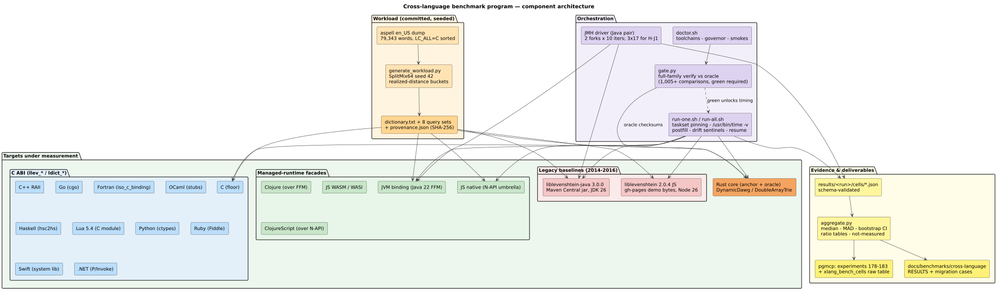
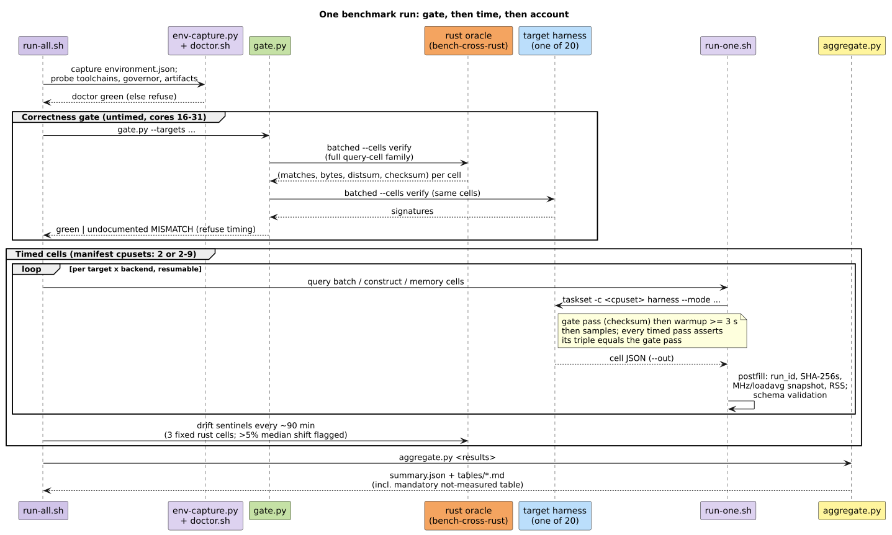

# Cross-Language Benchmark Program

Measured, reproducible performance comparison across three axes. Throughout,
*edit distance* means the minimum number of single-symbol edit operations
transforming one string into another: the **standard** algorithm admits
insert/delete/substitute (Levenshtein [1]; computed by the Wagner–Fischer
dynamic program [2]); **transposition** additionally admits adjacent-swap
under the *optimal string alignment* (OSA) restriction, after Damerau [3];
**merge_and_split** admits two-character merges and splits. A *DAWG*
(directed acyclic word graph) is the minimal acyclic automaton of a word
set, built incrementally from sorted input after Daciuk et al. [4]; a *DAT*
(double-array trie) is Aoe's cache-local read-optimized trie encoding [5].
Queries execute as lazy simulations of Levenshtein automata intersected
with the dictionary automaton, after Schulz–Mihov [6].

1. **Java vs Java** — the liblevenshtein-rust JVM binding
   (`io.vinarytree:liblevenshtein` 0.10.0, Java 22 FFM) against legacy
   [liblevenshtein-java 3.0.0](https://github.com/universal-automata/liblevenshtein-java)
   (`com.github.universal-automata:liblevenshtein:3.0.0`, Maven Central),
   both on the same JDK.
2. **JavaScript vs JavaScript** — the `@vinary-tree/liblevenshtein` Node
   facade (native N-API, WASM, and WASI backends) against the legacy
   compiled-CoffeeScript build 2.0.4, vendored byte-exactly from the
   `gh-pages` branch that served the original interactive demo, both on the
   same Node.
3. **Cross-language atlas** — the identical protocol over every language
   facade of the Rust implementation (C, C++, Python, Java, Clojure,
   JavaScript, ClojureScript, .NET, Go, Swift, Ruby, Fortran, OCaml,
   Haskell, Lua) plus the pure-Rust core, relating each binding's cost to
   the raw automaton.

This directory is self-contained: nothing in `bindings/`, `src/`, the
sibling repos, or CI is modified by the program.

## Architecture



One committed workload feeds twenty target harnesses across four boundary
kinds (pure Rust, raw C ABI, managed-runtime facades, and the two legacy
baselines); a correctness gate against the Rust oracle strictly precedes
every timing run; a single runner pins CPUs, post-fills provenance, and
accounts every cell; a single aggregator renders the evidence.



## Layout

| Path | Contents |
|---|---|
| `harnesses/common/PROTOCOL.md` | **The normative spec** — CLI contract, timing loop, checksum, fairness rules. Start here. |
| `workload/` | Committed inputs: `dictionary.txt` (79,343 aspell en_US words, byte-sorted), `queries/*.txt` (8 primary sets × 1000), `queries-meta/*.jsonl` (audit trail), `provenance.json` (package versions + SHA-256s), `generate_workload.py` (deterministic regenerator, SplitMix64 seed 42). |
| `schema/` | `result.schema.json` (one JSON per cell), `environment.schema.json` (one per run). |
| `harnesses/<lang>/` | One harness per language, each implementing PROTOCOL.md. |
| `legacy/javascript/vendor/` | The vendored 2.0.4 legacy JS + `provenance.json` + license. |
| `scripts/` | `doctor.sh` (readiness), `run-one.sh` / `run-all.sh` (orchestration), `gate.py` (correctness pre-gate vs the Rust oracle), `aggregate.py` (stats + tables), `jmh_to_result.py`, `env-capture.sh`, `vendor-legacy-js.sh`. |
| `targets.tsv` | Declarative target manifest (backends, cpusets, phases). |
| `results/` | Git-ignored; timestamped run directories. |
| `.stage/` | Git-ignored; build staging (Haskell pkg-config prefix, Lua modules, compiled harness binaries). |

## Quickstart

```bash
# 0. one-time native builds (release, target-cpu=native)
( cd ../..            && RUSTFLAGS="-C target-cpu=native" cargo build --locked --release --features native-bindings-full )
( cd ../../../libdictenstein && RUSTFLAGS="-C target-cpu=native" cargo build --release --features ffi )

# 1. readiness: toolchains, artifacts, governor, smoke queries
scripts/doctor.sh

# 2. correctness gate, then the full timed matrix (resumable)
scripts/run-all.sh --results results/$(date +%Y%m%d_%H%M%S)

# 3. aggregate + render tables
scripts/aggregate.py results/<run-id>
```

Every raw log is teed into the results directory; `environment.json` pins
toolchain versions, git commits, artifact SHA-256s, governor, and cpusets.

## Methodology in one paragraph

All harnesses read the same two committed input files, assert the
dictionary's byte-sortedness, build the dictionary once (timed separately in
`construct` mode), then run identical warmup-and-sample loops where one
sample is one full pass over the query set with every cursor fully drained
(PROTOCOL.md §5–6). Correctness precedes timing: `gate.py` compares every
target's order-insensitive FNV-1a64 result checksum against the Rust oracle
across the full query-cell family and refuses timing on mismatch; each timed pass re-asserts
its match-count/byte/distance triple against the cell's untimed gate pass.
CPU pinning, the performance governor, fixed JVM heaps, JMH forks for the
Java pair, and per-cell frequency snapshots control the environment; results
report median/MAD/p10/p90 with bootstrap CIs, never bare means.

## Workload provenance

`workload/dictionary.txt` is the aspell en_US master dump
(`aspell 0.60.8.2-2`, `aspell-en 2026.02.25-1`), expanded, filtered to
`^[a-z]+$`, byte-sorted (`LC_ALL=C sort -u` equivalent): 79,343 words.
Query sets are seeded-random samples and mutations, bucketed by *realized*
edit distance verified with reference dynamic programs — `std-dK` under
plain Levenshtein [2], `tr-dK` under restricted-Damerau (OSA, matching
every implementation's `transposition` algorithm). Mutants that are
themselves dictionary words stay in, labeled `real_word` in
`queries-meta/`. The empty string never occurs (legacy Java 3.0.0's
empty-string bug is designed out rather than special-cased).
`generate_workload.py --verify` detects any drift against `provenance.json`;
regeneration is byte-identical by construction.

The program's pseudorandomness is SplitMix64 [7] with base seed 42; each
query set draws from its own derived stream. One step advances the state
by the golden-gamma constant and finalizes with two xor-shift multiplies
(all arithmetic mod $`2^{64}`$):

```math
s' = s + \mathrm{0x9E3779B97F4A7C15}, \qquad
z_1 = (s' \oplus (s' \gg 30)) \cdot \mathrm{0xBF58476D1CE4E5B9},
```
```math
z_2 = (z_1 \oplus (z_1 \gg 27)) \cdot \mathrm{0x94D049BB133111EB}, \qquad
\mathrm{output} = z_2 \oplus (z_2 \gg 31).
```

## Result checksum

Every implementation must reproduce the oracle's result multiset exactly.
The order-insensitive cell checksum is a wrapping sum of per-match
FNV-1a-64 hashes [8]. With FNV offset
$`h_0 = \mathrm{0xCBF29CE484222325}`$, prime
$`p = \mathrm{0x100000001B3}`$, and byte stream
$`b_1 b_2 \ldots b_n = \mathrm{utf8}(t) \parallel \mathrm{0x00} \parallel \mathrm{LE64}(d)`$
for a match with term $`t`$ and distance $`d`$:

```math
h_i = (h_{i-1} \oplus b_i) \cdot p \bmod 2^{64}, \qquad
\mathrm{entry}(t, d) = h_n, \qquad
\mathrm{checksum} = \sum_{(t,d)} \mathrm{entry}(t, d) \bmod 2^{64}.
```

Addition (rather than XOR) preserves multiset multiplicity: duplicate
matches accumulate instead of cancelling. Statistics over timed samples
report medians with 95 % bootstrap confidence intervals [9] (10,000
resamples, SplitMix64 seed 42), never bare means.

## Fairness commitments

- Same pre-sorted dictionary for everyone; legacy builders get their
  documented `isSorted=true` fast path; sorting is excluded from
  construction timing on all sides.
- Legacy JS runs with `sort_candidates(false)` — the new stack returns
  traversal order, so result sorting would be uncompensated extra work.
- Timed loops carry an O(1) accumulator triple, not per-byte hashing;
  checksums are computed in untimed gate passes only.
- Both sides of each head-to-head share one JDK/Node, one cpuset, one heap
  configuration; deviations from language defaults are pinned in PROTOCOL.md
  §10 and echoed in each result's `notes`.
- A target that fails to build or gate lands as an explicit `failed` /
  documented-mismatch row in the report — never a silent omission.

## Deliverables

Rendered into `docs/benchmarks/cross-language/` (results + the Java and
JavaScript migration cases) and `docs/scientific-ledger/` (preregistered
hypotheses → measurements → verdicts, backed by pgmcp experiment records).

## References

1. V. I. Levenshtein. *Binary codes capable of correcting deletions,
   insertions, and reversals.* Soviet Physics Doklady 10(8):707–710, 1966.
2. R. A. Wagner and M. J. Fischer. *The string-to-string correction
   problem.* Journal of the ACM 21(1):168–173, 1974.
   [doi:10.1145/321796.321811](https://doi.org/10.1145/321796.321811)
3. F. J. Damerau. *A technique for computer detection and correction of
   spelling errors.* Communications of the ACM 7(3):171–176, 1964.
   [doi:10.1145/363958.363994](https://doi.org/10.1145/363958.363994)
4. J. Daciuk, S. Mihov, B. W. Watson, R. E. Watson. *Incremental
   construction of minimal acyclic finite-state automata.* Computational
   Linguistics 26(1):3–16, 2000.
   [doi:10.1162/089120100561601](https://doi.org/10.1162/089120100561601)
5. J. Aoe. *An efficient digital search algorithm by using a double-array
   structure.* IEEE Transactions on Software Engineering 15(9):1066–1077,
   1989. [doi:10.1109/32.31365](https://doi.org/10.1109/32.31365)
6. K. U. Schulz and S. Mihov. *Fast string correction with Levenshtein
   automata.* International Journal on Document Analysis and Recognition
   5(1):67–85, 2002.
   [doi:10.1007/s10032-002-0082-8](https://doi.org/10.1007/s10032-002-0082-8)
7. G. L. Steele Jr., D. Lea, C. H. Flood. *Fast splittable pseudorandom
   number generators.* OOPSLA 2014, 453–472.
   [doi:10.1145/2660193.2660195](https://doi.org/10.1145/2660193.2660195)
8. G. Fowler, L. C. Noll, K.-P. Vo, D. Eastlake, T. Hansen. *The FNV
   non-cryptographic hash algorithm.* IETF Internet-Draft
   draft-eastlake-fnv (work in progress).
9. B. Efron. *Bootstrap methods: another look at the jackknife.* Annals of
   Statistics 7(1):1–26, 1979.
   [doi:10.1214/aos/1176344552](https://doi.org/10.1214/aos/1176344552)
