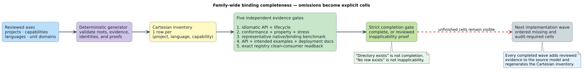

# Family-wide binding completeness

This directory contains two distinct forms of evidence:

- [`completeness-matrix.tsv`](completeness-matrix.tsv) audits the functions of
  the liblevenshtein facades that already exist; and
- [`family-completeness-matrix.tsv`](family-completeness-matrix.tsv) prevents a
  missing project, language, capability, package, idiom, or verification lane
  from disappearing outside a repository-local model.

The first matrix answers “how much of liblevenshtein's C surface does this
facade map?” The family matrix answers the prior question: “which public
capabilities must exist naturally in every target language across the whole
Vinary Tree family, and what evidence proves each cell?” Neither matrix can
substitute for the other.



## Vocabulary and row identity

A **capability** is a user-visible semantic unit such as a retained resource,
dictionary snapshot, lattice operation, edit automaton, semiring, or weighted
finite-state transducer (WFST). A **host idiom** is the target language's
familiar protocol for that capability—for example Java `AutoCloseable` and
`Collection`, C# `IDisposable` and `IEnumerable`, Python context managers and
iterators, or Raku `NativeCall` plus `Iterable`.

One matrix row has the stable identity
$`(p, l, c) \in P \times L \times C_p`$, where $`P`$ is the project set,
$`L`$ is the language set, and $`C_p`$ is project $`p`$'s public capability
catalog. The initial inventory contains 8 projects, 21 languages—including
native Rust and Raku—and 64 project-owned capabilities, producing
$`21 \sum_{p \in P} |C_p| = 1{,}344`$ explicit cells.

Each row also records:

- unit domains, including byte, Unicode scalar, vocabulary identifier, and
  unsigned 64-bit token domains where applicable;
- the language-native collection, ownership, error, and extension idioms;
- the canonical package manager;
- deterministic lifecycle expectations;
- conformance, benchmark, API-documentation, and fresh installed-consumer
  states; and
- source evidence or a reviewed applicability proof.

## State meanings

| State | Meaning |
|---|---|
| `missing` | No declared facade evidence exists. This is an implementation requirement, never an implicit exemption. |
| `audit-required` | A facade or native surface exists, but capability-level API, idiom, conformance, performance, documentation, and installed-package parity have not all been proved. |
| `review-required` | A distribution-only repository may be redundant for this language, but the architectural proof has not yet been reviewed. |
| `inapplicable` | A reviewed proof explains why direct exposure would be semantically wrong or duplicative; the generator rejects this state without a real proof file. |
| `complete` | The capability is implemented idiomatically and its conformance, benchmark, documentation, and fresh-consumer evidence are all complete. |

The strict completion gate accepts only `complete` and proved `inapplicable`
cells. The ordinary generator is intentionally usable during the campaign: it
requires the Cartesian inventory to remain exhaustive while preserving every
unfinished state as visible work.

## Generation and verification

[`family-bindings.json`](family-bindings.json) is the reviewed input model.
[`generate-family-completeness-matrix.py`](../../scripts/generate-family-completeness-matrix.py)
validates project roots and evidence paths, rejects duplicate or unknown cells,
requires Rust and Raku to remain explicit languages, and emits the TSV in a
deterministic project/capability/language order.

```sh
# Regenerate after reviewing a model or evidence change.
python3 scripts/generate-family-completeness-matrix.py

# CI-shaped freshness and structural check.
python3 scripts/generate-family-completeness-matrix.py --check

# Final epic gate; expected to fail while any real work remains.
python3 scripts/generate-family-completeness-matrix.py \
  --check --require-complete
```

The literate generation algorithm is:

```text
for each project p in the reviewed family model:
    validate that p's root and every declared evidence path exist
    for each public capability c owned by p:
        for each required language l:
            emit exactly one cell (p, l, c)
            if an override says inapplicable:
                require a reviewed proof file
            preserve implementation and all four evidence dimensions

reject overrides that name cells outside the Cartesian product
compare generated bytes with the committed matrix
under --require-complete, reject every unproved or unfinished cell
```

## Advancing a cell

Do not change `missing` to `complete` merely because a directory or wrapper
exists. First audit the whole capability against the native Rust semantics and
the language's intended idioms. Then add shared differential fixtures,
property and lifecycle tests, representative benchmarks, complete API and
usage documentation, package-native validation, and a clean consumer that
resolves the exact public artifact. Record those evidence paths in a
`cellOverrides` entry before changing each dimension to `complete`.

When direct exposure is genuinely redundant, add an architectural proof that
names the alternative owner, explains why another facade would create two
identities or conflicting lifecycle semantics, and identifies the conformance
tests that protect the delegation. Only then may the row become
`inapplicable`.
