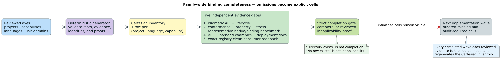

# Raku family capability audit

This is the reviewed evidence for Raku cells in the
[family capability model](family-bindings.json). A package directory proves
that a distribution exists; it does **not** prove that every native capability
is callable from Raku. The [matrix generator](../../scripts/generate-family-completeness-matrix.py)
now requires a literal, capability-specific symbol in the owning Raku module
before it emits `audit-required`. Without that positive evidence it emits
`missing`, even when the distribution itself exists. `missing` means “no
independently evidenced Raku API for this capability,” not “the native library
does not implement it” or “the feature is permanently inapplicable.” No Raku
cell is declared `complete` merely because a source symbol exists.
The generated Raku slice has 301 cells: 97 `audit-required`, 198 `missing`,
and six distribution-only `review-required`; none is promoted to `complete`.



## Audit method and evidence grades

For each public native capability, the model names an exact Raku module and
symbol if a Raku-facing entry point or low-level ABI record is present. The
generator verifies that the source file exists inside `bindings/raku` and
contains the named symbol. A low-level record is only a starting point: it
does not establish an idiomatic high-level operation. `audit-required` keeps
that distinction visible until all five independent gates are demonstrated:
public API/host idiom, behavioral conformance, bounded performance evidence,
capability-specific documentation, and an installed-package consumer. The
source-tree tests and benchmarks listed below are useful evidence, but cannot
alone satisfy an installed-consumer or release gate.

```text
for each project capability c and the Raku language:
    if a reviewed source symbol for c exists in the owning Raku package:
        record c as audit-required and retain its exact source anchor
    else:
        record c as missing, not inapplicable
    only promote c to complete after independent API, test, benchmark,
        documentation, packaging, and fresh-consumer evidence is linked
```

The public Raku modules inspected are
`vinary-tree-interop/bindings/raku/lib/Vinary/Tree/Interop.rakumod`,
`llattice/bindings/raku/lib/LLattice.rakumod`,
`libdictenstein/bindings/raku/lib/Libdictenstein.rakumod`,
[`Liblevenshtein`](../../bindings/raku/lib/Liblevenshtein.rakumod),
`lling-llang/bindings/raku/lib/Lling/Llang.rakumod`, and
`duallity/bindings/raku/lib/Duallity.rakumod`. The
[`family-bindings.json`](family-bindings.json) `rakuCapabilityEvidence` entries
are the machine-checked symbol-level index. Raku source tests live in each
package's `t/` directory; benchmark scripts, where present, live in
`bindings/raku/benchmark/`. They are not claimed as per-capability proof until
their tested operations and controls are reviewed individually.

## Domain audit: the wire contract matters

The interop C header declares three unit domains—byte, Unicode scalar, and
unsigned 64-bit token—and seven scalar weight domains: tropical, log,
probability, arctic, signed tropical, count, and Boolean, all represented by
the current scalar-WFST wire shape. The Raku module exports those enum
discriminants and the dictionary/WFST domain inspection methods. This is
symbol-level evidence for recognition and dispatch, **not** proof that every
project algorithm accepts every unit/weight combination. The matrix therefore
keeps each domain independently auditable and leaves its five completion gates
open.

The value-domain story differs materially. The v1 header declares unit,
optional-u64, and bytes values, but its dictionary vtable has only
`node_value_u64` in `vinary-tree-interop/include/vinary_tree_interop.h`
and its entry-batch view has `const uint64_t* values`. Raku's `Dictionary.value`
likewise reads `OptionalU64`. The `BYTES => 2` enum is only a declaration:
there is no byte-value getter, length/lease contract, or byte-valued batch
representation to consume faithfully. The `value-domain-bytes` Raku cell is
therefore `missing` for a **shared v1 ABI structural reason**, not because of
an omitted Raku wrapper or a permissible reinterpretation of u64 storage.
The tracked remedy is `vinary-tree-interop-byte-value-dictionary-abi-parity`,
decomposed into `interop-byte-values-v2-contract`,
`interop-byte-values-v2-native`, and `interop-byte-values-v2-bindings`. This
audit does not invent a v1 reinterpretation or claim that those tasks are done.

## Project-by-project boundary findings

| Project | Positively evidenced Raku surface | Visible omissions or qualifications |
|---|---|---|
| Vinary Tree Interop | Retained resources; interface lookup; dictionary traversal/snapshots/entries; scalar WFSTs; lattice operations; raw semiring vtable families and domain enums. | Fused visit, compact graph, snapshot identity, and semiring entries currently include low-level ABI records, not necessarily ergonomic operations. Byte-valued dictionary values have the shared v1 wire gap. A customer-authored callback-provider lifecycle has no positive high-level Raku evidence. |
| llattice | `Lattice` role, `MaxMin`, Boolean, optional, finite-set implementations, and a host-provider shim. | `MaxMin` accepts Raku `Real`, so integral/floating classifications remain audit-required pending type-specific tests; vector-content lattice has no Raku class. |
| libdictenstein | Native dictionary constructors for Dynamic DAWG, SCDawg, double-array trie, persistent ARTrie/vocabulary; `Associative`/`Iterable`; snapshot, substring lookup, and materialized algebra. | Several constructors do not prove a general backend-factory API, so that cell is missing. Exported union/intersection/difference methods do not imply zipper traversal or zipper-specific operations. Suffix and PathMap backends, serialization, Bloom filter, and custom resource-provider APIs lack positive Raku symbols. |
| liblevenshtein | Domain-preserving standalone distance families, algorithm-selected dictionary transducer queries, phonetic pattern/rule handles, query cursors, a native query-cache handle, and standalone generalized-operation/universal-variant automata with complete-pair and bounded online-prefix APIs. | The new generalized and universal cells are `audit-required` until independent cross-language qualification, despite direct source, example, and differential Raku evidence. `QueryCache.new` exposes capacity controls but no named eviction strategy, so the TinyLFU/SIEVE cell is missing. Time-series, WallBreaker, scoring, and broader cache-policy families lack separate Raku APIs; FZF belongs to duallity rather than this package. |
| lling-llang | Scalar WFST builder/composition, Raku-implementable WFST and semiring provider roles, semiring operations, lattice-value bridge, typed budgets/cancellation. | These do not imply multitape, subsequential, tree, path-search, training, ASR/CTC, CFG/WPDS, or optimization APIs. API revision 11 adds weighted acceptor intersection in `lling-llang` commit `0576989e`; generated Raku ABI metadata names the `_refs` entry point, but the public `Lling::Llang` module has no callable high-level intersection wrapper or behavioral test, so its cell remains `missing`. This is not generic product or difference. |
| duallity | Dictionary-to-WFST adapter and selectors for Levenshtein, universal, generalized, generalized-phonetic digraph, and FZF kinds. | The generalized-phonetic selector is not the native phonetic NFA/rewrite/pipeline family. WallBreaker and FZF configuration/statistics/cache controls also lack Raku-facing constructors. |

No row above is an architectural proof of `inapplicable`; those require a
separate reviewed proof and remain implementation or qualification work.

## Reproduction and limitations

Regenerate the [family matrix](family-completeness-matrix.tsv) with
`python3 scripts/generate-family-completeness-matrix.py`; use `--check` to
confirm the committed TSV is fresh. When developing against separate
lling-llang or duallity integration worktrees, point the generator's
`LLING_LLANG_ROOT` and `DUALLITY_ROOT` at those checkouts for source-symbol
validation, but commit only canonical repository-relative evidence paths.
The generator takes those paths from each project's modeled sibling name or
`evidenceRoot`, never from the current integration worktree's directory name.
The lling-llang intersection inventory above was frozen against
`0576989e23b2ff10ff59c23e1495f595e4c8cc9f` on its integration branch;
the primary checkout had not yet incorporated that commit when this audit ran.
Do not infer results for the eventual installed release from a source-tree
test. In particular, Fez publication, zef installation into an isolated
consumer, per-capability benchmarks, and documentation deployment are later
leaves and are not performed by this audit.
