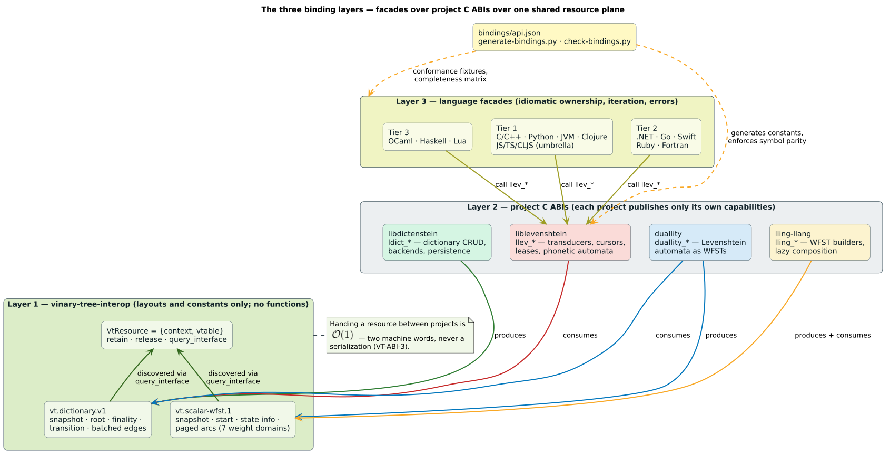

# C and C++ package

Release archives contain the stable C17 header, the header-only C++20 RAII
facade, shared and static native libraries, a relocatable CMake config package,
and `pkg-config` metadata. C23 and C++23 consumers are compile-checked as well.

```cmake
find_package(vinary-tree-interop CONFIG REQUIRED)
find_package(liblevenshtein CONFIG REQUIRED)
target_link_libraries(my_target PRIVATE liblevenshtein::liblevenshtein)
```

`liblevenshtein::liblevenshtein` selects the shared library by default. Set
`LIBLEVENSHTEIN_LINKAGE=STATIC` before `find_package` for a fully static native
link, or name `liblevenshtein::shared` / `liblevenshtein::static` explicitly.
The static target propagates its platform system libraries. The equivalent
command-line interface is `pkg-config liblevenshtein` for shared linking and
`pkg-config --static liblevenshtein` for static linking.

The shared form must remain available to the process at runtime. The static
form has no runtime dependency on `liblevenshtein`; only ordinary operating
system libraries remain.

Construct dictionaries through libdictenstein (or implement
`vt.dictionary.v1` as a host provider), then pass the two-word `VtResource` to
the liblevenshtein transducer. The cursor retains its query-start revision and
returns leased spans backed by contiguous term arenas; release each batch before
advancing or destroying the cursor.

<!-- BEGIN GENERATED BINDING OPERATIONS; DO NOT EDIT -->

## Support and package contract

| Property | Contract |
|---|---|
| Binding | C and C++ |
| Languages/runtime | C17/C23 and C++20/C++23 |
| Support tier | Tier 1 |
| Distribution | CMake package `liblevenshtein` and `pkg-config` module `liblevenshtein` |
| Native boundary | The C surface calls `llev_*` directly; the C++ header adds move-only RAII and exceptions without another native boundary. |
| Canonical facade source | [`include/liblevenshtein.h and include/liblevenshtein.hpp`](../../include/liblevenshtein.h and include/liblevenshtein.hpp) |

The support tier controls release gating, not semantic quality: every tier has
the same snapshot, ownership, status, and ABI compatibility laws. Consult the
[binding architecture](../../docs/language-bindings.md) before implementing a custom provider
and the [family hub](../../docs/bindings/README.md) when combining independently packaged projects.



## Executable example and verification

The repository's canonical executable example is
[`bindings/cpp/tests/snapshot.cpp`](../../bindings/cpp/tests/snapshot.cpp). It exercises the same public package a user
installs and is run by the binding CI with:

```sh
cmake -S bindings/cpp/tests/package -B target/cpp-package && cmake --build target/cpp-package && ctest --test-dir target/cpp-package
```

Examples deliberately construct or receive resources through public project
packages. They never import private Rust modules, depend on object layout, or
reach behind the stable C/resource ABIs.

## Public API and data model

The idiomatic facade groups the stable surface into these concepts:

| Concept | Semantics |
|---|---|
| Dictionary resource | A retained `vt.dictionary.v1` capability. Construction and mutation belong to a producer such as libdictenstein. |
| Transducer | Immutable query configuration plus a retained dictionary provider; construction is constant-time with respect to dictionary size. |
| Query cursor | A one-shot traversal over the immutable dictionary revision captured at query start. |
| Match/batch | Owned matches are stable host values; a borrowed batch is valid only inside its documented callback or lease interval. |

### Automaton selection

| Algorithm | Edit semantics | Metric? | Typical use |
|---|---|---:|---|
| Standard | Insert, delete, and substitute | yes | General spelling correction |
| Transposition | Optimal string alignment with adjacent swaps | no | Typographical swaps when metric-tree laws are unnecessary |
| Merge and split | Standard edits plus symmetric two-to-one and one-to-two edits | yes | Optical character recognition and segmentation errors |
| Damerau-Levenshtein | Unrestricted, history-composable adjacent transpositions | yes | True Damerau matching and metric indexes |

The transposition and unrestricted Damerau variants are deliberately distinct:
for example, optimal string alignment assigns distance 3 from `CA` to `ABC`,
while unrestricted Damerau-Levenshtein assigns distance 2. Select the algorithm
when constructing the transducer; all query domains and snapshot laws remain the
same.

C spans carry explicit lengths. C++ overloads accept byte, Unicode-scalar, and `uint64_t` views without sentinel termination. Empty terms, embedded zero bytes, non-ASCII text, and the full
unsigned 64-bit identifier range are represented explicitly; no facade may use
a sentinel value that removes a valid input from the domain.

### Facade symbol index

This table is generated from the same exhaustive model as the binding
conformance gate. A public symbol may implement several ABI operations when
the host language expresses domain or lifecycle choices with overloads,
variants, protocols, or methods.

| Public symbol | Backing native operation(s) | Capability |
|---|---|---|
| `llev_abi_version` | `llev_abi_version` | ABI compatibility and feature discovery |
| `llev_api_revision` | `llev_api_revision` | ABI compatibility and feature discovery |
| `llev_build_features` | `llev_build_features` | ABI compatibility and feature discovery |
| `llev_damerau_distance` | `llev_damerau_distance` | standalone exact or thresholded distance |
| `llev_damerau_distance_bytes` | `llev_damerau_distance_bytes` | standalone exact or thresholded distance |
| `llev_damerau_distance_bytes_threshold` | `llev_damerau_distance_bytes_threshold` | standalone exact or thresholded distance |
| `llev_damerau_distance_threshold` | `llev_damerau_distance_threshold` | standalone exact or thresholded distance |
| `llev_damerau_distance_u64` | `llev_damerau_distance_u64` | standalone exact or thresholded distance |
| `llev_damerau_distance_u64_threshold` | `llev_damerau_distance_u64_threshold` | standalone exact or thresholded distance |
| `llev_distance` | `llev_distance` | standalone exact or thresholded distance |
| `llev_distance_bytes` | `llev_distance_bytes` | standalone exact or thresholded distance |
| `llev_distance_bytes_threshold` | `llev_distance_bytes_threshold` | standalone exact or thresholded distance |
| `llev_distance_threshold` | `llev_distance_threshold` | standalone exact or thresholded distance |
| `llev_distance_u64` | `llev_distance_u64` | standalone exact or thresholded distance |
| `llev_distance_u64_threshold` | `llev_distance_u64_threshold` | standalone exact or thresholded distance |
| `llev_generalized_automaton_evaluate_utf8` | `llev_generalized_automaton_evaluate_utf8` | runtime generalized-automaton lifecycle and prefix evaluation |
| `llev_generalized_automaton_free` | `llev_generalized_automaton_free` | runtime generalized-automaton lifecycle and prefix evaluation |
| `llev_generalized_automaton_new` | `llev_generalized_automaton_new` | runtime generalized-automaton lifecycle and prefix evaluation |
| `llev_generalized_online_advance` | `llev_generalized_online_advance` | runtime generalized-automaton lifecycle and prefix evaluation |
| `llev_generalized_online_free` | `llev_generalized_online_free` | runtime generalized-automaton lifecycle and prefix evaluation |
| `llev_generalized_online_new_utf8` | `llev_generalized_online_new_utf8` | runtime generalized-automaton lifecycle and prefix evaluation |
| `llev_generalized_online_observation` | `llev_generalized_online_observation` | runtime generalized-automaton lifecycle and prefix evaluation |
| `llev_merge_and_split_distance` | `llev_merge_and_split_distance` | standalone merge-and-split distance |
| `llev_merge_and_split_distance_bytes` | `llev_merge_and_split_distance_bytes` | standalone merge-and-split distance |
| `llev_merge_and_split_distance_bytes_threshold` | `llev_merge_and_split_distance_bytes_threshold` | standalone merge-and-split distance |
| `llev_merge_and_split_distance_threshold` | `llev_merge_and_split_distance_threshold` | standalone merge-and-split distance |
| `llev_merge_and_split_distance_u64` | `llev_merge_and_split_distance_u64` | standalone merge-and-split distance |
| `llev_merge_and_split_distance_u64_threshold` | `llev_merge_and_split_distance_u64_threshold` | standalone merge-and-split distance |
| `llev_owned_string_free` | `llev_owned_string_free` | owned result-string release |
| `llev_phonetic_pattern_compile_llre` | `llev_phonetic_pattern_compile_llre` | compiled phonetic-pattern lifecycle and matching |
| `llev_phonetic_pattern_compile_regex` | `llev_phonetic_pattern_compile_regex` | compiled phonetic-pattern lifecycle and matching |
| `llev_phonetic_pattern_free` | `llev_phonetic_pattern_free` | compiled phonetic-pattern lifecycle and matching |
| `llev_phonetic_pattern_matches` | `llev_phonetic_pattern_matches` | compiled phonetic-pattern lifecycle and matching |
| `llev_phonetic_pattern_size` | `llev_phonetic_pattern_size` | compiled phonetic-pattern lifecycle and matching |
| `llev_phonetic_rules_apply` | `llev_phonetic_rules_apply` | phonetic rule-set lifecycle and rewriting |
| `llev_phonetic_rules_builtin` | `llev_phonetic_rules_builtin` | phonetic rule-set lifecycle and rewriting |
| `llev_phonetic_rules_free` | `llev_phonetic_rules_free` | phonetic rule-set lifecycle and rewriting |
| `llev_phonetic_rules_len` | `llev_phonetic_rules_len` | phonetic rule-set lifecycle and rewriting |
| `llev_phonetic_rules_parse` | `llev_phonetic_rules_parse` | phonetic rule-set lifecycle and rewriting |
| `llev_query_cursor_reduce` | `llev_query_cursor_reduce` | streaming result traversal and batch leases |
| `llev_string_array_free` | `llev_string_array_free` | legacy owned-string plumbing |
| `llev_string_dup` | `llev_string_dup` | legacy owned-string plumbing |
| `llev_string_free` | `llev_string_free` | legacy owned-string plumbing |
| `llev_transducer_query_pattern` | `llev_transducer_query_pattern` | phonetic-pattern dictionary query |
| `llev_transducer_unit_domain` | `llev_transducer_unit_domain` | transducer lifecycle, snapshot, or domain metadata |
| `llev_true_damerau_distance` | `llev_true_damerau_distance` | standalone true-Damerau distance |
| `llev_true_damerau_distance_bytes` | `llev_true_damerau_distance_bytes` | standalone true-Damerau distance |
| `llev_true_damerau_distance_bytes_threshold` | `llev_true_damerau_distance_bytes_threshold` | standalone true-Damerau distance |
| `llev_true_damerau_distance_threshold` | `llev_true_damerau_distance_threshold` | standalone true-Damerau distance |
| `llev_true_damerau_distance_u64` | `llev_true_damerau_distance_u64` | standalone true-Damerau distance |
| `llev_true_damerau_distance_u64_threshold` | `llev_true_damerau_distance_u64_threshold` | standalone true-Damerau distance |
| `llev_universal_automaton_evaluate` | `llev_universal_automaton_evaluate` | universal-automaton lifecycle, policies, and prefix evaluation |
| `llev_universal_automaton_free` | `llev_universal_automaton_free` | universal-automaton lifecycle, policies, and prefix evaluation |
| `llev_universal_automaton_new` | `llev_universal_automaton_new` | universal-automaton lifecycle, policies, and prefix evaluation |
| `llev_universal_online_advance` | `llev_universal_online_advance` | universal-automaton lifecycle, policies, and prefix evaluation |
| `llev_universal_online_free` | `llev_universal_online_free` | universal-automaton lifecycle, policies, and prefix evaluation |
| `llev_universal_online_new` | `llev_universal_online_new` | universal-automaton lifecycle, policies, and prefix evaluation |
| `llev_universal_online_observation` | `llev_universal_online_observation` | universal-automaton lifecycle, policies, and prefix evaluation |
| `query_cache::clear` | `llev_query_cache_clear` | project ABI operation |
| `query_cache::query` | `llev_query_cache_query_utf8`, `llev_query_cache_query_bytes`, `llev_query_cache_query_u64` | project ABI operation |
| `query_cache::reset_stats` | `llev_query_cache_reset_stats` | project ABI operation |
| `query_cache::stats` | `llev_query_cache_stats` | project ABI operation |
| `query_cache::~query_cache` | `llev_query_cache_free` | project ABI operation |
| `vinary_tree::liblevenshtein::batch::~batch` | `llev_query_cursor_release_batch` | streaming result traversal and batch leases |
| `vinary_tree::liblevenshtein::detail::cursor_state::~cursor_state` | `llev_query_cursor_free` | streaming result traversal and batch leases |
| `vinary_tree::liblevenshtein::error` | `llev_last_error_message` | typed failure diagnostics |
| `vinary_tree::liblevenshtein::query_cache` | `llev_query_cache_new` | project ABI operation |
| `vinary_tree::liblevenshtein::query_cursor::next_batch` | `llev_query_cursor_next_batch` | streaming result traversal and batch leases |
| `vinary_tree::liblevenshtein::transducer` | `llev_transducer_new` | transducer lifecycle, snapshot, or domain metadata |
| `vinary_tree::liblevenshtein::transducer::query` | `llev_transducer_query_utf8`, `llev_transducer_query_bytes`, `llev_transducer_query_u64` | domain-preserving dictionary query |
| `vinary_tree::liblevenshtein::transducer::~transducer` | `llev_transducer_free` | transducer lifecycle, snapshot, or domain metadata |

### Public types and traversal protocols

| Facade type or protocol | Purpose | Exposure note |
|---|---|---|
| `vinary_tree::liblevenshtein::error::status` | Typed native status or error carrier | Public facade type |
| `vinary_tree::liblevenshtein::algorithm` | Edit-distance algorithm selection | Public facade type |
| `vinary_tree::liblevenshtein::query_order` | Result traversal ordering | Public facade type |
| `LlevPhoneticRuleSetKind` | Built-in phonetic rule-set selection | C API passthrough via the included liblevenshtein.h |
| `LlevOperationApplicability` | Generalized-operation applicability selection | C API passthrough via the included liblevenshtein.h |
| `LlevUniversalVariant` | Universal edit-automaton variant selection | C API passthrough via the included liblevenshtein.h |
| `vinary_tree::liblevenshtein::query_cursor::next_batch` | One-shot owned-result iteration | Public facade protocol |
| `llev_query_cursor_reduce` | Bounded batch/reducer traversal | C API passthrough via the included liblevenshtein.h |

Native operations omitted from the public-symbol table are deliberately
encapsulated by the facade. The generated completeness matrix records every
such operation with its reviewed rationale; an unreasoned absence fails CI.

### Intended usage paths

| Need | Use | Rationale |
|---|---|---|
| Repeated fuzzy queries | Reuse one transducer and create a fresh cursor per query | Construction retains a provider in constant time; each cursor captures its own immutable revision. |
| Ordinary streaming | The facade iterator protocol | It materializes bounded owned values and supports early termination with deterministic close. |
| Maximum result throughput | The facade batch/reducer protocol | It amortizes the foreign boundary and keeps borrowed views inside one lexical lease. |
| Repeated phonetic matching | Compile a phonetic pattern once, then query or match repeatedly | Compilation is separated from traversal and the compiled handle is immutable. |
| Repeated phonetic rewriting | Parse or select a rule set once, then apply it repeatedly | Rule validation and allocation are amortized while each returned string remains independently owned. |
| Cross-project dictionaries | Pass the retained dictionary resource directly | The versioned resource preserves snapshot identity without serialization or shared Rust layout. |

For the exhaustive native function contract—including exact preconditions,
returnable statuses, complexity, and thread-safety—use the
[`llev_*` C ABI reference](../../docs/bindings/c-abi-reference.md). The facade
source linked above is the authoritative idiomatic symbol inventory; its
exhaustive coverage is governed by [`bindings/api-surface-map.json`](../../bindings/api-surface-map.json) and the [generated completeness matrix](../../bindings/conformance/completeness-matrix.tsv).

## Ownership, snapshots, and resource handoff

Pair every C constructor with its documented free function. Prefer C++ scope-bound wrappers and never copy an owning raw handle.

A transducer retains the provider resource, and a query retains the revision
visible at query start. Closing the original dictionary or publishing later
mutations cannot invalidate that query. Acquisition either completes with one
owned retain or fails with no ownership transfer. Teardown order is therefore
free across dictionary, transducer, and completed query handles.

Borrowed results are intentionally lexical. Copy data that must outlive the
callback; retaining a raw address, slice, memory segment, or foreign pointer is
an API violation even when the next operation happens to reuse the same arena.

## Errors and failure containment

C returns `LlevStatus` and a thread-local diagnostic; C++ converts non-OK statuses into `vinary_tree::liblevenshtein::error`.

Malformed utf-8, unsupported unit domains, incompatible resource versions, closed handles, invalid bounds, allocation failures, provider faults, and contained rust panics are distinct failures. Never parse diagnostic prose to
branch on an error: inspect the typed status/exception first and treat the
message as human context. Diagnostics must be copied before another native
call on the same thread.

## Concurrency and reentrancy

Independent handles and captured queries are reentrant. A cursor is single-consumer, and a leased batch must be released before the next cursor operation.

Snapshot capture is a linearization point, not a dictionary-wide query lock.
First-party immutable snapshots can be walked concurrently. A foreign provider
that does not advertise parallel callbacks is serialized at its callback gate;
the host language must not add a weaker promise.

## Performance and marshalling

- Reuse transducers for repeated queries against the same resource.
- Prefer streaming cursors to whole-result materialization.
- Prefer batch/reducer APIs when per-match boundary crossings dominate.
- Keep Unicode, byte, and token domains explicit to avoid transcoding.
- Measure native, WASM, and WASI paths independently; they have different
  startup and marshalling costs but identical query semantics.

No host wrapper should cache unbounded query results. Applications that add a
memo use a revision key and a hard entry/weight bound; eviction may be
approximate because all values remain derivable from the retained snapshot.

## Security model

Treat a foreign resource provider and all user-controlled queries as untrusted
inputs. Validate lengths before allocation, preserve paging bounds, reject
unknown enum values, contain callbacks/panics at the boundary, and never trust
capability flags until interface negotiation succeeds. The normative duties
are in the [binding trust model](../../docs/security/binding-trust-model.md).

## Compatibility and troubleshooting

The project ABI revision, family ABI version, interface identity/version,
package version, and umbrella-runtime version are independent counters. Follow
the [ABI evolution policy](https://github.com/vinary-tree/vinary-tree-interop/blob/master/docs/abi-evolution.md); never infer compatibility from a
package version alone.

When loading fails, check—in order—the documented runtime/toolchain version,
CPU/OS artifact, native-access permission, loader search path, dependent
interop package pin, and process-wide JavaScript runtime identity. When a query
fails after construction, report the typed status and copied diagnostic before
reducing the case to the smallest dictionary/query pair.

## Maintainer checklist

1. Update the machine-readable binding model before changing a public symbol.
2. Regenerate headers/constants and the API coverage matrix.
3. Extend the canonical executable example and negative-path tests.
4. Run the language package, snapshot, leak, property, and cross-project suites.
5. Verify package staging contains this guide and uses coherent sibling pins.
6. Render diagrams headlessly and run the documentation/link/math gates.

<!-- END GENERATED BINDING OPERATIONS -->
