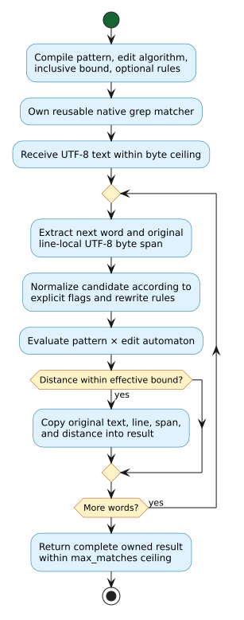

# Phonetic matching and analysis

`Liblevenshtein` exposes several different phonetic tools. A **pattern** is a
compiled language of acceptable text; a **rewrite rule** changes a candidate's
spelling or transcription; **articulatory distance** compares International
Phonetic Alphabet (IPA) sounds by their features; and **phonetic grep** scans
text for words accepted by a pattern within an edit bound. These tools answer
different questions and can be combined without preprocessing a dictionary.

All APIs on this page require a native library built with
`BUILD_FEATURE_PHONETIC`; check `build_features() & BUILD_FEATURE_PHONETIC != 0`
when loading a library of unknown provenance. Input strings must be valid
Unicode. Julia strings cross the native boundary as UTF-8, but a distance unit
or syllable position is a Unicode scalar, not a UTF-8 byte or an extended
grapheme cluster. No locale is inferred from the Julia process.

## Reusable patterns and rewrite rules

Use `PhoneticPattern` for exact membership in a compiled regular-language
pattern, or pass one to a dictionary `query`. The `llre=true` option selects
the library's `.llre` rule-expression parser instead of its phonetic regex
parser. `PhoneticRuleSet` accepts `.llev` source or one of the built-in rule
sets. Each object owns a native handle; close it when finished.

```julia
using Liblevenshtein

pattern = PhoneticPattern("cat")
rules = PhoneticRuleSet("ph -> f;")
try
    @assert "cat" in pattern
    @assert !("cot" in pattern)
    @assert rules("phone") == "fone"
finally
    close(pattern)
    close(rules)
end
```

The built-in selectors are `RULES_ENGLISH_ORTHOGRAPHY` and
`RULES_ENGLISH_PHONETIC`. Neither selector is a process-wide locale setting;
rules are explicit, reusable values. For dictionary search, pass the pattern
to `query(transducer, pattern, maximum_distance)` and close the resulting
cursor as for an ordinary fuzzy query. This query uses the dictionary's
captured revision, whereas grep below reads the supplied text directly.

## IPA feature distance

`articulatory_distance(a, b)` compares two `Char` values using native IPA
feature sets. Related sounds can differ by voicing, place, manner, vowel
height, backness, or rounding. An identical scalar has cost zero. The native
single-sound function returns the maximum cost for unknown symbols or a
vowel/consonant category mismatch; feature costs are capped at one. This is a
phonetic similarity score, not an acoustic model or an automatic phonetic
transcription of an ordinary word.

```julia
@assert articulatory_distance('p', 'p') == 0.0
@assert articulatory_distance('p', 'b') < articulatory_distance('p', 'h')

weights = PhoneticFeatureWeights(voicing=0.35)
@assert articulatory_distance('p', 'b'; weights) >
    articulatory_distance('p', 'b')

cost = articulatory_edit_distance("p", "b"; weights)
@assert cost == articulatory_distance('p', 'b'; weights)
```

`PhoneticFeatureWeights` is an immutable set of seven finite, nonnegative
costs: `voicing`, `place_step`, `manner_default`, `manner_table_scale`,
`vowel_height_step`, `vowel_backness_step`, and `vowel_rounding`. Omit
`weights` to use the native defaults. The edit-distance function uses the
same substitution scores in a Unicode-scalar dynamic program with unit-cost
insertion and deletion. It is bounded by `max_cells`, a positive ceiling on
the product of the source and target scalar counts; each individual scalar
count must also fit that ceiling. The default is 4,000,000 cells. A rejected
limit leaves no partial result and raises `NativeError`.

For source scalars $`s_1,\ldots,s_m`$ and target scalars
$`t_1,\ldots,t_n`$, the recurrence is:

$`D(i,j)=\min\{D(i-1,j)+1,\;D(i,j-1)+1,\;D(i-1,j-1)+c(s_i,t_j)\}`$,

where $`c`$ is the native feature distance. The boundary conditions are
$`D(i,0)=i`$ and $`D(0,j)=j`$. The Julia wrapper delegates the recurrence to
Rust; it does not reimplement feature classification or allocate a Julia
matrix. The direct feature score and the edit distance have different units:
the latter can exceed one for strings with multiple edits.

## Syllable heuristics

`syllable_count(word)` applies English orthographic heuristics such as vowel
groups, a final silent `e`, and consonantal `y`. With `ipa=true`, it uses IPA
vowel nuclei, length markers, stress marks, and explicit `.` boundaries.
These are heuristics, not a language-specific pronunciation dictionary.

```julia
@assert syllable_count("happy") == 2
@assert syllable_boundaries("happy") == [0, 3]
@assert syllable_count("ˈhæp.i"; ipa=true) == 2
@assert syllable_boundaries("ˈhæp.i"; ipa=true) == [0, 5]
```

`syllable_boundaries` returns zero-based starts in Unicode **scalar** offsets;
the first nonempty syllable begins at zero. Use `nextind` or `eachindex` when
converting these offsets to Julia string indices, because Julia string indices
are UTF-8 code-unit positions. The count and boundary heuristics are distinct
native observations: the number of returned starts need not equal
`syllable_count`. Both functions accept a positive `max_input_scalars`
ceiling (default 1,000,000), and an empty input produces zero syllables and
no boundaries.

## Word-boundary grep without a dictionary

`PhoneticGrep` compiles a regex-like pattern once, then compares candidates
using the selected edit automaton. `match_distance` checks one complete
candidate and returns `nothing` outside the inclusive bound. `scan_line`
returns non-overlapping word matches within one line; `scan_text` scans all
logical lines. These calls do not build or walk a dictionary.

```julia
grep = PhoneticGrep("phone"; max_distance=1)
try
    @assert match_distance(grep, "phon") == 1
    @assert match_distance(grep, "tablet") === nothing
    @assert "phon" in grep

    hits = scan_text(grep, "exact phone\nnear phon")
    @assert [(m.text, m.line_number, m.distance) for m in hits] ==
        [("phone", 1, 0), ("phon", 2, 1)]
    @assert (hits[1].start_byte, hits[1].end_byte) == (6, 11)
finally
    close(grep)
end
```

Each `PhoneticGrepMatch` owns its text independently of the matcher and input.
`line_number` is one-based; `start_byte` is zero-based and `end_byte` is an
exclusive UTF-8 byte offset **within that line**. Byte offsets are preserved
even when normalization changes the candidate supplied to the automaton.
The grep object is mutable and exclusive; do not race any operation with
`close` on that same wrapper. Julia finalizers are a fallback, not a substitute
for deterministic closure.

An optional `rules` value is copied into the matcher at construction. Rules
normalize the **candidate**, not the pattern, and they are directional. For
example, `ph -> f` allows a pattern `fone` to match the word `phone` at zero
edit distance, but does not imply the reverse:

```julia
rules = PhoneticRuleSet("ph -> f;")
grep = PhoneticGrep("fone"; rules, max_distance=0)
close(rules)  # grep owns its independent copy of the rule set
try
    @assert match_distance(grep, "phone") == 0
finally
    close(grep)
end
```

`case_insensitive=true` lowercases candidates at runtime. The pattern
language also supports scoped inline flags, including `(?i:...)` for case
folding, `(?a:...)` for accent-insensitive matching, and `(?u:NFC:...)` for
explicit Unicode normalization; their pattern-language behavior is distinct
from a global locale. `algorithm` selects the same public automaton family as
other fuzzy operations, such as `ALGORITHM_TRANSPOSITION` for adjacent swaps.
A pattern-local `(?;N:...)` distance overrides the constructor's
`max_distance`; `distance_config(grep)` returns both the effective bound and
the optional local override.

The work and output ceilings are explicit. `match_distance` accepts
`max_candidate_bytes`; scanning accepts `max_input_bytes` and `max_matches`.
The defaults are 1,000,000 for each. Exceeding a byte or output ceiling raises
`NativeError` rather than returning an incomplete result. Invalid patterns
also raise `NativeError`. Keep each bound appropriate for untrusted text; the
regex NFA has a separate native structural limit at compilation.

Conceptually, each scan follows this flow. Only candidate normalization and
matching are performed per word; compilation and rule ownership are reused.



The [diagram source](assets/phonetic-grep-flow.puml) is maintained as
PlantUML alongside its rendered SVG.

The native Rust implementations remain the semantic authority. The Julia
package tests assert representative feature, syllable, and grep results,
including Unicode inputs, rewritten candidates, limit failures, and copied
match offsets. Separate C ABI tests compare native boundary results with the
public Rust implementations. These tests do not assert that the heuristics
reproduce every human pronunciation.

## Normalized dictionaries

`PhoneticNormalizedDictionary(terms)` stores original spellings and searches
their phonetic normal forms. With no explicit `rules`, it uses the native
English Zompist rules, not a Julia locale. Pass a `PhoneticRuleSet` to select
different native rewrite rules. `compact=true` selects the immutable native
term-ID index; the default mutable index supports `insert!`, `remove!`,
`push!`, and `delete!`. Both return copied `PhoneticCandidate` values in the
native relevance order, carrying `term`, `normalized_form`, and normalized
edit `distance`. Equal normal forms may yield multiple original spellings.

```julia
rules = PhoneticRuleSet("ph -> f;")
dictionary = PhoneticNormalizedDictionary(["phone", "fone", "bone"]; rules)
close(rules)  # the dictionary retained independent native rules
try
    @assert Set(c.term for c in query(dictionary, "fone"; max_distance=0)) ==
        Set(["phone", "fone"])
    @assert insert!(dictionary, "phoen")
    @assert remove!(dictionary, "phoen")
finally
    close(dictionary)
end
```

Constructor ceilings `max_terms` and `max_total_bytes` bound initial input;
they are not persistent quotas on later mutation. `query` separately bounds
query scalars and returned candidates. A result-limit error returns no partial
vector. The compact index rejects mutation. Neither backend is a general
`vt.dictionary.v1` replacement: it is the public native phonetic-normalized
dictionary family projected into Julia.

## Character-level and token-level matching

`PhoneticOnlineGrep` searches character spans, including text inside words,
and copies both original and normalized spelling. Its `byte_range` and
`char_range` fields are zero-based, end-exclusive source positions. Unlike
word-boundary `PhoneticGrep`, it normalizes its query when rules are supplied.
`streaming(grep)` accepts chunks through `feed!` and returns results on a
single `finish!`; a chunk must itself be valid UTF-8, but may split a rewrite
across chunks. The scanner retains its own native configuration after its
parent grep is closed. `max_total_bytes`, `max_input_bytes`, and `max_matches`
bound the relevant operations; a finish-time result-limit error consumes the
stream rather than returning truncated results.

```julia
grep = PhoneticOnlineGrep("café")
stream = streaming(grep; max_total_bytes=64)
close(grep)
try
    feed!(stream, "🦀 ca")
    feed!(stream, "fé")
    hits = finish!(stream)
    @assert [(h.original_text, h.byte_range) for h in hits] ==
        [("café", (5, 10))]
finally
    close(stream)
end
```

`PhoneticTokenGrep` instead applies the native token-query grammar to a
sequence of words and reports copied `PhoneticTokenMatch` values with
`total_distance`, `matched_text`, and per-token `PhoneticTokenDetail` values.
Per-token evidence includes its original and normalized text, token index,
byte range, and edit distance. The query's `default_distance` is a UInt8
bound; native pattern-local overrides remain part of the query grammar.
`max_details` bounds all copied detail records. These three grep classes are
intentionally distinct; selecting one changes matching and span semantics.

## Incremental rewriting and reverse expansion

`PhoneticTransducer` owns a native contextual rewrite stream. `feed!` returns
only text ready for emission; `finish!` flushes delayed context; `reset!`
reuses the compiled rules for a new logical stream. `normalize` processes an
independent input without changing that stream. A native output-limit error
resets the stream, so restart it rather than appending to a partially accepted
input. Close stateful wrappers deterministically and do not concurrently
mutate or close the same handle.

```julia
rules = PhoneticRuleSet("ph -> f;")
transducer = PhoneticTransducer(; rules)
try
    @assert feed!(transducer, "p") * feed!(transducer, "hone") *
        finish!(transducer) == "fone"
    reset!(transducer)
    @assert normalize(transducer, "phone") == "fone"
finally
    close(transducer)
    close(rules)
end
```

`expand_phonetic_alternatives` performs exhaustive reverse-rule segmentation
and returns one regex pattern; `expand_phonetic_with_costs` performs native
greedy cost-aware expansion and returns `(pattern, max_cost)`. These algorithms
are not interchangeable. `PhoneticExpansionLimits` bounds input scalars,
rules, rule units, explored nodes, and output bytes. Exceeding any bound raises
`NativeError` without a truncated or misleading pattern.

## IPA feature sets

`phonetic_features('b')` returns a `Set{Symbol}` from the stable published
`PHONETIC_FEATURE_NAMES` table. `characters_with_features(features; any=false)`
selects native-table characters with all specified features, or any when
requested. `similar_phonetic_chars`, `voicing_pair`, `expand_feature_based`,
`are_phonetically_similar`, and `is_free_phonetic_substitution` expose distinct
native relations; do not equate a shared feature with zero edit cost.
`feature_set_distance` takes two explicit feature sets and optional
`PhoneticFeatureWeights`. Unknown feature symbols raise `ArgumentError`;
unknown IPA characters simply have empty classified feature sets.

## Trusted files and compiled artifacts

Inline `PhoneticRuleSet(source)` and `PhoneticPattern(source; llre=true)`
deliberately reject unresolved imports. The separate file constructors
`load_phonetic_rules(path; search_paths)` and
`load_phonetic_pattern(path; search_paths)` resolve native `.llev` includes and
`.llre` imports, respectively. They read local files and any transitively
included files. They are for **trusted** paths and contents: the path-byte
ceiling limits supplied path arguments, not file size, recursion, or access to
other filesystem locations, and it is not a sandbox. Use inline constructors
for untrusted text.

With API revision 8 and `BUILD_FEATURE_PHONETIC_AOT`,
`compiled_phonetic_bytes(rules_or_pattern)` produces versioned native binary
bytes. `load_compiled_phonetic_rules(bytes)` and
`load_compiled_phonetic_pattern(bytes)` decode independently owned handles.
The caller retains its input bytes; output `Vector{UInt8}` is copied before
the native buffer is freed. Each AOT call has an explicit byte ceiling and a
16 MiB hard maximum. Wrong magic, version, or malformed bytes raise
`NativeError`; a failed decode never returns a partial handle. A library built
without the serialization feature still exports these C symbols but reports
`STATUS_UNSUPPORTED`, and its `BUILD_FEATURE_PHONETIC_AOT` bit is clear.

```julia
rules = load_phonetic_rules("trusted-rules.llev")
try
    if build_features() & BUILD_FEATURE_PHONETIC_AOT != 0
        bytes = compiled_phonetic_bytes(rules)
        restored = load_compiled_phonetic_rules(bytes)
        try
            @assert restored("phone") == rules("phone")
        finally
            close(restored)
        end
    end
finally
    close(rules)
end
```

The encoded `.llev` and `.llre` formats are native versioned artifacts, not
portable JSON or a promise of compatibility across arbitrary library
versions. Keep provenance and version metadata with artifacts. This page's
examples are complemented by native C-ABI differential tests and the Julia
package suite, including invalid paths, malformed bytes, ownership, limits,
and the serialization-disabled feature gate.
