# Documentation Index

Complete documentation for **liblevenshtein-rust v4.0.0-rc.6** — Levenshtein and
related (phonetic, time-series) automata for error-tolerant search over strings
and byte arrays, with several trie/DAWG dictionaries, fuzzy maps, and fuzzy
caches.

**Last Updated:** 2026-08-29  ·  **Version:** 4.0.0-rc.6

---

## How this documentation is organized

The set is grouped into nine sections, from first-contact tutorials through deep
theory, formal proofs, and the project's scientific research record. The
[main README](../README.md) is the canonical, quality-reference overview; this
index maps everything else.

### Document conventions

- **Math** is written as **MathJax LaTeX**, never as Unicode literals. Inline math uses
  dollar delimiters around a backtick-delimited expression — `` $`\mathcal{O}(\lvert W\rvert)`$ ``
  renders as $`\mathcal{O}(\lvert W\rvert)`$ — and display math is a fenced block whose
  info-string is `math`. We never use *bare* dollar-delimited math (dollars without the
  enclosing backticks): GitHub's CommonMark pass strips backslash escapes before MathJax
  parses them. Cardinality and absolute-value bars are `\lvert … \rvert`; a literal ASCII
  `|` is reserved for Markdown table delimiters and code. Genuine algorithm listings stay
  as fenced **pseudocode** (literate form); only standalone formulae, recurrences, and
  inference rules become `math` blocks.
- **Diagrams** live under [`diagrams/`](diagrams/README.md) as text source + a committed
  SVG, fully coloured per a [shared legend](diagrams/README.md); docs embed the SVG.
- **Citations** link to DOIs where one exists.

### Living vs. Historical — the rule that bounds edits

> A document is **LIVING** if it describes the *current* behaviour, API, theory,
> or architecture of liblevenshtein v4.0.0-rc.6 — something you would consult to *use
> or extend the library today*. A document is **HISTORICAL** if it is a dated
> record of *how we got here*: a scientific ledger, hypothesis log, experiment
> record, phase/session/completion report, or benchmark dump. Per the project's
> append-only scientific-method practice, **HISTORICAL documents are never
> rewritten or "cleaned up"** — only indexed and cross-linked. When in doubt, a
> doc whose path carries a date, phase, hypothesis, or session name is HISTORICAL.

---

## 1 · Getting Started

- [Main README](../README.md) — overview, installation, quick start, the full feature tour.
- [User Guide → Getting Started](user-guide/getting-started.md) — first dictionary and query.
- [CHANGELOG](../CHANGELOG.md) — version history (current: 0.10.0).
- [Examples & Tutorials](examples/README.md) — the numbered tutorial series
  ([01](examples/01-getting-started/README.md) … [08](examples/08-real-world/README.md)) and a map to the runnable `examples/*.rs`.

## 2 · Concepts & Theory

- [Lazy vs. Eager Automata](concepts/LAZY_VS_EAGER_AUTOMATA.md) — the central idea: a query *lazily simulates* a parameterized Levenshtein automaton, it is **not** a precompiled universal DFA.
- [Levenshtein-automata theory](research/levenshtein-automata/README.md) — the Schulz–Mihov method, glossary, and code-to-paper mapping (theory home; also cross-linked from the glossary).
- [Lazy ordered-cost product automata](theory/lazy-ordered-cost-product-automata.md) — the general theory of weighted residuals, simulation antichains, abstract interval products, stable online state, and separately qualified metric instances.
- [Algorithm layer 02 — Levenshtein automata](algorithms/02-levenshtein-automata/README.md) — the position/subsumption model, with diagrams.
- [Edit-distance classification](theory/edit-distance-classification.md) — the alignment/script boundary, four implementation classes, metricity-versus-pruning distinction, and placement checklist for future measures.
- [Snapshot semantics](theory/snapshot-semantics.md) — the cursor laws S1-S6 as display math, the $`\mathcal{O}(1)`$-capture argument from path-copied revisions, the partial-persistence classification (Driscoll; Okasaki), and the law ↔ formal-model ↔ test correspondence table.
- [Theory](theory/) — disk-trie and SCDAWG theory pointers (backend internals now live in `libdictenstein`).
- Specialized theory: [universal automata](research/universal-levenshtein/README.md) · [weighted automata](research/weighted-levenshtein-automata/README.md) · [bimachines](research/bimachines/README.md).

## 3 · Architecture

- [Architecture Overview](architecture/overview.md) — the **inter-crate** view: liblevenshtein ↔ libdictenstein ↔ optional duallity (WFST) ↔ the `.llev`/`.llre` DSL layer.
- [Language-bindings architecture](language-bindings.md) — the three-layer binding decision (versioned C resource ABI + generated constants + hand-written facades), the shared `VtResource` boundary, snapshot/marshalling contracts, tiers, distribution, and platform policy.
- [Binding documentation hub](bindings/README.md) — the corpus map and reading order: the [`llev_*` C-ABI reference](bindings/c-abi-reference.md) (all 35 functions, status sets, the lease protocol, a compile-checked C consumer), the [resource consumer](bindings/resource-consumer.md) (intake, `CallGate`, fault channel, arenas), the [WASM/JS topology](bindings/wasm-topology.md) (shared JavaScript runtime, identity guard, WASI preopens), and the machine-readable governance (`bindings/api.json`, conformance fixtures, `ABI_INVARIANTS.tsv`).
- Family ABI canon (hosted with the interop crate): [portal](https://github.com/vinary-tree/vinary-tree-interop/blob/master/README.md) · [ABI reference](https://github.com/vinary-tree/vinary-tree-interop/blob/master/docs/abi-reference.md) · [evolution policy](https://github.com/vinary-tree/vinary-tree-interop/blob/master/docs/abi-evolution.md) · [security model](https://github.com/vinary-tree/vinary-tree-interop/blob/master/docs/security-model.md).
- [Developer Guide → Architecture](developer-guide/architecture.md) — the **intra-crate** module design and traits.
- [Design specifications](design/README.md) — feature-level designs, including [Class-A presets](design/class-a-presets.md), the [ordered cost monoid](design/cost-monoid.md), [language products](design/language-product.md), [complete content-addressed elastic snapshots](design/complete-elastic-snapshots.md), dynamic DAWG, suffix automaton, contextual completion, protobuf serialization, and grammar correction.
- [Algorithm Reference layers 01–09](algorithms/README.md) — the layered architecture, bottom-up.
- Diagrams: [crate boundary](diagrams/architectures/crate-boundary.svg) · [component stack](diagrams/architectures/component-stack.svg) · [C4 context](diagrams/architectures/c4-context.svg) / [container](diagrams/architectures/c4-container.svg) · [feature-flag DAG](diagrams/architectures/feature-flag-dag.svg) · [module dependencies](diagrams/architectures/module-dependency.svg).

## 4 · User Guide

- [User Guide](user-guide/README.md) — getting-started, [algorithms](user-guide/algorithms.md), [backends](user-guide/backends.md), [serialization](user-guide/serialization.md), [features](user-guide/features.md), [code completion](user-guide/code-completion.md), [thread safety](user-guide/thread-safety.md), [prefix zipper](user-guide/prefix-zipper-usage.md).
- [Guides](guides/README.md) — [articulatory distance](guides/articulatory-distance.md), [compositional phonetic + Levenshtein](guides/compositional-phonetic-levenshtein.md), [phonetic-rules developer guide](guides/phonetic-rules-developer-guide.md), [hierarchical scope completion](guides/HIERARCHICAL_SCOPE_COMPLETION.md), [restricted substitutions](guides/RESTRICTED_SUBSTITUTIONS_GUIDE.md), [grammar correction](guides/grammar-correction/README.md).
- [Phonetic extraction](phonetic-extraction/README.md) — Soundex, Metaphone, NYSIIS, Caverphone, Cologne, Daitch–Mokotoff, Beider–Morse.
- [DSL grammar reference](grammar/README.md) — the `.llev`, `.llre`, and regex EBNF grammars with prose.
- [LLRE reference](llre/README.md).

## 5 · Developer Guide

- [Developer Guide](developer-guide/README.md) — [building](developer-guide/building.md), [contributing](developer-guide/contributing.md), [performance](developer-guide/performance.md), [publishing](developer-guide/publishing.md).
- [Executable Rust API examples](developer-guide/rustdoc-examples.md) — fence semantics, all-feature Rustdoc gates, the ignored-example ratchet, and the evidence-based repair workflow.
- [Migration to the split CLI](migration-cli-split-0.10.md) — the v0.10 package and API boundary.
- [Security & threat model](SECURITY.md) — untrusted-input surfaces (FFI/WASM boundaries, serialization, `.llre` parsing).
- [Binding trust model](security/binding-trust-model.md) — the family trust model instantiated for the resource consumer: `boundary()` containment, the bounded error channel, the decoded status wire, lease refusal as use-after-free prevention, and duty status per hostile-input class.
- [Releasing language bindings](releasing-language-bindings.md) — the publish-order DAG, registry coordinates and credentials, pin-coherence preconditions, and pre-publication gates.
- [Release evidence ledgers](releases/README.md) — immutable source commits,
  workflow runs, registry digests, public-byte smokes, incidents, and recovery
  decisions. The [`4.0.0-rc.6` ledger](releases/4.0.0-rc.6.md) remains the latest
  completed publication ledger; it does not describe the coherent `rc.6`
  development tuple.
- [Resource-exhaustion controls](security/resource-exhaustion.md) — automaton state ceilings, edit budgets, elastic-DP guards, and deployment policy.
- [Automaton-variant security](security/automaton-variants.md) — continuation-tag integrity, subsumption soundness, selector stability, and extension review controls.
- [Migration](migration/README.md) — terminology and version-migration notes (including the libdictenstein extraction).
- [Development logs](development/README.md) — phase/session implementation logs *(historical)*.

## 6 · Algorithm Reference

- [Algorithm Reference](algorithms/README.md) — the [documentation index](algorithms/DOCUMENTATION_INDEX.md), layers [01 dictionary](algorithms/01-dictionary-layer/README.md) through [09 value storage](algorithms/09-value-storage/README.md), the [10 affine-gap automaton](algorithms/10-affine-gap/README.md), [13 language products](algorithms/13-language-products/README.md), and the [14 exact generalized-operation grid](algorithms/14-generalized-operation-grid/README.md).

## 7 · Formal Verification

- [Verification](verification/README.md) — the formal-proof artifacts. **`FORMAL_VERIFICATION_MANIFEST.tsv` is the declared source of truth** for trusted/partial/legacy status; see [INDEX](verification/INDEX.md) and [README_FORMAL_GATES](verification/README_FORMAL_GATES.md). The trusted CostMonoid island combines Rocq, Verus, cross-solver SMT, and property tests; the tree also holds the remaining Rocq and TLA+ models.
- [Formal-verification writeups](formal-verification/README.md) — the parallel markdown proof exposition and findings (defers to the manifest for canonical status).

## 8 · Research & Scientific Ledgers — *historical, append-only (indexed, not edited)*

The project keeps an append-only scientific record. These are preserved as
written; they are indexed and cross-linked but never rewritten.

- [Research](research/README.md) — per-topic investigations: levenshtein-automata, universal-levenshtein, weighted-levenshtein-automata, [wallbreaker](research/wallbreaker/README.md), [artrie](research/artrie/README.md), simd-optimization, comparative-analysis, bimachines, eviction-wrapper, grammar-correction, phonetic-corrections, batch-processing.
- [Scientific ledgers](scientific-ledger/README.md) — the canonical ledger home (automata/WFST evaluation, MSM automata evaluation).
- [Optimization journals](optimization/README.md) and [optimization results](optimizations/README.md) — hypothesis ledgers (H1/H2…), per-topic experiment logs.
- [Universal](universal/README.md) · [Generalized](generalized/README.md) — phase records for the universal & generalized automaton work.
- [MeTTaIL](mettail/README.md) — semantic type-checking for MeTTa (a large self-contained subtree: theoretical foundations, correction-WFST, simplification, implementation, ecosystem).
- [Time-series analysis](time_series/README.md) · [Integration](integration/) (MORK, PathMap) · [Benchmarks](benchmarks/README.md) · [Analysis](analysis/) · [Bug reports](bug-reports/README.md) · [Completion reports](completion-reports/README.md) · [Implementation status](implementation-status/README.md) · [Archive](archive/README.md).

## 9 · Diagrams

- [Diagram suite & style guide](diagrams/README.md) — fully coloured diagrams (text source + committed SVG) built with PlantUML, Graphviz, D2, Structurizr, Pikchr, and Asymptote, with a [shared colour legend](diagrams/_legend/color-legend.svg) and a reproducible [render pipeline](diagrams/render.sh).

---

## Glossary

- [Technical Glossary](GLOSSARY.md) — implementation, performance, and user-facing terms.
- [Levenshtein-automata theory glossary](research/levenshtein-automata/glossary.md) — Position, Subsumption, Characteristic Vector, and other theoretical terms.

---

**Navigation:** [← Main README](../README.md) · [User Guide](user-guide/README.md) · [Developer Guide](developer-guide/README.md) · [Algorithm Reference](algorithms/README.md) · [Diagrams](diagrams/README.md)
