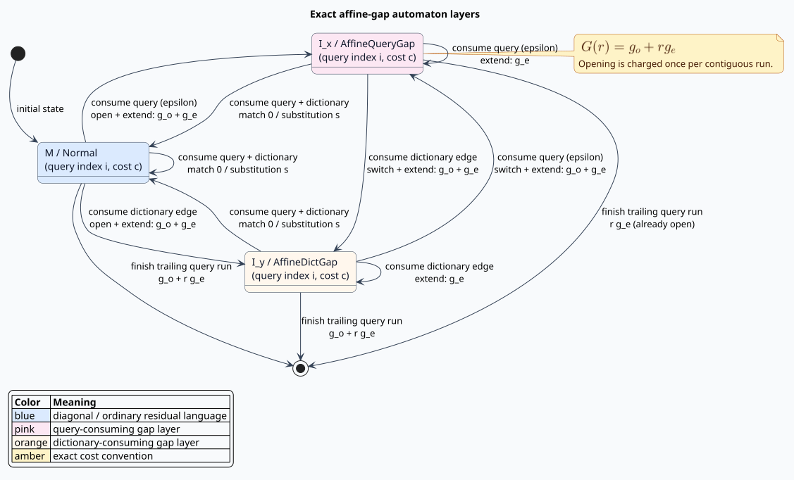

# Affine-gap dictionary automata

**Navigation:** [Algorithms](../README.md) · [Design](../../design/affine-gap-automaton.md) · [Gotoh paper](../../research/gotoh/PAPER_SUMMARY.md) · [Proofs](../../verification/affine/) · [Security](../../security/resource-exhaustion.md)

This chapter derives the crate's exact fixed-point affine-gap distance and its
lazy three-layer dictionary automaton. It defines the cost convention before
using it, presents the quadratic Gotoh recurrence as an oracle, explains the
subsumption proof and its implementation boundary, and connects each formal
invariant to an executable property.

## 1. Vocabulary and cost convention

A **gap** is a contiguous run of symbols consumed from only one input. An
**affine gap cost** charges an opening penalty once and an extension penalty for
every symbol in the run. Write $`g_o`$ for the non-negative gap-open cost and
$`g_e`$ for the non-negative per-symbol gap-extension cost. A run of length
$`r>0`$ costs:

```math
G(r)=g_o+r g_e.
```

This convention includes the first gap symbol in $`r g_e`$. Some literature
uses $`g_o+(r-1)g_e`$; translating between the conventions requires changing
the reported open parameter. The crate never makes that conversion implicitly.

Write $`s`$ for substitution cost. A matching diagonal costs zero. The
implementation permits zero-valued parameters, including $`g_o=0`$; when
$`g_o=0`$, $`g_e=s=1`$, the distance is ordinary Levenshtein distance.

Affine costs are useful when a single missing or extra region is more plausible
than several independent gaps. Sequence alignment and optical character
recognition are common examples.

## 2. Exact fixed-point domain

`AffineGapParams` derives a [`CostScale`](../../../src/cost/scale.rs) from the
shortest decimal representations of $`g_o`$, $`g_e`$, and $`s`$. If the
least common denominator is $`S`$, every transition uses the exact integers:

```math
\widehat g_o=Sg_o,\qquad
\widehat g_e=Sg_e,\qquad
\widehat s=Ss.
```

There is no floating-point comparison in a state, transition, or subsumption
test. Conversion can fail with `ScaleError` for a non-finite, negative,
inexact, or overflowing value. Accumulation uses checked integer arithmetic;
an overflowing route is unreachable, never wrapped into a cheap route.

```rust
use liblevenshtein::transducer::AffineGapParams;

let costs = AffineGapParams::new(0.5, 0.25, 1.0)?;
assert_eq!(costs.scale().denominator(), 4);
assert_eq!(costs.gap_open(), 2);
assert_eq!(costs.gap_extend(), 1);
assert_eq!(costs.substitution(), 4);
# Ok::<(), liblevenshtein::cost::ScaleError>(())
```

## 3. Gotoh's three matrices

Let $`x=x_1\ldots x_m`$ be the query and $`y=y_1\ldots y_n`$ the dictionary
term. Three dynamic-programming layers remember the preceding operation:

- $`M[i,j]`$ ends with a diagonal match or substitution;
- $`I_x[i,j]`$ ends with a gap consuming query symbols;
- $`I_y[i,j]`$ ends with a gap consuming dictionary symbols.

Define a layer-dependent gap step:

```math
w(\ell,\tau)=
\begin{cases}
g_e,&\ell=\tau,\\
g_o+g_e,&\ell\ne\tau.
\end{cases}
```

The direct recurrence takes the minimum of the compatible predecessor in each
layer. A diagonal resets the layer to $`M`$; a gap remains in or enters its
target layer. The implementation in `distance::affine_gap_distance_units`
materializes all three $`(m+1)(n+1)`$ matrices. It is intentionally obvious
$`\mathcal{O}(mn)`$ code and is the differential oracle, not the trie search
engine.

## 4. Position layers in the lazy automaton

A `Position` stores `(query_index, scaled_cost, kind)`. The kinds correspond
exactly to Gotoh's matrices:

| Mathematical layer | `PositionKind` | What the next gap step remembers |
|---|---|---|
| $`M`$ | `Normal` | no gap is open |
| $`I_x`$ | `AffineQueryGap` | a query-consuming gap is open |
| $`I_y`$ | `AffineDictGap` | a dictionary-consuming gap is open |



The two gap tags occupy bytes already reserved by the 24-byte `Position`
layout. The scaled cost remains the existing `usize` field, so affine support
does not duplicate the `_f64` transition family.

## 5. Literate transition algorithm

The dictionary walker consumes one dictionary edge at a time. Before that edge,
the epsilon-closure loop emits every affordable query-gap prefix. The consuming
kernel also materializes the equivalent fused successors so cross-index
canonicalization cannot remove the only representative able to consume the
current edge.

```text
EPSILON-QUERY-GAP(position p, query length m, budget k):
    if p.index < m:
        increment := GAP-STEP(p.layer, QueryGap)
        if CHECKED-ADD(p.cost, increment) <= k:
            emit QueryGap(index=p.index+1,
                          cost=p.cost+increment)
```

For dictionary symbol $`b`$, a position may take a diagonal or consume $`b`$
inside a dictionary gap:

```text
CONSUME-DICTIONARY(position p, symbol b, query q, budget k):
    if p.index < length(q):
        diagonal := 0 if q[p.index] MATCHES b else substitution
        if CHECKED-ADD(p.cost, diagonal) <= k:
            emit Match(index=p.index+1,
                       cost=p.cost+diagonal)

    increment := GAP-STEP(p.layer, DictGap)
    if CHECKED-ADD(p.cost, increment) <= k:
        emit DictGap(index=p.index,
                     cost=p.cost+increment)

    for skipped in 1 .. CHARACTERISTIC-WINDOW:
        gap_cost := QUERY-GAP-RUN(p, skipped)
        if q[p.index+skipped] MATCHES b:
            emit Match(index=p.index+skipped+1,
                       cost=gap_cost)
        else if CHECKED-ADD(gap_cost, substitution) <= k:
            emit Match(index=p.index+skipped+1,
                       cost=gap_cost+substitution)
        if CHECKED-ADD(gap_cost, GAP-STEP(QueryGap, DictGap)) <= k:
            emit DictGap(index=p.index+skipped,
                         cost=gap_cost+GAP-STEP(QueryGap, DictGap))
```

`MATCHES` includes exact unit equality and the configured zero-cost
substitution policy. The kernel is generic over byte, Unicode-scalar, and
`u64` units.

## 6. Initial and final gaps

The initial state starts at `(0, 0, M)` and applies the same epsilon closure.
It therefore seeds a query-prefix run at exactly $`g_o+r g_e`$, rather than
the unit-cost `(r, r)` prefix used by the legacy variants.

At the end of a dictionary term, let $`r=m-i`$ query symbols remain. The
layer-aware finishing rule is:

```math
F(i,c,\ell)=
\begin{cases}
c,&r=0,\\
c+r g_e,&r>0\land\ell=I_x,\\
c+g_o+r g_e,&r>0\land\ell\ne I_x.
\end{cases}
```

The second row is essential: a trailing query gap already open in $`I_x`$
must not pay $`g_o`$ twice. `State::infer_distance_with::<AffineV>` applies
this rule to every representative and returns the minimum.

## 7. Subsumption derivation

**Subsumption** means that discarding one residual language cannot raise the
minimum completion cost for any future dictionary suffix. At one query index,
the layer preorder is:

```math
\ell_1\preceq\ell_2
\quad\Longleftrightarrow\quad
\ell_1=\ell_2\ \lor\ \ell_2=M.
```

The two gap layers precede $`M`$ because they may reuse an open gap. They are
incomparable when $`g_o>0`$: continuing a query gap separates $`I_x`$ from
$`I_y`$, while continuing a dictionary gap separates them in the opposite
direction. For any two incoming layers, switching costs at most $`g_o`$:

```math
C(i,\ell_1,v)\le C(i,\ell_2,v)+g_o.
```

The same-index B-4 rule follows:

```math
(i,c_1,\ell_1)\sqsupseteq(i,c_2,\ell_2)
\quad\text{if}\quad
(\ell_1\preceq\ell_2\land c_1\le c_2)
\ \lor\ c_1+g_o\le c_2.
```

Rocq proves this inequality for arbitrary action traces. Dafny, Verus, Z3, and
cvc5 independently prove or counterexample-search its one-step preservation;
TLC exhaustively checks bounded traces.

### 7.1 Forward B-5 and fused realization

A forward cross-index comparison first prices the non-empty query-gap run from
the earlier position to the later query index. Let $`r=i_2-i_1>0`$ and
$`Q(c,\ell,r)=c+[\ell\ne I_x]g_o+r g_e`$. The earlier position subsumes the
later one when

```math
Q(c_1,\ell_1,r)+[\ell_2=I_y]g_o\le c_2.
```

After the concrete query-gap run, the left representative is in $`I_x`$ at
$`i_2`$. For right layers $`M`$ and $`I_x`$, the inequality supplies the
layer-preorder arm of B-4. For $`I_y`$, the extra $`g_o`$ supplies B-4's
uniform switch-penalty arm. Thus B-5 reduces to B-4 at the later index and
inherits its arbitrary-suffix proof.

The saved minimal counterexample is query `ba`, term `a`, $`g_o=0`$,
$`g_e=s=1`$, and budget 1. Pruning `(1,1,I_x)` under `(0,0,M)` loses the only
match unless the successor fuses “skip `b`” and “consume `a`.” The consuming
kernel now emits that fused transition, with a property proving it equals the
explicit epsilon chain followed by the same dictionary-edge action. Therefore:

- B-4 and forward B-5 are enabled and formally verified;
- the minimized `ba`/`a` counterexample is an explicit integration test and a
  persisted property-test regression;
- backward cross-index pruning remains disabled because deleting symbols from
  a completion can split a gap run and add an opening charge.

## 8. Operation-derived characteristic windows

Scaled cost is not an operation count. Using a raw scaled budget as a
characteristic-vector width would turn a budget of `2.0` at scale 1,000 into a
2,001-unit window. For a position of cost $`c`$ and $`g_e>0`$, every
affordable gap run has length less than:

```math
W(c)=\left\lfloor\frac{k-c}{g_e}\right\rfloor+1.
```

`AffineV::skip_window` computes this value, caps it by the remaining query, and
uses checked/saturating boundary arithmetic. If $`g_e=0`$, correctness
requires the full remaining query window; callers should treat that
configuration as potentially linear-width work.

## 9. Rust usage

The presentation API accepts decimal costs and returns both real and exact
scaled distances:

```rust
use libdictenstein::double_array_trie::DoubleArrayTrie;
use liblevenshtein::transducer::{AffineGapParams, Algorithm, Transducer};

let dictionary = DoubleArrayTrie::from_terms(["a", "abcd"]);
let transducer = Transducer::new(dictionary, Algorithm::Standard);
let costs = AffineGapParams::new(3.0, 2.0, 10.0)?;
let result = transducer
    .query_affine("a", 9.0, costs)?
    .find(|candidate| candidate.term == "abcd")
    .expect("the length-three gap costs 3 + 3*2");

assert_eq!(result.distance, 9.0);
assert_eq!(result.scaled_distance, 9);
# Ok::<(), liblevenshtein::cost::ScaleError>(())
```

Use `query_affine_scaled` when a protocol already carries exact fixed-point
integers. Use `query_units_affine_scaled` for native `u64` token sequences.
`QueryBuilder::affine_gap` provides the fluent string entry point.

The `Algorithm` stored on a `Transducer` does not affect an affine query. Its
runtime variants have unit parameters; affine dispatch is deliberately typed
by `AffineGapParams` through `VariantSpec::AffineGap`.

## 10. Complexity and security

The reference DP uses $`\mathcal{O}(mn)`$ time and space. The automaton walks
only dictionary prefixes whose exact lower bound fits the budget; its work is
proportional to reached edges times the canonical frontier size. B-4/B-5
canonicalization is conservative, so a permissive budget may still visit most
of a dictionary.

Every untrusted service should cap query length, dictionary-key length,
fixed-point denominator, scaled budget, result count, and wall time. Scaling and
accumulation are checked. A zero extension cost is supported exactly but
disables the $`\mathcal{O}(k)`$ window guarantee.

## 11. Verification and test map

| Claim | Formal evidence | Executable mirror |
|---|---|---|
| B-1 layer order and B-2 incomparability | Rocq, Dafny, Verus, SMT | layer examples and generated switch properties |
| B-3 uniform switch penalty | all arithmetic tools | 2,000 generated layer/action costs |
| B-4 residual-language dominance | Rocq trace theorem, Dafny, Verus, SMT, TLC | 2,000 generated position pairs × suffixes |
| layer-aware trailing finish | Rocq, Dafny, Verus, SMT | focused unit tests and Gotoh differential |
| operation-window bound | Rocq, Dafny, Verus, SMT, TLC | 2,000 generated affordable runs |
| automaton equals Gotoh | proof-guided construction | 2,000 generated dictionary/query/config maps |
| symmetry and identity | generated oracle properties | 2,000 cases per property; triangle deliberately unclaimed |
| backend/unit/policy genericity | type-generic kernel | byte/char/`u64` and four policy integration arms |

Affine metricity is an open classification obligation for arbitrary parameter
sets. The test suite asserts symmetry and identity only when substitution and
extension costs are positive; it makes no triangle-inequality claim.

## 12. Reference

- O. Gotoh, “An improved algorithm for matching biological sequences,”
  *Journal of Molecular Biology* 162(3), 705–708 (1982).
  [DOI 10.1016/0022-2836(82)90398-9](https://doi.org/10.1016/0022-2836(82)90398-9).
