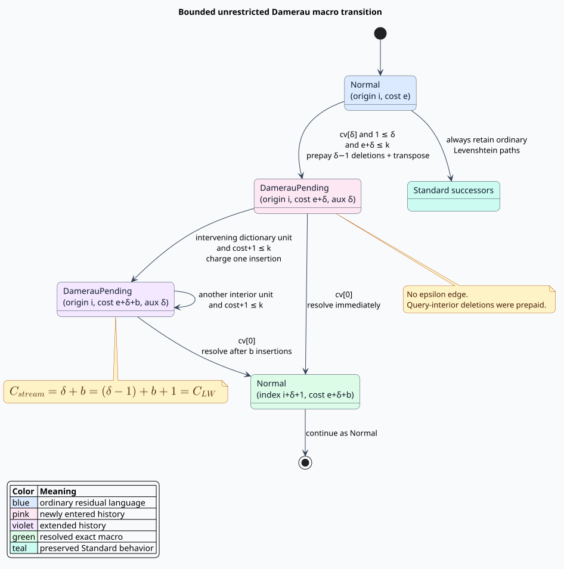

# Unrestricted Damerau–Levenshtein automata

**Navigation:** [Algorithms](../README.md) · [Levenshtein automata](../02-levenshtein-automata/README.md) · [Design](../../design/true-damerau-streaming.md) · [Proofs](../../verification/damerau/) · [Security](../../security/resource-exhaustion.md)

This chapter explains the exact, bounded automaton behind
`Algorithm::DamerauLevenshtein`. It distinguishes unrestricted
Damerau–Levenshtein distance from optimal string alignment (OSA), derives the
streaming continuation state, gives literate pseudocode, and connects every
proof obligation to an executable property.

## 1. Vocabulary and selection rule

An **edit script** is a sequence of insertions, deletions, substitutions, and
adjacent transpositions. A later operation in an unrestricted script may edit
the output of an earlier operation. An **alignment** consumes each input symbol
once, so it cannot express that history. **OSA** is the restricted alignment
recurrence exposed as `Algorithm::Transposition`. **True Damerau–Levenshtein**
is the unrestricted script distance exposed as
`Algorithm::DamerauLevenshtein`.

The smallest separating example is:

```text
CA  --transpose-->  AC  --insert B-->  ABC
```

True Damerau distance is 2. OSA returns 3 because the insertion edits the
already-transposed region. This distinction determines the API choice:

| Need | Selector | Metric? |
|---|---|---:|
| ordinary typing errors | `Algorithm::Standard` | yes |
| one non-overlapping adjacent swap | `Algorithm::Transposition` | no |
| edits may revisit an earlier edit | `Algorithm::DamerauLevenshtein` | yes |
| structural one-to-two/two-to-one OCR errors | `Algorithm::MergeAndSplit` | yes |

The two transposition selectors share a local operation repertoire but not a
composition rule. Consequently, `DamerauLevenshtein::to_operation_set()` is an
explicit OSA projection; an `OperationSet` cannot carry the required history.

## 2. Reference recurrence

Let $`x=x_1\ldots x_m`$ and $`y=y_1\ldots y_n`$. Let $`D[i,j]`$ be the
best script cost for their prefixes. In addition to the three ordinary
Levenshtein predecessors, Lowrance and Wagner use the last matching source and
target positions $`k'`$ and $`l`$:

```math
D[i,j]=\min\left(
  D[i-1,j]+1,
  D[i,j-1]+1,
  D[i-1,j-1]+[x_i\ne y_j],
  D[k'-1,l-1]+(i-k'-1)+(j-l-1)+1
\right).
```

The last term deletes the intervening source symbols, inserts the intervening
target symbols, and transposes the two matching endpoints. The crate's
`damerau_levenshtein_distance` implements the full last-occurrence table over
the union alphabet. It is intentionally obvious $`\mathcal{O}(mn)`$ code and
serves as the differential oracle rather than the search engine.

## 3. Why bounded history is finite

Suppose a query accepts only scripts costing at most $`k`$. The transposition
term contributes:

```math
(i-k'-1)+(j-l-1)+1.
```

Therefore the joint endpoint/interior displacement obeys:

```math
(i-k')+(j-l)\le k+1.
```

Only the current bounded characteristic-vector window can begin a useful
macro. The automaton does not store an alphabet-sized last-occurrence table in
every state. Instead it stores one positive endpoint delta and waits for the
opposite endpoint to appear.



## 4. Position languages

A `Position` represents a residual language: the set of dictionary suffixes it
can still complete within budget. Two position kinds are relevant:

- `Normal` uses ordinary Levenshtein transitions.
- `DamerauPending` has prepaid a transposition and query-interior deletions;
  its one-byte `aux` field stores a positive endpoint delta $`\delta`$.

On 64-bit targets the representation remains 24 bytes: two `usize` fields, a
one-byte `PositionKind`, a one-byte auxiliary payload, and alignment padding.
The payload ceiling is therefore
`Algorithm::MAX_DAMERAU_DISTANCE == 255`. Public unit-transition entry points
panic before traversal for a larger budget; they never return an incomplete
result. The measured and recommended spell-correction range is $`k\in\{1,2,3\}`$.

## 5. Literate streaming algorithm

The algorithm is easiest to reconstruct as three narrated steps. First,
ordinary paths remain complete: every normal position emits exactly the
Standard successors. It then starts a continuation for each later matching
query endpoint that fits the residual budget.

```text
ENTER-MACROS(normal position p, characteristic vector cv, budget k):
    emit every STANDARD-SUCCESSOR(p, cv, k)
    remaining := k - p.cost
    for delta in 1 .. min(remaining, length(cv)-1):
        if cv[delta]:
            emit Pending(origin=p.index,
                         cost=p.cost + delta,
                         delta=delta)
```

The entry cost $`\delta`$ prepays $`\delta-1`$ query deletions plus one
transposition. Second, each intervening dictionary symbol is an insertion and
adds one:

```text
EXTEND(pending position p, budget k):
    if p.cost + 1 <= k:
        emit Pending(origin=p.origin,
                     cost=p.cost + 1,
                     delta=p.delta)
```

Third, `cv[0]` says the current dictionary symbol matches the stored macro's
left query endpoint. The continuation resolves to the query position after the
right endpoint:

```text
RESOLVE(pending position p, characteristic vector cv):
    if cv[0]:
        emit Normal(index=p.origin + p.delta + 1,
                    cost=p.cost)
```

Pending positions have no epsilon successor: their query-interior deletions
were already charged at entry. If $`b`$ dictionary symbols were consumed
between entry and resolution, the streaming cost is:

```math
C_{\mathrm{stream}}=\delta+b=(\delta-1)+b+1=C_{\mathrm{LW}}.
```

This equality is the central refinement relation between the implementation
and the Lowrance–Wagner recurrence.

## 6. Subsumption and canonical states

**Subsumption** allows one residual language to prune another without raising
the best completion cost. Normal positions retain the proven Standard rule.
Two pending positions compare only when origin and delta are identical:

```math
p\sqsupseteq q\iff
p.i=q.i\land p.\delta=q.\delta\land p.e\le q.e.
```

Different deltas owe different resolution symbols and are incomparable.
Normal and pending positions are also incomparable in both directions. This
conservative boundary is essential: merging either pair can discard the only
valid future resolution and create a false negative.

## 7. Complexity and resource policy

There are $`\mathcal{O}(k)`$ live query diagonals and up to
$`\mathcal{O}(k)`$ pending deltas on each, so the frontier envelope is
$`\mathcal{O}(k^2)`$. The preregistered repeated-unit profile measured:

| $`k`$ | maximum state size | maximum divided by $`k^2`$ | one-position successors | spilled? |
|---:|---:|---:|---:|---:|
| 1 | 2 | 2.000000 | 2 | no |
| 2 | 4 | 1.000000 | 3 | no |
| 3 | 7 | 0.777778 | 4 | no |

The successor `SmallVec<[Position; 4]>` therefore stays inline over the stated
practical range. The state itself may grow quadratically at larger budgets;
services should enforce a smaller request-level budget even though the exact
representation ceiling is 255.

## 8. Rust usage

```rust
use liblevenshtein::prelude::*;

let dictionary = DoubleArrayTrie::from_terms(["AC", "ABC", "CA"]);
let transducer = Transducer::with_damerau_levenshtein(dictionary);
let results: Vec<_> = transducer
    .query_with_distance("CA", 2)
    .map(|candidate| (candidate.term, candidate.distance))
    .collect();

assert!(results.contains(&("ABC".to_owned(), 2)));
```

Use `damerau_levenshtein_distance` for a single pair or for validation. The
weighted `_f64` automaton and phonetic NFA products reject this selector: their
position types cannot represent the pending delta. Use the unit-cost
dictionary transducer for true semantics, or choose `Transposition` explicitly
when OSA is intended.

Whole-term prefix dictionaries report exactly the Lowrance–Wagner distance.
Suffix-automaton backends retain their existing approximate-substring contract:
after a represented substring has matched, an unmatched query suffix is not
charged. Their returned number is therefore a prefix/subsequence search cost,
not necessarily the pairwise distance between the yielded path and the query.

## 9. Verification and tests

The formal model and generated properties share the same invariants:

| Invariant | Machine-checked evidence | Executable mirror |
|---|---|---|
| entry delta is positive and within budget | Rocq, Verus, SMT | exact differential property |
| extension increases cost by one | Rocq, Verus, SMT, TLA+ | transition examples/properties |
| resolution advances by $`\delta+1`$ without extra cost | all four tool families | exact map equality |
| pending has no epsilon deletion | Rocq, Verus, SMT, TLA+ | focused transition tests |
| pending key needs origin and delta | Rocq, Verus, SMT | canonical-state properties |
| frontier envelope is quadratic | Rocq arithmetic theorem | release state profile |
| metric axioms hold | published theorem plus 2,000 cases per law | `proptest_true_damerau_metric.rs` |

The primary correctness gate compares the complete automaton `(term, distance)`
map with the reference DP for 2,000 generated dictionaries at every budget from
0 through 3. The release Birkbeck gate additionally checked 37,472 real pairs
whose reference distance was at most 3, with no false negatives.

## 10. References

- R. Lowrance and R. A. Wagner, “An extension of the string-to-string
  correction problem,” *Journal of the ACM* 22(2), 177–183 (1975).
  [DOI 10.1145/321879.321880](https://doi.org/10.1145/321879.321880).
- L. Boytsov, “Indexing methods for approximate dictionary searching:
  Comparative analysis,” *Journal of Experimental Algorithmics* 16 (2011).
  [DOI 10.1145/1963190.1963191](https://doi.org/10.1145/1963190.1963191).
- K. U. Schulz and S. Mihov, “Fast string correction with Levenshtein
  automata,” *International Journal on Document Analysis and Recognition* 5,
  67–85 (2002). [DOI 10.1007/s10032-002-0082-8](https://doi.org/10.1007/s10032-002-0082-8).
