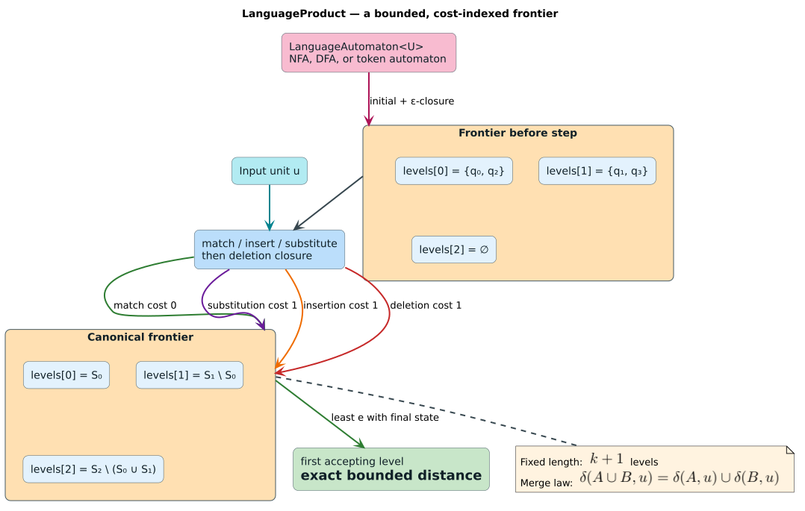
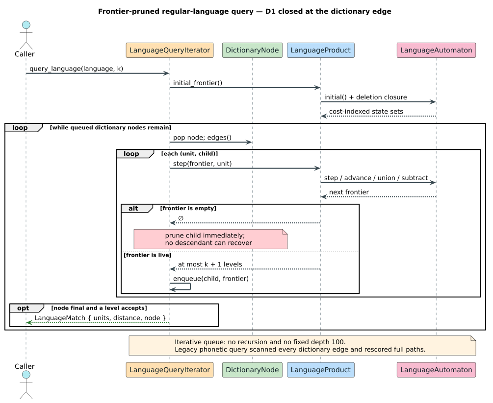

# Language products: fuzzy distance to a regular language

**Navigation:** [← Algorithm reference](../README.md) · [Intersection traversal](../03-intersection-traversal/README.md) · [Design specification](../../design/language-product.md)

This chapter derives and implements a bounded Levenshtein product over an
arbitrary finite-state language recognizer. It is written in literate-programming
form: each program fragment follows the invariant that justifies it.

## 1. The task

Ordinary fuzzy search compares a dictionary term with one query string.
Language search compares it with the nearest member of a regular language. For
term $`w`$ and language $`L`$:

```math
d(w,L)=\min_{v\in L} d_{\mathrm{Lev}}(w,v).
```

Examples include a regex such as `a(b|c)`, a phonetic rewrite NFA, or a DFA over
token IDs. The algorithm must return the exact minimum when it is at most
$`k`$, prune impossible dictionary subtrees, and remain generic over unit type
and dictionary backend.

## 2. The actors



*The recognized language supplies set transitions; the edit kernel supplies
cost movement.*

- `LanguageAutomaton<U>` represents the regular language.
- `StateSet` represents several active language states at once.
- `Frontier<StateSet>` maps each exact cost to one unioned state set.
- `LanguageProduct<U, L>` advances that frontier.
- `LanguageQueryIterator<N, L>` walks a dictionary with it.
- `LanguageMatch<N>` returns raw units, the exact distance, and the final node.

The trait operation `step(S, u)` consumes the matching unit $`u`$.
`advance(S)` consumes any one language unit. Both include any zero-width closure
required by the recognizer.

## 3. Build the initial frontier

Before any input has been consumed, the language may delete up to $`k`$
pattern symbols. Level zero therefore starts at the language's initial closure,
and higher levels are the deletion closure.

```text
ALGORITHM INITIAL-FRONTIER(language, k)
    frontier ← [EMPTY; k + 1]
    frontier[0] ← language.initial()

    FOR cost FROM 0 TO k - 1
        deleted ← language.advance(frontier[cost])
        frontier[cost + 1] ← frontier[cost + 1] ∪ deleted
        CANONICALIZE(frontier)

    RETURN frontier
```

The loop bound is checked before adding one. A `u8` budget means the largest
frontier has 256 slots.

## 4. Consume one input unit

Each current cost level generates the three operations that can consume a
dictionary unit, followed by a deletion closure that does not consume one.

```text
ALGORITHM STEP(frontier, unit, k)
    next ← [EMPTY; k + 1]

    FOR cost FROM 0 TO k
        states ← frontier[cost]
        IF states is EMPTY
            CONTINUE

        // Match: consume both language and input, cost zero.
        next[cost] ← next[cost] ∪ language.step(states, unit)

        IF cost < k
            // Insertion: consume input only.
            next[cost + 1] ← next[cost + 1] ∪ states

            // Substitution: consume any language symbol and the input.
            next[cost + 1] ←
                next[cost + 1] ∪ language.advance(states)

    CANONICALIZE(next)
    DELETE-CLOSURE(next)
    RETURN next
```

The code never enumerates individual NFA paths. A state set is advanced as a
set, which is why the union law is load-bearing.

## 5. Canonicalize by minimum cost

Equal-cost entries are unioned while they are inserted. Canonicalization then
removes states already covered by a cheaper level.

```text
ALGORITHM CANONICALIZE(frontier)
    covered ← EMPTY

    FOR cost FROM 0 TO k
        frontier[cost] ← frontier[cost] \ covered
        covered ← covered ∪ frontier[cost]
```

After the loop, every language state occurs at its minimum represented cost.
If state $`q`$ occurs at level $`e`$, keeping another copy at $`f>e`$ cannot
improve a continuation because every remaining edit cost is non-negative.

### The executable merge law

For every generated DFA/NFA state sets $`A`$ and $`B`$ and unit $`u`$, tests
assert:

```math
\operatorname{step}(A\cup B,u)
=\operatorname{step}(A,u)\cup\operatorname{step}(B,u).
```

The same law is proved in Rocq and Verus. The property test is not merely a
random correctness check; it is the executable form of the proof premise.

## 6. Read the answer

After all input units have been consumed, scan levels from zero upward. The
first level whose state set intersects the language's final states is the exact
bounded distance. If none accepts, the minimum exceeds $`k`$.

```text
ALGORITHM MIN-ACCEPTING-DISTANCE(frontier)
    FOR cost FROM 0 TO k
        IF language.is_accepting(frontier[cost])
            RETURN cost
    RETURN NONE
```

For a singleton literal language $`L=\{v\}`$, this reduces exactly to
ordinary Levenshtein distance $`d(w,v)`$.

## 7. Intersect with a dictionary



*A dead frontier prunes the whole child subtree; no final path reconstruction
or rescoring is performed there.*

```text
ALGORITHM QUERY-LANGUAGE(root, product)
    queue ← [(root, product.initial_frontier(), NO-PARENT)]

    WHILE queue is not empty
        (node, frontier, path-link) ← queue.pop_front()

        IF node is final
            distance ← product.min_accepting_distance(frontier)
            IF distance exists
                YIELD materialize(path-link), distance, node

        FOR (unit, child) IN node.edges()
            child-frontier ← product.step(frontier, unit)
            IF child-frontier is not empty
                queue.push_back(child, child-frontier, extend(path-link, unit))
```

The queue is heap-backed and iterative. Deep terms cannot overflow the call
stack, and there is no arbitrary maximum path depth. Parent links postpone path
allocation until a result is emitted.

## 8. Worked regex example

Let $`L=\{\texttt{ab},\texttt{ac}\}`$, dictionary
$`D=\{\varepsilon,\texttt{a},\texttt{ab},\texttt{ac},\texttt{abc},\texttt{bc},\texttt{zz}\}`$,
and $`k=1`$. The exact results are:

| Dictionary term | Nearest language word | Distance | Returned? |
|---|---|---:|---|
| `a` | `ab` or `ac` | 1 | yes |
| `ab` | `ab` | 0 | yes |
| `ac` | `ac` | 0 | yes |
| `abc` | `ab` or `ac` | 1 | yes |
| `bc` | `ac` | 1 | yes |
| empty | either | 2 | no |
| `zz` | either | 2 | no |

The corresponding API is:

```rust
use libdictenstein::double_array_trie::char::DoubleArrayTrieChar;
use liblevenshtein::transducer::{Algorithm, Transducer};

let dictionary = DoubleArrayTrieChar::from_terms([
    "", "a", "ab", "ac", "abc", "bc", "zz",
]);
let transducer = Transducer::new(dictionary, Algorithm::Standard);
let matches: Vec<_> = transducer
    .query_regex("a(b|c)", 1)
    .expect("bounded valid regex")
    .collect();
assert_eq!(matches.len(), 5);
```

This entry point requires `phonetic-rules`. The lower-level `query_language`
entry point and `SmallDfa` do not.

## 9. Boundary examples

| Case | Semantics |
|---|---|
| Both language and input accept empty | distance 0 |
| Empty input, shortest language word length $`r`$ | distance $`r`$ if $`r\le k`$ |
| Empty language | no result, except legacy empty-NFA compatibility wrappers described in the design |
| $`k=0`$ | exact regular-language intersection |
| Unicode precomposed vs combining sequence | compared as scalar sequences; no implicit normalization |
| `u64` token language | units are preserved exactly; no byte/string conversion |

## 10. Complexity and failure modes

Let $`W_Q`$ be the words in one state set. Frontier storage is
$`\mathcal{O}(kW_Q)`$ and each explored dictionary edge performs
$`\mathcal{O}(kW_Q)`$ set work. The query explores only edges whose frontier is
live.

The NFA subset space can still be exponential in the number of language
states. `query_regex` therefore rejects source-heavy and expansion-heavy inputs
whose conservative Thompson construction exceeds 4,096 states. This is a
resource ceiling, not a claim that all smaller patterns have equal runtime.

Dictionary backends used for term enumeration are expected to be finite and
acyclic along returned term paths. A cyclic graph needs a backend-specific
finite-walk contract.

## 11. Test and proof map

| Claim | Evidence |
|---|---|
| literal language equals scalar distance | 600-case `SmallDfa<u64>` differential property |
| byte compatibility wrapper retains Standard behavior | 500-case byte NFA/reference property |
| NFA frontier equals legacy product | 500-case character NFA differential property |
| merge and step commute | 600-case frontier property plus Rocq/Verus theorem |
| frontier stays at $`k+1`$ levels | property test, Verus arithmetic, Rocq bound |
| regex query is set-exact | brute-force finite-language example |
| untrusted input is bounded before allocation | long-literal and counted-repeat resource tests |
| D1 full scan is removed | 5,000-term instrumented test requiring over tenfold fewer edges |

Saved property seeds live beside `tests/proptest_language_product.rs` and are
committed when a generated counterexample is found.

## 12. References

- K. Thompson, “Regular expression search algorithm,” 1968.
  [doi:10.1145/363347.363387](https://doi.org/10.1145/363347.363387)
- R. A. Wagner and M. J. Fischer, “The string-to-string correction problem,”
  1974. [doi:10.1145/321796.321811](https://doi.org/10.1145/321796.321811)
- M. Mohri, F. Pereira, and M. Riley, “Weighted finite-state transducers in
  speech recognition,” 2002.
  [doi:10.1006/csla.2001.0184](https://doi.org/10.1006/csla.2001.0184)
