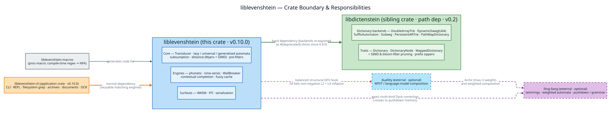

# Architecture Overview — the three concern-areas

This page is the **inter-crate** view of liblevenshtein: how the automata core,
the dictionary backends, the optional WFST integration, and the phonetic DSL
layer fit together. For the **intra-crate** module design (traits, internal
wiring) see the [Developer Guide → Architecture](../developer-guide/architecture.md).



## 1 · The crate boundary

liblevenshtein is one crate in a small family. Responsibilities are split along
a clean seam so each crate has a single concern:

| Crate | Relationship | Owns |
|---|---|---|
| **liblevenshtein** (this crate, `v4.0.0-rc.4`) | — | the Levenshtein **transducer/automata**, edit-distance functions, pre-filters, higher-level reusable engines (phonetic, time-series MSM, WallBreaker, contextual completion, fuzzy cache), plus WASM/FFI/serialization surfaces |
| **liblevenshtein-cli** (`v0.10.0`) | depends on this crate | the `liblevenshtein` executable, REPL, filesystem grep, compression/archive readers, document parsers, and optional OCR |
| **libdictenstein** (`v4.0.0-rc.4`) | **exact package dependency with a development path** (`Cargo.toml`: `path` plus `version = "=4.0.0-rc.4"`) | **all dictionary backends** (`DoubleArrayTrie`, `DynamicDawg`/`DynamicDawgU64`, `SuffixAutomaton`, `Scdawg`, `PersistentARTrie`, `PathMapDictionary`) and the `Dictionary` / `DictionaryNode` / `MappedDictionary` traits, plus SIMD + bloom-filter pruning and prefix zippers |
| **duallity** | **external, optional** integration (referenced for WFST composition; *not* a build dependency of this crate) | weighted finite-state transducer (WFST) / language-model composition |
| **liblevenshtein-macros** | **independent Cargo workspace**, local path integration | compile-time regex → NFA generation without duplicating the library `cdylib` artifact |

The dependency direction is strict and acyclic:
`liblevenshtein-cli → liblevenshtein → libdictenstein`. There are no reverse
edges, so each layer can be consumed without pulling in the layer above it.

## 2 · Why the dictionaries moved out (the 0.9.0 extraction)

Through v0.8 the dictionary backends lived inside liblevenshtein. In **v0.9.0**
they were extracted to **libdictenstein** for three reasons:

1. **Separation of concerns.** A trie/DAWG is useful far beyond fuzzy matching;
   isolating it lets other projects depend on the dictionaries without pulling in
   the whole automata stack.
2. **Independent evolution.** The backends' SIMD and bloom-filter work proceeds on
   libdictenstein's own release cadence.
3. **A smaller core.** liblevenshtein now owns only what is intrinsic to
   approximate matching — the automata and the engines built on them.

**Source compatibility is preserved.** The old paths
(`liblevenshtein::dictionary::DynamicDawg`, the `prelude` re-exports, …) still
resolve, as `#[deprecated]` shims in [`src/dictionary/mod.rs`](../../src/dictionary/mod.rs)
that forward to libdictenstein. Existing code keeps compiling; the deprecation
warning points each call site at its new home. New code should import the backends
directly from `libdictenstein` (or its `::char` submodules for the UTF-8 variants).
The only dictionary still *implemented* in this crate is
`PhoneticNormalizedDictionary(Char)`, because it is intrinsically tied to the
phonetic engine.

## 3 · How the concern-areas compose at query time

A query threads through all three areas in one lock-step pass:

```text
                 liblevenshtein                         libdictenstein
   ┌───────────────────────────────────────┐      ┌──────────────────────┐
   │  Transducer<D, P>                      │      │  D: Dictionary        │
   │   • Algorithm  (Standard/Transp/M&S)   │      │   DoubleArrayTrie     │
   │   • SubstitutionPolicy                 │◀────▶│   DynamicDawg(U64)    │
   │   • lazy/universal/generalized automata│ walk │   SuffixAutomaton     │
   └───────────────┬───────────────────────┘ lock │   Scdawg · ARTrie     │
                   │ builds on                step │   PathMapDictionary   │
   ┌───────────────▼───────────────────────┐      └──────────────────────┘
   │  Engines                               │
   │   phonetic · MSM · WallBreaker         │        duallity (optional)
   │   contextual · cache                   │      ┌──────────────────────┐
   └───────────────┬───────────────────────┘      │  WFST composition     │
                   └───────── optional ──────────▶ │  (language models)    │
                                                   └──────────────────────┘
```

1. A `Transducer<D, P>` wraps any `D: Dictionary` from libdictenstein and is
   parameterized by an `Algorithm` and a `SubstitutionPolicy`.
2. A query **lazily simulates** a parameterized Levenshtein automaton $`A(W, k)`$
   (position-sets reduced by subsumption) and **intersects** it with the
   dictionary in a single depth-first walk, pruning the instant no automaton state
   survives — see [Lazy vs. Eager Automata](../concepts/LAZY_VS_EAGER_AUTOMATA.md).
3. The **engines** are built on that core: phonetic matching forms the product of
   a pattern NFA with the Levenshtein automaton; time-series search reuses the
   position machinery for the MSM metric; WallBreaker splits large-$`k`$ queries and
   verifies pieces via the SCDAWG; contextual completion adds hierarchical scopes
   and draft buffers; the fuzzy cache wraps a dictionary in eviction policies.
4. **WFST composition** with `duallity` is an optional outer layer for
   language-model re-ranking; it is not required for ordinary fuzzy matching.

## 4 · The phonetic DSL layer

Phonetic matching is driven by two small languages compiled ahead of time:

- **`.llev`** — phonetic *rewrite-rule* files (53 languages), compiled lexer → AST
  → ruleset and applied to normalise terms.
- **`.llre`** — *LibLevenshtein Regex Expression* files, compiled to an NFA via
  Thompson/Glushkov construction (hence linear-time, ReDoS-resistant matching).

Their grammars and a worked walkthrough are in the
[DSL grammar reference](../grammar/README.md); the runtime is `src/phonetic/`.

## 5 · Where to read next

- [Developer Guide → Architecture](../developer-guide/architecture.md) — intra-crate module map and traits.
- [Algorithm Reference](../algorithms/README.md) — the layered architecture (01–09), bottom-up.
- [Security & threat model](../SECURITY.md) — the trust boundaries across these crates.
- [Concepts → Lazy vs. Eager Automata](../concepts/LAZY_VS_EAGER_AUTOMATA.md) — the query model in depth.

---

[← Documentation Index](../README.md)
