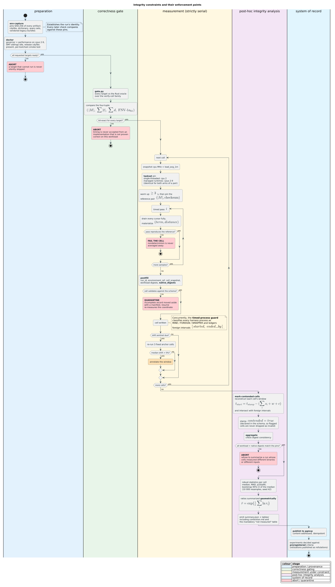

# Cross-Language Benchmark Methodology

**Audience:** anyone re-running, extending, or auditing the cross-language
benchmark program — in particular anyone re-measuring after optimization work,
who must produce numbers comparable to the existing baseline.

**Scope.** This document covers the *campaign*: what is measured and why, the
operational procedure, the integrity constraints the results depend on, and how
each constraint is mechanically validated. The *harness* contract — CLI surface,
the timed loop, checksum bit-layout, per-language clocks, post-fill fields — is
normative in
[`harnesses/common/PROTOCOL.md`](../../../benchmarks/cross-language/harnesses/common/PROTOCOL.md)
and is referenced rather than repeated here.

**Companion documents.** Measured results and their interpretation live in
[`java-comparison.md`](java-comparison.md), [`cpp-comparison.md`](cpp-comparison.md),
and [`java-parity-causal-analysis.md`](java-parity-causal-analysis.md).

---

## 1. Strategy

### 1.1 What question is being answered

Three distinct questions, deliberately not conflated:

| # | Question | Design | Deliverable |
|---|---|---|---|
| Q1 | Should a user of a legacy implementation migrate? | **Pair**: legacy arm vs Rust-backed arm *in the same host language* | `java-comparison.md`, `cpp-comparison.md`, JavaScript equivalent |
| Q2 | What does a language binding cost over the raw core? | **Atlas**: every binding vs the pure-Rust anchor, identical coordinates | overhead table |
| Q3 | Where is that cost, and is it removable? | **Decomposition**: pure core vs C ABI vs facade | feeds the optimization epic |

The pair design is what makes Q1 answerable. Comparing legacy Java against pure
Rust would answer a question nobody has — no Java user can call the Rust core
without a binding. Both arms of a pair therefore run in the same runtime, on the
same cpuset, with the same heap settings, so the only difference is the library.

### 1.2 The measurement model

A **cell** is the atomic unit: one (target, backend, mode, algorithm, distance,
query set) coordinate, measured as $`S`$ timed samples of one full pass.

A **pass** is: for every query in the set, run the query and drain its result
cursor to exhaustion, materializing every `(term, distance)` pair. Passes are
whole — never a per-query timer — because per-query timing at these magnitudes
(tens of microseconds) is dominated by clock overhead and scheduling noise.

Let $`t_i`$ be the duration of sample $`i`$. The reported statistic is the
median, with dispersion as median absolute deviation:

```math
\tilde{t} = \operatorname{median}(t_1, \dots, t_S), \qquad
\mathrm{MAD} = \operatorname{median}\bigl(\lvert t_i - \tilde{t} \rvert\bigr)
```

Medians and MAD are used rather than means and standard deviations because the
dominant contaminants — a GC pause, a JIT recompilation, a scheduler preemption
— are one-sided positive outliers. A mean absorbs them; a median resists them.

Per-query cost and throughput are derived from the median, where $`Q`$ is the
query count:

```math
\mu = \frac{\tilde{t}}{Q}, \qquad \text{throughput} = \frac{Q}{\tilde{t}}
```

### 1.3 Why ratios are aggregated geometrically

Across-cell summaries of *ratios* use the geometric mean:

```math
\bar{r}_{\text{geo}} = \exp\!\left(\frac{1}{n}\sum_{i=1}^{n} \ln r_i\right)
```

An arithmetic mean of ratios is not symmetric under inversion: averaging
$`\{2, 1/2\}`$ arithmetically gives 1.25, implying an advantage where there is
none, and reversing which arm is numerator changes the answer. The geometric
mean gives 1 either way. Since every headline in this program is a ratio, this
is a correctness requirement, not a stylistic preference.

### 1.4 Correctness precedes speed

**No timing is accepted from a target that has not first proven it computes the
right answer.** A fast wrong implementation is not a data point. The gate
(§3.2) is a hard precondition, and every timed pass re-checks its own result
against a pinned reference so that a mid-run divergence fails the cell rather
than being averaged in.

---

## 2. The workload

### 2.1 Construction

The dictionary is a standardized **aspell en_US** dump, filtered to `^[a-z]+$`
and `LC_ALL=C sort -u`'d, yielding **79,343 words**. Query sets are generated by
[`workload/generate_workload.py`](../../../benchmarks/cross-language/workload/generate_workload.py)
— Python standard library only, no third-party PRNG — and **committed**, so every
run in the program's history uses byte-identical inputs.

Determinism comes from **SplitMix64** seeded at 42, with a per-set seed derived
as `next(42 XOR fnv1a64(set_name))`. Range sampling uses rejection rather than
modulo, which would bias toward low indices.

### 2.2 Mutation model and realized distance

A query at nominal distance $`k`$ is produced by sampling a dictionary word and
applying $`k`$ edit operations. The naive version of this is wrong: applying
$`k`$ random edits does **not** guarantee the result is at distance $`k`$
from the source, because edits can cancel (inserting then deleting the same
character) or coincide with a shorter path.

The generator therefore computes the **realized** distance with an in-generator
reference dynamic program — Wagner–Fischer [1] for the standard family,
restricted Damerau (OSA) for the transposition family — and resamples until the
realized distance equals $`k`$. Mutants must additionally differ from their
source, be non-empty, and be at most 24 characters.

The generator also emits `queries-meta/*.jsonl` recording, per query, its source
term, requested $`k`$, realized distance, and whether the mutant is itself a
dictionary word — so any later analysis can condition on those facts rather than
assume them.

### 2.3 The sortedness invariant

Legacy Java and legacy JavaScript DAWG builders require terms in **case-sensitive
lexicographically increasing** order and silently produce a wrong automaton
otherwise; the legacy C++ builder returns `nullptr`. The dictionary is therefore
byte-sorted under `LC_ALL=C`, and the invariant is asserted in three independent
places: in the generator, at load time in *every* harness, and implicitly by the
legacy C++ builder, whose null return would abort the run.

Sorting is excluded from construction timing for all arms, so no implementation
is charged for a precondition the benchmark supplies.

### 2.4 Deliberate exclusions

The empty string is never emitted. Legacy Java 3.0.0 mishandles it (a
root-finality defect, fixed only in an unpushed local commit), and including it
would convert every cell into a measurement of that one bug rather than of query
performance. The exclusion is recorded here because it is a *choice*, and a
future run that wants to characterize the defect should deliberately reverse it.

---

## 3. Procedure

### 3.1 Order of operations

```
env-capture  →  doctor  →  gate  →  sweep (serial)  →  chain  →  aggregate  →  publish
```

Each stage refuses to proceed on a red predecessor. The sequence is encoded in
`scripts/run-all.sh`; the post-sweep stages are chained by
`scripts/run-remaining.sh` so a long campaign completes without an interactive
session outliving it.

### 3.2 The gate

Before any timing, every target must reproduce the **Rust oracle's** result
multiset exactly on a family of verify cells. Agreement is checked as a
four-tuple — match count, summed term byte length, summed distance, and an
order-insensitive FNV-1a-64 checksum over every `(term, distance)` pair — so
that a wrong *set* with a coincidentally right *count* still fails.

The checksum is order-insensitive by summation, because result ordering is
deliberately unspecified across implementations. Its bit-level definition and
confirmed test vectors are normative in PROTOCOL.md §8; the vectors were
re-derived independently in Rust, C, and Python before any of them was trusted.

Targets that genuinely lack a feature (legacy implementations have no
`damerau_levenshtein`) are recorded `skipped_unsupported` and are visibly
excluded — never silently dropped.

### 3.3 Serial execution

**Exactly one timed process runs at a time.** This is not a convenience; it was
established empirically. An earlier revision of this program ran CCD-aligned
parallel streams and was reverted: measured anchors showed MAD inflated 2–4×
(2.1–3.8% versus 1.2% on a quiet machine). Concurrency perturbs the very
quantity being measured, and throughput is not worth biased numbers.

Single-threaded targets are pinned to `taskset -c 2`; managed runtimes (JVM,
Node, .NET, Go, ClojureScript) get `-c 2-9`, and **both arms of a pair always
receive identical cpusets**.

Serialization is defined over invocation trees, not process counts. A JMH cell
has a Gradle launcher and forked benchmark JVMs whose command lines all name the
benchmark; those descendants are one timed invocation. The continuous guard
anchors ownership at the direct child of the monitor, collapses that complete
tree to one identity, and rejects any runner-owned harness outside it. This
retains the one-cell-at-a-time invariant without misclassifying a legitimate
managed-runtime fork as concurrent work.

### 3.4 Pausing and resuming

Every stage is resumable and skips work already on disk. To pause:

1. **Stop the chain first.** `run-remaining.sh` waits on the sweep's completion
   sentinel and treats the sweep's disappearance as "vanished", then proceeds to
   the post-sweep stages. Killing the sweep first therefore *triggers* the chain.
2. Stop the sweep, then any orphaned harness child.
3. **Quarantine incomplete cells** (§4.7).

Do **not** edit a running shell orchestrator. Bash reads a script incrementally
by byte offset, so editing `run-all.sh` or `run-remaining.sh` mid-execution can
make it execute garbage. Python stages (`aggregate.py`, `postfill.py`) are
invoked as fresh subprocesses per call and *are* safe to edit while a sweep runs.

---

## 4. Integrity constraints

Each constraint below states what must hold, why, and — in §5 — how it is
mechanically checked. Several exist because the corresponding failure was
actually observed in this program.

The diagram below shows where each constraint is enforced across the campaign,
and which failures abort the run rather than degrading it silently:



### 4.1 One binary per run

Every cell in a results directory must have been measured against the *same*
native libraries. A multi-hour sweep spans many opportunities for a rebuild; a
rebuild partway through silently splits one `run_id` across two different
binaries, and no amount of statistical care recovers from it.

Each non-legacy cell therefore records `native_digests`, the SHA-256 of every
cdylib it loaded, and the aggregator refuses to summarize when any digest
disagrees with the environment pin. Legacy arms link none of these libraries and
correctly carry no digests.

The digest helper is keyed on `(path, mtime_ns, size)`, **not** path alone. A
path-keyed cache would return the pre-rebuild digest and hide precisely the event
the field exists to expose.

### 4.2 One workload per run

Identical reasoning for the dictionary and query sets. Every cell records the
SHA-256 of both, checked against `environment.json`.

### 4.3 Exclusive access to the measured cores

Nothing other than the single timed process may run on the measurement cpuset.
Two independent detectors are required because they fail differently:

- **Load average** (`cell_snapshot.load_avg_1m > 8.0`) catches broad system load.
- **Foreign-process detection** catches a *core-pinned* competitor, which barely
  moves a 32-core load average. A profiler pinned inside the cpuset is invisible
  to the first detector and directly damaging to the measurement.

Foreign harness invocations are ledgered with their intervals, and cells whose
timed window overlaps one are flagged `contended` (§4.6).

The closing Java pair adds a stricter, topology-aware admission on both sides
of every timed cell. It samples all CPUs in the managed-runtime cpuset plus
their complete LLC groups immediately before and after JMH and enforces the
recorded per-CPU and LLC thresholds. The two successful observations commit as
one per-cell admission sidecar only after conversion and post-fill succeed.
Rejected host observations and continuous-monitor failures are stored in
separate ledgers; neither can enter the accepted aggregate.

### 4.4 A bounded, measured drift window

Long campaigns drift: ambient load falls, thermals change, the machine gets
faster or slower. Three fixed anchor cells are re-run roughly every 90 minutes;
a median shift above 5% annotates the window.

The consequence is a rule about **which comparisons are safe**:

- **Pair ratios are drift-safe** — both arms are measured time-adjacent.
- **Atlas ratios are not** — they divide by an anchor measured hours earlier, so
  they must be recomputed against an end-of-run anchor re-measurement before
  being quoted.

Observed drift in the `phase0` run reached **10.7%**, which is why this
distinction is enforced rather than assumed.

### 4.5 Every pass reproduces its own reference

Within a cell, the first pass pins `(matches, checksum)`; every subsequent timed
pass must reproduce it exactly. A cell that becomes nondeterministic fails rather
than reporting a median over disagreeing work.

### 4.6 Contamination is flagged, never deleted and never hidden

Suspect cells are annotated (`contended: true` plus a note), retained, and
reported. Two failure modes are explicitly designed against:

- **Silent averaging** — mixing contended and clean cells into one median.
- **Silent disappearance** — this one was nearly introduced here. The result
  schema sets `additionalProperties: false`, and the aggregator drops
  schema-invalid cells; an undeclared `contended` property therefore made
  contaminated cells *vanish from the summary* rather than be flagged, which is
  strictly worse than not marking them at all. Any new annotation must be added
  to the schema in the same change.

Correspondingly, the contended-cell count is computed from the marker's own
report rather than from the loaded cells, because a cell awaiting post-fill is
schema-invalid and would otherwise be dropped before being counted.

### 4.7 Incomplete records are quarantined, not trusted

A cell JSON is written by the harness but completed by the runner's post-fill
step, which adds `run_id`, `environment_ref`, `cell_snapshot`, and digests. A
cell missing those is not a bad measurement — it is an **incomplete record**
whose environment provenance was never captured.

Interrupting a batch leaves such cells behind. They are moved to
`results/<run>/quarantine/<timestamp>-<reason>/` with a `MANIFEST.md` explaining
why, so nothing is lost and a `--resume` re-measures the coordinate rather than
trusting a partial record.

The closing runners use the same rule transactionally. A result is resumable
only when its cell JSON and exact admission sidecar are both complete. Attempt
ledgers are truncated on retry, accepted ledgers are rebuilt solely from
committed sidecars, and a rejected raw JMH result moves under
`jmh/invalid-retries/` before the coordinate runs again.

### 4.8 Fairness between arms

Both arms of a pair must be given the same task, not merely a similar one:

- Identical dictionary, query sets, algorithm, and distance.
- Identical cpuset and, for managed runtimes, identical fixed heaps.
- **The migration-realistic API on both sides.** Both fully materialize
  `(term, distance)` per match. The Rust-backed stack also offers a zero-copy
  borrowed-batch API that is *deliberately not used*, because no legacy arm has
  an equivalent and using it would measure an API asymmetry rather than an
  implementation difference. Every such decision is enumerated in PROTOCOL.md §10.
- Sorting excluded from construction timing for everyone.

### 4.9 Preregistration

Hypotheses are opened in pgmcp with locked acceptance criteria **before** the
measurement that decides them, and are decided as recorded — refutations are
reported as refutations, not reinterpreted after the fact. `H-J1` (the Rust-backed
JVM binding would reach $`\ge`$ 3× legacy throughput) was refuted by roughly an order of
magnitude in the opposite direction and is published as refuted.

---

## 5. Validation

How each constraint is actually enforced, and what a violation does:

| # | Constraint | Mechanism | On violation |
|---|---|---|---|
| 4.1 | One binary | `postfill.py` records `native_digests`; `aggregate.py` `check_digest_consistency` | aggregation aborts |
| 4.2 | One workload | per-cell dictionary/query SHA-256 vs `environment.json` | aggregation aborts |
| 4.3 | Exclusive cores | `timed-proc-guard.sh` classifies invocation trees as MINE / FOREIGN / WRAPPER; topology-aware pre/post admission samples the full cpuset and LLC groups | protocol violation rejects the attempt; foreign intervals and host-load rejections are separately ledgered |
| 4.4 | Drift | 3 fixed anchor cells every ~90 min | window annotated; atlas ratios held provisional |
| 4.5 | Determinism | per-pass `(matches, checksum)` vs pinned reference | cell fails |
| 4.6 | Contamination visible | `mark-contended-cells.py` interval intersection; `contended` declared in schema | cells flagged and listed in `tables/contention.md` |
| 4.7 | Complete records | `postfill.py` + JSON-Schema validation + per-cell committed admission sidecar | incomplete raw result quarantined; coordinate re-measured |
| 4.8 | Fairness | gate equality on the result four-tuple; PROTOCOL.md §10 | gate fails |
| 4.9 | Preregistration | pgmcp experiments with seeded criteria | verdict recorded as measured |

### 5.1 Reconstructing a cell's measurement window

Contention intersection needs each cell's timed interval. A cell records
`timestamp_utc` at write time — the *end* of its measured region — so the start
is recovered by subtracting everything the harness did while timing:

```math
t_{\text{start}} = t_{\text{stamp}} - \Bigl(\textstyle\sum_i s_i + w + c\Bigr)
```

with $`s_i`$ the timed samples, $`w`$ the warmup floor, and $`c`$ the
construction time (the dictionary build happens in the same process and competes
for the same core). The result is deliberately **over-wide**: a false positive
costs one re-measurement, a false negative silently corrupts a published ratio.

Symmetrically, a foreign process's interval is `[started, ended_by]`, where
`started` is the true process start from `/proc/<pid>` and `ended_by` is the
first poll that found it **gone** — not the last poll that saw it alive, which
would understate the window by up to one poll interval.

### 5.2 Statistical reporting

Every published median carries a **bootstrap 95% confidence interval** (10,000
resamples, SplitMix64 seed 42, so the interval is itself reproducible), plus MAD
and the p10/p90 range. Sample counts: 30 per cell for self-timed harnesses, 20
for JMH cells (2 forks × 10 iterations). Formal hypothesis decisions require
deeper arms of $`\ge 51`$ replicates; broad cell agreement is corroborating
breadth, not the formal test, and is labelled as such.

---

## 6. Follow-up benchmarking after a code change

This is the common case: optimization work lands, and the question is whether it
helped.

### 6.1 Use a new results directory, never the old one

Measure into `results/phase1/` (or a later name). Do **not** add cells to
`phase0/`. A results directory is defined by its `environment.json` pins; mixing
binaries inside one violates §4.1, and the aggregator will refuse.

The comparison is then *between* directories: `phase0` is the baseline, `phase1`
the treatment, and the same `aggregate.py` statistics apply to each.

### 6.2 What must be held constant for the comparison to mean anything

| Must be identical | Rationale |
|---|---|
| Dictionary and query sets (committed artifacts) | otherwise the workload changed, not the code |
| Algorithms, distances, query sets, backends | ratios must be per-coordinate |
| cpusets, governor, heap settings | §3.3, §4.8 |
| The harness sources | a harness change alters what is measured — see the note below |
| Protocol version and checksum definition | equality of results must remain checkable |

**Harness changes are themselves treatment.** An outstanding example in this
program: the C harness accumulates its per-pass triple through pointers across a
call boundary, forcing per-match memory writes and inflating the measured C-ABI
floor by roughly 11%. Fixing it changes the number without any library change, so
the whole `c` target must be re-measured as one coherent unit rather than mixing
pre- and post-fix cells.

### 6.3 Procedure

```bash
cd benchmarks/cross-language

# 1. Rebuild the libraries under test (release, native codegen)
cd ../.. && RUSTFLAGS="-C target-cpu=native" cargo build --locked --release \
    --features native-bindings-full
cd ../libdictenstein && RUSTFLAGS="-C target-cpu=native" cargo build --release --features ffi

# 2. Fresh environment capture — this pins the NEW digests
cd - && python3 scripts/env-capture.py --results results/phase1

# 3. Readiness and correctness, before any timing
scripts/doctor.sh --targets rust,c,cpp,jvm-vinary,js-native
python3 scripts/gate.py results/phase1

# 4. Time (serial), then aggregate
scripts/run-all.sh --results results/phase1 --targets rust,c,jvm-vinary
python3 scripts/aggregate.py results/phase1
```

Correctness first: an optimization that changes results is a defect, and the gate
is what catches it. The gate must be green on `phase1` before any `phase1` timing
is interpreted.

### 6.4 Isolating concurrent development

Optimization work and measurement **cannot share this machine**. A git worktree
isolates *source* (`git worktree add ../liblevenshtein-opt <sha>`, with its own
`target/`, and never a shared `CARGO_TARGET_DIR`), which prevents §4.1 and §4.2
violations — but it does not isolate CPU. Profiling, rebuilding, and
benchmarking by another agent contend for cores and memory bandwidth regardless
of which directory the source lives in, and §4.3/§4.4 are then violated by
construction.

The `phase0` campaign was paused rather than worktree-isolated for exactly this
reason.

### 6.5 Direct pure-Rust versus legacy-pure-Java closure

This comparison is not `run-jvm-pair.sh parity`: that command compares the
Rust-backed JVM facade with legacy Java. The direct-language runner accepts
already-built executables and refuses to build while timing. It pins both arms
to one CPU, places its observer on a separately selected CPU, applies the strict
selected-core and complete-LLC gate before and after every child process, and
alternates which arm runs first. Every query replicate must agree on match
count, returned UTF-8 bytes, distance sum, and checksum before its atomically
renamed replicate directory is accepted. The Java execution-closure digest
includes the launcher, resolved JVM executable/version, runtime-classpath file,
and a deterministic digest of every classpath file or directory tree, and is
recomputed before and after every arm. A 51-pair run normally costs at least
five minutes because every sample is a fresh process with a complete warmup;
that deliberate isolation prevents one arm from inheriting another sample's
JIT or allocator state.

```bash
cd benchmarks/cross-language
scripts/run-pure-rust-legacy-java-pair.sh query \
  harnesses/rust/target/release/bench-cross-rust \
  .stage/jvm/legacy-launcher.sh \
  workload/dictionary.txt workload/queries/std-d2.txt workload/provenance.json \
  results/direct-standard-d2 51 0 standard 2 from_terms
```

The construction mode is run twice in fresh directories, once with
`from_terms` and once with `from_sorted_terms`. The Rust harness default remains
`from_terms` for compatibility; `--constructor from_sorted_terms` is explicit.
Each child performs one untimed warm construction before its single measured
construction. The causal construction matrix separately exercises genuinely
shuffled corpora and rejects a constructor before timing unless an extra
outside-timed build has the expected cardinality, contains every term, and
emits the pinned deterministic semantic checksum.

Note also that the two repositories are versioned separately: `liblevenshtein-rust`
and its sibling `libdictenstein`, which supplies every dictionary implementation
through the `ldict_*` ABI. Isolating only the first leaves the dictionary layer
shared.

---

## 7. Hazard register

Failure modes observed in this program, with the guard that now covers each.

| Hazard | Symptom | Guard |
|---|---|---|
| Library rebuilt mid-run | two binaries under one `run_id`, invisible | per-cell `native_digests` + aggregator check (§4.1) |
| Core-pinned foreign profiler | biased cells, normal load average | foreign-process ledger + interval intersection (§4.3, §4.6) |
| Over-broad process guard | wrapper shims counted as timed processes; false alarms mask real ones | guard classifies MINE / FOREIGN / WRAPPER by ancestry (§4.3) |
| Annotation not in schema | flagged cells silently dropped from summaries | declare in schema with the annotation (§4.6) |
| Batch interrupted | cells without environment provenance | quarantine with manifest (§4.7) |
| Editing a running `.sh` | orchestrator executes garbage | edit Python stages only; never a live shell script (§3.4) |
| Thermal/ambient drift | atlas ratios biased by anchor age | drift sentinels; anchor re-measurement (§4.4) |
| Harness-side accumulator aliasing | inflated ABI floor (~11%) | re-measure the target as one unit (§6.2) |
| Arithmetic mean of ratios | asymmetric, direction-dependent summaries | geometric mean (§1.3) |
| Parallel measurement | MAD inflated 2–4× | strict serial execution (§3.3) |

---

## 8. References

1. Wagner, R. A., & Fischer, M. J. (1974). The String-to-String Correction
   Problem. *Journal of the ACM*, 21(1), 168–173.
   <https://doi.org/10.1145/321796.321811>
2. Daciuk, J., Mihov, S., Watson, B. W., & Watson, R. E. (2000). Incremental
   Construction of Minimal Acyclic Finite-State Automata. *Computational
   Linguistics*, 26(1), 3–16. <https://doi.org/10.1162/089120100561601>
3. Schulz, K. U., & Mihov, S. (2002). Fast string correction with Levenshtein
   automata. *International Journal on Document Analysis and Recognition*, 5(1),
   67–85. <https://doi.org/10.1007/s10032-002-0082-8>
4. Efron, B., & Tibshirani, R. J. (1993). *An Introduction to the Bootstrap*.
   Chapman & Hall. <https://doi.org/10.1201/9780429246593>
5. Fleming, P. J., & Wallace, J. J. (1986). How not to lie with statistics: the
   correct way to summarize benchmark results. *Communications of the ACM*,
   29(3), 218–221. <https://doi.org/10.1145/5666.5673>
6. Steele, G. L., Lea, D., & Flood, C. H. (2014). Fast splittable pseudorandom
   number generators. *OOPSLA '14*, 453–472.
   <https://doi.org/10.1145/2660193.2660195>
7. Normative harness contract:
   [`harnesses/common/PROTOCOL.md`](../../../benchmarks/cross-language/harnesses/common/PROTOCOL.md)
