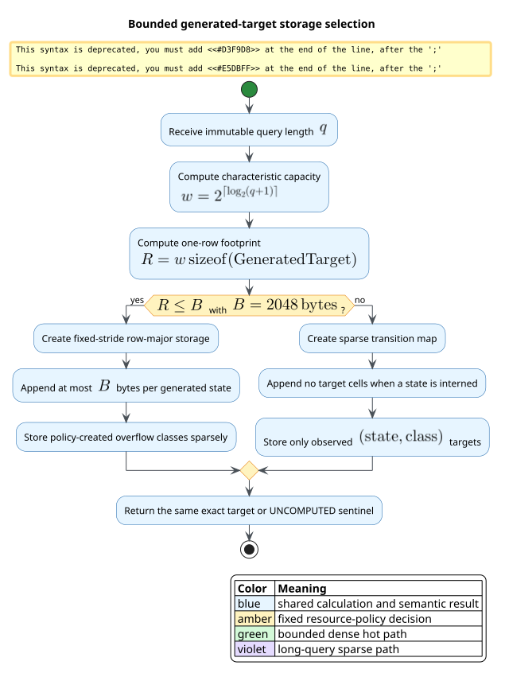

# Generated-target storage requalification

This report records the 2026-08-27 root-cause correction and independent
requalification of the positional automaton's generated-target cache. It is an
engineering and scientific evidence record: the public edit-distance semantics
do not change.

## 1. Scope and terminology

A **generated state** is a query-local identifier for one canonical positional
automaton frontier. A **characteristic class** groups dictionary labels that
produce the same Boolean match pattern against an immutable query. A
**generated target** is the cached successor for one generated-state and
characteristic-class pair.

The symbols used below are:

| Symbol | Meaning |
|---|---|
| $`q`$ | query length in input units |
| $`S`$ | generated states reached by one dictionary traversal |
| $`T`$ | distinct state/class transitions actually evaluated |
| $`w`$ | power-of-two characteristic-class capacity, $`2^{\lceil\log_2(q+1)\rceil}`$ |
| $`b`$ | size in bytes of one `GeneratedTarget` |
| $`B`$ | fixed production budget for one dense row, 2,048 bytes |

The implementation and its fixed decision point are illustrated below.



## 2. Root cause

The former `DenseGeneratedTargets` allocated $`w`$ cells whenever a generated
state was interned. Its target-table footprint was therefore:

```math
M_{\mathrm{old}} = S w b + M_{\mathrm{overflow}}.
```

Because $`w = \Theta(q)`$, a retained workload that reaches
$`S = \Theta(q)`$ states consumes $`\Theta(q^2)`$ target memory even when each
state observes only one outgoing characteristic class. The sparse overflow map
handled only classes beyond the initial stride; it did not prevent the empty
cells inside every ordinary row.

This was a representation defect, not an unavoidable property of Levenshtein
automata. A generated successor depends only on the exact pair
$`(\mathrm{state}, \mathrm{class})`$, so an unobserved pair needs no allocated
cell.

## 3. Corrected algorithm

`GeneratedTargets` selects storage once per immutable query. The following
pseudocode is literate: each branch states both the operation and the invariant
it preserves.

```text
SELECT-TARGET-STORAGE(query_length):
    width := next_power_of_two(query_length + 1)
    row_bytes := width * sizeof(GeneratedTarget)

    if row_bytes <= 2048:
        return Dense(width)
        // Every row is fixed-stride, but its footprint is globally bounded.
    else:
        return Sparse()
        // Interning a state allocates no target cells.

GET(state, class):
    return stored target when present; otherwise return UNCOMPUTED

SET(state, class, target):
    replace exactly that pair with target
```

For short queries, the dense table retains the contiguous cache-hit path that
motivated the earlier optimization. Its contribution is bounded by
$`S B`$, independent of query length. For long queries, the target table stores
only $`T`$ entries. Including the separately retained canonical state sources,
the generated-transition engine therefore requires linear storage in
$`S + T`$ rather than the product $`S q`$.

Custom substitution policies remain exact. In dense mode, classes beyond the
fixed stride use the sparse overflow map; in sparse mode, all classes use the
same pair key. `clear` preserves the selected representation while releasing
all query-local entries.

## 4. Semantic and property evidence

All commands ran in a user `systemd-run` scope with `MemoryMax=4G`,
`MemorySwapMax=0`, `TasksMax=128`, one Cargo build job, incremental compilation
disabled, and output captured under `target/verification/t0-6/logs/`.

| Gate | Evidence | Result |
|---|---|---|
| Example-based layout regression | Intern 10,000 long-query states; store two transitions | zero dense cells; exactly two sparse cells |
| Transition unit suite | Exact kernels, packed/positional equivalence, boundaries, both storage modes, and randomized oracle refinement | 32 passed; 866,364 KiB peak process RSS; zero swaps |
| Randomized refinement | Generate both storage modes, randomized overwrites, hits, and misses; compare with an independent `FxHashMap` oracle | 256 default proptest cases passed within the transition suite |
| Automaton/distance cross-validation | Compare Standard, transposition, and merge/split dictionary automata with independent distance functions and linear scans | 19 properties/regressions passed; 434,164 KiB peak process RSS; zero swaps |
| Levenshtein result properties | Exact match, distance bound, and completeness over close words | 4 properties/regressions passed; 234,136 KiB peak process RSS; zero swaps |
| Exact deep-query semantics | Consume 100,000 identical units through the positional Standard automaton | final distance 0 |
| Native-stack bound | Run that 100,000-unit query on an explicitly created 256 KiB thread | passed in 120.66 s |
| Static quality | Clippy over library, tests, and benchmarks with `benchmark-controls` and `-D warnings` | passed |

The randomized oracle checks the last-write semantics of every stored pair and
the `UNCOMPUTED` semantics of every absent pair. It varies initial capacity
across the dense/sparse boundary, so the two physical representations refine
one logical map contract.

The deep test creates the bounded worker thread inside the already compiled
test binary. Applying `RUST_MIN_STACK` to the Cargo command is invalid for this
purpose because it also constrains compiler worker threads; the test therefore
isolates the stack bound to the algorithm under test.

## 5. Causal performance and resident memory

The `benchmark-controls` feature exposes
`LIBLEVENSHTEIN_CAUSAL_FORCE_DENSE_GENERATED_TARGETS=1`. It recreates the former
dense selection only for rows no larger than 4 KiB, so an accidental benchmark
configuration cannot restore unbounded row allocation. Production builds do
not contain the control.

The paired Criterion workload uses unrestricted Damerau-Levenshtein distance 2
over deterministic, shared-prefix ASCII dictionaries. Twenty samples, a
one-second warm-up, and a three-second measurement window were used per query
length. Both arms were pinned to physical CPU 2; `/usr/bin/time -v` captured
process resources. Exploratory runs deliberately placed the candidate boundary
below each row and then forced dense storage, locating the representation
crossover rather than assuming it:

| Query length | Sparse 95% interval | Dense 95% interval | Measured choice |
|---:|---:|---:|---|
| 128 | 211.51–212.14 µs | 207.97–208.21 µs | dense midpoint 1.75% lower |
| 255 | 410.98–411.86 µs | 406.19–407.00 µs | dense midpoint 1.18% lower |
| 256 | 397.07–398.78 µs | 414.33–415.02 µs | sparse midpoint 4.06% lower |

The discontinuity is structural: query length 255 needs a 256-cell, 2,048-byte
row, whereas length 256 needs the next power of two, a 512-cell, 4,096-byte
row. The retained 2,048-byte policy therefore changes representation exactly
between those inputs.

The final production measurements were:

| Query length | Production representation | Production 95% interval | Causal disposition |
|---:|---|---:|---|
| 64 | dense | 105.82–105.98 µs | retained dense hot path |
| 128 | dense | 209.43–210.00 µs | retained dense advantage |
| 255 | dense | 405.80–407.13 µs | last dense width |
| 256 | sparse | 404.21–405.36 µs | forced dense was 421.39–422.14 µs; sparse was 3.74–4.00% faster |
| 512 | sparse | 868.12–870.69 µs | dense control refused the 8 KiB row as designed |

The warmed adaptive process reached 59,968 KiB peak resident set size (RSS),
while the dense-control process reached 60,044 KiB: 76 KiB, or 0.13%, lower for
the adaptive process. Both reported zero swaps, 99% CPU utilization, and a
successful exit inside the 4 GiB cgroup. This process-wide RSS includes Cargo,
Criterion, the benchmark binary, dictionaries, and result buffers, so it
understates the target-table fraction rather than isolating it. Timings for
rows that select the same representation are not compared across processes;
such differences measure temporal host noise, not the storage policy.

Reproduce the two arms with:

```bash
systemd-run --user --scope \
  -p MemoryMax=4G -p MemorySwapMax=0 -p TasksMax=128 \
  env CARGO_BUILD_JOBS=1 CARGO_INCREMENTAL=0 CARGO_PROFILE_BENCH_DEBUG=0 \
  /usr/bin/time -v taskset -c 2 \
  cargo bench --bench query_iterator_benchmarks \
  --features benchmark-controls -- generated_target_storage_crossover

systemd-run --user --scope \
  -p MemoryMax=4G -p MemorySwapMax=0 -p TasksMax=128 \
  env CARGO_BUILD_JOBS=1 CARGO_INCREMENTAL=0 CARGO_PROFILE_BENCH_DEBUG=0 \
  LIBLEVENSHTEIN_CAUSAL_FORCE_DENSE_GENERATED_TARGETS=1 \
  /usr/bin/time -v taskset -c 2 \
  cargo bench --bench query_iterator_benchmarks \
  --features benchmark-controls -- generated_target_storage_crossover
```

## 6. Security and operational boundaries

The change removes eager empty-cell amplification by untrusted query length.
It does not make arbitrary queries free: canonical states and evaluated
transitions still consume heap, and public callers remain responsible for
choosing workload limits appropriate to their service. The library never uses
recursion in this path; construction, lookup, insertion, traversal, and drop
operate with constant native call-stack depth.

`FxHashMap` is an internal performance map, not a security boundary or a
persisted format. Generated state and class identifiers are dense query-local
integers; map iteration order is never exposed and cannot affect result order
or edit distance. Correctness depends only on exact key equality.

## 7. Decision

The dense generated-target representation's superlinear root cause is fixed.
The bounded adaptive implementation is retained because it:

1. preserves the exact logical map contract in example-based and randomized
   tests;
2. proves constant native-stack behavior at 100,000 units on 256 KiB;
3. changes long-query storage from eager state-by-width allocation to observed
   transitions;
4. retains the bounded dense short-query hot path; and
5. crosses to sparse storage exactly after the last measured dense advantage.

This result qualifies the representation itself. Any downstream adopter must
still qualify its own feature graph, semantic role, corpus quality, limits,
toolchain, and supply-chain constraints.
