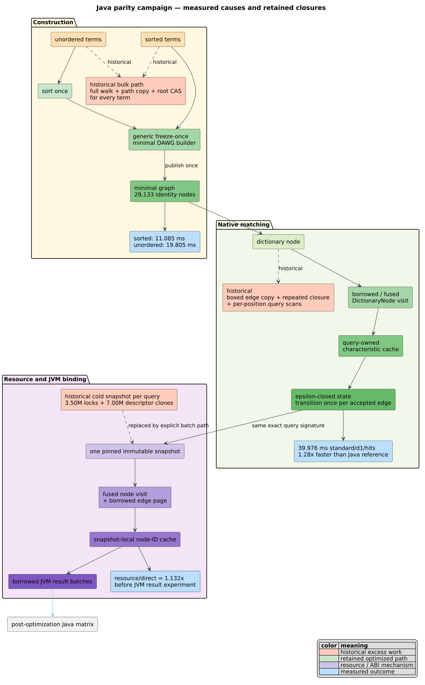
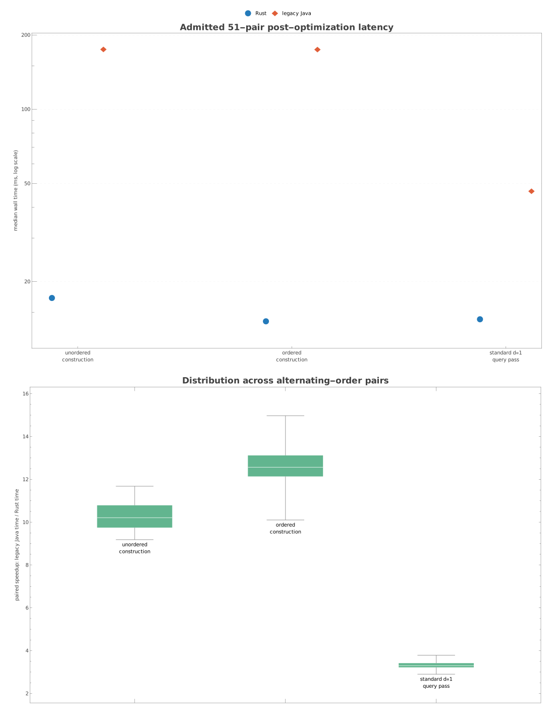

# Optimization and profiling methodology

This document is the operational contract for turning a suspected performance
problem into an accepted optimization in liblevenshtein-rust and its Vinary
Tree dependencies. It complements the cross-language
[benchmark methodology](cross-language/methodology.md), the
[Java-parity causal analysis](cross-language/java-parity-causal-analysis.md),
and the [propagation matrix](optimization-propagation.md).

The campaign optimizes only after it can explain a gap. A fast result is not
accepted unless it preserves exact semantics, survives a controlled comparison,
and reaches every applicable automaton, dictionary backend, and binding.



## 1. Terms and evidence hierarchy

A **workload cell** fixes the implementation, dictionary backend, unit domain,
algorithm, maximum distance, and query set. A **replicate** is one admitted
measurement of both comparison arms. A **pair** alternates arm order and is the
unit of causal comparison. A **treatment** changes one mechanism; the
**control** retains the previous mechanism in the same binary when possible.

Evidence is ranked from strongest to weakest:

1. exact semantic signatures and invariant/work-counter identities;
2. alternating-order, topology-admitted paired timings from the same binary;
3. paired timings from digest-pinned control/treatment binaries when type
   layout makes a same-binary switch impossible;
4. hardware/software profiles explaining where time, allocations, locks, cache
   misses, or callbacks occur;
5. source/bytecode inspection explaining why that work occurs; and
6. intuition or analogy, which creates a hypothesis but cannot accept one.

No lower tier overrules a contradiction in a higher tier. A flame graph can
locate work but does not prove that removing it preserves results; a benchmark
can show a change but does not by itself explain causality.

## 2. The hypothesis lifecycle

Every optimization follows this state machine:

```text
observation
  -> causal decomposition
  -> falsifiable hypothesis + predicted counters
  -> correctness/work gate
  -> admitted A/B timing
  -> profile the residual
  -> accept, reject, or retain as workload-conditional
  -> propagate and re-gate every applicable surface
```

A hypothesis record names the target mechanism, control, treatment, predicted
semantic invariants, predicted work changes, workloads that could falsify it,
hard resource bounds, and a rollback switch. Rejected designs and invalidated
runs remain in the evidence tree with their reason; they are not silently
deleted or recycled as positive evidence.

The Java-parity investigation illustrates the discipline. The JVM garbage
collector was a plausible construction hypothesis. Unified GC logs showed its
pauses were a cost paid by Java and too small to explain the gap, while counters
showed Rust publishing and reclaiming one persistent graph revision per term.
The primary cause was therefore the construction algorithm; allocation/reclaim
policy was secondary. The accepted bulk builder removes the excess revisions
instead of merely moving their destruction to another thread.

## 3. Correctness before timing

Each query pass drains all matches and folds the result multiset into a pinned
signature: count, total term bytes/units, summed distance, and an
order-insensitive 64-bit checksum. Construction additionally verifies term
count, membership of every source term, and a deterministic structural or
semantic checksum. Control and treatment must agree exactly.

Counter identities test internal laws. Examples include: enumerated edges equal
transition attempts; accepted transitions equal queued live children under the
specified scheduler; one successful retain has one release; a compact graph's
node ranges cover its edge array without gaps/overlap; and a captured snapshot
does not change after live mutation. These identities catch equal-looking
output produced by invalid intermediate work.

Timing code is compiled separately from diagnostic counters. Relaxed atomics,
logging, profiling hooks, and allocation instrumentation perturb the hot path;
they explain work but do not supply headline latency.

## 4. Workload design

The anchor is the committed 79,343-term aspell `en_US` dictionary and committed
1,000-query sets. Structural strata add prefix-heavy, suffix-heavy, mixed
Unicode, and packed-`u64` corpora in sorted and deterministically shuffled
forms. The pair members contain identical semantic terms.

Axes are varied because one friendly corpus can hide a wrong optimization:

| Axis | What it can expose |
|---|---|
| sorted vs shuffled terms | ordered-builder preconditions, sort cost, edge cloning, locality |
| prefix-heavy vs suffix-heavy | path sharing vs equivalent right-language minimization |
| byte, Unicode scalar, `u64` | accidental byte specialization or transcoding |
| exact hits, edited terms, OOV | result materialization vs rejected-edge traversal |
| distance and algorithm | frontier size, subsumption, special transition states |
| native vs resource vs host facade | core work, provider callbacks, marshalling, managed allocation |
| mutable/persistent/suffix backends | applicability and representation-specific regressions |

The [all-backend protocol](backend-propagation-evidence.md) emits explicit
`inapplicable` rows. It never assigns a finite-term construction optimization
to a suffix index or fabricates a timing for an unsupported unit domain.

## 5. Host admission and thermal control

Benchmark processes are pinned. Before and after every pair, the admission gate
samples the selected CPU, its simultaneous-multithreading sibling, every CPU in
the same last-level-cache group, and host-wide load. A continuous monitor
rejects overlapping benchmark/profiler processes. Rejected observations go to
a separate ledger and never enter the accepted CSV.

CPU availability elsewhere on a 32-core host is not enough: a task on the same
cache complex can perturb memory bandwidth, cache residency, boost clocks, and
thermals. Conversely, unrelated load on another independent cache group need
not invalidate a pinned cell when all local thresholds pass. The topology
ledger makes that judgment auditable instead of relying on a visual CPU meter.

Compilation, profiling, and timed measurement are separate phases. The first
post-build sample is frequently rejected because compilation has heated the
cache complex. Warmups stabilize page faults, JIT compilation where applicable,
allocator state, and branch/cache populations; they are never reported as
samples.

## 6. Statistical model

Let paired times be Rust `$`r_i`$` and legacy/control `$`c_i`$`. The primary
cell statistic is the median. Dispersion is median absolute deviation (MAD):

```math
\widetilde{t}=\operatorname{median}(t_1,\ldots,t_n),\qquad
\operatorname{MAD}=\operatorname{median}(|t_i-\widetilde{t}|)
```

The paired speedup is `$`s_i=c_i/r_i`$`; values above one favor the treatment.
Confidence intervals for medians use a deterministic bootstrap. The analyzer
also reports the paired-difference distribution, pooled Cohen's `$`d`$`, and
whether median intervals overlap. Across heterogeneous cells, ratios aggregate
with the geometric mean:

```math
\bar{s}_{\mathrm{geo}}=\exp\left(\frac{1}{m}\sum_{j=1}^{m}\ln s_j\right)
```

Practical significance accompanies statistical significance. The propagation
matrix uses construction negative controls to calibrate protocol noise; ratios
near one whose bootstrap interval includes one are classified as equivalent,
not wins or regressions. Many exploratory hypotheses are not promoted merely
because one noisy `$`p`$` value crossed a threshold.

The benchmark program follows the steady-state/replication cautions of Georges,
Buytaert, and Eeckhout [1], the experimental-design guidance of Kalibera and
Jones [2], and Efron's bootstrap construction [3].

## 7. Profiling without GUI side effects

Use [`profile-headless.sh`](../../benchmarks/causal/profile-headless.sh) for all
profiles:

```sh
benchmarks/causal/profile-headless.sh uprof OUTPUT -- BINARY ARGUMENTS
benchmarks/causal/profile-headless.sh heaptrack OUTPUT -- BINARY ARGUMENTS
benchmarks/causal/profile-headless.sh perf-stat OUTPUT -- BINARY ARGUMENTS
```

- AMD uProf uses `AMDuProfCLI collect` and `AMDuProfCLI report` only. Record
  binary digest, preset, call-stack depth, CPU, command, and environment.
- Heaptrack always records with `--record-only` and analyzes with
  `heaptrack_print`. Never launch `heaptrack_gui`, `heaptrack -a`, or
  `heaptrack --analyze` on this campaign.
- `perf stat` supplies counters such as cycles, instructions, branches,
  cache-misses, and context switches; it does not replace a time profile.
- JVM unified GC logs quantify pause frequency/time. Bytecode inspection and
  identity-based graph probes explain legacy algorithms without trusting
  source-level guesses.

Profiles answer “where and why”; uninstrumented paired trials answer “how
much.” The final post-optimization uProf evidence, exact digests, commands, and
host admissions are cataloged in
[`evidence/2026-08-20/README.md`](../../benchmarks/causal/evidence/2026-08-20/README.md).

## 8. Reproducible statistical visualization

The figure below is generated from three complete 51-pair result sets. The
upper panel is log-scaled because construction/query latencies differ in scale;
compare Rust with Java *within* an experiment, not construction with query as
if they were the same workload. The lower panel preserves all paired speedup
distributions and alternating arm order.



The Wolfram Language source is
[`optimization-benchmark-plots.wls`](../../benchmarks/causal/plots/optimization-benchmark-plots.wls).
It reads the committed `samples.csv` and `analysis.json` artifacts and exports
SVG; it does not time code or mutate raw evidence. Run it through an authorized
Wolfram kernel:

```wl
Get["benchmarks/causal/plots/optimization-benchmark-plots.wls"]
```

Generated graphics are presentation artifacts. Conclusions remain traceable to
raw rows, SHA-256 closures, admissions, schemas, and analyzers.

## 9. Acceptance and propagation

An optimization is accepted only when:

1. semantic/work gates pass and resource bounds remain intact;
2. the predicted mechanism changes in counters/profiles;
3. admitted paired timings show a material benefit or a justified conditional
   crossover;
4. no applicable cell regresses beyond calibrated noise;
5. production builds do not retain benchmark-control branches or diagnostics;
6. ownership, error, concurrency, and ABI contracts remain unchanged or are
   versioned/documented; and
7. every automaton/backend/binding is marked direct, adapted, indirect, or
   inapplicable with a reason.

Generic kernels are preferred when monomorphization preserves specialization:
borrowed edge visitors, unit-generic transition caches, snapshot traversal
graphs, and lexical result drains are shared. Representation-specific fast
paths remain separate when abstraction would add a branch, allocation, virtual
dispatch, or weaker invariant to the hot loop. The exhaustive inventory is in
the [optimization propagation matrix](optimization-propagation.md).

Foreign bindings inherit native improvements automatically only below their
boundary. Each binding must still be remeasured for cursor batching,
marshalling, host allocation, runtime identity, and deterministic cleanup.
Java uses `AutoCloseable` with try-with-resources; Kotlin uses `use`; Scala uses
`Using`; C++ uses move-only RAII; other guides document their equivalent.

## 10. References

1. A. Georges, D. Buytaert, L. Eeckhout. “Statistically Rigorous Java
   Performance Evaluation.” *OOPSLA*, 2007.
   [DOI:10.1145/1297027.1297033](https://doi.org/10.1145/1297027.1297033)
2. T. Kalibera, R. Jones. “Rigorous Benchmarking in Reasonable Time.” *ISMM*,
   2013. [DOI:10.1145/2660193.2660196](https://doi.org/10.1145/2660193.2660196)
3. B. Efron. “Bootstrap Methods: Another Look at the Jackknife.” *The Annals
   of Statistics* 7(1), 1979.
   [DOI:10.1214/aos/1176344552](https://doi.org/10.1214/aos/1176344552)
