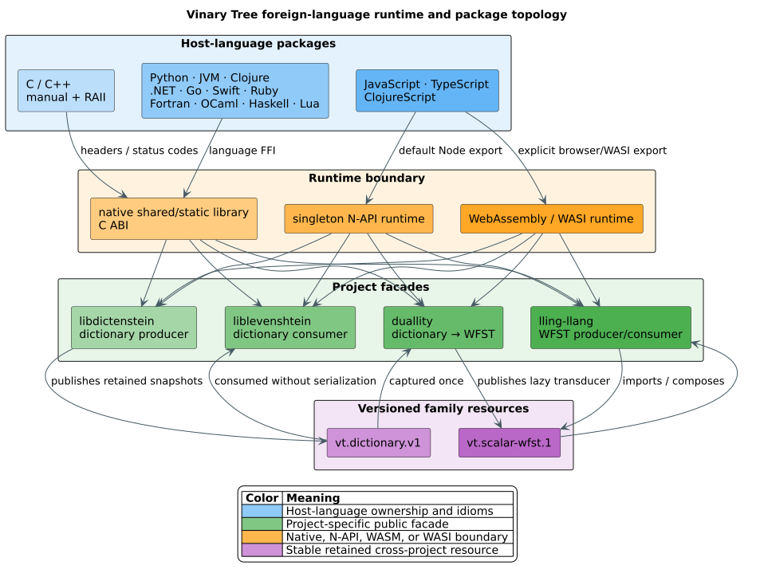

# Language-binding documentation hub

The map of everything written about liblevenshtein's ABI and language
bindings, in reading order. Two layers exist and never duplicate each
other: the **family canon** (hosted in the standalone
`vinary-tree-interop` repository) specifies the shared resource ABI every
Vinary Tree project speaks; the **project corpus** (this directory and its
satellites) specifies what liblevenshtein builds above it — the `llev_*` C
surface, the resource consumer, the cursor laws, and the JS/WASM topology.

## Reading order

1. **Decide-and-orient:** [`docs/language-bindings.md`](../language-bindings.md)
   — the architecture decision (small versioned C resource ABI + generated
   constants + hand-written facades; why not UniFFI), the three layers, the
   snapshot/marshalling contracts, tiers, distribution, and platform
   policy.
2. **The family canon** (normative across the core project family):
   [interop README](https://github.com/vinary-tree/vinary-tree-interop/blob/master/README.md) — the portal ·
   [ABI reference](https://github.com/vinary-tree/vinary-tree-interop/blob/master/docs/abi-reference.md) — the
   annotated header walk with the refcount/paging/snapshot laws ·
   [evolution policy](https://github.com/vinary-tree/vinary-tree-interop/blob/master/docs/abi-evolution.md) —
   the four version counters and the additive-versus-fork rules ·
   [security model](https://github.com/vinary-tree/vinary-tree-interop/blob/master/docs/security-model.md) —
   zones, containment, validation duties.
3. **The project corpus** (this layer):

| Document | What it specifies |
|---|---|
| [c-abi-reference.md](c-abi-reference.md) | All 76 `llev_*` functions: signatures, preconditions, exact returnable status sets, ownership, thread safety, complexity; the 13-value status table and its `VtStatus` mapping; standalone automata; the bounded query cache; the lease protocol with literate batch-loop and reducer pseudocode; a compile-checked complete C consumer. |
| [distance-domains.md](distance-domains.md) | Domain-preserving standalone distance semantics: four edit families over Unicode scalars, arbitrary bytes, and u64 application tokens; recurrences, threshold behavior, allocation strategy, ABI naming, Julia dispatch, citations, and generated differential verification. |
| [standalone-automata.md](standalone-automata.md) | API-revision-5 generalized and universal automata: runtime operations, exact scaled costs, directional substitution policies, three unit domains, online observations, non-monotone generalized liveness, hard limits, lifecycle, performance, and verification. |
| [resource-consumer.md](resource-consumer.md) | The safe-Rust layer under the C ABI: intake (retain-validate-else-release), `ForeignNode` domains, the `CallGate` (VT-GATE-1..3), the status wire rule and fault latch, the total `BindingError` map, and the two-pass arena fixup. |
| [query-cache.md](query-cache.md) | The shared bounded repeated-query layer: exact revision identity, binary keys, TinyLFU admission, SIEVE eviction, lock-free-by-ownership concurrency, Rust/C/Julia/Raku APIs, security, and measurement guidance. |
| [julia-family-qualification.md](julia-family-qualification.md) | Evidence-led qualification of the six Julia packages, including exact commits and CI, implemented and missing capability groups, package/release status, and the reviewed distribution-only inapplicability proof. |
| [collection-protocols.md](collection-protocols.md) | The approved native-Rust and foreign-language collection design: current gaps, generic snapshot traversal, idiomatic `Iterator`/`Set`/`Map` surfaces, batched ABI acceleration, lifecycle rules, gates, and implementation work packages. It is a roadmap, not a claim that every adapter already ships. |
| [package-documentation-publication.md](package-documentation-publication.md) | The evidence model for ecosystem documentation: canonical destinations, immutable-source invariants, public readback algorithm, RC5 findings, and the protected deployment sequence. |
| [wasm-topology.md](wasm-topology.md) | The JS exception to modular packaging: the `@vinary-tree/javascript-runtime` umbrella, the three runtime paths, the runtime-identity guard, WASI preopen policy, and panic-versus-status discipline. |
| [../theory/snapshot-semantics.md](../theory/snapshot-semantics.md) | The cursor laws S1-S6 as display math, the $`\mathcal{O}(1)`$-capture argument from path-copied revisions, the partial-persistence classification, the refcount lineage, and the law ↔ model ↔ test correspondence table. |
| [../security/binding-trust-model.md](../security/binding-trust-model.md) | The family trust model instantiated for this consumer: `boundary()`, the bounded error channel, the decoded status wire, lease-refusal as UAF prevention, duty status per hostile-input class. |
| [FINDINGS_LEDGER.md](FINDINGS_LEDGER.md) | The scientific ledger of confirmed binding findings (LLEV-B1…), append-only, with fix commits and verification. |
| [../releasing-language-bindings.md](../releasing-language-bindings.md) | The release process: publish-order DAG, registry coordinates, credentials, pin-coherence preconditions, gates. |

4. **Machine-readable governance** (the sources the gates enforce):

| Artifact | Role |
|---|---|
| [`bindings/api.json`](../../bindings/api.json) | The single source of truth: versions, status/algorithm/order/automata enums, the 76 modeled `cFunctions`, marshalling and snapshot law strings, forbidden owned objects, the canonical query snapshot fixture, and entries-v1 identity/status/flag/operation/layout pins. `scripts/generate-bindings.py` emits the headers, constants, and fixtures; `--check` pins them in CI. |
| [`bindings/api-surface-map.json`](../../bindings/api-surface-map.json) | The per-facade completeness model driving the coverage matrix. |
| [`bindings/conformance/`](../../bindings/conformance) | Generated conformance fixtures: the query-start snapshot oracle, entries-v1 constants and LP64/ARM32 layouts, and the facade completeness matrix. |
| [`bindings/conformance/public-api-traceability.tsv`](../../bindings/conformance/public-api-traceability.tsv) | One row per modeled facade function, enum, or traversal protocol, with source, guide, executable-test, and canonical-example evidence plus explicit direct-reference gaps. |
| [`bindings/conformance/extension-provider-matrix.tsv`](../../bindings/conformance/extension-provider-matrix.tsv) | The exhaustive llattice and lling-llang public-trait × family-language ledger, including the stable foreign translation strategy, ABI capabilities, evidence, and remaining implementation work for every cell. Its [governance guide](host-extension-trait-governance.md) defines the statuses and fail-closed discovery algorithm. |
| [`docs/verification/binding-citation-ledger.json`](../verification/binding-citation-ledger.json) | Crossref-verified metadata for the DOI-bearing binding, snapshot, WASM, and benchmarking references enforced by the documentation gate. It pins identity, not merely resolver existence. |
| [`scripts/check-bindings.py`](../../scripts/check-bindings.py) | The contract gate: symbol parity model ↔ Rust ↔ header, entries-v1 metadata/header/mirror/fixture agreement, forbidden retired APIs, umbrella identity guard, coordinates, feature-alias policy. |
| [`scripts/generate-binding-guides.py`](../../scripts/generate-binding-guides.py) | Idempotently renders liblevenshtein's shared operational contract, exhaustive modeled facade-symbol index, modeled type/protocol exposure, and intended-usage paths in every shipped facade guide while preserving its hand-written tutorial. |
| [`scripts/check-binding-docs.py`](../../scripts/check-binding-docs.py) | Fails closed on an undocumented declared language, missing required topic, stale generated section, missing modeled public symbol, absent intended-usage table or executable example, wrong or retired package coordinate, untagged code fence, placeholder, broken local link/anchor, or DOI whose label, title, lead author, year, and governed source disagree with the verified citation ledger. |
| [`release/package-documentation.json`](../../release/package-documentation.json) | One package-surface ledger separating registry publication, rendered guides, generated references, immutable source, and dated public readback evidence. |
| [`scripts/check-package-documentation.py`](../../scripts/check-package-documentation.py) | Validates the package-documentation ledger locally, reads public services on demand, and fails the strict gate while publication is pending or any released guide or API destination is incomplete. |
| [`scripts/build-package-documentation.py`](../../scripts/build-package-documentation.py) | Builds the native Doxygen, Python pdoc, and JavaScript TypeDoc references from the authoritative release version and source tag, then fails when a modeled public declaration is absent or undocumented. |
| [`scripts/package-documentation-site.py`](../../scripts/package-documentation-site.py) | Creates reproducible, hash-manifested release archives and safely assembles every immutable version into one GitHub Pages tree without deleting historical references. |
| [`.github/workflows/package-documentation.yml`](../../.github/workflows/package-documentation.yml) | Manual exact-tag workflow that builds all references, preserves byte-identical release assets, and deploys the reconstructed version history through the protected `github-pages` environment. |
| [`docs/verification/ABI_INVARIANTS.tsv`](../verification/ABI_INVARIANTS.tsv) | The canonical invariant registry (VT-LIFE, VT-QI, VT-GATE, VT-ABI, and the wave-W3 rows as they land) tying each law to its model, test, and gate. |

5. **Diagrams:** the binding suite lives in
   [`docs/diagrams/bindings/`](../diagrams/bindings) (sources + committed
   SVGs, rendered by `docs/diagrams/render.sh bindings`). The twenty diagrams
   cover ABI shape and evolution, interface negotiation, trust zones, family
   data and release flow, snapshots and leases, reducers, collection views,
   conformance gates, JavaScript runtime topology, and WASM/WASI boundaries.
   Every source has one SVG, every SVG is embedded in a living document, and
   `docs/diagrams/render.sh --check bindings` proves byte-for-byte freshness
   without using system `tmpfs` storage.

## Language coverage matrix

Every link is a shipped package guide rather than an implementation-only
directory. A shared-runtime guide contains separate executable idioms for each
language named in its row. A dash reports current absence; it is an open
implementation and documentation cell unless the generated
[`family-completeness-matrix.tsv`](../../bindings/conformance/family-completeness-matrix.tsv)
contains a reviewed architectural inapplicability proof. Absence by itself is
never such a proof.

| Language/runtime | liblevenshtein | libdictenstein | lling-llang | duallity | llattice | interop |
|---|---|---|---|---|---|---|
| C | [guide](../../bindings/c/README.md) | [ABI and guide](https://github.com/vinary-tree/libdictenstein/blob/master/docs/bindings/c-abi-reference.md) | [ABI and guide](https://github.com/vinary-tree/lling-llang/blob/master/docs/api/c-abi-reference.md) | [guide](https://github.com/vinary-tree/duallity/blob/master/docs/guides/07-language-bindings.md) | — | [native contract](https://github.com/vinary-tree/vinary-tree-interop/blob/master/README.md) |
| C++ | [guide](../../bindings/cpp/README.md) | [guide](https://github.com/vinary-tree/libdictenstein/blob/master/bindings/cpp/README.md) | [guide](https://github.com/vinary-tree/lling-llang/blob/master/bindings/cpp/README.md) | [guide](https://github.com/vinary-tree/duallity/blob/master/bindings/cpp/README.md) | — | [native contract](https://github.com/vinary-tree/vinary-tree-interop/blob/master/README.md) |
| Python | [guide](../../bindings/python/README.md) | [guide](https://github.com/vinary-tree/libdictenstein/blob/master/bindings/python/README.md) | — | — | — | [adapter guide](https://github.com/vinary-tree/vinary-tree-interop/blob/master/bindings/python/README.md) |
| Java, Kotlin, Scala | [JVM guide](../../bindings/jvm/README.md) | [JVM guide](https://github.com/vinary-tree/libdictenstein/blob/master/bindings/jvm/README.md) | — | — | — | [JVM adapter](https://github.com/vinary-tree/vinary-tree-interop/blob/master/bindings/jvm/README.md) |
| Clojure | [guide](../../bindings/clojure/README.md) | [guide](https://github.com/vinary-tree/libdictenstein/blob/master/bindings/clojure/README.md) | — | — | — | Delegates to JVM |
| JavaScript, TypeScript, ClojureScript | [guide](../../bindings/javascript/README.md) | [guide](https://github.com/vinary-tree/libdictenstein/blob/master/bindings/javascript/README.md) | [guide](https://github.com/vinary-tree/lling-llang/blob/master/bindings/javascript/README.md) | [guide](https://github.com/vinary-tree/duallity/blob/master/bindings/javascript/README.md) | — | [adapter guide](https://github.com/vinary-tree/vinary-tree-interop/blob/master/bindings/javascript/README.md) |
| C# / .NET | [guide](../../bindings/dotnet/README.md) | [guide](https://github.com/vinary-tree/libdictenstein/blob/master/bindings/dotnet/README.md) | — | — | — | Included in the .NET package |
| Go | [guide](../../bindings/go/README.md) | [guide](https://github.com/vinary-tree/libdictenstein/blob/master/bindings/go/README.md) | — | — | — | [adapter guide](https://github.com/vinary-tree/vinary-tree-interop/blob/master/bindings/go/README.md) |
| Swift | [guide](../../bindings/swift/README.md) | [guide](https://github.com/vinary-tree/libdictenstein/blob/master/bindings/swift/README.md) | — | — | — | [adapter guide](https://github.com/vinary-tree/vinary-tree-interop/blob/master/bindings/swift/README.md) |
| Ruby | [guide](../../bindings/ruby/README.md) | [guide](https://github.com/vinary-tree/libdictenstein/blob/master/bindings/ruby/README.md) | — | — | — | Resource pair is mediated by project gems |
| Fortran | [guide](../../bindings/fortran/README.md) | [guide](https://github.com/vinary-tree/libdictenstein/blob/master/bindings/fortran/README.md) | — | — | — | [adapter guide](https://github.com/vinary-tree/vinary-tree-interop/blob/master/bindings/fortran/README.md) |
| OCaml | [guide](../../bindings/ocaml/README.md) | [guide](https://github.com/vinary-tree/libdictenstein/blob/master/bindings/ocaml/README.md) | — | — | — | [adapter guide](https://github.com/vinary-tree/vinary-tree-interop/blob/master/bindings/ocaml/README.md) |
| Haskell | [guide](../../bindings/haskell/README.md) | [guide](https://github.com/vinary-tree/libdictenstein/blob/master/bindings/haskell/README.md) | — | — | — | [adapter guide](https://github.com/vinary-tree/vinary-tree-interop/blob/master/bindings/haskell/README.md) |
| Lua | [guide](../../bindings/lua/README.md) | [guide](https://github.com/vinary-tree/libdictenstein/blob/master/bindings/lua/README.md) | — | — | — | [adapter guide](https://github.com/vinary-tree/vinary-tree-interop/blob/master/bindings/lua/README.md) |
| Raku | [guide](../../bindings/raku/README.md) | [guide](https://github.com/vinary-tree/libdictenstein/tree/master/bindings/raku) | [guide](https://github.com/vinary-tree/lling-llang/tree/master/bindings/raku) | [guide](https://github.com/vinary-tree/duallity/tree/master/bindings/raku) | [guide](https://github.com/vinary-tree/llattice/tree/master/bindings/raku) | [adapter guide](https://github.com/vinary-tree/vinary-tree-interop/tree/master/bindings/raku) |
| Julia | [guide](../../bindings/julia/README.md) | [guide](https://github.com/vinary-tree/libdictenstein/tree/master/bindings/julia/Libdictenstein) | [guide](https://github.com/vinary-tree/lling-llang/tree/master/bindings/julia/LlingLlang) | [guide](https://github.com/vinary-tree/duallity/tree/master/bindings/julia/Duallity) | [guide](https://github.com/vinary-tree/llattice/tree/master/bindings/julia/LLattice) | [adapter guide](https://github.com/vinary-tree/vinary-tree-interop/tree/master/bindings/julia/VinaryTreeInterop) |

The `llattice` crate now ships Julia and Raku host-provider packages alongside
its optimized native Rust API. Other blank cells remain observed gaps, not
permanent inapplicability decisions: the follow-up campaign must expose
host-implementable lattice interfaces wherever the target runtime can uphold
the ownership, callback, concurrency, and algebraic-law contracts.

Collection-protocol parity is tracked separately from package availability.
The [collection-protocol design](collection-protocols.md) records the current
gaps and makes the optimized pure Rust API the baseline for Java `Set`/`Map`,
.NET collection interfaces, Python collection ABCs, and the corresponding
idioms in every applicable binding. Per-language guides continue to describe
only functionality that has actually passed its conformance gates.

## The family, one hop away

Per the separation-of-concerns rule, each repository documents its own ABI
surface; these are the sibling entry points this corpus cites:

- **vinary-tree-interop** (standalone repository) — the canon trio above.
- **libdictenstein** (producer): [binding hub](https://github.com/vinary-tree/libdictenstein/blob/master/docs/bindings/README.md) ·
  [`ldict_*` C-ABI reference](https://github.com/vinary-tree/libdictenstein/blob/master/docs/bindings/c-abi-reference.md) ·
  [resource producer](https://github.com/vinary-tree/libdictenstein/blob/master/docs/bindings/resource-producer.md) ·
  [FFI boundary security](https://github.com/vinary-tree/libdictenstein/blob/master/docs/security/ffi-boundary.md)
- **lling-llang** (WFST producer + consumer): [`lling_*` C-ABI reference](https://github.com/vinary-tree/lling-llang/blob/master/docs/api/c-abi-reference.md) ·
  [resource ABI architecture](https://github.com/vinary-tree/lling-llang/blob/master/docs/architecture/resource-abi.md) ·
  [ABI trust model](https://github.com/vinary-tree/lling-llang/blob/master/docs/security/abi-trust-model.md)
- **duallity** (dictionary consumer, WFST producer): [resource ABI and bindings](https://github.com/vinary-tree/duallity/blob/master/docs/architecture/06-resource-abi-and-bindings.md) ·
  [language-bindings guide](https://github.com/vinary-tree/duallity/blob/master/docs/guides/07-language-bindings.md) ·
  [threat model](https://github.com/vinary-tree/duallity/blob/master/docs/security/threat-model.md)
- **llattice** (algebraic lattice interfaces): [crate and native Rust API](https://github.com/vinary-tree/llattice) ·
  foreign provider and facade documentation is an explicit follow-up deliverable.

(Sibling links are absolute — these are separate repositories; the sibling
documents land with their own waves of this program.)
