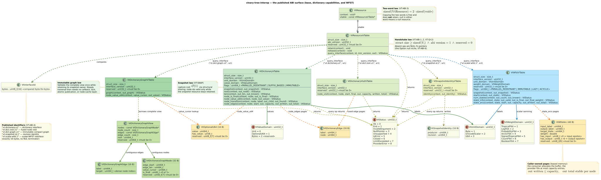
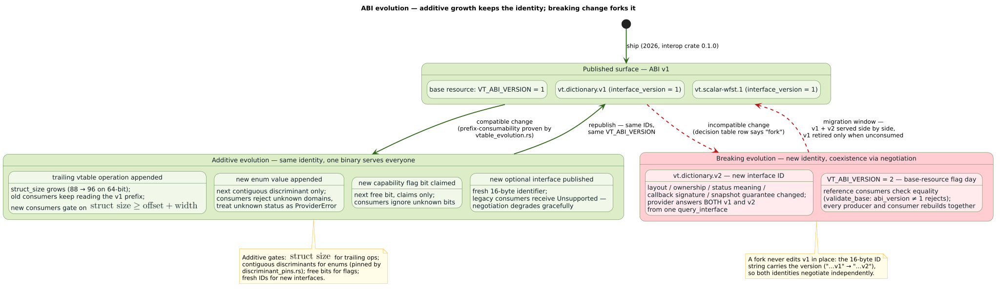
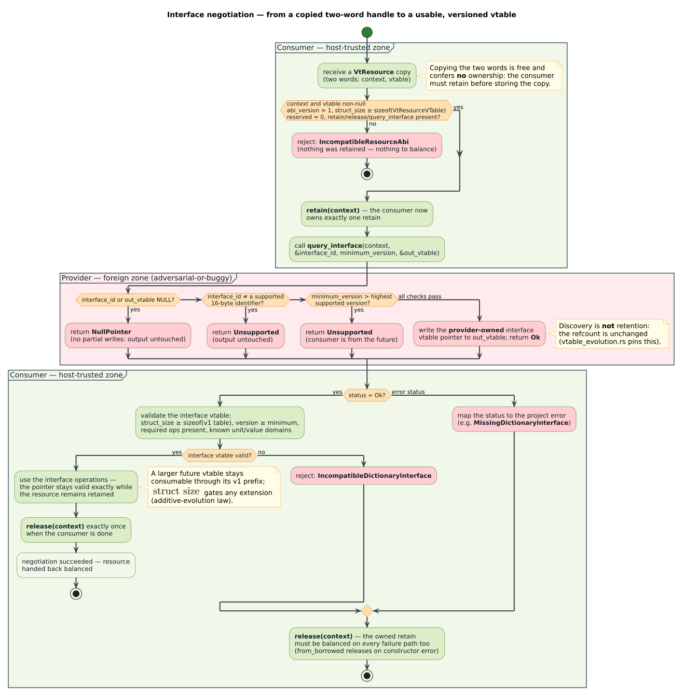
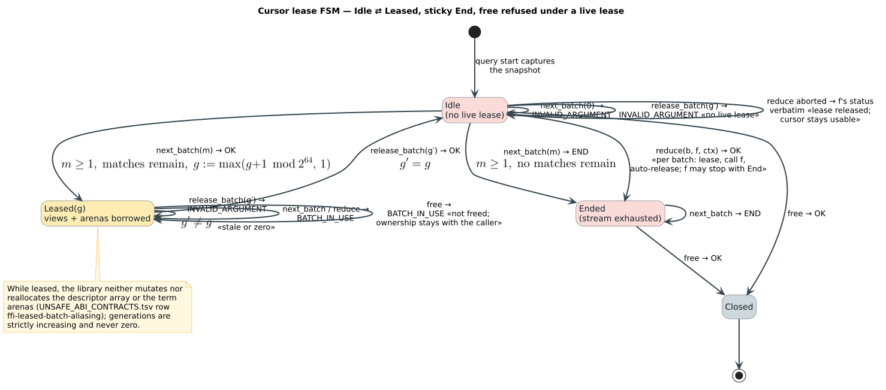
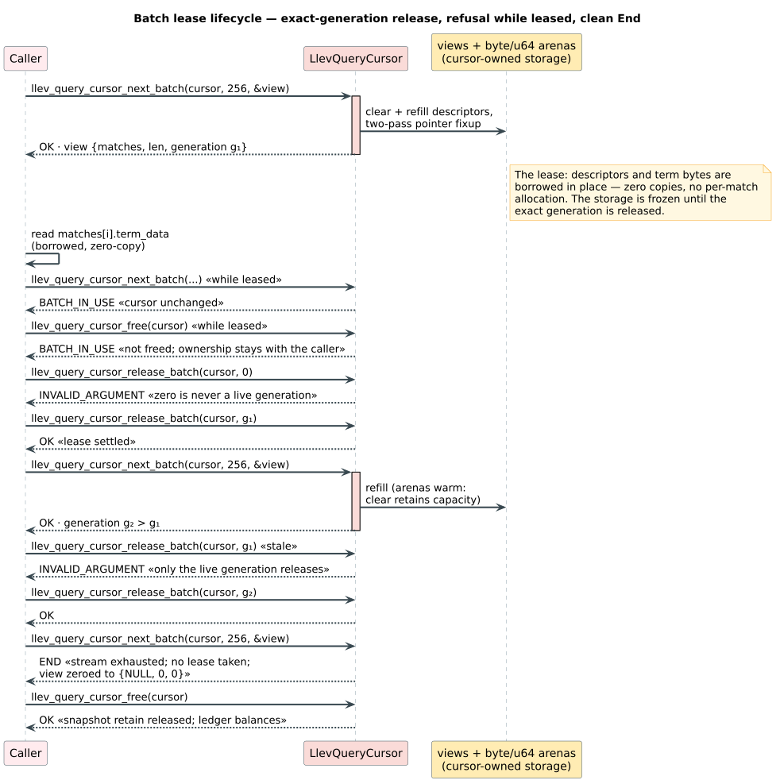

# The `llev_*` C ABI, function by function

This is the normative reference for liblevenshtein's project-owned C surface:
all **62 exported `llev_*` functions**, each with its exact header signature,
preconditions, the complete set of statuses it can return (read from the
implementation, not aspirationally), ownership rules, thread-safety truth, and
cost. It is the **project layer above the family canon**: everything about the
two-word `VtResource`, the base retain/release/`query_interface` protocol, and
the `vt.dictionary.v1` interface this ABI consumes is specified once in the
[interop ABI reference](https://github.com/vinary-tree/vinary-tree-interop/blob/master/docs/abi-reference.md) and
cited here rather than restated.

Companions: [binding corpus hub](README.md) ·
[resource-consumer internals](resource-consumer.md) (the safe-Rust layer under
this surface) · [snapshot-semantics theory](../theory/snapshot-semantics.md) ·
[binding trust model](../security/binding-trust-model.md) ·
[WASM topology](wasm-topology.md).

---

## 1. Terms

Interop-level terms (resource, vtable, retain/release, snapshot, paging) are
defined in the [canon's terms table](https://github.com/vinary-tree/vinary-tree-interop/blob/master/docs/abi-reference.md#1-terms).
The project-level terms this document adds:

| Term | Definition |
|---|---|
| transducer | An opaque `LlevTransducer`: a Levenshtein-automaton configuration (algorithm choice) holding one owned retain of a dictionary resource. Constructing it never copies the dictionary. |
| query cache | An opaque `LlevQueryCache`: an exclusive, synchronization-free, hard-bounded complete-result memo retaining one transducer. TinyLFU estimates reuse for admission; SIEVE selects victims. |
| cursor | An opaque `LlevQueryCursor`: one lazy query. It owns the retained immutable snapshot captured at query start plus all storage later exposed through batch leases. |
| batch | One bounded group of match descriptors transferred per boundary crossing (default capacity `LLEV_DEFAULT_MATCH_BATCH` = 256). |
| lease | The borrow state of a batch: from a successful `next_batch` until the matching `release_batch`, the descriptor array and term arenas belong to the caller and the cursor refuses to advance, reduce, or close. |
| generation | The `uint64_t` tag identifying the live lease. Strictly increasing per cursor, never zero, and required *exactly* at release — a stale generation cannot release a newer lease. |
| arena | Cursor-owned contiguous storage (`byte` and `u64` arenas) holding every term of the current batch back-to-back; descriptors point into it. Cleared-but-retained between batches, so steady-state batches allocate nothing. |
| reducer | A caller-supplied `LlevBatchReducer` callback invoked once per batch with borrowed descriptors — the allocation-minimizing expert path for managed languages. |
| unit domain | Which value space the dictionary's labels inhabit: bytes, Unicode scalars, or opaque `u64` tokens (`VtUnitDomain`, canon [§ 6.1](https://github.com/vinary-tree/vinary-tree-interop/blob/master/docs/abi-reference.md#61-vtunitdomain-and-vtvaluedomain)). |

Throughout, $`n`$ is the number of matches a query yields, $`B`$ the batch
capacity, $`q`$ the query, $`k`$ the maximum edit distance, and
$`\deg(v)`$ a dictionary node's out-degree.

---

## 2. Where this surface sits


The shared resource plane is a small capability graph: a two-word
`VtResource` discovers versioned dictionary, graph, snapshot-identity, and
WFST vtables; borrowed edges and arcs remain provider-owned for the duration
specified by their interface.



The 62 functions divide into six groups:

| Group | Count | Functions |
|---|---|---|
| [Introspection](#4-introspection-4) | 4 | `llev_abi_version` · `llev_api_revision` · `llev_build_features` · `llev_last_error_message` |
| [Strings (legacy)](#5-string-helpers-3-legacy) | 3 | `llev_string_free` · `llev_string_array_free` · `llev_string_dup` |
| [Distances](#6-distance-functions-24) | 24 | Four families × Unicode-scalar, byte, and u64-token domains × exact and thresholded calls |
| [Transducer + cursor](#7-transducer-and-cursor-11) | 11 | `llev_transducer_new` · `llev_transducer_snapshot` · `llev_transducer_free` · `llev_transducer_unit_domain` · `llev_transducer_query_utf8` · `llev_transducer_query_bytes` · `llev_transducer_query_u64` · `llev_query_cursor_next_batch` · `llev_query_cursor_release_batch` · `llev_query_cursor_reduce` · `llev_query_cursor_free` |
| [Bounded query cache](#7a-bounded-query-cache-8) | 8 | `llev_query_cache_new` · `llev_query_cache_clear` · `llev_query_cache_reset_stats` · `llev_query_cache_stats` · `llev_query_cache_free` · `llev_query_cache_query_utf8` · `llev_query_cache_query_bytes` · `llev_query_cache_query_u64` |
| [Phonetic](#8-phonetic-surface-12) | 12 | `llev_owned_string_free` · `llev_phonetic_pattern_compile_regex` · `llev_phonetic_pattern_compile_llre` · `llev_phonetic_pattern_free` · `llev_phonetic_pattern_size` · `llev_phonetic_pattern_matches` · `llev_transducer_query_pattern` · `llev_phonetic_rules_parse` · `llev_phonetic_rules_builtin` · `llev_phonetic_rules_free` · `llev_phonetic_rules_len` · `llev_phonetic_rules_apply` |

Headers: [`include/liblevenshtein.h`](../../include/liblevenshtein.h)
(prototypes, quoted verbatim below) over
[`include/liblevenshtein_abi.h`](../../include/liblevenshtein_abi.h)
(generated constants, enums, and POD types — regenerate via
`scripts/generate-bindings.py`, never edit numeric values by hand) over the
interop header. C++ consumers get the RAII wrapper
[`include/liblevenshtein.hpp`](../../include/liblevenshtein.hpp) (C++20:
`transducer` / `query_cursor` / `batch` types whose destructors settle leases
and handles automatically).

**Retired surface.** The pre-resource-ABI dictionary API — `LlevIndex`,
`llev_index_new`, `llev_index_insert`, `llev_index_query`,
`llev_index_free`, and every other `llev_index_*` symbol — is **removed**,
not deprecated. Dictionary construction and CRUD belong to libdictenstein
(`bindings/api.json` lists the dictionary types under
`forbiddenOwnedObjects`, and `scripts/check-bindings.py` rejects facades that
mention `llev_index_`). A module-level doc example still demonstrating the
retired API is ledgered as finding LLEV-B1 in the
[findings ledger](FINDINGS_LEDGER.md) and is being rewritten in this wave
(W3) to the `llev_transducer_new` flow shown in [§ 9](#9-a-complete-c-consumer).

Additive ABI evolution extends a size-delimited vtable under the same interface
identity. A breaking semantic or layout change receives a new identity so old
and new providers can coexist and be negotiated explicitly.



---

## 3. The status currency

Every fallible function returns `LlevStatus`, the project-level superset of
the interop `VtStatus`. All 13 values, pinned in
[`bindings/api.json`](../../bindings/api.json) and generated into
`liblevenshtein_abi.h` and `src/ffi/generated.rs`:

| Value | Name | Meaning | Returned when |
|---|---|---|---|
| 0 | `LLEV_STATUS_OK` | Success; every advertised output was written. | Any fallible function. |
| 1 | `LLEV_STATUS_END` | A stream finished. **A success value**, not an error: `boundary()` clears the error slot for it exactly as for `Ok`. | `llev_query_cursor_next_batch` on exhaustion; a reducer callback returns it to stop early. |
| 2 | `LLEV_STATUS_INVALID_ARGUMENT` | An argument was outside its domain. | Unknown algorithm/order/kind values; a zero `max_matches`; a release with a stale, zero, or absent lease generation; pattern/rule-set parse failures. |
| 3 | `LLEV_STATUS_INVALID_UTF8` | A length-bearing text buffer was not valid UTF-8. | `utf8()` validation in every text-accepting entry point. |
| 4 | `LLEV_STATUS_NULL_POINTER` | A required pointer was NULL. | Argument preflight in every entry point; also mapped from a provider's `VtStatus` `NullPointer`. |
| 5 | `LLEV_STATUS_PANIC` | A Rust panic was caught at the boundary. The panic message is in the thread-local error slot. | Only from `boundary()`'s `catch_unwind` arm — no other code path constructs it. |
| 6 | `LLEV_STATUS_UNSUPPORTED` | The operation is not available in this build or from this provider. | Phonetic entry points without the `bindings-phonetic` feature; ordered streaming on byte/u64 domains; a `Bytes` value-domain provider; cached queries when snapshot identity is absent; mapped from provider `Unsupported`. |
| 7 | `LLEV_STATUS_IO_ERROR` | A storage-backed provider failed on I/O. | Mapped verbatim from provider `IoError`. |
| 8 | `LLEV_STATUS_CLOSED` | The provider reports its resource already torn down. | Mapped verbatim from provider `Closed`. |
| 9 | `LLEV_STATUS_LIMIT_EXCEEDED` | A provider resource limit was hit. | Mapped verbatim from provider `LimitExceeded`. |
| 10 | `LLEV_STATUS_PROVIDER_ERROR` | The dictionary provider misbehaved: an error status with no better mapping, malformed output despite `Ok`, a missing/incompatible interface, or an illegal `End` from an interface callback. | The consumer's whole-class response to invalid provider output (see the [trust model](../security/binding-trust-model.md)). |
| 11 | `LLEV_STATUS_BATCH_IN_USE` | A live lease blocks the requested state change. The refused object is **unchanged and still owned by the caller**. | `next_batch`/`reduce`/`free` on a leased cursor. |
| 12 | `LLEV_STATUS_DOMAIN_MISMATCH` | The query entry point does not match the dictionary's unit domain. | `query_utf8` on a byte/u64 dictionary, `query_bytes` on a Unicode one, and so on. |

### 3.1 Mapping from the interop `VtStatus`

Provider callbacks answer with the nine-value interop `VtStatus`
([canon § 3](https://github.com/vinary-tree/vinary-tree-interop/blob/master/docs/abi-reference.md#3-vtstatus--the-one-error-currency))
— but **on the Rust side the wire type is a raw `u32`**, not the enum. The
family's status wire rule (landed with LLEV-B6's fix, commit `e42485c`):
producers encode with `VtStatus::to_raw`, consumers decode with
`VtStatus::from_raw` at a single chokepoint (`status()` in
`src/bindings.rs`) **before any enum-typed use**, and an out-of-range value
decodes to `None` — treated as provider *misbehavior*
(`InvalidProviderOutput`, surfacing as `PROVIDER_ERROR`), never as undefined
behavior. The C header is unchanged by this rule: C enums are
integer-typed, so the ABI is byte-identical. Once decoded,
`map_binding_error` in `src/ffi/index.rs` lifts a recorded provider failure
into `LlevStatus`:

| Provider `VtStatus` | Resulting `LlevStatus` | Note |
|---|---|---|
| `InvalidArgument` (2) | `INVALID_ARGUMENT` (2) | preserved |
| `NullPointer` (3) | `NULL_POINTER` (4) | preserved in meaning; **renumbered** — never forward raw discriminants |
| `Unsupported` (4) | `UNSUPPORTED` (6) | preserved |
| `IoError` (5) | `IO_ERROR` (7) | preserved |
| `Closed` (6) | `CLOSED` (8) | preserved |
| `LimitExceeded` (7) | `LIMIT_EXCEEDED` (9) | preserved |
| `Ok` (0) | — | never an error; `Ok` cannot reach the mapper |
| `End` (1), `ProviderError` (8) | `PROVIDER_ERROR` (10) | `End` is **illegal from interface callbacks** (family contract pin F5) |
| any raw value outside 0..=8 | `PROVIDER_ERROR` (10) | refused at decode (`from_raw` → `None` → `InvalidProviderOutput`): unknown and future statuses degrade, they are never trusted — and never materialized as a Rust enum |

Structural failures detected by the consumer itself — null resource words map
to `NULL_POINTER`; an incompatible base ABI, a missing or incomplete
dictionary interface, and malformed provider output all map to
`PROVIDER_ERROR`; a unit-domain mismatch maps to `DOMAIN_MISMATCH`; the
reserved `Bytes` value domain maps to `UNSUPPORTED`.

The mapping's laws — totality over all inputs, `Ok`/`End` handling,
no-swallowing (an error never maps to a success), and
`Panic`-only-from-`catch_unwind` — receive their formal home in this wave
(W3) as the dual-solver SMT artifact
`docs/verification/smt/llev_status_mapping.smt2` (FV obligation #6, invariant
IDs LLEV-STAT-1 through LLEV-STAT-6, registered in
[`docs/verification/ABI_INVARIANTS.tsv`](../../docs/verification/ABI_INVARIANTS.tsv)
as its rows land). Until the rows appear there, the
[findings ledger](FINDINGS_LEDGER.md) tracks the obligation.

### 3.2 The error-message contract

`llev_last_error_message` returns a **thread-local, library-owned,
NUL-terminated** UTF-8 message:

- populated by every failing call on the same thread (including the caught
  panic's message);
- cleared (set to the empty string) by every call that returns `OK` or `END`;
- NUL bytes inside a message are sanitized to `\0` escapes;
- valid until the next `llev_*` call on the same thread; **never freed by the
  caller**.

Every fallible entry point runs inside `boundary()`
(`src/ffi/index.rs:124-148`): `catch_unwind` wraps the operation, success
clears the slot, failure stores the message, and a caught panic is downcast
to its message and surfaced as `PANIC`. No unwinding ever crosses this ABI —
the family containment law
([security model § 3](https://github.com/vinary-tree/vinary-tree-interop/blob/master/docs/security-model.md#3-the-panic-and-exception-containment-law)).

---

## 4. Introspection (4)

```c
uint32_t llev_abi_version(void);
uint32_t llev_api_revision(void);
uint64_t llev_build_features(void);
const char* llev_last_error_message(void);
```

| Function | Returns | Contract |
|---|---|---|
| `llev_abi_version` | `LLEV_ABI_VERSION` = 1 | The project ABI generation. A facade built for generation $`g`$ must refuse a library reporting a different generation. |
| `llev_api_revision` | `LLEV_API_REVISION` = 2 | The additive revision within the ABI generation ([evolution policy § 1](https://github.com/vinary-tree/vinary-tree-interop/blob/master/docs/abi-evolution.md#1-the-four-version-counters)). A facade needing revision $`r`$ refuses a library reporting less than $`r`$. |
| `llev_build_features` | bitset | `LLEV_BUILD_FEATURE_CORE` (1) is always set; `LLEV_BUILD_FEATURE_PHONETIC` (2) is set exactly when the library was compiled with `bindings-phonetic`. Probe it instead of trial-calling the phonetic surface. |
| `llev_last_error_message` | borrowed `const char*` | § 3.2. Never NULL; empty string when the last call on this thread succeeded. |

*Preconditions:* none — these are total. *Thread safety:* fully
thread-safe; the message pointer is per-thread state. *Complexity:*
$`\mathcal{O}(1)`$. *Statuses:* none returned (non-`LlevStatus` signatures);
these functions cannot fail.

---

## 5. String helpers (3, legacy)

```c
void llev_string_free(char* value);
void llev_string_array_free(char** values, size_t len);
char* llev_string_dup(const char* value);
```

Retained **only** for their independent allocation ABI (a stable
malloc/free-pair surface some facades use for round-tripping C strings). They
are unrelated to the cursor path — query terms are *borrowed* from leased
batches and must never be passed to `llev_string_free`.

| Function | Ownership | Statuses / failure signal |
|---|---|---|
| `llev_string_free` | Consumes a string previously *returned by this library's allocating helpers*; NULL is a safe no-op. Double-free is undefined behavior. | none (void) |
| `llev_string_array_free` | Consumes an array of `len` such strings plus the array itself; NULL array is a no-op; NULL elements are skipped. | none (void) |
| `llev_string_dup` | Returns a fresh NUL-terminated copy the caller must settle with `llev_string_free`. | returns NULL on NULL input, interior NUL, invalid UTF-8, or allocation failure |

*Thread safety:* thread-safe (pure allocation). *Complexity:*
$`\mathcal{O}(\lvert s \rvert)`$.

---

## 6. Distance functions (24)

```c
size_t llev_distance(const char* source, size_t source_len,
                     const char* target, size_t target_len);
size_t llev_distance_threshold(const char* source, size_t source_len,
                               const char* target, size_t target_len,
                               size_t threshold);
size_t llev_damerau_distance(const char* source, size_t source_len,
                             const char* target, size_t target_len);
size_t llev_damerau_distance_threshold(const char* source, size_t source_len,
                                       const char* target, size_t target_len,
                                       size_t threshold);
size_t llev_true_damerau_distance(const char* source, size_t source_len,
                                  const char* target, size_t target_len);
size_t llev_true_damerau_distance_threshold(const char* source,
                                            size_t source_len,
                                            const char* target,
                                            size_t target_len,
                                            size_t threshold);
size_t llev_merge_and_split_distance(const char* source, size_t source_len,
                                     const char* target, size_t target_len);
size_t llev_merge_and_split_distance_threshold(const char* source,
                                               size_t source_len,
                                               const char* target,
                                               size_t target_len,
                                               size_t threshold);

size_t llev_distance_bytes(const uint8_t* source, size_t source_len,
                           const uint8_t* target, size_t target_len);
size_t llev_distance_bytes_threshold(const uint8_t* source,
                                     size_t source_len,
                                     const uint8_t* target,
                                     size_t target_len,
                                     size_t threshold);
size_t llev_distance_u64(const uint64_t* source, size_t source_len,
                         const uint64_t* target, size_t target_len);
size_t llev_distance_u64_threshold(const uint64_t* source,
                                   size_t source_len,
                                   const uint64_t* target,
                                   size_t target_len,
                                   size_t threshold);

size_t llev_damerau_distance_bytes(const uint8_t* source,
                                   size_t source_len,
                                   const uint8_t* target,
                                   size_t target_len);
size_t llev_damerau_distance_bytes_threshold(const uint8_t* source,
                                             size_t source_len,
                                             const uint8_t* target,
                                             size_t target_len,
                                             size_t threshold);
size_t llev_damerau_distance_u64(const uint64_t* source,
                                 size_t source_len,
                                 const uint64_t* target,
                                 size_t target_len);
size_t llev_damerau_distance_u64_threshold(const uint64_t* source,
                                           size_t source_len,
                                           const uint64_t* target,
                                           size_t target_len,
                                           size_t threshold);

size_t llev_true_damerau_distance_bytes(const uint8_t* source,
                                        size_t source_len,
                                        const uint8_t* target,
                                        size_t target_len);
size_t llev_true_damerau_distance_bytes_threshold(const uint8_t* source,
                                                  size_t source_len,
                                                  const uint8_t* target,
                                                  size_t target_len,
                                                  size_t threshold);
size_t llev_true_damerau_distance_u64(const uint64_t* source,
                                      size_t source_len,
                                      const uint64_t* target,
                                      size_t target_len);
size_t llev_true_damerau_distance_u64_threshold(const uint64_t* source,
                                                size_t source_len,
                                                const uint64_t* target,
                                                size_t target_len,
                                                size_t threshold);

size_t llev_merge_and_split_distance_bytes(const uint8_t* source,
                                           size_t source_len,
                                           const uint8_t* target,
                                           size_t target_len);
size_t llev_merge_and_split_distance_bytes_threshold(const uint8_t* source,
                                                     size_t source_len,
                                                     const uint8_t* target,
                                                     size_t target_len,
                                                     size_t threshold);
size_t llev_merge_and_split_distance_u64(const uint64_t* source,
                                         size_t source_len,
                                         const uint64_t* target,
                                         size_t target_len);
size_t llev_merge_and_split_distance_u64_threshold(const uint64_t* source,
                                                   size_t source_len,
                                                   const uint64_t* target,
                                                   size_t target_len,
                                                   size_t threshold);
```

These are pure functions over two length-bearing buffers. Unsuffixed functions
decode valid UTF-8 and count **Unicode scalar values**, not bytes. `_bytes`
functions accept arbitrary binary data. `_u64` functions compare aligned
`uint64_t` application tokens by value. They do not use `LlevStatus`; failure
is sentinel-coded so the hot path stays a single integer return:

| Sentinel | Meaning |
|---|---|
| `SIZE_MAX` | a NULL pointer with nonzero length, invalid UTF-8 in an unsuffixed call, or a misaligned u64 buffer |
| `SIZE_MAX - 1` | (threshold variants only) the exact distance exceeds `threshold` |

Both sentinels exceed any real distance
($`d \le \max(\lvert s \rvert, \lvert t \rvert) < 2^{64}{-}2`$ scalars), so
`result <= threshold` is always a correct acceptance test.

| Function | Metric | Semantics |
|---|---|---|
| `llev_distance`(`_threshold`) | Levenshtein | insert · delete · substitute |
| `llev_damerau_distance`(`_threshold`) | **OSA** (optimal string alignment, "restricted Damerau") | adds adjacent transposition, but no substring may be edited twice — kept under its legacy name for ABI stability |
| `llev_true_damerau_distance`(`_threshold`) | unrestricted Damerau–Levenshtein | true metric with transposition; e.g. for `CA` → `ABC`: OSA gives 3, true Damerau gives 2 |
| `llev_merge_and_split_distance`(`_threshold`) | merge-and-split Levenshtein | adds symmetric one-to-two split and two-to-one merge operations at unit cost |

Every row also has `_bytes`, `_bytes_threshold`, `_u64`, and
`_u64_threshold` forms. `_threshold` is always the final suffix. API revision 4
added the 18 domain/family combinations absent from revision 3; all original
Unicode symbols remain unchanged. The complete recurrence and binding mapping
are in the [domain-preserving distance design](distance-domains.md).

*Preconditions:* each buffer is valid for its unit count when nonzero; u64
buffers are naturally aligned.
*Thread safety:* fully thread-safe and lock-free (no shared state; these do
not touch the error slot). *Complexity:* worst case
$`\mathcal{O}(\lvert s \rvert \cdot \lvert t \rvert)`$; the unbounded
Unicode Levenshtein path dispatches to Myers' bit-parallel algorithm for short
ASCII inputs ($`\le 64`$ bytes) and SIMD lanes elsewhere; byte Levenshtein also
uses Myers when its shorter operand fits one word. Standard, OSA, and
merge/split threshold variants run a banded dynamic program touching
$`\mathcal{O}\bigl((2k+1) \cdot \min(\lvert s \rvert, \lvert t \rvert)\bigr)`$
cells for threshold $`k`$. Unrestricted Damerau retains its full historical
matrix after its constant-time length lower-bound rejection.

---

## 7. Transducer and cursor (11)

The heart of the ABI. The full object flow, end to end:


### 7.1 `llev_transducer_new`

```c
LlevStatus llev_transducer_new(const VtResource* dictionary,
                               uint32_t algorithm,
                               LlevTransducer** out_transducer);
```

Retains a live dictionary resource and constructs an automaton configuration
around it. The resource is **borrowed at the call and retained inside**: the
function calls the provider's `retain` before any validation and releases it
again on every validation-failure path, so ownership of the caller's own
retain never moves (contract row
`ffi-borrowed-resource-retain-validate-release` in
[`UNSAFE_ABI_CONTRACTS.tsv`](../../docs/verification/UNSAFE_ABI_CONTRACTS.tsv)).
Validation enforces the base handshake (`struct_size`, `abi_version` = 1,
`reserved` = 0, all three base ops present), negotiates `vt.dictionary.v1`
at `minimum_version` = 1, and requires the interface ops the consumer needs
(`snapshot`, `root`, `node_is_final`, `node_edges`; `node_value_u64` exactly
when the value domain is `OPTIONAL_U64`).



- **Preconditions:** `dictionary` and `out_transducer` non-NULL; the resource
  obeys the interop contract for the whole life of the transducer.
- **Statuses:** `OK` · `NULL_POINTER` (either pointer NULL, or provider
  `NullPointer`) · `INVALID_ARGUMENT` (unknown `algorithm` value, or provider
  `InvalidArgument`) · `UNSUPPORTED` (a `Bytes`-value-domain provider, or
  provider `Unsupported`) · `IO_ERROR` / `CLOSED` / `LIMIT_EXCEEDED`
  (provider verbatim) · `PROVIDER_ERROR` (null resource vtable output,
  incompatible base ABI, missing/incomplete dictionary interface, or any
  malformed negotiation output) · `PANIC`.
- **Ownership:** on `OK`, `*out_transducer` is a caller-owned handle settled
  by exactly one `llev_transducer_free`. On failure, `*out_transducer` is
  untouched.
- **Algorithms:** `LLEV_ALGORITHM_STANDARD` (0) · `TRANSPOSITION` (1, OSA
  semantics) · `MERGE_AND_SPLIT` (2) · `DAMERAU_LEVENSHTEIN` (3,
  unrestricted).
- **Thread safety:** safe to call concurrently; the constructed transducer
  may be shared across threads for querying.
- **Complexity:** $`\mathcal{O}(1)`$ — a retain, one `query_interface`, and
  constant-size validation; the dictionary is never copied or walked.

### 7.2 `llev_transducer_snapshot`

```c
LlevStatus llev_transducer_snapshot(const LlevTransducer* transducer,
                                    LlevTransducer** out_transducer);
```

Captures the source revision visible at the call and returns a read-only
transducer pinned to that immutable provider snapshot. Every cursor created
from the returned handle shares the same validated compact graph, when the
provider implements `vt.dict.graph.v1`, or the same fallback immutable
node cache. Later mutations visible through the original transducer are not
visible through this handle. Calling the function on an already immutable
transducer is $`\mathcal{O}(1)`$.

- **Preconditions:** `transducer` and `out_transducer` are non-NULL and
  `transducer` is a live handle.
- **Statuses:** `OK` · `NULL_POINTER` · `INVALID_ARGUMENT` · `UNSUPPORTED` ·
  `IO_ERROR` · `CLOSED` · `LIMIT_EXCEEDED` (provider status mapping) ·
  `PROVIDER_ERROR` (a null or malformed snapshot, changed domains, or invalid
  optional graph) · `PANIC`.
- **Ownership:** on `OK`, `*out_transducer` is a new caller-owned handle
  settled by exactly one `llev_transducer_free`; the input remains owned by
  its caller. On failure, `*out_transducer` is untouched.
- **Thread safety:** safe to call concurrently. The returned handle is
  shareable for concurrent queries; each query still owns an independent
  cursor and fault channel.
- **Complexity:** $`\mathcal{O}(1)`$ for a memoized or already immutable
  provider snapshot. A provider's first compact-graph publication may perform
  its documented snapshot preparation outside this ABI's control; traversal
  never copies that graph per cursor.

### 7.3 `llev_transducer_free`

```c
void llev_transducer_free(LlevTransducer* transducer);
```

Releases the transducer's retain of the source resource (through the
provider's call gate, so a serialized provider never sees the final release
concurrently with a callback). NULL is a no-op. **Existing query cursors
remain valid** — each owns its own snapshot retain. Statuses: none (void);
infallible by construction. Complexity: $`\mathcal{O}(1)`$ plus the
provider's `release`.

### 7.4 `llev_transducer_unit_domain`

```c
LlevStatus llev_transducer_unit_domain(const LlevTransducer* transducer,
                                       VtUnitDomain* out_domain);
```

Reports which of the three query entry points this dictionary accepts.
**Statuses:** `OK` · `NULL_POINTER` · `PANIC`. Thread-safe (pure read).
$`\mathcal{O}(1)`$.

### 7.5 The three query starts

```c
LlevStatus llev_transducer_query_utf8(const LlevTransducer* transducer,
                                      const char* query, size_t query_len,
                                      size_t max_distance, uint32_t order,
                                      LlevQueryCursor** out_cursor);
LlevStatus llev_transducer_query_bytes(const LlevTransducer* transducer,
                                       const uint8_t* query, size_t query_len,
                                       size_t max_distance, uint32_t order,
                                       LlevQueryCursor** out_cursor);
LlevStatus llev_transducer_query_u64(const LlevTransducer* transducer,
                                     const uint64_t* query, size_t query_len,
                                     size_t max_distance, uint32_t order,
                                     LlevQueryCursor** out_cursor);
```

Each captures the provider's revision **now** — one $`\mathcal{O}(1)`$
`snapshot` callback plus one `root` read — and returns a lazy cursor pinned
to that revision forever (the query-start snapshot boundary; laws and proofs
in [snapshot semantics](../theory/snapshot-semantics.md)). Match traversal is
lazy. If the immutable provider advertises `vt.dict.graph.v1`, the first
consumer of that revision may additionally pay
$`\Theta(\lvert V\rvert + \lvert E\rvert)`$ once to validate and import its
compact graph; producer and consumer revision memos amortize that work across
later query starts.

- **Preconditions:** `transducer` and `out_cursor` non-NULL; the query buffer
  valid for its length when nonzero (`query_len` in bytes for UTF-8, elements
  otherwise; a NULL buffer with zero length is a legal empty query);
  `query_u64`'s buffer 8-byte aligned.
- **Domain gate:** the entry point must match the dictionary's unit domain
  (`DOMAIN_MISMATCH` otherwise). `query_utf8` requires `UNICODE_SCALAR`,
  `query_bytes` requires `BYTE`, `query_u64` requires `U64`.
- **Order:** `LLEV_QUERY_ORDER_TRAVERSAL` (0) streams in dictionary order
  with bounded state; `DISTANCE_THEN_TERM` (1) yields increasing distance
  (ties by term), buffering at most one distance layer — supported on the
  Unicode entry point only (`UNSUPPORTED` from bytes/u64).
- **Statuses:** `OK` · `NULL_POINTER` · `INVALID_UTF8` (`query_utf8` only) ·
  `INVALID_ARGUMENT` (unknown `order`, or provider `InvalidArgument`) ·
  `DOMAIN_MISMATCH` · `UNSUPPORTED` (ordered streaming on bytes/u64, or
  provider `Unsupported`) · `IO_ERROR` / `CLOSED` / `LIMIT_EXCEEDED`
  (provider verbatim, from the `snapshot`/`root` callbacks) ·
  `PROVIDER_ERROR` (null snapshot, snapshot that changes domains, or other
  malformed provider output) · `PANIC`.
- **Ownership:** on `OK`, `*out_cursor` is caller-owned, settled by exactly
  one successful `llev_query_cursor_free`. The cursor **may outlive** the
  transducer and the caller's own dictionary handle.
- **Thread safety:** concurrent query starts on one shared transducer are
  safe; callbacks to a non-reentrant provider serialize on its
  [call gate](resource-consumer.md#4-the-call-gate).
- **Complexity:** warm revision:
  $`\mathcal{O}(\lvert q \rvert)`$ to copy the query plus
  $`\mathcal{O}(1)`$ capture. Cold compact-graph revision:
  $`\mathcal{O}(\lvert q \rvert + \lvert V\rvert + \lvert E\rvert)`$ for the
  first validating import only. Providers without the optional graph retain
  the $`\mathcal{O}(\lvert q \rvert)`$ lazy callback path.

### 7A. Bounded query cache (8)

```c
LlevStatus llev_query_cache_new(const LlevTransducer* transducer,
                                size_t max_entries_per_order,
                                size_t max_weight_per_order,
                                LlevQueryCache** out_cache);
LlevStatus llev_query_cache_clear(LlevQueryCache* cache);
LlevStatus llev_query_cache_reset_stats(LlevQueryCache* cache);
LlevStatus llev_query_cache_stats(const LlevQueryCache* cache,
                                  LlevQueryCacheStats* out_stats);
void llev_query_cache_free(LlevQueryCache* cache);

LlevStatus llev_query_cache_query_utf8(LlevQueryCache* cache,
                                       const char* query, size_t query_len,
                                       size_t max_distance, uint32_t order,
                                       LlevQueryCursor** out_cursor);
LlevStatus llev_query_cache_query_bytes(LlevQueryCache* cache,
                                        const uint8_t* query, size_t query_len,
                                        size_t max_distance, uint32_t order,
                                        LlevQueryCursor** out_cursor);
LlevStatus llev_query_cache_query_u64(LlevQueryCache* cache,
                                      const uint64_t* query, size_t query_len,
                                      size_t max_distance, uint32_t order,
                                      LlevQueryCursor** out_cursor);
```

This API is an opt-in complete-result memo for repeated-query workloads. It
uses TinyLFU approximate-frequency admission and SIEVE victim selection under
hard entry and logical-weight bounds. Approximation changes residency only:
every miss drains the exact snapshot-consistent product walk before returning,
even if the candidate is too large or loses admission.

- **Construction:** `new` retains the transducer in $`\mathcal{O}(1)`$ time.
  Each hard limit applies independently to traversal and distance-then-term
  order shards. A zero entry or weight limit disables admission but not exact
  miss computation. On `OK`, `*out_cache` is settled by one `free`; failure
  leaves it untouched. Statuses: `OK` · `NULL_POINTER` · `PANIC`.
- **Query identity:** each query captures an immutable provider snapshot and
  requires `vt.snapshot.id.1`. A producer change clears both shards; a revision
  change clears stale residency before lookup. Missing identity is
  `UNSUPPORTED`, never a best-effort stale cache. The three functions retain
  the domain/order/status contracts of § 7.5 and add that identity failure.
- **Result ownership:** a hit returns a fresh `LlevQueryCursor` over shared
  immutable match storage. A miss returns the same cursor type after exact
  materialization. Every cursor may outlive the cache and follows the ordinary
  lease/reducer protocol.
- **Counters:** `stats` copies requests, hits, misses, admissions, rejections,
  evictions, resident entries, and logical weight across both shards in
  $`\mathcal{O}(1)`$. `clear` drops residency and policy history while
  preserving counters. `reset_stats` zeros counters while preserving residency
  and frequency history. All three return `OK` · `NULL_POINTER` · `PANIC`.
- **Thread safety:** one cache pointer is an exclusive mutable handle. The
  implementation contains no lock. Concurrent callers shard one cache per
  worker from the same shareable transducer; independent returned cursors are
  concurrently usable under their own contracts.
- **Complexity:** a hit is expected $`\mathcal{O}(\lvert q \rvert)`$ for exact
  key hashing/comparison plus an `Arc` clone and cursor creation. A miss adds
  the full query traversal and result materialization. Admission/eviction work
  is bounded by resident metadata and performs no provider callback while a
  lock is held because no cache lock exists.

The full policy rationale, literate transaction algorithm, language idioms,
and measurement guidance are in the
[bounded query-cache guide](query-cache.md).

### 7.6 The lease protocol

The batch path is a strict finite-state machine; every transition below is
exactly what `src/ffi/index.rs` implements:



```c
LlevStatus llev_query_cursor_next_batch(LlevQueryCursor* cursor,
                                        size_t max_matches,
                                        LlevMatchBatchView* out_batch);
LlevStatus llev_query_cursor_release_batch(LlevQueryCursor* cursor,
                                           uint64_t generation);
```

**`llev_query_cursor_next_batch`** advances the query until `max_matches`
descriptors are staged (or the stream ends), rebuilds the descriptor views
over the refilled arenas, and hands out one lease:

- `*out_batch` is always written: zeroed (`{NULL, 0, 0}`) first, then
  overwritten with `{matches, len, generation}` only on `OK`.
- On `OK`, `matches[0..len)` and every `term_data` they address are
  **borrowed** from cursor-owned storage. Per descriptor: `unit_domain`
  states the term encoding; UTF-8 terms have `term_len` scalar count and
  `byte_len` UTF-8 bytes; byte terms have `term_len == byte_len`; u64 terms
  have `term_data` 8-byte aligned and `byte_len == term_len * 8`; `has_id`
  is zero or one and gates `id`.
- The lease generation satisfies
  ```math
  g_{i+1} \;=\; \max\bigl((g_i + 1) \bmod 2^{64},\; 1\bigr) ,
  ```
  i.e. generations are strictly increasing per cursor within the `uint64_t`
  cycle and **never zero** — zero can never name a live lease.
- **Statuses:** `OK` · `END` (stream exhausted; **no lease taken**; the view
  stays zeroed; asking again yields `END` again) · `BATCH_IN_USE` (a live
  lease exists; cursor unchanged) · `INVALID_ARGUMENT` (`max_matches` = 0) ·
  `NULL_POINTER` · provider-fault mappings recorded during traversal
  (`INVALID_ARGUMENT` / `NULL_POINTER` / `UNSUPPORTED` / `IO_ERROR` /
  `CLOSED` / `LIMIT_EXCEEDED` / `PROVIDER_ERROR`) · `PANIC`.
- **Preconditions:** `cursor` and `out_batch` valid; the cursor **must not**
  be used from two threads at once (leases are single-owner state; see
  § 7.10).

**`llev_query_cursor_release_batch`** settles the lease:

- succeeds only for **the exact live generation**; a stale generation, zero,
  or a cursor with no live lease is refused with `INVALID_ARGUMENT` and
  changes nothing. After release the storage returns to the cursor and every
  borrowed pointer from that batch is invalid.
- **Statuses:** `OK` · `INVALID_ARGUMENT` · `NULL_POINTER` · `PANIC`.

The full protocol on the wire, including every refusal:



While a lease is live, the library **neither mutates nor reallocates** the
descriptor array or the arenas (contract row `ffi-leased-batch-aliasing`;
Verus home `docs/verification/verus/ffi_batch_arena.rs`, landing this wave),
and the lease/generation machine's formal home is the wave-W3 TLA⁺ model
`docs/verification/tla/LlevBatchLease.tla` (invariant IDs LLEV-LEASE-1
through LLEV-LEASE-7) with anchor test
[`tests/ffi_resource_snapshot_semantics.rs`](../../tests/ffi_resource_snapshot_semantics.rs).

The literate batch loop every facade implements:

```text
procedure consume(cursor, B):                        ▷ B ≥ 1, default 256
    loop:
        status, view ← llev_query_cursor_next_batch(cursor, B)
        if status = END:        break                ▷ no lease was taken
        if status ≠ OK:         fail with llev_last_error_message()
        for i in 0 .. view.len − 1:                  ▷ borrowed, zero-copy
            process(view.matches[i])                 ▷ copy only what escapes
        status ← llev_query_cursor_release_batch(cursor, view.generation)
        if status ≠ OK:         fail                 ▷ exact generation required
    llev_query_cursor_free(cursor)                   ▷ OK: no lease is live
```

Boundary-crossing count for $`n`$ matches: $`\lceil n / B \rceil`$ lease
pairs plus one terminal `END` probe — never one crossing per match. Each
node expansion inside the traversal costs the provider
$`\lceil \deg(v) / 256 \rceil`$ crossings
([canon § 2](https://github.com/vinary-tree/vinary-tree-interop/blob/master/docs/abi-reference.md#2-prologue-what-kind-of-header-this-is)).

### 7.7 `llev_query_cursor_reduce`

```c
LlevStatus llev_query_cursor_reduce(LlevQueryCursor* cursor,
                                    size_t batch_size,
                                    LlevBatchReducer reducer,
                                    void* context,
                                    size_t* out_count);
```

The expert path: consume the remaining stream with **one callback per
reusable batch**, never creating a per-match host object. The callback
receives borrowed descriptors valid only for the duration of the call; the
internal lease is settled automatically around every invocation.


The literate reducer contract:

```text
procedure reduce(cursor, B, f, ctx):
    count ← 0
    loop:
        status ← fill one internal batch of ≤ B matches
        if status = END:  break                      ▷ stream exhausted
        r ← f(ctx, views, len)                       ▷ borrowed for this call only
        count ← count + len                          ▷ the batch already counted
        release the internal lease                   ▷ before r is inspected
        if r = END:       break                      ▷ EARLY STOP — a success
        if r ≠ OK:        return r verbatim          ▷ ABORT — cursor stays usable
    out_count ← count
    return OK
```

- **Statuses:** `OK` (completion **and** early stop — `END` is never
  returned by `reduce` itself) · `BATCH_IN_USE` (a lease from `next_batch`
  is live) · `NULL_POINTER` (cursor, reducer, or `out_count` NULL) ·
  `INVALID_ARGUMENT` (`batch_size` = 0) · traversal provider-fault mappings
  as in § 7.6 · **any status the reducer returned, verbatim** (the abort
  channel; the message slot then reads "batch reducer aborted the query") ·
  `PANIC`.
- After an abort the cursor is **not poisoned**: the lease was released and
  a later `next_batch`/`reduce` resumes exactly where the stream stopped.
- `*out_count` is written only on `OK` and counts every match delivered to
  the callback, including the final partial batch of an early stop.
- **Callback duties:** the reducer must not free the descriptors, must not
  re-enter the cursor (reducer reentrancy is undocumented behavior), must
  return one of the 13 published `LlevStatus` values (the abort channel
  forwards its return verbatim, so an out-of-range integer is a contract
  violation on this project-level wire), and — being `extern "C"` — must
  not unwind; signal failure through its return status. It executes on the
  calling thread.
- **Complexity:** $`\lceil n / B \rceil`$ callback crossings for the
  remaining $`n`$ matches.

### 7.8 `llev_query_cursor_free`

```c
LlevStatus llev_query_cursor_free(LlevQueryCursor* cursor);
```

Closes the cursor and releases its snapshot retain — unless a lease is live,
in which case it returns `BATCH_IN_USE` and **the cursor remains alive and
owned by the caller** (freeing storage a caller still borrows would be a
use-after-free factory; release the batch first). NULL is a no-op `OK`.

- **Statuses:** `OK` · `BATCH_IN_USE` · `PANIC`.
- **Ownership:** on `OK` the handle is consumed and must not be reused; on
  `BATCH_IN_USE` ownership is unchanged.
- **Complexity:** $`\mathcal{O}(1)`$ plus the provider's `release` (through
  the gate).

### 7.9 Cursor memory model

`LlevQueryCursor` owns: the retained snapshot provider, the safe-Rust batch,
the descriptor `views`, an `offsets` scratch vector, and the two term arenas.
`views`/`offsets` are preallocated to `LLEV_DEFAULT_MATCH_BATCH`; the arenas
start empty and warm up after the first batch (`clear()` retains capacity),
so a steady-state batch performs **zero** allocations once term volume
stabilizes. Descriptor `term_data` pointers are fixed up in a **second pass**
only after all arena writes for the batch completed — the realloc-safety
invariant (`ffi-leased-batch-aliasing`; Verus obligation LLEV-ARENA-1..3,
this wave). Details with the Rust types:
[resource-consumer.md](resource-consumer.md).

### 7.10 Thread-safety summary

| Object | Concurrent use |
|---|---|
| `LlevTransducer` | Shareable: concurrent `query_*`/`unit_domain` calls are safe. Callbacks to a non-reentrant provider serialize on that provider's gate (VT-GATE-1..3). |
| `LlevQueryCursor` | **Exclusive**: one thread at a time. The lease/generation state is deliberately unsynchronized single-owner state; interleave calls from two threads and the refusals in § 7.5 are no longer meaningful. Different cursors are fully independent, even over one dictionary. |
| `LlevPhoneticPattern` / `LlevPhoneticRuleSet` | Immutable after construction: shared concurrent reads (`matches`, `apply`, `size`, `len`) are safe. |
| error messages | Per-thread by construction (§ 3.2). |

---

## 8. Phonetic surface (12)

Compiled only with the `bindings-phonetic` feature. **Every** function below
(the two `void` frees excepted) returns `UNSUPPORTED` with an explanatory
message when the feature is absent — probe `llev_build_features()` for
`LLEV_BUILD_FEATURE_PHONETIC` first.

### 8.1 Owned strings

```c
void llev_owned_string_free(LlevOwnedString* value);
```

`LlevOwnedString` (`{char* data; size_t len;}`) carries heap-owned,
**not NUL-terminated** UTF-8 out of `llev_phonetic_rules_apply`. The free
zeroes the struct after releasing; NULL input and the empty
(`{NULL, 0}`) value are safe no-ops. Statuses: none (void).

### 8.2 Patterns

```c
LlevStatus llev_phonetic_pattern_compile_regex(const char* source, size_t source_len,
                                               LlevPhoneticPattern** out_pattern);
LlevStatus llev_phonetic_pattern_compile_llre(const char* source, size_t source_len,
                                              LlevPhoneticPattern** out_pattern);
void llev_phonetic_pattern_free(LlevPhoneticPattern* pattern);
LlevStatus llev_phonetic_pattern_size(const LlevPhoneticPattern* pattern,
                                      size_t* out_states, size_t* out_transitions);
LlevStatus llev_phonetic_pattern_matches(const LlevPhoneticPattern* pattern,
                                         const char* input, size_t input_len,
                                         uint8_t* out_matches);
```

A pattern is a reusable Unicode NFA compiled from a phonetic regular
expression or an **import-free** `.llre` document, subject to the public
state ceiling (`LANGUAGE_PRODUCT_MAX_STATES`; exceeding it is
`INVALID_ARGUMENT`, message included).

| Function | Statuses | Notes |
|---|---|---|
| `compile_regex` / `compile_llre` | `OK` · `NULL_POINTER` · `INVALID_UTF8` · `INVALID_ARGUMENT` (parse error, state ceiling, imports present) · `UNSUPPORTED` (feature off) · `PANIC` | On `OK`, caller owns the handle; one `llev_phonetic_pattern_free` settles it. |
| `pattern_free` | none (void) | NULL no-op. **Existing cursors retain their own copy of the pattern product** — freeing the pattern never invalidates a running `query_pattern` cursor. |
| `pattern_size` | `OK` · `NULL_POINTER` · `UNSUPPORTED` · `PANIC` | Writes NFA state and transition counts. $`\mathcal{O}(1)`$. |
| `pattern_matches` | `OK` · `NULL_POINTER` · `INVALID_UTF8` · `UNSUPPORTED` · `PANIC` | Complete-string acceptance; writes zero or one. $`\mathcal{O}(\lvert \text{input} \rvert \cdot \lvert \text{NFA} \rvert)`$ worst case. |

### 8.3 `llev_transducer_query_pattern`

```c
LlevStatus llev_transducer_query_pattern(const LlevTransducer* transducer,
                                         const LlevPhoneticPattern* pattern,
                                         uint8_t max_distance,
                                         LlevQueryCursor** out_cursor);
```

Starts a lazy query for dictionary terms within `max_distance` of the
pattern's **language** — the dictionary × language product. Unicode
dictionaries only (`DOMAIN_MISMATCH` otherwise). Captures a snapshot exactly
like the § 7.5 query starts and returns the same cursor type with the same
lease protocol. **Statuses:** `OK` · `NULL_POINTER` · `DOMAIN_MISMATCH` ·
`UNSUPPORTED` (feature off, or provider `Unsupported`) · `INVALID_ARGUMENT`
/ `IO_ERROR` / `CLOSED` / `LIMIT_EXCEEDED` (provider verbatim) ·
`PROVIDER_ERROR` · `PANIC`.

### 8.4 Rule sets

```c
LlevStatus llev_phonetic_rules_parse(const char* source, size_t source_len,
                                     LlevPhoneticRuleSet** out_rules);
LlevStatus llev_phonetic_rules_builtin(uint32_t kind, LlevPhoneticRuleSet** out_rules);
void llev_phonetic_rules_free(LlevPhoneticRuleSet* rules);
LlevStatus llev_phonetic_rules_len(const LlevPhoneticRuleSet* rules, size_t* out_len);
LlevStatus llev_phonetic_rules_apply(const LlevPhoneticRuleSet* rules,
                                     const char* input, size_t input_len,
                                     LlevOwnedString* out_text);
```

A rule set is a reusable `.llev` rewrite system applied to a fixed point
under the native fuel bound.

| Function | Statuses | Notes |
|---|---|---|
| `rules_parse` | `OK` · `NULL_POINTER` · `INVALID_UTF8` · `INVALID_ARGUMENT` (parse error, includes present) · `UNSUPPORTED` · `PANIC` | Import-free documents only. |
| `rules_builtin` | `OK` · `NULL_POINTER` · `INVALID_ARGUMENT` (unknown `kind`) · `UNSUPPORTED` · `PANIC` | `LLEV_PHONETIC_RULE_SET_ENGLISH_ORTHOGRAPHY` (0) · `ENGLISH_PHONETIC` (1). |
| `rules_free` | none (void) | NULL no-op. |
| `rules_len` | `OK` · `NULL_POINTER` · `UNSUPPORTED` · `PANIC` | Enabled-rule count. $`\mathcal{O}(1)`$. |
| `rules_apply` | `OK` · `NULL_POINTER` · `INVALID_UTF8` · `UNSUPPORTED` · `PANIC` | On `OK`, `*out_text` is caller-owned — settle with `llev_owned_string_free`. An empty result is the `{NULL, 0}` value (also safe to free). |

---

## 9. A complete C consumer

The program below is the whole § 7 flow in one file: obtain a resource from
any conforming provider, construct, query through **both** the leased-batch
and reducer paths, handle every error with the thread-local message, and
settle every handle and retain on every exit path. It compile-checks clean —
byte-identical to this listing — under:

```sh
cc -std=c17 -Wall -Wextra -Werror -fsyntax-only \
   -I include -I vinary-tree-interop/include llev_consumer_example.c
```

```c
/*
 * llev_consumer_example.c — the complete liblevenshtein consumer flow.
 *
 * Obtains a dictionary VtResource from any conforming provider (the extern
 * constructor below is satisfied by libdictenstein's ldict_dictionary_resource
 * or by the minimal C provider in the interop ABI reference), constructs a
 * transducer, runs one query through the leased-batch path and one through
 * the reducer path, and settles every handle and retain on every exit path.
 *
 * Compile check: cc -std=c17 -Wall -Wextra -Werror -fsyntax-only \
 *                   -I include -I vinary-tree-interop/include \
 *                   llev_consumer_example.c
 */
#include <inttypes.h>
#include <stdio.h>

#include "liblevenshtein.h"

/* Any conforming provider: the caller receives one owned retain. */
extern VtResource make_dictionary(void);

/* Reducer callback: print each borrowed batch; stop early after 100 matches. */
static LlevStatus print_batch(void* context, const LlevMatch* matches,
                              size_t len) {
    size_t* printed = context;
    for (size_t i = 0; i < len; ++i) {
        const LlevMatch* m = &matches[i];
        printf("%.*s\tdistance=%zu", (int)m->byte_len,
               (const char*)m->term_data, m->distance);
        if (m->has_id == 1) {
            printf("\tid=%" PRIu64, m->id);
        }
        printf("\n");
        if (++*printed >= 100) {
            return LLEV_STATUS_END; /* early stop is a SUCCESS outcome */
        }
    }
    return LLEV_STATUS_OK;
}

int main(void) {
    int exit_code = 1;
    VtResource dictionary = make_dictionary();
    LlevTransducer* transducer = NULL;
    LlevQueryCursor* cursor = NULL;

    /* 1 · Retain the resource and negotiate vt.dictionary.v1. */
    LlevStatus status = llev_transducer_new(&dictionary,
                                            LLEV_ALGORITHM_TRANSPOSITION,
                                            &transducer);
    if (status != LLEV_STATUS_OK) {
        fprintf(stderr, "transducer: %s\n", llev_last_error_message());
        goto release_dictionary;
    }

    /* 2 · Capture the query-start snapshot and lease batches. */
    status = llev_transducer_query_utf8(transducer, "levenshtein", 11, 2,
                                        LLEV_QUERY_ORDER_TRAVERSAL, &cursor);
    if (status != LLEV_STATUS_OK) {
        fprintf(stderr, "query: %s\n", llev_last_error_message());
        goto free_transducer;
    }
    for (;;) {
        LlevMatchBatchView view = {0};
        status = llev_query_cursor_next_batch(cursor,
                                              LLEV_DEFAULT_MATCH_BATCH, &view);
        if (status == LLEV_STATUS_END) {
            break; /* stream exhausted; no lease taken */
        }
        if (status != LLEV_STATUS_OK) {
            fprintf(stderr, "batch: %s\n", llev_last_error_message());
            goto free_cursor;
        }
        for (size_t i = 0; i < view.len; ++i) {
            const LlevMatch* m = &view.matches[i];
            printf("%.*s\tdistance=%zu\n", (int)m->byte_len,
                   (const char*)m->term_data, m->distance);
        }
        /* Settle the lease with its exact generation before advancing. */
        status = llev_query_cursor_release_batch(cursor, view.generation);
        if (status != LLEV_STATUS_OK) {
            fprintf(stderr, "release: %s\n", llev_last_error_message());
            goto free_cursor;
        }
    }
    status = llev_query_cursor_free(cursor);
    cursor = NULL;
    if (status != LLEV_STATUS_OK) {
        fprintf(stderr, "close: %s\n", llev_last_error_message());
        goto free_transducer;
    }

    /* 3 · The same stream through the reducer path (a fresh snapshot). */
    status = llev_transducer_query_utf8(transducer, "levenshtein", 11, 2,
                                        LLEV_QUERY_ORDER_DISTANCE_THEN_TERM,
                                        &cursor);
    if (status != LLEV_STATUS_OK) {
        fprintf(stderr, "query: %s\n", llev_last_error_message());
        goto free_transducer;
    }
    size_t printed = 0;
    size_t reduced = 0;
    status = llev_query_cursor_reduce(cursor, LLEV_DEFAULT_MATCH_BATCH,
                                      print_batch, &printed, &reduced);
    if (status != LLEV_STATUS_OK) {
        fprintf(stderr, "reduce: %s\n", llev_last_error_message());
        goto free_cursor;
    }
    printf("reduced %zu matches\n", reduced);
    exit_code = 0;

    /* 4 · Teardown: cursors first, then the transducer, then the retain the
     *     provider handed us. Each release settles exactly one owned retain. */
free_cursor:
    if (cursor != NULL) {
        (void)llev_query_cursor_free(cursor);
    }
free_transducer:
    llev_transducer_free(transducer);
release_dictionary:
    if (dictionary.vtable != NULL && dictionary.vtable->release != NULL) {
        dictionary.vtable->release(dictionary.context);
    }
    return exit_code;
}
```

---

## 10. References

1. Vladimir I. Levenshtein. 1966. *Binary codes capable of correcting
   deletions, insertions, and reversals.* Soviet Physics Doklady 10(8),
   707-710. — The distance the § 6 and § 7 surfaces compute.
2. George E. Collins. 1960. *A method for overlapping and erasure of lists.*
   Communications of the ACM 3(12), 655-657.
   DOI: [10.1145/367487.367501](https://doi.org/10.1145/367487.367501).
   — The reference-counting discipline behind every retain this document
   mentions.
3. James R. Driscoll, Neil Sarnak, Daniel D. Sleator, and Robert E. Tarjan.
   1989. *Making data structures persistent.* Journal of Computer and System
   Sciences 38(1), 86-124.
   DOI: [10.1016/0022-0000(89)90034-2](<https://doi.org/10.1016/0022-0000(89)90034-2>).
   — Why query-start snapshot capture can be $`\mathcal{O}(1)`$
   (see [snapshot semantics](../theory/snapshot-semantics.md)).

<!--
DOI verification (2026-08-08): curl -sI --max-redirs 0 https://doi.org/<doi>
  10.1145/367487.367501        -> 302 (handle API responseCode 1)
  10.1016/0022-0000(89)90034-2 -> 302 (handle API responseCode 1)
Negative control 10.1145/9999999.9999999 -> 404 / responseCode 100.
Levenshtein 1966 is a Soviet Physics Doklady translation with no DOI
(canonical family citation form, plan Workstream C).
-->

---

*Family footer:* the canon under this document —
[interop ABI reference](https://github.com/vinary-tree/vinary-tree-interop/blob/master/docs/abi-reference.md) ·
[evolution policy](https://github.com/vinary-tree/vinary-tree-interop/blob/master/docs/abi-evolution.md) ·
[security model](https://github.com/vinary-tree/vinary-tree-interop/blob/master/docs/security-model.md). Sibling
project references —
[libdictenstein `ldict_*`](https://github.com/vinary-tree/libdictenstein/blob/master/docs/bindings/c-abi-reference.md) ·
[lling-llang `lling_*`](https://github.com/vinary-tree/lling-llang/blob/master/docs/api/c-abi-reference.md) ·
[duallity `duallity_*`](https://github.com/vinary-tree/duallity/blob/master/docs/architecture/06-resource-abi-and-bindings.md).
