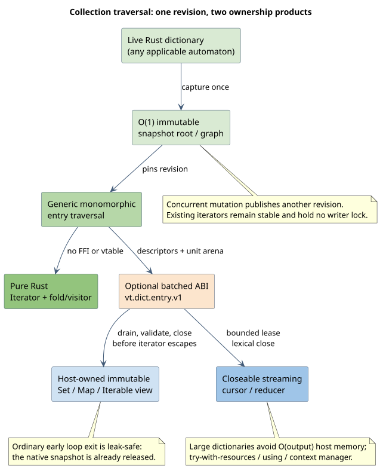

# Collection-protocol parity and native Rust idioms

Status: **implemented collection contract and rollout specification.** The
per-language guides are generated from the shipped public APIs and identify
their executable conformance/benchmark entry points. This document explains
the shared semantics, performance model, and evidence gates behind those
language-native surfaces.

The goal is broader than making a dictionary iterable. A Vinary dictionary may
store byte strings, Unicode scalar sequences, or `u64` sequences; a final key
may have no mapped value, or a present `u64` value; and a mutable producer uses
immutable query-start snapshots. Host collection interfaces must preserve those
semantics without forcing the native implementation through an FFI-shaped API.

## Design decision

The pure Rust API is the semantic and performance baseline. One generic,
snapshot-pinned entry traversal in `libdictenstein` serves every applicable
automaton and storage backend. The family ABI exposes that facility in optional,
batched form. Foreign facades then provide two products:

1. an ordinary host collection view whose iterator owns only host memory and
   therefore cannot leak a native snapshot when a loop exits early; and
2. an explicitly closeable streaming traversal for large dictionaries, with a
   lexical helper such as Java try-with-resources, Kotlin `use`, C# `using`, or
   a Python context manager.

The ordinary view materializes one immutable revision before returning its
iterator. The streaming view retains one immutable snapshot and leases bounded
batches. Both observe the same revision and lexical order. Membership remains a
direct dictionary lookup rather than an iteration scan.

### Native shape, shared laws

Adoption is an acceptance criterion. The shared implementation standardizes
laws, test fixtures, and native batches—not public spelling. Each facade must
use the names, protocols, generics, errors, lifecycle constructs, documentation
style, and package conventions its users already expect. Ordinary callers
should not need to understand handles, vtables, leases, status codes, or the C
ABI. Those remain available only through an explicitly labeled expert layer.

Representative "pit of success" syntax is `for entry in &dictionary` and
iterator combinators in Rust, enhanced `for`/`Set`/`Map` and streams in Java,
`for`/LINQ and `using` in C#, collection ABCs and `with` in Python,
`for...of` and explicit resource management in JavaScript, ranges in C++,
`range`-compatible iterator functions in Go, `Sequence` in Swift, and
`Enumerable#each` in Ruby. Naming and return types should follow the host
ecosystem even when that means the facades are intentionally not isomorphic.



## Shipped surface matrix

The shared implementation is intentionally asymmetric: Rust keeps a
monomorphic traversal and borrowed visitor, while foreign facades consume the
versioned batch ABI and translate into their standard protocols. Ordinary
views own host data; large-dictionary streams own a closeable native snapshot.

| Surface | Shipped idiom | Deterministic lifetime |
|---|---|---|
| Rust producer | `DictionaryEntries` plus `terms`/`keys`/`values`, borrowed folds, exact/fused snapshot iterators, owning `IntoIterator`, lazy zipper set algebra, optimized in-memory `FromIterator`/`Extend`, and explicit persistent `try_*` builders | Iterator/root owns one immutable revision; no lock spans user code |
| Rust consumer | Fused lazy query adapters, reducers, and query-start roots—including multi-piece WallBreaker traversal | Drop cancels bounded state; every piece sees one retained revision |
| C / C++ | Bounded generation-leased cursor and reducer; move-only C++20 input range | Explicit release/free in C; RAII range teardown in C++ |
| Java/Kotlin/Scala | Immutable ordered `Set`/`Map` snapshot, `Iterable`, `Spliterator`, sequential `Stream`, Kotlin collection/use, Scala collection/`Using` | Java try-with-resources; Kotlin `use`; Scala `Using.resource` |
| Clojure | Reducible/sequence adapters over the JVM facade | `with-open` and reducer-owned batches |
| .NET | `IReadOnlyCollection`, `IReadOnlySet`, `IReadOnlyDictionary`, `IEnumerable`, closeable stream/enumerator | `IDisposable` and `using` |
| Python | `collections.abc.Set`/`Mapping` snapshots and context-managed stream | `with`/`close`; host-owned ordinary iterators |
| JavaScript/TypeScript/ClojureScript | `Map`-style operations, `[Symbol.iterator]`, keys/values/entries/forEach, explicit disposable stream on native, browser-WASM, and WASI paths | `using` where supported; otherwise `try/finally` |
| Go | Host snapshots, `iter.Seq`/`Seq2`, and explicit `Next`/`Cancel`/`Close` stream | Range helpers close after EOF, early `break`, or panic; direct callers `defer Close` |
| Swift | Host-owned `RandomAccessCollection` snapshot and throwing closeable stream | Explicit `close`/`cancel`, lexical `defer`, `deinit` fallback |
| Ruby | `Enumerable#each`, no-block `Enumerator`, entries/keys/values, closeable stream | `ensure` closes after EOF, `break`, or exception |
| Fortran | Counted copied batches and callback/fold procedures | Explicit derived-handle close/final fallback |
| OCaml | Typed entries, `Seq`, protected fold, finalizable custom cursor | `Fun.protect`/scoped sequence; finalizer fallback |
| Haskell | Bracketed stream/fold and materialized `Foldable` snapshot | `bracket` with asynchronous-exception masking |
| Lua | `pairs`-style iteration/materialization and closeable stream | Lua 5.4 to-be-closed values or explicit `:close()` |

This matrix does not claim that every mutable host interface is semantically
valid. Java `Map.put`, for example, cannot express every persistent backend's
I/O/atomicity contract. Mutable dictionary operations therefore remain explicit
facade methods, while standard collection protocols describe immutable
revision views.

## Native Rust baseline

### Generic capability traits

The narrow traits in `libdictenstein` are implemented through shared zipper,
snapshot-root, and compact-graph machinery:

```rust,ignore
pub trait DictionaryEntries {
    type Unit: CharUnit;
    type Value: DictionaryValue;
    type Entries: Iterator<Item = DictionaryEntry<Self::Unit, Self::Value>>
        + FusedIterator;

    fn entries(&self) -> Self::Entries;
    fn try_fold_entries<A, E>(
        &self,
        initial: A,
        fold: impl FnMut(A, &[Self::Unit], Option<Self::Value>) -> Result<A, E>,
    ) -> Result<A, E>;
}
```

`DictionaryTerms`, `DictionaryKeys`, and `DictionaryValues` derive aligned
views from this lossless entry capability. `DictionaryLanguageTerms` and
`DictionaryLanguageEntries` separately expose the recognized graph language,
which is deliberately not conflated with source records in suffix families.
No monomorphic Rust caller is forced through boxing, dynamic dispatch, or the
foreign ABI.

Define one lossless entry type. Its mapped state must distinguish:

- key absent;
- key present without a value; and
- key present with a value.

That distinction already exists in the family ABI and must not collapse into a
single `Option<V>` lookup result when collection adapters need to differentiate
membership from mapped value. Use an enum such as `EntryValue<V> { Unit,
Value(V) }` within an emitted entry; absence is represented by no entry.

### Idiomatic construction and mutation

Provide the following wherever the backend semantics permit:

- `IntoIterator for &DictionaryType` over one immutable revision;
- `IntoIterator for SnapshotType`, allowing an iterator to own its snapshot;
- `FromIterator<K>` and `FromIterator<(K, V)>` for infallible in-memory
  constructors;
- `Extend<K>` and `Extend<(K, V)>` for infallible mutable in-memory backends;
- named `try_from_iter`, `try_extend`, and sorted variants for persistent or
  otherwise fallible backends, because `FromIterator` cannot report I/O or
  durability failure;
- `FromIterator` implementations that route through the optimized bulk builder,
  not a naïve per-key public insertion loop;
- `iter`, `keys`, `entries`, and `values` names with the same semantics across
  byte, scalar, and `u64` domains.

Do not implement `Index`: concurrent mutation and value cloning mean a stable
borrowed `&V` generally cannot be returned soundly. Do not implement `Deref` to
a standard collection or define `Ord`/`Hash` for mutable dictionaries merely to
look collection-like. Prefer explicit `get`, `contains`, and entry capabilities.

### Iterator laws and optimization

All generic iterators must be iterative and stack-safe, preserve deterministic
lexicographic unit order, capture exactly one immutable revision, and avoid a
lock whose lifetime spans user code. The fast path should:

- retain a compact snapshot graph/root once;
- keep a reusable traversal stack and path arena;
- reconstruct or copy a key only for a final node;
- borrow edge batches or native slices where lifetimes permit;
- reuse buffers for visitor/fold APIs;
- provide `FusedIterator` after exhaustion;
- provide a truthful lower and upper `size_hint`; use `ExactSizeIterator` only
  when the captured revision supplies O(1) cardinality and each remaining entry
  is counted without hidden filtering;
- avoid `DoubleEndedIterator` unless reverse traversal is native and does not
  materialize the dictionary;
- make `collect` reserve from a known snapshot cardinality; and
- keep the monomorphic Rust path free of ABI calls, callbacks, atomics per edge,
  and virtual dispatch.

Offer an allocation-reusing visitor/fold in addition to owned-key iteration.
Owned `Vec<Unit>`/`String` items remain the ergonomic default because an
`Iterator` cannot safely yield a reference into a buffer it mutates on the next
call. A lending iterator may be evaluated behind a separate API, but must not
require an unstable Rust feature or infect the ordinary collection surface.

### Query-result idioms

For `liblevenshtein`, audit every query iterator and adapter for:

- `FusedIterator` where exhaustion is terminal;
- exact or conservative `size_hint` implementations;
- `IntoIterator` on query/result owner types where it adds no extra allocation;
- explicit traversal-order documentation;
- `collect::<Vec<_>>()`, reducer, and callback paths that share one engine;
- cancellation-by-drop with no lock held and bounded destructor work; and
- preservation of query-start snapshot semantics for borrowed and owning forms.

Do not add `ExactSizeIterator` to a lazy fuzzy query: accepted cardinality is
unknown without doing the search. Optimize the reducer/visitor path for callers
that do not need owned result materialization.

## Shared native traversal and ABI

### One implementation, optional acceleration

First build a backend-generic `SnapshotEntryTraversal` over the same native
snapshot cursor/compact graph used by optimized query traversal. Backend
specialization is allowed only behind capability hooks and benchmarks: for
example, a persistent ARTrie can traverse its immutable overlay directly while
a provider that exposes only the graph interface uses the shared compact-graph
walker. All applicable automata must pass the same laws.

Then add an optional, versioned family interface (working name
`vt.dict.entry.v1`) that drains entries in batches. A batch contains
fixed-size descriptors plus contiguous unit and optional-value arenas. Every
descriptor carries offsets and lengths; the cursor owns its snapshot; one batch
is leased at a time; release is mandatory before the next batch; cancellation
and limits are explicit. Existing `node_edges` traversal remains the compatible
fallback.

The interface must include:

- unit and value domain descriptors;
- deterministic order declaration;
- snapshot identity/revision when supported;
- optional exact cardinality;
- caller-selected maximum batch/arena bounds;
- `next_batch`, `release_batch`, `reduce`, cancel, and close operations;
- the existing bounded status/error model; and
- feature negotiation so older producers and consumers continue to interoperate.

No facade should perform one FFI call per edge or key. Native facades drain
batches; managed expert paths reduce a borrowed batch before release; ordinary
views materialize with geometric growth or exact reservation and then close the
cursor.

## Host-language surfaces

### Java, Kotlin, Scala, and Clojure

The concrete producer dictionary is repeatably `Iterable<DictionaryEntry>`;
explicit snapshot views avoid making its native lifetime inherit one ambiguous
`Set` or `Map` ownership policy:

```java
try (Dictionary dictionary = openDictionary()) {
    DictionarySnapshot stable = dictionary.snapshot();
    consume(stable.keys(), stable.asMap());

    try (EntryStream entries = dictionary.openEntryStream()) {
        entries.forEachRemaining(entry -> consume(entry.key(), entry.value()));
    }
}
```

- Java: one immutable ordered `Collection<DictionaryEntry>` with typed
  `Set<DictionaryKey>` and `Map<DictionaryKey, OptionalLong>` views; closeable
  `Iterator`/`Spliterator` and sequential `Stream` for bounded streaming. The
  snapshot views share one sorted entry array and use binary search rather than
  copying output-sized hash tables. `trySplit` remains disabled until a
  snapshot can partition at root subtrees without duplicate traversal.
- Kotlin: the same Java collections work with collection operators and
  `asSequence()`; closeable traversal uses `use` without a second native layer.
- Scala: standard collection converters and `Using.resource` consume the same
  Java views and cursor.
- Clojure: reducible/foldable view; `reduce` uses the native batch reducer so it
  does not first create a Java collection.

The legacy Java `Dawg` extending `AbstractSet<String>` establishes desired set
ergonomics, not a requirement to couple native lifetime to Java iterator
lifetime. `AutoCloseable` remains mandatory; `Cleaner` remains a last-resort
safety net, never the normal lifecycle.

### .NET

Expose immutable `IReadOnlySet<DictionaryKey>` and
`IReadOnlyDictionary<DictionaryKey, ulong?>` snapshot views, plus
`IEnumerable<DictionaryEntry>` on a materialized view. The views share one
sorted entry array and use binary search, while set-relation operations accept
ordinary LINQ/enumerable inputs. Use `IDisposable`/`using` for a closeable batch
enumerator. Add
`IAsyncEnumerable` only if traversal actually becomes asynchronous; wrapping a
synchronous native call in a task would add overhead without improving
concurrency.

### Python

Expose read-only `collections.abc.Set` and `Mapping` views with `__len__`,
`__contains__`, `__iter__`, `keys`, `items`, `values`, and `get`. Iteration over
the ordinary view is host-owned. A separate context-managed streaming iterator
supports large dictionaries. Release the GIL around native batch traversal and
reacquire it only while constructing Python objects or invoking Python code.

### JavaScript, TypeScript, and ClojureScript

Match the synchronous `Map` vocabulary: `size`, `set`, `get`, `has`, `delete`,
`entries`, `keys`, `values`, `forEach`, and `[Symbol.iterator]`. Each ordinary
iterator is created from one host-owned `snapshotEntries()` result, so an early
`for...of` exit cannot retain native state. `streamEntries()` is the explicit
bounded `IterableIterator` and implements `return`, `close`, batch reduction,
and `Symbol.dispose` on native Node, browser-WASM, and WASI. Do not expose
`[Symbol.asyncIterator]` unless a worker path becomes genuinely asynchronous.
TypeScript distinguishes keys, entries, absent lookup (`undefined`), and a
present unvalued mapping (`null`).

### C++, Go, Swift, Ruby, and the remaining facades

- C++: borrowed/snapshot ranges with an input iterator; a sized range only when
  exact snapshot cardinality is available; RAII cursor ownership.
- Go: callback/range iterator sequences and explicit cancellation. Keep slice
  lifetime rules obvious; copy by default, borrowed batch only in an expert
  callback.
- Swift: `Sequence` for host-owned snapshots and a closeable streaming
  iterator; use `withExtendedLifetime` around native batch borrows.
- Ruby: `Enumerable` with `each` returning an enumerator when no block is
  supplied; ensure `break` closes a streaming cursor.
- OCaml and Haskell: lazy sequence/list-fold adapters whose resource-scoped
  variants cannot escape their bracket/region.
- Lua: `pairs`-style closure backed by a materialized view, plus an explicit
  closeable streaming iterator.
- Fortran: counted batch and callback/fold procedures rather than pretending a
  dynamic dictionary is a native array.

## Snapshot, mutation, and error semantics

Every iterator sees exactly the revision captured at iterator/view creation.
Concurrent inserts, removes, value updates, clear, compaction, checkpoint, or
reopen cannot alter its remaining entries. A mutable collection adapter applies
changes to the live dictionary, while an already-created iterator remains
stable.

Host protocols must translate errors without weakening them:

- infallible lookup protocols may wrap only operations whose backend contract
  is infallible;
- persistent mutation adapters use the host's documented exception/result
  channel;
- partial bulk mutation reports its atomicity explicitly;
- invalid UTF-8 is never silently discarded from a byte-domain collection;
- length conversion checks the host integer range; and
- a close operation is idempotent, while use-after-close is deterministic.

## Performance and correctness gates

Collection support is complete only after all of these gates pass:

1. **Generic Rust laws:** every applicable in-memory and persistent automaton,
   byte/scalar/`u64` domain, unit/mapped value domain, empty key, shared suffix,
   and term-only entry matches a `BTreeMap`/`BTreeSet` reference model.
2. **Snapshot laws:** mutation and compaction stress tests prove revision
   stability, cursor independence, early-drop reclamation, and no lock held
   across consumer code.
3. **Language conformance:** common fixtures test membership, length, order,
   iteration, tri-state values, early loop exit, disposal, exception mapping,
   and concurrent mutation in each facade.
4. **Ecosystem acceptance:** API review checks the relevant language's standard
   collection contracts, naming conventions, package tooling, documentation
   examples, resource-management idioms, and static-analysis expectations. A
   facade that merely transliterates the C ABI does not pass.
5. **Complexity:** snapshot capture remains O(1); traversal is O(nodes + output
   units); auxiliary memory is O(depth + leased batch) for streaming and
   O(output) only for an explicitly materialized view.
6. **Allocation and call budgets:** criterion counters record allocations per
   key/unit and ABI calls per batch; no edge-at-a-time FFI path is accepted.
7. **Performance parity:** compare direct Rust iteration, generic Rust
   traversal, C batches, and every managed facade on the same admitted host.
   Report median, MAD, paired ratios, confidence intervals, throughput, peak
   memory, and early-cancellation cost under the repository's
   [benchmark methodology](../benchmarks/optimization-and-profiling-methodology.md).
8. **Regression thresholds:** each language manifest declares its supported
   protocol and evidence. CI fails on semantic drift; scheduled benchmarks flag
   statistically and practically significant throughput or allocation
   regressions.

Profiles must separate traversal, key materialization, value conversion, FFI
crossings, and host allocation. Use headless AMD uProf, `perf`, and Heaptrack as
described by the benchmark methodology. Optimize only after a causal experiment
identifies a dominant component.

## Implemented work packages and evidence ownership

1. **Rust contract and laws.** `DictionaryEntry`, the narrow collection traits,
   compile-time matrices, reference-model properties, and snapshot/early-drop
   laws cover every applicable automaton and unit domain.
2. **Generic native traversal.** The monomorphic snapshot-pinned walker selects
   compact graph, native cursor, or owned-node fallback once, and reuses
   stack/path storage. Backend specialization remains behind capability hooks.
3. **Rust idioms.** Entries/terms/keys/values/folds, borrowed and owning
   `IntoIterator`, lazy zipper set operations, optimized infallible builders,
   and explicit fallible/sorted persistent builders are shipped and documented.
4. **Batched ABI.** `vt.dict.entry.v1` has generated layout/status
   fixtures, a TLA⁺ lease model, graph fallback, bounded generations,
   cancellation/reducer paths, and compatibility/fault tests.
5. **Adapter foundations.** Every runtime family copies and validates bounded
   batches through one shared cursor contract, reserves exact cardinality when
   present, translates typed errors, and closes on early exit.
6. **JVM and .NET parity.** Java/Kotlin/Scala/Clojure and .NET expose their
   standard immutable collection protocols plus deterministic lexical streams;
   Java try-with-resources and C# `using` are first-class examples and tests.
7. **Remaining facades.** Python, JavaScript/TypeScript/ClojureScript, C/C++, Go,
   Swift, Ruby, Fortran, OCaml, Haskell, and Lua expose the language-native
   protocols listed above without private graph walkers.
8. **Evidence and rollout.** Machine-readable binding manifests, per-language
   conformance programs, allocation census, Criterion exploration,
   topology-admitted paired drivers, headless profiles, and generated guides
   form the release evidence. A guide claims only the protocols exercised by
   its package-level gates.

No binding introduces a private graph walker or weakens snapshot/value
semantics for surface-level idiomaticity. A representation-specific fast path
is retained only when repeatable admitted evidence justifies it and the common
law suite remains green.
