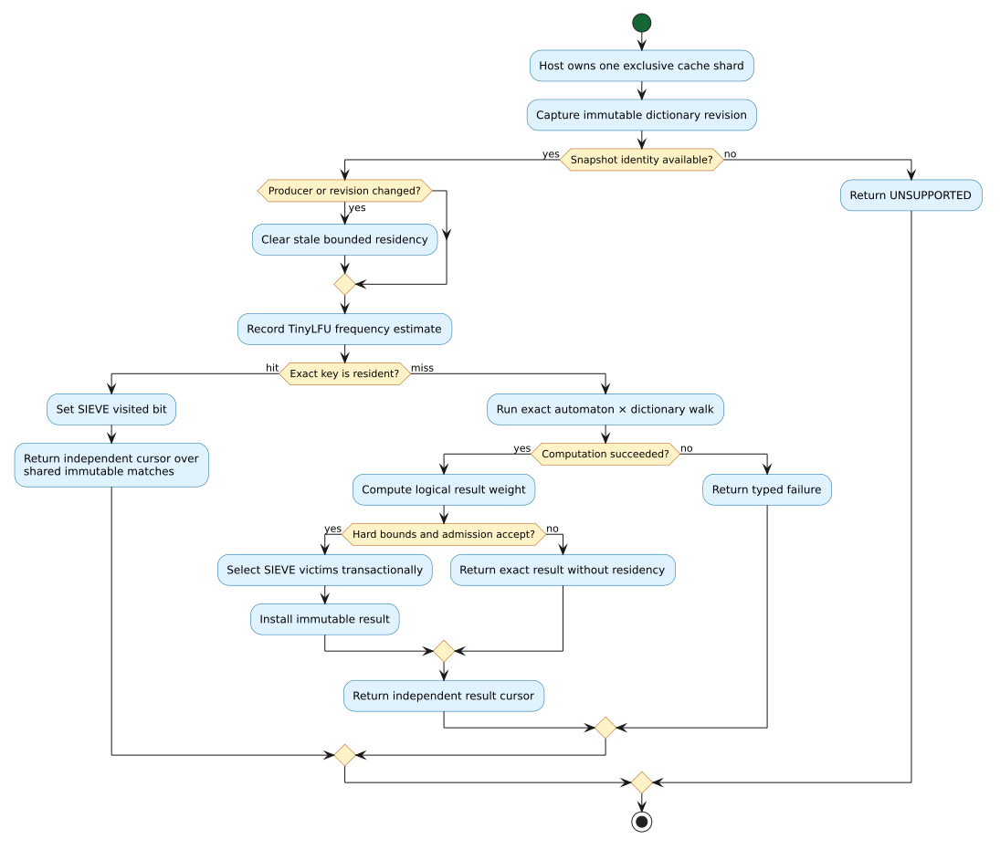

# Bounded cross-language query cache

`ResourceQueryCache` and `LlevQueryCache` are opt-in complete-result caches for
workloads that repeat fuzzy queries against a versioned dictionary. They reuse
the same native policy in Rust, C, Julia, Raku, and every facade built on the C
ABI. Host runtimes do not maintain divergent hash tables or eviction logic.

Use the cache when query repetition is high enough to repay complete result
materialization. Use the ordinary lazy `ResourceTransducer`/`LlevTransducer`
cursor when callers usually stop early, queries rarely repeat, or a complete
result could exceed the configured memory budget.



## Semantics and policy

A cache key contains the exact query units and maximum edit distance. One cache
belongs to one transducer, so its algorithm and unit domain are fixed.
Traversal order and distance-then-term order use independent policy shards
because their result sequences are observably different. Byte and u64-token
queries use binary keys without text conversion; u64 keys reuse one scratch
allocation.

Every request captures an immutable provider snapshot and reads its
`(producer, revision)` identity. A producer change clears both shards. A
revision change clears stale residency before lookup. Providers without the
`vt.snapshot.id.1` capability fail with `UNSUPPORTED`: guessing that mutable
state is unchanged would make a cache hit incorrect.

The policy separates admission from eviction:

1. A fixed-size aging frequency sketch implements the TinyLFU admission model.
   A two-probe doorkeeper filters one-hit noise; four rows of saturating 4-bit
   counters estimate recent frequency. Aging halves the counters periodically.
2. SIEVE chooses victims with a circular hand and one visited bit per resident.
   Hits set a bit rather than relinking an ordered list.
3. Candidate and victim frequency-to-weight ratios are compared by exact
   integer cross-products. Entry count and logical weight remain hard bounds.

TinyLFU was introduced by Einziger, Friedman, and Manes
([DOI 10.1145/3149371](https://doi.org/10.1145/3149371)). The victim-selection
design follows Zhang et al.,
[SIEVE](https://www.usenix.org/conference/nsdi24/presentation/zhang-yazhuo).
Both policies are approximate only about residence. They cannot alter a match,
distance, value, ordering, or error: a rejected or absent entry runs the exact
dictionary/automaton product walk.

## Literate request algorithm

The following pseudocode states the observable transaction. “Compute” means
draining one snapshot-consistent native query into immutable match storage.

```text
REQUEST(query, maximum_distance, order):
    snapshot, identity := CAPTURE(source_transducer)
    REQUIRE identity is available
    shard := SHARD_FOR(order)

    if identity differs from remembered (producer, revision):
        CLEAR(all shards)
        remember identity

    RECORD_APPROXIMATE_FREQUENCY(query, maximum_distance)
    if an exact resident key exists:
        mark it visited
        return a new cursor over its shared immutable result

    result := COMPUTE_EXACTLY(snapshot, query, maximum_distance, order)
    if computation fails:
        return the failure without installing anything

    weight := QUERY_BYTES + MATCH_METADATA + OWNED_TERM_CAPACITIES
    if hard limits and TinyLFU admission accept result:
        evict SIEVE-selected victims transactionally
        install result
    return a new cursor over result
```

The miss path increments request and miss counters before computation. A failed
miss increments neither admissions nor rejections because no candidate exists.
`clear` preserves cumulative counters; `reset_stats` preserves residency and
frequency history. This separation makes operational measurements unambiguous.

## Ownership and concurrency

The cache retains its source transducer. Closing the caller's transducer after
cache construction is therefore safe. Each returned cursor owns an independent
reference to immutable results and remains valid after the cache is cleared or
closed.

The cache is mutable, exclusive, and synchronization-free. No mutex or global
lock runs on a hit. One thread/task/worker owns one cache at a time. Parallel
applications shard caches at their natural workload boundary; this keeps hot
sets local and avoids replacing a fast product walk with shared-lock
contention. Immutable transducers and independent returned cursors remain safe
to use concurrently under their documented contracts.

## Rust API

`VersionedQueryCache<V, W>` remains the general result-generic policy. String
callers use `get_or_compute` or fallible `try_get_or_compute`. Binary, token,
and structured-query callers use `try_get_or_compute_key`, which borrows an
exact byte key on hits and copies it only on admission. Its per-call weight
function can account for nested allocation.

`ResourceQueryCache` binds that policy to a retained foreign dictionary
transducer and exposes `query_utf8`, `query_bytes`, and `query_u64`. It provides
`traversal_stats`, `ordered_stats`, `len`, `resident_weight`, `clear`, and
`reset_stats`. Hard limits apply to each order shard.

```rust
use liblevenshtein::bindings::{QueryOrder, ResourceQueryCache};
use liblevenshtein::transducer::QueryCacheLimits;

let limits = QueryCacheLimits::new(512, 32 * 1024 * 1024);
let mut cache = ResourceQueryCache::new(transducer, limits);
let mut cursor = cache.query_utf8("speling", 2, QueryOrder::Traversal)?;
```

## C ABI

API revision 3 adds the following functions without changing ABI generation 1:

| Operation | Contract |
|---|---|
| `llev_query_cache_new` | Retain a transducer and configure hard per-order limits. |
| `llev_query_cache_query_utf8` | Exact cached Unicode-scalar query. |
| `llev_query_cache_query_bytes` | Exact cached raw-byte query. |
| `llev_query_cache_query_u64` | Exact cached u64-token query. |
| `llev_query_cache_stats` | Copy aggregate counters and residency from both shards. |
| `llev_query_cache_clear` | Drop residency while preserving counters. |
| `llev_query_cache_reset_stats` | Reset counters while preserving residency and policy history. |
| `llev_query_cache_free` | Release the cache; existing cursors remain valid. |

```c
LlevQueryCache* cache = NULL;
LlevStatus status = llev_query_cache_new(
    transducer, 512, 32u * 1024u * 1024u, &cache);
if (status != LLEV_STATUS_OK) {
    /* Copy llev_last_error_message() before another native call. */
    return 1;
}

LlevQueryCursor* cursor = NULL;
status = llev_query_cache_query_utf8(
    cache, "speling", 7, 2, LLEV_QUERY_ORDER_TRAVERSAL, &cursor);
/* Consume and close cursor with the ordinary leased-batch protocol. */
llev_query_cache_free(cache);
```

The cache pointer is an exclusive mutable handle. Concurrent calls on the same
handle violate the API contract. C consumers that need parallelism construct
one cache per worker from the same shareable transducer.

## Julia and Raku idioms

Julia uses deterministic `close`/`finally`, multiple dispatch for unit domains,
and copied `QueryCacheStats` values:

```julia
cache = QueryCache(transducer; max_entries=512, max_weight=32 * 1024 * 1024)
try
    matches = collect(query(cache, "speling", 2))
    @show cache_stats(cache).hits
finally
    close(cache)
end
```

Raku uses `LEAVE`, multi methods for `Str`/`Blob`/u64 tokens, and `.stats`:

```raku
my $cache = QueryCache.new(:$transducer, :max-entries(512));
LEAVE $cache.close;
my @matches = $cache.query('speling', 2).list;
say $cache.stats.hits;
```

Both facades reject negative distances and limits before conversion to native
unsigned sizes. Finalizers/`DESTROY` are leak containment, not substitutes for
deterministic closure.

## Failure containment and security

- A provider error on a miss is returned and cannot install a partial result.
- Query hashes use per-cache randomized AHash; collision buckets compare exact
  key bytes, so collisions cannot alias results.
- Entry and logical-weight bounds are checked with saturating or checked
  arithmetic. A zero bound disables admission but still returns exact misses.
- Borrowed C cursor batches retain the existing generation/release contract.
  Caching does not extend a borrowed pointer's lifetime.
- Custom providers remain behind their negotiated callback gate. Cache code
  invokes no provider callback while holding a cache lock because the cache has
  no lock.

## Measurement guidance

Report cold miss, resident hit, admission rejection, and revision invalidation
as separate paths. Include result cardinality and logical weight: a cache hit
avoids the automaton/dictionary walk but still streams or copies the requested
host values. Benchmark on an idle host, pin the source revision, warm the
runtime separately from the cache, and publish confidence intervals rather
than only a single ratio. The repository's policy experiments and causal
measurements live under [`docs/benchmarks/`](../benchmarks/).
