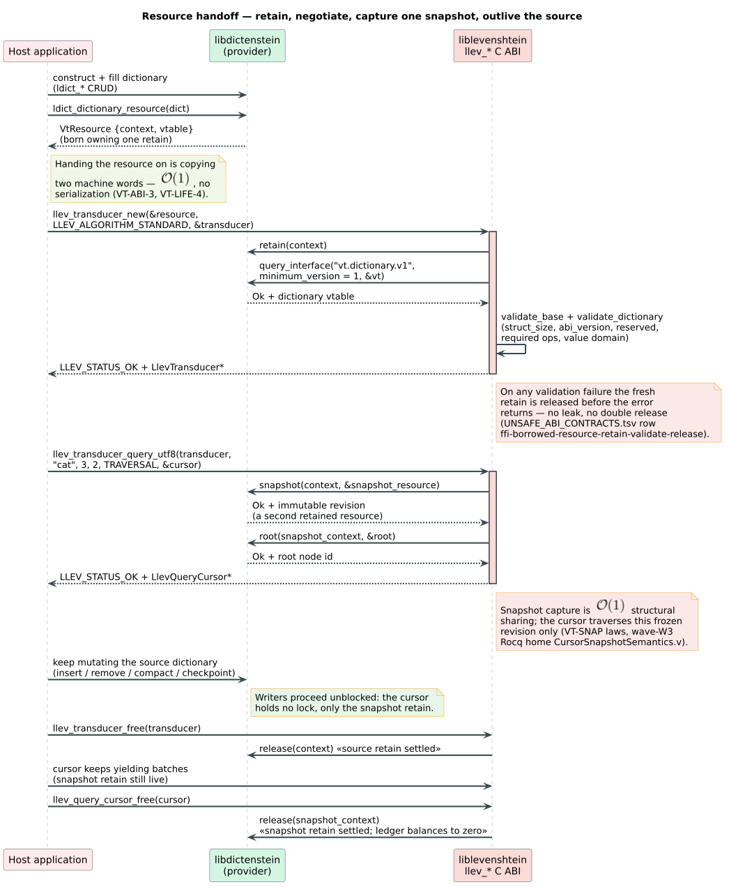
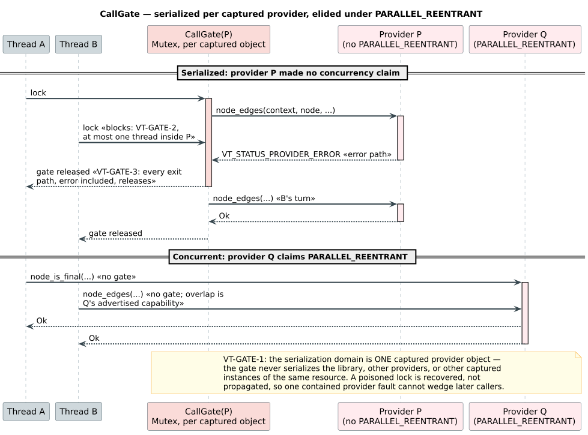
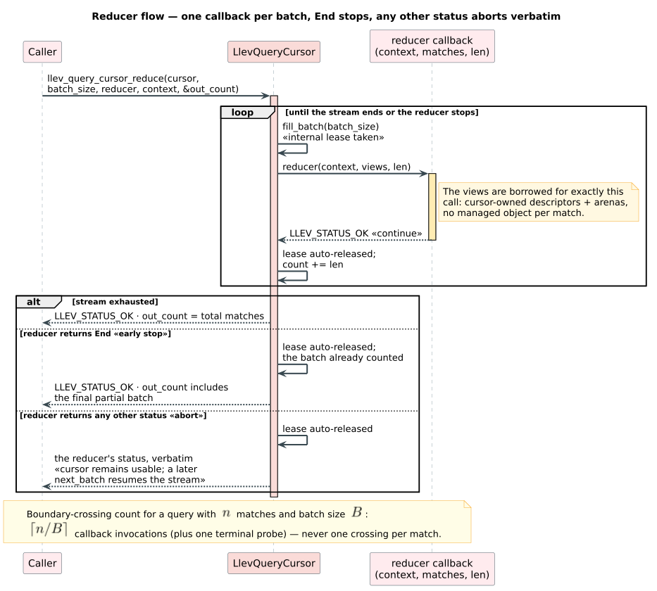

# The resource consumer — `src/bindings.rs` from the inside

How liblevenshtein *consumes* a foreign `vt.dictionary.v1` resource: the
safe-Rust layer between the [`llev_*` C ABI](c-abi-reference.md) above it and
the [interop contract](../../vinary-tree-interop/docs/abi-reference.md) below
it. This is the reference for binding authors and reviewers who need to know
exactly what happens between a `VtResource` arriving and a match leaving —
validation, graph import, callback fallback, fault handling, and ownership, each tied to
its formal home and its tests.

The through-line: **the consumer trusts nothing it did not compute.** Every
value a provider writes is validated before use, every callback is gated
unless the provider claims reentrancy, every fault becomes a status instead
of a crash, and every retain is settled on every path — including every
error path.

---

## 1. The object model at a glance

| Type | Visibility | Role |
|---|---|---|
| `Provider` | private | One owned retain of a resource + its discovered dictionary/optional visit/optional compact-graph/optional snapshot-identity vtables + the per-object call gate, fault latch, identity-keyed fallback node cache, and one-revision graph memo. Always handled as `Arc<Provider>`. |
| `ForeignNode<U>` | private | One dictionary node identifier bound to its snapshot `Provider`; implements the crate's `DictionaryNode`/`MappedDictionaryNode` traits so the automaton engine traverses foreign dictionaries exactly like native ones. |
| `ResourceTransducer` | public | The automaton configuration: a validated `Provider` (the *source*) plus an `Algorithm`. Construction is $`\mathcal{O}(1)`$. |
| `QueryCursor` | public | One lazy query over the *snapshot* `Provider` captured at query start. May outlive the transducer and every other handle to the dictionary. |
| `MatchBatch` / `Match` / `MatchTerm` | public | Reusable safe-Rust batch storage and the domain-tagged match value (`Utf8`/`Bytes`/`U64` terms, exact distance, optional provider value). |
| `BindingError` | public | The total error currency of this layer (§ 5). |
| `PhoneticPattern` / `PhoneticRuleSet` | public (feature `bindings-phonetic`) | Reusable compiled NFA and rewrite-rule set behind the phonetic C surface. |

End to end, a handoff looks like this:



---

## 2. Intake: retain, validate, or release — never leak

`ResourceTransducer::from_resource` (the only public entrance, `unsafe`
because the caller vouches for the interop contract) delegates to
`Provider::from_borrowed`:

```text
procedure from_borrowed(resource):
    validate_base(resource)                ▷ null words? struct_size? abi_version = 1?
                                           ▷ reserved = 0? all three base ops present?
    retain(resource.context)               ▷ take our own retain FIRST
    result ← from_owned(resource)          ▷ negotiate + validate the interface
    if result is an error:
        release(resource.context)          ▷ settle OUR retain before erroring
    return result
```

The order is the contract: the retain is taken before validation can fail
and released on **every** failure branch, so intake is leak-free and
double-release-free by construction — contract row
`ffi-borrowed-resource-retain-validate-release` in
[`UNSAFE_ABI_CONTRACTS.tsv`](../../docs/verification/UNSAFE_ABI_CONTRACTS.tsv),
protocol law in
[`AbiResourceLifecycle.tla`](../verification/tla/AbiResourceLifecycle.tla)
(VT-LIFE-1..6), witnessed by
[`tests/abi_resource_lifecycle_correspondence.rs`](../../tests/abi_resource_lifecycle_correspondence.rs)
against the counting provider in `tests/support/interop_dictionary.rs`.

`from_owned` then performs discovery and interface validation:

- `query_interface("vt.dictionary.v1", minimum_version = 1)` — the raw
  `u32` answer is decoded first (§ 5's wire rule): a decoded `Unsupported`
  becomes `MissingDictionaryInterface`; any other decodable failure becomes
  `Provider(status)`; an undecodable value is `InvalidProviderOutput`; and
  a **null vtable on success** is rejected as `InvalidProviderOutput` (a
  success that delivered nothing is a provider bug, not a success).
- `validate_dictionary` — `struct_size` at least the v1 size,
  `interface_version >= 1` (a **minimum**, per the
  [evolution policy](../../vinary-tree-interop/docs/abi-evolution.md)), the
  four unconditionally required ops present (`snapshot`, `root`,
  `node_is_final`, `node_edges`), and `node_value_u64` present exactly when
  `value_domain` is `OptionalU64`.
- The reserved `Bytes` value domain is rejected as
  `UnsupportedValueDomain` — declared in the ABI, usable only under a future
  interface version.
- Immutable resources optionally negotiate `vt.snapshot.id.1`. A successful
  response is validated for size, minimum version, zero reserved field, and a
  non-null callback before reading the opaque `(producer, revision)` pair.
  `Unsupported` is the ordinary fallback, not an error.
- Immutable resources also optionally negotiate `vt.dict.graph.v1`. The
  consumer validates the vtable before invoking `graph`, then validates every
  pointer, count, range, flag, reserved byte, label, target, root, and nonzero
  value cursor before publishing a native `SnapshotTraversalGraph<U>`. A live
  resource advertising this immutable interface is rejected. `Unsupported`
  selects the callback-and-node-cache fallback described in § 3.1.

Finally the unit domain selects the typed arm (`ForeignDictionary::{Byte,
Unicode, U64}`), which fixes which query entry points the transducer
accepts.

## 3. `ForeignNode<U>`: three domains, one traversal engine

`InteropUnit` maps each unit domain to a native label type and an
ABI-boundary codec:

| Rust unit `U` | `VtUnitDomain` | `from_abi(label)` accepts | Rejection meaning |
|---|---|---|---|
| `u8` | `Byte` (1) | $`\lbrace 0, \ldots, 255 \rbrace`$ | a byte-domain label of 700 aliases nothing — it is provider garbage |
| `char` | `UnicodeScalar` (2) | $`[0, \mathrm{D7FF}_{16}] \cup [\mathrm{E000}_{16}, \mathrm{10FFFF}_{16}]`$ | surrogates and out-of-range code points are not scalar values |
| `u64` | `U64` (3) | all of $`\lbrace 0, \ldots, 2^{64}{-}1 \rbrace`$ | nothing to reject: tokens are opaque |

A label outside its domain is **rejected, never truncated**
(`InvalidProviderOutput("edge label is outside its domain")`) — truncation
would silently alias distinct labels, the exact failure mode the
[security model](../../vinary-tree-interop/docs/security-model.md#5-input-validation-duties)
forbids.

For DynamicDAWG snapshots, `ForeignNode<U>` normally supplies one retained
`SnapshotTraversalGraph<U>` to `TraversalSession`. Queued intersections then
contain one copy-only dense cursor. Finality and sorted edge ranges are read
directly from immutable arrays with no lock, provider callback, child-handle
construction, or reference-count traffic. Only an accepted final match crosses
the boundary through the graph vtable's value callback. Its `value_cursor` is
an opaque graph-local token; the producer validates it before translating it to
backend state.

When compact-graph negotiation is unsupported, `ForeignNode<U>` implements the
same traversal traits through the base/visit vtables and validates every
output:

- `is_final` — accepts only zero or one; anything else is a fault.
- `transition(label)` — uses the provider's `node_transition` when present
  (absence of an edge is a *result*, `out_found = 0`, not an error); falls
  back to a full `expanded_edges` scan when the optional op is absent.
- `edges` / `expanded_edges` — batched paging through
  `VT_RECOMMENDED_EDGE_BATCH`-sized caller-owned pages, enforcing the paging
  acceptance checks: `written <= capacity`, total consistency, domain-valid
  labels, and **progress** (an `Ok` page that advances nothing is rejected
  as "edge paging made no progress" instead of looping forever). The three
  family consumers currently phrase this acceptance slightly differently —
  ledgered as [LLEV-B8 / F3](FINDINGS_LEDGER.md); this wave (W3) harmonizes
  all three to the single proven predicate of
  `docs/verification/abi/theories/ConsumerAcceptance.v` (VT-PAGE-1..6).
- `value` — reads `VtOptionalU64`, accepting only `has_value` of zero or
  one. The `reserved` bytes are additionally validated as zero from this
  wave (W3) onward — the previously missing check is ledgered as
  [LLEV-B7 / F2](FINDINGS_LEDGER.md), harmonizing with lling-llang's
  existing `VtWfstArc.reserved` validation under VT-ABI-5.

Fallback expansion cost per node is $`\lceil \deg(v) / 256 \rceil`$ boundary crossings;
the batch-not-per-edge shape is pinned by
`provider_edges_cross_the_abi_in_batches_not_per_edge` in
[`tests/binding_snapshot_semantics.rs`](../../tests/binding_snapshot_semantics.rs).

### 3.1 Revision-wide fallback node memoization

Finality and the complete validated edge array are cached by ABI node id after
the first inspection. Without snapshot identity, the cache belongs only to one
`Provider`, preserving compatibility with every v1 producer. With
`vt.snapshot.id.1`, `Provider::from_owned` obtains a weak entry from a
process-local registry keyed by `(producer, revision)`: separately minted
resources for the same immutable graph then share one `Arc<NodeCache>` and one
warm traversal. A mutation changes the revision identity, so the successor
cannot observe predecessor entries.

The registry stores `Weak` values. It does not prolong snapshots or caches;
dead entries are pruned while installing misses. Cache values contain only
already validated finality and edges, and insertion uses a write-side double
check so racing inspectors converge on one published value. The test
`distinct_snapshot_resources_share_identity_keyed_node_caches` pins reuse for
equal identities and isolation after mutation.

### 3.2 Revision-wide compact-graph memoization

Graph validation and import are $`\Theta(\lvert V\rvert + \lvert E\rvert)`$
for graph nodes $`V`$ and edges $`E`$, so they occur once per immutable
revision rather than once per cursor. A provider-scoped strong memo retains the
latest decoded graph while that source is live. A process-local weak registry,
keyed by snapshot identity plus resource, dictionary, graph-vtable, and unit
domain lineage, lets separately returned resources for the same revision share
the same `Arc`. Decode work happens outside the registry mutex; publication
uses a second lookup so racing decoders converge without holding a global lock
during validation.

The producer similarly publishes its native graph and ABI projection through
revision-local `OnceLock` cells. Snapshot capture itself remains
$`\mathcal{O}(1)`$; the first graph negotiation for a revision pays the linear
projection/import cost, and subsequent query starts reuse it in
$`\mathcal{O}(1)`$. `tests/resource_snapshot_graph_path.rs` proves this for
byte, Unicode-scalar, and `u64` DynamicDAWGs, across mutation and the phonetic
language-product surface: one projection/decode per revision, zero legacy
edge/finality calls, and graph-value calls only for returned mapped values.

## 4. The call gate

At capture time the consumer inspects the provider's
`PARALLEL_REENTRANT` claim (`src/bindings.rs:203-206`) and installs the
gate every subsequent callback funnels through:

```text
gate ← if flags ∧ PARALLEL_REENTRANT ≠ 0
           then CallGate::Parallel          ▷ pass-through: overlap is the
                                            ▷ provider's advertised capability
           else CallGate::Serial(Mutex)     ▷ at most one thread inside this
                                            ▷ captured object at a time
```



The three pins, formally modeled in
[`LlevCallGate.tla`](../verification/tla/LlevCallGate.tla) and witnessed by
[`tests/abi_callgate_correspondence.rs`](../../tests/abi_callgate_correspondence.rs):

| Pin | Law | Model artifact | Test witness |
|---|---|---|---|
| VT-GATE-1 | The serialization **domain is one captured provider object** — never the process, the library, another provider, or another captured instance of the same resource. | the model's very shape: `gate` and `inCallback` are per-provider functions with no shared state | `gate_domain_is_per_provider_not_global` |
| VT-GATE-2 | A non-reentrant object never observes two concurrent callbacks. | invariant `MutualExclusion` | `serial_query_starts_never_overlap_on_the_base_provider` |
| VT-GATE-3 | **Every** exit path — normal return, error status, recorded fault — releases the gate; even the final `release` in `Drop` runs through it. | actions `ExitOk`/`ExitError` with identical release semantics; invariant `HolderIsInside` | same witness, error-path arm extended with the wave-W3 fault provider |

Two hardening details worth naming: the gate mutex recovers from poisoning
(`unwrap_or_else(PoisonError::into_inner)` on both the call path and the
drop path), so one contained provider fault cannot wedge every later
caller; and `Provider::drop` routes the final `release` through the same
gate, so a serialized provider never sees its own destruction race a
callback.

A **false** `PARALLEL_REENTRANT` claim harms only the claimant: the races
run inside the provider's own state, and whatever garbage they produce
re-enters this layer through the same § 3 validation as any other hostile
output (see the
[trust model](../security/binding-trust-model.md)).

## 5. The fault channel and the total `BindingError` map

**The status wire rule comes first.** On the Rust side every interop
callback returns its status as a **raw `u32`**, never as the `VtStatus`
enum — materializing an out-of-range value as a `#[repr(u32)]` enum would
be undefined behavior *before any check could run*. All decoding happens at
one chokepoint:

```text
procedure status(raw):                     ▷ the single decode chokepoint,
    match VtStatus::from_raw(raw):         ▷ src/bindings.rs
        None        → Err(InvalidProviderOutput("out-of-range status code"))
        Some(Ok)    → Ok(())               ▷ the only success value
        Some(other) → Err(Provider(other)) ▷ decodable failures keep identity
```

Producers encode with `VtStatus::to_raw`; the bijection over the nine
published values — and the refusal of everything else — is pinned by the
round-trip test in `vinary-tree-interop/tests/discriminant_pins.rs`. The C
header is untouched by this rule (C enums are integer-typed, so the ABI is
byte-identical). This closed high-severity finding
[LLEV-B6](FINDINGS_LEDGER.md) family-wide (commit `e42485c`; libdictenstein
converted in its own repo).

With the wire safe, fault *reporting* has its own shape. Trait methods like
`is_final` cannot return `Result` — the traversal engine expects plain
values. The consumer therefore separates *detection* from *reporting*: a
failing callback records the error in the provider's fault latch and
returns a **benign fallback** (`false`, `None`, or an empty edge list) that
truncates the traversal without corrupting it; the cursor then surfaces the
fault as an error on its next advance.

```text
procedure callback_failed(error, fallback):
    fault.set_if_empty(error)      ▷ FIRST fault wins; one slot per provider —
                                   ▷ constant space regardless of flood volume
    return fallback                ▷ traversal truncates, never corrupts

procedure next_match():
    if fault.take() is some error:  return Err(error)   ▷ check BEFORE pulling
    item ← inner_iterator.next()
    if fault.take() is some error:  return Err(error)   ▷ and AFTER: a fault
    return Ok(item)                                     ▷ mid-pull surfaces now
```

The latch (`AtomicTakeBox<BindingError>`) holds at most one `BindingError` per
query-local provider owner, so a misbehaving provider
cannot flood memory with messages; the double check around each pull bounds
fault latency to one match.

`BindingError` is **total** over everything this layer can observe — all
ten variants, their triggers, and their C-ABI mapping
(`map_binding_error`, § 3.1 of the [C-ABI reference](c-abi-reference.md)):

| # | `BindingError` variant | Trigger | `LlevStatus` |
|---|---|---|---|
| 1 | `NullResource` | either resource word null at intake | `NULL_POINTER` |
| 2 | `IncompatibleResourceAbi` | base handshake failure: `struct_size` short, `abi_version` $`\ne 1`$, `reserved` $`\ne 0`$, or a missing base op | `PROVIDER_ERROR` |
| 3 | `MissingDictionaryInterface` | `query_interface` answered `Unsupported` | `PROVIDER_ERROR` |
| 4 | `IncompatibleDictionaryInterface` | interface too old/short, or a required op absent (also recorded mid-traversal if an op vanishes behind an optional slot) | `PROVIDER_ERROR` |
| 5 | `UnitDomainMismatch { expected, actual }` | wrong query entry point for the dictionary's domain | `DOMAIN_MISMATCH` |
| 6 | `UnsupportedValueDomain(domain)` | the reserved `Bytes` value domain | `UNSUPPORTED` |
| 7 | `Provider(VtStatus)` | a callback returned a *decodable* non-`Ok` status — including the illegal-from-interfaces `End` (family pin F5) | preserved where a peer exists (`InvalidArgument`, `NullPointer`, `Unsupported`, `IoError`, `Closed`, `LimitExceeded`); everything else `PROVIDER_ERROR` |
| 8 | `InvalidProviderOutput(&str)` | an out-of-range raw status code (refused at decode), or success with malformed payload: null snapshot/vtable, snapshot that changes domains, bad page lengths, no-progress paging, out-of-domain label, non-boolean flag bytes | `PROVIDER_ERROR` |
| 9 | `UnsupportedOrdering(domain)` | `DistanceThenTerm` requested on a byte/u64 dictionary | `UNSUPPORTED` |
| 10 | `EmptyBatch` | `next_batch` with `max_matches` = 0 | `INVALID_ARGUMENT` |

The map is total twice over: every hostile input class lands in exactly one
variant, and every variant has exactly one `LlevStatus` image — there is no
input a provider can produce that this layer answers with anything but a
status. Contract row `ffi-callback-status-trust` in
[`UNSAFE_ABI_CONTRACTS.tsv`](../../docs/verification/UNSAFE_ABI_CONTRACTS.tsv)
states the decode-before-use duty this section implements.

## 6. Query start and the snapshot boundary

Each `query_*` on `ResourceTransducer`:

1. checks the unit domain (variant 5 above) and the requested order
   (variant 9);
2. calls the provider's `snapshot` through the gate — the one
   $`\mathcal{O}(1)`$ capture — and **re-validates the snapshot as a full
   resource** via `from_owned` (a snapshot is a new resource: it gets its
   own base validation, interface negotiation, own gate, own fault latch);
   when the snapshot advertises identity, this step also joins the revision's
   shared validated-node cache;
3. rejects a snapshot whose unit or value domain differs from its source
   (`InvalidProviderOutput` — a revision cannot change what its labels
   mean);
4. reads `root` and hands the automaton engine a
   `ForeignNode` over the **snapshot** provider.

The cursor owns only the snapshot retain. That single fact yields the
outliving property: dropping the transducer or the caller's dictionary
handle releases *their* retains, while the cursor's revision stays pinned
until the cursor drops — the laws, their persistence-theory basis, and the
law-by-law correspondence table live in
[snapshot semantics](../theory/snapshot-semantics.md).

## 7. Cursor anatomy: batches, arenas, and the two-pass fixup

`QueryCursor::next_batch` fills a reusable `MatchBatch` (safe Rust); the C
layer (`LlevQueryCursor` in `src/ffi/index.rs`) then projects it into
borrowed descriptors over contiguous arenas:

```text
procedure fill_batch(cursor, max):                  ▷ the C-ABI hot path
    require ¬cursor.leased                          ▷ else BATCH_IN_USE
    count ← cursor.inner.next_batch(batch, max)     ▷ safe-Rust pull (§ 5 faults surface here)
    if count = 0:  return END

    clear views, offsets, byte_arena, u64_arena     ▷ clear retains capacity: warm
                                                    ▷ batches allocate nothing
    ── pass 1: copy terms, record offsets, write descriptors with NULL data ──
    for item in batch:
        offset ← arena.len(); arena.extend(item.term)
        offsets.push(offset)
        views.push({term_data: NULL, term_len, byte_len, distance, id, …})

    ── pass 2: fix up pointers only after every arena write completed ──
    for (view, offset) in zip(views, offsets):
        view.term_data ← arena.base + offset        ▷ arenas are stable now:
                                                    ▷ no realloc can dangle these
    generation ← max((generation + 1) mod 2^64, 1)  ▷ strictly increasing, never 0
    leased ← true
    return OK
```

The two-pass shape is load-bearing: term copies in pass 1 may grow an arena
and **relocate** it, so descriptor pointers computed eagerly could dangle
into freed memory. Deferring every `term_data` fixup until the arenas are
final makes the realloc hazard structurally impossible. This invariant's
formal home is the wave-W3 Verus artifact
`docs/verification/verus/ffi_batch_arena.rs` (LLEV-ARENA-1..3: window
bounds, content fidelity, fixup-after-stabilize), with the
`ffi-leased-batch-aliasing` contract row covering the borrowed window
itself; the lease FSM around it is `LlevBatchLease.tla`
(LLEV-LEASE-1..7), anchored by
[`tests/ffi_resource_snapshot_semantics.rs`](../../tests/ffi_resource_snapshot_semantics.rs).

Sizing: `views`/`offsets` are preallocated to `DEFAULT_MATCH_BATCH` (256,
the same constant `bindings/api.json` publishes as `defaultMatchBatch`);
the arenas warm up on the first batch and are never shrunk between batches.

The reducer path drives this same machinery with one callback per batch and
automatic lease settlement:



## 8. What this layer never does

By design, the consumer layer contains **no** dictionary construction, no
CRUD, no persistence controls, and no concrete dictionary types — those are
libdictenstein's (`bindings/api.json` `forbiddenOwnedObjects`, enforced by
`scripts/check-bindings.py`). It also never materializes a global result
vector, never holds a provider lock across user code (the gate scopes to
single callbacks), and never crosses the boundary once per match.

---

*See also:* [C-ABI reference](c-abi-reference.md) — the surface above this
layer · [snapshot semantics](../theory/snapshot-semantics.md) — the cursor
laws and their proofs · [binding trust model](../security/binding-trust-model.md)
— the adversarial reading of every check in this document ·
[interop canon](../../vinary-tree-interop/docs/abi-reference.md) — the
contract being consumed.
