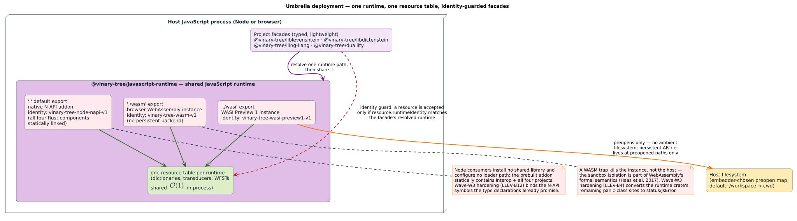
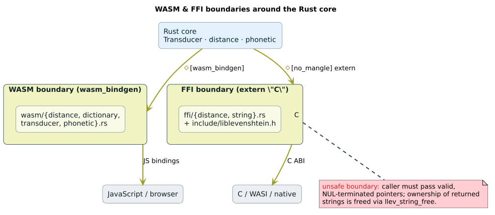

# WASM and JavaScript topology — one shared JavaScript runtime, three paths

Why the JavaScript ecosystem gets a deliberately different shape from every
other binding: **one** runtime package, `@vinary-tree/javascript-runtime`, owns one
coherent native/WASM instance and one resource table per selected path, and
the per-project packages (`@vinary-tree/liblevenshtein`,
`@vinary-tree/libdictenstein`, `@vinary-tree/lling-llang`,
`@vinary-tree/duallity`) are lightweight typed facades over it. This
document specifies the topology, the runtime-identity guard, the three
runtime paths and their capability differences, the WASI preopen policy,
and the panic-versus-status discipline at each boundary.



---

## 1. Terms

| Term | Definition |
|---|---|
| shared JavaScript runtime | The standalone [`javascript-runtime`](https://github.com/vinary-tree/javascript-runtime) repository, published as `@vinary-tree/javascript-runtime`. It statically combines interop + all four family projects into one loadable unit per path. This is the one sanctioned all-of-family JavaScript surface, never an embedded subproject. |
| facade | A per-project npm package re-exporting its slice of the umbrella with idiomatic types; it holds **no** native payload of its own. |
| runtime path | One of the three loadable backends: native N-API, browser WASM, WASI Preview 1. |
| runtime identity | A frozen object each path publishes (`runtimeIdentity`) and stamps onto every resource it creates; the provenance token the guard compares. |
| resource table | The per-runtime registry of live handles (dictionaries, transducers, cursors, WFSTs). Handles are meaningful only against their own table. |
| preopen | WASI's capability grant: an explicit guest-path → host-path mapping. Without a preopen, a path does not exist for the guest. |
| trap | WebAssembly's fault outcome: execution of the *instance* halts. The embedding host survives and decides whether to re-instantiate. |

## 2. Why an umbrella at all

Everywhere else in the family, "modular packages + two-word resources" is
the whole story: native libraries in one address space exchange
`VtResource` handles directly
($`\mathcal{O}(1)`$, [canon § 5](https://github.com/vinary-tree/vinary-tree-interop/blob/master/docs/abi-reference.md#5-the-resource-two-words-and-a-base-vtable)).
WebAssembly breaks that assumption: two independently instantiated WASM
modules have **disjoint linear memories and disjoint tables**, so a pointer
minted by one instance is a meaningless integer to another. Four separate
project WASM packages could never hand each other live dictionaries.

The umbrella restores the native deployment shape *inside* the sandbox: all
four projects compile into **one** module, share one linear memory, one
allocator, and one resource table — so a libdictenstein dictionary flows to
a liblevenshtein transducer or a duallity WFST exactly as it does natively,
without copies. Membership is bounded by the family data-flow relation:
only projects that exchange resources belong (an unrelated project must
stay outside the umbrella).



## 3. The three runtime paths

The package's `exports` map is the topology (from the standalone runtime's
[`package.json`](https://github.com/vinary-tree/javascript-runtime/blob/master/package.json)):

| Export | Backend | Runtime identity | Persistence | Selection |
|---|---|---|---|---|
| `.` (default) | native N-API addon; all four Rust components statically linked — no shared library to install, no loader path to configure | `vinary-tree-node-napi-v1` | full native semantics | `import ... from "@vinary-tree/javascript-runtime"` |
| `./wasm` | browser WebAssembly instance | `vinary-tree-wasm-v1` | **none** — no persistent backend is shipped at all | explicit subpath |
| `./wasi` | WASI Preview 1 instance under `node:wasi` | `vinary-tree-wasi-preview1-v1` | persistent ARTrie, **only** at preopened paths, only in builds whose `wasi` feature enables `libdictenstein/persistent-artrie` | explicit subpath |

Design rules the table encodes:

- **Native is the Node default.** WASM on Node is an alternative, not a
  silent fallback — a consumer who wants the sandbox asks for it.
- **Explicit subpaths, never sniffing.** The runtime never probes its
  environment to pick a backend; the import specifier is the decision.
  TypeScript types ship per path (`index.d.ts` for native/wasm, `wasi.d.ts`
  for the WASI surface).
- **Capability honesty.** The browser build ships no persistent backend
  because no real mmap/fsync substrate exists there — a durability
  guarantee that cannot be honored is not offered, rather than silently
  downgraded. Browser persistence, if it ever exists, will be a separate
  storage design, not a pretend WAL.

## 4. The runtime-identity guard

Every resource the umbrella mints is stamped with frozen provenance
metadata (`runtime-factory.mjs`):

```text
resource.interfaceId      = "vt.dictionary.v1" | "vt.scalar-wfst.1"
resource.runtimeIdentity  = the frozen identity of the minting runtime
```

and every acceptance point re-validates both before touching the handle:

```text
procedure requireDictionary(dictionary, runtimeIdentity):
    if dictionary.interfaceId ≠ "vt.dictionary.v1":
        throw TypeError("resource does not implement vt.dictionary.v1")
    if dictionary.runtimeIdentity ≠ runtimeIdentity:      ▷ same-instance check
        throw TypeError("resource belongs to a different Vinary Tree runtime")
```

(`requireWfst` is the same shape over `vt.scalar-wfst.1`.) The project
facades enforce the same rule at their own doors — each facade resolves one
runtime path, re-exports its identity, and refuses foreign resources with
`assertSameRuntime` before forwarding. `bindings/api.json` pins the policy
as `wasm.runtimeIdentityGuard: true`, and `scripts/check-bindings.py`
enforces its presence.

What the guard buys: a raw index into instance A's resource table can never
be dereferenced against instance B's table — the cross-instance confusion
becomes a typed, catchable `TypeError` at the boundary instead of silent
misbehavior inside it. This is the JavaScript analogue of the two-word
law's "handles are meaningful only under a live retain of *their own*
provider".

## 5. WASI capability policy

The WASI path follows strict capability discipline — the family policy is
canonically specified in the
[security model § 7](https://github.com/vinary-tree/vinary-tree-interop/blob/master/docs/security-model.md#7-wasi-capability-policy);
the mechanics here:

- `createWasiRuntime({ preopens })` instantiates an **isolated** WASI
  runtime whose entire filesystem view is the argument's guest→host map
  (`wasi-runtime.mjs`; the default grant is a single `/workspace` mapping
  the embedder chooses). No path outside the preopen set exists for the
  guest, and the runtime never widens the grant on its own.
- The filesystem-backed persistent dictionary
  (`vt_persistent_artrie_create` / `vt_persistent_artrie_open`, implemented
  in `rust/src/wasi.rs`) operates **at preopened paths only** and only
  compiles into builds whose `wasi` feature deliberately enables
  `libdictenstein/persistent-artrie`. Operations a persistent dictionary
  cannot honor in that environment (`clear`, `compact`) fail with explicit
  messages instead of pretending.
- Durable checkpointing is an explicit call, not an ambient promise.

## 6. Panic versus status, per boundary

The family containment law — no unwinding across an `extern "C"` boundary,
faults surface as statuses
([canon § 3](https://github.com/vinary-tree/vinary-tree-interop/blob/master/docs/security-model.md#3-the-panic-and-exception-containment-law))
— meets three different fault substrates here:

| Boundary | Fault discipline | State |
|---|---|---|
| Native N-API path → the four projects' C ABIs | Every `llev_*`/`ldict_*`/`lling_*`/`duallity_*` entry point wraps in `catch_unwind` and returns a status; the JS layer converts non-`Ok` statuses to thrown `Error`s with the thread-local message. | The steady-state design. |
| The umbrella's own WASM/WASI runtime crate (`rust/src/{wasi,browser}.rs`) | Must be the same: status codes / `JsError`, never a panic. Panic-class sites (`unwrap`/`expect`/`unreachable!`) remaining in this crate are ledgered as finding **LLEV-B4** and are being converted in this wave (W3), with no-panic regression tests and a `check-bindings.py` grep gate to keep them out. | Wave-W3 hardening, in flight. |
| A trap despite all of the above (or before the hardening lands) | A WASM trap kills the **instance**, not the embedding host — the module-level analogue of `catch_unwind`, guaranteed by WebAssembly's formal semantics (Haas et al. [[1]](#8-references)). The embedder decides whether to re-instantiate. | The floor the sandbox itself provides. |

Related wave-W3 hardening on the native path: the Node N-API addon
currently omits symbols its type declarations promise
(`levenshteinDistanceThreshold`-class functions, `pattern_size`,
`rules_len`) — a TypeScript consumer compiles clean against members that
are `undefined` at runtime on the default path. Ledgered as **LLEV-B12**;
the fix binds the missing symbols and adds contract tests asserting runtime
presence of every declared member on every path.

## 7. What facades may rely on

A facade (or an application talking to the umbrella directly) may assume:

1. one resource table per resolved path, shared by all four projects —
   in-process handoff is $`\mathcal{O}(1)`$ and copy-free;
2. every resource it receives back carries `interfaceId` +
   `runtimeIdentity`, and every acceptance point re-checks them;
3. cursors keep **query-start snapshot semantics** across all three paths —
   mutating or closing a dictionary after a cursor starts does not change
   that cursor's remaining results (the same laws as everywhere else:
   [snapshot semantics](../theory/snapshot-semantics.md));
4. batch iteration is bounded: cursors stream batches of the api.json
   `defaultMatchBatch` (256) unless told otherwise, with
   $`\lceil n / B \rceil`$ boundary crossings for $`n`$ results;
5. failures arrive as exceptions carrying the library's message — never as
   an aborted host process (§ 6).

## 8. References

1. Andreas Haas, Andreas Rossberg, Derek L. Schuff, Ben L. Titzer, Michael
   Holman, Dan Gohman, Luke Wagner, Alon Zakai, and JF Bastien. 2017.
   *Bringing the web up to speed with WebAssembly.* PLDI 2017, 185-200.
   DOI: [10.1145/3062341.3062363](https://doi.org/10.1145/3062341.3062363).
   — The formal semantics behind § 6's trap-containment floor and § 2's
   disjoint-instance premise.

<!--
DOI verification (2026-08-08): curl -sI --max-redirs 0 https://doi.org/<doi>
  10.1145/3062341.3062363 -> 302 (handle API responseCode 1)
Negative control 10.1145/9999999.9999999 -> 404 / responseCode 100.
-->

---

*See also:* [binding corpus hub](README.md) ·
[C-ABI reference](c-abi-reference.md) — the native surface under the N-API
path · [binding trust model](../security/binding-trust-model.md) ·
[releasing](../releasing-language-bindings.md) — umbrella-before-facades
publish order.
