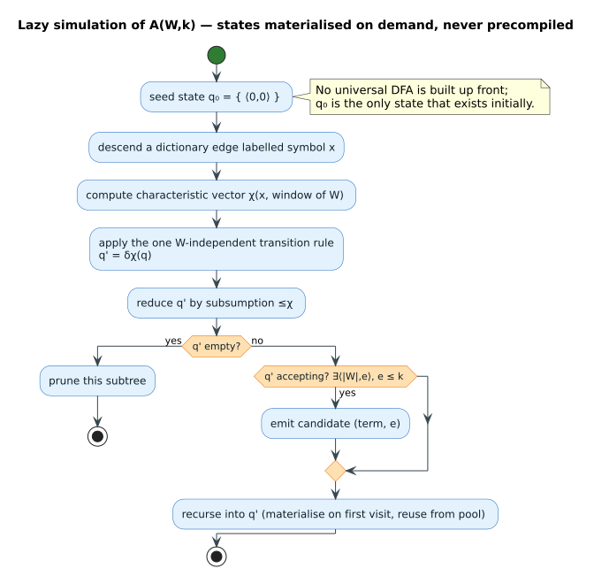

# Lazy vs Eager Levenshtein Automata

## Overview

This document explains the two complementary approaches to Levenshtein automata
implemented in this library, using intuitive "lazy" and "eager" terminology. The
**lazy** engine is the production default; the **eager** (universal) engine is a
parameter-free alternative and a testing oracle. A third, **generalized**
implementation makes the edit operations configurable at run time.


A **Levenshtein automaton** `A(W, k)` for a query word `W` and error bound `k`
accepts exactly the strings within edit distance `k` of `W`. Its states are
*sets* of **positions** `⟨i, e⟩` (`i` characters of `W` consumed, `e` edits used),
kept minimal by **subsumption** (a partial order that drops dominated positions).

## Terminology

### Lazy Automata (Schulz & Mihov 2002)

**Also known as:** Parameterized Levenshtein Automata

**Key Characteristic:** States are constructed **lazily** (on-demand) during dictionary traversal — there is no precompiled automaton.

- **Construction**: happens at query time, specific to each query word.
- **State space**: minimal — only states that are actually reachable are created; only `𝒪(∣W∣)` distinct states arise for fixed `k`.
- **Positions**: concrete indices into the query word.
- **Dictionary integration**: fully integrated with the DAWG traversal (the lock-step walk).
- **Location**: `src/transducer/`.
- **Performance**: `𝒪(log n)` effective dictionary complexity (DAWG pruning).
- **Memory**: a fixed `StatePool` + the query-specific states.

**Analogy:** like a JIT (just-in-time) compiler — compiles only what is needed, when it is needed.



### Eager Automata (Mitankin 2005)

**Also known as:** Universal Levenshtein Automata

**Key Characteristic:** the entire automaton structure is constructed **eagerly** (upfront) before any queries.

- **Construction**: happens once for a given `max_distance` (`k`).
- **State space**: complete — all possible states for that distance.
- **Positions**: abstract **I-type** / **M-type** positions. An *I-type* position is measured relative to the abstract *start* parameter and an *M-type* position relative to the abstract *end* parameter, which is what makes the automaton **parameter-free** (independent of the concrete word).
- **Dictionary integration**: standalone (accepts word pairs).
- **Location**: `src/transducer/universal/`.
- **Performance**: `𝒪(n)` for a linear dictionary scan (currently).
- **Memory**: `𝒪(n²)` states for distance `n`.

**Analogy:** like an AOT (ahead-of-time) compiler — prepares everything upfront, reuses across inputs.

---

## Comparison Table

| Aspect | Lazy Automata | Eager Automata |
|--------|---------------|----------------|
| **Academic Name** | Parameterized | Universal |
| **Common Name** | Lazy | Eager |
| **Construction Timing** | Query time (per word) | Upfront (once per distance) |
| **State Construction** | On-demand | Precomputed |
| **Reusability** | Per query word only | Any word with same distance |
| **State Space Size** | Minimal (reachable only) | Complete (all possible) |
| **Position Type** | Concrete (term_index) | Abstract (I/M + offset) |
| **Dictionary Integration** | ✅ Fully integrated | ❌ Standalone primitive |
| **Performance (dict query)** | **2-10× faster** | Slower (linear scan) |
| **Performance (primitive)** | N/A | **339-490ns** |
| **Memory Footprint** | StatePool + states | O(n²) automaton |
| **Best Use Case** | Production queries | Oracle testing, primitives |

---

## When to Use Which

### Use Lazy Automata For:

✅ **Production dictionary queries** (primary use case)
- 2-10× faster than eager for dictionary operations
- O(log n) complexity from DAWG integration
- Optimized with StatePool, SIMD, subsumption

✅ **Large dictionaries** (>1K terms)
- Performance advantage increases with dictionary size
- 7.6× faster at 10K terms

✅ **Batch processing**
- Consistent 4 Melem/s throughput
- Excellent cache behavior

✅ **Low to medium distances** (d=1-3)
- Optimal performance range
- State space remains manageable

### Use Eager Automata For:

✅ **Single word-pair distance checks** (no dictionary)
- 339-490ns per accepts() call
- 2-3 million operations/second

✅ **Oracle testing** (differential testing)
- Independent implementation for cross-validation
- Reference for verifying lazy automaton correctness

✅ **Research and prototyping**
- Clean theoretical foundation
- Easier to reason about

✅ **Parameter-free reuse** (future)
- Build once, query many words
- When dictionary integration is added

✅ **Very high distances** (d>5, future)
- More predictable scaling than lazy
- Sublinear complexity growth

---

## Performance Characteristics

### Lazy Automata Performance

**Single Query:**
- Distance 1: 55µs
- Distance 2: 265µs
- Distance 3: 662µs
- Distance 4: 949µs

**Batch Throughput:** 3.9-4.1 Kelem/s (consistent)

**Dictionary Scaling:** `𝒪(log n)`
- 100 terms: 49µs
- 1K terms: 258µs
- 10K terms: 1.03ms

**Growth Rate:** Sub-linear (DAWG pruning)

### Eager Automata Performance

**Primitive Operation (accepts):**
- Distance 1: 339ns
- Distance 2: 471ns
- Distance 3: 490ns

**Dictionary Query (linear scan):**
- 100 terms: 81µs
- 1K terms: 799µs
- 10K terms: 7.83ms

**Growth Rate:** Linear `𝒪(n)`

**Distance Scaling:** Predictable
- d=1 → d=2: 1.24× increase
- d=2 → d=3: 1.19× increase
- d=3 → d=4: 1.27× increase

---

## Implementation Details

### Lazy Automata Architecture

**Core Components:**
1. **Position**: `(term_index, num_errors, is_special)`
   - Concrete index into query word
   - Tracks error count and special states

2. **State**: `SmallVec<[Position; 8]>`
   - Stack-allocated for ≤8 positions
   - Online subsumption maintains anti-chain

3. **StatePool**: Preallocated buffer for state reuse
   - Default 64KB
   - Eliminates per-query allocation

4. **AutomatonZipper**: Manages traversal state
   - Current dictionary node
   - Current automaton state
   - Transition logic

**Key Optimizations:**
- SIMD characteristic vectors
- Online subsumption (3.3× faster than batch)
- State pooling
- Value-based filtering (10-100× for predicates)

### Eager Automata Architecture

**Core Components:**
1. **UniversalPosition**: `I(offset, errors)` or `M(offset, errors)`
   - I-type: Relative to abstract start parameter
   - M-type: Relative to abstract end parameter
   - Parameter-free (works for any word)

2. **CharacteristicVector**: `β(x, w)`
   - Encodes which positions in word `w` match character `x`
   - Enables parameter-free transitions (see the [characteristic-vector diagram](../diagrams/automata/characteristic-vector.svg))

3. **State**: `SmallVec<[UniversalPosition; 8]>`
   - Same optimization as lazy
   - But positions are abstract

4. **DiagonalCrossing**: Detects I→M transitions
   - Determines when to switch position types
   - Critical for acceptance checking

**Key Properties:**
- Parameter-free: One automaton for all words
- Precomputed: O(n²) state space
- Reusable: Same automaton across queries

---

## Cross-Validation Strategy

The eager automaton serves as an **oracle** (an independent reference
implementation, trusted to give the correct answer) for testing the lazy
automaton via differential / property-based testing:

```rust
// Differential testing
proptest! {
    #[test]
    fn prop_lazy_matches_eager_oracle(
        query: String,
        dict_word: String,
        distance: u8
    ) {
        // Eager (oracle - reference implementation)
        let eager = EagerAutomaton::new(distance);
        let eager_accepts = eager.accepts(&dict_word, &query);

        // Lazy (implementation under test)
        let dict = DynamicDawg::from_terms(vec![dict_word.clone()]);
        let lazy = LazyTransducer::new(dict, Algorithm::Standard);
        let lazy_accepts = lazy.query(&query, distance as usize)
            .any(|r| r == dict_word.as_str());

        // Must agree!
        assert_eq!(eager_accepts, lazy_accepts);
    }
}
```

**Benefits:**
- Independent implementations catch each other's bugs
- High confidence when both agree
- Property-based testing generates edge cases
- Regression detection

---

## Future Work

### For Lazy Automata

1. **Restricted Substitutions** (available)
   - Custom character similarity via `SubstitutionSet` / `SubstitutionPolicy`
   - Zero-cost abstraction using generic traits (`Unrestricted` is a ZST)
   - Use cases: phonetic matching, OCR, keyboard proximity

2. **Additional Optimizations**
   - Further SIMD improvements
   - Cache-aware state layout
   - Parallel batch processing

### For Eager Automata

1. **Dictionary Integration** (planned)
   - Eliminate O(n) linear scan
   - Achieve parity with lazy for queries
   - Maintain parameter-free benefits

2. **Restricted Substitutions**
   - Extend characteristic vectors
   - Support same substitution sets as lazy
   - Enable oracle testing with restrictions

3. **Parallel Dictionary Scanning**
   - Leverage parameter-free property
   - Thread-safe automaton sharing
   - Near-linear speedup with cores

---

## Academic References

**Lazy Automata:**
- Schulz, K. U., & Mihov, S. (2002). "Fast string correction with Levenshtein automata." *International Journal on Document Analysis and Recognition*, 5(1), 67–85. DOI: [10.1007/s10032-002-0082-8](https://doi.org/10.1007/s10032-002-0082-8).

**Eager Automata:**
- Mitankin, P. (2005). "Universal Levenshtein automata. Building and properties." *M.Sc. Thesis, Sofia University* (no DOI; thesis).

**Terminology:**
- "Lazy" vs "Eager" evaluation is standard in programming language theory
- Describes **when** computation happens (on-demand vs upfront)
- More intuitive than "parameterized" vs "universal" for developers

---

## Summary

**Lazy and Eager automata are complementary, not competitive:**

- **Lazy** = Production workhorse (dictionary queries)
- **Eager** = Research foundation (oracle testing, primitives)

Both approaches have unique strengths for different use cases. The lazy/eager terminology makes the fundamental trade-off clear: **when does construction happen, and what are the consequences?**

For production use, choose **lazy automata**. For testing lazy automata, use **eager automata as oracle**. This dual approach ensures correctness while maintaining optimal performance.

---

[← Documentation Index](../README.md)
