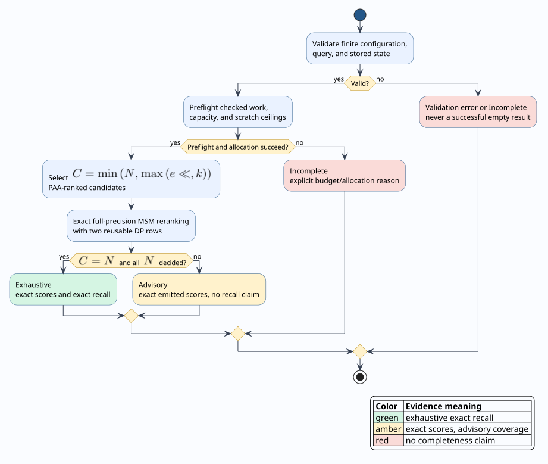

# Bounded Approximate MSM Evidence Contract

`ApproxMsmIndex` is a candidate generator followed by an exact verifier, not an
exact index. Piecewise Aggregate Approximation (PAA) reduces the cost of choosing
a small pool, while full-precision Move-Split-Merge (MSM) dynamic programming
determines every distance that the API emits. The strict API represents the
difference between *exact scores* and *exact recall* in its outcome type: exact
scores may be useful advice, but only exhaustive exact reranking proves that no
better indexed neighbor was omitted.

This document defines the mathematical contract, algorithm, resource semantics,
failure behavior, security boundary, and verification obligations for
`ApproxMsmIndex::search_knn_bounded`. The untagged `search_knn` method remains a
legacy advisory convenience and must never supply evidence of absence,
completeness, or release acceptance.

## Terms and symbols

Let $`I = \{0,\ldots,N-1\}`$ be the stable insertion positions in one immutable
index view, and let $`Q`$ be the query series. For position $`i \in I`$:

- $`X_i`$ is the stored full-precision series;
- $`D(Q,X_i)`$ is the exact MSM distance over finite scalar samples;
- $`F(X_i) \in \mathbb{R}^{s}`$ is its PAA feature vector with $`s`$ segments;
- $`H(Q) \subseteq I`$ is the deterministically selected candidate pool;
- $`\ell`$ is the configured candidate limit;
- $`C = |H(Q)|`$ is the number of admitted candidates; and
- $`R_k(Q,H)`$ is the first $`k`$ finite candidates under lexicographic order
  $`(D(Q,X_i),i)`$.

An **exact score** is a finite value produced by the exact MSM recurrence. An
**exhaustive result** decides every $`i \in I`$ by exact cutoff-aware MSM. An
**advisory result** decides every $`i \in H(Q)`$ but has $`H(Q) \ne I`$. An
**incomplete result** stopped before deciding its admitted pool because a hard
resource, allocation, arithmetic, numeric, or stored-data invariant failed.

## Evidence theorem

The exact-verification boundary establishes:

```math
\forall r \in R_k(Q,H),\qquad r.\mathrm{distance}=D(Q,X_{r.\mathrm{index}}).
```

This is score soundness, not recall. Full kNN recall follows only when exact
reranking covers the whole captured index:

```math
H(Q)=I
\;\land\;
\mathrm{exact\_reranked}=N
\quad\Longrightarrow\quad
R_k(Q,H)=R_k(Q,I).
```

When $`H(Q) \subsetneq I`$, PAA has no registered MSM lower-bound proof, so no
finite approximation ratio or recall floor is claimed. In particular:

```math
R_k(Q,H)=\varnothing
\;\not\Longrightarrow\;
R_k(Q,I)=\varnothing.
```

The runtime predicate `ApproxMsmCoverage::proves_recall` implements exactly the
conjunction $`C=N \land \mathrm{exact\_reranked}=N`$. Merely scanning every PAA
feature does not satisfy it.

## Outcome algebra



| Variant | Exact emitted distances | Exact kNN recall | Empty means absence |
| --- | --- | --- | --- |
| `Exhaustive` | yes | yes | yes, for finite MSM neighbors in the captured index |
| `Advisory` | yes | no | no |
| `Incomplete` | any partial emissions are exact | no | no |
| validation `Err` | no result exists | no | no |
| legacy `Vec` | selected candidates are exact-reranked, absent failures are untagged | never an evidence claim | no |

`ApproxMsmNeighbor` borrows its value from the index. The strict query therefore
does not invoke an arbitrary application-defined `Clone` implementation inside
the bounded resource contract.

## Literate algorithm

The procedure is deliberately non-resumable. It preflights the complete exact
candidate workload before reranking, so a budget cannot produce an accidentally
successful prefix.

```text
BOUNDED-APPROX-MSM(index, query, k, limits)
  validate the MSM parameter and finite query
  charge query validation and one invariant check per stored entry
  reject ingestion-recorded nonfinite stored state as Incomplete(InvalidStoredData)

  C := min(N, max(configured_candidate_limit, k))
  if k = 0 or N = 0
    return Exhaustive only if C = N = 0; otherwise return Advisory

  if C < N
    preflight ranking work and scratch
    compute query PAA with fallible allocation
    retain the best C feature scores in a bounded max-heap
  else
    select every insertion position without constructing a feature heap

  sum the exact DP-cell charge for all selected candidates
  preflight candidates, cells, work, results, and peak scratch atomically
  fallibly allocate one result heap, one output vector, and two reusable rows

  for each selected position in deterministic order
    cutoff := current worst retained exact distance, or positive infinity
    decide exact MSM with the iterative two-row recurrence
    retain by lexicographic key (exact_distance, insertion_position)

  return Exhaustive iff every indexed position was exactly decided
  otherwise return Advisory
```

The PAA heap is bounded by $`C`$, and exact reranking retains at most $`k`$
neighbors. The two DP rows are sized once for the largest selected shorter
operand and reused across candidates. Consequently, excluding immutable index
storage, peak retained state is:

```math
\mathcal{O}\!\left(
s + C + k + \min\!\left(|Q|,\max_{i\in H(Q)}|X_i|\right)
\right).
```

There is no recursion: PAA construction, heap maintenance, validation, and MSM
scoring are iterative. Stack use is therefore constant with respect to
$`N`$, $`|Q|`$, and $`|X_i|`$. This approximate batch index does not claim to be
an online stream automaton; the fixed-query online automata described in
[`lazy-online-products.md`](lazy-online-products.md) provide that distinct
unknown-length-stream contract.

## Resource and failure semantics

Every limit is a hard inclusive ceiling. Checked preview-then-commit accounting
precedes exact reranking.

| Resource | Charge |
| --- | --- |
| `SeriesLength` | query and every stored candidate must fit |
| `Candidates` | exactly $`C`$ exact candidate decisions reserved |
| `DpCells` | $`\sum_{i\in H(Q)} |Q|\,|X_i|`$ for nonempty operands |
| `WorkUnits` | finite query validation, constant-time stored-entry invariant checks, PAA/ranking, and reserved DP cells |
| `Results` | at most $`\min(k,C)`$ retained neighbors |
| `ScratchBytes` | peak simultaneous PAA, heap, output, and two-row buffers |

All capacity multiplication and cumulative addition use checked integer
arithmetic. Every vector and heap uses fallible reservation before it is filled.
Nonfinite request samples are validation errors. Insertion records whether the
stored full-precision series and its features are finite, so strict queries
check one immutable flag rather than rescanning every candidate series; a false
flag is `InvalidStoredData`. Nonrepresentable feature or MSM arithmetic is
`NumericOverflow`. None of these states is converted to an empty successful
result.

The strict constructor `ApproxMsmConfig::try_new` rejects a negative or
nonfinite MSM split/merge cost. The legacy constructor retains historical
normalization for compatibility, but strict search revalidates the stored
configuration so a directly constructed invalid public value fails closed.

## Determinism and snapshot identity

Insertion position is the stable secondary ordering key. PAA ties, exact MSM
ties, heap replacement, and final output all use total floating-point order
followed by insertion position. Finite validation excludes NaN from every
ordering authority. Repeating a query against the same immutable index view and
configuration therefore yields bit-identical distances and identical positions,
independently of hash seeds.

Insertion position is stable only within the captured in-memory index view. A
persistent evidence artifact must bind stable episode identifiers and snapshot
identity as specified by the complete elastic snapshot design; an advisory
position must not be treated as a durable identifier by itself.

## Usage

```rust
use liblevenshtein::time_series::{
    ApproxMsmConfig, ApproxMsmIndex, ApproxMsmSearchOutcome, MsmConfig,
    ResourceLimits,
};

fn main() -> Result<(), Box<dyn std::error::Error>> {
    let msm = MsmConfig::try_new(1.0)?;
    let config = ApproxMsmConfig::try_new(8, 32, msm)?;
    let database = vec![vec![0.0, 1.0], vec![10.0, 11.0]];
    let index = ApproxMsmIndex::from_series(config, &database);

    match index.search_knn_bounded(&[0.0, 1.0], 1, ResourceLimits::default())? {
        ApproxMsmSearchOutcome::Exhaustive { result, .. } => {
            // This branch alone proves exact recall over the captured index.
            assert!(result.coverage.proves_recall());
        }
        ApproxMsmSearchOutcome::Advisory { result, .. } => {
            // Distances are exact, but omitted candidates may be closer.
            consume_advice(&result.neighbors);
        }
        ApproxMsmSearchOutcome::Incomplete { reason, .. } => handle_incomplete(reason),
    }
    Ok(())
}

fn consume_advice<T>(_neighbors: &[T]) {}
fn handle_incomplete<T>(_reason: T) {}
```

## Verification obligations

The implementation and regression suite pin the following invariants:

1. every emitted position exists in the captured index;
2. every emitted distance is finite and bit-equal to independent scalar MSM;
3. output is ordered by exact distance and then insertion position;
4. `proves_recall` is true only after exact decisions for all $`N`$ entries;
5. exhaustive results equal brute-force exact kNN;
6. advisory empty, budget failure, invalid input, invalid stored state, and
   numeric overflow are pairwise distinguishable from exhaustive empty;
7. preflight failure exposes no exact-reranking prefix;
8. repeated queries are deterministic; and
9. constrained-stack execution is independent of series length.

Property-based tests vary database size, empty operands, PAA dimension,
candidate limit, $`k`$, and MSM cost. A small independent brute-force oracle is
the recall authority only for `Exhaustive`; `Advisory` is checked solely for
score soundness and ordering.

## References

- Stefan, A., Athitsos, V., and Das, G. “The Move-Split-Merge Metric for Time
  Series.” *IEEE Transactions on Knowledge and Data Engineering* 25(6),
  1425–1438 (2013). [doi:10.1109/TKDE.2012.88](https://doi.org/10.1109/TKDE.2012.88).
- Keogh, E., Chakrabarti, K., Pazzani, M., and Mehrotra, S. “Dimensionality
  Reduction for Fast Similarity Search in Large Time Series Databases.”
  *Knowledge and Information Systems* 3, 263–286 (2001).
  [doi:10.1007/PL00011669](https://doi.org/10.1007/PL00011669).
