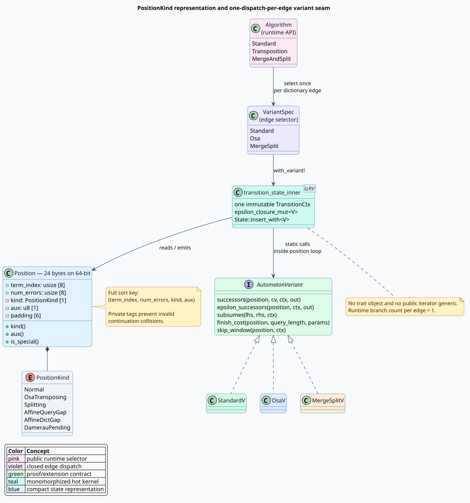

# The `PositionKind` and `AutomatonVariant` seam

## 1. Purpose and scope

The parameterized Levenshtein walker historically selected an [`Algorithm`](../../src/transducer/algorithm.rs)
inside every position transition and passed that runtime value through every
state insertion. That representation was sufficient for three algorithms whose
only additional memory was a Boolean “special” flag. It was not a sound growth
point for affine gaps or true Damerau–Levenshtein: those algorithms have several
distinct continuation languages, and true Damerau requires a small integer
payload.

Phase 5 introduces two connected seams:

- `PositionKind` gives every frontier representative a typed continuation
  language without changing the 64-bit size of `Position`.
- `AutomatonVariant` moves behavior behind a compile-time policy. Repeated
  whole-state work selects the runtime `Algorithm` once per dictionary edge,
  after which the per-position loop is monomorphized. A one-position public
  call performs exactly one closed match and returns its aggregate by value.

The public query shape does not change. Users still construct a `Transducer`
with `Algorithm::Standard`, `Algorithm::Transposition`, or
`Algorithm::MergeAndSplit`.



## 2. Vocabulary

| Term | Definition |
|---|---|
| **frontier** | The antichain of dynamic-programming positions reachable after the current dictionary prefix. |
| **position** | A tuple `(term_index, num_errors, kind, aux)` representing query progress, accumulated unit cost, continuation language, and a one-byte payload. |
| **continuation language** | The set of future dictionary suffixes that can complete a position. Positions in different continuation languages cannot generally subsume one another. |
| **dictionary edge** | One labelled transition from a dictionary node to a child node. One edge consumes one dictionary unit. |
| **variant** | A compile-time policy defining successors, epsilon successors, subsumption, completion cost, and characteristic-vector window size. |
| **subsumption** | A pruning relation: `lhs` subsumes `rhs` only when discarding `rhs` cannot raise the minimum future cost for any dictionary suffix. |
| **monomorphization** | Rust's generation of a specialized machine-code body for a concrete generic type such as `StandardV`. |
| **OSA** | Optimal string alignment, the restricted adjacent-transposition distance exposed as `Algorithm::Transposition`. OSA is not unrestricted Damerau–Levenshtein. |

## 3. Representation

On a 64-bit target, the old representation was two eight-byte integers, one
Boolean, and seven padding bytes. Phase 5 consumes one additional padding byte:

```text
byte offset     0               8              16   17              24
                ├ term_index ───┼ num_errors ───┼kind├aux├ padding ──┤
width           8 bytes         8 bytes         1    1    6 bytes
```

The compile-time assertion is:

```rust
#[cfg(target_pointer_width = "64")]
const _: [(); 24] = [(); std::mem::size_of::<Position>()];
```

The pointer-width guard is load-bearing. WebAssembly and other supported
32-bit targets have smaller `usize` alignment; demanding 24 bytes there would
artificially widen the type and regress those targets.

### 3.1 Position kinds

| `PositionKind` | Meaning now | Payload invariant |
|---|---|---|
| `Normal` | No multi-edge operation is pending. | `aux == 0` |
| `OsaTransposing` | The first edge of an adjacent OSA swap has been consumed. | `aux == 0` |
| `Splitting` | The first edge of a split continuation has been consumed. | `aux == 0` |
| `AffineQueryGap` | Gotoh `$`I_x`$`: a query-consuming gap is open. | `aux == 0`; the next query-gap symbol pays extension only |
| `AffineDictGap` | Gotoh `$`I_y`$`: a dictionary-consuming gap is open. | `aux == 0`; the next dictionary-gap symbol pays extension only |
| `DamerauPending` | A true-Damerau macro transition is in flight. | `aux` stores the positive bounded endpoint delta |

The fields are private. `kind()`, `aux()`, and `is_special()` are read-only
accessors. Typed constructors establish the legacy invariants. The deprecated
`new_special` constructor maps to `OsaTransposing`; new code must choose
`new_osa_transposing` or `new_splitting` explicitly.

### 3.2 Total ordering

`State::insert` uses binary search, so equality of sort keys must imply equality
of positions. The order is lexicographic:

```math
(i,e,k,a)<(j,f,l,b)
\iff i<j
\lor(i=j\land e<f)
\lor(i=j\land e=f\land k<l)
\lor(i=j\land e=f\land k=l\land a<b).
```

Ordering only by `(term_index, num_errors, is_special)` would collapse two
future true-Damerau representatives with different deltas. Rocq proves the
full-key injectivity lemma; Rust properties exercise kind and payload
distinctions.

## 4. Variant contract

`AutomatonVariant` is crate-private because it is an internal proof seam, not a
stable downstream extension API. Its associated `Params` value is copied into
the immutable `TransitionCtx` once per edge.

```rust,ignore
trait AutomatonVariant: Copy + 'static {
    type Params: Copy;
    fn successors(position: Position, cv: &[bool],
                  ctx: &TransitionCtx<Self::Params>,
                  out: &mut SmallVec<[Position; 4]>);
    fn epsilon_successors(position: Position,
                          ctx: &TransitionCtx<Self::Params>,
                          out: &mut SmallVec<[Position; 4]>);
    fn subsumes(lhs: &Position, rhs: &Position,
                ctx: &TransitionCtx<Self::Params>) -> bool;
    fn finish_cost(position: &Position, query_length: usize,
                   params: Self::Params) -> Option<usize>;
    fn skip_window(position: &Position,
                   ctx: &TransitionCtx<Self::Params>) -> usize;
}
```

The output buffer is caller-owned and **must be empty on entry**. The leaf appends
all successors and leaves ownership with the caller. A variant therefore cannot
hide a heap allocation behind its successor API, and the common four-successor
case remains inline in `SmallVec`. Debug assertions enforce the empty-entry
precondition at each built-in leaf.

### 4.1 Soundness invariants

For a position `$`p`$` and dictionary suffix `$`v`$`, let `$`F(p,v)`$` be the
minimum additional completion cost, or infinity when completion is impossible.
Subsumption has the central obligation

```math
\operatorname{subsumes}(p,q)\Longrightarrow
\forall v,\;F(p,v)\le F(q,v).
```

The other invariants are:

1. every emitted successor has a cost no larger than the active budget;
2. epsilon successors consume query input but no dictionary edge;
3. `finish_cost` returns `None` for unfinished multi-edge operations;
4. `skip_window` includes every query unit a legal successor may inspect;
5. the runtime selector is constant for every position processed on one edge;
6. the static and legacy runtime selectors choose extensionally equal leaf
   functions for all three built-in algorithms.

## 5. Edge-level dispatch

The key performance decision is *where* the runtime match occurs. Parameterizing
`Position<V>` or `State<V>` would propagate the variant through public iterator
types. A trait object would preserve those types but add a virtual call to the
hottest loop. Phase 5 instead keeps state concrete and specializes only the
transition kernel.

```text
TRANSITION-STATE-EDGE(state, algorithm, dictionary-unit, query, settings):
    # Runtime work: exactly one closed three-way branch for this edge.
    variant := SELECT-VARIANT(algorithm)

    # Compile-time work: Rust instantiates this body once for each variant.
    return TRANSITION-STATE-EDGE-WITH<variant>(state, dictionary-unit, query, settings)

TRANSITION-STATE-EDGE-WITH<V>(state, dictionary-unit, query, settings):
    context := immutable context(query length, budget, prefix mode, V parameters)
    expanded := EPSILON-CLOSURE-WITH<V>(state, context)
    next := empty antichain

    for position in expanded in total-key order:
        window := V.skip_window(position, context)
        characteristic := BUILD-CHARACTERISTIC-VECTOR(window)
        successors := V.successors(position, characteristic, context)

        for successor in successors:
            # V.subsumes is statically selected and inlined here.
            next.INSERT-WITH<V>(successor, context)

    return next unless next is empty

TRANSITION-ONE-POSITION(position, algorithm, characteristic, settings):
    # This operation has no repeated loop over which to amortize a generic
    # caller-owned result. Match once, then return the leaf aggregate by value.
    match algorithm:
        Standard      => STANDARD-OWNED(position, characteristic, settings)
        Transposition => OSA-OWNED(position, characteristic, settings)
        MergeAndSplit => MERGE-SPLIT-OWNED(position, characteristic, settings)
```

`with_variant!` is intentionally a closed macro over `VariantSpec`. It avoids
duplicating the dispatch match across state, pooled-transition, initial-state,
and compatibility-insertion entry points while retaining a concrete type in
every branch. The one-position compatibility function matches directly into an
owned leaf: Criterion showed that passing its result through the generic output
parameter penalized that one-shot boundary, whereas repeated state loops benefit
from the reusable caller-owned buffer.

## 6. Built-in variants

| Variant type | Runtime algorithm | Special kind | Subsumption distinction |
|---|---|---|---|
| `StandardV` | `Standard` | none | The usual diagonal/error inequality. |
| `OsaV` | `Transposition` | `OsaTransposing` | Normal and pending-swap continuations never cross-subsumed; two pending swaps require the same query index. |
| `MergeSplitV` | `MergeAndSplit` | `Splitting` | Kinds must agree; only same-index positions with strictly fewer errors prune; a final pending split cannot prune a non-final one. |

The public `Position::subsumes` and `State::insert` methods remain compatibility
entry points. They select the same static variant once and delegate to the
generic leaf. Hot walker paths call `insert_with::<V>` directly.

## 7. Verification and executable invariants

| Layer | Artifact | Obligation |
|---|---|---|
| Rocq | `Conformance/PositionKindVariant.v` | representation validity, full-key injectivity, dispatch equivalence, error-order and continuation-separation theorems |
| Verus | `verus/position_kind_variant.rs` | Rust-facing key, payload, selector, and variant invariants |
| Z3 + cvc5 | `smt/position_kind_variant.smt2` | independent counterexample searches for the same formulas |
| TLA+ TLC | `tla/VariantDispatch.tla` | temporal stability and exactly-once equivalence of one edge selection versus legacy per-position selection |
| Proptest | `tests/proptest_position_kind_variants.rs` | 2,000-case reference subsumption, deterministic transition, budget, typed-kind, layout, and total-order properties |
| Existing differential suite | `tests/proptest_automaton_distance_cross_validation.rs` | public result-set equality against reference distances for all three algorithms |

Formal predicates are kept deliberately close to executable properties. For
example, the Rocq theorem that mixed OSA continuations do not subsume is the
same branch exercised by generated normal/pending pairs.

## 8. Performance gate

The refactor is accepted only under the pre-registered rules in
[`position-kind-zero-cost-2026-08-01.md`](../scientific-ledger/position-kind-zero-cost-2026-08-01.md).
Six Criterion suites run on CPU 0 with all visible cores on the `performance`
governor. Each suite must have mean regression below 1.5%, and the conservative
mean of its per-case 95% upper confidence endpoints must exclude 3%.

All six suites passed: their mean changes ranged from -7.814% to +0.175%, and
their conservative upper-95% aggregates ranged from -7.230% to +0.641% across
423 cases. The result supports the pre-registered quantitative zero-cost claim.

The stronger exact-byte hypothesis was rejected. The normalized witness changed
from 1,073 to 1,583 bytes because the probe includes the intentional
`PositionKind`/`aux` initialization and the measured owned-return boundary; it
therefore did not isolate dispatch cost. `scripts/check-unit-cost-zero-cost.sh`
remains a strict negative witness. Timing does not rescue that stronger claim,
and the project makes no byte-identity claim. The full environment, failed
intermediate designs, hashes, and per-suite aggregates are recorded in the
[scientific ledger](../scientific-ledger/position-kind-zero-cost-2026-08-01.md).

The script's separate `audit LABEL` mode checks the optimized LLVM IR at the
right abstraction boundary: the constant-Standard probe must contain only
`transition_standard` inlining provenance, no runtime or non-Standard leaf, and
no selector `switch`. That audit passes and corroborates dispatch erasure; it
does not relabel the exact-byte negative result.

## 9. Security and failure behavior

- `kind` and `aux` cannot be mutated independently by downstream code.
- Checked index and cost addition preserve total behavior at `usize::MAX`;
  overflow emits no successor.
- Unknown future `Algorithm` values require downstream wildcard handling because
  the public enum is now `#[non_exhaustive]`.
- A continuation kind not recognized by the selected legacy variant is never
  emitted by that variant. Property tests assert the allowed kind set.
- State order includes `aux`, preventing an adversarial collision from replacing
  a distinct pending transition during binary-search insertion.
- No unsafe code, dynamic dispatch, raw pointer, or unbounded recursive closure
  is introduced by the seam.

See [Automaton-variant security](../security/automaton-variants.md) for the
threat model and review checklist.

## 10. Extending the seam safely

A later variant must follow this order:

1. assign explicit `PositionKind` meanings and payload invariants;
2. define the scalar reference recurrence;
3. implement successors without runtime algorithm branching;
4. prove `subsumes` against the continuation-cost model;
5. prove `skip_window` covers every inspected query position;
6. add the closed `VariantSpec` and `with_variant!` arm;
7. add example, differential, property, backend/policy, corpus, and resource
   tests before enabling the public selector;
8. rerun code generation and the pre-registered performance gate.

## 11. References

- Schulz, K. U., and Mihov, S. “Fast string correction with Levenshtein
  automata.” *International Journal on Document Analysis and Recognition* 5,
  67–85 (2002). [DOI 10.1007/s10032-002-0082-8](https://doi.org/10.1007/s10032-002-0082-8).
- Mitankin, P., Mihov, S., and Schulz, K. U. “Deciding word neighborhood with
  universal neighborhood automata.” *Theoretical Computer Science* 412(22),
  2340–2355 (2011). [DOI 10.1016/j.tcs.2010.10.029](https://doi.org/10.1016/j.tcs.2010.10.029).
- Rust Reference, “Type layout” and “non-exhaustive items,” for the language
  contracts used by the representation and public enum.
  [Rust Reference: type layout](https://doc.rust-lang.org/reference/type-layout.html),
  [Rust Reference: attributes](https://doc.rust-lang.org/reference/attributes/type_system.html).
