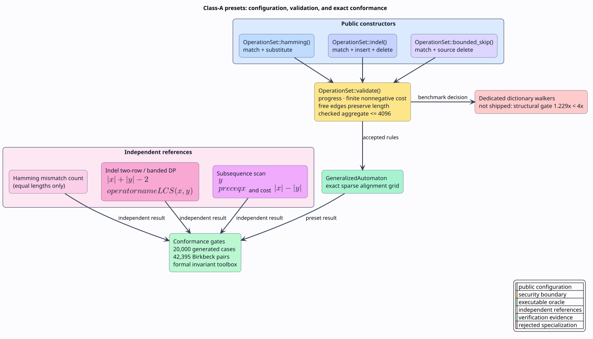

# Class-A alignment presets

**Status:** implemented · **Scope:** exact string distances and a generalized
alignment oracle · **Dictionary-walker decision:** rejected by the frozen
Phase-0 benchmark

Hamming distance, insertion/deletion distance, and bounded-skip subsequence
matching differ only in which alignment edges are available. They are
therefore **Class A** measures: configurations of `OperationSet`, not new lazy
automaton variants.



## 1. Vocabulary and orientation

Let $`x`$ be the source string, $`y`$ the target string, and $`|x|`$ the
number of Unicode scalar values in $`x`$. An operation is a tuple
$`\langle t^x,t^y,t^w\rangle`$: it consumes $`t^x`$ source scalars and
$`t^y`$ target scalars at non-negative cost $`t^w`$.

| Preset | Operations `(source, target, cost)` | Exact meaning |
|---|---|---|
| `OperationSet::hamming()` | match `(1,1,0)`, substitute `(1,1,1)` | mismatch count when lengths agree; undefined otherwise |
| `OperationSet::indel()` | match `(1,1,0)`, insert `(0,1,1)`, delete `(1,0,1)` | minimum insertion/deletion count; substitution costs two |
| `OperationSet::bounded_skip()` | match `(1,1,0)`, delete `(1,0,1)` | $`y`$ is a subsequence of $`x`$; cost is skipped source length |

“Bounded skip” is directional. `accepts("crate", "cat")` can succeed at cost
2, while reversing the arguments cannot. It supplies structural subsequence
matching only. It does not implement fzf bonuses, gains, ranking, or top-$`k`$
selection.

## 2. Mathematical contracts

### 2.1 Hamming

For equal-length strings, Hamming distance is:

```math
d_H(x,y)=\sum_{i=1}^{|x|}[x_i\ne y_i].
```

The Rust API returns `None` when $`|x|\ne|y|`$; Hamming is a metric on each
fixed-length space, not on the disjoint union with an invented finite
cross-length cost. This distinction is executable:
$`d_{\mathrm{Lev}}(\texttt{abc},\texttt{bca})=2`$, while
$`d_H(\texttt{abc},\texttt{bca})=3`$.

### 2.2 Insertion/deletion distance

Let $`\operatorname{LCS}(x,y)`$ denote longest-common-subsequence length.
Every retained common symbol avoids one deletion and one insertion, hence:

```math
d_I(x,y)=|x|+|y|-2\operatorname{LCS}(x,y).
```

Consequently $`||x|-|y||\le d_I(x,y)\le |x|+|y|`$, and $`d_I(x,y)`$ has
the same parity as $`||x|-|y||`$. The reference implementation uses two rows
and $`\mathcal{O}(\min(|x|,|y|))`$ memory. Its thresholded form evaluates
only the diagonals that can still fit budget $`k`$.

### 2.3 Bounded skip

Write $`y\preceq x`$ when $`y`$ is a subsequence of $`x`$. Then:

```math
d_S(x,y)=
\begin{cases}
|x|-|y|, & y\preceq x,\\
\top, & \text{otherwise}.
\end{cases}
```

The generalized API represents $`\top`$ as `None`. Because insertion is
absent, no alignment can create a target scalar that was not encountered in
source order.

## 3. Public API and Unicode boundary

```rust
use liblevenshtein::distance::{hamming_distance, indel_distance};
use liblevenshtein::transducer::generalized::GeneralizedAutomaton;
use liblevenshtein::transducer::OperationSet;

assert_eq!(hamming_distance("abc", "bca"), Some(3));
assert_eq!(hamming_distance("abc", "ab"), None);
assert_eq!(indel_distance("a", "b"), 2);

let skip = GeneralizedAutomaton::try_with_operations(
    2,
    OperationSet::bounded_skip(),
)?;
assert_eq!(skip.scaled_distance("crate", "cat")?, Some(2));
# Ok::<(), Box<dyn std::error::Error>>(())
```

The string APIs count Unicode scalar values. They do not normalize canonical
equivalents: `"é"` is one scalar, while `"e\u{301}"` is two. Applications that
need grapheme or normalization semantics must transform inputs explicitly.

## 4. Validation and fail-closed evaluation

`OperationSet::validate()` is the boundary for generated or untrusted rule
collections. It rejects:

1. a `(0,0)` operation, because it cannot progress through the acyclic grid;
2. negative or non-finite weights;
3. a zero-weight length-changing operation;
4. checked-overflow in aggregate consumption; and
5. aggregate $`\sum_t(t^x+t^y)>4096`$.

The aggregate ceiling bounds per-cell rule-slice work as well as obviously
pathological arities. `GeneralizedAutomaton::try_with_operations` validates
eagerly. Fallible evaluation validates again to protect the infallible legacy
constructor path; Boolean compatibility methods fail closed.

The built-in presets satisfy validation by construction. Empty sets also
validate: they describe a relation containing only the empty-to-empty
alignment and are not a resource risk.

## 5. Why there are no dedicated dictionary walkers

The Phase-0 experiment compared specialized Hamming and indel walkers with an
honest baseline over the complete frozen matrix
$`k\in\{0,1,2,3\}`$, dictionary sizes $`10^3,10^4,10^5`$, and query
lengths $`4,8,16`$. Runtime exceeded the two-times threshold, but structural
edge reduction was only `1.229` times, below the required four-times threshold.
The compound shipping rule therefore rejected both walkers.

That result keeps the API honest: direct distance functions provide compact
references, while `GeneralizedAutomaton` supplies exact operation-driven
acceptance. No Class-A preset is silently routed through the standard
dictionary `QueryIterator`, whose unit-cost completion assumptions differ.
The [historical experiment ledger](../scientific-ledger/degenerate-metric-walkers-2026-07-31.md)
is append-only.

## 6. Complexity and operational limits

| API | Time | Extra memory |
|---|---:|---:|
| `hamming_distance` | $`\mathcal{O}(\lvert x\rvert)`$ | $`\mathcal{O}(1)`$ |
| `indel_distance` | $`\mathcal{O}(\lvert x\rvert\lvert y\rvert)`$ | $`\mathcal{O}(\min(\lvert x\rvert,\lvert y\rvert))`$ |
| `indel_distance_bounded` | $`\mathcal{O}(k\min(\lvert x\rvert,\lvert y\rvert))`$ in the retained band | $`\mathcal{O}(\lvert y\rvert)`$ |
| generalized preset | reachable-cell bound from the generalized grid | $`\mathcal{O}(R)`$ for $`R`$ reached cells |

The bounded indel implementation handles empty sides before entering the
band. This is a correctness boundary: an all-deletion or all-insertion path at
exact budget must not be lost merely because there is no interior DP cell.

## 7. Verification map

The proof obligations intentionally become executable generated invariants:

| Obligation | Formal evidence | Executable evidence |
|---|---|---|
| Hamming fixed-length identity, symmetry, and triangle law | Rocq, Dafny, Verus, SMT | equal-length metric proptest |
| indel reversal/composition, length and parity bounds | Rocq, Dafny, Verus, SMT | metric and length/parity proptests |
| bounded-skip direction and exact skip count | Rocq, Dafny, SMT, TLA+ | subsequence three-way proptest |
| operation progress and aggregate resource ceiling | Rocq, Dafny, Verus, SMT, TLA+ | generated valid/invalid set properties |
| preset = explicit operations = independent reference | alignment definitions plus finite TLC model | 20,000 generated cases and 42,395 Birkbeck pairs |

See the [literate algorithms](../algorithms/15-class-a-presets/README.md),
[resource guidance](../security/resource-exhaustion.md), and
[verification index](../verification/README.md).

## 8. References

- R. W. Hamming, “Error detecting and error correcting codes,” *Bell System
  Technical Journal* 29(2), 147–160 (1950).
  [DOI 10.1002/j.1538-7305.1950.tb00463.x](https://doi.org/10.1002/j.1538-7305.1950.tb00463.x).
- R. A. Wagner and M. J. Fischer, “The string-to-string correction problem,”
  *Journal of the ACM* 21(1), 168–173 (1974).
  [DOI 10.1145/321796.321811](https://doi.org/10.1145/321796.321811).
