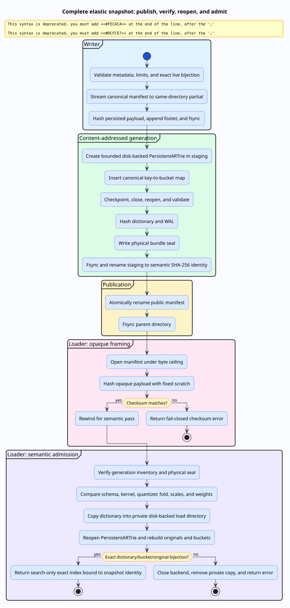

# Complete elastic snapshots

A complete elastic snapshot is a crash-durable exact-search artifact. It binds
the quantized dictionary language to every full-precision collision member and
to every configuration value that gives those bytes meaning. The public
snapshot identity names canonical logical content; a separate generation seal
authenticates the physical `PersistentARTrie` files realizing that content.

This distinction matters because checkpoints contain operational details such
as write-ahead-log (WAL) records and checkpoint times, so their bytes are not a
canonical experiment identity. Conversely, a manifest alone is not an exact
index because it lacks the durable dictionary traversal graph.



## Vocabulary and layout

A **manifest** is the canonical, insertion-order-independent serialization of
the schema, kernel, quantizer, fold-local metadata, stable IDs, quantized keys,
and full-precision originals. A **semantic identity** is the SHA-256 digest of
the manifest payload. A **generation** is the immutable directory named by
that identity. A **physical seal** binds the semantic identity to the lengths
and SHA-256 digests of the trie data file and WAL. A **working copy** is the
private disk-backed trie opened search-only for one loaded index.

```text
index.snapshot
.index.snapshot.elastic-generations/
  SEMANTIC-SHA256/
    manifest.snapshot
    dictionary.part
    dictionary.wal
    bundle.seal
  .load-PID-N/
    dictionary.part
    dictionary.wal
```

The load directory exists only while its backend is alive. Its owner closes
the trie before removing it. Old generations are retained because safe garbage
collection requires a separate reader-lease protocol.

## API sketch

The `persistent-artrie` feature enables the complete bundle. Publication starts
from the ordinary mutable in-memory index; loading returns the same exact search
surface with a search-only persistent dictionary type:

```rust
use liblevenshtein::time_series::elastic::ElasticTransducer;
use liblevenshtein::time_series::{
    ElasticSnapshotLimits, ElasticSnapshotMetadata, MsmConfig, MsmKernel,
    QuantizationConfig,
};

let quantizer = QuantizationConfig::for_u8(0.0, 100.0);
let mut index: ElasticTransducer<MsmKernel, u64> =
    ElasticTransducer::new(quantizer.clone(), MsmConfig::new(1.0));
index.try_insert(7, &[10.0, 20.0])?;

let metadata = ElasticSnapshotMetadata::try_new(
    "training-fold-3",
    "commit=0123456789abcdef;lock=sha256:feedface;rust=1.95.0",
    vec![2.0],
    vec![1.0],
)?;
let limits = ElasticSnapshotLimits {
    max_manifest_bytes: 16 * 1024 * 1024,
    max_bundle_bytes: 1024 * 1024 * 1024,
    max_entries: 100_000,
    max_series_len: 100_000,
    max_total_samples: 10_000_000,
    max_backend_memory_bytes: 8 * 1024 * 1024,
};
let identity = index.write_complete_snapshot_with_limits(
    "index.snapshot",
    &metadata,
    limits,
)?;
let loaded = ElasticTransducer::<MsmKernel, u64>::load_complete_snapshot_with_limits(
    "index.snapshot",
    &quantizer,
    index.kernel(),
    &metadata,
    limits,
)?;
assert_eq!(loaded.identity, identity);
assert_eq!(loaded.index.search_range(&[10.0, 20.0], 0.0), vec![(7, 0.0)]);

# Ok::<(), Box<dyn std::error::Error>>(())
```

## Two identities, two claims

Let $`M`$ be the canonical manifest payload, $`D`$ the checkpointed dictionary
file, and $`W`$ its WAL. The semantic identity is:

```math
h = \operatorname{SHA256}(M).
```

The fixed-size seal records:

```math
S = \bigl(h, |D|, \operatorname{SHA256}(D), |W|,
          \operatorname{SHA256}(W)\bigr).
```

The seal has its own SHA-256 footer. Thus a loader rejects physical corruption
before asking `PersistentARTrie` to interpret storage. SHA-256 follows
[FIPS PUB 180-4](https://csrc.nist.gov/pubs/fips/180-4/upd1/final); tests pin
standard vectors and differential chunk boundaries.

The formal model treats digest equality as equality of hashed bytes. SHA-256
collision resistance and file-system atomicity are explicit trusted platform
boundaries, not theorems about Rust.

## Publication algorithm

Publication follows a same-file-system, publish-last protocol:

```text
PUBLISH(index, public_path, metadata, limits):
  validate metadata, limits, and the exact live bijection
  sort all stable IDs using fallible storage
  stream canonical payload to a same-directory partial manifest
  flush; hash bytes actually written; append checksum; fsync

  if generation(identity) is absent:
    create a same-directory staging directory
    create a bounded disk-backed PersistentARTrie
    insert the canonical key-to-bucket map
    checkpoint; close; reopen; verify values and cardinality; close
    hash regular components; write and fsync bundle.seal
    fsync and rename staging to generation(identity)
  else:
    verify the existing sealed generation completely

  atomically rename the partial manifest to public_path; fsync parent
```

The generation exists before the manifest can name it. A crash may leave an
unreferenced generation or staging directory, but cannot publish a manifest
naming an unfinished generation. Concurrent equal-content writers converge on
one identity; readers observe a complete old or new manifest.

## Checksum-before-semantics loading

Loading uses two manifest passes. The first treats the payload as opaque:

```text
VERIFY_FRAME(file, limits):
  reject size above max_manifest_bytes
  reject a file shorter than the checksum footer
  hash exactly file_size - footer_size bytes with fixed scratch
  read footer; require EOF; compare digests; rewind
```

Only then may the second pass read magic, lengths, UTF-8, kernel words,
quantizer values, metadata, IDs, or samples. A stale-checksum corruption cannot
select a large allocation or masquerade as a configuration error.

After configuration agreement, the loader verifies the generation seal and
physical hashes, copies sealed trie files to a private working directory, and
calls `PersistentARTrie::open_with_buffer_pool_size`. Originals and buckets are
rebuilt with fallible reservations and checked against the reopened trie.

The admission boundary rejects every ambiguous condition rather than turning it
into an empty exact result:

| Condition | Outcome before index escape |
|---|---|
| Oversized manifest, bundle, entry set, series, or total samples | `ResourceLimit` |
| Failed bounded reservation | `AllocationFailed` |
| Manifest or physical-component digest mismatch | `ChecksumMismatch` |
| Schema, kernel, quantizer, fold, scale, or weight mismatch | `ConfigurationMismatch` |
| Symlink, missing/extra component, duplicate ID, wrong key, or broken bijection | format/key error |
| Backend open, checkpoint, sync, or read failure | I/O error |

## Exact bijection invariant

Let $`O`$ be stored stable IDs, $`B`$ nonempty collision buckets, $`T`$
dictionary terminals, and $`q(x)`$ the key of original $`x`$. Validity means:

```math
O = \biguplus_{b\in B} b,
\qquad
T = \{q(x)\mid x\in O\},
\qquad
b_k = \{x\in O\mid q(x)=k\}.
```

Validation checks both directions of every `(bucket, slot)` location, finite
samples, exact requantization, one terminal per nonempty bucket, contiguous
canonical bucket IDs, and terminal cardinality equal to active buckets.
Cardinality plus every expected lookup rules out extra terminals without
materializing a second dictionary. Extra terminals, duplicate members, wrong
locations, nonfinite samples, and wrong keys fail closed.

## Resource and stack bounds

`ElasticSnapshotLimits` separates manifest bytes, bundle bytes, entry count,
per-series samples, total samples, and backend resident memory. Arithmetic is
checked before use; length fields are checked against local ceilings and bytes
remaining before `try_reserve_exact`.

The persistent backend has an explicit fallible page-pool constructor. It
zeroes 256-KiB pages in their final heap allocation, avoiding a page-sized
stack temporary. For page size $`P`$ and pool count $`n`$:

```math
R_{\mathrm{pages}} = nP
\le \mathtt{max\_backend\_memory\_bytes}.
```

Hashing uses fixed 16-KiB scratch. A release gate publishes, checkpoints,
reopens, validates, and drops colliding 100,000-sample keys on a 128-KiB stack.
The limits do not claim to bound allocator bookkeeping or OS page-cache state.

## Mutability, verification, and claim boundary

The immutable generation is never opened as a mutable public index. Loading
opens a private disk-backed copy only because the storage engine requires a
writable handle, but its wrapper implements the read-only dictionary boundary,
not the atomic-mutation boundary. Consequently, insertion is unavailable on a
loaded snapshot index at the type level and `snapshot_identity()` remains bound
to its verified generation. To mutate contents, callers construct a live
`DynamicDawg`-backed index and publish a new complete snapshot.

This distinction is necessary because a durable trie update may become visible
before a later commit-bookkeeping failure is reported. Only backends satisfying
the stronger no-visible-change-on-error law expose transactional `try_insert`:

```math
\operatorname{try\_insert}(D,k,v)=\operatorname{Err}(e)
\Longrightarrow D_{\mathrm{after}}=D_{\mathrm{before}}.
```

Insertion permutation preserves byte-identical identity. Changing an original
bit, ID, kernel, quantizer, fold, provenance, scale, or weight changes it.

The assumption-free Rocq file `ElasticSnapshot.v` proves abstract phase
ordering and finite key-bijection cardinality. The TLA+ module
`ElasticSnapshotPublication.tla` explores checksum failure, decode, staging,
sealing, publication, and crash. Rust tests establish correspondence through
corruption, bounded-length, bijection, genuine reopen, concurrency, identity,
and constrained-stack gates.

These are named proof islands. They do **not** prove SHA-256 collision
resistance, POSIX rename behavior, `PersistentARTrie`, the whole snapshot
implementation, or the entire MSM implementation correct.
