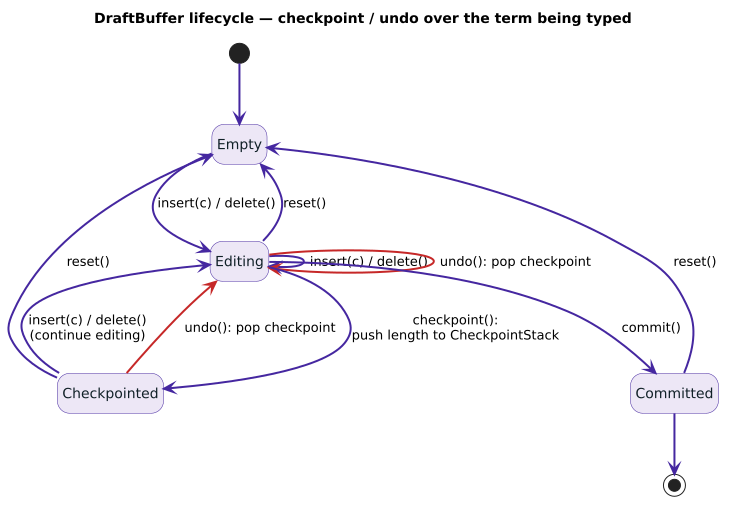

# Contextual Completion API Design

[← Documentation Index](../README.md)

## Document Status
- **Status**: Design Approved
- **Parent**: [contextual-completion-zipper.md](./contextual-completion-zipper.md)
- **Created**: 2025-10-31
- **Last Updated**: 2025-10-31

## Overview

This document provides the complete API specification for the Contextual Completion Engine, including all public types, traits, methods, and usage examples.



## Core Types

### ContextId

```rust
/// Unique identifier for a lexical scope context
pub type ContextId = u32;

/// Special context IDs
pub const GLOBAL_CONTEXT: ContextId = 0;
pub const NO_CONTEXT: ContextId = u32::MAX;
```

### Completion

```rust
/// A completion candidate with metadata
#[derive(Debug, Clone, PartialEq, Eq)]
pub struct Completion {
    /// The completed term
    pub term: String,

    /// Edit distance from query
    pub distance: usize,

    /// Whether this is a draft (non-finalized) term
    pub is_draft: bool,

    /// Contexts where this term is visible
    pub contexts: Vec<ContextId>,
}

impl Completion {
    /// Create completion for finalized term
    pub fn finalized(term: String, distance: usize, contexts: Vec<ContextId>) -> Self {
        Completion {
            term,
            distance,
            is_draft: false,
            contexts,
        }
    }

    /// Create completion for draft term
    pub fn draft(term: String, distance: usize, context: ContextId) -> Self {
        Completion {
            term,
            distance,
            is_draft: true,
            contexts: vec![context],
        }
    }
}

impl Ord for Completion {
    fn cmp(&self, other: &Self) -> Ordering {
        // Sort by: distance (asc), draft status (finalized first), term (asc)
        self.distance.cmp(&other.distance)
            .then(self.is_draft.cmp(&other.is_draft))
            .then(self.term.cmp(&other.term))
    }
}
```

### Checkpoint

```rust
/// A saved state for undo/redo operations
#[derive(Debug, Clone, Copy, PartialEq, Eq, Hash)]
pub struct Checkpoint {
    /// Internal checkpoint ID
    id: u64,

    /// Context this checkpoint belongs to
    context: ContextId,

    /// Position in draft buffer when checkpoint was created
    position: usize,
}

impl Checkpoint {
    /// Check if checkpoint is valid (not expired)
    pub fn is_valid(&self) -> bool;

    /// Get context this checkpoint belongs to
    pub fn context(&self) -> ContextId;
}
```

## Main API: ContextualCompletionEngine

### Construction

```rust
/// Engine for contextual code completion with concurrent read-write
pub struct ContextualCompletionEngine {
    // Internal fields (private)
}

impl ContextualCompletionEngine {
    /// Create new engine with default configuration
    pub fn new() -> Self {
        Self::with_algorithm(Algorithm::Standard)
    }

    /// Create engine with specific Levenshtein algorithm
    pub fn with_algorithm(algorithm: Algorithm) -> Self {
        // Initialize with PathMapDictionary<Vec<ContextId>>
        let dict = PathMapDictionary::new();
        let transducer = Transducer::new(dict, algorithm);

        ContextualCompletionEngine {
            transducer,
            drafts: Arc::new(DashMap::new()),
            context_tree: Arc::new(RwLock::new(ContextTree::new())),
            checkpoints: Arc::new(DashMap::new()),
            checkpoint_counter: Arc::new(AtomicU64::new(0)),
        }
    }

    /// Create engine from existing dictionary
    pub fn from_dictionary<D>(dict: D, algorithm: Algorithm) -> Self
    where
        D: MappedDictionary<Value = Vec<ContextId>>,
    {
        // Convert existing dictionary to PathMapDictionary
        // (may require migration step)
    }
}
```

### Context Management

```rust
impl ContextualCompletionEngine {
    /// Create a new context with optional parent
    ///
    /// # Arguments
    /// * `context` - Unique context ID
    /// * `parent` - Parent context for hierarchical visibility (None for root)
    ///
    /// # Returns
    /// Ok(()) if context created, Err if context already exists
    pub fn create_context(
        &self,
        context: ContextId,
        parent: Option<ContextId>
    ) -> Result<()> {
        let mut tree = self.context_tree.write().unwrap();
        tree.insert(context, parent)
    }

    /// Remove a context and all its children
    ///
    /// This will discard any draft terms and checkpoints in the context.
    /// Finalized terms remain in the dictionary.
    pub fn remove_context(&self, context: ContextId) -> Result<()> {
        // Remove from tree
        let mut tree = self.context_tree.write().unwrap();
        let removed_contexts = tree.remove_subtree(context)?;
        drop(tree);

        // Clean up drafts and checkpoints
        for ctx in removed_contexts {
            self.drafts.remove(&ctx);
            self.checkpoints.retain(|_, cp: &Checkpoint| cp.context != ctx);
        }

        Ok(())
    }

    /// Get all ancestor contexts (parent, grandparent, etc.)
    pub fn get_ancestors(&self, context: ContextId) -> Vec<ContextId> {
        let tree = self.context_tree.read().unwrap();
        tree.ancestors(context)
    }

    /// Get all visible contexts (self + ancestors)
    pub fn get_visible_contexts(&self, context: ContextId) -> Vec<ContextId> {
        let mut visible = vec![context];
        visible.extend(self.get_ancestors(context));
        visible
    }
}
```

### Character-Level Insertion

```rust
impl ContextualCompletionEngine {
    /// Insert a character into the draft buffer for this context
    ///
    /// # Arguments
    /// * `context` - Context to insert into
    /// * `ch` - Character to insert
    ///
    /// # Returns
    /// Ok(current_buffer) with updated draft term, or Err if context doesn't exist
    pub fn insert_char(&self, context: ContextId, ch: char) -> Result<String> {
        // Verify context exists
        {
            let tree = self.context_tree.read().unwrap();
            if !tree.contains(context) {
                return Err(Error::ContextNotFound(context));
            }
        }

        // Insert into draft buffer
        let mut entry = self.drafts.entry(context)
            .or_insert_with(|| DraftBuffer::new(context));

        entry.push(ch);
        Ok(entry.to_string())
    }

    /// Insert multiple characters at once
    pub fn insert_str(&self, context: ContextId, s: &str) -> Result<String> {
        for ch in s.chars() {
            self.insert_char(context, ch)?;
        }
        self.get_draft(context)
    }

    /// Get current draft buffer content
    pub fn get_draft(&self, context: ContextId) -> Result<String> {
        self.drafts.get(&context)
            .map(|entry| entry.to_string())
            .ok_or(Error::NoDraft(context))
    }

    /// Check if context has an active draft
    pub fn has_draft(&self, context: ContextId) -> bool {
        self.drafts.contains_key(&context)
    }
}
```

### Character-Level Rollback

```rust
impl ContextualCompletionEngine {
    /// Remove the last character from draft buffer (backspace)
    ///
    /// # Returns
    /// Ok(Some(remaining_buffer)) if character removed,
    /// Ok(None) if buffer is now empty,
    /// Err if no draft exists
    pub fn rollback_char(&self, context: ContextId) -> Result<Option<String>> {
        let mut entry = self.drafts.get_mut(&context)
            .ok_or(Error::NoDraft(context))?;

        entry.pop();

        if entry.is_empty() {
            drop(entry);
            self.drafts.remove(&context);
            Ok(None)
        } else {
            Ok(Some(entry.to_string()))
        }
    }

    /// Remove N characters from draft buffer
    pub fn rollback_n(&self, context: ContextId, n: usize) -> Result<Option<String>> {
        for _ in 0..n {
            self.rollback_char(context)?;
        }

        if self.has_draft(context) {
            Ok(Some(self.get_draft(context)?))
        } else {
            Ok(None)
        }
    }

    /// Clear entire draft buffer
    pub fn clear_draft(&self, context: ContextId) -> Result<()> {
        self.drafts.remove(&context);
        Ok(())
    }
}
```

### Checkpoint-Based Undo/Redo

```rust
impl ContextualCompletionEngine {
    /// Create a checkpoint at current draft position
    ///
    /// Checkpoints enable undo/redo operations beyond simple character rollback.
    /// Each checkpoint captures the draft buffer state at the time of creation.
    ///
    /// # Returns
    /// Checkpoint handle for later restoration
    pub fn checkpoint(&self, context: ContextId) -> Result<Checkpoint> {
        let position = self.drafts.get(&context)
            .map(|entry| entry.len())
            .unwrap_or(0);

        let id = self.checkpoint_counter.fetch_add(1, Ordering::SeqCst);

        let checkpoint = Checkpoint {
            id,
            context,
            position,
        };

        self.checkpoints.insert(id, checkpoint);
        Ok(checkpoint)
    }

    /// Restore draft buffer to a previous checkpoint
    ///
    /// This will truncate the draft buffer to the position saved in the checkpoint.
    /// Characters added after the checkpoint are discarded.
    ///
    /// # Arguments
    /// * `checkpoint` - Previously created checkpoint
    ///
    /// # Returns
    /// Ok(restored_buffer) or Err if checkpoint is invalid/expired
    pub fn restore(&self, checkpoint: Checkpoint) -> Result<String> {
        // Verify checkpoint exists
        let cp = self.checkpoints.get(&checkpoint.id)
            .ok_or(Error::InvalidCheckpoint)?;

        if cp.context != checkpoint.context {
            return Err(Error::CheckpointContextMismatch);
        }

        let position = cp.position;
        drop(cp);

        // Restore draft buffer to checkpoint position
        if position == 0 {
            self.clear_draft(checkpoint.context)?;
            Ok(String::new())
        } else {
            let mut entry = self.drafts.get_mut(&checkpoint.context)
                .ok_or(Error::NoDraft(checkpoint.context))?;

            entry.truncate(position);
            Ok(entry.to_string())
        }
    }

    /// Remove a checkpoint (e.g., when committing changes)
    pub fn remove_checkpoint(&self, checkpoint: Checkpoint) -> Result<()> {
        self.checkpoints.remove(&checkpoint.id);
        Ok(())
    }

    /// Get all checkpoints for a context
    pub fn get_checkpoints(&self, context: ContextId) -> Vec<Checkpoint> {
        self.checkpoints.iter()
            .filter(|entry| entry.value().context == context)
            .map(|entry| *entry.value())
            .collect()
    }
}
```

### Finalization

```rust
impl ContextualCompletionEngine {
    /// Finalize current draft as a permanent term
    ///
    /// The draft buffer becomes a finalized term in the dictionary,
    /// associated with the specified contexts for visibility filtering.
    ///
    /// # Arguments
    /// * `context` - Context with active draft
    /// * `visible_in` - List of contexts where term should be visible
    ///
    /// # Returns
    /// Ok(finalized_term) or Err if no draft exists
    pub fn finalize(
        &self,
        context: ContextId,
        visible_in: Vec<ContextId>
    ) -> Result<String> {
        // Remove draft
        let (_key, buffer) = self.drafts.remove(&context)
            .ok_or(Error::NoDraft(context))?;

        let term = buffer.to_string();

        // Insert into dictionary
        self.transducer.dictionary()
            .insert_with_value(&term, visible_in)?;

        // Clean up checkpoints
        self.checkpoints.retain(|_, cp| cp.context != context);

        Ok(term)
    }

    /// Finalize a specific term (not from draft)
    ///
    /// Useful for bulk loading or programmatic insertion.
    pub fn finalize_direct(
        &self,
        _context: ContextId,  // For API consistency
        term: &str,
        visible_in: Vec<ContextId>
    ) -> Result<()> {
        self.transducer.dictionary()
            .insert_with_value(term, visible_in)?;
        Ok(())
    }

    /// Discard draft without finalizing
    pub fn discard(&self, context: ContextId) -> Result<String> {
        let (_key, buffer) = self.drafts.remove(&context)
            .ok_or(Error::NoDraft(context))?;

        // Clean up checkpoints
        self.checkpoints.retain(|_, cp| cp.context != context);

        Ok(buffer.to_string())
    }
}
```

### Querying with Hierarchical Visibility

```rust
impl ContextualCompletionEngine {
    /// Query for completions with hierarchical context filtering
    ///
    /// Returns fuzzy matches from:
    /// 1. Finalized terms visible in any of the specified contexts
    /// 2. Draft terms from contexts in the visibility list
    ///
    /// # Arguments
    /// * `query` - Partial term to complete
    /// * `max_distance` - Maximum edit distance for fuzzy matching
    /// * `visible_contexts` - List of contexts to search (typically self + ancestors)
    ///
    /// # Returns
    /// Sorted list of completion candidates (by distance, then term)
    pub fn complete(
        &self,
        query: &str,
        max_distance: usize,
        visible_contexts: &[ContextId],
    ) -> Vec<Completion> {
        // Query finalized terms with context filtering
        let finalized = self.query_finalized(query, max_distance, visible_contexts);

        // Query draft terms
        let drafts = self.query_drafts(query, max_distance, visible_contexts);

        // Merge and deduplicate
        self.merge_completions(finalized, drafts)
    }

    /// Query only finalized terms (no drafts)
    pub fn complete_finalized(
        &self,
        query: &str,
        max_distance: usize,
        visible_contexts: &[ContextId],
    ) -> Vec<Completion> {
        self.query_finalized(query, max_distance, visible_contexts)
    }

    /// Query only draft terms (no finalized)
    pub fn complete_drafts(
        &self,
        query: &str,
        max_distance: usize,
        visible_contexts: &[ContextId],
    ) -> Vec<Completion> {
        self.query_drafts(query, max_distance, visible_contexts)
    }

    // Internal query methods

    fn query_finalized(
        &self,
        query: &str,
        max_distance: usize,
        visible_contexts: &[ContextId],
    ) -> Vec<Completion> {
        let visible_set: HashSet<_> = visible_contexts.iter().copied().collect();

        self.transducer
            .query_filtered(query, max_distance, |term_contexts: &Vec<ContextId>| {
                term_contexts.iter().any(|ctx| visible_set.contains(ctx))
            })
            .map(|candidate| Completion::finalized(
                candidate.term,
                candidate.distance,
                candidate.value.unwrap_or_default(),
            ))
            .collect()
    }

    fn query_drafts(
        &self,
        query: &str,
        max_distance: usize,
        visible_contexts: &[ContextId],
    ) -> Vec<Completion> {
        let visible_set: HashSet<_> = visible_contexts.iter().copied().collect();
        let query_bytes = query.as_bytes();

        self.drafts.iter()
            .filter(|entry| {
                // Check if draft context is visible
                let draft_context = entry.value().context;
                visible_set.contains(&draft_context) || {
                    // Check if any ancestor is visible (hierarchical visibility)
                    let ancestors = self.get_ancestors(draft_context);
                    ancestors.iter().any(|ctx| visible_set.contains(ctx))
                }
            })
            .filter_map(|entry| {
                let draft = entry.value();
                let term = draft.to_string();
                let distance = levenshtein_distance(query_bytes, term.as_bytes());

                if distance <= max_distance {
                    Some(Completion::draft(term, distance, draft.context))
                } else {
                    None
                }
            })
            .collect()
    }

    fn merge_completions(
        &self,
        finalized: Vec<Completion>,
        drafts: Vec<Completion>,
    ) -> Vec<Completion> {
        let mut seen = HashSet::new();
        let mut results = Vec::new();

        // Add finalized first (prefer finalized over drafts in deduplication)
        for comp in finalized {
            if seen.insert(comp.term.clone()) {
                results.push(comp);
            }
        }

        // Add drafts (only if term not already seen)
        for comp in drafts {
            if seen.insert(comp.term.clone()) {
                results.push(comp);
            }
        }

        // Sort by distance, draft status, then term
        results.sort();
        results
    }
}
```

## Transducer Integration

### Extension Methods

```rust
impl<D> Transducer<D>
where
    D: MappedDictionary<Value = Vec<ContextId>>,
{
    /// Create a contextual completion engine from this transducer
    ///
    /// Note: This requires the dictionary to use `Vec<ContextId>` as its value type.
    pub fn contextual_engine(self) -> ContextualCompletionEngine {
        ContextualCompletionEngine {
            transducer: self,
            drafts: Arc::new(DashMap::new()),
            context_tree: Arc::new(RwLock::new(ContextTree::new())),
            checkpoints: Arc::new(DashMap::new()),
            checkpoint_counter: Arc::new(AtomicU64::new(0)),
        }
    }

    /// Create a zipper-based query iterator (internal optimization)
    ///
    /// This is used internally by ContextualCompletionEngine for efficient queries.
    pub(crate) fn query_with_zipper(
        &self,
        query: &str,
        max_distance: usize,
    ) -> ZipperQueryIterator<D> {
        // Create dictionary zipper
        let dict_zipper = D::create_zipper(self.dictionary());

        // Create automaton zipper
        let auto_zipper = AutomatonZipper::new(
            query.as_bytes(),
            max_distance,
            self.algorithm(),
        );

        // Create intersection zipper
        let root = IntersectionZipper::new(dict_zipper, auto_zipper);

        // Create iterator
        ZipperQueryIterator::new(root)
    }
}
```

## Internal Types (for completeness)

### DraftBuffer

```rust
/// Buffer for character-level insertion with rollback support
struct DraftBuffer {
    /// Context this buffer belongs to
    context: ContextId,

    /// Characters in insertion order
    chars: VecDeque<char>,

    /// Creation timestamp
    created_at: Instant,
}

impl DraftBuffer {
    fn new(context: ContextId) -> Self {
        DraftBuffer {
            context,
            chars: VecDeque::new(),
            created_at: Instant::now(),
        }
    }

    fn push(&mut self, ch: char) {
        self.chars.push_back(ch);
    }

    fn pop(&mut self) -> Option<char> {
        self.chars.pop_back()
    }

    fn truncate(&mut self, len: usize) {
        self.chars.truncate(len);
    }

    fn len(&self) -> usize {
        self.chars.len()
    }

    fn is_empty(&self) -> bool {
        self.chars.is_empty()
    }

    fn to_string(&self) -> String {
        self.chars.iter().collect()
    }
}
```

### ContextTree

```rust
/// Hierarchical tree of contexts for visibility resolution
struct ContextTree {
    /// Map: context -> parent context
    parents: HashMap<ContextId, Option<ContextId>>,

    /// Map: context -> children contexts
    children: HashMap<ContextId, HashSet<ContextId>>,
}

impl ContextTree {
    fn new() -> Self {
        let mut tree = ContextTree {
            parents: HashMap::new(),
            children: HashMap::new(),
        };

        // Insert root context
        tree.parents.insert(GLOBAL_CONTEXT, None);
        tree
    }

    fn insert(&mut self, context: ContextId, parent: Option<ContextId>) -> Result<()> {
        if self.parents.contains_key(&context) {
            return Err(Error::ContextAlreadyExists(context));
        }

        if let Some(p) = parent {
            if !self.parents.contains_key(&p) {
                return Err(Error::ParentContextNotFound(p));
            }

            self.children.entry(p).or_default().insert(context);
        }

        self.parents.insert(context, parent);
        Ok(())
    }

    fn contains(&self, context: ContextId) -> bool {
        self.parents.contains_key(&context)
    }

    fn ancestors(&self, context: ContextId) -> Vec<ContextId> {
        let mut ancestors = Vec::new();
        let mut current = self.parents.get(&context).and_then(|p| *p);

        while let Some(parent) = current {
            ancestors.push(parent);
            current = self.parents.get(&parent).and_then(|p| *p);
        }

        ancestors
    }

    fn remove_subtree(&mut self, context: ContextId) -> Result<Vec<ContextId>> {
        if !self.parents.contains_key(&context) {
            return Err(Error::ContextNotFound(context));
        }

        let mut removed = vec![context];
        let mut queue = vec![context];

        while let Some(ctx) = queue.pop() {
            if let Some(children) = self.children.remove(&ctx) {
                for child in children {
                    removed.push(child);
                    queue.push(child);
                }
            }

            self.parents.remove(&ctx);
        }

        Ok(removed)
    }
}
```

## Error Types

```rust
#[derive(Debug, thiserror::Error)]
pub enum Error {
    #[error("Context {0} not found")]
    ContextNotFound(ContextId),

    #[error("Context {0} already exists")]
    ContextAlreadyExists(ContextId),

    #[error("Parent context {0} not found")]
    ParentContextNotFound(ContextId),

    #[error("No draft found for context {0}")]
    NoDraft(ContextId),

    #[error("Invalid checkpoint")]
    InvalidCheckpoint,

    #[error("Checkpoint context mismatch")]
    CheckpointContextMismatch,

    #[error("Dictionary error: {0}")]
    Dictionary(String),
}

pub type Result<T> = std::result::Result<T, Error>;
```

## Usage Examples

### Basic Completion

```rust
use liblevenshtein::prelude::*;

let engine = ContextualCompletionEngine::new();

// Create context hierarchy
engine.create_context(GLOBAL_CONTEXT, None)?;
engine.create_context(1, Some(GLOBAL_CONTEXT))?;

// Add some finalized terms
engine.finalize_direct(GLOBAL_CONTEXT, "print", vec![GLOBAL_CONTEXT])?;
engine.finalize_direct(1, "parse", vec![1])?;

// User types in context 1
engine.insert_char(1, 'p')?;
engine.insert_char(1, 'r')?;

// Get completions (sees both global and module-level terms)
let completions = engine.complete("pr", 1, &[GLOBAL_CONTEXT, 1]);

for comp in completions {
    println!("{} (distance: {}, draft: {})",
        comp.term, comp.distance, comp.is_draft);
}
```

### Undo/Redo Support

```rust
// User typing with undo support
let context = 42;
engine.create_context(context, Some(GLOBAL_CONTEXT))?;

// Type some characters
engine.insert_str(context, "hello")?;
let cp1 = engine.checkpoint(context)?;

// Type more
engine.insert_str(context, "world")?;
let cp2 = engine.checkpoint(context)?;

// Undo to first checkpoint
engine.restore(cp1)?;
assert_eq!(engine.get_draft(context)?, "hello");

// Redo to second checkpoint
engine.restore(cp2)?;
assert_eq!(engine.get_draft(context)?, "helloworld");

// Backspace
engine.rollback_char(context)?;
assert_eq!(engine.get_draft(context)?, "helloworl");
```

### Hierarchical Scopes

```rust
// Setup: global -> module -> class -> function
engine.create_context(0, None)?;  // global
engine.create_context(1, Some(0))?;  // module
engine.create_context(10, Some(1))?;  // class
engine.create_context(100, Some(10))?;  // function

// Add terms at different levels
engine.finalize_direct(0, "print", vec![0])?;  // global
engine.finalize_direct(1, "parse", vec![1])?;  // module
engine.finalize_direct(10, "self", vec![10])?;  // class
engine.finalize_direct(100, "local_var", vec![100])?;  // function

// Query from function scope
let visible = engine.get_visible_contexts(100);
// visible = [100, 10, 1, 0]

let completions = engine.complete("p", 1, &visible);
// Results: print, parse (not self or local_var)
```

## Thread Safety

All public methods are thread-safe:

```rust
let engine = Arc::new(ContextualCompletionEngine::new());

// Multiple threads can insert in different contexts
let handles: Vec<_> = (0..10)
    .map(|i| {
        let engine = Arc::clone(&engine);
        std::thread::spawn(move || {
            engine.create_context(i, Some(GLOBAL_CONTEXT)).unwrap();
            engine.insert_str(i, &format!("term{}", i)).unwrap();
            engine.finalize(i, vec![i]).unwrap();
        })
    })
    .collect();

for handle in handles {
    handle.join().unwrap();
}

// Multiple threads can query concurrently
let query_handles: Vec<_> = (0..10)
    .map(|_| {
        let engine = Arc::clone(&engine);
        std::thread::spawn(move || {
            engine.complete("term", 1, &[0, 1, 2, 3, 4, 5, 6, 7, 8, 9])
        })
    })
    .collect();

for handle in query_handles {
    let results = handle.join().unwrap();
    assert_eq!(results.len(), 10);
}
```
