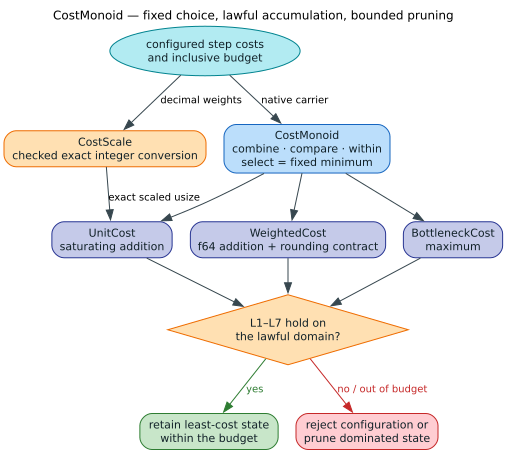

# Ordered cost-monoid design

**Status:** implemented · **Feature boundary:** core API, always available

This document specifies the cost algebra shared by bounded dynamic programs.
It defines the laws used for pruning, the exact decimal scaling seam, the
floating-point trust boundary, and the evidence that checks each claim.



*`select` is fixed to minimum. A caller may choose how path steps accumulate,
but may not replace the ordering or turn this interface into a semiring.*

## 1. Scope and terminology

A **carrier** is the Rust value type used for a cost. A **step cost** is the
cost of one operation. An **accumulated cost** combines every step on a path. A
**budget** is an inclusive upper bound. `TOP` is the distinguished unreachable
value and is absorbing under accumulation.

`CostMonoid` supports bounded dynamic programming with four operations:

| Operation | Meaning |
|---|---|
| `combine(accumulated, step)` | Append a step to a path |
| `compare(a, b)` | Total order used by pruning and queues |
| `within(cost, threshold)` | Inclusive budget test |
| `select(a, b)` | Choose the lesser operand under `compare` |

The trait is deliberately narrower than a semiring. `select` is provided once
by the trait and cannot be overridden. There is no configurable path-choice
operator, Kleene star, division, or residual. Algorithms that need those
operations belong in the external WFST layer, not this bounded-DP seam.

## 2. Laws

For lawful costs $`a`$, $`b`$, and $`c`$, lawful non-negative step cost $`w`$,
and budget $`k`$, every implementation must satisfy:

| Law | Obligation |
|---|---|
| L1 — monoid | `combine` is associative and `ZERO` is a two-sided identity |
| L2 — monotonicity | Combining the same operand preserves order on either side |
| L3 — totality | `compare` is reflexive, antisymmetric, transitive, and total |
| L4 — positive order | $`w \ge 0`$ |
| L5 — coherent choice | `select(a, b)` is exactly the lesser operand |
| L6 — downward closure | $`a\le b\land b\le k\Longrightarrow a\le k`$ |
| L7 — absorption | `combine(TOP, a) = combine(a, TOP) = TOP` |

L4 is partly a caller obligation because Rust cannot encode “finite,
non-negative `f64`” as the carrier type without a wrapper. NaN, negative
values, and negative infinity are outside the floating carriers' lawful
domain. `within` rejects NaN defensively, and all configuration-to-fixed-point
conversion rejects non-finite or negative values.

### Why these laws justify pruning

Suppose two paths reach the same dynamic-programming state with $`a\le b`$.
For every future step $`w`$, L2 gives:

```math
\operatorname{combine}(a,w)\le\operatorname{combine}(b,w).
```

Repeating that argument over the remaining path proves that the dearer state
cannot later become cheaper. L5 therefore permits retaining only the selected
path. L6 permits pruning a state once every possible retained cost is outside
the budget. L7 prevents an unreachable path from re-entering the search.

## 3. Implementations

| Type | Carrier | `combine` | `ZERO` | `TOP` | Intended use |
|---|---|---|---|---|---|
| `UnitCost` | `usize` | saturating addition | `0` | `usize::MAX` | ordinary edit counts and exact fixed-point weights |
| `WeightedCost` | `f64` | addition | `0.0` | positive infinity | elastic or learned additive costs |
| `BottleneckCost` | `f64` | maximum | `0.0` | positive infinity | minimax and discrete Fréchet-style paths |

Saturating unsigned addition remains associative, monotone, and top-absorbing.
Maximum is associative and monotone over the lawful floating domain.
`f64::total_cmp` supplies deterministic ordering without weakening the rule
that NaN is not a lawful cost.

### 3.1 IEEE-754 boundary

Binary floating-point addition is not exactly associative for arbitrary
operands. Consequently, `WeightedCost` has two deliberately separate claims:

1. Rocq proves L1 and L2 over non-negative mathematical reals with an explicit
   infinity constructor.
2. Rust property tests require bit-exact associativity on exactly
   representable dyadic inputs and a forward-error envelope on general finite
   inputs.

For three finite inputs, the executable envelope is:

```math
\lvert (a+b)+c-(a+(b+c))\rvert
\le 4\epsilon_{64}\max(1,a+b+c).
```

The machine-checked Flocq statement keeps the binary64 constants symbolic.
Let `$`u=u_{\mathrm{ro}}/(1+u_{\mathrm{ro}})`$` be Flocq's
round-to-nearest relative bound and let `$`\eta=2^{-1075}`$` be half the
smallest subnormal quantum. For non-negative inputs, it proves:

```math
\left|\operatorname{fl}(\operatorname{fl}(a+b)+c)-
\operatorname{fl}(a+\operatorname{fl}(b+c))\right|
\le (4u+2u^2)\max(1,a+b+c)+(2u+4)\eta.
```

This theorem uses Flocq's unbounded-exponent FLT rounding model. The Rust
property requires both evaluated parenthesizations to remain finite, which is
the executable overflow boundary needed to apply that model to `f64`. Its
generator samples raw non-negative finite binary64 bit patterns across normal,
subnormal, and extreme exponents rather than only a small decimal range.

Code that requires exact equality, stable hashing of path totals, or exact
subsumption must use `UnitCost` with `CostScale`. `EPSILON = 10^{-9}` affects
only the inclusive budget predicate; `compare` remains a true total order.

## 4. Exact decimal scaling

`CostScale` maps a configured decimal weight to an exact `usize` numerator.
The denominator is either explicit or the checked least common multiple of all
reduced operation-weight denominators. The represented value is:

```math
w=\frac{\operatorname{scaled}(w)}{\operatorname{denominator}}.
```

The input `f64` is first rendered with Rust's shortest round-tripping decimal
representation. That decimal—not the full binary expansion—is reduced as a
rational. This makes common configuration values such as `0.15` scale to
exactly $`15/100`$, while retaining deterministic behavior for programmatic
inputs.

The API never truncates or rounds. It returns `ScaleError` for:

- a zero denominator;
- NaN, infinity, or a negative weight;
- a required denominator larger than `u32`;
- a weight not exactly representable by an explicitly selected scale; or
- least-common-multiple, multiplication, or target-`usize` overflow.

The default denominator is 1,000 for explicit thousandths-based APIs. A scale
derived with `for_operations` may be smaller. Callers must derive one scale for
the complete operation set and use that same value for operation costs,
budgets, state costs, and result presentation.

```rust
use liblevenshtein::cost::CostScale;

let scale = CostScale::for_weights([1.0, 0.15, 0.125])?;
assert_eq!(scale.denominator(), 40);
assert_eq!(scale.to_scaled(0.15)?, 6);
assert_eq!(scale.to_scaled(0.125)?, 5);
# Ok::<(), liblevenshtein::cost::ScaleError>(())
```

## 5. Why the integer and weighted positions remain separate

`CostMonoid` does not imply that every state carrying a cost has the same
representation. The integer `Position` has a 24-byte hot-path contract and six
typed continuation kinds, including a one-byte true-Damerau delta and two
affine-gap layers. `PositionF64` has a floating cost, epsilon-aware comparisons,
and one Boolean continuation flag. It cannot encode those extra state machines.

Phase 11 therefore rejected a whole-struct generic collapse. The accepted
fallback shares only the Standard/OSA/MergeSplit subsumption decision tree in
`src/cost/subsumption.rs`. The internal `SubsumptionCost` extension supplies
the two arithmetic facts that are not monoid operations:

- whether accumulated realignment fits inside the cost slack; and
- whether one cost is strictly lower under the carrier's tolerance.

`UnitCost` uses exact subtraction and integer scaling. `WeightedCost` preserves
the existing `EPSILON = 10^{-9}` formula. Generated properties compare both
helper instantiations to independent legacy formulas. Rocq proves the
carrier-generic structural factoring, Verus checks the Rust-shaped integer
relation, and Z3 plus cvc5 independently reject both integer and real-valued
counterexamples.

This boundary prevents a source-deduplication goal from silently changing
layout, public fields, continuation languages, or floating-point behavior. See
the [Phase 11 ledger](../scientific-ledger/f64-family-collapse-gate-2026-08-02.md).

## 6. Resource and security properties

Cost conversion is a boundary operation, not a hot-loop operation. Every
power, least-common multiple, product, and integer conversion is checked. A
malicious exponent or a collection of pairwise denominators therefore returns
an error rather than wrapping, allocating proportional memory, or silently
changing the cost model. Search kernels must also guard `cost + step` before
using it as an index or budget comparison.

## 7. Verification and executable correspondence

| Evidence | Checked claim |
|---|---|
| `core/theories/Conformance/CostMonoid.v` | Assumption-free real-model L1/L2/L3/L4/L6/L7 for additive and bottleneck costs |
| `core/theories/Conformance/WeightedCostFloat.v` | Flocq binary64 round-to-nearest-even error components and composed finite-result reassociation envelope |
| `verus/cost_monoid.rs` | Exact integer associativity/monotonicity, bottleneck laws, and scale divisibility |
| `smt/cost_monoid.smt2` | Bounded counterexample search for saturation, monotonicity, `TOP`, maximum, and overflow guards in Z3 and cvc5 |
| `tests/cost_monoid_laws.rs` | 2,000-case properties for all laws, scale round trips, NaN handling, and the floating rounding boundary |
| `core/theories/Conformance/SubsumptionFallback.v` | Carrier-generic equivalence between the shared and legacy per-mode subsumption organization |
| `verus/subsumption_fallback.rs` | Rust-shaped exact-unit factoring and mixed-OSA incomparability |
| `smt/subsumption_fallback.smt2` | Independent integer and epsilon-real equivalence checks in Z3 and cvc5 |
| `src/cost/subsumption.rs` properties | Generated exact comparison against independent unit and weighted legacy formulas |

The formal models do not claim that arbitrary IEEE-754 addition is exact.
That limitation is part of the contract and is tested directly rather than
hidden behind a real-number proof.

## 8. Change discipline

Adding a carrier requires all of the following in the same change:

1. state the lawful domain and `TOP` representation;
2. prove or explicitly bound L1–L7;
3. translate the proof obligations into property tests;
4. document overflow, NaN, and conversion behavior; and
5. keep `select` inherited from `CostMonoid`.

Changing the selection rule, adding closure/division, or composing weights
from independent machines is an architectural change to the WFST layer and is
not an extension of this trait.
