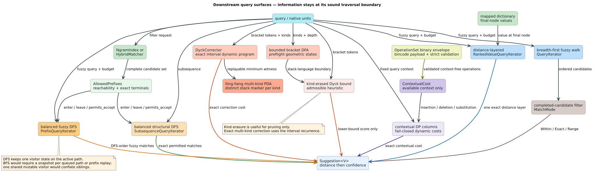

# Downstream query surfaces

**Status:** implemented · **Scope:** prefix-pruned subsequence traversal,
value-aware ranking, deterministic binary operation-set persistence, bounded
and exact bracket languages, and context-dependent costs

The downstream APIs share one design rule: add a new traversal only when the
information needed for correctness is unavailable in an existing iterator.
That rule produces balanced depth-first-search (DFS) visitors, one
distance-layered ranked iterator, one completed-candidate `MatchMode` adapter,
and one separate contextual dynamic program. The distinction between the
existing breadth-first-search (BFS) iterator and the new DFS fuzzy iterator is
part of the public contract: they have equal unpruned result sets but different
orders, state ownership, and memory bounds.



## 1. Vocabulary and decisions

A **dictionary prefix** is the sequence of units on a root-to-node path. A
**terminal** is a prefix whose node represents a stored term. A **distance
layer** contains all results at one exact edit distance. A **contextual cost**
is an edit cost that may depend on already available query and dictionary
units. A **Dyck word** is a properly nested bracket word.

| Request | Decision | Public surface |
|---|---|---|
| prune dictionary subtrees using an external scorer/filter | ship on explicitly named DFS traversals | `PrefixPruner<U>`, `AllowedPrefixes<U>`, `PrefixQueryIterator` |
| unbounded skipped-unit subsequence search | ship as an explicit-stack DFS | `SubsequenceQueryIterator<N,P>` |
| rank mapped terms by frequency-like values | ship without a new dictionary trait | `Suggestion<V>`, `SuggestionScorer<V>`, `RankedValueQueryIterator` |
| exact/range match-mode selector | ship as requested ergonomic sugar, without a speed claim | `MatchMode`, `Transducer::query_mode` |
| persist a complete `OperationSet` | choose optimized Rust or portable binary persistence | `OperationSet::{to_binary,from_binary,to_protobuf,from_protobuf}` |
| exact correction to a multi-kind Dyck language | ship exact interval correction and a pushdown bridge | `DyckCorrector`, `DyckCorrection`, lling-llang `exact_dyck_correction` |
| context-dependent edit rules | ship separately | `ContextualCost<U>`, `ContextualQueryIterator` |

## 2. Balanced prefix pruning

### 2.1 Why the visitor is stateful

Incremental filters commonly maintain a dynamic-programming column for the
current root-to-node path. Entering an edge pushes one column; leaving it pops
that column. The protocol is therefore:

```rust
pub trait PrefixPruner<U: CharUnit> {
    fn enter(&mut self, unit: U, depth: usize) -> bool;
    fn leave(&mut self, unit: U, depth: usize);
    fn permits_accept(&mut self, prefix: &[U]) -> bool { true }
    fn accept(&mut self, prefix: &[U]) -> Option<f64> { None }
}
```

`enter` and `leave` are balanced even when `enter` rejects the edge. This
allows a visitor to push state, inspect it, reject, and pop unconditionally.
The executable invariant is:

```math
E_t-L_t=operatorname{depth}_t,
```

where `$`E_t`$` and `$`L_t`$` count callbacks through traversal event `$`t`$`.
At completion, depth is zero and therefore `$`E=L`$`.

### 2.2 Reachability is not membership

`AllowedPrefixes` stores two sets:

- every prefix of every source-filter candidate, for subtree reachability; and
- the exact candidate terms, for terminal membership.

The separation is necessary. The empty prefix reaches every non-empty allowed
term, but it is not itself allowed unless the source filter returned the empty
term. A generated test found precisely this boundary: the root was previously
accepted when the filter excluded `""`. `permits_accept` now enforces exact
membership independently of the optional score returned by `accept`.

For an allowed term set `$`A`$`, the retained prefix set is:

```math
P(A)=\{p\mid \exists a\in A,\;\exists s,\;a=p\mathbin{\|}s\}.
```

Rejecting `$`p\notin P(A)`$` is sound because no descendant can belong to
`$`A`$`. `NgramIndex::prefix_pruner` and `HybridMatcher::prefix_pruner` build
this downward-closed set from their complete candidate lists.

### 2.3 Why a shared mutable visitor is not wired into standard BFS

The standard `QueryIterator` is breadth-first. Its queue interleaves unrelated
root-to-node paths, so a single mutable stack cannot represent the context of
the node being popped. For example, after root edges `a` and `b` are enqueued,
the visitor cannot be simultaneously in prefix states `a` and `b`. Leaving `a`
before enqueueing `b` discards the state needed when `a` is later popped;
retaining `a` while entering `b` incorrectly constructs state `ab`.

This is not evidence that BFS is impossible. It distinguishes five valid
designs and their contracts:

| Design | Correct? | Time | Live visitor state | Consequence |
|---|---:|---:|---:|---|
| one shared enter/leave stack on BFS | no | — | one stack | conflates sibling prefixes |
| stateless prefix predicate | yes | `$`\mathcal{O}(1)`$` per edge after indexing | one predicate | cannot express incremental dynamic-programming scorers |
| clone a visitor snapshot into every queued node | yes | clone cost per retained edge | proportional to BFS frontier width | requires a cloneable/snapshot trait and potentially large memory |
| replay the root-to-node prefix when a node is popped | yes | `$`\mathcal{O}(d)`$` per node at depth `$`d`$` | one scratch visitor | repeats scorer work and needs retained prefixes |
| explicit DFS with one balanced visitor | yes | one enter and leave per visited edge | proportional to key depth | changes traversal and result order |

The original plan correctly observed the shared-stack incompatibility, but a
later table said to thread the same visitor through BFS `queue_children`. Those
statements cannot both hold. The implementation resolves the contradiction by
keeping `QueryIterator` as BFS and adding a separately named fuzzy DFS.

### 2.4 Prefix-pruned fuzzy DFS

`PrefixQueryIterator<N,S,P>` stores one dictionary node and one Levenshtein
state per active DFS frame. A child is visited only when both gates succeed:

1. the external `PrefixPruner` permits the child prefix; and
2. the Levenshtein transition has at least one state within the edit budget.

`PrefixQueryStats` reports the two forms of pruning separately. If iteration
stops early, destruction or `into_pruner` unwinds the remaining stack, so every
successful `enter` still has exactly one `leave`. With `NoPruning`, a generated
property checks equality of `(term, distance)` maps against BFS for Standard,
optimal-string-alignment transposition, Merge-and-Split, and unrestricted
Damerau–Levenshtein. Equality of sets does not imply equality of order: the
DFS surface yields dictionary order, while ordered queries yield distance
layers.

## 3. Subsequence DFS

For query `$`q`$` and dictionary term `$`w`$`, the iterator accepts exactly
when `$`q\preceq w`$`. Each stack frame stores the dictionary node, remaining
edges, the number of matched query units, and the entering label. On edge
`$`u`$`:

```math
m'=m+[m<|q|\land u=q_m].
```

Greedy matching is complete for subsequences: consuming the earliest possible
equal unit leaves a suffix containing every embedding available after any
later equal unit. Dictionary skips are unbounded, while memory is linear in
the maximum visited key depth. Results preserve native units, including
`u64`; no text conversion is required.

## 4. Value-aware ranking

`MappedDictionaryNode::value()` already exposes a final node's value during
traversal. A `FrequencyDictionary` subtrait would duplicate that contract and
encourage a second lookup. Instead, `SuggestionScorer<V>` derives confidence
from the generic stored value:

```rust
pub trait SuggestionScorer<V> {
    fn confidence(&self, term: &str, distance: usize, value: &V) -> f64;
}
```

The total result order is:

```math
(d_1,c_1,t_1)\prec(d_2,c_2,t_2)
\iff d_1<d_2
\lor(d_1=d_2\land(c_1>c_2\lor(c_1=c_2\land t_1<t_2))).
```

Distance is primary and cannot be traded for confidence. Only the current
distance layer is materialized, scored, and sorted; `.take(k)` never
materializes result strings or values from a later layer. Non-finite scorer
output is normalized to negative infinity so ordering remains total and
deterministic. `LogFrequencyScorer` uses `$`\ln(1+f)`$` for numeric frequency
values; applications can retain arbitrary value types by supplying a scorer.

### 4.1 Match modes are candidate filters, not prefix lower bounds

`MatchMode::Within(maximum)`, `Exact(distance)`, and
`Range { min_distance, max_distance }` select completed candidates from
`query_ordered`. The maximum configures the underlying automaton budget. A
minimum cannot soundly prune a prefix: extending a prefix can increase,
decrease, or preserve its eventual terminal distance. Consequently, `Exact`
and the lower end of `Range` skip completed candidates only. An inverted range
returns `MatchModeError::InvalidRange`; it is never silently normalized.

## 5. Deterministic binary `OperationSet` persistence

`OperationType` owns its diagnostic name and carries an explicit
`OperationApplicability`: unrestricted, equality-only, adjacent transpose, or
a listed substitution set. Applicability never depends on a name such as
`"transpose"`; renaming an operation is semantics-preserving, and a zero-cost
listed operation does not silently become equality.

The Rust-native persistence envelope begins with the eight-byte magic
`LLEVOPS\0`, a version, flags, and a declared payload length. Version 1 requires
zero flags and exact payload consumption. The portable protobuf representation
uses the V1 arm of `OperationSetContainer`; unknown fields remain compatible,
but missing/unknown container versions are rejected. It stores weight bits in
a `fixed64` field rather than relying on language-specific floating-point text
conversion.

Both decoders require semantic validation and caller-selectable limits for
payload bytes, operation count, operation-name bytes, substitution-pair counts,
and pair text bytes. The protobuf path enforces those limits in a non-allocating
wire preflight before `prost` builds collections. Substitution pairs are emitted
in canonical order while the declared operation order is retained because tie
behavior may depend on it.

The API deliberately has no text persistence path. Large dictionaries and
operation tables make text encodings operationally impractical. Bincode is the
optimized Rust representation; protobuf is the portable binary interchange
format used by dictionary and operation-set persistence. Compression may wrap
either binary format without creating another semantic format. Gzip can reduce
repeated binary structure, but adds CPU and removes direct random access, so it
is an explicit, measured policy choice.

## 6. Bracket languages and the projection bound

Opening kind `$`r`$` is token `$`r`$`; its closing token is `$`k+r`$`. An exact
bounded-depth DFA state is the complete stack word. For `$`k`$` bracket kinds
and maximum depth `$`D`$`, its state count is:

```math
N(k,D)=\sum_{d=0}^{D}k^d.
```

Construction computes that sum with saturating arithmetic before allocating
and rejects `$`N(k,D)>4096`$`. Thus `$`N(3,10)=88{,}573`$` fails with a typed,
informative error. `SmallDfaStateSet` is a dynamically sized bit vector, so the
4,096-state public policy is also the representation limit.

Let `$`\pi`$` erase bracket kinds while preserving opening versus closing. It is
length-preserving and maps every kind-sensitive Dyck word into the one-kind
Dyck language. Mapping an edit script through `$`\pi`$` cannot increase its
cost, so:

```math
d_{D_1}(\pi(w))\le d_{D_k}(w).
```

After a one-kind scan leaves `$`o`$` unmatched opens and `$`c`$` unmatched
closes, the exact projected distance is:

```math
h(w)=\left\lceil\frac{o}{2}\right\rceil+
     \left\lceil\frac{c}{2}\right\rceil.
```

This remains an admissible lower bound, not the exact multi-kind answer.
`DyckCorrector` supplies that exact answer with an `$`\mathcal{O}(kn^3)`$`
interval program and a replayable minimum-cost witness. lling-llang supplies a
distinct-stack-marker PDA and bridge API for grammar pipelines. See the
dedicated [Dyck theorem and algorithm note](grammar-correction/dyck-projection-lower-bound.md).

## 7. Context-dependent edit costs

### 7.1 Information boundary

At one trie edge the iterator knows:

| Context | Available? | Source |
|---|---|---|
| query left/current/right | yes | fixed query vector |
| dictionary left | yes | descended prefix |
| dictionary current | yes | current edge |
| dictionary right | no | the next edge has not been selected |

`EditContext::dictionary_right()` therefore always returns `None`. A rule that
needs arbitrary dictionary lookahead is not expressible on this traversal.
`EnglishSoftC` correctly keys its discount from **query** right context;
`PositionalSilentE` demonstrates a query-position rule.

### 7.2 Separate dynamic program

Context invalidates the context-free characteristic vector because an equality
or cost decision can vary by query position and prefix. The opt-in iterator
therefore computes a full DP column on each descended edge:

```math
C_i=\min(P_i+\iota_i,\;C_{i-1}+\delta_i,\;P_{i-1}+\sigma_i),
```

where `$`P`$` is the parent column and `$`\iota_i,\delta_i,\sigma_i`$` are
contextual insertion, deletion, and substitution costs. `None`, a negative
value, NaN, or infinity makes that operation unreachable. If every cell is
over budget, the subtree is pruned.

`min_nonzero_cost()` must be finite and strictly positive. The current
iterator performs no cross-state subsumption; the declaration is an admission
contract for safe future realignment. If two positions `$`i,j`$` were compared
with cost slack `$`s`$`, the necessary guard would be:

```math
|i-j|c_{\min}\le s.
```

Requiring the bound now prevents a future optimization from silently assuming
one. `OperationCostsF64` is the context-free adapter and is differentially
tested against `QueryIteratorF64`.

### 7.3 Measured cost, not guessed cost

The pinned pgmcp experiment 158 compared equivalent standard costs on one
Threadripper core. The control `QueryIteratorF64` mean was 1,802,404 ns and the
contextual treatment mean was 1,184,158 ns for the frozen 10,000-term arm. The
preregistered expectation of overhead was refuted on this workload; the
treatment gate was accepted with `$`p=4.59\times10^{-56}`$` and Cohen's
`$`d=-11.45`$`. This does **not** establish a general speed advantage: the two
iterators have different state representations, and context-heavy rules can do
more work.

## 8. Verification and test map

| Contract | Machine-checked model | Executable invariant |
|---|---|---|
| subsequence reflexivity and suffix extension | Rocq | flat reference equality |
| balanced DFS callbacks and exact terminal membership | Rocq, Dafny, Verus, SMT, TLA+ | counted visitor and allowed-set intersection |
| rank order antisymmetry | Rocq, Dafny, Verus, SMT | multiset equality and window ordering |
| kind erasure never increases script cost | Rocq, Dafny, Verus, Z3, cvc5 | brute-force bounded Dyck comparison |
| bracket geometric resource guard | Rocq, Dafny, Verus, Z3, cvc5 | `$`k=3,D=10`$` example and randomized inputs |
| contextual realignment symmetry | Rocq, Dafny, Verus, Z3, cvc5 | arithmetic property plus iterator differential |
| traversal event/state safety | TLA+ | callback accounting and fail-closed cost test |
| real-data applicability | — | 42,395 Birkbeck pairs and 128 ranked queries |

The formal files specify the mathematical and state-machine obligations; they
are not a proof about the compiled Rust binary. Cross-validation binds them to
Rust through matching 2,000-case properties, examples, backend tests, and saved
regressions. See the [formal manifest](../verification/FORMAL_VERIFICATION_MANIFEST.tsv)
and [scientific ledger](../scientific-ledger/downstream-query-surfaces-2026-08-02.md).

## 9. References

- R. A. Wagner and M. J. Fischer, “The string-to-string correction problem,”
  *Journal of the ACM* 21(1), 168–173 (1974).
  [DOI 10.1145/321796.321811](https://doi.org/10.1145/321796.321811).
- E. Ukkonen, “Algorithms for approximate string matching,” *Information and
  Control* 64(1–3), 100–118 (1985).
  [DOI 10.1016/S0019-9958(85)80046-2](https://doi.org/10.1016/S0019-9958(85)80046-2).
