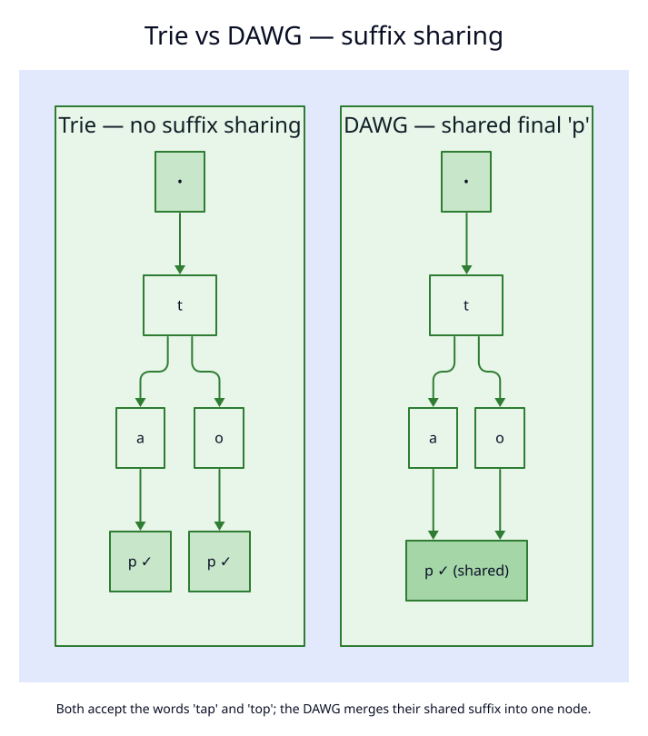

# Dynamic DAWG Implementation

[← Documentation Index](../README.md)

## Overview

The `DynamicDawg` provides a **mutable DAWG** (Directed Acyclic Word Graph) that supports online insertions, deletions, and batch operations while maintaining near-minimal structure.



## Key Features

### ✅ Online Modifications
- **Insert**: Add terms dynamically - `$\mathcal{O}(m)$` per term
- **Delete**: Remove terms dynamically - `$\mathcal{O}(m)$` per term
- **Batch operations**: `extend()` and `remove_many()` with automatic compaction

### ✅ Minimality Management
- **Compact**: Restore perfect minimality - `$\mathcal{O}(n)$` total size
- **Smart tracking**: `needs_compaction()` flag after deletions
- **Near-minimal**: Structure stays efficient between compactions

### ✅ Thread Safety
- Uses `Arc<...>` internally (the lock-free `LockFreeDawg` core) for concurrent access
- Lock-free reads (readers never block); writers publish new nodes via `compare_exchange` (CAS)
- Same safety guarantees as `PathMapDictionary`

## API Reference

### Construction

```rust
use liblevenshtein::prelude::*;

// Empty DAWG
let dawg = DynamicDawg::new();

// From iterator
let dawg = DynamicDawg::from_iter(vec!["test", "testing"]);
```

### Single Operations

```rust
// Insert (returns true if new)
dawg.insert("apple");

// Remove (returns true if existed)
dawg.remove("banana");

// Check status
println!("Terms: {}", dawg.term_count());
println!("Nodes: {}", dawg.node_count());
println!("Needs compaction: {}", dawg.needs_compaction());
```

### Batch Operations

```rust
// Manual batch with explicit compaction
dawg.insert("term1");
dawg.insert("term2");
dawg.remove("term3");
// ... many more operations ...
let nodes_removed = dawg.compact(); // Restore minimality

// Automatic batch methods
let added = dawg.extend(vec!["term1", "term2"]);
let removed = dawg.remove_many(vec!["old1", "old2"]);
```

### Compaction and Minimization

DynamicDawg provides two methods for restoring minimality:

#### `compact()` - Full Rebuild

```rust
// Explicit compaction (extracts, sorts, rebuilds, minimizes)
let nodes_removed = dawg.compact();

// Check if needed
if dawg.needs_compaction() {
    dawg.compact();
}
```

**When to use**:
- After many deletions (flag will be set)
- When you want to ensure optimal structure
- Equivalent to rebuilding from sorted terms

#### `minimize()` - Incremental Minimization

```rust
// Minimize without full rebuild
let nodes_merged = dawg.minimize();

// Can be called anytime
dawg.minimize();
```

**When to use**:
- After batch insertions
- When you want minimization without rebuilding
- No assumptions about insertion order
- Potentially faster for localized updates

**Key Differences**:
- `compact()`: Extracts all terms, sorts them, rebuilds from scratch, then minimizes
- `minimize()`: Computes node signatures, merges equivalent nodes in-place
- Both achieve perfect minimality
- `minimize()` is generally more efficient for incremental updates

## Performance Characteristics

| Operation | Time Complexity | Notes |
|-----------|----------------|-------|
| `insert(term)` | `$\mathcal{O}(m)$` | `$m$` = term length |
| `remove(term)` | `$\mathcal{O}(m)$` | May leave orphaned nodes |
| `compact()` | `$\mathcal{O}(n \log n + n \cdot s)$` | `$n$` = terms, `$s$` = signature size |
| `minimize()` | `$\mathcal{O}(n \cdot s)$` | `$n$` = nodes, `$s$` = signature size |
| `extend(terms)` | `$\mathcal{O}(n \log n + n \cdot s)$` | Includes compaction |
| `remove_many(terms)` | `$\mathcal{O}(n \log n + n \cdot s)$` | Includes compaction |

## Space Efficiency

- **After insertions**: Minimal (suffix sharing maintained)
- **After deletions**: 1.0x to ~1.5x minimal (worst case)
- **After compaction**: Perfectly minimal

## When to Use

### ✅ Use DynamicDawg When:
- Dictionary changes frequently
- Real-time updates required
- Periodic compaction acceptable
- **Examples**: Live spell checker, autocomplete, user dictionaries

### ❌ Use Static DAWG When:
- Dictionary is fixed
- Maximum space efficiency critical
- No updates after construction
- **Examples**: Embedded systems, read-only dictionaries

## Best Practices

### 1. Batch Operations
```rust
// ❌ Bad: Compact after every change
dawg.insert("term1");
dawg.compact();  // Expensive!
dawg.insert("term2");
dawg.compact();  // Expensive!

// ✅ Good: Batch then compact once
dawg.insert("term1");
dawg.insert("term2");
// ... more operations ...
dawg.compact();

// ✅ Best: Use batch methods
dawg.extend(vec!["term1", "term2", ...]);
```

### 2. Minimization Strategy

```rust
// Strategy 1: Use minimize() for batch insertions
fn batch_insert(dawg: &DynamicDawg, terms: Vec<String>) {
    for term in terms {
        dawg.insert(&term);
    }
    dawg.minimize(); // Incremental minimization
}

// Strategy 2: Use compact() after deletions
fn batch_update(dawg: &DynamicDawg, updates: Vec<Update>) {
    for update in updates {
        match update {
            Update::Add(term) => dawg.insert(&term),
            Update::Remove(term) => dawg.remove(&term),
        };
    }
    if dawg.needs_compaction() {
        dawg.compact(); // Full rebuild after deletions
    } else {
        dawg.minimize(); // Incremental for insertions
    }
}

// Strategy 3: Periodic minimization
let mut ops_since_minimize = 0;
for term in terms {
    dawg.insert(term);
    ops_since_minimize += 1;

    if ops_since_minimize >= 1000 {
        dawg.minimize(); // Or compact() if deletions occurred
        ops_since_minimize = 0;
    }
}

// Strategy 4: Let the flag guide you
fn maybe_optimize(dawg: &DynamicDawg) {
    if dawg.needs_compaction() {
        dawg.compact(); // Use full rebuild
    } else {
        dawg.minimize(); // Use incremental
    }
}
```

### 3. Integration with Transducer

```rust
// DynamicDawg works seamlessly with fuzzy search
let dawg = DynamicDawg::from_iter(vec!["test", "testing"]);
let transducer = Transducer::new(dawg.clone(), Algorithm::Standard);

// Query works immediately after updates
dawg.insert("tested");
let results: Vec<_> = transducer.query("test", 1).collect();
```

## Implementation Details

### Minimality Algorithm

The compaction process:
1. **Extract** all terms from current structure
2. **Sort** terms alphabetically
3. **Rebuild** DAWG with sorted terms (optimal suffix sharing)
4. **Clear** compaction flag

This guarantees perfect minimality after compaction.

### Why Not Always Minimal?

**Insertions**: Maintain minimality through suffix sharing
- New nodes only created when necessary
- Existing suffixes reused

**Deletions**: May create orphans
- Removing a term unmarks the final node
- Pruning only removes unreachable leaves
- Some internal nodes may become redundant

**Solution**: Periodic compaction rebuilds the entire structure.

## Comparison Matrix

| Feature | DynamicDawg | Static DAWG | PathMap |
|---------|-------------|-------------|---------|
| Insertions | ✅ `$\mathcal{O}(m)$` | ❌ No | ✅ `$\mathcal{O}(m)$` |
| Deletions | ✅ `$\mathcal{O}(m)$` | ❌ No | ✅ `$\mathcal{O}(m)$` |
| Minimality | 🟡 Near-minimal | ✅ Perfect | ❌ Not minimal |
| Compaction | ✅ Yes | N/A | N/A |
| Thread-safe | ✅ Lock-free | ✅ Immutable | ✅ Lock-free |
| Space | 🟡 Good | ✅ Excellent | 🟡 Good |

## Examples

See:
- `examples/dynamic_dawg_demo.rs` - Basic usage and comparisons
- `examples/batch_operations.rs` - Batch operation patterns

## Theoretical Background

### DAWG Minimization

A DAWG is minimal when:
1. No two nodes have identical right languages
2. No unreachable nodes exist

Our compaction achieves this by:
- Extracting all terms (defines the language)
- Rebuilding with sorted input (optimal sharing)
- Using hash-based suffix deduplication

### Time Complexity

- **Online minimal DAWG**: `$\mathcal{O}(n^2)$` worst case per operation
- **Our approach**: `$\mathcal{O}(m)$` per operation + `$\mathcal{O}(n)$` periodic compaction
- **Amortized**: `$\mathcal{O}(m)$` if compaction frequency is bounded

This trade-off makes dynamic operations practical.

## Future Enhancements

Potential optimizations:
- Incremental minimization (avoid full rebuild)
- Lazy compaction (defer until read-heavy phase)
- Adaptive compaction (based on fragmentation metrics)

See [Future Enhancements](../research/future-enhancements.md) for roadmap.
