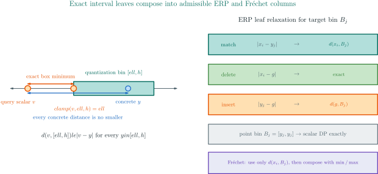
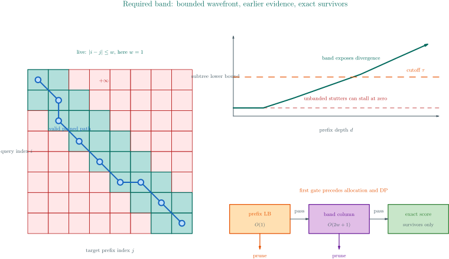

# Elastic kernels and the generic exact trie walker

This document specifies the `ElasticKernel` seam used to search a quantized
time-series trie without binding the traversal to one distance recurrence. It
defines the vocabulary, algebraic obligations, public API, safety boundary,
and verification strategy before describing the implementation.

The companion [complete elastic snapshot design](complete-elastic-snapshots.md)
specifies how a persistent exact index binds this dictionary language to every
full-precision collision original and to the configuration that gives the keys
meaning.

## 1. Vocabulary

An **elastic distance** compares two sequences while allowing the dynamic
programming (DP) path to advance through them at different rates. A **kernel**
is the measure-specific recurrence: Move-Split-Merge (MSM), edit distance with
real penalty (ERP), time-warp edit distance (TWED), discrete Fréchet, or banded
dynamic time warping (DTW). The **walker** is the measure-independent trie
algorithm that shares work between candidates with a common quantized prefix.

A **quantization bin** is a closed interval $`[\ell,h]`$ represented by one
`u8` trie edge. An **interval relaxation** replaces a step involving an unknown
concrete value $`y\in[\ell,h]`$ by the minimum step cost over the entire bin.
An **admissible lower bound** never exceeds the corresponding exact cost. A
**candidate** is a full-precision series stored at a final trie node.

The implementation is split as follows:

| Component | Responsibility |
|---|---|
| `ElasticKernel` | DP shape, interval column transition, exact scoring, query plan, candidate bound, empty-side semantics |
| `ElasticTransducer<K,V>` | quantized trie, collision buckets, originals, range DFS, best-first kNN, deterministic tie order |
| `ElasticSearchStats` | observational node, edge, column, candidate, exact-evaluation, and cutoff counters with executable accounting partitions |
| `MsmKernel` | adapter from the existing `MsmConfig` and interval MSM recurrence |
| `MsmTransducer<V>` | source-compatible alias for `ElasticTransducer<MsmKernel,V>` |
| `ErpConfig` / `ErpKernel` | ERP recurrence, interval relaxation, and gap-mass candidate bound |
| `ErpTransducer<V>` | exact ERP specialization of `ElasticTransducer<ErpKernel,V>` |
| `TwedConfig` / `TwedKernel` | complete non-negative TWED family, adjacent-bin carry, exact recurrence, and length bound |
| `MetricTwedConfig` | validated $`\nu>0`$, $`\lambda\ge0`$ witness implementing `MetricElasticKernel` |
| `TwedTransducer<V>` / `MetricTwedTransducer<V>` | exact raw-family and validated-metric TWED specializations |
| `FrechetConfig` / `FrechetKernel` | discrete Fréchet bottleneck recurrence, interval relaxation, and endpoint/Hausdorff candidate bound |
| `FrechetTransducer<V>` | exact discrete Fréchet specialization of `ElasticTransducer<FrechetKernel,V>` |
| `DtwConfig` / `DtwKernel` | required Sakoe–Chiba band, squared recurrence, interval columns, and LB_Keogh query plan |
| `DtwTransducer<V>` | exact banded-DTW specialization with root-distance public scores and squared internal costs |


## 2. Why this is a cost-monoid problem

Let $`K`$ be a totally ordered cost carrier. A path appends a step using
$`\otimes`$, while alternative paths are selected by minimum:

```math
C[i,j] = \min_{p\in\mathrm{pred}(i,j)} C[p]\otimes w(p,i,j).
```

MSM, ERP, TWED, and DTW use additive `WeightedCost`, so $`a\otimes b=a+b`$.
Discrete Fréchet uses `BottleneckCost`, so $`a\otimes b=\max(a,b)`$. The
walker calls only `CostMonoid::compare`, `within`, and the kernel transition;
it never assumes addition or exposes a configurable choice operator.

This separation is load-bearing. Prefix traversal is sound when lawful steps
are non-negative relative to the monoid identity:

```math
a \le a\otimes w.
```

Both $`a+w`$ for $`w\ge0`$ and $`\max(a,w)`$ satisfy this inflation law.
The triangle inequality is irrelevant to the proof.

## 3. The K1–K4 contract

Let $`p`$ be a trie prefix, $`B_p[i]`$ its relaxed DP column, and $`t`$
any full-precision descendant represented by that prefix.

### K1 — interval admissibility

For every row $`i`$, the relaxed cell lower-bounds the concrete cell:

```math
B_p[i] \le C_t[i,|p|].
```

Consequently the node bound $`b_p=\min_i B_p[i]`$ lower-bounds every exact
descendant distance whose path must cross that column. Each kernel proves K1
with its own interval geometry. For MSM the existing Rocq development proves
move, split, and merge box minima and lifts them to the complete column.

### K2 — inflation

Every step is at least the monoid identity and combination is monotone:

```math
0_K \le w \quad\Longrightarrow\quad a\le a\otimes w.
```

K2 prevents a deeper path from recovering below a bound that has already
exceeded the cutoff.

### K3 — exact survivors

`exact_with_cutoff(q, t, tau)` returns the exact distance whenever it is within
$`\tau`$, and returns no value below $`\tau`$ for an out-of-range candidate.
The walker never emits an interval score; it emits only this exact result.

### K4 — candidate-bound coherence

The optional full-series bound obeys

```math
\operatorname{candidateLB}(q,t) \le D(q,t).
```

Returning $`0_K`$ is valid when no stronger bound exists. This stage avoids
some exact DP evaluations but is not necessary for subtree correctness.

The resulting two-stage implication is:

```math
b_p>\tau\ \lor\ \operatorname{candidateLB}(q,t)>\tau
\quad\Longrightarrow\quad D(q,t)>\tau.
```


## 4. Trait design

The public trait uses associated types for the monoid, carry state, and query
plan:

```rust
pub trait ElasticKernel: Clone + Debug + Send + Sync + 'static {
    const IS_METRIC: bool;
    type Monoid: CostMonoid;
    type Carry: Copy + Debug + Send + Sync;
    type QueryPlan: Default + Debug + Send + Sync;

    fn column_len(&self, query_len: usize) -> Option<usize>;
    fn final_row(&self, query_len: usize) -> usize;
    fn step_column(/* previous, query, bin, carry, depth, plan, out */)
        -> (Cost<Self>, Self::Carry);
    fn prefix_lower_bound(/* query, bin, carry, depth, plan */) -> Cost<Self>;
    fn exact_with_cutoff(/* ... */) -> Option<Cost<Self>>;
    fn candidate_lower_bound(/* ... */) -> Cost<Self>;
    fn plan(&self, query: &[f64]) -> Self::QueryPlan;
    fn empty_pair_cost(&self) -> Cost<Self>;
    fn empty_vs_nonempty_cost(&self, nonempty: &[f64]) -> Cost<Self>;
}
```

Two details intentionally refine the initial design sketch:

1. `step_column` and `candidate_lower_bound` receive `&QueryPlan`. DTW can
   construct Sakoe–Chiba envelopes once in $`\mathcal{O}(m)`$ rather than once per edge.
2. `empty_vs_nonempty_cost` receives the concrete nonempty series. ERP charges
   a running $`|x_i-g|`$ cost, so no nullary constant can represent it.
3. `prefix_lower_bound` defaults to the monoid identity. DTW overrides it with
   incremental interval LB_Keogh so a constant-time gate runs before child
   column allocation and computation.
4. `IS_METRIC` makes status queryable, while the separate
   `MetricElasticKernel` marker is the compile-time prerequisite for any
   future structure whose proof actually uses the triangle inequality.

These changes make the seam elastic-measure-shaped rather than MSM-shaped.

### 4.1 Exact-workspace storage algebra and decision tags

Bounded survivor verification and online scanning share one reusable exact
point workspace. Let $`P_{\mathrm{ret}}`$ be bytes retained by the kernel query
plan, $`P_{\mathrm{peak}}`$ its construction peak, and $`F`$ the bytes in two
cost generations plus two active-row generations. The workspace values are:

```math
W_{\mathrm{ret}} = P_{\mathrm{ret}} + F,
\qquad
W_{\mathrm{peak}} =
\max\!\left(P_{\mathrm{peak}}, W_{\mathrm{ret}}\right).
```

The order is load-bearing: construct the plan first, release its transient
builder queues, and only then allocate $`F`$. A preflight rejects before either
phase unless $`W_{\mathrm{peak}}`$ is within the scratch ceiling. If later
product state retains $`S`$ bytes, the session ledger observes:

```math
\max\!\left(W_{\mathrm{peak}}, W_{\mathrm{ret}}+S\right)
=
\max\!\left(P_{\mathrm{peak}}, W_{\mathrm{ret}}+S\right).
```

Resetting between candidates changes costs, active rows, carry, and consumed
depth in place; it does not change $`W_{\mathrm{ret}}`$. Logical bytes exclude
allocator bookkeeping and capacity rounding, consistently with
`ResourceLedger`.

Exact scoring keeps structural reachability distinct from the numeric TOP
sentinel. The complete classification table is:

| Structural alignment | Cutoff | Exact observation | Result |
|---|---|---|---|
| impossible | finite or TOP | any | `NoFiniteAlignment` |
| possible | finite | finite and within | `WithinCutoff` |
| possible | finite | finite and above | `AboveCutoff` |
| possible | finite | TOP | `AboveCutoff` |
| possible | TOP | finite | `WithinCutoff` |
| possible | TOP | TOP or invalid | incomplete `NumericOverflow` |

This priority prevents a band-excluded path from being mislabeled numeric
overflow, while an unbounded cutoff never turns an ambiguous TOP into a
complete empty result. `ExactWorkspaceResources.v` proves the abstract storage
and classification laws; `proptest_exact_workspace_resources.rs` and the
bounded scalar properties establish their executable correspondence.

## 5. Literate range traversal

The convenience range algorithm maintains one column per live explicit DFS
frame. It never recurses on the process stack. The strict bounded adapter goes
further: its DFS frames carry compact `TemporalStateId` values, while sparse
canonical positions live in a paired stack arena and two query-width arrays
serve as reusable transition scratch.

**Purpose.** Visit exactly the trie subtrees whose lower bound is within the
inclusive cutoff and exact-score every viable final.

**Invariant.** Every live frame is paired with exactly one state arena entry.
That entry is the canonical K1 interval frontier for the frame's real
dictionary prefix, and its carry describes precisely the kernel context needed
by future transitions.

```text
ALGORITHM RANGE-SEARCH(query, cutoff)
  plan ← kernel.plan(query)
  if query is empty or unsupported by interval arithmetic then
      return deterministic exact scan using K4 then K3
  stateArena[0] ← canonical seed frontier
  stack ← one frame (root, depth = 0, stateId = 0)

  while stack is not empty do
      frame ← stack.last
      state ← stateArena[frame.stateId]

      if frame has an unverified viable final then
          exact-score its next collision member through K4 then K3
          continue

      if frame has an unvisited edge then
          consume that edge from the frame
          prefix_bound ← kernel.prefix_lower_bound(
              query, edge.bin, state.carry, frame.depth + 1, plan)
          if prefix_bound exceeds cutoff then continue

          reconstruct only the represented epsilon closure into scratch
          next ← kernel sparse transition, or exact dense fallback in scratch
          canonical ← remove only exact zero-input-simulation duplicates
          if canonical bound is within cutoff then
              preflight state, stack, work, and scratch ceilings
              push child frame and paired canonical state
          continue

      pop frame and its paired state together

  allocate one checked permutation of result indices
  order it by (monoid cost, discovery sequence)
  apply its cycles to the existing unique-id result vector in place
```

K1 and K2 justify the child guard. K3 justifies emission. K4 justifies the
leaf-level short circuit. Each loop either consumes one finite edge/candidate,
pushes a deeper finite dictionary frame, or pops a frame; therefore a finite
acyclic dictionary traversal terminates. The explicit stack makes dictionary
depth stack-safe, while a page budget can pause and resume the same immutable
snapshot/query/config traversal without relabelling an incomplete result as
complete.

Bounded traversal obtains every identifier from its unique private
`bucket_location`, so it cannot emit the same stored episode twice. Let $`n`$
be the number of emitted survivors and let
$`R=2n\operatorname{sizeof}(\mathtt{usize})`$ be the `(old,destination)`
permutation. Finalization preflights $`W_{\mathrm{ret}}+R`$ against the scratch
ceiling, fallibly reserves exactly that permutation, uses allocation-free
unstable sorts with the total key `(cost, discovery sequence)`, and applies the
permutation through an explicitly step-bounded cycle loop. This preserves the
prior stable tie semantics without a hidden stable-sort allocation or a second
`V` payload buffer. A paused outcome returns `partial: None` because its
continuation already owns the exact subset;
`RangeContinuation::exact_partial` borrows that single copy. Terminal
cancellation or failure transfers the owned subset.

## 6. Literate best-first kNN traversal

The kNN variant orders trie nodes by relaxed lower bound and retains a max-heap
of the best exact results. Once the result heap has $`k`$ entries, its maximum
is the active cutoff $`\tau_k`$.

```text
ALGORITHM KNN(query, k)
  queue ← min-heap containing root at ZERO
  best ← empty max-heap of capacity k
  while queue is not empty do
      current ← pop minimum bound
      if |best| = k and current.bound exceeds τ_k then stop
      exact-score viable finals through K4 and K3
      for each child do
          evaluate its constant-time prefix bound first
          skip it before allocation if the prefix bound exceeds τ_k
          compute its K1 column and bound
          enqueue it iff |best| < k or bound is within τ_k
  return best sorted ascending with deterministic discovery-order ties
```

Stopping is sound because every queued bound is at least the popped minimum,
and each queued bound lower-bounds every exact descendant.

Strict generic kNN converts its private heap into the public result vector
through a fallibly reserved output buffer. The transient output bytes are
added to the live exact-workspace bytes and checked as scratch before the
conversion; its `(cost, discovery sequence)` sort is allocation-free.
Physical-timestamp TWED goes further: its
`Vec<TimestampedTwedRangeMatch>` is itself maintained as an iterative max heap,
then sorted in place by the total `(distance, episode_id)` key. No
wrapper-to-output collection exists on that path. The zero-based parent formula
and the lone-left-child sift-down boundary are pinned by direct heap invariants
as well as the full-matrix kNN oracle.

### 6.1 Observational kNN telemetry

`search_knn_with_stats` executes the same implementation as `search_knn` and
returns the same ordered results together with `ElasticSearchStats`. Counters
are incremented after their corresponding branch decision; they are never read
to form a bound, cutoff, queue key, or result. DTW's wrapper exposes the same
method while converting result distances from squared native costs to public
root units.

Two exclusive partitions make corrupt or incomplete reports detectable. If
$`E`$ is the number of inspected edges and $`X`$ the number of
full-precision candidates considered at admitted finals, then

```math
E=P_{\mathrm{prefix}}+C_{\mathrm{built}},
\qquad
X=P_{\mathrm{candidate}}+N_{\mathrm{exact}}.
```

Column prunes are a subset of built columns, and cutoff abandonments are a
subset of exact evaluations. `accounting_is_consistent` checks these relations
with overflow-aware addition. Rocq proves the partitions over decision traces;
Verus and both SMT solvers prove that each observation step preserves the
arithmetic invariant; 2,000 generated searches make result transparency and
the same partitions executable over the Rust implementation.

The shared [UCR protocol](../scientific-ledger/elastic-ucr-harness-2026-08-01.md)
uses these counters as descriptive pruning-economics evidence. They are not a
resource quota: services must still enforce length, band, concurrency, memory,
and wall-time limits independently.

## 7. MSM compatibility adapter

`MsmKernel` delegates column computation to the existing
`step_interval_column_into_with_bound`, exact scoring to
`MsmConfig::distance_with_cutoff`, and K4 to the proved length lower bound. Its
carry is the previous quantization interval and its query plan is `()`.

The compatibility alias preserves calls such as:

```rust
use liblevenshtein::time_series::{MsmConfig, MsmTransducer, QuantizationConfig};

let index = MsmTransducer::from_series(
    QuantizationConfig::for_u8(0.0, 100.0),
    MsmConfig::new(1.0),
    &[vec![1.0, 2.0, 3.0]],
);
assert_eq!(index.search_range(&[1.0, 2.0, 3.0], 0.0), vec![(0, 0.0)]);
```

The existing constructor normalization, insertion/upsert/removal behavior,
quantization-collision recovery, empty/non-finite behavior, stable ordering,
range results, and kNN results remain covered by the unchanged tests.

## 8. ERP instantiation

Edit distance with Real Penalty (ERP) uses one fixed real **gap value** $`g`$.
Matching samples costs $`\lvert x_i-y_j\rvert`$; deleting or inserting a
sample costs its distance to $`g`$. `ErpConfig` is both configuration and
kernel because $`g`$ is its only runtime state. `ErpKernel` is a semantic type
alias and `ErpTransducer<V>` selects the generic walker.

The scalar recurrence is:

```math
D[i,j]=\min\begin{cases}
D[i-1,j-1]+\lvert x_i-y_j\rvert,\\
D[i-1,j]+\lvert x_i-g\rvert,\\
D[i,j-1]+\lvert y_j-g\rvert.
\end{cases}
```

At a target bin $`B=[\ell,h]`$, K1 replaces the target-dependent leaves by
their exact box minima:

```math
\lvert x_i-y_j\rvert\rightsquigarrow\operatorname{dist}(x_i,B),
\qquad
\lvert y_j-g\rvert\rightsquigarrow\operatorname{dist}(g,B).
```

Deletion $`\lvert x_i-g\rvert`$ has no free target variable and remains
exact. Because every leaf is a lower bound and the recurrence uses only
addition of non-negative costs and minimum, the complete interval column is
admissible. Point bins recover every scalar leaf and therefore the entire
scalar column exactly.

ERP's K4 candidate bound uses the gap-mass potential
$`\Phi_g(x)=\sum_i\lvert x_i-g\rvert`$:

```math
\big\lvert\Phi_g(x)-\Phi_g(y)\big\rvert\le D_{\mathrm{ERP}}(x,y).
```

The inequality follows edit-by-edit from the reverse triangle inequality and
is proved over arbitrary alignment scripts in Rocq. A length-only lower bound
would be unsound as a positive estimate: inserting $`g`$ has zero cost.

### 8.1 Quotient metric status

Raw ERP is a pseudometric when sequences may contain $`g`$ or be empty:
$`D([g],[])=0`$. Let $`N_g`$ delete every occurrence of $`g`$. Identity
holds modulo this quotient:

```math
D(x,y)=0\quad\Longleftrightarrow\quad N_g(x)=N_g(y).
```

This distinction affects result ties but not trie-pruning soundness. K1–K4 do
not assume identity or the triangle inequality. The original ERP paper and the
implementation analysis are linked from
[`docs/research/erp/PAPER_SUMMARY.md`](../research/erp/PAPER_SUMMARY.md).



## 9. TWED instantiation

Time Warp Edit Distance (TWED) compares adjacent sample segments and charges
temporal displacement. The crate fixes unit-spaced timestamps $`t_i=i`$ and
the shared sentinel $`x_0=y_0=0`$. Its parameters are temporal stiffness
$`\nu\ge0`$ and deletion penalty $`\lambda\ge0`$.

For current query and target segments, the local terms are:

```math
\begin{aligned}
\delta_x(i)&=\lvert x_i-x_{i-1}\rvert+\nu+\lambda,\\
\delta_y(j)&=\lvert y_j-y_{j-1}\rvert+\nu+\lambda,\\
\mu(i,j)&=\lvert x_i-y_j\rvert+
\lvert x_{i-1}-y_{j-1}\rvert+2\nu\lvert i-j\rvert.
\end{aligned}
```

The recurrence selects deletion from either side or a segment match:

```math
D[i,j]=\min\begin{cases}
D[i-1,j]+\delta_x(i),\\
D[i-1,j-1]+\mu(i,j),\\
D[i,j-1]+\delta_y(j).
\end{cases}
```

Empty boundaries accumulate their segment deletions rather than using a
measure-independent constant. This makes empty/nonempty results finite and
requires the generic walker to exact-score a final root.

### 9.1 Carry and exact interval leaves

Unlike ERP, TWED needs the preceding target sample. The minimal trie state is
therefore the preceding target interval $`I_{j-1}`$; the current edge
supplies $`I_j`$. The match relaxation is:

```math
\underline{\mu}(i,j)=
\operatorname{dist}(x_i,I_j)+
\operatorname{dist}(x_{i-1},I_{j-1})+
2\nu\lvert i-j\rvert.
```

Its two interval variables occur in separate absolute-value terms, so the box
minimum is exactly the sum of the two scalar minima. Target deletion uses the
exact interval-pair minimum:

```math
\underline{\delta}_y(j)=
\operatorname{gap}(I_{j-1},I_j)+\nu+\lambda.
```

Query deletion is scalar and unchanged. Monotonicity of addition and `min`
lifts these local inequalities to K1. Point intervals recover both local terms
exactly, which pins tightness rather than merely admissibility.

### 9.2 Length bound and metric witness

Every path between lengths $`m`$ and $`n`$ contains at least
$`\lvert m-n\rvert`$ deletions, and every deletion pays $`\lambda`$ plus
non-negative terms. K4 may therefore use:

```math
L_{\mathrm{len}}(x,y)=\lvert m-n\rvert\lambda\le D_{\mathrm{TWED}}(x,y).
```

The complete family is not uniformly metric. Marteau's metric proposition
requires the timestamp coefficient to be strictly positive. Accordingly,
`TwedConfig` has `IS_METRIC = false`, while `MetricTwedConfig::try_new`
requires finite $`\nu>0`$ and finite $`\lambda\ge0`$ and alone implements
`MetricElasticKernel`. The distinction is executable: at
$`\nu=\lambda=0`$, $`D([0,1],[1])=0`$ despite unequal inputs.

The [primary-source analysis](../research/twed/PAPER_SUMMARY.md) derives the
recurrence, interval geometry, lower bound, metric correction, testing map,
and operational limits.

### 9.3 Explicit physical-time TWED is a separate typed kernel

`MetricTimestampedTwedConfig` does not reinterpret sample indices as physical
time. Each nonempty `TimestampedSeries` carries finite, strictly increasing
timestamps, one canonical `TimestampUnit`, and one shared physical origin.
Comparison rejects mixed units and mixed origins before evaluating any cell.
The local temporal terms therefore use actual elapsed and displaced time:

```math
\begin{aligned}
\delta_y(j)&=\lvert y_j-y_{j-1}\rvert
  +\nu(t_j-t_{j-1})+\lambda,\\
\mu(i,j)&=\lvert x_i-y_j\rvert
  +\lvert x_{i-1}-y_{j-1}\rvert\\
&\quad+\nu\bigl(\lvert s_i-t_j\rvert
  +\lvert s_{i-1}-t_{j-1}\rvert\bigr).
\end{aligned}
```

`TimestampedScalarBox` is its typed K1 label abstraction: one closed value
interval, one closed physical-time interval, and one timestamp unit. Its
delete lower bound uses the distance between consecutive value intervals and
the distance between consecutive time intervals. Its match lower bound uses
the four independent point-to-interval distances. Forgetting correlations can
only lower these values. Refinement is interval inclusion, and singleton boxes
reproduce the concrete local recurrence exactly. These are the proof-facing
label operations of the typed dictionary-product boundary; physical-time pairs
must never be flattened through the byte-keyed scalar `ElasticTransducer`.

## 10. Discrete Fréchet instantiation

Discrete Fréchet minimizes the longest link in an order-preserving coupling.
For scalar point distance $`d(x,y)=\lvert x-y\rvert`$, the interior
recurrence is:

```math
D[i,j]=\max\!\left(
  \lvert x_i-y_j\rvert,
  \min\{D[i-1,j],D[i-1,j-1],D[i,j-1]\}
\right).
```

`FrechetConfig` is a named unit kernel, `FrechetKernel` is its semantic alias,
and `FrechetTransducer<V>` selects `ElasticTransducer<FrechetKernel,V>`. Its
monoid is `BottleneckCost`; therefore $`a\otimes w=\max(a,w)`$. This is the
first production proof that the walker depends on K2 inflation rather than on
addition:

```math
a\le\max(a,w).
```

No walker branch changes between ERP and Fréchet.

### 10.1 Interval recurrence

At target bin $`B=[\ell,h]`$, the only target-dependent leaf becomes its
exact interval minimum:

```math
\lvert x_i-y_j\rvert\rightsquigarrow
\operatorname{dist}(x_i,B).
```

Both `min` and `max` are monotone. Induction over the DP grid lifts the leaf
inequality to every cell, establishing K1. Point bins establish the stronger
tightness condition:

```math
\operatorname{dist}(x_i,[y_j,y_j])=\lvert x_i-y_j\rvert.
```

The first target column is reconstructed from the root sentinel using the
Table 1 boundary recurrence. Subsequent columns consume the preceding relaxed
column without carry state.

### 10.2 Candidate bounds

Every coupling is pinned to both endpoints, so the constant-time bound is:

```math
L_{\mathrm{end}}(x,y)=\max\!\left(
  \lvert x_1-y_1\rvert,
  \lvert x_m-y_n\rvert
\right).
```

Every query sample is also coupled to some candidate sample. This yields the
one-sided Hausdorff bound:

```math
L_{\rightarrow H}(x,y)=\max_i\min_j\lvert x_i-y_j\rvert.
```

The implementation sorts the candidate once per bound evaluation and finds
nearest neighbours by binary search. K4 uses
$`\max(L_{\mathrm{end}},L_{\rightarrow H})`$; the maximum of independently
admissible bounds remains admissible.

### 10.3 Quotient and boundary semantics

Raw vectors admit zero-cost consecutive stutters:
$`D([1,1,2],[1,2])=0`$. If $`R`$ collapses each maximal run of equal
samples, identity is interpreted as:

```math
D(x,y)=0\quad\Longleftrightarrow\quad R(x)=R(y).
```

Both empty sequences have distance zero. Exactly one empty side has `TOP`,
because no coupling can cover both endpoint sets. Non-finite samples are
outside the exact domain. These rules are explicit API extensions to the
source report's nonempty finite-curve domain.

The source, derivations, quotient interpretation, and trust boundary are
documented in the [paper analysis](../research/frechet/PAPER_SUMMARY.md).

## 11. Banded DTW and prefix LB_Keogh

`DtwConfig::new(w)` requires the inclusive Sakoe–Chiba half-width $`w`$.
There is no default or unbanded constructor because $`w`$ changes endpoint
reachability, live DP cells, worst-case work, and the distance itself. The
native recurrence is

```math
C[i,j]=(x_i-y_j)^2+min\{C[i-1,j],C[i-1,j-1],C[i,j-1]\},
\qquad \lvert i-j\rvert\le w.
```

Every cell outside the band is `TOP`. The kernel and all bounds use squared
cost; `DtwTransducer` squares range thresholds and square-roots exact emitted
scores. This keeps the DP, prefix bounds, candidate bounds, and heap ordering
in one additive domain.

### 11.1 Query plan and two lower-bound gates

The query plan constructs centered lower and upper envelopes with one
increasing and one decreasing monotonic deque. Every index enters and leaves
each deque once, so planning is $`\mathcal{O}(m)`$. For query envelope
$`E_j=[L_j,U_j]`$ and target bin $`B_j`$, the carry advances as

```math
P_j=P_{j-1}+\operatorname{gap}(B_j,E_j)^2.
```

This interval prefix LB_Keogh costs constant time per edge and is evaluated
before the child column. A surviving child then computes only rows satisfying
the band, at most $`2w+1`$ cells. At a full candidate, ordinary LB_Keogh is a
final K4 gate before exact scoring.



### 11.2 Non-metric labelling contract

DTW is symmetric and non-negative but fails the triangle inequality. With
band one, $`x=[0]`$, $`y=[1]`$, and $`z=[1,1]`$ have distances $`1`$,
$`0`$, and $`\sqrt{2}`$ respectively. Consequently
`DtwConfig::IS_METRIC` is `false`, and it does not implement
`MetricElasticKernel`. The generic trie remains sound because its proof uses
K1–K4 rather than metric balls.

The [DTW paper analysis](../research/dtw/PAPER_SUMMARY.md) derives LB_Keogh,
explains the monotonic deques and unit boundary, and maps each claim to its
Rust and formal evidence.

## 12. Typed multichannel completion

`FixedChannelMetric` fixes an ordered `ChannelIdentity` list before any pair is
compared. Each identity contains both an application channel name and an exact
physical-unit name. For immutable fold-local scales $`s_c>0`$ and weights
$`w_c>0`$, its point metric is

```math
d(x,y)=\sum_{c=1}^{C} w_c\frac{|x_c-y_c|}{s_c}.
```

`FoldLocalScaleProvenance` binds the scale vector to one training-fold
identity and estimator revision. A sample, interval box, or scorer using a
different layout fails validation. There is no missing-coordinate value, zero
weight, channel padding, unit conversion, or pair-dependent renormalization in
this metric domain. In particular, the implementation never changes the
denominator or total weight according to which values happen to be present in
one compared pair.

The fixed positive sum preserves the point-metric laws coordinatewise.
Higher-level metric claims are deliberately narrower:

- vector ERP uses `VectorErpSeries`, which removes every exact fixed gap sample
  and is a metric on that gap-insertion quotient;
- vector discrete Fréchet remains a metric on the consecutive-stutter
  quotient;
- explicit-time vector TWED requires nonempty series, one exact channel
  layout, one timestamp unit, one physical origin, finite strictly increasing
  timestamps, $`\nu>0`$, $`\lambda\ge0`$, and one shared point sentinel; and
- vector banded DTW is an exact diagnostic scorer only. It has no metric marker
  because repetition can identify distinct raw series and the triangle law is
  false.

### 12.1 Vector K1–K4 seam

`VectorBox` is an axis-aligned closed box carrying the exact channel layout;
`TimestampedVectorBox` adds a closed physical-time interval and timestamp
unit. These types are the label abstractions needed by an on-demand
vector-metric × dictionary product. The current scalar `ElasticTransducer`
stores scalar `f64` edges, so no public vector dictionary is fabricated by
flattening coordinates. Instead the vector APIs expose the proved kernel seam
that such a dictionary consumes:

- **K1:** `point_box_lower_bound` sums exact coordinate-to-interval gaps.
  `box_box_lower_bound` sums exact interval gaps. ERP, Fréchet, and squared DTW
  expose their local relaxations; timestamped TWED exposes relaxed adjacent
  delete and match costs for vector/time boxes.
- **Refinement:** if box $`B'`$ is a coordinatewise subset of $`B`$, then
  $`\operatorname{lb}(q,B)\le\operatorname{lb}(q,B')`$. Degenerate boxes are
  exact point labels. Ignoring correlations between interval coordinates or
  consecutive times may weaken a bound but cannot raise it above a concrete
  realization.
- **K2:** ERP, TWED, and DTW append nonnegative local costs additively;
  Fréchet uses nonnegative bottleneck `max`. Both accumulators inflate under
  lawful extensions.
- **K3:** every survivor is re-evaluated by a bounded exact scorer over the
  full-precision typed samples. ERP and timestamped TWED retain two rows;
  vector DTW retains two rows and evaluates only live band cells; vector
  Fréchet retains two rows or two sparse online generations.
- **K4:** vector ERP uses the reverse difference of fixed-gap masses and vector
  Fréchet uses endpoint distance. Timestamped TWED and diagnostic DTW return
  the identity bound until a stronger complete-candidate theorem is supplied.

All exact calls preflight checked cell, logical-work, band, and scratch limits
before recurrence evaluation. A rejected preflight returns tagged
incompleteness, and no implementation recurses with sequence length.

### 12.2 Explicit vector MSM decision

Vector MSM is unsupported. Scalar MSM's split/merge price uses the total order
and betweenness of three scalar values. Coordinatewise betweenness and a
norm-only substitute define different algorithms; neither is selected by the
source paper, and this crate has no reviewed metric or interval-admissibility
proof for either. `VECTOR_MSM_SUPPORT` exposes the machine-readable
`UnsupportedNoCanonicalBetweenness` decision. This is preferable to silently
flattening channels or attaching the scalar metric label to an unproved
generalization.

The Rust property suite pins metric laws only on the lawful quotient/domain,
box admissibility and refinement, exact degenerate boxes, K4 coherence,
resource preflight, DTW's nonmetric identity counterexample, and a
missing-channel pair-renormalization triangle counterexample. The matching
Verus model proves fixed-positive-sum lifting and the K1–K4 arithmetic seam.

## 13. Failure and resource boundaries

- Checked column lengths reject `usize` overflow before allocation.
- Query preprocessing occurs once per search and must be $`\mathcal{O}(m)`$ unless a
  kernel documents a stronger bound.
- NaN or infinite queries never enter interval arithmetic by default. Range
  search uses deterministic exact scanning; kNN retains finite exact results.
- `TOP` is never inserted as a kNN result.
- Quantization collisions preserve every identifier and exact-score every
  full-precision original.
- Recursion depth equals target length. Deployments indexing adversarially long
  series should cap series length at ingestion; see the security guide.
- Kernel implementations must not use a heuristic as K1 or K4. A bound without
  a proof and property tests belongs only in an explicitly approximate API.
- ERP's exact DP uses $`\mathcal{O}(\min(m,n))`$ memory but still takes
  $`\mathcal{O}(mn)`$ time. Cap both sequence lengths; a cutoff can abandon
  rows but is not a worst-case complexity guard.
- TWED has the same quadratic-time/two-row-memory worst case. Its carry-aware
  bound can weaken under broad bins, and $`\lambda=0`$ disables the length
  bound. Cap both sequence lengths and total request work; validation of
  `MetricTwedConfig` establishes algebraic semantics, not a resource quota.
- Discrete Fréchet has the same quadratic-time/two-row-memory profile. Its
  one-sided Hausdorff K4 additionally sorts one candidate copy. A permissive
  cutoff or broad bins can still visit the whole trie; cap sequence lengths and
  total request work independently of observed pruning.
- Banded DTW takes $`\mathcal{O}(m(2w+1))`$ live-cell work for comparable
  lengths. A caller can still choose $`w`$ as large as the sequence, so cap
  both width and length. Envelope suffix arrays remain query-sized even for a
  huge width; no allocation scales with $`w`$ alone.
- Squared DTW values can overflow to `TOP`; root conversion occurs only after
  exact scoring. Never compare a public root threshold directly with a native
  squared bound.

## 14. Verification and executable invariants

| Obligation | Rocq | Verus | Z3 + cvc5 | TLC | Rust |
|---|---:|---:|---:|---:|---:|
| K1 subtree pruning | theorem | theorem | bounded counterexample UNSAT | invariant | MSM + custom-kernel differential properties |
| K2 additive/bottleneck inflation | theorem | theorem | bounded counterexample UNSAT | transition assumption made executable by table | monoid properties |
| K3 exact emission | theorem | theorem | bounded counterexample UNSAT | `NoFalsePositives` | exact-vs-brute-force tests |
| K4 candidate pruning | theorem | theorem | bounded counterexample UNSAT | `CandidatePruneSound` | exact-vs-brute-force tests |
| best-first cutoff | theorem | theorem | bounded counterexample UNSAT | terminal completeness | kNN-vs-brute-force properties |
| observational counter partitions | decision-trace theorems | five preservation/subset obligations | five counterexamples UNSAT per solver | observational variables omitted from decisions | 2,000 result-transparency and accounting cases |
| interval gap | — | symmetry + point exactness | symmetry + point exactness | — | 2,000-case property test |
| ERP interval and point bins | theorem | theorem | bounded counterexample UNSAT | generic walker model | 2,000-case cellwise property |
| ERP gap-mass K4 | arbitrary-script theorem | theorem | bounded counterexample UNSAT | generic K4 model | metric/lower-bound property |
| ERP quotient identity | zero-alignment theorem | zero gap generator | bounded counterexample UNSAT | — | zero iff normalized sequences agree |
| TWED interval match/delete leaves | arbitrary-real theorem | 13-obligation suite | 13-query cross-solver suite | generic walker model | 2,000 paths plus 2,000 boxes |
| TWED length K4 | arbitrary-script theorem | multiplication/order theorem | prune query UNSAT | generic K4 model | 2,000 exact comparisons; 4,000 indexed databases |
| TWED metric-domain split | strict gate and zero witness | strict gate | invalid-domain and zero-witness queries UNSAT | no extra metric assumption | compile-time marker plus 2,000 metric triples |
| Fréchet interval and point bins | recurrence theorem | theorem | bounded counterexample UNSAT | generic walker model | 2,000-case cellwise property |
| Fréchet endpoint/Hausdorff K4 | coverage theorem | combined-bound theorem | bounded counterexample UNSAT | generic K4 model | exact-distance lower-bound property |
| Fréchet bottleneck inflation/triangle | local composition theorem | theorem | bounded counterexample UNSAT | generic termination model | monoid + metric properties |
| Fréchet quotient identity | zero-bottleneck link theorems | zero-link theorem | bounded counterexample UNSAT | — | zero iff run-collapsed sequences agree |
| DTW interval/point recurrence | theorem | theorem | 10-query cross-solver suite | generic model | 2,000 cellwise paths plus 2,000 boxes |
| DTW LB_Keogh prefix and candidate gates | prefix-sum and prune theorems | theorem | first-gate queries UNSAT | `PrefixGatePrecedesColumn` | 2,000 exact comparisons; 4,000 indexed databases |
| DTW symmetry/non-negativity/non-metricity | theorem plus executable counterexample | 16 verified obligations | squared witness UNSAT | no metric assumption | generated laws plus fixed triangle regression |

The formal artifacts are registered in
`docs/verification/FORMAL_VERIFICATION_MANIFEST.tsv`; none contains an admitted
proof or unreviewed axiom.

## 14. References

- A. Stefan, V. Athitsos, and G. Das, “The Move-Split-Merge Metric for Time
  Series,” *IEEE TKDE* 25(6), 2013. DOI:
  [10.1109/TKDE.2012.88](https://doi.org/10.1109/TKDE.2012.88).
- H. Sakoe and S. Chiba, “Dynamic Programming Algorithm Optimization for
  Spoken Word Recognition,” *IEEE TASSP* 26(1), 1978. DOI:
  [10.1109/TASSP.1978.1163055](https://doi.org/10.1109/TASSP.1978.1163055).
- E. Keogh and C. A. Ratanamahatana, “Exact Indexing of Dynamic Time
  Warping,” *Knowledge and Information Systems* 7, 358–386, 2005. DOI:
  [10.1007/s10115-004-0154-9](https://doi.org/10.1007/s10115-004-0154-9).
- T. Eiter and H. Mannila, “Computing Discrete Fréchet Distance,” Technical
  Report CD-TR 94/64, 1994. [Author-hosted report](https://www.kr.tuwien.ac.at/staff/eiter/et-archive/files/cdtr9464.pdf).
- M. Fréchet, “Sur quelques points du calcul fonctionnel,” *Rendiconti del
  Circolo Matematico di Palermo* 22, 1906. DOI:
  [10.1007/BF03018603](https://doi.org/10.1007/BF03018603).
- P.-F. Marteau, “Time Warp Edit Distance with Stiffness Adjustment for Time
  Series Matching,” *IEEE TPAMI* 31(2), 2009. DOI:
  [10.1109/TPAMI.2008.76](https://doi.org/10.1109/TPAMI.2008.76).
