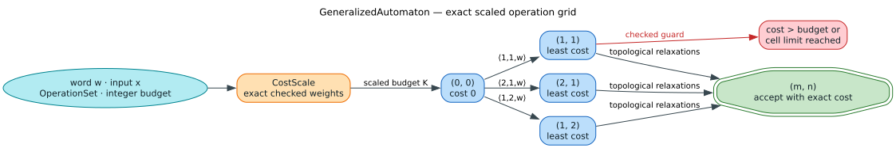

# Generalized operation sets

**Status:** implemented · **Audience:** API users, maintainers, and verifier
authors · **Persistence:** bincode or Protocol Buffers, optionally wrapped in
gzip

`OperationSet` is the shipped runtime grammar for generalized edit distance.
It describes which source/target slices an alignment may consume and what each
step costs. `GeneralizedAutomaton` validates that grammar and evaluates it on an
exact, sparse alignment grid.

This document is the reconstructible design reference for the public model,
its execution boundary, and its persistence contract. The detailed traversal
proof argument lives in the
[generalized-automaton repair](generalized-automaton-repair.md), and executable
pseudocode lives in the
[exact generalized-operation grid](../algorithms/14-generalized-operation-grid/README.md).



## 1. Scope and architectural boundary

The runtime system consists of four layers:

| Layer | Public type | Responsibility |
|---|---|---|
| Rule | `OperationType` | Consumption arity, exact persisted weight, applicability, and diagnostic name |
| Grammar | `OperationSet` | Ordered rule collection, validation, presets, and persistence |
| Cost domain | `CostScale` | Exact integer representation of the configured decimal weights |
| Evaluator | `GeneralizedAutomaton` | Least-cost bounded alignment over Unicode scalar positions |

This API does not replace every use of `Algorithm`. The `Algorithm` enum still
selects fixed unit-cost dictionary-query behavior, and `UniversalAutomaton`
still provides compile-time-specialized position variants. `OperationSet` plus
`GeneralizedAutomaton` is the runtime-configurable correctness path for
fractional weights, restricted pairs, and arbitrary non-zero source/target
arities.

That distinction prevents a runtime grammar from being silently approximated
by a fixed unit-cost state machine. In particular, the operation-complete grid
handles merge, split, digraph, and other multi-scalar rules directly. The
legacy streaming `GeneralizedState` types remain public for compatibility but
report unsupported arities rather than ignoring them.

## 2. Semantic model

Let $`x`$ be the source or dictionary word and $`y`$ the target or query.
Lengths and consumption counts are numbers of Unicode scalar values. The
semantic part of an operation is:

```math
t=\langle t^x,t^y,t^w,a\rangle,
```

where:

- $`t^x`$ is the number of source scalars consumed;
- $`t^y`$ is the number of target scalars consumed;
- $`t^w\ge 0`$ is the operation cost; and
- $`a`$ is the applicability predicate for the two consumed slices.

The stored name is intentionally outside this tuple. It exists for diagnostics
and profiling; renaming an operation cannot change acceptance or distance.

An alignment cell $`(i,j)`$ has consumed the first $`i`$ source scalars and
the first $`j`$ target scalars. An applicable rule creates the edge:

```math
(i,j)\longrightarrow(i+t^x,j+t^y)
```

with cost $`t^w`$. Acceptance means reaching $`(|x|,|y|)`$ without
exceeding the integer budget configured on `GeneralizedAutomaton`.

### 2.1 Applicability is explicit

`OperationApplicability` has four shipped variants:

| Variant | Rule |
|---|---|
| `Any` | Every pair of slices with the declared scalar arity is eligible. |
| `Equal` | The complete source and target slices must be equal; validation requires equal arity. |
| `AdjacentTranspose` | Exactly two source and two target scalars are consumed, and the target pair reverses the source pair. |
| `Listed(SubstitutionSet)` | The exact directional source/target pair must occur in the restriction set. |

`OperationType::new` selects `Equal` for a zero-cost operation and `Any` for a
positive-cost operation. Use `with_restriction`, `adjacent_transposition`, or
`with_applicability` when the operation has narrower semantics. Do not encode
behavior in a name such as `"transpose"`; only the applicability discriminator
controls behavior.

Listed substitutions are directional. To admit both `"ph" -> "f"` and
`"f" -> "ph"`, insert both pairs, normally as separate operations because
their declared arities differ.

### 2.2 Unicode and raw-byte restrictions

`can_apply_str` is the evaluator-facing predicate. It checks declared arity in
Unicode scalars and then tests the exact UTF-8 slices. Consequently `"é"` is
one consumed scalar even though it occupies two UTF-8 bytes. The library does
not normalize strings or combine grapheme clusters automatically.

`SubstitutionSet` also retains raw single-byte pairs for byte-oriented callers
and lossless persistence. Such pairs are distinct from UTF-8 string pairs.
Applications must choose and document normalization before evaluation if
canonical-equivalence or grapheme semantics are required.

### 2.3 Exact weights and bounded results

`CostScale` converts every configured finite decimal weight to a common integer
domain. It interprets the shortest round-tripping decimal representation of
the `f64`, reduces the value as a rational, and derives the least common
denominator. For denominator $`q`$, the public integer budget $`k`$ becomes
$`kq`$ and a rule weight $`w`$ becomes an exact integer
$`\operatorname{scaled}(w)`$.

The recurrence is therefore integer-exact:

```math
D[i+t^x,j+t^y]
=\min\left(D[i+t^x,j+t^y],
           D[i,j]+\operatorname{scaled}(t^w)\right).
```

`scaled_distance` returns `Some(cost)` only when the least configured alignment
fits the automaton's budget; it is not an unbounded distance function. Convert
the returned numerator for display with `CostScale::from_scaled`. NaN,
infinity, negative values, unrepresentable denominators, and checked-arithmetic
overflow are errors rather than rounded costs.

## 3. Construction and validation

The builder is deliberately mechanical: it preserves insertion order and
returns the collected rules. The checked construction boundary is
`GeneralizedAutomaton::try_with_operations`, which calls
`OperationSet::validate` before deriving a cost scale.

Order is observable through iteration and persistence, but the evaluator
relaxes each destination by minimum cost, so reordering otherwise identical
rules cannot change the least distance.

```rust
use liblevenshtein::transducer::generalized::GeneralizedAutomaton;
use liblevenshtein::transducer::{
    OperationSetBuilder, OperationType, SubstitutionSet,
};

let mut digraphs = SubstitutionSet::new();
digraphs.allow_str("ph", "f");

let operations = OperationSetBuilder::new()
    .with_standard_ops()
    .with_operation(OperationType::with_restriction(
        2,
        1,
        0.125,
        digraphs,
        "ph_to_f",
    ))
    .build();

let automaton = GeneralizedAutomaton::try_with_operations(1, operations)?;
let scale = automaton.cost_scale()?;
assert_eq!(scale.denominator(), 8);
assert_eq!(automaton.scaled_distance("phone", "fone")?, Some(1));
assert_eq!(scale.from_scaled(1), 0.125);
# Ok::<(), Box<dyn std::error::Error>>(())
```

The same API shape is compile-checked and executed by
[`operation_set_persistence.rs`](../../examples/operation_set_persistence.rs).
The source-level `OperationType` and `OperationSetBuilder` documentation also
contains Rust doctests for individual constructors.

### 3.1 Validation invariants

`OperationSet::validate` admits an empty set and otherwise enforces every rule
as one bounded alignment grammar:

1. each name contains 1 to 1,024 UTF-8 bytes;
2. each weight is finite and non-negative;
3. no rule has arity `(0, 0)`;
4. a zero-cost rule preserves length;
5. `Equal` has equal source and target arity;
6. `AdjacentTranspose` has arity `(2, 2)`;
7. every listed byte or string pair has the operation's declared scalar arity;
8. all consumption arithmetic is checked; and
9. aggregate consumption satisfies:

```math
\sum_{t\in\mathcal O}(t^x+t^y)\le 4096.
```

The no-progress rule makes the alignment graph acyclic. The aggregate ceiling
bounds per-cell slice work for generated or untrusted grammars. An empty set
describes only the empty-to-empty alignment.

`OperationType` constructors assert some local preconditions, but they do not
replace complete-set validation. Runtime-loaded configurations should use the
owned-name constructors and cross the checked automaton or decoder boundary.

### 3.2 Presets

| Constructor | Included rules | Meaning |
|---|---|---|
| `OperationSet::standard()` | match, substitute, insert, delete | Ordinary Levenshtein operations |
| `OperationSet::with_transposition()` | standard plus adjacent transpose | Restricted adjacent-swap extension |
| `OperationSet::with_merge_split()` | standard plus unrestricted `(1,2,1)` and `(2,1,1)` rules | Additive merge/split alignment |
| `OperationSet::hamming()` | match and substitute | Fixed-length mismatch count |
| `OperationSet::indel()` | match, insert, delete | Insertion/deletion distance |
| `OperationSet::bounded_skip()` | match and source deletion | Directional bounded subsequence relation |

The builder names use the historical query-to-dictionary vocabulary:
`with_merge` declares `(consume_x, consume_y) = (1, 2)`, while `with_split`
declares `(2, 1)`. The alignment edge itself is documented source-first, with
`x` as dictionary/source and `y` as query/target. Some older universal-
automaton reports name the same arities in the opposite, source-to-target
direction. Use the numeric arity when comparing those documents. The combined
preset includes both rules, so this naming orientation does not change its
accepted relation.

Both builder methods create unrestricted rules. Use listed applicability when
only particular multi-scalar correspondences should be legal.

## 4. Evaluation and resource behavior

`GeneralizedAutomaton` prepares UTF-8 scalar offsets once, derives the cost
scale, and traverses reachable cells in lexicographic order through a
`BTreeMap`. Every valid edge reaches a lexicographically later cell, so this is
sparse topological dynamic programming rather than Dijkstra's algorithm. A
cell stores only the least discovered scaled cost.

Let $`R`$ be the number of in-budget cells reached and
$`|\mathcal O|`$ the number of operations. The current implementation uses:

```math
\mathcal O\left(R|\mathcal O|\log R\right)
```

time and $`\mathcal{O}(R)`$ frontier memory. Evaluation fails with a resource
error before materializing more than 1,000,000 unique alignment cells. Cell
coordinates, accumulated costs, scale arithmetic, and discovery counts use
checked operations.

The recommended API behavior is:

| Method | Failure behavior |
|---|---|
| `try_with_operations` | Rejects an invalid grammar or cost scale eagerly. |
| `scaled_distance` | Reports validation, scale, overflow, or resource errors and otherwise returns an in-budget cost. |
| `try_accepts` | Reports the same errors and returns a Boolean match result. |
| `accepts` | Compatibility wrapper that maps every error to `false`. |
| `with_operations` | Compatibility constructor; validation is deferred until evaluation. |

The exact empty-side rates `rho_del` and `rho_ins` expose the cheapest pure
deletion and insertion cost per scalar as reduced rationals, or explicit
infinity when no such rule exists. They explain empty-side behavior but are
not used as a global length heuristic: a merge or split can change length
without being a pure deletion or insertion.

## 5. Binary persistence contract

Only two semantic persistence formats are supported for complete operation
sets:

1. a versioned bincode envelope for compact Rust storage; and
2. a versioned Protocol Buffers schema for portable binary interchange.

Gzip may wrap either byte stream. It is compression, not a third semantic
format. JSON, TOML, YAML, newline-delimited text, and other plaintext encodings
are intentionally outside this API.


### 5.1 Feature and method matrix

| Cargo feature | Added methods | Notes |
|---|---|---|
| `serialization` | `to_binary`, `from_binary`, `from_binary_with_limits` | Enables the bincode envelope. |
| `protobuf` | `to_protobuf`, `from_protobuf`, `from_protobuf_with_limits` | Implies `serialization`; schema is `proto/operation_set.proto`. |
| `compression` | `to_binary_gzip`, `from_binary_gzip`, limit-aware gzip methods | Implies `serialization`. |
| `protobuf` + `compression` | `to_protobuf_gzip`, `from_protobuf_gzip`, limit-aware gzip methods | One gzip member around one protobuf message. |

The public operation-model types do not implement generic Serde
`Serialize`/`Deserialize`. Bincode's Serde use is confined to private wire
types. This makes accidental JSON or TOML persistence a compile-time error and
keeps text-format dependencies out of the operation-set contract.

### 5.2 Bincode envelope

The bincode representation begins with a fixed 20-byte header:

| Offset | Width | Field | Version 1 value |
|---:|---:|---|---|
| 0 | 8 | Magic | ASCII bytes `LLEVOPS\0` |
| 8 | 2 | Version, little-endian | `1` |
| 10 | 2 | Reserved flags, little-endian | `0` |
| 12 | 8 | Payload length, little-endian | Exact following-byte count |

The payload uses private version-1 wire structs and bincode's legacy
configuration. It contains the ordered operations, source and target arities,
the exact `f64` weight, applicability discriminator, canonical listed pairs,
and owned diagnostic names.

The decoder rejects a short header, wrong magic, unknown version or flags,
oversized declaration, truncation, appended bytes, prefix-only bincode decode,
resource-limit violation, or semantic validation failure. The fixed 64 MiB
payload ceiling remains authoritative when callers provide looser limits.

### 5.3 Protocol Buffers

`OperationSetContainer` uses a `oneof` version discriminator whose version-1
message contains ordered `OperationTypeV1` values. Each operation records
`consume_x`, `consume_y`, exact IEEE-754 `weight_bits`, applicability, listed
pairs, and name. The schema contains no maps. Canonical restriction order plus
retained operation order makes bytes emitted by this implementation
deterministic.

Before `prost` allocates decoded vectors and strings, a non-allocating preflight
scans the wire stream and checks payload bytes, operation counts, per-operation
and total pair counts, name bytes, and aggregate restriction text. The decoder
then rejects malformed fields, a missing or unsupported schema variant,
unknown applicability, invalid weight bits, inconsistent restriction tags,
arity mismatches, and semantic validation failures.

Unknown protobuf fields are skipped for forward compatibility and are not
retained on re-encoding. This differs deliberately from the bincode envelope,
which requires exact byte consumption.

### 5.4 What survives a round trip

Both formats preserve:

- operation count and order;
- every source and target consumption value;
- exact `f64::to_bits()` weight bits, including signed zero;
- the explicit applicability discriminator;
- raw single-byte and UTF-8 string restrictions;
- canonical restriction-set membership; and
- owned diagnostic names.

Round-trip tests also compare `GeneralizedAutomaton::scaled_distance` before
and after persistence so representational equality is paired with execution
correspondence.

### 5.5 Optional gzip wrapper

Bincode and protobuf are compact encodings, not compression algorithms.
Repeated names, prefixes, and restriction patterns can therefore compress
substantially, while a small protobuf message can grow because of gzip framing.
The measured evidence in the
[operation-set persistence ledger](../scientific-ledger/operation-set-binary-persistence-2026-08-02.md)
keeps gzip opt-in rather than default-on.

The gzip decoders:

1. reject compressed input over 64 MiB;
2. stop inflation at the selected inner-format output limit plus one byte;
3. require a valid checksum;
4. accept exactly one complete gzip member;
5. reject concatenated members and trailing bytes; and
6. pass the inflated bytes to the ordinary bincode or protobuf validator.

Callers should measure representative data before adding compression. Whole
stream gzip also prevents direct random access; large indexed dictionaries need
a separately designed chunked format rather than transparent whole-file gzip.

## 6. Persistence examples

With `serialization`, bincode uses an explicit versioned method rather than a
generic serializer:

```rust
use liblevenshtein::transducer::{
    OperationSet, OperationSetBinaryLimits, OperationSetBuilder,
};

let operations = OperationSetBuilder::new().with_standard_ops().build();
let bytes = operations.to_binary()?;

let limits = OperationSetBinaryLimits {
    max_operations: 16,
    ..OperationSetBinaryLimits::default()
};
let restored = OperationSet::from_binary_with_limits(&bytes, limits)?;
assert_eq!(restored, operations);
# Ok::<(), Box<dyn std::error::Error>>(())
```

With `protobuf`, portable interchange uses separate methods; format guessing is
not part of the API:

```rust
use liblevenshtein::transducer::{OperationSet, OperationSetBuilder};

let operations = OperationSetBuilder::new().with_transposition().build();
let bytes = operations.to_protobuf()?;
let restored = OperationSet::from_protobuf(&bytes)?;
assert_eq!(restored, operations);
# Ok::<(), Box<dyn std::error::Error>>(())
```

The first example is reproduced by the compile-gated
[`doc_serialization_check.rs`](../../examples/doc_serialization_check.rs); the
second is covered by both that example and
[`operation_set_persistence.rs`](../../examples/operation_set_persistence.rs).

## 7. Verification and test map

The implementation is checked at complementary levels:

| Property | Executable evidence | Formal-model evidence |
|---|---|---|
| Exact grid agrees with standard, Hamming, indel, and subsequence references | `tests/proptest_generalized_automaton_repair.rs` | `GeneralizedAutomatonRepair.v`, Verus, SMT models |
| Fractional costs accumulate and budget acceptance is monotone | generalized unit and property tests | exact-rescaling and accumulation lemmas |
| Unicode restrictions count scalars | generalized unit tests and persistence execution checks | abstract slice-consumption obligations |
| Bincode preserves the complete model and rejects corrupt or over-limit data | `tests/operation_set_serialization.rs` | `OperationSetSerialization.v`, portable-decode model |
| Bincode header fields and exact payload length are derived from concrete bytes | exact fixture and arbitrary-byte properties | `OperationSetByteParsers.v` executable little-endian parser and refinement theorem |
| Protobuf preflight precedes semantic admission | `tests/operation_set_protobuf.rs`, private cursor offset properties, and arbitrary bytes | executable varint/key/value/nested-message parser in `OperationSetByteParsers.v`; portable-decode model |
| Gzip is one bounded outer member | `tests/operation_set_gzip.rs`, including arbitrary compressed bytes | crate-owned adapter theorem in `OperationSetByteParsers.v`; portable-decode model |
| Public examples remain compilable | `doc_serialization_check`, `operation_set_persistence`, Rust doctests | not applicable |

`OperationSetByteParsers.v` closes the former abstract-record gap at the wire
boundary: executable functions parse the actual 20-byte little-endian bincode
header and protobuf's bounded varints, field keys, fixed-width values,
length-delimited values, nested operation messages, and resource counters.
Its theorems derive exact consumption and every pre-allocation bound from
successful parsing. This is a mechanized byte-parser specification, not a
machine extraction of the Rust source; exact fixtures, private cursor-offset
properties, and arbitrary-byte decoder properties check that remaining
Rust-to-Rocq correspondence seam.

The gzip proof deliberately does not claim to verify DEFLATE or `flate2`.
`flate2` is the third-party decompression trust boundary. The crate-owned
adapter theorem begins with its observation and proves that admission requires
gzip magic, complete consumption of the supplied compressed bytes, a valid
checksum observation, bounded inflated bytes, and acceptance by the ordinary
inner decoder.

For commands and the maintained evidence inventory, see the
[verification index](../verification/README.md),
[`FORMAL_VERIFICATION_MANIFEST.tsv`](../verification/FORMAL_VERIFICATION_MANIFEST.tsv),
and the [security resource policy](../security/resource-exhaustion.md).

## 8. Source map and references

| Concern | Source of truth |
|---|---|
| Rule and applicability model | `src/transducer/operation_type.rs` |
| Grammar, validation, builder, and standard presets | `src/transducer/operation_set.rs` |
| Hamming, indel, and bounded-skip presets | `src/transducer/presets.rs` |
| Exact evaluator | `src/transducer/generalized/automaton.rs` |
| Exact cost scale | `src/cost/scale.rs` |
| Bincode envelope and resource limits | `src/transducer/operation_set_binary.rs` |
| Protocol Buffers decoder and preflight | `src/transducer/operation_set_protobuf.rs` |
| Published protobuf schema | `proto/operation_set.proto` |
| Gzip wrapper | `src/transducer/operation_set_gzip.rs` |

The generalized operation tuple and bounded-neighborhood foundation follow
P. Mitankin, S. Mihov, and K. U. Schulz, “Deciding word neighborhood with
universal neighborhood automata,” *Theoretical Computer Science* 412(22),
2340–2355 (2011),
[DOI 10.1016/j.tcs.2011.01.013](https://doi.org/10.1016/j.tcs.2011.01.013).

The sparse grid is also a direct weighted generalization of the dynamic
programming recurrence in R. A. Wagner and M. J. Fischer, “The string-to-string
correction problem,” *Journal of the ACM* 21(1), 168–173 (1974),
[DOI 10.1145/321796.321811](https://doi.org/10.1145/321796.321811).
