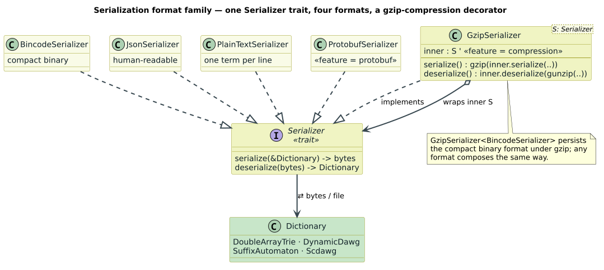

# Protocol Buffers Dictionary and Operation-Set Persistence

[← Documentation Index](../README.md)

**Status**: implemented binary persistence design
**Updated**: 2026-08-02

Protocol Buffers is the portable persistence option for liblevenshtein dictionaries.
Bincode remains the compact Rust-native option. No JSON, TOML, newline-delimited, or other
text persistence surface is supported.

`OperationSet` and its constituent public model types do not implement generic Serde traits.
The Rust-native encoder uses private bincode wire structs whose version-1 layout is regression
tested. This keeps the supported method surface binary-only instead of relying solely on the
absence of a `serde_json` dependency in this crate.



Dictionary schemas are maintained in `libdictenstein/proto/libdictenstein.proto`.
Generalized operations use `proto/operation_set.proto`. Both are compiled with `prost`.
Protocol Buffers defines a language-neutral binary wire format and compatibility rules for
evolving numbered fields; see the [Protocol Buffers language guide](https://protobuf.dev/programming-guides/proto3/)
and [encoding guide](https://protobuf.dev/programming-guides/encoding/).

## Design goals

- Keep production dictionary persistence binary and compact.
- Provide a schema that non-Rust implementations can generate and consume.
- Preserve dictionary terms exactly across a round trip.
- Reject malformed graph structure, invalid labels, cycles, inconsistent counts, and malformed
  specialized payloads.
- Keep backend-specific representations separate from the portable general format.
- Preserve complete operation-set semantics without interpreting diagnostic names.
- Permit gzip as an orthogonal transport wrapper.

## Format family

| Rust API | Schema message | Representation | Compatibility role |
|---|---|---|---|
| `ProtobufSerializer` | `Dictionary` | Explicit nodes, terminal nodes, and labeled edges | General V1 interchange |
| `OptimizedProtobufSerializer` | `DictionaryV2` | Packed edge triples and delta-coded terminal IDs | Compact Rust format |
| `DatProtobufSerializer` | `DoubleArrayTrie` | `LDT1` length-delimited term payload | DAT-specific reconstruction |
| `SuffixAutomatonProtobufSerializer` | `SuffixAutomaton` | Indexed source texts | Suffix-automaton reconstruction |
| `OperationSet::to_protobuf` | `OperationSetContainer` | Ordered operations, explicit applicability, canonical restriction pairs | Portable edit-grammar interchange |

The general serializers traverse a byte-level dictionary as a trie. The current dictionary
trait does not expose stable node identity, so DAWG node sharing is not preserved. Decoding
enumerates accepted UTF-8 terms and rebuilds the requested backend. The persistence guarantee
is therefore language preservation, not byte-for-byte preservation of a backend's in-memory
layout.

## V1 graph representation

The portable message records declared node IDs, terminal node IDs, edges, a root ID, and the
term count:

```protobuf
message Dictionary {
  message Edge {
    uint64 source_id = 1;
    uint32 label = 2;
    uint64 target_id = 3;
  }

  repeated uint64 node_id = 1;
  repeated uint64 final_node_id = 2;
  repeated Edge edge = 3;
  uint64 root_id = 4;
  uint64 size = 5;
}
```

The decoder requires the root, every edge endpoint, and every terminal ID to be declared. Edge
labels must fit a byte. A depth-first color check rejects reachable cycles before term
enumeration, and the enumerated term count must equal `size`.

```text
decode_v1(message):
    declared := set(message.node_id)
    require root_id in declared
    for each edge:
        require edge.source_id and edge.target_id in declared
        require edge.label <= 255
        adjacency[edge.source_id].append((edge.label, edge.target_id))
    require each final_node_id in declared
    require reachable graph is acyclic
    terms := enumerate UTF-8 root-to-final paths
    require len(terms) == message.size
    return rebuild_backend(terms)
```

## Compact V2 representation

`DictionaryV2` removes the declared-node array, stores edges as packed
`[source, label, target]` triples, and delta-codes terminal IDs. The decoder checks that the
packed array is divisible by three, that its triple count equals `edge_count`, that delta sums
do not overflow, that every label fits a byte, that the reachable graph is acyclic, and that
the reconstructed term count agrees with `size`.

V2 is not promised to be readable by older or third-party V1 implementations. Use V1 when the
consumer supports only the portable base schema.

## Specialized binary payloads

The DAT serializer currently stores terms in the `edge_data` field using this unambiguous
binary grammar:

```text
dat_payload := "LDT1" term*
term        := byte_length:u32_le utf8_bytes[byte_length]
```

Decoding requires the `LDT1` magic, complete length fields and term bodies, valid UTF-8, exact
payload consumption, and agreement with `term_count`. A newline-delimited compatibility
payload is deliberately rejected: accepting it would reintroduce an undocumented text
persistence format and would make embedded newlines ambiguous.

The suffix-automaton serializer stores the original source strings because the automaton can
be reconstructed from them. Its decoder verifies `string_count` before rebuilding.

## OperationSet V1 representation

`OperationSetContainer` is an explicit version discriminator. The V1 arm contains an ordered
sequence of operations. Each operation records source/target scalar consumption, exact
IEEE-754 weight bits, an applicability enum, canonical listed restrictions, and a diagnostic
name. Restriction pairs use a `oneof` so raw non-UTF-8 bytes remain distinct from Unicode
strings.

```protobuf
message OperationSetContainer {
  oneof format {
    OperationSetV1 v1 = 1;
  }
}

message OperationTypeV1 {
  uint64 consume_x = 1;
  uint64 consume_y = 2;
  fixed64 weight_bits = 3;
  OperationApplicabilityV1 applicability = 4;
  repeated SubstitutionPairV1 restriction = 5;
  string name = 6;
}
```

Operation order is retained because it participates in deterministic tie-breaking. The
serializer sorts the logical restriction set, so equal configurations emit identical bytes
from this implementation. Applicability is independent of `name`: renaming a rule cannot turn
it into a match or transposition.

Before invoking `prost`, `from_protobuf_with_limits` scans the wire without allocating
decoded collections. It bounds operations, pairs per operation, total pairs, every name, and
aggregate restriction-string bytes, including repeated encodings of singular fields. Unknown
fields are skipped, but malformed wire types and lengths are rejected. After decoding, the
same limits and `OperationSet::validate` are checked again. This two-stage design prevents a
small declared limit from being bypassed by `prost` vector allocation.

```text
decode_operation_set_protobuf(bytes, limits):
    require len(bytes) <= limits.payload_bytes
    for each wire field, without constructing schema objects:
        validate key, wire type, varint, and length boundaries
        count every operation and restriction-pair message
        sum every known restriction string length
        require each count <= its caller-selected limit
        skip unknown fields without retaining them
    message := prost_decode(bytes)
    require message.format is V1
    model := convert_explicit_applicability_and_exact_weight_bits(message)
    require model.validate()
    require model satisfies limits again
    return model
```

## Usage

Enable the `protobuf` feature:

```rust
use libdictenstein::double_array_trie::DoubleArrayTrie;
use libdictenstein::serialization::{DictionarySerializer, ProtobufSerializer};

let dictionary = DoubleArrayTrie::from_terms(vec!["test", "testing"]);
let mut bytes = Vec::new();
ProtobufSerializer::serialize(&dictionary, &mut bytes)?;
let restored: DoubleArrayTrie = ProtobufSerializer::deserialize(&bytes[..])?;
assert!(restored.contains("testing"));
# Ok::<(), libdictenstein::serialization::SerializationError>(())
```

With `compression`, `GzipSerializer<ProtobufSerializer>` wraps the same message bytes. Gzip
does not change schema identity or validation rules.

For operation sets, `to_protobuf_gzip` and `from_protobuf_gzip` provide the corresponding
single-member wrapper. `to_binary_gzip` and `from_binary_gzip` do the same for the bincode
envelope. These APIs reject concatenated members and trailing compressed data.

## Trust boundary and resource policy

Dictionary serializer APIs read the supplied stream into memory before decoding. A caller
accepting untrusted dictionary bytes must therefore impose a compressed-size limit before
entry and, for gzip, a decompressed-size/work limit around the reader. Protobuf repeated fields
can request large allocations, so public services should decode inside their ordinary memory
and time budgets.

The operation-set APIs enforce fixed compressed and decompressed ceilings themselves, plus
caller-selected inner limits. That is still not authentication or a wall-clock limit; hostile
workloads should run under the service's ordinary process/time controls.

Structural validation prevents malformed graphs from becoming dictionaries, but it is not
authentication. Sign or MAC artifacts when provenance matters.

## Compatibility policy

- Never reuse or change the meaning of an existing protobuf field number.
- Add fields compatibly; reserve removed field numbers and names.
- Use V1 for cross-implementation interchange unless the peer explicitly supports another
  message.
- Treat an unsupported specialized marker as an error. Do not reinterpret it as text.
- Retain fixture-based cross-language tests before claiming compatibility with a particular
  external implementation.

The repository does not claim cross-language compatibility merely because protobuf runtimes
exist in those languages; compatibility is established by sharing the schema and passing the
same validation fixtures.

## Verification and tests

The test suite covers general V1/V2 round trips, corrupted edge triples, oversized labels,
undeclared nodes, cycles, count mismatches, truncated specialized payloads, gzip composition,
backend/query correspondence, and the binary-only DAT marker. Property tests compare accepted
terms and values before and after serialization.

The generalized `OperationSet` has both a versioned bincode envelope and the V1 protobuf
schema described above. Its tests cover deterministic and execution-equivalent round trips,
exact floating-point bits, raw bytes, Unicode pairs, malformed wire, unknown fields, allocation
preflight limits, arbitrary-input panic freedom, gzip checksum/trailing-member rejection, and
uncompressed/compressed correspondence. See the
[binary persistence guide](../user-guide/serialization.md).
