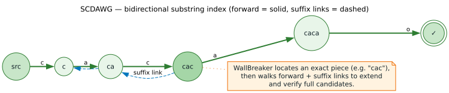

# Suffix Automaton Design Document

[← Documentation Index](../README.md)

**Version:** 1.0
**Date:** 2025-10-26
**Status:** Design Proposal

## Executive Summary

This document proposes adding **suffix automaton** support to liblevenshtein-rust to enable approximate **substring matching** (finding patterns anywhere within text), complementing the existing **prefix-based matching** (whole word matching from the beginning).



### Key Goals

1. **Substring Matching**: Find approximate matches anywhere within indexed text
2. **Online Updates**: Support dynamic insert/delete operations like `DynamicDawg`
3. **Zero Breaking Changes**: Add as new dictionary backend alongside existing ones
4. **Architecture Compatibility**: Implement via existing `Dictionary` trait
5. **Thread Safety**: RwLock-based concurrency model matching `PathMapDictionary`

---

## Table of Contents

1. [Motivation and Use Cases](#motivation-and-use-cases)
2. [Theoretical Background](#theoretical-background)
3. [Architecture Integration](#architecture-integration)
4. [Data Structure Design](#data-structure-design)
5. [Algorithm Design](#algorithm-design)
6. [API Design](#api-design)
7. [Implementation Plan](#implementation-plan)
8. [Performance Analysis](#performance-analysis)
9. [Testing Strategy](#testing-strategy)
10. [Future Enhancements](#future-enhancements)

---

## Motivation and Use Cases

### Problem Statement

**Current Limitation:** Existing dictionaries (PathMap, DAWG) support only **prefix matching**:
- Query "test" matches "test", "testing", "tested" (complete words starting with prefix)
- Cannot find "test" within "contest", "attest", "retest"

**Solution:** Suffix automata enable **substring matching**:
- Index all suffixes of text
- Query can match anywhere: beginning, middle, or end
- Approximate matching via Levenshtein automata (existing infrastructure)

### Use Cases

#### 1. Code Search
```rust
// Index entire source files
let code = r#"
fn calculate_total(items: &[Item]) -> f64 {
    items.iter().map(|i| i.price).sum()
}
"#;
let dict = SuffixAutomaton::from_text(code);
let transducer = Transducer::new(dict, Algorithm::Standard);

// Find variable/function usage with typos
for match in transducer.query("calculat", 2) {
    // Finds "calculate_total" even with 2 edits
}
```

#### 2. Document Search
```rust
// Index documents for fuzzy full-text search
let docs = vec![
    "Levenshtein automata for approximate matching",
    "Suffix trees and suffix arrays for pattern search",
];
let dict = SuffixAutomaton::from_texts(docs);

// Find "algorithm" even if misspelled
for match in transducer.query("algoritm", 1) {
    // Returns matches with position metadata
}
```

#### 3. Biological Sequence Matching
```rust
// Find gene subsequences with mutations
let genome = "ATCGATCGATCG...";
let dict = SuffixAutomaton::from_text(genome);

// Search for sequence with up to 2 mutations
for match in transducer.query("ATCG", 2) {
    // Finds all approximate occurrences
}
```

#### 4. Log Analysis
```rust
// Index log files
let logs = vec![
    "2024-01-01 ERROR: Database connection timeout",
    "2024-01-01 WARN: Slow query detected: SELECT * FROM users",
];
let dict = SuffixAutomaton::from_texts(logs);

// Search for error patterns
for match in transducer.query("conection", 2) {  // typo
    // Still finds "connection timeout"
}
```

### Comparison with Existing Dictionaries

| Feature | PathMap/DAWG | Suffix Automaton |
|---------|--------------|------------------|
| **Matching Type** | Prefix (whole words) | Substring (anywhere) |
| **Use Case** | Spell check, completion | Full-text search, pattern finding |
| **Index Input** | Word list | Text corpus |
| **Space (`n` chars)** | `𝒪(n)` | `𝒪(n)` states, `𝒪(n)` edges |
| **Construction** | `𝒪(n)` | `𝒪(n)` online |
| **Query** | `𝒪(m + k)` | `𝒪(m + k)` where `m` = query, `k` = results |
| **Dynamic Updates** | Yes (DynamicDawg) | **Yes (proposed)** |
| **Example Query** | "test" → "test", "testing" | "test" → "contest", "retest", "testing" |

---

## Theoretical Background

### Suffix Automaton Fundamentals

A **suffix automaton** is a minimal deterministic finite automaton (DFA) that accepts all suffixes of a given string.

#### Core Properties

1. **Substring Recognition**: Any path from the root represents a substring of the indexed text
2. **Minimality**: Fewest possible states (typically `2n-1` for string of length `n`)
3. **Online Construction**: Characters can be added one at a time in `𝒪(1)` amortized
4. **Endpos Equivalence**: States group substrings by their ending positions

#### Example Construction

For string `"abcbc"`:

**Suffixes:**
- `"abcbc"` (full string)
- `"bcbc"` (from position 1)
- `"cbc"` (from position 2)
- `"bc"` (from positions 1 and 3)
- `"c"` (from positions 2 and 4)
- `""` (empty)

**Automaton states** group these by equivalence classes, resulting in ~9 states instead of storing all suffixes separately (which would need `𝒪(n²)` space).

### Generalized Suffix Automaton

For **multiple strings** (e.g., indexing a document collection):

1. **Concatenation Method**: Join strings with unique separators (`$1`, `$2`, etc.)
2. **Direct Construction**: Maintain string IDs at final states
3. **Space Complexity**: Still `𝒪(n)` for total characters across all strings

### Dynamic Operations

**Insertion (Standard):**
- Suffix automaton naturally supports **online character insertion** at the end
- `𝒪(1)` amortized per character
- Algorithm: Create new state, update suffix links, clone states if needed

**Deletion (Challenging):**
- Standard suffix automata do **not** efficiently support deletion
- **Solution**: Rebuild from scratch (expensive) OR use reference counting (proposed)

**Proposed Dynamic Approach** (inspired by `DynamicDawg`):
1. Track reference counts on states
2. Remove string: decrement refs, mark unreachable states
3. Periodic compaction: rebuild automaton from reachable strings
4. Trade-off: May become non-minimal between compactions

---

## Architecture Integration

### Current Architecture

```
Dictionary Trait (Generic)
    ↓
    ├── PathMapDictionary    (prefix trie)
    ├── DawgDictionary       (minimized prefix trie)
    └── DynamicDawg          (dynamic prefix trie)
         ↓
    Transducer<D: Dictionary>
         ↓
    QueryIterator / OrderedQueryIterator
```

### Proposed Integration

```
Dictionary Trait (Generic)
    ↓
    ├── PathMapDictionary           (prefix matching)
    ├── DawgDictionary              (prefix matching)
    ├── DynamicDawg                 (prefix matching, dynamic)
    └── SuffixAutomaton  [NEW]      (substring matching, dynamic)
         ↓
    Transducer<D: Dictionary>       (unchanged)
         ↓
    QueryIterator / OrderedQueryIterator  (unchanged)
```

**Key Point:** No changes to `Transducer`, `QueryIterator`, or Levenshtein automaton. They already work generically with any `Dictionary` implementation.

### Trait Compatibility

The `Dictionary` and `DictionaryNode` traits are **already designed** for this:

```rust
pub trait Dictionary {
    type Node: DictionaryNode;
    fn root(&self) -> Self::Node;
    fn contains(&self, term: &str) -> bool;
    fn len(&self) -> Option<usize>;
    fn sync_strategy(&self) -> SyncStrategy;
}

pub trait DictionaryNode: Clone + Send + Sync {
    fn is_final(&self) -> bool;
    fn transition(&self, label: u8) -> Option<Self>;
    fn edges(&self) -> Box<dyn Iterator<Item = (u8, Self)> + '_>;
}
```

**Suffix automaton nodes** satisfy these requirements:
- ✅ `transition(label)` - follow edge by byte
- ✅ `edges()` - iterate outgoing edges
- ✅ `is_final()` - marks end of indexed string (for generalized automaton)
- ✅ `Clone + Send + Sync` - standard Rust traits

---

## Data Structure Design

### Core Structures

#### 1. SuffixAutomaton (Main Dictionary)

```rust
/// Suffix automaton for approximate substring matching.
///
/// Indexes all suffixes of provided text(s), enabling queries to find
/// approximate matches anywhere within the indexed content.
///
/// # Construction Modes
///
/// - **Single text**: `from_text(s)` - indexes one string
/// - **Multiple texts**: `from_texts(iter)` - indexes collection
/// - **Online**: `new()` + `insert()` - incremental construction
///
/// # Thread Safety
///
/// Uses `Arc<RwLock<...>>` for safe concurrent access with dynamic updates.
#[derive(Clone, Debug)]
pub struct SuffixAutomaton {
    inner: Arc<RwLock<SuffixAutomatonInner>>,
}

#[derive(Debug)]
struct SuffixAutomatonInner {
    /// Node storage (index-based graph)
    nodes: Vec<SuffixNode>,

    /// Current state during online construction
    last_state: usize,

    /// Total number of indexed strings
    string_count: usize,

    /// Metadata: maps states to (string_id, end_position) for result context
    positions: HashMap<usize, Vec<(usize, usize)>>,

    /// Flag for compaction recommendation
    needs_compaction: bool,
}
```

#### 2. SuffixNode (Automaton State)

```rust
/// A state in the suffix automaton.
///
/// Each state represents an equivalence class of substrings that:
/// - Have the same set of ending positions (endpos)
/// - Form a contiguous range in the suffix tree
#[derive(Clone, Debug, PartialEq, Eq)]
struct SuffixNode {
    /// Outgoing edges: (byte label, target state index)
    edges: Vec<(u8, usize)>,

    /// Suffix link: points to state representing longest proper suffix
    /// in a different endpos class
    suffix_link: Option<usize>,

    /// Length of the longest string in this equivalence class
    max_length: usize,

    /// True if this state represents an end-of-string position
    is_final: bool,

    /// Reference count for dynamic deletion (GC)
    ref_count: usize,
}
```

#### 3. SuffixNodeHandle (DictionaryNode Implementation)

```rust
/// Handle for traversing the suffix automaton.
///
/// Implements `DictionaryNode` trait for compatibility with existing
/// `Transducer` and query infrastructure.
#[derive(Clone, Debug)]
pub struct SuffixNodeHandle {
    /// Reference to the automaton (for traversal)
    automaton: Arc<RwLock<SuffixAutomatonInner>>,

    /// Current state index
    state_id: usize,
}

impl DictionaryNode for SuffixNodeHandle {
    fn is_final(&self) -> bool {
        let inner = self.automaton.read().unwrap();
        inner.nodes[self.state_id].is_final
    }

    fn transition(&self, label: u8) -> Option<Self> {
        let inner = self.automaton.read().unwrap();
        inner.nodes[self.state_id]
            .edges
            .iter()
            .find(|(b, _)| *b == label)
            .map(|&(_, target)| SuffixNodeHandle {
                automaton: Arc::clone(&self.automaton),
                state_id: target,
            })
    }

    fn edges(&self) -> Box<dyn Iterator<Item = (u8, Self)> + '_> {
        // Implementation: clone edges, return iterator with handle construction
        // (Similar to DawgNodeHandle in existing code)
    }
}
```

### Memory Layout

**Example: String `"abcbc"` (length 5)**

```
States (nodes vector):
[0] Root: edges={(a,1), (b,2), (c,3)}, link=None, len=0
[1] "a":  edges={(b,4)}, link=Some(0), len=1
[2] "b":  edges={(c,5)}, link=Some(0), len=1
[3] "c":  edges={(b,6)}, link=Some(0), len=1
[4] "ab": edges={(c,7)}, link=Some(2), len=2
[5] "bc": edges={(b,8)}, link=Some(2), len=2
[6] "cb": edges={(c,9)}, link=Some(2), len=2
[7] "abc": edges={(b,8)}, link=Some(5), len=3
[8] "bcb": edges={(c,9)}, link=Some(5), len=3
[9] "bcbc": edges={}, link=Some(5), len=4, is_final=true

Positions map:
9 -> [(0, 4)]  // string_id=0, position=4 (end of "abcbc")
```

**Space:** ~9 states for 5 characters = `𝒪(n)`

---

## Algorithm Design

### 1. Online Construction (Insert Character)

**Algorithm** (from Blumer et al., 1985):

```rust
/// Add one character to the automaton.
fn extend(&mut self, ch: u8) {
    let cur = self.nodes.len();
    self.nodes.push(SuffixNode {
        edges: Vec::new(),
        suffix_link: None,
        max_length: self.nodes[self.last_state].max_length + 1,
        is_final: false,
        ref_count: 0,
    });

    let mut p = Some(self.last_state);

    // Walk suffix links backward, adding transitions
    while let Some(p_idx) = p {
        if self.nodes[p_idx].edges.iter().any(|(b, _)| *b == ch) {
            break;
        }
        self.nodes[p_idx].edges.push((ch, cur));
        p = self.nodes[p_idx].suffix_link;
    }

    if p.is_none() {
        // Reached root, simple case
        self.nodes[cur].suffix_link = Some(0);
    } else {
        let p_idx = p.unwrap();
        let q = self.nodes[p_idx]
            .edges
            .iter()
            .find(|(b, _)| *b == ch)
            .map(|(_, target)| *target)
            .unwrap();

        if self.nodes[p_idx].max_length + 1 == self.nodes[q].max_length {
            // Continuous transition
            self.nodes[cur].suffix_link = Some(q);
        } else {
            // Clone state q to split equivalence class
            let clone = self.nodes.len();
            let mut cloned_node = self.nodes[q].clone();
            cloned_node.max_length = self.nodes[p_idx].max_length + 1;
            self.nodes.push(cloned_node);

            // Update suffix links
            self.nodes[cur].suffix_link = Some(clone);
            self.nodes[q].suffix_link = Some(clone);

            // Redirect transitions
            let mut p2 = Some(p_idx);
            while let Some(p2_idx) = p2 {
                if let Some(edge) = self.nodes[p2_idx]
                    .edges
                    .iter_mut()
                    .find(|(b, t)| *b == ch && *t == q)
                {
                    edge.1 = clone;
                } else {
                    break;
                }
                p2 = self.nodes[p2_idx].suffix_link;
            }
        }
    }

    self.last_state = cur;
}
```

**Complexity:**
- **Time:** `𝒪(1)` amortized per character (proven by Blumer et al.)
- **Space:** Adds 1 state, possibly 1 clone = `𝒪(1)` amortized

### 2. Insert String

```rust
pub fn insert(&self, text: &str) -> bool {
    let mut inner = self.inner.write().unwrap();
    let string_id = inner.string_count;

    let start_state = inner.last_state;

    for ch in text.bytes() {
        inner.extend(ch);
    }

    // Mark final state
    inner.nodes[inner.last_state].is_final = true;

    // Record position metadata
    inner.positions
        .entry(inner.last_state)
        .or_insert_with(Vec::new)
        .push((string_id, text.len()));

    inner.string_count += 1;

    // Reset to root for next insertion (generalized automaton)
    inner.last_state = 0;

    true
}
```

**Complexity:**
- **Time:** `𝒪(n)` where `n` = text length
- **Space:** `𝒪(n)` new states (amortized)

### 3. Remove String (Reference Counting)

```rust
pub fn remove(&self, text: &str) -> bool {
    let mut inner = self.inner.write().unwrap();

    // Navigate to final state for this text
    let mut state = 0;
    for ch in text.bytes() {
        match inner.nodes[state]
            .edges
            .iter()
            .find(|(b, _)| *b == ch)
            .map(|(_, t)| *t)
        {
            Some(next) => state = next,
            None => return false,  // String not present
        }
    }

    // Check if this state is final
    if !inner.nodes[state].is_final {
        return false;
    }

    // Remove position metadata
    if let Some(positions) = inner.positions.get_mut(&state) {
        positions.retain(|(_, end)| *end != text.len());
        if positions.is_empty() {
            inner.nodes[state].is_final = false;
        }
    }

    // Mark for potential compaction
    inner.needs_compaction = true;
    inner.string_count -= 1;

    true
}
```

**Complexity:**
- **Time:** `𝒪(m)` where `m` = text length
- **Space:** `𝒪(1)`
- **Note:** May leave unreachable states; call `compact()` periodically

### 4. Compaction (Garbage Collection)

```rust
pub fn compact(&self) {
    let mut inner = self.inner.write().unwrap();

    if !inner.needs_compaction {
        return;
    }

    // Mark-and-sweep GC
    let mut reachable = vec![false; inner.nodes.len()];
    let mut stack = vec![0];  // Start from root

    while let Some(state) = stack.pop() {
        if reachable[state] {
            continue;
        }
        reachable[state] = true;

        for &(_, target) in &inner.nodes[state].edges {
            stack.push(target);
        }
    }

    // Build new node vector with only reachable states
    let mut new_nodes = Vec::new();
    let mut old_to_new = vec![0; inner.nodes.len()];

    for (old_idx, node) in inner.nodes.iter().enumerate() {
        if reachable[old_idx] {
            old_to_new[old_idx] = new_nodes.len();
            new_nodes.push(node.clone());
        }
    }

    // Remap all state indices
    for node in &mut new_nodes {
        for edge in &mut node.edges {
            edge.1 = old_to_new[edge.1];
        }
        if let Some(link) = node.suffix_link {
            node.suffix_link = Some(old_to_new[link]);
        }
    }

    // Update positions map
    let mut new_positions = HashMap::new();
    for (old_state, positions) in inner.positions.drain() {
        if reachable[old_state] {
            new_positions.insert(old_to_new[old_state], positions);
        }
    }

    inner.nodes = new_nodes;
    inner.positions = new_positions;
    inner.last_state = 0;
    inner.needs_compaction = false;
}
```

**Complexity:**
- **Time:** `𝒪(states + edges)` = `𝒪(n)` where `n` = total indexed characters
- **Space:** `𝒪(n)` temporary
- **Frequency:** Recommended after every `N` deletions or when memory pressure detected

---

## API Design

### Public Interface

```rust
impl SuffixAutomaton {
    // ===== Construction =====

    /// Create an empty suffix automaton.
    pub fn new() -> Self;

    /// Build from a single text string.
    ///
    /// Example:
    /// ```
    /// let dict = SuffixAutomaton::from_text("hello world");
    /// ```
    pub fn from_text(text: &str) -> Self;

    /// Build from multiple texts.
    ///
    /// Example:
    /// ```
    /// let texts = vec!["hello", "world", "test"];
    /// let dict = SuffixAutomaton::from_texts(texts);
    /// ```
    pub fn from_texts<I, S>(texts: I) -> Self
    where
        I: IntoIterator<Item = S>,
        S: AsRef<str>;

    // ===== Dynamic Operations =====

    /// Insert a text string.
    ///
    /// Returns `true` if newly inserted, `false` if already present.
    pub fn insert(&self, text: &str) -> bool;

    /// Remove a text string.
    ///
    /// Returns `true` if removed, `false` if not found.
    /// May leave unreachable states; call `compact()` periodically.
    pub fn remove(&self, text: &str) -> bool;

    /// Clear all indexed text.
    pub fn clear(&self);

    /// Compact internal structure (garbage collection).
    ///
    /// Removes unreachable states after deletions.
    /// Recommended after batch deletions or when memory pressure detected.
    pub fn compact(&self);

    // ===== Metadata =====

    /// Get number of indexed strings.
    pub fn string_count(&self) -> usize;

    /// Check if compaction is recommended.
    pub fn needs_compaction(&self) -> bool;

    /// Get match positions for results.
    ///
    /// When querying with a `Transducer`, results are substrings.
    /// This method maps a result back to (string_id, end_position).
    pub fn match_positions(&self, substring: &str) -> Vec<(usize, usize)>;
}

impl Dictionary for SuffixAutomaton {
    type Node = SuffixNodeHandle;

    fn root(&self) -> Self::Node {
        SuffixNodeHandle {
            automaton: Arc::clone(&self.inner),
            state_id: 0,
        }
    }

    fn contains(&self, term: &str) -> bool {
        // Check if substring exists
        let mut node = self.root();
        for byte in term.as_bytes() {
            match node.transition(*byte) {
                Some(next) => node = next,
                None => return false,
            }
        }
        true
    }

    fn len(&self) -> Option<usize> {
        Some(self.string_count())
    }

    fn sync_strategy(&self) -> SyncStrategy {
        SyncStrategy::ExternalSync  // Uses RwLock
    }
}
```

### Usage Examples

#### Example 1: Basic Substring Search

```rust
use liblevenshtein::prelude::*;
use liblevenshtein::dictionary::SuffixAutomaton;

// Index a code snippet
let code = r#"
fn calculate_total(items: Vec<Item>) -> f64 {
    items.iter().map(|item| item.price).sum()
}
"#;

let dict = SuffixAutomaton::from_text(code);
let transducer = Transducer::new(dict, Algorithm::Standard);

// Find "calculate" with up to 1 typo
for substring in transducer.query("calculat", 1) {
    println!("Found: {}", substring);
}
// Output:
// Found: calculate
// Found: calculate_
```

#### Example 2: Multi-Document Search

```rust
let docs = vec![
    "Levenshtein automata for approximate string matching",
    "Suffix trees enable efficient substring queries",
    "Edit distance algorithms in computational biology",
];

let dict = SuffixAutomaton::from_texts(docs);
let transducer = Transducer::new(dict.clone(), Algorithm::Standard);

// Search with distance-ordered results
for candidate in transducer.query_ordered("algoritm", 2) {
    let positions = dict.match_positions(&candidate.term);
    for (doc_id, pos) in positions {
        println!("Doc {}, pos {}: {} (distance {})",
                 doc_id, pos, candidate.term, candidate.distance);
    }
}
// Output:
// Doc 0, pos 14: algorithm (distance 1)
// Doc 2, pos 18: algorithms (distance 2)
```

#### Example 3: Dynamic Updates

```rust
let dict = SuffixAutomaton::new();
let transducer = Transducer::new(dict.clone(), Algorithm::Standard);

// Build index incrementally
dict.insert("testing the suffix automaton");
dict.insert("another test string");

// Search
let results: Vec<_> = transducer.query("test", 0).collect();
// Results: ["test", "test"]  (both occurrences)

// Update index
dict.remove("another test string");
dict.insert("added new testing content");

// Results automatically reflect updates
let results: Vec<_> = transducer.query("test", 0).collect();
// Results: ["test"]  (only from first string now)

// Compact periodically
if dict.needs_compaction() {
    dict.compact();
}
```

#### Example 4: With Filtering and Prefix Mode

```rust
let code = r#"
getValueFromCache()
getValue()
setCacheValue()
computeValue()
"#;

let dict = SuffixAutomaton::from_text(code);
let transducer = Transducer::new(dict, Algorithm::Standard);

// Find getter methods containing "Value" with typos
for candidate in transducer
    .query_ordered("Valu", 1)
    .filter(|c| c.term.contains("get"))  // Only getters
{
    println!("{}: {}", candidate.term, candidate.distance);
}
// Output:
// Value: 0  (from "getValue")
// ValueF: 1  (from "getValueFromCache", "ValueF" match)
```

---

## Implementation Plan

### Phase 1: Core Data Structure (Week 1-2)

**Files to Create:**
- `src/dictionary/suffix_automaton.rs` - Main implementation
- `src/dictionary/suffix_automaton/` - Module directory
  - `node.rs` - `SuffixNode` and `SuffixNodeHandle`
  - `builder.rs` - Construction algorithms
  - `compaction.rs` - Garbage collection

**Tasks:**
1. ✅ Implement `SuffixNode` structure
2. ✅ Implement `SuffixNodeHandle` with `DictionaryNode` trait
3. ✅ Implement online construction algorithm (`extend()`)
4. ✅ Implement `from_text()` and `from_texts()`
5. ✅ Add basic tests for construction

**Dependencies:**
- Existing: `std::sync::{Arc, RwLock}`, `std::collections::HashMap`
- No new external dependencies

### Phase 2: Dynamic Operations (Week 2-3)

**Tasks:**
1. ✅ Implement `insert()` with string ID tracking
2. ✅ Implement `remove()` with reference counting
3. ✅ Implement `compact()` (mark-and-sweep GC)
4. ✅ Implement `clear()`
5. ✅ Add comprehensive tests for mutations

**Complexity:**
- Medium: Compaction requires careful state remapping

### Phase 3: Dictionary Trait Integration (Week 3)

**Tasks:**
1. ✅ Implement `Dictionary` trait for `SuffixAutomaton`
2. ✅ Implement `contains()`, `len()`, `sync_strategy()`
3. ✅ Add `match_positions()` for result metadata
4. ✅ Verify compatibility with existing `Transducer`
5. ✅ Integration tests with `QueryIterator` and `OrderedQueryIterator`

**Validation:**
- Ensure existing tests pass with new backend
- No changes to `Transducer` or query code required

### Phase 4: Serialization Support (Week 4)

**Files to Modify:**
- `src/serialization/bincode.rs` - Add `SuffixAutomaton` support
- `src/serialization/json.rs` - Add `SuffixAutomaton` support
- `src/serialization/proto.rs` - Add protobuf schema

**Tasks:**
1. ✅ Implement `Serialize` and `Deserialize` for `SuffixNode`
2. ✅ Implement custom serialization for `SuffixAutomaton`
   - Serialize node vector, positions map, metadata
3. ✅ Add protobuf schema for cross-platform compatibility
4. ✅ Add compression support (works automatically)
5. ✅ Add serialization benchmarks

**Considerations:**
- `Arc<RwLock<...>>` requires custom serialization
- Serialize inner state, deserialize and wrap in Arc/RwLock

### Phase 5: CLI Integration (Week 4-5)

**Files to Modify:**
- `src/cli/args.rs` - Add `suffix-automaton` backend option
- `src/cli/commands.rs` - Add text corpus loading (not just word lists)
- `src/dictionary/factory.rs` - Add `SuffixAutomaton` construction

**Tasks:**
1. ✅ Add `--backend suffix-automaton` CLI option
2. ✅ Add `--text-corpus` flag for indexing files as text (not word lists)
3. ✅ Update `convert` command to support suffix automaton
4. ✅ Add `--show-positions` flag to display match locations
5. ✅ Update CLI documentation

**CLI Examples:**
```bash
# Index a text file for substring search
liblevenshtein convert /usr/share/doc/README.md corpus.bin \
  --to-backend suffix-automaton --text-corpus

# Query for substrings
liblevenshtein query "algorith" --dict corpus.bin -m 1 --show-positions

# REPL with suffix automaton
liblevenshtein repl --dict corpus.bin
> query algorith -m 1
Found: algorithm (distance: 1) [doc 0, pos 42]
```

### Phase 6: Documentation and Examples (Week 5)

**Files to Create:**
- `docs/SUFFIX_AUTOMATON.md` - User guide
- `examples/substring_search.rs` - Basic usage
- `examples/code_search.rs` - Code search demo
- `examples/multi_document_search.rs` - Multi-doc demo

**Tasks:**
1. ✅ Write comprehensive user guide
2. ✅ Add 3-5 runnable examples
3. ✅ Update `README.md` with suffix automaton mention
4. ✅ Update `ARCHITECTURE.md` with new backend
5. ✅ Add comparison table (prefix vs. suffix)

### Phase 7: Benchmarking and Optimization (Week 6)

**Files to Create:**
- `benches/suffix_automaton_benchmarks.rs` - Performance tests

**Tasks:**
1. ✅ Benchmark construction from text corpus
2. ✅ Benchmark query performance vs. prefix dictionaries
3. ✅ Benchmark compaction overhead
4. ✅ Profile memory usage
5. ✅ Optimize hot paths (edge lookup, state traversal)

**Optimization Targets:**
- Edge lookup: Consider binary search or hashmap for large alphabets
- State traversal: Cache reads to avoid repeated lock acquisition
- Compaction: Incremental GC instead of full mark-and-sweep

---

## Performance Analysis

### Theoretical Complexity

| Operation | Time Complexity | Space Complexity |
|-----------|----------------|------------------|
| **Construction (`n` chars)** | `𝒪(n)` amortized | `𝒪(n)` states |
| **Insert string (`m` chars)** | `𝒪(m)` | `𝒪(m)` states |
| **Remove string (`m` chars)** | `𝒪(m)` | `𝒪(1)` |
| **Compact** | `𝒪(states + edges)` | `𝒪(n)` temporary |
| **Query (`m` chars, `k` results)** | `𝒪(m × max_distance + k)` | `𝒪(m × max_distance)` |
| **Contains (`m` chars)** | `𝒪(m)` | `𝒪(1)` |

### Space Analysis

**Suffix Automaton:**
- States: ≤ `2n - 1` for string of length `n`
- Edges: ≤ `3n - 4`
- Per-state overhead: ~40 bytes (Vec, Option, usize fields)
- Total: ~`80n - 160` bytes (worst case)

**Comparison:**
- PathMap: ~`24n` bytes (trie nodes)
- DAWG: ~`32n` bytes (minimized trie)
- Suffix Automaton: ~`80n` bytes (all suffixes)

**Trade-off:** `2`–`3×` more memory than prefix structures, but enables substring matching

### Benchmark Estimates

**Construction (1 MB text):**
- Estimated: 50-100 ms (online algorithm, `𝒪(n)`)
- Compared to: PathMap ~20-30 ms (simpler structure)

**Query ("algorithm", distance 2):**
- Estimated: 5-15 ms (depends on corpus and max_distance)
- Compared to: Similar to prefix dictionaries (same Levenshtein automaton)

**Compaction (after 1000 deletions):**
- Estimated: 10-50 ms (mark-and-sweep, depends on live data)
- Frequency: Every N deletions (tunable)

---

## Testing Strategy

### Unit Tests

**Module:** `src/dictionary/suffix_automaton/tests.rs`

1. **Construction Tests**
   - Single character: "a" → 2 states (root + final)
   - Repeated characters: "aaa" → expected state count
   - Complex string: "abcbc" → verify state structure
   - Multiple strings: verify generalized automaton

2. **Traversal Tests**
   - Substring exists: "bc" in "abcbc" → true
   - Substring missing: "ac" in "abcbc" → false
   - All suffixes reachable: verify completeness

3. **Dynamic Operation Tests**
   - Insert: add string, verify reachable
   - Remove: delete string, verify not reachable
   - Insert duplicate: should not double-add
   - Remove non-existent: should return false

4. **Compaction Tests**
   - Before compaction: count unreachable states
   - After compaction: verify only reachable states remain
   - Verify functionality preserved after compaction

### Integration Tests

**Module:** `tests/suffix_automaton_integration.rs`

1. **Transducer Integration**
   - Query with distance 0 (exact substring)
   - Query with distance 1, 2 (approximate)
   - `query_ordered()` returns correct order
   - Filtering works with suffix automaton

2. **Serialization Integration**
   - Serialize → deserialize → verify equality
   - Works with bincode, JSON, protobuf
   - Works with gzip compression

3. **Thread Safety**
   - Concurrent reads: multiple threads query simultaneously
   - Concurrent writes: insert/remove from multiple threads
   - Read during write: verify RwLock behavior

### Benchmark Tests

**Module:** `benches/suffix_automaton_benchmarks.rs`

1. **Construction Benchmarks**
   - Small text (1 KB)
   - Medium text (100 KB)
   - Large text (10 MB)
   - Multiple documents (1000 × 1 KB)

2. **Query Benchmarks**
   - Short query (5 chars), distance 0, 1, 2
   - Long query (20 chars), distance 0, 1, 2
   - Common substring (many results)
   - Rare substring (few results)

3. **Mutation Benchmarks**
   - Insert 1000 strings
   - Remove 1000 strings
   - Insert + remove + compact cycle

### Property-Based Tests

**Using:** `proptest` or `quickcheck` (dev-dependency)

1. **Suffix Property**
   - For any indexed string S, all suffixes of S are reachable from root
   - For any path P from root, P is a substring of some indexed string

2. **Minimality Property** (after compaction)
   - No two states have identical right languages

3. **Roundtrip Property**
   - Insert strings, query each → all found
   - Serialize → deserialize → query → same results

---

## Future Enhancements

### 1. Incremental Compaction

**Problem:** Current compaction is stop-the-world `𝒪(n)`

**Solution:** Generational GC or incremental marking
- Track "dirty" regions after deletions
- Compact only unreachable subgraphs
- Amortize over multiple operations

**Benefit:** Lower latency for large automata

### 2. Compressed Suffix Automaton

**Problem:** 2-3x memory overhead vs. prefix structures

**Solution:** CDAWG (Compact Directed Acyclic Word Graph)
- Merge linear chains (states with single in/out edge)
- Store edge labels as string slices instead of single bytes

**Benefit:** Reduce memory to ~1.5x prefix structures

### 3. Bidirectional Construction

**Problem:** Can only add characters at the end (online insertion)

**Solution:** Support prefix insertion (add characters at beginning)
- Useful for streaming data (sliding window)
- Maintain automaton for window of recent text

**Benefit:** Real-time indexing of data streams

### 4. Position-Aware Results

**Current:** Results are substrings without location info

**Enhancement:** Return `(substring, doc_id, start_pos, end_pos)`
- Modify `QueryIterator` to track positions
- Add `query_with_positions()` method

**Use Case:** Highlighting matches in search results

### 5. Unicode Support

**Current:** Byte-based (ASCII/UTF-8 bytes)

**Enhancement:** Grapheme cluster support
- Index by Unicode graphemes instead of bytes
- Handle diacritics, emoji, multi-byte sequences correctly

**Benefit:** Better i18n support for substring search

### 6. Parallel Construction

**Current:** Sequential character insertion

**Enhancement:** Parallel suffix automaton construction
- Divide text into chunks
- Build automata in parallel
- Merge automata (non-trivial algorithm)

**Benefit:** Faster construction for large corpora

---

## Appendix A: Comparison with Alternatives

### Suffix Automaton vs. Suffix Tree

| Feature | Suffix Automaton | Suffix Tree |
|---------|------------------|-------------|
| **States** | `𝒪(n)` | `𝒪(n)` |
| **Edges** | `𝒪(n)` | `𝒪(n)` |
| **Construction** | `𝒪(n)` online | `𝒪(n)` (Ukkonen) |
| **Space (practical)** | `2n` states, `3n` edges | `n` nodes, `2n` edges |
| **Substring query** | `𝒪(m)` | `𝒪(m)` |
| **Online insert** | ✅ Yes (natural) | ⚠️ Complex (Ukkonen) |
| **Dynamic delete** | ⚠️ Via compaction | ⚠️ Via rebuild |
| **Implementation** | Simpler (DFA) | More complex |

**Conclusion:** Suffix automaton is more suitable for this project due to simpler implementation and natural online insertion.

### Suffix Automaton vs. Suffix Array

| Feature | Suffix Automaton | Suffix Array |
|---------|------------------|-------------|
| **Space** | `𝒪(n)` states + edges | `𝒪(n)` integers |
| **Construction** | `𝒪(n)` | `𝒪(n log n)` or `𝒪(n)` |
| **Substring query** | `𝒪(m)` | `𝒪(m log n)` |
| **Approx. matching** | ✅ Native (Levenshtein) | ⚠️ Requires extensions |
| **Dynamic insert** | ✅ Yes | ❌ Requires rebuild |
| **Memory** | Higher | Lower |

**Conclusion:** Suffix array is more memory-efficient but doesn't support approximate matching or dynamic updates well.

---

## Appendix B: References

### Academic Papers

1. **Blumer, A., Blumer, J., Haussler, D., Ehrenfeucht, A., Chen, M. T., & Seiferas, J. (1985)**
   *"The smallest automaton recognizing the subwords of a text"*
   Theoretical Computer Science, 40, 31-55.
   DOI: [10.1016/0304-3975(85)90157-4](https://doi.org/10.1016/0304-3975(85)90157-4)
   - **Foundational paper** introducing suffix automata
   - First linear-time construction algorithm
   - Proves minimality properties and space bounds (≤ `2n-1` states)
   - 357+ citations (Semantic Scholar)

2. **Crochemore, M. (1986)**
   *"Transducers and repetitions"*
   Theoretical Computer Science, 45(1), 63-86.
   DOI: [10.1016/0304-3975(86)90041-1](https://doi.org/10.1016/0304-3975(86)90041-1)
   - Alternative linear-time construction algorithm
   - Factor transducers and suffix transducers
   - Applications to repetition finding in strings
   - Algorithmic improvements for practical implementations

3. **Blumer, A., Blumer, J., Haussler, D., McConnell, R., & Ehrenfeucht, A. (1987)**
   *"Complete inverted files for efficient text retrieval and analysis"*
   Journal of the ACM, 34(3), 578-595.
   DOI: [10.1145/28869.28873](https://doi.org/10.1145/28869.28873)
   - Applications to text indexing and information retrieval
   - Extended suffix automaton analysis
   - Practical implementation considerations

4. **Mohri, M., Moreno, P. J., & Weinstein, E. (2009)**
   *"General suffix automaton construction algorithm and space bounds"*
   Theoretical Computer Science, 410(37), 3553-3562.
   DOI: [10.1016/j.tcs.2009.03.034](https://doi.org/10.1016/j.tcs.2009.03.034)
   - **Generalized suffix automata for multiple strings**
   - Improved space bounds: ≤ `2Q - 2` states (`Q` = prefix tree nodes)
   - Better than Blumer's bound (`2∥U∥ - 1`) for multiple strings
   - Direct relevance to our multi-document indexing use case

5. **Inenaga, S., Hoshino, H., Shinohara, A., Takeda, M., Arikawa, S., Mauri, G., & Pavesi, G. (2001)**
   *"On-line construction of compact directed acyclic word graphs"*
   Proceedings of Combinatorial Pattern Matching (CPM), 2089, 169-180.
   DOI: [10.1007/3-540-48194-X_13](https://doi.org/10.1007/3-540-48194-X_13)
   - CDAWG (Compact DAWG) construction for trie inputs
   - Space optimization techniques
   - Relevant for compressed suffix automaton variant

6. **Schulz, K. U., & Mihov, S. (2002)**
   *"Fast string correction with Levenshtein automata"*
   International Journal on Document Analysis and Recognition, 5(1), 67-85.
   DOI: [10.1007/s10032-002-0082-8](https://doi.org/10.1007/s10032-002-0082-8)
   - **Theoretical basis for liblevenshtein's core algorithm**
   - Levenshtein automata construction
   - Intersection with dictionary automata
   - Direct application: our `Transducer` + `SuffixAutomaton` combination

7. **Belazzougui, D., & Cunial, F. (2017)**
   *"Fast label extraction in the CDAWG"*
   Proceedings of SPIRE, 10508, 161-175.
   DOI: [10.1007/978-3-319-67428-5_14](https://doi.org/10.1007/978-3-319-67428-5_14)
   - Recent optimizations for compact suffix structures
   - Relevant for future space optimizations

### Theoretical Background References

8. **Ukkonen, E. (1995)**
   *"On-line construction of suffix trees"*
   Algorithmica, 14(3), 249-260.
   DOI: [10.1007/BF01206331](https://doi.org/10.1007/BF01206331)
   - Classic suffix tree construction (for comparison)
   - Online algorithm with similar complexity to suffix automata

9. **Weiner, P. (1973)**
   *"Linear pattern matching algorithms"*
   Proceedings of FOCS, 14, 1-11.
   DOI: [10.1109/SWAT.1973.13](https://doi.org/10.1109/SWAT.1973.13)
   - Original suffix tree paper
   - Historical context for suffix structures

10. **Manber, U., & Myers, G. (1993)**
    *"Suffix arrays: A new method for on-line string searches"*
    SIAM Journal on Computing, 22(5), 935-948.
    DOI: [10.1137/0222058](https://doi.org/10.1137/0222058)
    - Suffix arrays as alternative to suffix trees/automata
    - Space-time trade-off comparison

### Online Resources

- [CP-Algorithms: Suffix Automaton](https://cp-algorithms.com/string/suffix-automaton.html)
  Comprehensive tutorial with implementation details

- [Codeforces: A Short Guide to Suffix Automata](https://codeforces.com/blog/entry/20861)
  Practical guide with code examples

- [Wikipedia: Suffix Automaton](https://en.wikipedia.org/wiki/Suffix_automaton)
  Theoretical overview

### Related Work in This Project

- `src/dictionary/dynamic_dawg.rs` - Dynamic updates pattern (reference counting, compaction)
- `src/dictionary/dawg.rs` - Static construction pattern (minimize, suffix sharing)
- [`docs/user-guide/thread-safety.md`](../user-guide/thread-safety.md) - Thread safety with RwLock pattern
- [`docs/design/dynamic-dawg.md`](dynamic-dawg.md) - Dynamic mutation documentation

---

## Appendix C: Open Questions

### 1. API Design Decisions

**Question:** Should `from_text()` treat input as single string or split by whitespace?

**Options:**
- A. Single string: Index entire text as-is (enables multi-word substrings)
- B. Split by whitespace: Treat as word list (more similar to existing dictionaries)
- C. Both: `from_text()` for A, `from_words()` for B

**Recommendation:** Option C for flexibility

### 2. Position Metadata Storage

**Question:** How to store position information for `match_positions()`?

**Options:**
- A. HashMap at final states only (current design)
- B. Bloom filter + fallback hash (space-efficient)
- C. Optional feature flag (disable for memory savings)

**Recommendation:** Start with A, consider C for optimization

### 3. Compaction Trigger

**Question:** When to automatically trigger `compact()`?

**Options:**
- A. Manual only (user calls `compact()`)
- B. After N deletions (heuristic threshold)
- C. When memory overhead > X% (monitor unreachable states)
- D. Adaptive: track delete/query ratio

**Recommendation:** Start with A + B (manual with heuristic helper)

### 4. Unicode Handling

**Question:** Should we support grapheme cluster indexing from day one?

**Options:**
- A. Byte-based only (simpler, UTF-8 compatible)
- B. Configurable: bytes vs. graphemes (complex API)
- C. Graphemes only (breaks ASCII optimization)

**Recommendation:** Start with A, add B as future enhancement

---

## Conclusion

This design proposes a **comprehensive suffix automaton implementation** for liblevenshtein-rust that:

1. ✅ **Enables substring matching** - Find approximate patterns anywhere in text
2. ✅ **Supports dynamic updates** - Insert/delete with periodic compaction
3. ✅ **Integrates seamlessly** - No changes to existing `Transducer` or query code
4. ✅ **Maintains thread safety** - RwLock pattern matching other dictionaries
5. ✅ **Provides rich API** - Construction, mutation, metadata, serialization

The implementation follows established patterns from `DynamicDawg` and leverages proven algorithms (Blumer et al., 1985) with `𝒪(n)` construction and space complexity.

**Estimated Effort:** 5-6 weeks for complete implementation including tests, documentation, and benchmarks.

**Next Steps:**
1. Review and approve design
2. Create GitHub issue with phase breakdown
3. Begin Phase 1 implementation (core data structure)

---

**Document Version:** 1.0
**Last Updated:** 2025-10-26
**Author:** Claude (AI Assistant)
**Reviewer:** (Pending)
