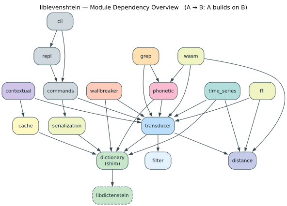
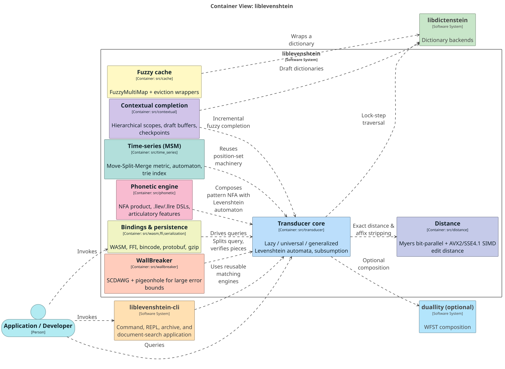
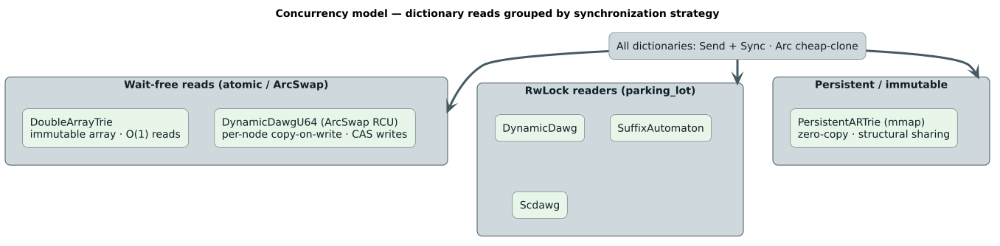

# liblevenshtein-rust Architecture

**Version:** 0.9.1
**Last Updated:** 2026-06-19

This document describes the **intra-crate** architecture and design principles of
liblevenshtein-rust — how the modules inside this crate fit together. For the
**inter-crate** view (how liblevenshtein relates to libdictenstein, duallity, and
the DSL layer) see the [Architecture Overview](../architecture/overview.md).

---

## Table of Contents

- [Overview](#overview)
- [Module Organization](#module-organization)
- [Core Components](#core-components)
- [Design Principles](#design-principles)
- [Performance Architecture](#performance-architecture)
- [Thread Safety](#thread-safety)
- [Future Directions](#future-directions)

---

## Overview

liblevenshtein-rust is a high-performance library for approximate string matching
using Levenshtein automata. Since v0.9.0 it is layered over a sibling crate:

1. **Dictionary backends live in [`libdictenstein`](../architecture/overview.md)** —
   the trie/DAWG implementations (`DoubleArrayTrie`, `DynamicDawg`/`DynamicDawgU64`,
   `SuffixAutomaton`, `Scdawg`, `PersistentARTrie`, `PathMapDictionary`) and the
   `Dictionary` / `DictionaryNode` / `MappedDictionary` traits. They are re-exported
   here as `#[deprecated]` shims for source compatibility.
2. **The Levenshtein transducer & automata** live in this crate (`src/transducer/`):
   the lazy/parameterized engine (default), plus eager `universal/` and
   runtime-configurable `generalized/` implementations.
3. **Higher-level engines** are built on the core: phonetic matching, time-series
   (MSM), WallBreaker, contextual completion, fuzzy caching, and grep.


### Key Characteristics

- **Type-safe** — extensive use of Rust's type system for correctness.
- **Zero-cost abstractions** — trait-based design, monomorphized; the
  `SubstitutionPolicy` default (`Unrestricted`) is a zero-sized type.
- **Memory-efficient** — structural sharing via `Arc`, position-set pooling,
  `SmallVec` stack allocation.
- **Concurrent-safe** — wait-free reads where possible (`ArcSwap`), `RwLock`
  readers otherwise; every backend is `Send + Sync` with cheap `Arc` clones.
- **Feature-gated** — modular compilation (phonetic, serialization, cli, grep, wasm, ffi …).

---

## Module Organization

```text
src/
├── lib.rs              # Public API, prelude, feature gates
│
├── transducer/         # THE CORE — Levenshtein automata & query iterators
│   ├── mod.rs          #   Transducer<D, P> struct, public API
│   ├── algorithm.rs    #   Algorithm enum (Standard, Transposition, MergeAndSplit)
│   ├── state.rs        #   Automaton state = set of positions ⟨i,e⟩
│   ├── position.rs     #   Position ⟨i,e⟩
│   ├── transition.rs   #   χ-driven transition rule
│   ├── pool.rs         #   StatePool — position-set reuse (no steady-state alloc)
│   ├── intersection.rs #   Dictionary ∩ automaton lock-step walk
│   ├── query.rs        #   QueryIterator (+ ordered_query, priority_query,
│   │                   #     value_filtered_query, zipper iterators)
│   ├── universal/      #   Eager parameter-free DFA (Mitankin 2005)
│   ├── generalized/    #   Runtime OperationSet (drives weighted/phonetic edits)
│   ├── *_f64.rs        #   Real-valued (weighted) shadow of the integer path
│   ├── substitution_set.rs / substitution_policy.rs
│   └── simd.rs         #   x86_64 SIMD helpers
│
├── distance/           # Direct edit-distance functions
│   ├── mod.rs          #   standard_distance (auto-dispatch), affix stripping
│   ├── myers.rs        #   Myers bit-parallel
│   └── simd.rs         #   AVX2 / SSE4.1 distance (runtime-detected)
│
├── filter/             # n-gram / Jaro-Winkler / hybrid pre-filters
├── dictionary/         # #[deprecated] re-export shims over libdictenstein
│                       #   (+ phonetic_normalized, the one backend still local)
│
├── phonetic/           # Phonetic engine (feature: phonetic-rules)
│   ├── rules/          #   53-language rewrite rules
│   ├── nfa/            #   Thompson construction, product automaton, lazy DFA
│   ├── llev/ · llre/ · regex/   # the .llev / .llre DSLs
│   └── features.rs · feature_distance.rs   # articulatory features
│
├── time_series/        # Move-Split-Merge (MSM) metric, automaton, indexing
├── wallbreaker/        # Large-k strategy (SCDAWG + pigeonhole)
├── contextual/         # Hierarchical scopes, draft buffers, checkpoints
├── cache/              # FuzzyMultiMap + composable eviction wrappers
├── grep/               # Streaming decompress / archive / document fuzzy search
│
├── serialization/      # bincode / json / protobuf (+ gzip) persistence
├── cli/ · repl/        # Command-line & interactive surfaces (feature: cli)
├── wasm/ · ffi/        # JavaScript & C-ABI boundaries
└── commands/           # Shared load/save/query primitives used by cli & repl
```



---

## Core Components

For the container-level view of these components and how they relate to the
external crates, see the C4 container diagram:



### 1 · Dictionary abstraction (libdictenstein)

The `Dictionary` trait — now defined in libdictenstein — is the seam between the
automata and the backends:

```rust
pub trait Dictionary: Send + Sync {
    type Node: DictionaryNode;
    fn root(&self) -> Self::Node;
    fn len(&self) -> Option<usize>;
    fn sync_strategy(&self) -> SyncStrategy;
}
```

`SyncStrategy` (defined below in [Thread Safety](#thread-safety)) communicates a
backend's concurrency model to callers. The concrete backends and a decision tree
for choosing one are documented in the [dictionary structures
diagrams](../diagrams/dictionary-structures/backend-decision-tree.svg) and the
[user-guide backends page](../user-guide/backends.md). New code should import them
directly from `libdictenstein`.

### 2 · Transducer (Levenshtein automaton)

`Transducer<D, P = Unrestricted>` wraps a dictionary and is parameterized by an
`Algorithm` and a `SubstitutionPolicy`:

```rust
pub struct Transducer<D: Dictionary, P: SubstitutionPolicy = Unrestricted> {
    dictionary: D,
    algorithm: Algorithm,
    policy: P,
}
```

A query **lazily simulates** the Levenshtein automaton `A(W, k)` and intersects it
with the dictionary in one depth-first walk — see
[Lazy vs. Eager Automata](../concepts/LAZY_VS_EAGER_AUTOMATA.md). Key methods:
`query`, `query_with_distance`, `query_ordered`/`query_ranked`, and the value-aware
`query_filtered` / `query_values` / `query_by_value_set` (which require a
`MappedDictionary`).

### 3 · Query-iterator family

All iterators perform the same lock-step walk and yield `Candidate { term, distance }`,
differing in ordering and value filtering:


`OrderedQueryIterator` returns results distance-first then lexicographically via a
binary heap; `ValueFilteredQueryIterator` prunes whole subtrees by a value
predicate — the 10–100× speedup behind scope-aware completion.

### 4 · State pool (object-pool pattern)

Automaton states are sets of positions reused across query steps through a
`StatePool` (`src/transducer/pool.rs`), so steady-state querying performs no heap
allocation. See the [position-set state diagram](../diagrams/automata/position-set-state.svg).

### 5 · Serialization system

A trait-based format family (feature: `serialization`):

```rust
pub trait DictionarySerializer {
    fn serialize<D: Dictionary, W: Write>(&self, dict: &D, w: W) -> Result<()>;
    fn deserialize<D: DictionaryFromTerms, R: Read>(&self, r: R) -> Result<D>;
}
```

Implementations: `BincodeSerializer`, `JsonSerializer`, `ProtobufSerializer`
(feature: `protobuf`), and `GzipSerializer<S>` which **wraps** another serializer
to add compression (feature: `compression`). See the
[serialization formats diagram](../diagrams/serialization/serialization-formats.svg).
Format auto-detection uses magic bytes, then extension, then content analysis
(`cli::detect`).

### 6 · CLI / REPL architecture

The CLI (clap) and REPL (rustyline) are thin front-ends over **shared** primitives
in `src/commands/` (and `src/cli/commands.rs`): `load_dictionary`,
`save_dictionary`, and the query operations are written once and reused, so both
surfaces behave identically. CLI-specific code is argument parsing and one-shot
execution; REPL-specific code is the interactive session, history, completion, and
highlighting.

---

## Design Principles

### 1 · Trait-based polymorphism

Traits for abstraction (`Dictionary`, `SubstitutionPolicy`), concrete types for
performance — monomorphized to zero-cost specializations.

### 2 · Wait-free-where-possible concurrency

Backends expose their model via `SyncStrategy`; readers never block on
`DoubleArrayTrie` or `DynamicDawgU64` (atomic `ArcSwap`), and take a `parking_lot`
read guard on the mutable DAWG/automaton backends. `Arc` makes every clone cheap.

### 3 · `Arc` sharing & `SmallVec` stack allocation

Paths and position-sets are shared via `Arc` rather than deep-cloned; small
collections (edge lists, position vectors) live inline in a `SmallVec` and spill to
the heap only when they outgrow their inline capacity.

### 4 · Lazy evaluation

Queries are iterators that generate results on demand, enabling early termination
and composition with iterator adapters with `𝒪(1)` iterator state.

### 5 · Feature gates

Modular compilation keeps the default dependency set minimal:

```toml
[features]
default          = ["parking_lot"]
phonetic-rules   = ["unicode-normalization"]
serialization    = ["serde", "bincode", "serde_json", "libdictenstein/serialization"]
cli              = ["clap", "rustyline", "pathmap-backend", "serialization"]
# … grep-*, wasm, ffi, eviction-opt-* …
```

The full graph is shown in the [feature-flag DAG](../diagrams/architectures/feature-flag-dag.svg).

---

## Performance Architecture

Optimizations are layered from the algorithm down to the compiler:

- **Algorithm** — lazy simulation (only `𝒪(∣W∣)` distinct states for fixed `k`),
  subsumption pruning, ordered/priority iteration, value-scope pruning.
- **Distance** — `standard_distance` dispatches to Myers bit-parallel for short
  ASCII inputs and AVX2/SSE4.1 SIMD otherwise, with a scalar fallback. See the
  [distance dispatch diagram](../diagrams/distance/distance-dispatch.svg).
- **Data structures** — `Arc` sharing, `SmallVec`, the `StatePool`, and (in
  libdictenstein) SIMD + bloom-filter edge pruning.
- **Compiler** — aggressive inlining, target features, LTO.

Measured backend numbers are in the [main README's Performance
section](../../README.md#performance) and the [performance guide](performance.md).
Benchmarking uses Criterion.rs with `perf`/flamegraph profiling.

---

## Thread Safety

Every dictionary is `Send + Sync` and cheap to clone (`Arc`). The read path depends
on the backend:



`SyncStrategy` communicates the model to callers:

```rust
pub enum SyncStrategy {
    Persistent,    // Immutable snapshot — always safe (e.g. PersistentARTrie)
    InternalSync,  // Lock-free internal synchronization (ArcSwap; DynamicDawgU64)
    ExternalSync,  // RwLock-guarded (DynamicDawg, SuffixAutomaton, Scdawg)
}
```

Multiple threads may query a shared transducer concurrently; on the mutable
backends a writer briefly excludes readers while it holds the write lock, after
which queries observe the update. The wait-free backends (`DoubleArrayTrie`,
`DynamicDawgU64`) never block readers.

---

## Future Directions

SIMD distance and edge-pruning **shipped** (v0.8+) and are no longer future work.
Remaining exploratory directions:

1. **Async/streaming query surface** — a `Stream`-returning query for non-blocking
   integration.
2. **Custom allocators** — arena allocators scoped to a query session.
3. **GPU acceleration** (research) — large-scale parallel queries over very large
   dictionaries.

Recorded design explorations live under [`docs/research/`](../research/README.md) (an
append-only record) and [`docs/design/`](../design/README.md).

---

## References

- [Performance guide](performance.md)
- [Features overview](../user-guide/features.md)
- [Contributing](contributing.md)
- [Build guide](building.md)
- [Architecture Overview (inter-crate)](../architecture/overview.md)

---

## Summary

liblevenshtein-rust achieves high performance through efficient data structures
(tries/DAWGs in libdictenstein with structural sharing), smart memory management
(position-set pooling, `Arc` sharing, `SmallVec`), zero-cost abstractions
(monomorphized traits, ZST policies), profiling-driven optimization of hot paths,
and a wait-free-where-possible concurrency design. The architecture is extensible
(new backends, formats, algorithms, engines) while keeping the core small and the
crate boundary with libdictenstein clean.

---

[← Documentation Index](../README.md)
