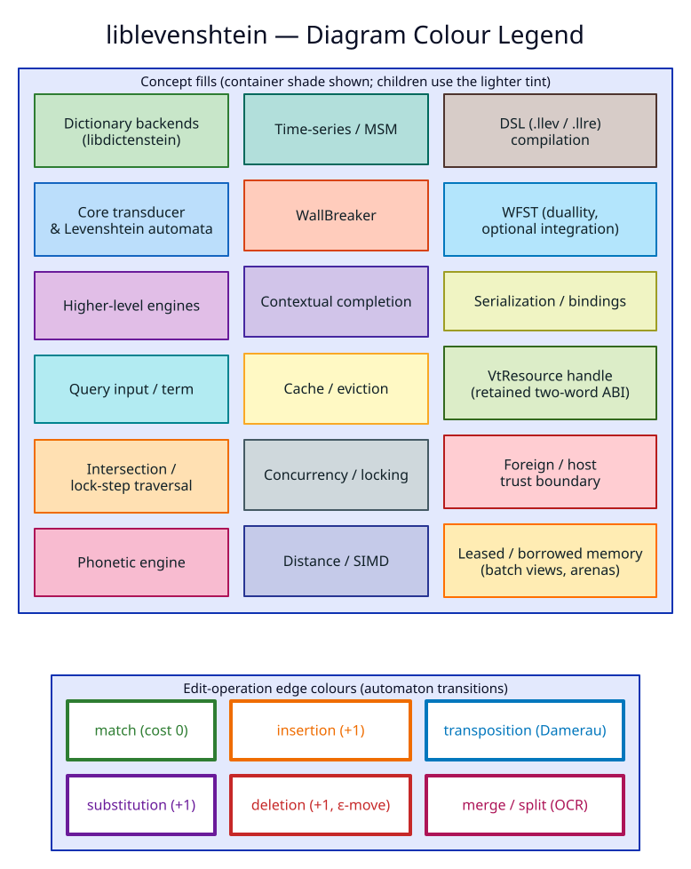

# Diagram Style Guide & Tooling

This directory holds every conceptual diagram for `liblevenshtein`, authored as
**plain-text source** and rendered to a **committed sibling SVG**. It is the
single source of truth for *how* the project draws its architecture, automata,
and data-flows, and it implements the pgmcp documentation guideline
`diagrams-pgmcp-catalog` ("determine the best diagrams for each illustration and
refer to the diagramming catalog in pgmcp for available tooling").

> **Golden rule.** Every diagram is a *text* source with exactly one committed
> `<stem>.svg` beside it. **Never hand-edit an `.svg`.** Edit the source and run
> [`./render.sh`](render.sh). Continuous integration runs `./render.sh --check`,
> which re-renders to a scratch tree and fails if any committed SVG drifts from
> its source.

---

## 1. Contents & layout

Sources are grouped by subsystem. Each subdirectory owns the diagrams for one
concern; a diagram that spans concerns lives with the concern it *teaches*.

| Directory | Subsystem illustrated |
|---|---|
| `architectures/` | crate boundary, layered component stack, C4 views, feature-flag & module graphs |
| `automata/` | Levenshtein NFAs, position-sets, subsumption, the three automaton implementations, WallBreaker |
| `traversal/` | the lazy-simulation query model and the transducer $`\cap`$ dictionary lock-step walk |
| `dictionary-structures/` | backend taxonomy & decision tree, trait relationships, DAWG/SCDAWG internals |
| `concurrency/` | the locking / wait-free read model |
| `distance/` | `standard_distance` SIMD/Myers dispatch |
| `phonetic/` | NFA-product pipeline, `.llev`/`.llre` compilation, articulatory features |
| `time-series/` | Move–Split–Merge (MSM) operations, wavefront, indexing |
| `contextual/` | hierarchical scope tree, draft/checkpoint lifecycle |
| `cache/` | `FuzzyMultiMap` and the eviction-wrapper decorator stack |
| `serialization/` | persistence formats |
| `grep/` | the streaming decompress/extract/match pipeline |
| `bindings/` | the WASM / FFI boundary |
| `_legend/` | the canonical colour legend (`color-legend.svg`) |

---

## 2. Tooling — the pgmcp diagramming catalog

The pgmcp diagramming toolbox is installed locally; this project uses the
subset below. **Choose the tool by what the diagram *is*, not by habit** — the
right notation makes a diagram self-explanatory.

| Concept to illustrate | Tool | Source ext | Why this tool |
|---|---|---|---|
| component · sequence · state · class | **PlantUML** | `.puml` | stable UML notation; matches the project's first four diagrams |
| C4 model views (context / container) | **Structurizr** | `.dsl` | a single model yields consistent C4 views; exported through PlantUML |
| polished conceptual architecture | **D2** | `.d2` | concise source, strong automatic layout (ELK), good visual defaults |
| dependency graphs · decision trees · Hasse lattices | **Graphviz DOT** | `.dot` | deterministic, best-in-class directed-graph layout |
| GitHub-native quick sketch | **Mermaid** | `.mmd` | renders inline on GitHub; lowest authoring friction |
| precise small structural figure | **Pikchr** | `.pikchr` | exact geometric control for tight diagrams |
| publication-grade mathematical figure | **Asymptote** | `.asy` | native mathematical typesetting (grids, vectors, curves) |

All seven renderers plus `inkscape`/`rsvg-convert` are confirmed present. The
exact per-tool invocation lives in [`render.sh`](render.sh); never invoke a
renderer by hand — the script is what CI verifies.

### Rendering

```sh
./render.sh              # render every source in place
./render.sh automata     # render only sources whose path matches "automata"
./render.sh --check      # CI guard: fail if any committed SVG is stale
./render.sh --list       # list every source -> target mapping
make                     # incremental rebuild (only stale SVGs)
make check               # delegates to ./render.sh --check
make automata            # render one subsystem directory
```

---

## 3. Colour legend

Colour is **semantic**: one hue per concept, used consistently across every
diagram so a reader learns the palette once. Containers use the darker shade and
their children the lighter tint (the convention established by
`architectures/component-stack.puml`). The rendered legend is the canonical
reference:



| Concept | Container fill | Child tint | Border / arrow |
|---|---|---|---|
| Dictionary backends (`libdictenstein`) | `#C8E6C9` | `#E8F5E9` | `#2E7D32` |
| Core transducer & Levenshtein automata | `#BBDEFB` | `#E3F2FD` | `#1565C0` |
| Higher-level engines (umbrella) | `#E1BEE7` | `#F3E5F5` | `#6A1B9A` |
| Query input / term | `#B2EBF2` | — | `#00838F` |
| Intersection / lock-step traversal | `#FFE0B2` | `#FFF3E0` | `#EF6C00` |
| Phonetic engine | `#F8BBD0` | `#FCE4EC` | `#AD1457` |
| Time-series / MSM | `#B2DFDB` | `#E0F2F1` | `#00695C` |
| WallBreaker | `#FFCCBC` | `#FBE9E7` | `#D84315` |
| Contextual completion | `#D1C4E9` | `#EDE7F6` | `#4527A0` |
| Cache / eviction | `#FFF9C4` | `#FFFDE7` | `#F9A825` |
| Concurrency / locking | `#CFD8DC` | `#ECEFF1` | `#455A64` |
| Distance / SIMD | `#C5CAE9` | `#E8EAF6` | `#283593` |
| DSL (`.llev` / `.llre`) compilation | `#D7CCC8` | `#EFEBE9` | `#4E342E` |
| WFST (`duallity`, optional) | `#B3E5FC` | `#E1F5FE` | `#0277BD` |
| Serialization / bindings | `#F0F4C3` | `#F9FBE7` | `#9E9D24` |

**Edit-operation edge colours** (automaton transitions): match `#2E7D32` ·
substitution `#6A1B9A` · insertion `#EF6C00` · deletion `#C62828` ·
transposition `#0277BD` · merge/split `#AD1457`.

When you add a diagram that introduces a genuinely new concept, add its colour
here **and** to `_legend/color-legend.d2`, then re-render — the two must agree.

---

## 4. House style per tool

Start every source from these blocks so the suite looks uniform: white
background, no shadows, `DejaVu Sans`, rounded rectangles, dark slate borders
(`#455A64`), 2 px arrows.

**PlantUML** (`.puml`) — copy this preamble verbatim (see
`architectures/component-stack.puml`):

```text
skinparam backgroundColor #FFFFFF
skinparam shadowing false
skinparam defaultFontName "DejaVu Sans"
skinparam rectangle {
  RoundCorner 14
  BorderColor #455A64
  FontColor #102027
}
skinparam ArrowColor #37474F
skinparam ArrowThickness 2
```

> PlantUML requires each `skinparam` block property on its own line; the inline
> single-line form (`skinparam rectangle { … … }`) does not parse.

For state diagrams add `hide empty description` and a `skinparam state { … }`
block (see `automata/levenshtein-nfa.puml`).

**D2** (`.d2`): set `style.fill` / `style.stroke` / `style.font-color` per node
from the legend; prefer `direction: down` and let the ELK layout place nodes.

**Graphviz** (`.dot`): begin with
`graph [bgcolor=transparent, fontname="DejaVu Sans"];`
`node [shape=box, style="rounded,filled", fontname="DejaVu Sans", color="#455A64"];`
`edge [fontname="DejaVu Sans", color="#37474F"];`
then set each node's `fillcolor` from the legend.

**Asymptote** (`.asy`): white background, `defaultpen(fontsize(10pt))`; colour
points/curves with the legend hues via `rgb("RRGGBB")`.

### Math in labels

Diagram math follows a **HYBRID** rule, mirroring the prose MathJax convention but adapted to the
renderers' limits:

- **A genuine multi-symbol formula** — big-O, an (in)equality between math terms, a set-builder, a
  bracketed position tuple, a transition equation — is typeset as **one cohesive LaTeX unit**.
  **Never split ASCII text and LaTeX inside a single expression** (the anti-pattern
  `O(<latex>\vert W\vert</latex>)` — plain `O(` around a LaTeX `|W|` — is what this rule forbids;
  write `<latex>\mathcal{O}(\vert W\vert)</latex>`). Use `\text{…}` for prose words that sit
  *inside* a formula, e.g. `<latex>\{ (\text{term}, \text{distance}) : \text{distance} \le k \}</latex>`.
- **A lone standalone symbol** beside prose — a single relation/operator (`∩ ∈ ≤ × ↔ ⇒ ⇄ ∧ ∅`), a
  lone Greek letter (`χ δ ε λ`), or a standalone sub/superscripted identifier Unicode can render
  (`q₀`, `Pᵢ`, `sym₁`) — stays a **Unicode literal at the body font size (14 px)**. Bare single
  variables (`k`, `W`, `D`) likewise stay plain text.

Why the split: PlantUML/JLaTeXMath renders each `<latex>` as a **fixed-size raster image ~1.4× the
14 px body text**, and there is **no** skinparam/scale knob to shrink it. Wrapping a lone glyph
therefore just floats an oversized symbol in the text; wrapping a whole formula earns the size
because Unicode cannot typeset it cleanly. Keep body text the dominant 14 px size so a
font-matching viewer normalises the figure to prose scale.

Per tool:

- **PlantUML** (`.puml`) — bundled JLaTeXMath. `<latex>…</latex>` inline, `<math>…</math>` display,
  e.g. `rectangle "construction:  <latex>\mathcal{O}(\vert W\vert)</latex>" as A`. **JLaTeXMath is
  NOT full MathJax:** use `\vert … \vert` for bars — **not** `\lvert`/`\rvert`, which throw
  `Unknown symbol 'lvert'` — and `\mathcal{O}(…)` for big-O. Output is embedded vector SVG, so it
  stays byte-reproducible under `render.sh --check`.
- **Structurizr** (`.dsl`) exports through PlantUML and inherits the same `<latex>` facility.
- **Asymptote** (`.asy`) typesets LaTeX directly via `$…$`: `label("$\mathcal{O}(n)$", position)`.
- **Graphviz** (`.dot`), **D2** (`.d2`), **Pikchr**, and **Mermaid** have **no** LaTeX-label
  facility, so a formula in one of their labels stays a compact Unicode literal — keep it
  short, and prefer a PlantUML source when a label is math-heavy:

  ```dot
  q9 [label="⟨i, e⟩ — 𝒪(k) per step"];   // Unicode literal: DOT/D2 have no LaTeX facility
  ```

---

## 5. Authoring checklist

Before committing a diagram, confirm it:

1. **Renders cleanly** — `./render.sh <name>` exits 0 and the SVG passes
   `xmllint --noout`.
2. **Is fully coloured** — every node/edge uses a legend colour; no default greys
   except neutral scaffolding (axes, frames).
3. **Has a leading comment** documenting the concept and its colour mapping
   (the four seed diagrams are the template).
4. **Is complete & end-to-end** — flows start at an explicit input and reach an
   explicit output with no orphan nodes; accepting states are highlighted green.
5. **Carries a descriptive `title`** (or top markdown title for D2).
6. **Uses the legend's edit-edge colours** for any automaton transitions.
7. **Defines its actors** — node labels name real types/modules so the diagram
   maps onto the code.

---

## 6. Embedding diagrams in documentation

Reference the **committed SVG** (never the source) with a descriptive
alt-text, using a path relative to the embedding document. From `README.md`:

```markdown

```

From a page under `docs/algorithms/04-distance-calculation/`:

```markdown

```

Put a one-line caption beneath each image. GitHub renders committed SVGs inline,
so no build step is needed to read the docs. Rustdoc references the same SVGs
from the markdown docs rather than embedding them, because docs.rs does not bundle
`docs/` assets; the 2–3 most central modules may embed via an absolute raw-GitHub
`` URL if desired.
