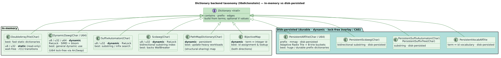
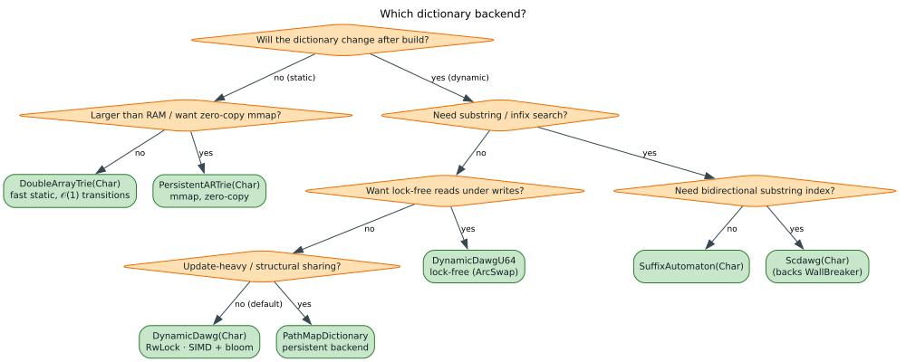

# 02 · Dictionaries: Static, Dynamic, and on Disk

**What you'll learn.** How to pick the right dictionary backend for your access
pattern, and how to mutate one **at runtime** while queries are in flight. We focus on
`DynamicDawg`, which supports concurrent insertions and removals, and close with a note
on **serializing** a static dictionary to disk and loading it back. By the end you will
know when to reach for a static backend versus a dynamic one, and why a `Transducer`
keeps seeing fresh terms even after the dictionary changes underneath it.

---

## The concept

### The backend taxonomy

A *dictionary* in `liblevenshtein` is any structure the transducer can walk
symbol-by-symbol. They divide along two axes — **alphabet** (ASCII `u8` vs Unicode
scalar `char`/`u32`) and **mutability** (read-only after construction vs updatable at
runtime):

| Backend | Alphabet | Mutability | Best for |
|---|---|---|---|
| **`DoubleArrayTrie`** / `…Char` | `u8` / `u32` | static (read-only) | large fixed dictionaries; fastest reads |
| **`DynamicDawg`** / `…Char` | `u8` / `u32` | dynamic (insert / remove) | dictionaries that change while serving queries |
| **`SuffixAutomaton`** / `…Char` | `u8` / `u32` | static | *substring* search |
| **`PathMap`** (feature `pathmap-backend`) | bytes | dynamic | fuzzy *maps* (terms → values), snapshots |

> Terms defined. **DAWG** = *Directed Acyclic Word Graph*, a trie whose equivalent
> suffixes are shared, shrinking the node count. **DAT** = *Double-Array Trie*, a trie
> packed into two integer arrays giving $`\mathcal{O}(1)`$ lookups per transition. "Static" here
> means *read-only once built* — not *compile-time*; you still build it at runtime from a
> word list.



### How dynamic updates stay query-safe

`DynamicDawg<V>` is generic over a value type `V` (use `()` for a plain set with no
attached values). It is `Clone` and internally reference-counted: cloning the dictionary
and cloning it *into* a `Transducer` both share the **same** underlying graph.
Consequently an `insert` or `remove` on one handle is immediately visible through every
other handle — including the one the transducer holds — so a long-lived transducer never
goes stale. Reads are lock-free and never block on a writer; a writer publishes each
update with a single atomic swap (compare-and-swap), so an in-flight query always sees a
consistent snapshot.

### Why this matters

IDE symbol tables, autocomplete indexes, and live search corpora all change *while*
being queried. A static trie would force a full rebuild on every edit; `DynamicDawg`
lets you `insert` / `remove` individual terms in place and keep serving queries from the
same transducer.



---

## Walking through `examples/dynamic_dictionary.rs`

### 1 · Build a dynamic dictionary and share it with a transducer

`DynamicDawg::<()>` is a value-less dynamic set. We `clone()` it into the transducer;
both handles point at one shared graph.

```rust
use liblevenshtein::prelude::*;

let dict: DynamicDawg<()> = DynamicDawg::from_terms(vec!["cat", "dog", "bird"]);
let transducer = Transducer::new(dict.clone(), Algorithm::Standard);

println!("Term count: {}", dict.term_count());   // 3
```

### 2 · Mutate at runtime — the same transducer sees the change

Insert new terms on the `dict` handle; the *existing* `transducer` immediately matches
them, with **no rebuild and no re-wrapping**:

```rust
let before: Vec<_> = transducer.query("cot", 1).collect();   // matches near "cat"/"dog"

dict.insert("cot");
dict.insert("coat");
dict.insert("bat");

let after: Vec<_> = transducer.query("cot", 1).collect();    // now includes "cot" itself
```

Removal works symmetrically and is likewise visible at once:

```rust
dict.remove("bird");
let hits: Vec<_> = transducer.query("brd", 1).collect();      // "bird" no longer returned
```

### 3 · Concurrent reads while another thread writes

Because reads on the shared graph are lock-free and the handles are `Send + Sync`, one
thread can `insert` while another queries — no external synchronization required:

```rust
use std::thread;

let dict2: DynamicDawg<()> = DynamicDawg::from_terms(vec!["test"]);
let transducer2 = Transducer::new(dict2.clone(), Algorithm::Standard);
let writer = dict2.clone();

let handle = thread::spawn(move || {
    for word in ["testing", "tested", "tester", "tests"] {
        writer.insert(word);                       // atomic-swap publish
    }
});

// Meanwhile, the main thread keeps querying:
let _matches: Vec<_> = transducer2.query("test", 0).collect();   // lock-free read
handle.join().expect("writer thread panicked");

let all: Vec<_> = transducer2.query("test", 2).collect();        // sees everything added
```

> Concurrency note. Reads on `DynamicDawg` are *lock-free* — they never block on a writer
> and run fully in parallel. The static backends and `DynamicDawgU64` use the same
> lock-free read model — see [07 · Performance](../07-performance/README.md).

---

## Persisting a dictionary (`examples/serialization.rs`)

A *static* `DoubleArrayTrie` can be written to disk and reloaded — handy for shipping a
prebuilt dictionary rather than rebuilding it on every startup. The
`BincodeSerializer` implements a compact symmetric `serialize` / `deserialize` pair:

```rust
use liblevenshtein::prelude::*;
use std::fs::File;

let dict = DoubleArrayTrie::from_terms(vec!["apple", "apply", "banana", "band"]);

BincodeSerializer::serialize(&dict, File::create("dict.bin")?)?;

let loaded: DoubleArrayTrie = BincodeSerializer::deserialize(File::open("dict.bin")?)?;
assert!(loaded.contains("banana"));
```

The binary round trip preserves the terms, so fuzzy queries behave identically after a
reload. Enable `protobuf` and use `ProtobufSerializer` when a portable binary schema is
required. Dictionary persistence deliberately excludes JSON, TOML, and newline text.

---

## Run it

The dynamic-dictionary example needs no features:

```bash
cargo run --example dynamic_dictionary
```

The serialization example requires the `serialization` feature:

```bash
cargo run --example serialization --features serialization
```

---

## Key takeaways

- Choose **`DoubleArrayTrie`** for static word lists (fastest reads),
  **`DynamicDawg`** when the dictionary changes at runtime, and the `…Char` variants for
  Unicode alphabets.
- A `DynamicDawg` handle and its `Transducer` share one reference-counted, lock-free
  graph: `insert` / `remove` are seen immediately, with concurrent lock-free reads.
- `BincodeSerializer` saves and loads static dictionaries with identical query behavior;
  `ProtobufSerializer` is the cross-language binary alternative.

---

[← 01 · Getting Started](../01-getting-started/README.md) · Next: [03 · Algorithms →](../03-algorithms/README.md)

[← Documentation Index](../../README.md)
