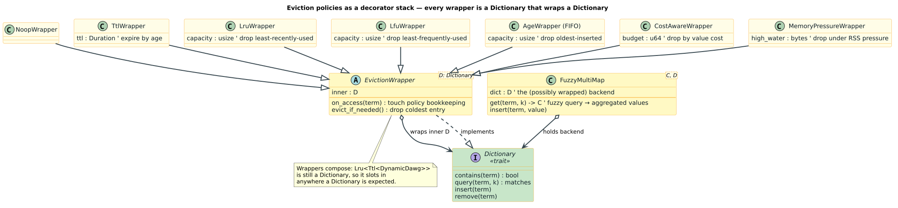

# 05 · Values & Fuzzy Maps

**What you'll learn.** How to attach a **value** to every dictionary term — turning a
fuzzy *set* into a fuzzy *map* — and how to use those values to filter, prioritize, and
rank near-match results. The running example is IDE code completion, where each
identifier carries a **scope ID** and we want only the completions visible in the current
scope. You'll also see *why* filtering during traversal (rather than after) is the path
to a 10–100× speedup on large dictionaries, which motivates the value-filtered pruning
diagram.

---

## The concept

### From fuzzy set to fuzzy map

A plain dictionary answers *"is `s` within distance `k` of `W`?"*. A **fuzzy map**
additionally stores a value `V` per term, so a match returns *both* the term and its
payload. `PathMapDictionary<V>` (feature `pathmap-backend`) is one such backend: it maps
each term to a value of your choosing (here `u32` scope IDs) and is built with
`from_terms_with_values`. Retrieve a stored value with `get_value(&term)`.

> Terms defined. A **value** is arbitrary data associated with a key term (an integer
> scope ID, a document-ID set, a definition, …). A **scope** in an IDE is a region of
> code over which a name is visible (the standard library, the current file, an imported
> module). "Fuzzy map" = dictionary-with-values queried by edit distance.

### Three ways to combine fuzzy matching with values

The example contrasts strategies for "find typo-tolerant matches, but only in the current
scope":

1. **Post-filtering** — query *all* matches within distance `k`, then drop those whose
   value fails the predicate. Simple, but you pay to generate matches you immediately
   throw away.
2. **Pre-filtering** — build a separate sub-dictionary per scope up front. Fast to query,
   but memory-intensive and must be rebuilt whenever the corpus changes.
3. **Value-aware traversal (fuzzy maps)** — store the value *in* the dictionary and let
   the predicate prune branches *during* the lock-step walk, so unmatched-scope subtrees
   are never explored. This combines the speed of pre-filtering with the memory profile
   of post-filtering.

For small dictionaries the three are indistinguishable; for 10k+ terms strategy 3 is
where the 10–100× win lives, because work again tracks the *surviving* frontier.

### Why values belong in the dictionary

Carrying the scope ID as a value means a *single* dictionary serves *every* scope — no
per-context rebuild — and the same payload can drive **ordering** (e.g. prefer local
names over imports) after the fuzzy match, all from one query.



---

## Walking through `examples/fuzzy_maps_code_completion.rs`

### 1 · Build a fuzzy map from `(term, value)` pairs

Each identifier is tagged with a scope ID (`1` = std, `2` = local, `3` = imports). The
dictionary is a `PathMapDictionary<u32>`; the transducer drives fuzzy queries over it.

```rust
use liblevenshtein::dictionary::pathmap::PathMapDictionary;
use liblevenshtein::prelude::*;

let identifiers_with_scopes = vec![
    ("println", 1u32), ("print", 1), ("format", 1),       // std
    ("process_data", 2), ("parse_input", 2), ("print_results", 2), // local
    ("fetch_data", 3), ("parse_json", 3), ("format_date", 3),      // imports
];

let dict: PathMapDictionary<u32> =
    PathMapDictionary::from_terms_with_values(identifiers_with_scopes.clone());
let transducer = Transducer::new(dict.clone(), Algorithm::Standard);
```

### 2 · Post-filtering baseline — query, then look up the value

`query_with_distance` yields candidates; `dict.get_value(&term)` recovers each term's
scope so we can keep only the current scope (`2`). This is the *baseline* the example
times:

```rust
let query = "prin";
let current_scope = 2u32;

let mut results = Vec::new();
for candidate in transducer.query_with_distance(query, 2) {
    if let Some(scope_id) = dict.get_value(&candidate.term) {
        if scope_id == current_scope {                       // filter by value
            results.push((candidate.term, candidate.distance, scope_id));
        }
    }
}
```

### 3 · Filter idiomatically with `filter_map`

The same logic across all three scopes reads cleanly as an iterator adapter — match,
fetch value, keep on predicate:

```rust
for scope_id in 1..=3 {
    let matches: Vec<_> = transducer
        .query_with_distance(query, 2)
        .filter_map(|c| {
            dict.get_value(&c.term)
                .filter(|&s| s == scope_id)
                .map(|s| (c.term, c.distance, s))
        })
        .collect();
    // … report matches for this scope …
}
```

### 4 · Rank by value, then distance

Because the value travels with each match, you can impose a *priority* over scopes
(local > std > imports) and break ties by edit distance, then alphabetically:

```rust
let mut all: Vec<_> = transducer
    .query_with_distance(query, 2)
    .filter_map(|c| dict.get_value(&c.term).map(|s| (c.term, c.distance, s)))
    .collect();

let scope_priority = |s: u32| match s { 2 => 0, 1 => 1, 3 => 2, _ => 3 };
all.sort_by(|a, b| {
    scope_priority(a.2)
        .cmp(&scope_priority(b.2))     // 1) scope priority
        .then(a.1.cmp(&b.1))           // 2) edit distance
        .then(a.0.cmp(&b.0))           // 3) alphabetical
});
```

The example measures post-filtering vs manual iteration and reports the fraction of
matches the scope filter removes — the lever that, at scale, value-aware traversal turns
into a 10–100× speedup by never descending unmatched-scope subtrees.


---

## Run it

This example requires the `pathmap-backend` feature:

```bash
cargo run --example fuzzy_maps_code_completion --features pathmap-backend
```

> **crates.io note.** `pathmap-backend` uses a git dependency, so it is unavailable from a
> plain `crates.io` install — build from source to enable it.

---

## Key takeaways

- A **fuzzy map** (`PathMapDictionary<V>` via `from_terms_with_values`) stores a value per
  term; `get_value(&term)` recovers it for a match.
- **Post-filtering** wastes work generating matches you discard; **value-aware traversal**
  prunes by value *during* the walk — same results, far less work at scale (10–100× on
  large dictionaries).
- Values double as a **ranking key**: sort matches by scope priority, then distance, then
  lexicographically, all from one query.

---

[← 04 · Queries & Unicode](../04-queries/README.md) · Next: [06 · Contextual Completion →](../06-contextual/README.md)

[← Documentation Index](../../README.md)
