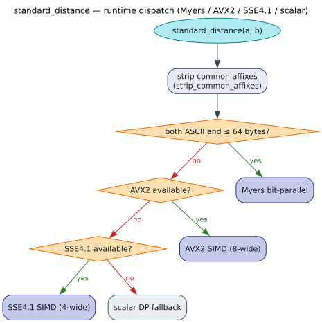

# 07 · Performance & Concurrency

**What you'll learn.** How to benchmark `liblevenshtein` on a real, large dictionary
(~124k English words), what the headline performance numbers are and *why* they hold, and
how the library's concurrency model lets you share a dictionary across threads with
little or no locking. The running example loads a real word list, builds a
`DoubleArrayTrie`, and times both exact `contains` checks and fuzzy `query` calls.

---

## The concept

### What drives query cost

The automaton-based approach has a precise cost model — the whole reason it scales:

| Operation | Complexity |
|---|---|
| Per-query setup | $`\mathcal{O}(\lvert W\rvert)`$ — linear in query length |
| Per-symbol transition | $`\mathcal{O}(k)`$ — constant for fixed $`k`$ |
| Traversal | $`\mathcal{O}(\lvert D\rvert)`$ worst case — pruned to the near-match frontier in practice |
| Live state space | $`\mathcal{O}(\lvert W\rvert)`$ for fixed $`k`$ |

> Terms recalled. $`\lvert W\rvert`$ = query length, $`k`$ = error bound, $`\lvert D\rvert`$ = number of dictionary
> edges. Because each automaton step is $`\mathcal{O}(k)`$ and dead branches are pruned immediately,
> total work tracks the *explored near-match frontier* — not the dictionary size.

### Backend choice dominates fuzzy throughput

The backend you pick changes fuzzy-match speed by **one to two orders of magnitude**.
Measured on a 10,000-word dictionary (AMD Ryzen Threadripper PRO 5975WX,
`target-cpu=native`):

| Backend | Construction | Exact match | Distance 1 | Distance 2 |
|---|---:|---:|---:|---:|
| **`DoubleArrayTrie`** | 3.33 ms | 4.13 µs | 8.07 µs | 12.68 µs |
| **`DynamicDawg`** | 4.17 ms | 21.78 µs | 321 µs | 2,912 µs |
| **`PathMap`** | 3.33 ms | 59.01 µs | 863 µs | 5,583 µs |

For *static* dictionaries `DoubleArrayTrie` is the clear leader — here 38–175× faster
fuzzy matching than the dynamic alternatives — because its two-array packing gives
$`\mathcal{O}(1)`$ transitions with cache-friendly, branch-light access. The dynamic backends trade
some of that for runtime mutability; bloom-filter pre-filtering and runtime SIMD
(AVX2/SSE4.1, auto-detected — no feature flag) narrow the gap.



### Concurrency model

Every dictionary is `Send + Sync` and cheap to clone (handles share one backing store).
Reads never block on a writer on any in-memory backend:

- **wait-free** on the static `DoubleArrayTrie`, which is immutable once built, so any
  number of threads query in parallel with zero contention; and
- **lock-free** on the dynamic backends (`DynamicDawg`, `DynamicDawgU64`,
  `SuffixAutomaton`, `Scdawg`, `PathMapDictionary`), which serve each read from an
  atomically-swapped snapshot (`ArcSwap` / CAS) while a writer publishes new state with a
  single atomic swap.

This is why the [dynamic-dictionary example](../02-dictionaries/README.md) can query from
one thread while another inserts, with no external synchronization.


---

## Walking through `examples/real_world_benchmark.rs`

### 1 · Load a real dictionary and build the trie

A real corpus (~124k lowercase alphabetic words) is read from disk, then packed into a
`DoubleArrayTrie`. Construction time is measured directly:

```rust
use liblevenshtein::prelude::*;
use std::fs;

let real_words: Vec<String> = fs::read_to_string("data/english_words.txt")
    .expect("read english_words.txt")
    .lines()
    .map(|s| s.trim().to_lowercase())
    .filter(|s| !s.is_empty() && s.chars().all(|c| c.is_ascii_alphabetic()))
    .collect();

let start = std::time::Instant::now();
let real_dat = DoubleArrayTrie::from_terms(real_words.clone());
println!("Built in {:?}, {} terms", start.elapsed(), real_dat.len().unwrap_or(0));
```

### 2 · Time exact membership

`contains` is the exact-match ($`k = 0`$) fast path. The benchmark hammers it 100×
over 10,000 words and reports microseconds *per call*:

```rust
let test_words: Vec<_> = real_words.iter().take(10_000).collect();
let start = std::time::Instant::now();
let mut found = 0;
for _ in 0..100 {
    for word in &test_words {
        if real_dat.contains(word) { found += 1; }
    }
}
let elapsed = start.elapsed();
println!("{:.2} µs/call", elapsed.as_micros() as f64 / (test_words.len() * 100) as f64);
```

### 3 · Time fuzzy queries at distance 2

Now the fuzzy path: 1,000 spread-out query words, each searched within distance 2, fully
draining the iterator so *all* matches are produced and counted:

```rust
let query_words: Vec<_> = real_words
    .iter()
    .step_by(real_words.len() / 1000)
    .take(1000)
    .collect();

let transducer = Transducer::new(real_dat, Algorithm::Standard);
let start = std::time::Instant::now();
let mut results = 0;
for word in &query_words {
    for _ in transducer.query(word, 2) { results += 1; }
}
println!("{:.2} µs/query", start.elapsed().as_micros() as f64 / query_words.len() as f64);
```

The example runs the same protocol against a synthetic 10k dictionary so you can compare
how corpus shape (real, irregular English vs uniform `word000123` strings) affects build
and query time on identical machinery.

---

## Run it

No feature flags are required; build in **release** mode for representative numbers, and
pin the CPU for stable measurements:

```bash
cargo run --release --example real_world_benchmark
# stable timings: pin to one core and keep it at max frequency
taskset -c 2 cargo run --release --example real_world_benchmark
```

> The example reads `data/english_words.txt` from the working directory — run it from the
> repository root so the path resolves.

For dedicated micro-benchmarks and flamegraph workloads see `examples/profile.rs`,
`examples/profile_workload.rs`, and the Criterion benches under `benches/`; full
methodology and ledgers live in [`docs/benchmarks/`](../../benchmarks/README.md).

---

## Key takeaways

- Query cost is $`\mathcal{O}(\lvert W\rvert)`$ setup + $`\mathcal{O}(k)`$ per step, pruned to the near-match frontier — it
  scales with **matches, not $`\lvert D\rvert`$**.
- For static dictionaries, **`DoubleArrayTrie`** is the fuzzy-match leader (38–175× over
  the dynamic backends in the cited run); dynamic backends add mutability and lean on
  bloom filters + runtime SIMD.
- Dictionaries are `Send + Sync`: reads are **lock-free** on every in-memory backend
  (wait-free on the static `DoubleArrayTrie`) — share freely across threads.
- Always benchmark in `--release`, pinned to a core, reading the corpus from the repo
  root.

---

[← 06 · Contextual Completion](../06-contextual/README.md) · Next: [08 · Real-World: Phonetic Spellcheck →](../08-real-world/README.md)

[← Documentation Index](../../README.md)
