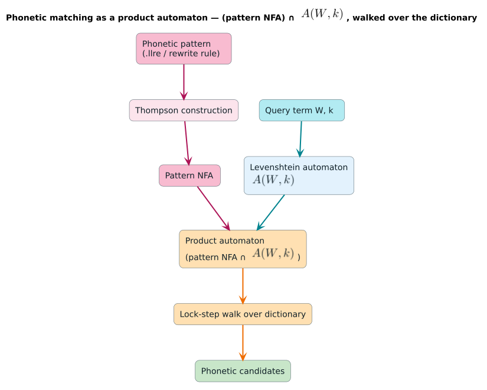
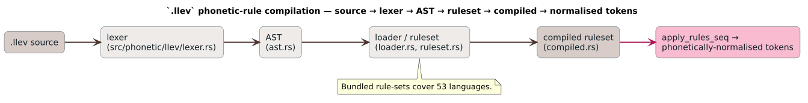

# 08 · Real-World Project: Phonetic Spellcheck

**What you'll learn.** How the pieces from the previous tutorials combine into a complete,
production-shaped application: a **phonetic** spell checker over ~124k English words. You
will see how *sound-alike* normalization (`phone` and `fone` both reduce to `fon`) is
fused with Levenshtein edit distance to catch errors that pure edit distance misses, how
the `PhoneticNormalizedDictionary` indexes terms for fast fuzzy and regex queries, and how
the rule sets that power it are *formally verified*. This is the capstone — a standalone
Cargo project under `examples/phonetic_spellcheck/`.

---

## The concept

### Why phonetics on top of edit distance?

Edit distance alone struggles with English spelling: `philosophy` vs `filosofy` is four
edits, well past a typical $`k`$, yet they *sound identical*. The fix is to **normalize**
both the query and the dictionary by a set of **phonetic rewrite rules** before comparing,
so look-alike/sound-alike spellings collapse to a shared canonical form and then a *small*
edit budget suffices.

> Terms defined.
> - **Phonetic normalization** — applying context-sensitive rewrite rules (e.g. `ph → f`,
>   silent `gh` after a vowel, `tion → shun`) to map a word to an approximate
>   pronunciation key. `phone → fon`, `knight → nit`, `through → tru`.
> - **`.llev`** — the crate's small language of phonetic rewrite rules
>   (*l*ib*lev*enshtein rules); a `RuleSetChar` is a compiled, Unicode-aware rule set.
> - **Homophones** — distinct spellings pronounced alike (`their`/`there`/`they're`).
> - **Text speak** — informal abbreviations (`u → you`, `thru → through`, `nite → night`).
> - **BK-tree** — a metric tree (Burkhard–Keller) that indexes points by distance so a
>   range query touches $`\mathcal{O}(k \cdot \log n)`$ nodes instead of all $`n`$.

### How `PhoneticNormalizedDictionary` is built

`PhoneticNormalizedDictionary<V>` (features `phonetic-rules`, `pathmap-backend`,
`embedded-rules`) is a **dual-index** structure:

1. a map from each **normalized form** back to the original term(s) for $`\mathcal{O}(1)`$ exact
   lookups, and
2. a **BK-tree** over the normalized forms for accelerated fuzzy (range) queries.

You build it from a word list plus a combined rule set; it normalizes every term once at
construction and stores both indices. Queries then normalize the *input*, search the BK-tree
in normalized space, and map survivors back to real words.

### The three English rule sets, combined

The demo merges three `.llev` rule sets into one (`base` + `homophones` + `text_speak`,
117 rules total):

- **Base (62 rules)** — general English orthography normalization following Mark
  Rosenfelder's ("Zompist") scheme: affrication (`tion → shun`), `gh`/`ough` patterns,
  digraphs (`ph → f`, `th → t`), initial clusters (`kn → n`, `wr → r`), de-doubling, and
  vowel digraphs.
- **Homophones (24 rules)** — `to`/`too`/`two`, `your`/`you're`, `its`/`it's`, …
- **Text speak (31 rules)** — `u → you`, `2 → to`, `thru → through`, `nite → night`, …

### Why this design

A normalized index turns an otherwise $`\mathcal{O}(\lvert D\rvert)`$ phonetic scan into an exact-map hit plus a
bounded BK-tree range query, and storing *both* indices means the same dictionary answers
exact, fuzzy, and **regex** queries. The rules being formally proven (see below) means
normalization is guaranteed to terminate and stay bounded.



---

## Walking through `examples/phonetic_spellcheck/src/main.rs`

### 1 · Load words and combine the rule sets

The dictionary file is read one word per line; the three English rule sets are merged into
a single `RuleSetChar` via `merge`:

```rust
use liblevenshtein::phonetic::llev::RuleSetChar;
use liblevenshtein::phonetic::rules::english;

fn combined_english_rules() -> RuleSetChar {
    let mut combined = english::base().clone();
    combined.merge(english::homophones().clone());
    combined.merge(english::text_speak().clone());
    combined        // 117 rules: base + homophones + text_speak
}
```

### 2 · Build the normalized dictionary

`from_terms_with_rules` normalizes every term with the combined rules and populates both
the exact map and the BK-tree. `normalized_count()` reports how many *distinct* normalized
forms the ~124k words collapse into:

```rust
use liblevenshtein::dictionary::phonetic_normalized::PhoneticNormalizedDictionary;
use libdictenstein::Dictionary;

let dict = PhoneticNormalizedDictionary::<()>::from_terms_with_rules(&words, combined_rules.rules);

println!("original terms: {}", dict.len().unwrap_or(0));
println!("normalized forms: {}", dict.normalized_count());
```

### 3 · Fuzzy queries that "hear" the typo

`query(term, max_distance)` normalizes the input, range-searches the BK-tree, and returns
candidates carrying `.term`, `.distance`, *and* `.normalized_form`. `fone` finds `phone`
at distance 0 because both normalize to `fon`:

```rust
let results = dict.query("fone", 2);
println!("normalized query: \"{}\"", dict.normalize("fone"));   // "fon"
for candidate in results.iter().take(5) {
    println!("  {} (distance: {}, normalized: \"{}\")",
             candidate.term, candidate.distance, candidate.normalized_form);
}
// philosophy is recovered from "filosofy"; "enuf" → "enough"; "teh" → "the".
```

### 4 · Inspect normalization, run regex, expand a phonetic pattern

The same dictionary exposes three more entry points — direct `normalize`, fuzzy `query_regex`
over normalized forms, and `expand_to_phonetic_pattern` which turns a query into an
alternation matching *original* spellings:

```rust
assert_eq!(dict.normalize("knight"), "nit");          // 1) normalize a string

// 2) regex over normalized forms (returns a Result):
if let Ok(matches) = dict.query_regex("(ph|f)one", 0) {
    for c in matches.iter().take(5) { println!("{}", c.term); }   // phone, fone, …
}

// 3) expand "fone" → e.g. "(f|ph)o(n|ne)" and query ORIGINAL terms with it:
let pattern = dict.expand_to_phonetic_pattern("nite");            // → "(n|kn)i(t|te|ght)"
if let Ok(matches) = dict.query_original_regex(&pattern, 0) {
    let terms: Vec<_> = matches.iter().take(10).map(|c| c.term.as_str()).collect();
    println!("{:?}", terms);                                      // ["night","knight","nite"]
}
```

The `.llev` rules that drive all of this are compiled from a tiny, readable DSL — for
example the base set includes lines such as:

```text
ph -> f;                       # phone → fone
gh -> / [:vowel:]_;            # silent gh after a vowel: night → nit
```



---

## Run it

This example lives in its own Cargo package and needs three features. From the project
root:

```bash
cargo run --example phonetic_spellcheck \
  --features "phonetic-rules,pathmap-backend,embedded-rules" --release
```

Or from inside the example directory (its `Cargo.toml` enables the features by default):

```bash
cd examples/phonetic_spellcheck
cargo run --release
```

> **crates.io note.** `pathmap-backend` uses a git dependency, so this example must be
> built from source. Build in `--release` — normalizing ~124k words and constructing the
> BK-tree is meaningfully faster optimized.

---

## Formal verification

The phonetic rules are proven correct in Coq/Rocq with five theorems —
**well-formedness**, **bounded expansion** (output $`\le`$ input + 20 chars), **non-confluence**
(rule order matters, shown constructively), **termination** (sequential application always
halts), and **idempotence** (fixed points are stable). The complete proofs live under
[`docs/verification/phonetic/`](../../verification/phonetic/README.md). This is what lets the
dictionary treat normalization as a total, bounded function.

---

## Where to go next

- `examples/phonetic_fuzzy_matching.rs` — comprehensive phonetic + Levenshtein matching
  (`--features phonetic-rules`).
- `examples/phonetic_rewrite.rs` — apply `.llev` rules to transform text
  (`--features phonetic-rules`).
- The crate README's **Phonetic Matching** section — the `ProductAutomatonChar` product of
  a sound-pattern NFA and `Levenshtein(k)`, plus the 53 built-in languages.

---

## Key takeaways

- Phonetic spellcheck = **normalize then edit-match**: rewrite query and dictionary to a
  pronunciation key so sound-alikes collapse and a small $`k`$ suffices.
- **`PhoneticNormalizedDictionary`** is a dual index (exact map + BK-tree over normalized
  forms) answering `query`, `query_regex`, `normalize`, and `expand_to_phonetic_pattern`.
- Combine `english::base()` + `homophones()` + `text_speak()` (117 `.llev` rules) for
  robust English coverage; the rules are **formally verified** to terminate and stay
  bounded.

---

[← 07 · Performance](../07-performance/README.md) · [Tutorial series index ↑](../README.md)

[← Documentation Index](../../README.md)
