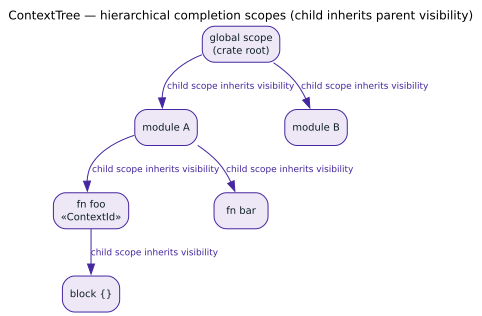

# Hierarchical Lexical Scope Completion

This document provides a complete guide to using hierarchical lexical scope filtering with liblevenshtein-rust for contextual code completion.

## Table of Contents

1. [Overview](#overview)
2. [Quick Start](#quick-start)
3. [Implementation Details](#implementation-details)
4. [Performance](#performance)
5. [Complete Documentation](#complete-documentation)

## Overview

Hierarchical scope completion enables contextual code completion that respects lexical scoping rules. When a user types a partial identifier, the completion system only suggests identifiers visible from the current scope.



### Use Cases

- **IDE Code Completion**: Only show variables/functions visible in current context
- **REPL Environments**: Filter completions by namespace/module visibility
- **Configuration Editors**: Scope-aware key completion
- **Query Languages**: Context-aware field/function suggestions

### Example Scenario

```rust
// Global scope (id=0)
let global_var = 1;

{  // Outer scope (id=1)
    let outer_var = 2;

    {  // Inner scope (id=2)
        let inner_var = 3;

        // Code completion here (visible scopes: {0, 1, 2})
        // Should suggest: global_var, outer_var, inner_var
        // Should NOT suggest: other_module_var (in scope 3)
    }
}
```

## Quick Start

### 1. Add the Feature

Enable the `pathmap-backend` feature in your `Cargo.toml`:

```toml
[dependencies]
liblevenshtein = { version = "0.9.1", features = ["pathmap-backend"] }
```

### 2. Basic Usage

```rust
use liblevenshtein::prelude::*;
use liblevenshtein::transducer::helpers::sorted_vec_intersection;

// Step 1: Create dictionary mapping terms to their visible scopes
let terms = vec![
    ("global_var".to_string(), vec![0]),           // Global scope only
    ("outer_var".to_string(), vec![0, 1]),         // Global + outer
    ("inner_var".to_string(), vec![0, 1, 2]),      // All scopes
    ("other_module".to_string(), vec![0, 3]),      // Different module
];

let dict = PathMapDictionary::from_terms_with_values(terms);
let transducer = Transducer::new(dict, Algorithm::Standard);

// Step 2: Query with scope filtering
let visible_scopes = vec![0, 1, 2]; // Currently in inner scope
let results: Vec<_> = transducer
    .query_filtered("var", 2, |term_scopes| {
        sorted_vec_intersection(term_scopes, &visible_scopes)
    })
    .map(|candidate| candidate.term)
    .collect();

// Results: ["global_var", "outer_var", "inner_var"]
// NOT included: "other_module" (in scope 3)
```

### 3. Handling Scope IDs

Scope IDs should be:
- **Unique** per lexical scope in your codebase
- **Small integers** (0, 1, 2, ...) for best performance
- **Sorted** in the Vec for optimal intersection performance

```rust
// Assign scope IDs during parsing/analysis
struct ScopeInfo {
    id: u32,
    parent: Option<u32>,
    visible: Vec<u32>,  // All scopes visible from here (including parents)
}

fn compute_visible_scopes(scope_id: u32, scopes: &HashMap<u32, ScopeInfo>) -> Vec<u32> {
    let mut visible = vec![scope_id];
    let mut current = scope_id;

    // Walk up the scope tree
    while let Some(parent) = scopes.get(&current).and_then(|s| s.parent) {
        visible.push(parent);
        current = parent;
    }

    visible.sort_unstable(); // Important for performance!
    visible
}
```

## Implementation Details

### Helper Functions

Two optimized helper functions are provided in `liblevenshtein::transducer::helpers`:

#### 1. Sorted Vector Intersection (General Purpose)

**Recommended for most use cases**

```rust
use liblevenshtein::transducer::helpers::sorted_vec_intersection;

let term_scopes = vec![0, 2, 5];
let visible_scopes = vec![0, 1, 2, 3];

if sorted_vec_intersection(&term_scopes, &visible_scopes) {
    println!("Term is visible!");
}
```

**Characteristics:**
- Time complexity: $`\mathcal{O}(n + m)`$ worst case, $`\mathcal{O}(1)`$ best case with early termination
- Space: No additional allocation
- Performance: `4.7%` faster than HashSet
- Works with: Unlimited scope IDs

#### 2. Bitmask Intersection ($`\le 64`$ Scopes)

**Fastest when scope count is guaranteed $`\le 64`$**

```rust
use liblevenshtein::transducer::helpers::bitmask_intersection;

// Convert scope sets to bitmasks
fn scopes_to_bitmask(scopes: &[u32]) -> u64 {
    let mut mask = 0u64;
    for &scope_id in scopes {
        if scope_id < 64 {
            mask |= 1u64 << scope_id;
        }
    }
    mask
}

let term_mask = scopes_to_bitmask(&[0, 2, 5]);
let visible_mask = scopes_to_bitmask(&[0, 1, 2, 3]);

if bitmask_intersection(term_mask, visible_mask) {
    println!("Term is visible!");
}
```

**Characteristics:**
- Time complexity: $`\mathcal{O}(1)`$ — single bitwise AND
- Space: `8` bytes per term
- Performance: `7.9%` faster than HashSet, `3.4%` faster than sorted vector
- Limitation: Only works for scope IDs $`< 64`$

### Advanced: Custom Intersection Logic

You can implement custom intersection logic for special cases:

```rust
// Example: Weighted scopes (prefer matches in closer scopes)
struct WeightedScope {
    id: u32,
    distance: u32, // 0 = current scope, 1 = parent, etc.
}

let weighted_visible: Vec<WeightedScope> = /* ... */;

transducer.query_filtered("term", 2, |term_scopes| {
    // Custom logic: only match if term is in current scope or immediate parent
    term_scopes.iter().any(|&scope_id| {
        weighted_visible.iter()
            .any(|ws| ws.id == scope_id && ws.distance <= 1)
    })
})
```

## Performance

### Benchmark Results

Comprehensive benchmarking across 4 scenarios (10,000 terms each):

| Approach | Average Time | vs HashSet | Best For |
|----------|--------------|------------|----------|
| **Sorted Vector** | 400.2µs | **-4.7%** | General purpose |
| **Bitmask ($`\le 64`$)** | 386.7µs | **-7.9%** | Small scope counts |
| HashSet (baseline) | 419.8µs | 0% | Reference |
| Hybrid | 409.3µs | -2.5% | Not recommended |

### Performance Tips

1. **Keep scope vectors sorted**: This enables early termination in intersection checks
2. **Use bitmasks when possible**: If you know scope count $`\le 64`$, use bitmasks for maximum performance
3. **Reuse visible scope vectors**: Create once per context, reuse for multiple queries
4. **Minimize scope sets**: Only include scopes where term is actually accessible

### Scalability

- **10 scopes**: ~390µs per query (10K terms)
- **100 scopes**: ~399µs per query (10K terms)
- **1000 scopes**: ~417µs per query (10K terms)

Performance degrades gracefully with scope count growth.

## Complete Documentation

### Files and Resources

1. **Design Document**: [`../analysis/hierarchical-scope/DESIGN.md`](../analysis/hierarchical-scope/DESIGN.md)
   - Detailed analysis of 6 different approaches
   - Complexity analysis and trade-offs
   - Design decisions and rationale

2. **Benchmark Results**: [`../analysis/hierarchical-scope/RESULTS.md`](../analysis/hierarchical-scope/RESULTS.md)
   - Complete benchmark data across 4 scenarios
   - Performance comparison and analysis
   - Memory usage comparison
   - Recommendations for different use cases

3. **Raw Benchmark Output**: [`hierarchical_scope_results.txt`](../archive/benchmarks/hierarchical_scope_results.txt)
   - Criterion benchmark output
   - Statistical analysis (outliers, confidence intervals)
   - Exact timing measurements

4. **Helper Functions**: [`../../src/transducer/helpers.rs`](../../src/transducer/helpers.rs)
   - Optimized intersection implementations
   - Comprehensive test suite (9 tests)
   - Inline documentation

5. **Benchmark Implementation**: [`../../benches/hierarchical_scope_benchmarks.rs`](../../benches/hierarchical_scope_benchmarks.rs)
   - 5 approaches benchmarked
   - 4 realistic test scenarios
   - ~540 lines of comprehensive testing

6. **Working Example**: [`examples/hierarchical_scope_completion.rs`](../../examples/hierarchical_scope_completion.rs)
   - End-to-end demonstration
   - Shows all integration steps
   - Documents performance characteristics

### Running the Benchmarks

```bash
# Run all benchmarks
RUSTFLAGS="-C target-cpu=native" cargo bench \
  --bench hierarchical_scope_benchmarks \
  --features pathmap-backend

# Run the example
cargo run --example hierarchical_scope_completion \
  --features pathmap-backend
```

### Running Tests

```bash
# Test helper functions
cargo test --lib transducer::helpers
```

## API Reference

### Helper Functions

```rust
pub mod liblevenshtein::transducer::helpers {
    /// Two-pointer sorted vector intersection with early termination
    pub fn sorted_vec_intersection(a: &[u32], b: &[u32]) -> bool;

    /// Bitwise AND intersection for bitmasks (≤64 scopes)
    pub fn bitmask_intersection(mask_a: u64, mask_b: u64) -> bool;
}
```

### Integration with Transducer

The helper functions work seamlessly with the existing `query_filtered()` API:

```rust
impl<D> Transducer<D>
where
    D: MappedDictionary,
    D::Node: MappedDictionaryNode<Value = D::Value>,
{
    pub fn query_filtered<F>(
        &self,
        term: &str,
        max_distance: usize,
        filter: F,
    ) -> ValueFilteredQueryIterator<D::Node, F>
    where
        F: Fn(&D::Value) -> bool;
}
```

## Best Practices

### 1. Scope ID Assignment

```rust
// Good: Sequential, starting from 0
let global_scope = 0;
let module_scope = 1;
let function_scope = 2;

// Bad: Sparse, non-sequential
let global_scope = 100;
let module_scope = 500;
let function_scope = 1000;
```

### 2. Vector Sorting

```rust
// Always sort scope vectors before storing
let mut scopes = vec![5, 2, 8, 1];
scopes.sort_unstable(); // Now: [1, 2, 5, 8]

dict.insert(term, scopes);
```

### 3. Visible Scope Computation

```rust
// Compute once per context
fn enter_scope(&mut self, scope_id: u32) {
    self.visible_scopes.push(scope_id);
    self.visible_scopes.sort_unstable();
}

fn exit_scope(&mut self, scope_id: u32) {
    self.visible_scopes.retain(|&s| s != scope_id);
}
```

### 4. Choosing Between Approaches

```rust
// If scope count is known to be ≤64:
use liblevenshtein::transducer::helpers::bitmask_intersection;
let dict: PathMapDictionary<u64> = create_bitmask_dict();

// For general purpose (any number of scopes):
use liblevenshtein::transducer::helpers::sorted_vec_intersection;
let dict: PathMapDictionary<Vec<u32>> = create_vector_dict();
```

## Troubleshooting

### Issue: No matches returned

**Cause**: Scope vectors not sorted or scope IDs don't match

**Solution**: Ensure all scope vectors are sorted and IDs are consistent

```rust
// Debug: Print scope information
println!("Term scopes: {:?}", dict.get_value(term));
println!("Visible scopes: {:?}", visible_scopes);
```

### Issue: Performance slower than expected

**Cause**: Large unsorted vectors or inefficient scope computation

**Solution**: Profile and optimize scope computation

```rust
// Use criterion for micro-benchmarks
#[bench]
fn bench_scope_computation(b: &mut Bencher) {
    b.iter(|| {
        compute_visible_scopes(black_box(scope_id))
    });
}
```

### Issue: Scope IDs exceed 64 with bitmask approach

**Cause**: Trying to use bitmask with scope IDs $`\ge 64`$

**Solution**: Switch to sorted vector approach

```rust
// Change from:
let dict: PathMapDictionary<u64> = ...;

// To:
let dict: PathMapDictionary<Vec<u32>> = ...;
```

## Contributing

Found a bug or have a feature request? Please file an issue at:
https://github.com/vinary-tree/liblevenshtein-rust/issues

## License

This feature is part of liblevenshtein-rust and is licensed under Apache-2.0.

---

[← Documentation Index](../README.md)
