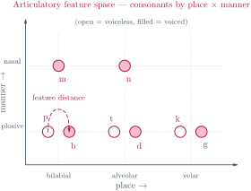

# Articulatory Distance: Phonetically-Informed Substitution Costs

*A Pedagogical Guide to Phonetic Feature-Based Edit Distance*

---

## Introduction: Why Articulatory Distance?

Standard Levenshtein distance treats all character substitutions equally. Replacing "p" with "b" costs the same as replacing "p" with "h"—one edit operation. But to a human ear, these substitutions are not equivalent:

- **p → b**: Only voicing differs (both are bilabial stops)
- **p → h**: Place, manner, and voicing all differ (bilabial stop vs glottal fricative)

When spell-checking phonetic input or matching names across languages, this distinction matters. "bat" for "pat" is a likely typo or mishearing, but "hat" for "pat" is less so.

**Articulatory distance** uses the International Phonetic Alphabet (IPA) feature system to compute *how different* two sounds are, producing a gradient cost rather than a binary `0` or `1`.

The **International Phonetic Alphabet (IPA)** is a standardized notation in which each symbol denotes one speech sound. A **distinctive (articulatory) feature** is a single dimension of that sound — its *place of articulation* (where the vocal tract is constricted), its *manner of articulation* (how the airflow is shaped), or its *voicing* (whether the vocal folds vibrate). A **phoneme** is a contrastive unit of sound in a language. The model below decomposes each IPA symbol into a feature set and measures distance as the disagreement between feature sets.



---

## Articulatory Phonetics Primer

### The Three Dimensions of Consonants

Every consonant can be described by three primary features:

#### 1. Place of Articulation

Where in the mouth is the airflow constricted?

```
       Front                                               Back
         ↓                                                   ↓
   ┌─────────────────────────────────────────────────────────────┐
   │ Lips    Teeth  Ridge   Palate    Velum    Uvula   Glottis  │
   │   ↓       ↓      ↓        ↓        ↓        ↓        ↓     │
   │ p,b,m   f,v   t,d,n,s,z  ʃ,ʒ     k,g,ŋ    ʀ       h,ʔ     │
   │                                                             │
   │ Bilabial → Labiodental → Alveolar → Palatal → Velar → Glottal │
   └─────────────────────────────────────────────────────────────┘
```

The 12 places of articulation form a chain from the lips to the glottis:

| Position | Place | Example |
|----------|-------|---------|
| 0 | Bilabial | p, b, m |
| 1 | Labiodental | f, v |
| 2 | Dental | θ, ð |
| 3 | Alveolar | t, d, n, s, z |
| 4 | Post-alveolar | ʃ, ʒ |
| 5 | Retroflex | ʈ, ɖ |
| 6 | Palatal | j, ɲ |
| 7 | Velar | k, g, ŋ |
| 8 | Uvular | ʁ, χ |
| 9 | Pharyngeal | ħ, ʕ |
| 10 | Epiglottal | ʡ, ʜ |
| 11 | Glottal | h, ʔ |

Adjacent places are acoustically similar. The cost grows linearly with distance.

#### 2. Manner of Articulation

How does the airflow move past the constriction?

| Manner | Description | Examples |
|--------|-------------|----------|
| Stop | Complete blockage, then release | p, t, k, b, d, g |
| Fricative | Turbulent airflow | f, s, ʃ, v, z, ʒ |
| Affricate | Stop + fricative release | tʃ, dʒ |
| Nasal | Airflow through nose | m, n, ŋ |
| Approximant | Minimal constriction | w, j, l, ɹ |
| Lateral | Air around tongue sides | l |
| Tap/Flap | Brief tongue contact | ɾ |
| Trill | Vibrating articulator | r |

Related manners have low distance (stop ↔ affricate `= 0.2`), unrelated manners have higher distance (stop ↔ approximant `= 0.4`).

#### 3. Voicing

Is the larynx vibrating?

| Feature | Description | Examples |
|---------|-------------|----------|
| Voiceless | No vibration | p, t, k, f, s |
| Voiced | Vibration | b, d, g, v, z |

Voicing pairs differ by a single binary feature and have low distance (`0.1`).

### The Vowel Space

Vowels are described by a different feature set:

```
         Front    Central    Back
          ↓         ↓         ↓
High:     i, y      ɨ, ʉ     ɯ, u     ← Close
Mid:      e, ø      ə        ɤ, o     ← Mid
Low:      ɛ, œ      ɐ, a     ʌ, ɔ     ← Open
```

Vowel features:
- **Height**: High (close) → Mid → Low (open)
- **Backness**: Front → Central → Back
- **Rounding**: Rounded (o, u, y) vs Unrounded (i, e, a)

---

## The 51 Articulatory Features

The phonetic module defines 51 features covering:

### Consonant Features

**Place (12):** Bilabial, Labiodental, Dental, Alveolar, PostAlveolar, Retroflex, Palatal, Velar, Uvular, Pharyngeal, Epiglottal, Glottal

**Manner (9):** Stop, Fricative, Affricate, Nasal, Approximant, Lateral, Rhotic, Tap, Trill

**Airstream (3):** Voiced, Voiceless, Ejective

### Vowel Features

**Height (3):** High, Mid, Low

**Backness (3):** Front, Central, Back

**Rounding (2):** Rounded, Unrounded

### Category Features

**Type (2):** Vowel, Consonant

### Character Mapping

Each IPA character maps to a feature set:

```
'p' → {Bilabial, Stop, Voiceless, Consonant}
'b' → {Bilabial, Stop, Voiced, Consonant}
't' → {Alveolar, Stop, Voiceless, Consonant}
'k' → {Velar, Stop, Voiceless, Consonant}
'h' → {Glottal, Fricative, Voiceless, Consonant}

'a' → {Low, Central, Unrounded, Vowel}
'i' → {High, Front, Unrounded, Vowel}
'u' → {High, Back, Rounded, Vowel}
```

---

## Cost Computation

### The Distance Formula

The articulatory distance between two sounds is computed as:

```rust
fn articulatory_distance(c1: char, c2: char) -> f64 {
    // Same sound
    if c1 == c2 { return 0.0; }

    let f1 = get_features(c1);
    let f2 = get_features(c2);

    // Unknown characters → maximum distance
    if f1.is_empty() || f2.is_empty() { return 1.0; }

    // Vowel vs consonant → maximum distance
    let v1 = f1.contains(Vowel);
    let v2 = f2.contains(Vowel);
    if v1 != v2 { return 1.0; }

    if v1 {
        // Both vowels: height + backness + rounding
        vowel_distance(f1, f2)
    } else {
        // Both consonants: voicing + place + manner
        consonant_distance(f1, f2)
    }
}
```

### Consonant Distance

For consonants, distance is the sum of three components:

```
distance = voicing_diff + place_diff + manner_diff
```

Where:
- **Voicing difference**: 0.1 if one is voiced and the other is voiceless
- **Place difference**: 0.15 × |position₁ - position₂| (using the place chain)
- **Manner difference**: Looked up from a predefined table

### Manner Distance Table

| From | To | Distance |
|------|-----|----------|
| Stop | Affricate | 0.2 |
| Stop | Fricative | 0.3 |
| Stop | Nasal | 0.3 |
| Stop | Approximant | 0.4 |
| Fricative | Affricate | 0.2 |
| Fricative | Approximant | 0.3 |
| Approximant | Lateral | 0.1 |
| Lateral | Rhotic | 0.2 |
| Tap | Trill | 0.1 |
| (other pairs) | | 0.5 |

### Vowel Distance

For vowels, distance considers three dimensions:

```
distance = height_diff × 0.15 + backness_diff × 0.15 + rounding_diff
```

Where:
- **Height difference**: 0, 1, or 2 steps (high/mid/low)
- **Backness difference**: 0, 1, or 2 steps (front/central/back)
- **Rounding difference**: 0.1 if different

### Worked Examples

**Example 1: p → b (voicing pair)**
```
p: {Bilabial, Stop, Voiceless}
b: {Bilabial, Stop, Voiced}

Voicing: 0.1 (different)
Place:   0.0 (both Bilabial, position 0)
Manner:  0.0 (both Stop)

Total: 0.1
```

**Example 2: p → t (place difference)**
```
p: {Bilabial, Stop, Voiceless}  → position 0
t: {Alveolar, Stop, Voiceless}  → position 3

Voicing: 0.0 (both voiceless)
Place:   0.15 × |0 - 3| = 0.45
Manner:  0.0 (both Stop)

Total: 0.45
```

**Example 3: p → k (larger place difference)**
```
p: {Bilabial, Stop, Voiceless}  → position 0
k: {Velar, Stop, Voiceless}     → position 7

Voicing: 0.0 (both voiceless)
Place:   0.15 × |0 - 7| = 1.05 → capped at 1.0
Manner:  0.0 (both Stop)

Total: 1.0
```

**Example 4: p → h (everything different)**
```
p: {Bilabial, Stop, Voiceless}     → position 0
h: {Glottal, Fricative, Voiceless} → position 11

Voicing: 0.0 (both voiceless)
Place:   0.15 × |0 - 11| = 1.65 → capped at 1.0
Manner:  0.3 (Stop → Fricative, not in table → using Stop-Fricative entry)

Total: 1.0 (capped)
```

**Example 5: a → i (vowels)**
```
a: {Low, Central, Unrounded}   → height 0, backness 1
i: {High, Front, Unrounded}    → height 2, backness 0

Height:   0.15 × |0 - 2| = 0.30
Backness: 0.15 × |1 - 0| = 0.15
Rounding: 0.0 (both unrounded)

Total: 0.45
```

---

## Integration with Product Automaton

The articulatory distance is integrated into the `ProductAutomatonChar` to provide phonetically-informed substitution costs during fuzzy pattern matching.

### Architecture

```
Input → [Phonetic NFA] → [Articulatory-Weighted Levenshtein] → [Dictionary]
              ↓                          ↓                          ↓
      .llev rules            articulatory_distance(c1, c2)    trie traversal
      IPA output             for residual substitutions
```

When the phonetic NFA handles known patterns (like "ph → f" or "tion → ʃən"), those transitions are handled by explicit rules. For **residual errors**—typos or variations not covered by rules—the articulatory distance provides gradient substitution costs.

### Constructor

Use `ProductAutomatonChar::with_articulatory_costs()` to enable articulatory-weighted substitutions:

```rust
use liblevenshtein::phonetic::nfa::compiler::compile;
use liblevenshtein::phonetic::nfa::product::ProductAutomatonChar;
use liblevenshtein::phonetic::regex::parse;
use liblevenshtein::transducer::{Algorithm, ArticulatoryCosts};

// Compile a phonetic pattern
let nfa = compile(&parse("(ph|f)one").unwrap()).unwrap();

// Create articulatory cost configuration
let costs = ArticulatoryCosts::default();

// Create product automaton with articulatory costs
let product = ProductAutomatonChar::with_articulatory_costs(
    nfa,
    2.0,  // max accumulated cost
    Algorithm::Standard,
    costs,
);

// Query - similar sounds cost less
assert!(product.accepts("phone"));   // exact match
assert!(product.accepts("fone"));    // NFA alternate
assert!(product.accepts("bone"));    // b→f/p costs ~0.1 (voicing)
assert!(!product.accepts("hone"));   // h→f/p costs ~1.0 (too far)
```

### Fixed Costs vs Articulatory Costs

| Comparison | Fixed Costs | Articulatory Costs |
|------------|-------------|--------------------|
| p → b | 1.0 | ~0.1 |
| p → t | 1.0 | ~0.45 |
| p → k | 1.0 | ~1.0 |
| p → h | 1.0 | ~1.0 |
| ʃ → ʒ | 1.0 | ~0.1 |
| a → i | 1.0 | ~0.45 |

With articulatory costs, phonetically similar matches accumulate less cost and are more likely to be accepted within the threshold.

---

## Configuration Options

### ArticulatoryCosts Fields

```rust
pub struct ArticulatoryCosts {
    /// Base operation costs (insertion, deletion, transposition)
    pub base: OperationCostsF64,

    /// Weight for articulatory distance in substitution (0.0-1.0)
    /// 0.0 = use base cost only, 1.0 = use articulatory distance only
    pub articulation_weight: f64,

    /// Distance threshold for "free" substitutions
    pub free_substitution_threshold: f64,
}
```

### Cost Blending

The substitution cost is computed as:

```
cost = base.substitution × (1 - weight) + articulatory_distance × weight
```

With default settings (`articulation_weight = 0.6`):
- p → b: `1.0 × 0.4 + 0.1 × 0.6 = 0.46`
- p → k: `1.0 × 0.4 + 1.0 × 0.6 = 1.0`

### Free Substitution Threshold

If the articulatory distance is below `free_substitution_threshold` (default: `0.15`), the substitution is considered "free" (near-zero cost). This allows voicing pairs to substitute freely:

```rust
let costs = ArticulatoryCosts::default();

assert!(costs.is_free_substitution('p', 'b'));  // true (dist ~0.1 < 0.15)
assert!(costs.is_free_substitution('t', 'd'));  // true
assert!(!costs.is_free_substitution('p', 'h')); // false (dist > 0.15)
```

### Customization

```rust
use liblevenshtein::transducer::{ArticulatoryCosts, OperationCostsF64};

// Heavy articulatory weighting (phonetic accuracy priority)
let phonetic_focused = ArticulatoryCosts::with_weight(0.9);

// Light articulatory weighting (still prefer traditional distance)
let typo_focused = ArticulatoryCosts::with_weight(0.3);

// Custom base costs (lower transposition penalty for keyboard typos)
let base = OperationCostsF64::typo_friendly();
let custom = ArticulatoryCosts::with_base(base);

// Full customization
let advanced = ArticulatoryCosts::custom(
    OperationCostsF64::standard(),
    0.8,   // high articulatory weight
    0.2,   // slightly more permissive free threshold
);
```

---

## Code Examples

### Basic Usage

```rust
use liblevenshtein::phonetic::feature_distance::articulatory_distance;

// Identical sounds
assert_eq!(articulatory_distance('p', 'p'), 0.0);

// Voicing pairs
let pb = articulatory_distance('p', 'b');
assert!(pb > 0.0 && pb < 0.15);  // ~0.1

// Different place
let pk = articulatory_distance('p', 'k');
assert!(pk > 0.5);  // ~1.0

// Vowels
let ai = articulatory_distance('a', 'i');
assert!(ai > 0.3 && ai < 0.5);  // ~0.45
```

### Edit Distance with Articulatory Costs

```rust
use liblevenshtein::phonetic::feature_distance::articulatory_edit_distance;

// Similar sounds → lower distance
let pat_bat = articulatory_edit_distance("pat", "bat");
assert!(pat_bat < 0.5);  // p→b is cheap

// Different sounds → higher distance
let pat_hat = articulatory_edit_distance("pat", "hat");
assert!(pat_hat > pat_bat);  // p→h is expensive

// Standard edit distance (for comparison)
use liblevenshtein::distance::standard_distance;
let standard = standard_distance("pat", "bat");
assert_eq!(standard, 1);  // Always 1, regardless of sound similarity
```

### Product Automaton with Articulatory Costs

```rust
use liblevenshtein::phonetic::nfa::compiler::compile;
use liblevenshtein::phonetic::nfa::product::ProductAutomatonChar;
use liblevenshtein::phonetic::regex::parse;
use liblevenshtein::transducer::{Algorithm, ArticulatoryCosts};

fn phonetic_fuzzy_search(pattern: &str, candidates: &[&str], max_cost: f64) -> Vec<&str> {
    // Compile pattern to NFA
    let ast = parse(pattern).expect("valid pattern");
    let nfa = compile(&ast).expect("compilable pattern");

    // Create product automaton with articulatory costs
    let costs = ArticulatoryCosts::default();
    let product = ProductAutomatonChar::with_articulatory_costs(
        nfa,
        max_cost,
        Algorithm::Standard,
        costs,
    );

    // Filter candidates by acceptance
    candidates.iter()
        .filter(|c| product.accepts(c))
        .copied()
        .collect()
}

// Example usage
let matches = phonetic_fuzzy_search(
    "(ph|f)one",
    &["phone", "fone", "bone", "hone", "cone", "zone"],
    1.5,  // max cost
);
// "phone", "fone", "bone" accepted
// "hone", "cone", "zone" likely rejected (high cost substitutions)
```

---

## Performance Considerations

### Overhead

Articulatory distance lookup adds overhead compared to fixed costs:

| Measurement | Fixed Costs | Articulatory Costs | Overhead |
|-------------|-------------|--------------------|---------:|
| Single transition | ~10 ns | ~16 ns | 1.6x |
| Substitution lookup | 0 ns | ~15-35 ns | N/A |
| Full query (pattern + Levenshtein) | ~3.4 µs | ~3.3 µs | ~same |

The per-transition overhead is measurable, but the overall query performance is often comparable or slightly better because articulatory costs enable better pruning—high-cost paths are rejected earlier.

### When to Use

**Use articulatory costs when:**
- Processing phonetic input (voice transcription, phonetic keyboards)
- Matching names across languages or dialects
- Spell-checking where "sounds like" matters
- Quality of ranking is more important than raw throughput

**Use fixed costs when:**
- Processing keyboard input (typos have no phonetic relationship)
- Maximum throughput is required
- The phonetic-rules feature is not available

---

## Summary

Articulatory distance brings linguistic knowledge into the edit distance computation:

| Feature | Contribution |
|---------|--------------|
| Voicing | 0.1 per difference |
| Place | 0.15 per step in the place chain |
| Manner | 0.1-0.5 depending on relationship |
| Height (vowels) | 0.15 per step |
| Backness (vowels) | 0.15 per step |
| Rounding (vowels) | 0.1 per difference |

This enables phonetically-informed spell correction where similar sounds substitute cheaply and dissimilar sounds substitute expensively—matching human intuitions about spelling errors.

---

## References

1. IPA Chart (2020). International Phonetic Association.
2. Ladefoged, P. & Johnson, K. (2014). *A Course in Phonetics*. Cengage Learning.
3. Kondrak, G. (2000). "A New Algorithm for the Alignment of Phonetic Sequences." NAACL.
4. Covington, M.A. (1996). "An Algorithm to Align Words for Historical Comparison." Computational Linguistics.

---

## See Also

- [Compositional Spelling Correction](compositional-phonetic-levenshtein.md) — Full guide to phonetic NFAs + Levenshtein automata
- [Phonetic Algorithm Extraction](../phonetic-extraction/README.md) — LLev rule enrichment from classic algorithms
- [Benchmark Results](../benchmarks/improvements-2026-01.md) — Performance measurements for articulatory costs

---

[← Documentation Index](../README.md)
