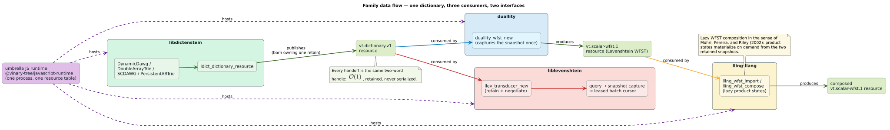

# Language bindings architecture

## Decision

Vinary Tree bindings use a small, versioned C resource ABI plus generated
constants and hand-written language facades. UniFFI is not the runtime boundary.
UniFFI is a good fit for record- and RPC-shaped APIs, but a result set here may
be enormous and long-lived. Materializing it as a collection, or crossing the
FFI boundary once per match, would violate the library's performance contract.

The architecture has three layers:

1. `vinary-tree-interop` defines retained, two-word resources and versioned
   interfaces. A producer owns its data and publishes operations; a consumer
   retains the resource without knowing the producer's Rust types.
2. Each project publishes only its own capabilities. `libdictenstein` owns
   dictionaries and CRUD, `liblevenshtein` owns edit-distance transducers and
   phonetic automata, and related projects such as `lling-llang` and `duallity`
   expose their own resource interfaces when cross-project composition needs
   them.
3. Language facades are tailored to the host language's ownership, iteration,
   error, string, concurrency, and packaging conventions. ABI values and
   conformance fixtures are generated from `bindings/api.json`; facade code is
   not generated blindly from C declarations.


This lets Java load a dictionary through `libdictenstein`, pass its
`DictionaryResource` directly to a liblevenshtein `Transducer`, and keep both
projects independently versioned and packaged. No serialization, term copying,
or monolithic native binding is involved.

## Shared resource boundary

`VtResource` is two machine words: a context pointer and a resource vtable. Its
base operations are retain, release, and query-interface. Handing a resource
between projects is therefore $`\mathcal{O}(1)`$ — sixteen bytes on a 64-bit
target, never a serialization. The mandatory `vt.dictionary.v1` interface
supports byte, Unicode-scalar, and `u64` unit domains and unit or optional-`u64`
values. Optional dictionary visit, compact-graph, snapshot-identity, and
entries-v1 interfaces add capabilities without enlarging the base resource;
`vt.dict.entry.v1` is a finite lexicographic stream over one captured revision
with one explicit generation lease at a time. `vt.scalar-wfst.1` carries
scalar-weighted transducers between sibling projects. One dictionary feeds
three consumers across two principal interfaces:



The dictionary interface deliberately models traversal rather than concrete
dictionary classes:

- capture a retained immutable revision;
- read its root and length;
- test finality and obtain a value;
- follow one transition;
- enumerate edges into a caller-provided contiguous batch.

Consequently DynamicDAWG, DoubleArrayTrie, SCDAWG views, persistent ARTrie
variants, and future dictionary implementations remain libdictenstein types.
Liblevenshtein does not duplicate their constructors, CRUD methods, persistence
controls, or concrete class hierarchy. Composition APIs consume interfaces,
not project-specific handles.

Host-defined providers are supported. Project-owned dictionaries and
transducers preserve their native thread-safe, non-blocking behavior: the
binding layer neither adds a global lock nor serializes independent calls.
Foreign callbacks execute on the caller thread. Because an arbitrary callback
cannot be assumed thread-safe, calls into one callback object are serialized
unless that object declares itself parallel and reentrant. This gate protects
only the callback; it does not serialize the library or other resources.
Panics/exceptions must not cross the C ABI and are reported as provider errors.

## Iterator and snapshot contract

Every query captures a retained dictionary revision before reading its root.
That capture must be constant-cost regardless of dictionary size,

```math
\mathrm{cost}(\mathtt{snapshot}) \;=\; \mathcal{O}(1)
\quad\text{— independent of } \lvert D \rvert ,
```

so copying the dictionary or holding a long-lived read lock are contract
violations, not implementations. A cursor then:

- observes exactly the terms and values visible at query start;
- remains unchanged by later insert, remove, update, clear, compact, and
  checkpoint operations;
- may outlive the transducer and the original dictionary handle;
- holds no mutation lock for its lifetime;
- never materializes a global result `Vec`;
- uses bounded traversal state, or one distance layer when ordered output is
  requested.

The DynamicDAWG implementation uses immutable path-copied revisions and atomic
root publication. That design is inspired by the persistent ARTrie snapshot
principle, not by its storage representation: DynamicDAWG remains an in-memory
structure while persistent ARTrie uses its own mmap/WAL machinery.

The contract is exercised at three boundaries:

- direct Rust DynamicDAWG example and property tests;
- shared-resource Rust adapter example and property tests;
- C ABI lease/reducer integration tests.

Each test starts one cursor, partially consumes it, performs several mutations,
then drains the same cursor and compares it with its query-start oracle. A fresh
cursor must observe the new revision. The laws in full — with the
persistence-theory derivation and the law ↔ formal-model ↔ test
correspondence table — are
[docs/theory/snapshot-semantics.md](theory/snapshot-semantics.md).

## Marshalling contract

The hot path is batch-oriented:

- dictionary edges are filled into caller-provided contiguous arrays;
- results use descriptor arrays plus reusable contiguous byte or `u64` arenas;
- one batch is leased until the caller releases it;
- the cursor rejects advance or destruction while a lease is live;
- a reducer callback processes borrowed batches without creating a host object
  for every match;
- safe iterators materialize at most one batch at a time.

C and C++ can borrow spans directly. JVM FFM exposes `MemorySegment` views in
the expert reducer path. Python exposes borrowed buffer views during the
callback. JavaScript runtimes use typed-array views where their runtime boundary
permits it. Ordinary safe iterators copy a term only when yielding it into the
host's managed ownership model.

Default batch size is 256, so transferring $`n`$ results costs

```math
\left\lceil \frac{n}{256} \right\rceil
```

boundary crossings — never one per match — and a provider expanding a node
of out-degree $`\deg(v)`$ through the recommended edge batch pays
$`\lceil \deg(v) / 256 \rceil`$ crossings per expansion. Providers should
batch node expansion rather than
implementing a per-edge callback. Benchmark gates should measure boundary
crossings, allocations, and bytes copied in addition to throughput.

## Native and WebAssembly topology

Native packages stay modular: one package per project plus the tiny shared
interop package. Applications may dynamically link an installed shared library
or statically link it where the language toolchain and license policy allow.
Python wheels and the JVM artifact bundle the relevant native libraries;
C/C++ exposes both CMake shared and static targets. No loader silently falls
back to an unrelated system library.

JavaScript is the deliberate exception. A single `@vinary-tree/vinary-tree`
runtime owns one coherent native/WASM resource table and exposes namespaces for
the related projects. Project packages such as `@vinary-tree/libdictenstein`
and `@vinary-tree/liblevenshtein` are lightweight typed facades over that
runtime. This prevents incompatible WebAssembly instances from trying to pass
raw handles to one another.

The Node default should be a native N-API build. Explicit subpaths select
browser WASM, WASI Preview 1, or a WASI component build. WASI gives a Node host
filesystem capabilities only when the host preopens directories; it does not
grant ambient filesystem access. Persistent ARTrie is enabled only for a WASI
runtime with the required mmap/durability semantics. Browser persistence is a
separate storage design and must not pretend to be the native WAL contract.

Only related Vinary Tree projects belong in this umbrella. For example,
`libdictenstein`, `liblevenshtein`, `lling-llang`, and `duallity` may compose;
an unrelated project such as `libcpg` must remain outside it.

## Language support

The tiers describe support priority, not permission for one project to absorb
another project's API.

| Tier | Languages | Facade direction |
|---|---|---|
| 1 | C17/C23, C++20/C++23 | Stable ABI and RAII spans/leases |
| 1 | Python 3.10-current | Iterator plus borrowed batch reducer |
| 1 | JVM: Java, Kotlin, Scala | Java 22 FFM API; JDK 25 LTS and current JDK tested |
| 1 | Clojure | Dedicated reducible/sequence facade over the JVM package |
| 1 | JavaScript, TypeScript, ClojureScript | Project facades over the shared umbrella runtime; CLJS mirrors the Clojure API where host semantics permit |
| 2 | .NET, Go, Swift, Ruby, Fortran | Idiomatic native facades over the same resource ABI |
| 3 | OCaml, Haskell, Lua | Maintained native packages over the same resource and leased-batch contracts |

FFM is the primary JVM backend. It avoids JNI glue, has been final since Java
22, and can represent the leased native views directly. A future Java 17/21 JNI
fallback, if demand warrants it, must implement the same Java interfaces in a
separate artifact rather than constrain the FFM design.

Clojure receives its own facade because `IReduceInit`, `Seqable`, keyword
options, and deterministic resource scopes are materially different from Java.
ClojureScript likewise receives a small facade with matching function names
and option maps. TypeScript supplies discriminated term domains, one-shot
iterators, and borrowed-batch types rather than exposing untyped JavaScript
objects.

Current implementation status is machine-checked in CI. Tier 1, Tier 2, and
Tier 3 facades consume project resources and run the same cross-project
query-start snapshot fixture. Generator-owned native mirrors additionally
replay the entries-v1 identity, status, flag, operation-order, and LP64/ARM32
layout fixture. The tier is a maintenance and optimization priority; it is not
a statement that lower-tier packages are incomplete.

## Distribution

Publication follows the dependency DAG — the shared interop package first,
producers before consumers, the npm umbrella before its facades
(the executable process is
[releasing-language-bindings.md](releasing-language-bindings.md)):


The packages are independently releasable:

- Rust: `vinary-tree-interop` and `liblevenshtein` on crates.io;
- C/C++: versioned native archives, `pkg-config`, and CMake config packages
  `vinary-tree-interop` and `liblevenshtein`;
- Python: `vinary-tree-interop` followed by
  `vinary-tree-liblevenshtein` on PyPI;
- JVM: `io.vinarytree:vinary-tree-interop` followed by
  `io.vinarytree:liblevenshtein` on Maven Central (and therefore
  consumable through JFrog Artifactory mirrors);
- Clojure: `io.vinarytree/liblevenshtein-clojure` on Clojars;
- npm: `@vinary-tree/interop`, the umbrella
  `@vinary-tree/vinary-tree`, and project facade
  `@vinary-tree/liblevenshtein`;
- .NET: `VinaryTree.Interop` and `VinaryTree.Liblevenshtein` on NuGet;
- Go: `github.com/vinary-tree/liblevenshtein-rust/bindings/go` and
  `github.com/vinary-tree/liblevenshtein-rust/vinary-tree-interop/bindings/go`,
  published with immutable module-subdirectory tags;
- Swift: the repository-root SwiftPM package, with products
  `VinaryTreeInterop` and `Liblevenshtein`;
- Ruby: `vinary-tree-liblevenshtein` on RubyGems;
- Fortran: `vinary-tree-interop` and `vinary-tree-liblevenshtein` in the fpm
  registry;
- OCaml: `vinary-tree-interop` and `vinary-tree-liblevenshtein` through opam;
- Haskell: `vinary-tree-interop` and `vinary-tree-liblevenshtein` on Hackage;
- Lua: `vinary-tree-liblevenshtein` on LuaRocks.

Interop artifacts publish before producer/consumer artifacts. A binding release
must pin an exact compatible interop version and test a real cross-project
handoff, not merely compile each package independently.

## Feature and platform policy

All language binding features are opt-in. `bindings-core` enables the resource
consumer and cursor model, `ffi` adds the native ABI, and `bindings-phonetic`
adds project-owned phonetic APIs. Descriptive `*-bindings` features choose a
boundary; they do not compile another language runtime and do not restore
dictionary ownership to liblevenshtein.

| Level | Operating systems and architectures |
|---|---|
| Required | Linux x86_64 (AMD and Intel), Linux aarch64, macOS aarch64, Windows x86_64 |
| Best effort | FreeBSD x86_64/aarch64, NetBSD x86_64, OpenBSD x86_64, DragonFly BSD x86_64 |
| Experimental | Linux armv7, NetBSD/OpenBSD aarch64 |

Release artifacts never use `target-cpu=native`. Architecture-specific SIMD is
selected at runtime so one x86_64 artifact works on both AMD and Intel systems.

## ABI evolution

Adding an optional interface or tail vtable field is backward-compatible when
the size/version handshake makes it discoverable. Changing a layout, ownership
rule, status value, callback rule, or snapshot guarantee requires a new
interface version; incompatible versions may coexist. Project APIs evolve above
that boundary without requiring one monolithic release. The full change
rules — four version counters, the additive-versus-fork decision table,
worked examples — are the
[evolution policy](../vinary-tree-interop/docs/abi-evolution.md).

## Deeper documentation

- **Family canon** (normative for all four projects, hosted with the
  interop crate): [portal](../vinary-tree-interop/README.md) ·
  [ABI reference](../vinary-tree-interop/docs/abi-reference.md) ·
  [evolution policy](../vinary-tree-interop/docs/abi-evolution.md) ·
  [security model](../vinary-tree-interop/docs/security-model.md).
- **Project corpus**: [binding hub](bindings/README.md) ·
  [`llev_*` C-ABI reference](bindings/c-abi-reference.md) ·
  [resource consumer](bindings/resource-consumer.md) ·
  [WASM topology](bindings/wasm-topology.md) ·
  [snapshot semantics](theory/snapshot-semantics.md) ·
  [binding trust model](security/binding-trust-model.md) ·
  [findings ledger](bindings/FINDINGS_LEDGER.md).
- **Sibling ABI references** (separate repositories; their documents land
  with their own waves):
  [libdictenstein `ldict_*`](https://github.com/vinary-tree/libdictenstein/blob/master/docs/bindings/c-abi-reference.md) ·
  [lling-llang `lling_*`](https://github.com/vinary-tree/lling-llang/blob/master/docs/api/c-abi-reference.md) ·
  [duallity `duallity_*`](https://github.com/vinary-tree/duallity/blob/master/docs/architecture/06-resource-abi-and-bindings.md).
