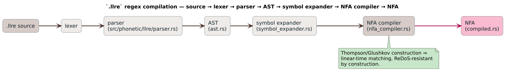

# LLRE File Format

The `.llre` (LibLevenshtein Regex Expression) file format is a standalone regex pattern format with metadata support, symbol imports from `.llev` files, and AOT (Ahead-of-Time) compilation to NFA binary format.



## Features

- **Single pattern per file** with descriptive metadata
- **Import symbols** from `.llev` phonetic rule files
- **Global flags** for multiline, dotall, and case-insensitive modes
- **AOT compilation** to binary format for instant loading
- **Full anchor support** (`^`, `$`, `\A`, `\Z`, `\z`)
- **Compile-time macros** for zero-cost static patterns

## File Format

### Basic Structure

```llre
# Comment lines start with #
@name "Pattern Name"
@version "1.0"
@author "Author Name"
@description "Description of the pattern"

# Import symbols from .llev files
@import "phonetic/symbols.llev"
@import "phonetic/english.llev" as en

# Global flags
@flags multiline, dotall

# The regex pattern (required)
^[a-zA-Z0-9._%+-]+@[a-zA-Z0-9.-]+\.[a-zA-Z]{2,}$
```

### Directives

| Directive | Description | Example |
|-----------|-------------|---------|
| `@name` | Short descriptive name | `@name "Email Validator"` |
| `@version` | Version string | `@version "1.0"` |
| `@author` | Author attribution | `@author "LibLevenshtein Team"` |
| `@description` | Longer description | `@description "Validates RFC 5322 emails"` |
| `@import` | Import symbols from .llev | `@import "symbols.llev" as sym` |
| `@flags` | Global matching flags | `@flags multiline, dotall` |

### Flags

| Flag | Short | Description |
|------|-------|-------------|
| `multiline` | `m` | `^` and `$` match at line boundaries (not just input boundaries) |
| `dotall` | `s` | `.` matches newlines (normally it doesn't) |
| `case_insensitive` | `i` | Case-insensitive matching |
| `unicode` | `u` | Unicode-aware character classes |

### Anchors

| Anchor | Description | Multiline Behavior |
|--------|-------------|-------------------|
| `^` | Start of line/input | Matches after `\n` in multiline mode |
| `$` | End of line/input | Matches before `\n` in multiline mode |
| `\A` | Start of input | Always absolute (ignores multiline) |
| `\Z` | End of input | Allows trailing `\n` |
| `\z` | Strict end of input | No trailing `\n` allowed |

## Usage

### Parse and Compile

```rust
use liblevenshtein::phonetic::llre::{parse_str, compile};

// Parse from string
let file = parse_str(r#"
    @name "Hello Pattern"
    ^hello$
"#)?;

// Compile to NFA
let compiled = compile(&file)?;

// Match strings
assert!(compiled.matches("hello"));
assert!(!compiled.matches("world"));
```

### Load from File

```rust
use liblevenshtein::phonetic::llre::{load_file, compile};

// Load .llre file (resolves imports)
let file = load_file("patterns/email.llre")?;
let compiled = compile(&file)?;

assert!(compiled.matches("test@example.com"));
```

### AOT Compilation

```rust
use liblevenshtein::phonetic::llre::{load_file, compile, save, load};

// Compile and save to binary
let file = load_file("email.llre")?;
let compiled = compile(&file)?;
save(&compiled, "email.llre.bin")?;

// Later: load pre-compiled (instant, no parsing)
let loaded = load("email.llre.bin")?;
assert!(loaded.matches("test@example.com"));
```

### Quick Matching

```rust
use liblevenshtein::phonetic::llre::is_match;

// One-shot matching (parses + compiles each time)
assert!(is_match("^hello$", "hello")?);
assert!(!is_match("^hello$", "world")?);
```

## Command-line integration

The `.llre` compiler and matching commands live in the separate
[`liblevenshtein-cli` regex guide](https://github.com/vinary-tree/liblevenshtein-rust-cli/blob/master/docs/commands/regex.md).
The sections here describe the reusable parser, compiler, and matching APIs.

## Compile-Time Macros

For static patterns known at compile time, use the proc macros for zero initialization cost:

### Add Dependencies

```toml
[dependencies]
liblevenshtein = { version = "0.9.1", features = ["phonetic-rules", "serialization"] }
liblevenshtein-macros = "0.1"
```

### Usage

```rust
use liblevenshtein_macros::{llre, llre_file, llre_with_symbols};

// Compile pattern at build time - NFA embedded in binary
static EMAIL: &liblevenshtein::phonetic::llre::CompiledNFA = llre!(
    r"^[a-z]+@[a-z]+\.[a-z]+$"
);

// With multiline flag (inline flag syntax)
static LINES: &liblevenshtein::phonetic::llre::CompiledNFA = llre!(
    r"(?m)^line\d+$"
);

// From .llre file (imports resolved at build time)
static PHONETIC: &liblevenshtein::phonetic::llre::CompiledNFA = llre_file!(
    "patterns/phonetic.llre"
);

// With symbol imports
static VOWELS: &liblevenshtein::phonetic::llre::CompiledNFA = llre_with_symbols!(
    import = "phonetic/symbols.llev",
    pattern = r"$VOWEL+"
);

fn main() {
    // Zero startup cost - NFA already in binary
    assert!(EMAIL.matches("test@example.com"));
    assert!(LINES.matches("line1\nline2\nline3"));
}
```

### Benefits of Compile-Time Macros

| Aspect | Runtime (`compile()`) | Compile-time (`llre!`) |
|--------|----------------------|------------------------|
| Startup cost | Parse + compile NFA | Zero (already in binary) |
| Pattern errors | Runtime panic/error | Compile-time error |
| Binary size | Smaller | Larger (embedded NFA) |
| Use case | Dynamic patterns | Static patterns |

## Symbol Imports

Import symbols from `.llev` files to use in patterns:

### symbols.llev
```llev
@name "Phonetic Symbols"

VOWEL = [aeiouAEIOU];
CONSONANT = [bcdfghjklmnpqrstvwxyzBCDFGHJKLMNPQRSTVWXYZ];
DIGIT = [0-9];
```

### pattern.llre
```llre
@name "Word Validator"
@import "symbols.llev"

^$VOWEL+$CONSONANT*$
```

### Aliased Imports

```llre
@import "english.llev" as en
@import "french.llev" as fr

# Reference: $alias::SYMBOL
^$en::VOWEL+$
```

## File Extension Convention

| Extension | Description |
|-----------|-------------|
| `.llre` | Source file (human-readable) |
| `.llre.bin` | Compiled binary (AOT NFA) |

## Binary Format

The compiled `.llre.bin` format has the following structure:

```
+------------------+------------------+------------------+
| Magic "LLRE"     | Version (1 byte) | Flags (1 byte)   |
| (4 bytes)        |                  |                  |
+------------------+------------------+------------------+
| Metadata (bincode-serialized)                          |
+-------------------------------------------------------+
| NFA (bincode-serialized)                               |
+-------------------------------------------------------+
```

- **Magic bytes**: `LLRE` (4 bytes) for format identification
- **Version**: Binary format version for compatibility
- **Flags**: Compilation flags (multiline, dotall, etc.)
- **Metadata**: Name, version, author, description
- **NFA**: The compiled Non-deterministic Finite Automaton

## Examples

### Email Validation

```llre
@name "Email Validator"
@version "1.0"
@description "RFC 5322 compliant email validation"

^[a-zA-Z0-9._%+-]+@[a-zA-Z0-9.-]+\.[a-zA-Z]{2,}$
```

### URL Parsing

```llre
@name "URL Pattern"
@flags case_insensitive

^(https?|ftp)://[^\s/$.?#].[^\s]*$
```

### Multiline Log Parsing

```llre
@name "Log Entry"
@flags multiline

^\d{4}-\d{2}-\d{2} \d{2}:\d{2}:\d{2} \[(INFO|WARN|ERROR)\] .+$
```

### With Phonetic Symbols

```llre
@name "English Word"
@import "phonetic/english.llev"

^$CONSONANT*$VOWEL+($CONSONANT$VOWEL*)*$CONSONANT*$
```

## API Reference

### Types

| Type | Description |
|------|-------------|
| `LLreFile` | Parsed .llre file AST |
| `CompiledNFA` | Compiled NFA ready for matching |
| `LLreFlags` | Global flags (multiline, dotall, etc.) |
| `ImportDirective` | Import directive with path and optional alias |

### Functions

| Function | Description |
|----------|-------------|
| `parse_str(input)` | Parse .llre from string |
| `load_file(path)` | Load and parse .llre file (resolves imports) |
| `compile(file)` | Compile LLreFile to NFA |
| `is_match(pattern, text)` | Quick one-shot matching |
| `save(compiled, path)` | Save compiled NFA to binary |
| `load(path)` | Load compiled NFA from binary |
| `to_bytes(compiled)` | Serialize NFA to bytes |
| `from_bytes(data)` | Deserialize NFA from bytes |

### CompiledNFA Methods

| Method | Description |
|--------|-------------|
| `matches(text)` | Test if pattern matches anywhere in text |
| `is_match(text)` | Alias for `matches()` |
| `find(text)` | Find first match (returns position) |
| `find_all(text)` | Find all non-overlapping matches |

## See Also

- [regex.ebnf](../grammar/regex.ebnf) - Full regex grammar
- [llev.ebnf](../grammar/llev.ebnf) - Phonetic rule file format
- [phonetic module](../../src/phonetic/) - Source code
