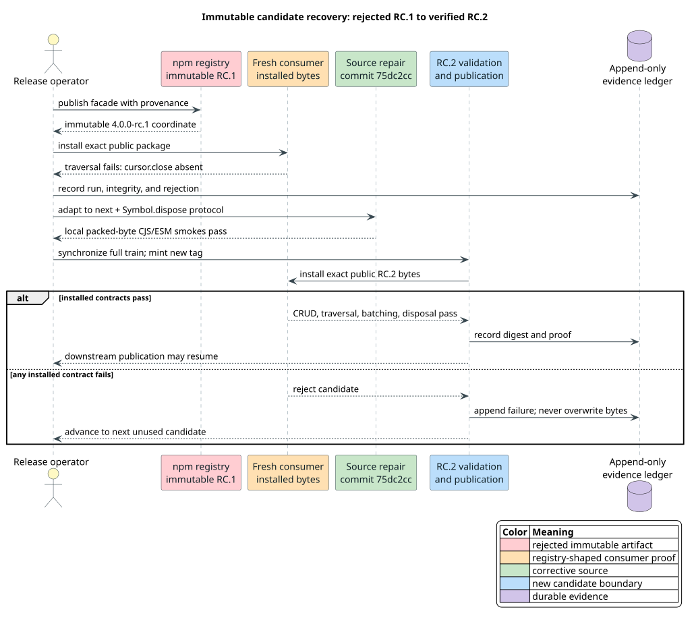

# Vinary Tree `4.0.0-rc.2` release ledger

**Train opened:** 2026-08-24  
**Canonical tag:** `v4.0.0-rc.2`  
**Policy:** [coordinated release runbook](../releasing-language-bindings.md)  
**Predecessor evidence:** [`4.0.0-rc.1`](4.0.0-rc.1.md)  
**State:** source synchronization and pre-publication validation in progress.

This is the append-only execution record for the corrective RC.2 train. The
living runbook defines what an operator must do; this ledger records what was
actually observed. A row becomes **verified** only after the exact public bytes
resolve in a clean consumer and exercise their resource-lifetime and collection
contracts.



## Why the train advanced

`@vinary-tree/libdictenstein@4.0.0-rc.1` was successfully uploaded by GitHub
Actions with npm provenance, but its installed CommonJS and ECMAScript module
(ESM) collection traversals failed with:

```text
TypeError: cursor.close is not a function
```

The facade assumed every runtime cursor implemented `close()`, `return()`,
`nextBatch()`, `size`, and `identity`. The shared JavaScript runtime's ordinary
iterator contract intentionally exposed `next()` plus `Symbol.dispose`. Source
tests had used a richer mock and therefore did not reproduce the installed
runtime shape. This was a package-boundary contract defect, not a registry or
authentication failure.

npm package versions are immutable. RC.1 is therefore never overwritten and
must never be promoted to `latest`. The source repair is libdictenstein commit
`75dc2cc`, **Adapt collection cursors to the shared runtime protocol**. It:

1. disposes cursors by capability in the order `close()`, `Symbol.dispose`,
   then `return()`;
2. derives batching from ordinary `next()` when `nextBatch()` is absent;
3. derives size from the dictionary and treats absent runtime identity as
   `null`; and
4. tests the exact `next()` plus `Symbol.dispose` protocol exposed by the shared
   runtime.

The repaired facade passed all seven npm tests and clean, local packed-tarball
CommonJS and ESM smokes covering construction, create/read/update/delete
(CRUD), iteration, batching, reduction, and deterministic disposal. Those
local bytes are evidence for the fix, not authority to publish RC.1 again.

## Immutable RC.1 evidence and disposition

| Coordinate or source | Observation | Disposition |
|---|---|---|
| `libdictenstein@4.0.0-rc.1` on crates.io | Public and independently consumed; `.crate` SHA-256 `8c2cf6ce32979447f123bcf9341d84dc410d6621a705f3d4cd1c84310a58bd43` | Valid predecessor; never altered |
| `@vinary-tree/libdictenstein@4.0.0-rc.1` | Public from GitHub run `32741930425`, job `97479602625`; npm integrity `sha512-Tv29dJ86162/Ai3QyluWtL3S3MLGPVdGga9mfe8jhevJAG4QZCDnfJF6BcV68q1LzzKgSbU1FM8Hg+csmBdp1w==` | Rejected by installed traversal smoke; deprecate after RC.2 is public; never assign `latest` |
| `@vinary-tree/interop@4.0.0-rc.1` | Public; installed CommonJS and ESM resource-lifetime smokes passed | Valid predecessor; RC.2 is still published for an exact synchronized train |
| `@vinary-tree/vinary-tree@4.0.0-rc.1` | Public; installed CommonJS and ESM dictionary/query smokes passed | Valid predecessor; RC.2 is still published for an exact synchronized train |
| liblevenshtein-rust run `32745399834` | Corrected RC.1 validation was cancelled before downstream publication | Superseded by RC.2 |
| lling-llang run `32745514849` | npm dispatch cancelled before publication | Superseded by RC.2 |
| duallity run `32745514198` | npm dispatch cancelled before publication | Superseded by RC.2 |

The complete chronology and earlier workflow corrections remain in the RC.1
ledger. This ledger does not reclassify any earlier failure as success.

## RC.2 ownership and exact dependency order

All seven owners derive their registry spellings from their own
`release/version.json`. The release cut is:

1. `vinary-tree-interop` — publish and independently verify the shared ABI
   crate and `@vinary-tree/interop`;
2. `libdictenstein` — publish and verify the dictionary crate, then its repaired
   scoped npm facade;
3. `liblevenshtein-rust` — publish and verify the matching crate and facade;
4. `lling-llang`, then `duallity` — publish and verify their exact Rust and npm
   dependencies;
5. `javascript-runtime` — publish the exact shared native/WASM/WASI runtime;
6. finish all scoped npm facade read-backs and dist-tag normalization; and
7. publish the legacy `liblevenshtein` compatibility facade under `next` only.

The canonical, Cargo, npm, Maven, Clojars, NuGet, Swift, CMake, and pkg-config
spelling is `4.0.0-rc.2`; PyPI uses `4.0.0rc2`, LuaRocks uses
`4.0.0rc2-1`, RubyGems uses `4.0.0.rc.2`, and opam uses `4.0.0~rc2`.
Hackage and Fortran Package Manager (fpm) build numeric `4.0.0` candidates but
do not upload during the RC.

## Source freeze and validation evidence

Record commits only after every change is committed and pushed. Never tag a
dirty worktree or substitute a branch name for the immutable tag.

| Owner | RC.2 commit | Tag validation | Source/package gates | State |
|---|---|---|---|---|
| `vinary-tree-interop` | `6694ad4fcb5ce498f69b77cb14ce1ea7a2f20033` | pending | version synchronizer accepts RC.2 | source frozen |
| `libdictenstein` | `8a433a37954439bf68cdb600e428ed491a8fd91c` (contains repair `75dc2cc`) | pending | repaired installed local tarball passed CJS/ESM collection smokes | source frozen |
| `liblevenshtein-rust` | pending until this ledger-bearing commit is created | pending | version synchronizer accepts RC.2 | preparing |
| `lling-llang` | `903cbe7bf92e04c96d44d39dd88f2e2991a472ce` on isolated RC.2 release branch | pending | version synchronizer accepts RC.2 | source frozen |
| `duallity` | `4ff7b00bbc0b91485834cb30ebaa2dbe7adacf8b` on isolated RC.2 release branch | pending | version synchronizer accepts RC.2 | source frozen |
| `javascript-runtime` | `fc293130817e9abbb965d0e341cd4aa483cff138` | pending | version synchronizer accepts RC.2 | source frozen |
| `liblevenshtein-npm` | `447a9e85dd79010411fdc76ad3d6633f3aa9fc62` | pending | synchronizer protects legacy `latest` | source frozen |

### Pre-tag local verification on 2026-08-24

| Owner | Evidence |
|---|---|
| complete train | seven-owner checker accepted the standalone ownership graph, exact RC.2 edges, npm `next`, Hackage/fpm embargoes, and legacy `latest` protection |
| `vinary-tree-interop` | locked Cargo check passed; JavaScript resource-identity suite passed 2/2 |
| `libdictenstein` | release/all-feature nextest passed 3,046/3,046; JavaScript facade suite passed 7/7, including the shared-runtime iterator regression; binding and binding-documentation gates passed |
| `liblevenshtein-rust` | release/all-feature nextest passed 4,903/4,903 with 5 expected skips; JavaScript contract suite passed 3/3 and ClojureScript passed 2 tests/4 assertions; binding, binding-documentation, and MathJax gates passed |
| `lling-llang` | release/all-feature nextest passed 2,841/2,841; JavaScript facade suite passed 6/6; binding, binding-documentation, and MathJax gates passed after the exact-pin checker was generalized to prerelease SemVer |
| `duallity` | release/all-feature nextest passed 374/374; JavaScript facade suite passed 2/2; binding, binding-documentation, and MathJax gates passed |
| `javascript-runtime` | browser-WASM/WASI suite passed 10/10 and the version gate passed; a workstation-only Cargo check encountered duplicate logical paths because the temporary release worktrees are linked into a sibling layout, so the exact clean-checkout tag workflow remains the authoritative Rust topology check |
| `liblevenshtein-npm` | version protection and compatibility suite passed 3/3 |

All validation output was captured under `/tmp` for review. It is temporary
evidence: the final cleanup step removes those logs after the durable results
and workflow URLs have been appended here.

## Registry evidence

Append one row only after public read-back. A successful workflow upload without
a fresh-consumer smoke remains **uploaded, unverified**, never **verified**.

| Coordinate | Workflow and protected environment | Public digest | Fresh-consumer proof | State |
|---|---|---|---|---|
| `vinary-tree-interop@4.0.0-rc.2` | pending | pending | pending | not published |
| `@vinary-tree/interop@4.0.0-rc.2` | pending | pending | CJS/ESM lifetime smoke pending | not published |
| `libdictenstein@4.0.0-rc.2` | pending | pending | exact Cargo consumer pending | not published |
| `@vinary-tree/libdictenstein@4.0.0-rc.2` | pending | pending | CJS/ESM CRUD, traversal, batching, reduction, and disposal smoke pending | not published |
| `liblevenshtein@4.0.0-rc.2` | pending | pending | exact Cargo construction/query smoke pending | not published |
| `@vinary-tree/liblevenshtein@4.0.0-rc.2` | pending | pending | CJS/ESM query and disposal smoke pending | not published |
| `lling-llang@4.0.0-rc.2` | pending | pending | exact Cargo consumer pending | not published |
| `@vinary-tree/lling-llang@4.0.0-rc.2` | pending | pending | CJS/ESM traversal smoke pending | not published |
| `duallity@4.0.0-rc.2` | pending | pending | exact Cargo consumer pending | not published |
| `@vinary-tree/duallity@4.0.0-rc.2` | pending | pending | CJS/ESM bridge smoke pending | not published |
| `@vinary-tree/vinary-tree@4.0.0-rc.2` | pending | pending | native, browser-WASM, and WASI identity smokes pending | not published |
| `liblevenshtein@4.0.0-rc.2` | pending under `next` only | pending | CJS/ESM compatibility smoke pending | not published |

## Operator continuation checklist

- [ ] Run every owner synchronizer in read-only mode and the seven-owner
      `scripts/check-release-train.py` gate.
- [ ] Verify no living manifest, workflow, example, guide, or generated lockfile
      retains an RC.1 coordinate; retain RC.1 only in historical ledgers.
- [ ] Run project tests, binding/documentation gates, package dry runs, workflow
      syntax checks, and `pgmcp bug-gate` in every changed owner.
- [ ] Commit and push every owner with an enumerated release message; create new
      annotated `v4.0.0-rc.2` tags. Never move an RC.1 tag.
- [ ] Dispatch `validate-only` at each RC.2 tag and record its run URL and exact
      commit above.
- [ ] Publish one registry at a time in dependency order. After each upload,
      resolve and exercise the exact public bytes before releasing a dependent.
- [ ] Deprecate `@vinary-tree/libdictenstein@4.0.0-rc.1` with a message directing
      users to RC.2 or newer; record the read-back. Do not unpublish it.
- [ ] After each scoped RC.2 package passes installed-byte smoke tests, set
      `latest = next = 4.0.0-rc.2`, remove `bootstrap`, and retain the explicit
      `0.0.0` bootstrap deprecation.
- [ ] Keep unscoped `liblevenshtein@latest` at `2.0.4`; only its `next` tag may
      point at `4.0.0-rc.2`.
- [ ] Record every configured non-npm registry result or an explicit deferral
      reason, clean temporary evidence files, verify clean worktrees, and update
      the pgmcp epic with final evidence.

## Interactive npm metadata commands

Only run these after the exact RC.2 package passes its installed-byte smoke.
The operator uses web authentication; publication itself continues to use
GitHub Actions trusted publishing and provenance.

```bash
RELEASE_VERSION="4.0.0-rc.2"
NPM_PACKAGE="@vinary-tree/libdictenstein"

npm login --auth-type=web
npm whoami
npm dist-tag add "${NPM_PACKAGE}@${RELEASE_VERSION}" latest --auth-type=web
npm dist-tag rm "${NPM_PACKAGE}" bootstrap --auth-type=web
npm deprecate "${NPM_PACKAGE}@0.0.0" \
  "Bootstrap-only placeholder; use ${NPM_PACKAGE}@${RELEASE_VERSION} or newer." \
  --auth-type=web
npm deprecate "${NPM_PACKAGE}@4.0.0-rc.1" \
  "Rejected release candidate: installed collection traversal is broken; use ${NPM_PACKAGE}@${RELEASE_VERSION} or newer." \
  --auth-type=web
npm view "${NPM_PACKAGE}" versions dist-tags --json
npm view "${NPM_PACKAGE}@0.0.0" deprecated --json
npm view "${NPM_PACKAGE}@4.0.0-rc.1" deprecated --json
```

Repeat scoped tag normalization only for packages whose RC.2 public bytes have
passed their own smoke. Never apply the `latest` mutation to the unscoped
legacy package.

## Completion condition

RC.2 is complete only when every intended coordinate is either independently
verified or explicitly deferred, all npm dist-tags satisfy their scoped or
legacy postconditions, every checksum and workflow URL is recorded here, all
temporary artifacts are removed, and each release worktree is clean. Merely
creating tags, uploading packages, or passing source tests is insufficient.
