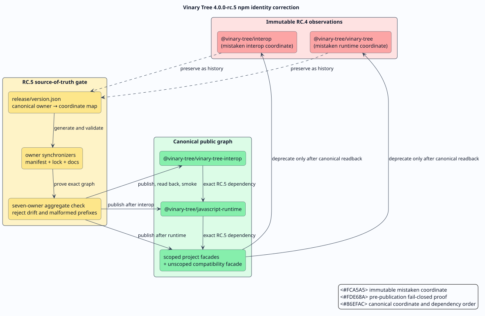

# Vinary Tree `4.0.0-rc.5` release ledger

**Train opened:** 2026-08-26  
**Canonical tag:** `v4.0.0-rc.5`  
**Policy:** [coordinated release runbook](../releasing-language-bindings.md)  
**Predecessor evidence:** [`4.0.0-rc.4`](4.0.0-rc.4.md)  
**State:** coordinated RC.5 branches and pull requests include the third
hosted-CI repair wave. Six owners pass their complete hosted workflows at their
exact remote branch tips. The root compiler-dialect correction is pushed and
its replacement run has 49 of 52 jobs green; Miri and sanitizers remain active.
DragonFlyBSD no longer hangs, but its base compiler couples a recognized C++20
mode to a standard library without `<span>`. The maintained-toolchain and
library-capability correction passes local workflow and header validation and
awaits separate approval to push. No RC.5 tag or registry coordinate has been
published.

This append-only ledger records the correction of two accidental public npm
identities and a cross-registry description drift. It distinguishes facts
observed in public registries from planned actions. A row becomes **passed**
only after the public bytes can be fetched without repository credentials and a
clean consumer exercises the documented API.



## Incident and root cause

The RC.4 JavaScript train published two standalone owners under names that were
not their established project names:

| Artifact owner | Mistaken immutable npm coordinate | Canonical npm coordinate |
|---|---|---|
| `vinary-tree-interop` | `@vinary-tree/interop` | `@vinary-tree/vinary-tree-interop` |
| `javascript-runtime` | `@vinary-tree/vinary-tree` | `@vinary-tree/javascript-runtime` |

There was no technical requirement for either rename. The first shortened a
project name after applying the npm organization scope; the second invented an
umbrella product name. Both decisions violated the intended mapping from an
existing public project to its scoped package. Because npm versions are
immutable, changing only source manifests would leave already-published RC.4
facades depending on the wrong coordinates. Reusing the RC.4 version for
different bytes would also destroy reproducibility. The correction therefore
advances the entire exact-version dependency graph to RC.5.

The same audit found that the RC.4 Clojars descriptions for liblevenshtein and
libdictenstein did not match their Maven product descriptions. Clojars
artifacts are immutable as well, so the corrected descriptions first become
public in RC.5. The source-of-truth models now feed both registries.

## Identity contract

An **artifact owner** is the repository that defines, validates, and publishes
one package. A **coordinate** is the registry-qualified package name, excluding
its version. The release train uses this complete mapping:

| Artifact owner | npm coordinate | Role |
|---|---|---|
| `vinary-tree-interop` | `@vinary-tree/vinary-tree-interop` | shared ABI and host-runtime contract |
| `javascript-runtime` | `@vinary-tree/javascript-runtime` | one JavaScript/WASM/WASI runtime instance |
| `libdictenstein` | `@vinary-tree/libdictenstein` | dictionary facade |
| `liblevenshtein-rust` | `@vinary-tree/liblevenshtein` | matching facade |
| `lling-llang` | `@vinary-tree/lling-llang` | language and transduction facade |
| `duallity` | `@vinary-tree/duallity` | duality and product-composition facade |
| `liblevenshtein-npm` | `liblevenshtein` | unscoped compatibility facade; RCs remain on `next` |

For each owner `$`r`$`, the committed release model, package manifest, lockfile,
generated binding model, release workflow, and aggregate train checker must
agree on one coordinate `$`P(r)`$`. The pre-publication invariant is:

```math
\forall r \in R,\quad
P_{\mathrm{model}}(r) = P_{\mathrm{manifest}}(r)
= P_{\mathrm{workflow}}(r) = P_{\mathrm{train}}(r).
```

The aggregate gate also rejects the two mistaken coordinates and the malformed
prefix-overlap token `@vinary-tree/javascript-runtime-interop` from active
source and documentation. Historical ledgers remain unchanged because they
record what was actually published.

## Product descriptions

The release model is authoritative for each product description. RC.5 must
publish these exact strings through both Maven metadata and the corresponding
Clojars project:

| Product | Authoritative description |
|---|---|
| liblevenshtein | A high-performance library for spelling correction, fuzzy dictionary search, and phonetic matching using Levenshtein and related finite-state automata. |
| libdictenstein | High-performance dictionaries and trie-maps for approximate string matching |

The descriptions explain user-visible purpose. They intentionally do not expose
implementation plumbing such as Foreign Function and Memory API snapshots.

## Dependency-ordered recovery algorithm

The order below prevents a facade from becoming public before its exact runtime
dependencies resolve. “Read back” means retrieving registry metadata and the
package archive from the unauthenticated public endpoint.

```text
procedure PublishCorrectedTrain(source graph G):
    validate every owner's local identity and release contracts
    validate the aggregate seven-owner graph and exact RC.5 dependency edges
    obtain explicit approval for the enumerated commits and refs
    push only the approved commits and canonical tags
    publish vinary-tree-interop; read back and smoke-test it
    publish javascript-runtime; read back and smoke-test native, WASM, and WASI entry points
    publish downstream scoped facades in dependency order; read back each archive
    publish the unscoped liblevenshtein RC only to the next channel
    verify every public dependency edge and provenance statement
    move RC.5 next/latest tags only according to the release policy
    deprecate the two mistaken package families with canonical replacement messages
end procedure
```

## Immutable-package migration policy

The mistaken packages are not unpublished. Unpublishing could break lockfiles
and cached builds. After every canonical RC.5 package has passed public
readback, every published version of each mistaken package is deprecated with a
message naming its canonical replacement. Their dist-tags are changed only
after the canonical packages are usable. No redirect is claimed until npm
readback confirms it.

The unscoped `liblevenshtein@latest` line remains `2.0.4` throughout the release
candidate train. RC.5 may be attached to `next`; promotion of `latest` is a
separate final-release decision.

## Authorization and mutation boundary

Local edits, builds, package archives, checksum calculations, and public
readbacks are non-mutating preparation. The following actions require a fresh,
explicit operator approval naming the exact target:

1. pushing any branch or tag;
2. publishing a new registry coordinate or version;
3. moving or removing a registry dist-tag; and
4. deprecating an already-public package.

Interactive passkey prompts are completed by the operator. Trusted-publisher
workflows must bind the exact GitHub repository, workflow filename, and
environment declared in the release runbook.

## Maven relocation byte identity

Historical Maven relocation notices are published only after the canonical
`io.vinarytree` artifact is public. The relocation workflow compares the staged
canonical POM and JAR byte-for-byte with their public Maven Central readbacks.
This is stronger and less error-prone than copying a hash from an earlier
release model: the proof is derived from the exact RC.5 staging input and cannot
accidentally retain an RC.4 digest.

## Evidence matrix

| Gate | Required evidence | Current result |
|---|---|---|
| seven release models | RC.5 registry spellings, canonical package names, exact dependency edges | passed locally |
| local owner synchronizers | write mode followed by read-only drift check | passed for all seven owners |
| aggregate identity gate | seven owners, no embedded owner, no active deprecated coordinate | passed |
| descriptions | release model equals Gradle POM, JReleaser, and Clojars metadata | passed |
| package archives | clean prepack/package verification for every publishable owner | npm and local binding gates passed; protected registry workflows pending |
| source freeze | clean worktrees and enumerated commits | passed locally; exact commits below |
| remote validation | coordinated branches resolve to approved commits and protected workflows pass | third-wave lling-llang and libdictenstein commits pass hosted CI; root run 33117196734 has 49 of 52 jobs green; its locally repaired DragonFlyBSD standard-library failure and two active long-running jobs remain |
| registry publication | dependency-ordered upload with provenance | pending approval |
| public readback | unauthenticated metadata, archive, digest, and clean-consumer smoke | pending publication |
| mistaken-coordinate deprecation | all immutable versions point users to canonical replacements | pending canonical readback |

## Evidence log

- 2026-08-26: public npm readback confirmed that
  `@vinary-tree/vinary-tree-interop` and
  `@vinary-tree/javascript-runtime` did not yet exist, while the two mistaken
  coordinate families contained immutable RC.4-era versions.
- 2026-08-26: isolated seven-owner worktrees were created outside the primary
  dirty worktrees; no primary worktree changes were removed or overwritten.
- 2026-08-26: the root release model advanced to RC.5, adopted canonical npm
  identities and an authoritative product description, and its local release
  synchronizer passed after regenerating every version surface.
- 2026-08-26: the aggregate release-train gate passed with seven standalone
  owners, exact RC.5 edges, valid registry spellings, the `next` npm channel,
  Hackage/fpm embargoes, and protection of the unscoped legacy `latest` tag.
- 2026-08-26: every changed owner passed `git diff --check` and pgmcp's bug
  gate. The root release build passed 4,903 release/all-feature tests with five
  intentional skips; libdictenstein passed 3,046 release/all-feature tests;
  interop passed 39 Rust tests; and the runtime and npm facades passed their
  native, browser-WASM, WASI, property, leak, TypeScript, ClojureScript, and
  package-content gates.
- 2026-08-26: the seven approved `release/4.0.0-rc.5` branches were pushed at
  their exact source-freeze commits and read back successfully. Pull requests
  were opened as
  [interop PR 1](https://github.com/vinary-tree/vinary-tree-interop/pull/1),
  [runtime PR 1](https://github.com/vinary-tree/javascript-runtime/pull/1),
  [libdictenstein PR 6](https://github.com/vinary-tree/libdictenstein/pull/6),
  [liblevenshtein-rust PR 26](https://github.com/vinary-tree/liblevenshtein-rust/pull/26),
  [lling-llang PR 1](https://github.com/vinary-tree/lling-llang/pull/1),
  [duallity PR 2](https://github.com/vinary-tree/duallity/pull/2), and
  [compatibility-package PR 1](https://github.com/vinary-tree/liblevenshtein-npm/pull/1).
  No tags or packages were published.
- 2026-08-26: the first hosted runs passed completely for
  `vinary-tree-interop` and `liblevenshtein-npm`. The runtime run failed
  because npm resolved the unpublished exact interop dependency from the
  registry instead of the adjacent checkout. Cargo-driven jobs in the other
  four repositories checked out master/RC.4 siblings while their manifests
  required exact RC.5 versions. The lling-llang proof job independently failed
  because the Ubuntu Coq package did not provide `List.length_app` under the
  expected name. These signatures are preserved in the hosted run logs; none
  was reclassified as a product-code failure.
- 2026-08-27: the corrective checkout actions select the pull-request
  `release/*` head for every mutable sibling, retain master for ordinary
  development, and pin llattice to `v0.1.0`. All action inputs now cross the
  shell boundary through environment variables, and every computed,
  overridden, or manifest-derived ref is validated before use. Four
  network-free action simulations reproduced the coordinated RC.5 graph, and a
  malformed-ref negative control failed before any clone.
- 2026-08-27: the runtime's canonical named local-package specification
  installed `@vinary-tree/vinary-tree-interop@4.0.0-rc.5` successfully in
  npm offline mode, proving that the corrected command has no registry
  dependency.
- 2026-08-27: lling-llang's Rocq and TLA+ gates were separated without
  weakening the default combined proof command. Native Rocq 9.1.1 passed the
  Rocq-only suite. TLA+ 1.8.0 remains checksum-pinned for CI and the local
  TLA-only suite, including negative controls, passed. Proof and Java scratch
  storage now lives under repository-local `target/proofs/scratch`, was
  removed by the exit trap, and produced no host `/tmp` access. The pinned
  Rocq container digest resolved through a manifest-only lookup; no image
  layers were downloaded or retained.
- 2026-08-27: the five explicitly approved first-wave repair commits were
  pushed and read back byte-exactly. Hosted workflows then passed completely
  for
  [javascript-runtime run 33098963920](https://github.com/vinary-tree/javascript-runtime/actions/runs/33098963920),
  [libdictenstein main run 33098967405](https://github.com/vinary-tree/libdictenstein/actions/runs/33098967405),
  [libdictenstein binding run 33098967441](https://github.com/vinary-tree/libdictenstein/actions/runs/33098967441), and
  [duallity run 33098975188](https://github.com/vinary-tree/duallity/actions/runs/33098975188).
  Together with the already-green interop and compatibility-package owners,
  five of the seven artifact owners have complete hosted evidence.
- 2026-08-27: the
  [root rerun 33098969296](https://github.com/vinary-tree/liblevenshtein-rust/actions/runs/33098969296)
  passed its native, binding, sanitizer, Miri, MSRV, and packaging jobs. Its
  portable jobs all failed in their shared sibling checkout because that
  action still selected RC.4 dependencies, and the all-feature job exposed an
  RC.4 standalone `liblevenshtein-macros/Cargo.lock`. The portable action now
  selects and validates the coordinated release head, while the release
  synchronizer rewrites and checks both Cargo lockfiles. A synthetic RC.5
  checkout selection and malformed-ref negative control passed; the exact
  standalone macro test passed against RC.5.
- 2026-08-27: the
  [lling-llang rerun 33098971189](https://github.com/vinary-tree/lling-llang/actions/runs/33098971189)
  exposed four independent signatures: Rust 1.98's `manual_slice_fill` lint,
  an incorrect TLA+ release checksum, TLC 1.8.0 strict equality rejecting an
  untyped idle-state sentinel, and GitHub runner-command mounts that the Rocq
  image's default UID could not write. The repair uses slice filling, the
  official TLA+ 1.8.0 SHA-256, a product-shaped typed sentinel, and an
  isolated credential-free proof container that explicitly restores the
  image's opam environment. Both hosted Clippy profiles, native Rocq 9.1.1,
  the complete native proof suite, the checksum-pinned TLC 1.8.0 suite, and
  all mutation controls pass locally. TLC scratch is removed from the
  repository-local target tree and no image layers were pulled locally.
- 2026-08-27: the exact approved second-wave branch tips were pushed and read
  back as `75870d0d631353ace5ab6b5046ebb8a711542d0d` for
  liblevenshtein-rust and `72ee2dd56fcbab57436c7097a8588febabcbef40`
  for lling-llang. No tags or registry artifacts were created.
- 2026-08-27: the
  [root second-wave run 33107729568](https://github.com/vinary-tree/liblevenshtein-rust/actions/runs/33107729568)
  passed every completed job, including the formerly failing all-feature,
  nested-macro-lock, portable compile, sanitizer, binding, packaging, and VM
  gates. Its Miri and DragonFlyBSD jobs remained in progress at the last
  ledger observation. The otherwise-successful GHC 9.14.1 job precisely
  located one redundant unqualified `Data.List.foldl'` import in
  libdictenstein's conformance parser. The portable correction uses an explicit
  qualified call, compiles without warnings under strict GHC 9.12.2, and does
  not change parser behavior.
- 2026-08-27: the
  [lling-llang second-wave run 33107727542](https://github.com/vinary-tree/lling-llang/actions/runs/33107727542)
  passed its sanitizer, TLA+, Rust, supply-chain, and binding jobs. Rocq 9.1.1
  started successfully, then failed because the legacy `coq_makefile` command
  no longer exists. The third-wave repair invokes `rocq makefile`, migrates
  imports to `Stdlib`, unifies logical roots, represents the u32 sentinel
  without a huge unary numeral, and runs the container as the GitHub workspace
  UID with the image's opam group. A clean native Rocq 9.1.1 rebuild of the
  complete proof tree passed with no warning blocks, and the proof escape gate,
  YAML parse, shell syntax, shellcheck, Rust formatting, and diff checks passed.
- 2026-08-27: the exact approved third-wave branch tips were pushed and read
  back as `1cf21a1ef1861ca074ded8b63ed17c98c9fd6c7c` for
  libdictenstein and `d4cdb40540338c901addb7c28b932f2d9222a151` for
  lling-llang. The
  [libdictenstein main run 33112833310](https://github.com/vinary-tree/libdictenstein/actions/runs/33112833310),
  [libdictenstein binding run 33112833342](https://github.com/vinary-tree/libdictenstein/actions/runs/33112833342),
  and
  [lling-llang run 33112833338](https://github.com/vinary-tree/lling-llang/actions/runs/33112833338)
  all passed. The successful lling-llang run includes the repaired Rocq 9.1.1
  proof job; the successful libdictenstein binding run includes the affected
  Haskell C1-C10 conformance job.
- 2026-08-27: three healthy BSD VM startups in root run 33107729568 took
  30-41 seconds. DragonFlyBSD remained in the same startup action beyond 90
  minutes, establishing a hosted action or VM hang rather than a product-test
  failure. The preceding successful root Miri baseline took 58 minutes. Local
  commit `bb54735866dca33373a0b58d131dcc11a8e3ed36` gives Miri a
  120-minute job ceiling and every BSD VM start a 10-minute ceiling. The same
  commit moves the documented npm readback consumer from RAM-backed system
  temporary storage into a repository-local `target` directory with exit-trap
  cleanup. YAML parsing and `git diff --check` pass.
- 2026-08-27: exact approved root tip
  `43f9b1e20660816325b75858b0e25c7e113f9584` was pushed and read back. Once
  [replacement run 33115548329](https://github.com/vinary-tree/liblevenshtein-rust/actions/runs/33115548329)
  became visible at that SHA, superseded run 33107729568 was canceled to stop
  its hung VM and old interpreter. The replacement bounded DragonFlyBSD start
  completed successfully, proving the ceiling non-disruptive. Its header gate
  then failed precisely because that platform's older GCC rejects
  `-std=c++20` and recommends the equivalent historical `-std=c++2a` spelling.
  Local commit `0f9e1be1b70db26909e8ea51886a34fde4892713`
  probes an empty translation unit, prefers the finalized spelling, falls back
  only when required, and fails if neither C++20 mode exists. Both modes compile
  the complete C++ header locally with warnings denied; YAML parsing and
  `git diff --check` pass. The same hosted run has 49 green jobs, including the
  repaired GHC 9.14.1 conformance job; only its sanitizer and Miri jobs remain
  active independently of the dialect change.
- 2026-08-27: exact approved root tip
  `7ed45bf7200adc328606897bb765466940d11226` was pushed and read back.
  [Run 33117196734](https://github.com/vinary-tree/liblevenshtein-rust/actions/runs/33117196734)
  again reached 49 green jobs and bounded DragonFlyBSD startup correctly. Its
  header gate proved that a flag-only dialect probe was insufficient: the base
  `c++` accepts `-std=c++2a`, but its standard library fails at the required
  `<span>` header. The
  [official DragonFlyBSD 6.4 package catalogue](https://avalon.dragonflybsd.org/dports/dragonfly:6.4:x86:64/LATEST/)
  lists the `gcc` meta-package, currently backed by GCC 11.5, and documents its
  unversioned `g++` entry point. Local commit
  `0b067aff0025684f05de4c8f24572431454ad189` installs that maintained
  toolchain for DragonFly, selects each below-MSRV BSD compiler explicitly, and
  probes the required `<span>` library facility under both C++20 flag
  spellings before compiling the complete header. Workflow YAML parsing,
  `git diff --check`, warning-denied full-header checks under both spellings,
  and the oldest maintained local compiler (GCC 13) pass. The earlier root run
  has also completed its independent sanitizer job successfully; Miri remains
  active.

## Local source freeze

These commits contain the validated RC.5 implementation before any remote
mutation. The root ledger-evidence commit is intentionally appended after the
root implementation commit, so it can cite the implementation graph without a
self-referential hash.

| Artifact owner | Local commit | Subject |
|---|---|---|
| `vinary-tree-interop` | `32b8d2400aac4ed431f535b0689054d963b7b18b` | restore the canonical interop npm identity |
| `javascript-runtime` | `d6e7963c45bf0983116172665474cd63819468ff` | name the shared JavaScript runtime explicitly |
| `libdictenstein` | `d9a70d6b84db46358a7994bab019010aefc4f9a8` | synchronize release identity and registry metadata |
| `liblevenshtein-rust` | `411cbd08edf1a144b711fd6071b09177fc24f239` | enforce the canonical seven-owner RC.5 train |
| `lling-llang` | `4e88c5aaff935b5588052f44cf6f14d3e62354b4` | align bindings with the canonical runtime graph |
| `duallity` | `d1e79ce2876bde4e4fc87d2f851aa35d4820d236` | align bindings with the canonical runtime graph |
| `liblevenshtein-npm` | `1de062b8ffb08340313115995dfeb62612fbcf3c` | preserve the unscoped compatibility package |

The first hosted-CI repairs were pushed after exact approval and read back at
these branch tips:

| Artifact owner | Local CI-repair commit | Corrective scope |
|---|---|---|
| `javascript-runtime` | `6bf343ca5ed66b94dc04e74629af75f2a899f8fa` | coordinated source selection and named local npm dependency |
| `libdictenstein` | `d21fd4dafbfee89a1a9a24f018802ac58e2a42d7` | coordinated sibling selection and validated shell boundary |
| `liblevenshtein-rust` | `7613548717c2c71bdfa1d5d56cffd95c8c512751` | reusable coordinated family checkout and append-only incident evidence |
| `lling-llang` | `28a2db9d6a53359c3c5d9d90ed5f6e61417ae38f` | coordinated siblings and reproducible split proof environments |
| `duallity` | `387521f2e2c40ea1abc14e267c35f6006291b703` | coordinated siblings without synthetic pull-request refs |

The second hosted-CI repairs were pushed after exact approval and read back at
these branch tips:

| Artifact owner | Remote branch tip | Corrective scope |
|---|---|---|
| `liblevenshtein-rust` | `75870d0d631353ace5ab6b5046ebb8a711542d0d` | coordinated portable siblings, synchronized standalone macro lock, and append-only failure evidence |
| `lling-llang` | `72ee2dd56fcbab57436c7097a8588febabcbef40` | Rust 1.98 lint compatibility and reproducible Rocq/TLA+ verification |

The third hosted-CI repairs were pushed after exact approval, read back, and
passed their complete hosted workflows:

| Artifact owner | Remote branch tip | Corrective scope |
|---|---|---|
| `libdictenstein` | `1cf21a1ef1861ca074ded8b63ed17c98c9fd6c7c` | warning-free strict folding across old and new GHC Prelude exports |
| `lling-llang` | `d4cdb40540338c901addb7c28b932f2d9222a151` | complete Rocq 9.1 command, namespace, numeral, and container-user migration |

The root bounded-runner and operator-storage correction was pushed after exact
approval and read back at this branch tip:

| Artifact owner | Remote branch tip | Corrective scope |
|---|---|---|
| `liblevenshtein-rust` | `43f9b1e20660816325b75858b0e25c7e113f9584` | evidence-based Miri and BSD startup ceilings, repository-local npm readback storage, and append-only evidence |

The DragonFlyBSD C++20 dialect correction was first committed locally before
its approved push:

| Artifact owner | Local CI-repair commit | Corrective scope |
|---|---|---|
| `liblevenshtein-rust` | `0f9e1be1b70db26909e8ea51886a34fde4892713` | capability-probed finalized and historical C++20 compiler flags |

That correction and its evidence ledger were subsequently pushed after exact
approval and read back at this branch tip:

| Artifact owner | Remote branch tip | Corrective scope |
|---|---|---|
| `liblevenshtein-rust` | `7ed45bf7200adc328606897bb765466940d11226` | C++20 dialect probing, exact hosted failure evidence, and reconciled source freeze |

The newly exposed DragonFlyBSD standard-library correction is committed
locally and has not been pushed:

| Artifact owner | Local CI-repair commit | Corrective scope |
|---|---|---|
| `liblevenshtein-rust` | `0b067aff0025684f05de4c8f24572431454ad189` | maintained DragonFly C++ toolchain and library-feature-aware dialect probing |

Append exact full commits after their final ledger commit exists, hosted
workflow run URLs after rerun, registry digests, and clean-consumer results as
the train advances. Do not rewrite a failure into a success.
