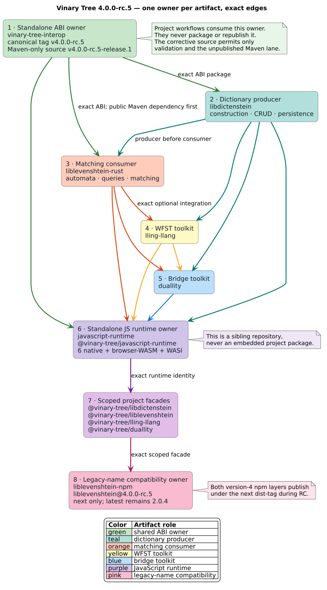
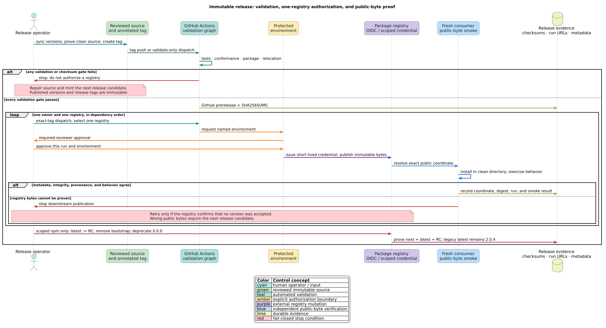

# Releasing the Vinary Tree language bindings

This guide defines the release architecture, version policy, publication order,
validation gates, credentials, and recovery procedure for the Vinary Tree
family. It is normative for the `4.0.0-rc.4` release train.

The central rule is **one artifact owner, one repository, one release
workflow**. Project repositories may test an exact dependency, but they never
rebuild or republish an artifact owned by another repository.



## Terms and invariants

An **artifact owner** is the sole repository permitted to publish a package
coordinate. A **facade** is a language-natural public API which delegates to a
Rust implementation or shared runtime. A **release train** is the set of exact
versions intended to interoperate. A **candidate** is a build that is validated
but deliberately not uploaded. A **dist-tag** is npm's human-readable pointer
to a package version; npm publishes to `latest` unless another tag is supplied,
which is why every RC command explicitly supplies `--tag next`.

The release has five invariants:

1. Every publish-time dependency edge is exact; no branch, range, or workspace
   fallback may enter a registry artifact.
2. `release/version.json` is the version authority in each owning repository.
   Its local `scripts/sync-release-version.py` materializes registry-specific
   spellings.
3. `scripts/check-release-train.py` must accept all seven owners together before
   the first package is uploaded.
4. Hackage and fpm receive buildable numeric `4.0.0` candidates during the RC,
   but those candidates are not published because their package versions cannot
   distinguish the RC from the future final release.
5. `liblevenshtein@latest` remains `2.0.4` throughout the RC. Version-4 bytes
   first enter npm under `next`. Because npm assigns `latest` to the first
   publication of a new package even when that publication uses another tag,
   each new scoped coordinate is reserved by an inert `0.0.0` bootstrap. After
   the real RC passes installed-artifact smoke tests, its scoped `latest`
   pointer is moved from `0.0.0` to `4.0.0-rc.4` and the `bootstrap` tag is
   removed. The legacy unscoped coordinate is never moved during the RC.

Cargo documents why a published crate version is immutable and recommends a
dry run before upload in the [Cargo publishing guide](https://doc.rust-lang.org/cargo/reference/publishing.html).
npm's [dist-tag guide](https://docs.npmjs.com/adding-dist-tags-to-packages/)
explains the explicit tag required to avoid changing `latest`.

## Repository and coordinate ownership

| Owner repository | Responsibility | Public coordinates in this train |
|---|---|---|
| `vinary-tree-interop` | Shared retained-resource ABI, headers, and language resource types | `vinary-tree-interop`, `@vinary-tree/interop`, `VinaryTree.Interop`, `io.vinarytree:vinary-tree-interop`, and matching PyPI, Go, Swift, OCaml, Haskell, Fortran, CMake, and pkg-config packages |
| `libdictenstein` | Dictionary construction, mutation, persistence, and collection facades | `libdictenstein` and its project-specific language packages |
| `liblevenshtein-rust` | Levenshtein automata, matching, and query facades | `liblevenshtein` and its project-specific language packages |
| `lling-llang` | Weighted finite-state transducer toolkit and project facade | `lling-llang`, `@vinary-tree/lling-llang`, and native package metadata |
| `duallity` | Bridges between Levenshtein automata and weighted transducers | `duallity`, `@vinary-tree/duallity`, and native package metadata |
| `javascript-runtime` | One native/WASM/WASI runtime and resource table for every JavaScript facade | `@vinary-tree/vinary-tree` |
| `liblevenshtein-npm` | Compatibility ownership of the legacy unscoped npm name | `liblevenshtein` only; it delegates exactly to `@vinary-tree/liblevenshtein` |

The repositories are siblings, not nested packages. In particular,
`vinary-tree-interop` and `javascript-runtime` are not owned by
`liblevenshtein-rust`. The scoped liblevenshtein JavaScript facade remains in
`liblevenshtein-rust`; the unscoped compatibility facade is intentionally a
separate repository.

The compatibility package is a package-name bridge, not an emulation of the
legacy JavaScript API. Version 4 consumers use the new Rust-backed facade API.
Its ESM, CommonJS, TypeScript, ClojureScript, browser-WASM, and WASI exports are
thin re-exports of the exact scoped package.

### Distribution-name invariant

The owner identity and the library name are separate concepts. Use
`vinary-tree` as an organization, group, scope, repository owner, or
language-level namespace where the ecosystem supports one; do not concatenate
it onto an algorithm package's globally registered distribution name. The
shared interoperability package is the deliberate exception because
`vinary-tree-interop` is its actual name.

| Ecosystem shape | liblevenshtein | libdictenstein | Interop |
|---|---|---|---|
| Global package name | `liblevenshtein` | `libdictenstein` | `vinary-tree-interop` |
| npm scope | `@vinary-tree/liblevenshtein` | `@vinary-tree/libdictenstein` | `@vinary-tree/interop` |
| Maven/Clojars group | group `io.vinarytree`; artifact `liblevenshtein` or `liblevenshtein-clojure` | group `io.vinarytree`; artifact `libdictenstein` or `libdictenstein-clojure` | group `io.vinarytree`; artifact `vinary-tree-interop` |
| Go repository owner | `github.com/vinary-tree/liblevenshtein-rust/...` | `github.com/vinary-tree/libdictenstein/...` | `github.com/vinary-tree/vinary-tree-interop/...` |

“Global package name” governs PyPI, NuGet, RubyGems, SwiftPM's declared package,
fpm, opam, Hackage, and LuaRocks. Language imports remain idiomatic and may use
the Vinary Tree namespace—for example, the NuGet distribution
`Liblevenshtein` exposes the C# namespace `VinaryTree.Liblevenshtein`. Release
checks must compare every manifest with `bindings/api.json` so a prefixed
distribution cannot silently return.

For RC.4, the already-published global-distribution metadata came from
append-only root source `v4.0.0-rc.4-release.5` and libdictenstein source
`v4.0.0-rc.4-release.2`. The clean-runner LuaRocks recovery advances only the
affected publisher sources to root `v4.0.0-rc.4-release.6` and libdictenstein
`v4.0.0-rc.4-release.4`; package versions and language APIs remain unchanged.
Source-fetching metadata must distinguish the immutable package version from
its corrective source tag: the LuaRocks rockspecs name those recovery refs,
and opam staging derives its ref from the validated workflow dispatch.
Synchronizers enforce this provenance so a registry cannot fetch an earlier
tag that lacks the required publisher environment.

## Two-phase, fail-closed workflow protocol

A **validation dispatch** builds and tests an immutable tag, stages every
candidate artifact, and creates or refreshes the checksummed GitHub
prerelease. A **registry dispatch** repeats those gates but permits exactly one
named publication job to enter its protected environment. These are separate
operations because a source tag is evidence to validate, not authorization to
mutate every configured registry.

Every manual release must run against the tag itself. A branch dispatch fails
in the contract job, even when its files happen to declare the expected
version. The `registry` choice is also fail-closed: `validate-only` enables no
registry uploader, while each other value enables one and only one uploader.

| Owner | Workflow | npm coordinate |
|---|---|---|
| `vinary-tree-interop` | `release.yml` | `@vinary-tree/interop` |
| `libdictenstein` | `release-bindings.yml` | `@vinary-tree/libdictenstein` |
| `liblevenshtein-rust` | `release.yml` | `@vinary-tree/liblevenshtein` |
| `lling-llang` | `release-bindings.yml` | `@vinary-tree/lling-llang` |
| `duallity` | `release-bindings.yml` | `@vinary-tree/duallity` |
| `javascript-runtime` | `release.yml` | `@vinary-tree/vinary-tree` |
| `liblevenshtein-npm` | `release.yml` | legacy `liblevenshtein` |

For example, validate one owner and then publish only its npm artifact:

```bash
gh workflow run release.yml \
  --repo vinary-tree/liblevenshtein-rust \
  --ref v4.0.0-rc.4 \
  -f registry=validate-only

gh workflow run release.yml \
  --repo vinary-tree/liblevenshtein-rust \
  --ref v4.0.0-rc.4 \
  -f registry=npm
```

Repositories whose workflow is named `release-bindings.yml` use that filename
in the same command. The protected `npm` environment supplies the human review
boundary; npm's trusted publisher supplies short-lived OpenID Connect (OIDC)
credentials and provenance. Neither operation uses the workstation's
long-lived npm login.

The workflow state transition is:

```text
immutable tag
  -> validate-only gates
  -> checksummed GitHub prerelease
  -> approve one protected registry environment
  -> publish one staged coordinate
  -> resolve and smoke-test the public bytes
```

If any transition fails, keep the immutable tag unchanged and never widen a
failed run to an `all registries` operation. Normally, repair the source and
mint the next candidate. A workflow-only failure discovered before this owner
publishes any coordinate may instead use the narrowly defined corrective-source
procedure below; it preserves the package version without moving the failed
tag or obscuring the source that actually produced the artifacts.



The protected environment is an authorization boundary, not a test substitute:
the test graph has already accepted the bytes before a human permits one
external mutation. The fresh consumer then proves what the registry serves,
not what the build workspace happened to contain.

## Operator command protocol

This section is the executable command sheet. Replace values in uppercase; do
not copy a run identifier or environment identifier from an earlier release.

### 1. Establish and record the immutable source

Run the repository's sync and validation commands, inspect the diff, and commit
every intended change before creating the tag. A release tag is annotated so it
records an explicit release event rather than merely naming a commit.

```bash
RELEASE_VERSION="4.0.0-rc.4"
RELEASE_TAG="v${RELEASE_VERSION}"

python3 scripts/sync-release-version.py
git diff --check
git status --short
git tag -a "${RELEASE_TAG}" -m "Release ${RELEASE_TAG}"
git push origin "refs/tags/${RELEASE_TAG}"
```

Do not force-move a release tag after it is pushed. If the tag graph exposes a
defect, normally correct the source and mint the next candidate. Before the
first tag, the same commit must already have passed ordinary branch CI and the
local release gates. A tag push establishes an immutable source boundary; it
does not start a workflow or authorize a registry operation.

#### Corrective source tag for an unpublished owner

A numbered tag of the form `vVERSION-release.N` is an exceptional source
identity, not a new package version. It is permitted only when all of the
following are true:

1. the canonical `vVERSION` tag failed before the target coordinate was
   published at `VERSION`;
2. the correction is limited to release automation, verification, or
   documentation and does not change the shipped API, ABI, or runtime behavior;
3. the failed canonical tag remains immutable and its failure is recorded in
   the release ledger;
4. every registry-facing version is derived from the package manifest, never
   from the corrective tag name; and
5. the corrective tag receives the complete `validate-only`, protected publish,
   registry read-back, and clean-consumer sequence; and
6. if another coordinate from that owner is already public, the workflow guard
   permits only `validate-only` and the exact still-unpublished registry lane.

For example, `v4.0.0-rc.4-release.1` may authoritatively produce packages whose
version remains `4.0.0-rc.4`. The workflow guard accepts the canonical tag or a
positive, numbered corrective suffix and rejects branches, unnumbered suffixes,
and suffix zero. If the target coordinate is already public, the target payload
changes, or the library/package behavior changes, advance the package version
instead. Never use this mechanism to rebuild or replace published bytes.

The shared interop RC.4 Maven lane is the narrow multi-registry case. Its crate
and npm package are already public from the canonical tag, while its Maven
coordinate is not. The nested JReleaser invocation at that tag lacks Git-root
discovery. `vinary-tree-interop` therefore uses
`v4.0.0-rc.4-release.1` solely for `validate-only` and `maven-central`; its
workflow rejects every already-published or unrelated registry lane.

### 2. Dispatch and observe validation

Release workflows are deliberately `workflow_dispatch`-only. This allows all
cross-project tags to exist before any checkout, while registry-shaped jobs run
only after their exact upstream coordinates exist. Dispatch `validate-only`
against the tag, record the run URL, and wait for its conclusion:

```bash
OWNER_REPOSITORY="vinary-tree/libdictenstein"
WORKFLOW_FILE="release-bindings.yml"

gh workflow run "${WORKFLOW_FILE}" \
  --repo "${OWNER_REPOSITORY}" \
  --ref "${RELEASE_TAG}" \
  -f registry=validate-only

gh run list \
  --repo "${OWNER_REPOSITORY}" \
  --workflow "${WORKFLOW_FILE}" \
  --limit 10

gh run watch RUN_ID --repo "${OWNER_REPOSITORY}" --exit-status
```

Use `release.yml` for interop, liblevenshtein-rust, javascript-runtime, and
liblevenshtein-npm; use `release-bindings.yml` for libdictenstein,
lling-llang, and duallity. A validation dispatch never enables a registry
uploader. Branch dispatches fail the immutable-tag contract.

### 3. Dispatch exactly one registry

The registry input is the capability selector. It must name one registry and
the ref must be the immutable tag:

```bash
gh workflow run "${WORKFLOW_FILE}" \
  --repo "${OWNER_REPOSITORY}" \
  --ref "${RELEASE_TAG}" \
  -f registry=crates-io

PUBLISH_RUN_ID="RUN_ID_RETURNED_BY_GITHUB"
gh run view "${PUBLISH_RUN_ID}" --repo "${OWNER_REPOSITORY}"
```

The build and package jobs rerun before the protected publication job. Never
approve the environment merely because an older validation run was green;
confirm that the current run is at the expected tag and commit.

### 4. Review a pending protected environment

GitHub exposes the exact environment awaiting approval. Read it first, then
approve only that environment for that run:

```bash
gh api \
  "repos/${OWNER_REPOSITORY}/actions/runs/${PUBLISH_RUN_ID}/pending_deployments"

ENVIRONMENT_ID="ID_FROM_THE_RESPONSE"
gh api --method POST \
  "repos/${OWNER_REPOSITORY}/actions/runs/${PUBLISH_RUN_ID}/pending_deployments" \
  -F "environment_ids[]=${ENVIRONMENT_ID}" \
  -f state=approved \
  -f comment="Approved after exact-tag validation and artifact review."

gh run watch "${PUBLISH_RUN_ID}" \
  --repo "${OWNER_REPOSITORY}" \
  --exit-status
```

The review API is documented by GitHub's
[workflow-run deployments reference](https://docs.github.com/en/rest/actions/workflow-runs#review-pending-deployments-for-a-workflow-run).
The approval does not provide a reusable registry secret: npm and PyPI obtain
short-lived OpenID Connect (OIDC) credentials from their configured trusted
publishers.

### 5. Prove the public bytes before releasing a dependent

A successful upload step is necessary but insufficient. Wait for registry
indexing, resolve the exact coordinate, verify registry metadata and digest,
and install it into a fresh consumer. Record the command output and the GitHub
run URL in the release ledger.

For a Rust crate:

```bash
CRATE_NAME="libdictenstein"
cargo info "${CRATE_NAME}@${RELEASE_VERSION}"
```

Then create a temporary consumer whose manifest pins
`=${RELEASE_VERSION}`, run `cargo check --locked`, and remove the temporary
directory. Downstream publication starts only after that registry-shaped
consumer passes.

For an npm package:

```bash
NPM_PACKAGE="@vinary-tree/libdictenstein"
npm view "${NPM_PACKAGE}@${RELEASE_VERSION}" \
  version dist.integrity dist.shasum --json

SMOKE_DIRECTORY="$(mktemp -d /tmp/vinary-tree-npm-smoke.XXXXXX)"
trap 'rm -rf -- "${SMOKE_DIRECTORY}"' EXIT
npm install --prefix "${SMOKE_DIRECTORY}" \
  "${NPM_PACKAGE}@${RELEASE_VERSION}"
(
  cd "${SMOKE_DIRECTORY}"
  node -e "require('${NPM_PACKAGE}')"
  node --input-type=module -e "await import('${NPM_PACKAGE}')"
)
```

The smoke program must import the installed package—not a repository-relative
path—and exercise its public construction, query or traversal, iteration,
snapshot where applicable, and deterministic-close contracts. Remove the exact
temporary directory after its evidence is captured.

### 6. Normalize a newly scoped npm coordinate

npm may attach `latest` to a package's first published version even when the
publication command supplied another tag. Each Vinary Tree scoped name was
therefore reserved with inert `0.0.0` bytes. Only after the RC's installed-byte
smoke passes, use an interactive web-authenticated session to replace that
bootstrap default:

```bash
npm login --auth-type=web
npm whoami

NPM_PACKAGE="@vinary-tree/libdictenstein"
npm dist-tag add "${NPM_PACKAGE}@${RELEASE_VERSION}" latest --auth-type=web
npm dist-tag rm "${NPM_PACKAGE}" bootstrap --auth-type=web
npm deprecate "${NPM_PACKAGE}@0.0.0" \
  "Bootstrap-only placeholder; use ${NPM_PACKAGE}@${RELEASE_VERSION} or newer." \
  --auth-type=web

npm view "${NPM_PACKAGE}" versions dist-tags --json
npm view "${NPM_PACKAGE}@0.0.0" deprecated --json
```

Repeat this read-modify-read protocol for `@vinary-tree/interop`,
`@vinary-tree/vinary-tree`, `@vinary-tree/libdictenstein`,
`@vinary-tree/liblevenshtein`, `@vinary-tree/lling-llang`, and
`@vinary-tree/duallity`. The postcondition is
`latest = next = 4.0.0-rc.4`, no `bootstrap` tag, and an explicit deprecation
message on `0.0.0`.

Do not create or store a token that bypasses two-factor authentication (2FA)
for this task. GitHub Actions uses npm
[trusted publishing](https://docs.npmjs.com/trusted-publishers/) and
[package provenance](https://docs.npmjs.com/generating-provenance-statements/);
the local web login is limited to post-publication metadata changes that npm
does not yet authorize through the trusted-publisher workflow.

The legacy unscoped package is deliberately different:

```bash
npm view liblevenshtein dist-tags --json
```

During the RC, it must report `latest = 2.0.4` and
`next = 4.0.0-rc.4`. Never apply the scoped-package `latest` command to this
coordinate.

## Version function

Let `M`, `m`, and `p` denote the major, minor, and patch components, and let `r`
denote the release-candidate ordinal. For this train, `$`M = 4`$`, `$`m = 0`$`,
`$`p = 0`$`, and `$`r = 4`$`. Define the canonical version `$`v`$` and numeric
base `$`b`$` as follows:

```math
v = M.m.p\text{-rc}.r = \text{4.0.0-rc.4}, \qquad b = M.m.p = \text{4.0.0}.
```

Each registry renderer `$`R_e`$` maps `$`v`$` into the syntax accepted by
ecosystem `$`e`$`:

```math
R_e(v) =
\begin{cases}
\text{4.0.0-rc.4} & e \in \{\text{Cargo,npm,Maven,Clojars,NuGet,Swift,CMake,C++}\},\\
\text{4.0.0rc4} & e = \text{PyPI},\\
\text{4.0.0rc4-1} & e = \text{LuaRocks},\\
\text{4.0.0.rc.4} & e = \text{RubyGems},\\
\text{4.0.0\textasciitilde rc4} & e = \text{opam},\\
\text{v4.0.0-rc.4} & e = \text{Go tag},\\
\text{4.0.0} & e \in \{\text{Hackage,fpm candidates}\}.
\end{cases}
```

| Ecosystem | RC spelling | Publication policy |
|---|---|---|
| Cargo, npm, Maven, Clojars, NuGet, Swift, CMake, pkg-config | `4.0.0-rc.4` | Publish after its owner passes all gates |
| PyPI | `4.0.0rc4` | Publish after wheel tests |
| RubyGems | `4.0.0.rc.4` | Publish after native-resource inspection |
| opam | `4.0.0~rc4` | Submit an opam-repository pull request |
| Go | module path ending in `/v4`; tag `v4.0.0-rc.4` | Create the immutable subdirectory tag after dependencies resolve |
| LuaRocks | `4.0.0rc4-1` | Publish linted rockspec metadata; rockspec format 1.0 permits one hyphen only, before the numeric revision |
| Hackage | `4.0.0` with `x-release-candidate: rc.4` | Build candidate only; do not upload |
| fpm | `4.0.0` | Build candidate only; do not upload |

`llattice` is intentionally outside the synchronized major-version train and
remains pinned to `0.1.0`.

## Release graph and order

Source tags for every repository are pushed before remote validation because
cross-project conformance tests consume exact source tags. Tag pushes are inert;
each validation and publication workflow is explicitly dispatched. Registry-
shaped validation and publication then follow dependency order:

1. Validate and publish `vinary-tree-interop` in every authorized registry,
   including `@vinary-tree/interop`; independently verify each public
   coordinate.
2. Validate libdictenstein after interop resolves, then publish and verify its
   crate and non-JavaScript binding coordinates. Its scoped npm facade remains
   staged until the shared runtime is public.
3. Validate liblevenshtein after the libdictenstein and interop crates resolve,
   then publish and verify its crate and non-JavaScript coordinates after the
   retained-resource handoff fixture passes.
4. Validate and publish the `lling-llang` crate, then the `duallity` crate,
   because their Rust integrations pin the preceding coordinates exactly.
5. Validate and publish `@vinary-tree/vinary-tree` from
   `javascript-runtime` after all Rust components and scoped interop are
   public. Its native/WASM/WASI builds consume the complete exact source-tag
   graph.
6. Publish and verify the four scoped npm project facades against that exact
   runtime. Install and exercise all scoped packages together, then normalize
   their `latest`, `next`, `bootstrap`, and bootstrap-deprecation metadata.
7. Publish `liblevenshtein@4.0.0-rc.4` from `liblevenshtein-npm`, also with
   `--tag next`, after `@vinary-tree/liblevenshtein@4.0.0-rc.4` resolves.

The libdictenstein workflow uses liblevenshtein source for a cross-project
consumer test. That is a **validation dependency**, not a reason to invert the
registry order: dictionary packages remain independently usable and are
published before the matching consumer.

### Literate release algorithm

The algorithm first proves that every coordinate describes the same train,
then publishes one owner at a time. The registry observation after each upload
is part of the algorithm: downstream publication never relies on an upload
command merely returning success.

```text
procedure VALIDATE_OWNER(owner):
    owner.dispatch(tag = "v4.0.0-rc.4", registry = "validate-only")
    require owner.validation.is_success
    require owner.github_prerelease.has_valid_checksums

procedure PUBLISH_AND_VERIFY(owner, registry):
    owner.dispatch(tag = "v4.0.0-rc.4", registry = registry)
    wait_until_every_published_coordinate_resolves(owner, registry)
    rerun_owner_smoke_tests_against_registry_bytes(owner, registry)

procedure RELEASE_4_RC_4(owners):
    # Establish one immutable source state for every owner.
    for owner in owners:
        require owner.worktree_is_clean
        owner.sync_release_version(check = true)
        owner.run_project_gates()

    require check_release_train(owners)
    require npm_dist_tag("liblevenshtein", "latest") = "2.0.4"

    # Push every tag without triggering a workflow. Each source-tag graph is
    # therefore complete before validation starts.
    for owner in owners:
        owner.push_annotated_tag("v4.0.0-rc.4")

    # Each stage starts only after the preceding public-byte barriers pass.
    VALIDATE_OWNER(interop)
    for registry in interop.authorized_registries_in_dependency_order:
        PUBLISH_AND_VERIFY(interop, registry)

    for owner in [libdictenstein, liblevenshtein, lling_llang, duallity]:
        VALIDATE_OWNER(owner)
        for registry in owner.authorized_non_npm_registries_in_dependency_order:
            PUBLISH_AND_VERIFY(owner, registry)

    VALIDATE_OWNER(javascript_runtime)
    PUBLISH_AND_VERIFY(javascript_runtime, npm)

    for owner in [libdictenstein, liblevenshtein, lling_llang, duallity]:
        PUBLISH_AND_VERIFY(owner, npm)

    VALIDATE_OWNER(legacy_npm_facade)
    PUBLISH_AND_VERIFY(legacy_npm_facade, npm)

    for package in new_scoped_npm_coordinates:
        require npm_dist_tag(package, "next") = "4.0.0-rc.4"
        npm_set_dist_tag(package, "latest", "4.0.0-rc.4")
        npm_remove_dist_tag(package, "bootstrap")
        require npm_dist_tag(package, "latest") = "4.0.0-rc.4"

    require npm_dist_tag("liblevenshtein", "latest") = "2.0.4"
    record_checksums_and_release_evidence()
```

The scoped retarget above replaces npm's unusable bootstrap default only after
the RC is proven. It is not the legacy package's final-release promotion:
moving unscoped `liblevenshtein@latest` remains a separate final-release
decision.

## Preparing a release checkout

Place the repositories as siblings. The local checker accepts environment
overrides, which is useful when lling-llang or duallity must remain isolated in
release worktrees:

```bash
export VINARY_TREE_INTEROP_ROOT=../vinary-tree-interop
export VINARY_TREE_JAVASCRIPT_RUNTIME_ROOT=../javascript-runtime
export LIBDICTENSTEIN_ROOT=../libdictenstein
export LLING_LLANG_ROOT=../lling-llang
export DUALLITY_ROOT=../duallity
export LIBLEVENSHTEIN_NPM_ROOT=../liblevenshtein-npm

python3 scripts/check-release-train.py
```

Keep Cargo dependencies declared with both `path` and an exact `version` in
the reviewed source. Cargo's supported multiple-location dependency form uses
the path locally and removes it from the normalized registry manifest. Do not
rewrite `Cargo.toml` or `Cargo.lock` inside the publication job: doing so makes
the checkout dirty and causes `cargo publish` to reject the release unless an
unsafe override is added. Instead, check out exact sibling tags where local
path discovery is required and publish the unchanged source:

```bash
cargo publish --dry-run --locked
git diff --exit-code -- Cargo.toml Cargo.lock
cargo publish --locked
```

Cargo documents this normalization under
[multiple dependency locations](https://doc.rust-lang.org/cargo/reference/specifying-dependencies.html#multiple-locations).
Each repository's version synchronizer owns both its manifest coordinates and
the corresponding family package entries in its primary `Cargo.lock`. A
read-only synchronizer invocation must reject a stale lock, and every native
SDK component build uses `--locked`. Run Cargo from the component owner rather
than a consumer directory containing a broader `[patch]` overlay; otherwise
Cargo can try to record unrelated `patch.unused` entries in an independent
owner's lockfile. After every clean rehearsal, prove that the reviewed lockfile
is byte-for-byte unchanged.

The public versions on the registry remain prerequisites for package
verification and downstream consumers; exact source checkouts do not replace
the dependency-order gate. Python wheel isolation, Gradle staging, and npm
packing provide equivalent registry-shaped checks for their ecosystems.

For every owning repository:

```bash
python3 scripts/sync-release-version.py
git diff --exit-code
```

The first command is deliberately idempotent. A diff after the second
invocation means either a coordinate escaped the model or the generator is not
stable; both are release blockers.

### Documentation and generated-evidence gate

Documentation is part of the released interface. After synchronizing the
version, render diagrams from their sources, validate mathematical delimiters
and language guides, and reject generated drift before tagging:

```bash
python3 scripts/sync-release-version.py
python3 scripts/check-binding-docs.py
scripts/doc-mathlint.sh
docs/diagrams/render.sh --check
git diff --check
```

`docs/diagrams/render.sh` supplies Java's headless mode internally, renders into
a temporary tree in check mode, and compares those bytes with the committed
SVGs. Do not invoke a GUI renderer during a release. Every diagram must retain
its source beside the SVG; edit the source and regenerate rather than editing
SVG markup by hand. Store command output as validation evidence, then remove
the temporary log after the ledger has captured the result.

## Artifact-specific gates

### Rust and native C/C++

Run locked tests, all-feature tests, Clippy, documentation, and package dry
runs. Platform feature minimums required by dependencies such as Gxhash belong
in target-scoped `.cargo/config.toml` entries. Workflow-level `RUSTFLAGS` must
not override that matrix, and release binaries must not embed
`target-cpu=native`. Sanitizer jobs are the exception: their environment flags
must explicitly carry both the sanitizer instrumentation and the target's
portable baseline.

Native archives contain only the project that owns them. They depend on the
separately installed `vinary-tree-interop` CMake/pkg-config package:

```cmake
find_package(vinary-tree-interop 4.0 CONFIG REQUIRED)
find_package(liblevenshtein 4.0 CONFIG REQUIRED)
target_link_libraries(app PRIVATE liblevenshtein::liblevenshtein)
```

Required native targets are Linux x86-64, Linux ARM64, macOS x86-64, macOS
ARM64, Windows x86-64, and Windows ARM64 where the owning artifact supports a
native payload. Each archive is tested after relocation with both shared and
static linkage when offered.

### Python, JVM, Clojure, .NET, and Ruby

Python wheels use the PyPI spelling `4.0.0rc4`, bundle only their project native
library, and depend exactly on `vinary-tree-interop==4.0.0rc4`.

The JVM artifact targets the documented Java level, uses Foreign Function &
Memory resource lifetimes, bundles its project native resources, and depends
on `io.vinarytree:vinary-tree-interop:4.0.0-rc.4`. The Clojure facade directly
depends on both that interop coordinate and
`io.vinarytree:liblevenshtein:4.0.0-rc.4`; a validation job must therefore
install the exact staged JAR and POM for both coordinates into its local test
repository before Leiningen starts. The JVM producer transports the two
staging trees as separately named workflow artifacts. Root JReleaser jobs
download only the root-owned tree, preserving the invariant that one owner
cannot publish another owner's bytes.
Maven Central and Clojars are separate coordinates and separate credentials.
Collection conformance tests that construct dictionaries also require the
exact native libdictenstein provider. The job builds that provider with its
`ffi` feature, passes its directory explicitly, and canonicalizes every native
directory to an absolute path before Gradle forks a test process. A developer's
pre-existing `target` directory is never an acceptable provider.

For RC.4, publish and independently resolve
`io.vinarytree:vinary-tree-interop:4.0.0-rc.4` from the interop corrective
source tag before dispatching the root Maven lane. Root validation continues to
build the immutable canonical interop source locally; the corrective interop
commit changes release metadata and automation only, not Java sources or ABI.

#### Maven Central identity and the legacy Java coordinate

Maven Central is the publication authority for the JVM artifacts. JFrog is not
part of this release path: JReleaser uploads the signed staging bundle directly
through Sonatype's Central Publisher API. The protected workflow environment
holds a short-lived or expiring [Central Portal user token](https://central.sonatype.org/publish/generate-portal-token/)
and the signing material; it does not contain a JFrog credential.

The legacy pure-Java release remains immutable at
`com.github.universal-automata:liblevenshtein:3.0.0` in
[Maven Central](https://repo1.maven.org/maven2/com/github/universal-automata/liblevenshtein/3.0.0/).
The Rust-backed JVM facade is staged at
`io.vinarytree:liblevenshtein:4.0.0-rc.4`. Before the first upload under that
group, the operator must prove that the Central Portal account controls the
`io.vinarytree` namespace. Sonatype defines a group identifier as a controlled
reverse-domain namespace and requires ownership proof in its
[coordinate requirements](https://central.sonatype.org/publish/requirements/coordinates/).
Absence of that namespace is a hard pre-publication barrier, not a reason to
route the artifact through another repository.

The canonical group is `io.vinarytree`. The reviewed Maven lane stages its
complete signed artifact and two namespace-isolated, POM-only migration
notices at the same version:

- `com.github.dylon:liblevenshtein:4.0.0-rc.4` relocates to the canonical
  coordinate; and
- `com.github.universal-automata:liblevenshtein:4.0.0-rc.4` relocates to the
  canonical coordinate.

The three inputs use separate JReleaser Maven Central deployers whose declared
namespaces and staging roots cannot bleed into one another. They are inactive
by default: each workflow dispatch both activates exactly one named deployer
and passes JReleaser's named-deployer selector. Consequently, a bare local
`jreleaser deploy` publishes nothing, and a successful canonical upload is
never retried when one historical namespace fails. Publish `maven-central`
first.
Only after its staged POM is byte-identical and its JAR's public SHA-256 matches
the value pinned in `release/version.json` may the operator dispatch
`maven-relocation-dylon` and
`maven-relocation-universal-automata`, independently and in either order. The
relocation POMs have `pom` packaging, carry Central's required project
metadata, contain no implementation JAR, and are generated only from
`release/version.json`.
The relocation lane deliberately does not compare that canonical JAR with its
independent rebuild: platform toolchains can emit non-bit-reproducible native
members, and no implementation JAR is part of a relocation upload. Pinning the
already-published artifact's digest proves the public target without confusing
rebuild reproducibility with relocation safety.
The [official Maven relocation procedure](https://maven.apache.org/guides/mini/guide-relocation.html)
causes old-coordinate consumers to resolve the new group while emitting a
migration warning. Never alter the already-published historical POMs, and never
construct a relocation upload manually outside the immutable release source.
`scripts/stage-maven-relocations.py --check` proves the canonical input and the
exact generated migration POMs again immediately before signing and upload.
Because no root-owned RC.4 coordinate was published from the failed canonical
source, this packaging-only bridge is included in the append-only corrective
source without changing the package version. The first corrective tag exposed
a validation-only Clojure dependency-transport defect. The second corrected
that transport but exposed an aggregate-policy provenance defect: the root
contract audited current sibling publisher rules after checking out their
older canonical tags. Both tags remain immutable. The complete graph and its
single-source sibling-ref manifest were first frozen at root
`v4.0.0-rc.4-release.3`. Its exact-source validation then exposed a malformed
CRLF blob in interop's Windows Gradle launcher: Git's declared text filter made
a fresh exact-tag checkout appear modified. Interop
`v4.0.0-rc.4-release.3` stores canonical LF object data while preserving CRLF
checkout semantics and rejects noncanonical tracked text in its verification
gate. JavaScript runtime `v4.0.0-rc.4-release.3` consumes that corrected exact
source. Root `v4.0.0-rc.4-release.4` advances only those two source refs; it
retains the external owner topology, the unchanged package version, and
libdictenstein `v4.0.0-rc.4-release.2`, which preserves its namespaced Fortran
module while disabling fpm's optional package-name module convention.

Root release.4 built and tested every JVM artifact, but
`actions/upload-artifact@v7` rejected the sibling-relative upload path because
its archive root contained `..`. Root `v4.0.0-rc.4-release.5` copies the exact
interop Maven tree into a checkout-owned staging directory, proves the expected
POM and JAR exist on both sides of the copy, and uploads only that owned path.
The binding contract rejects future scalar artifact paths containing parent
traversal. An audit of every core release workflow found no other affected
upload. This correction changes workflow transport only; package bytes,
package versions, and sibling source refs remain unchanged.

The RC.4 recovery sequence is intentionally three explicit dispatches. Wait
for each run to finish and record its run URL before continuing:

```bash
gh workflow run release.yml \
  --repo vinary-tree/liblevenshtein-rust \
  --ref v4.0.0-rc.4-release.5 \
  -f registry=maven-central

gh workflow run release.yml \
  --repo vinary-tree/liblevenshtein-rust \
  --ref v4.0.0-rc.4-release.5 \
  -f registry=maven-relocation-dylon

gh workflow run release.yml \
  --repo vinary-tree/liblevenshtein-rust \
  --ref v4.0.0-rc.4-release.5 \
  -f registry=maven-relocation-universal-automata
```

The first historical dispatch cannot pass until the workflow reads back the
exact canonical POM and JAR from Central. The second notice is independent of
the first; either can be retried without touching the other namespaces.

.NET packages depend on `VinaryTree.Interop` rather than embedding its source.
Ruby packages inspect every platform payload before `gem push`. Every managed
facade must pass its collection-idiom, resource-lifetime, snapshot-consistency,
property, and leak tests before packaging.

### JavaScript, TypeScript, and ClojureScript

`javascript-runtime` owns six native prebuilds:

- `linux-x64` and `linux-arm64`;
- `darwin-x64` and `darwin-arm64`;
- `win32-x64` and `win32-arm64`.

It also owns browser-WASM and WASI payloads. Project facades contain no native
payload and pin both `@vinary-tree/interop` and
`@vinary-tree/vinary-tree` exactly. Runtime identity checks prevent resources
from crossing different runtime instances.

An executable facade test begins from a layout with no `node_modules`,
`native/build`, `.build/native-sdk`, or Rust `target` output. Before loading
any facade, the job installs the exact local interop type package, configures
the family roots, bootstraps the locked native SDK, and builds the release
addon. This clean-layout gate prevents ignored output from converting a missing
build prerequisite into a false pass.

The scoped facade publish command is intentionally explicit:

```bash
npm publish --access public --provenance --tag next ./dist/*.tgz
```

For every newly created scoped coordinate, verify the installed RC and then
replace npm's mandatory first-publication default and retire the bootstrap tag:

Use the interactive, read-modify-read procedure in
[Operator command protocol §6](#6-normalize-a-newly-scoped-npm-coordinate).
It deliberately includes `--auth-type=web` and verifies the tags and
deprecation after mutation.

The scoped postcondition is `latest = next = 4.0.0-rc.4`, with no `bootstrap`
tag. The immutable `0.0.0` audit artifact remains explicitly deprecated.

Before and after publishing the legacy name, verify its stable tag:

```bash
npm view liblevenshtein dist-tags --json
npm view liblevenshtein@4.0.0-rc.4 version
```

The required postcondition is `latest = 2.0.4` and `next = 4.0.0-rc.4`.

### Haskell and Fortran candidates

Hackage and fpm cannot safely publish this RC under `4.0.0`, because that
numeric coordinate is reserved for the final release. Their workflow lanes
still build source distributions, validate manifests, and archive candidates
as GitHub release evidence. They contain no registry credentials and no upload
step. The final `4.0.0` train may publish those already-tested shapes after
regenerating checksums from the final source commit.

## Registry read-back matrix

The public-byte gate is language-specific but follows one invariant: resolve
the exact public coordinate into a clean consumer and exercise the installed
API. A metadata listing alone does not prove that the package installs or that
its native payload loads.

| Registry | Resolution proof | Minimum fresh-consumer proof |
|---|---|---|
| crates.io | `cargo info NAME@4.0.0-rc.4` | Temporary crate with `NAME = "=4.0.0-rc.4"`; `cargo check --locked`; run a construction/query smoke where the crate exposes behavior |
| npm | `npm view NAME@4.0.0-rc.4 version dist.integrity dist.shasum --json` | Install the exact version into `mktemp -d`; test CommonJS and ESM entry points, runtime identity, iteration, and deterministic closure |
| PyPI | `python -m pip download --no-deps NAME==4.0.0rc4` | New virtual environment; install only downloaded wheels and exact dependencies; import, construct, iterate, snapshot, close |
| Maven Central | Resolve `GROUP:ARTIFACT:4.0.0-rc.4` from Central in an empty Gradle/Maven cache | Compile and run the Java collection and try-with-resources fixtures against the resolved JAR and extracted native library |
| Clojars | Resolve `[GROUP/ARTIFACT "4.0.0-rc.4"]` from Clojars | Run the idiomatic Clojure collection, snapshot, and resource-lifetime fixtures without a local Maven override |
| NuGet | Query the exact package version from nuget.org | Empty `dotnet new` project; add exact package; run collection, enumeration, snapshot, and `IDisposable` fixtures |
| RubyGems | `gem fetch NAME -v 4.0.0.rc.4` | Install to an isolated gem home; require the gem, traverse data, and close native resources |
| Go proxy | `go list -m MODULE@v4.0.0-rc.4` | New module with the exact `/v4` requirement; `go test` the ownership and iteration fixture |
| LuaRocks | Inspect/download `NAME 4.0.0rc4-1` from the configured server | Isolated tree; load the module and run resource and traversal fixtures |
| opam | Inspect the submitted `opam-repository` pull request and source checksum | Fresh switch; pin the candidate metadata, build, and execute its examples before merge |
| GitHub release | Verify `SHA256SUMS` against every downloaded asset | Relocate each native SDK archive and build both shared and static sample consumers where supported |

Hackage and fpm are absent from the upload rows for this RC: their numeric-only
`4.0.0` candidates are build evidence, not public registry versions. Store the
read-back commands, resolved digests, smoke outcomes, and run URLs in the
versioned release ledger.

## Credentials and protected environments

| Destination | Authentication | Recommended GitHub environment |
|---|---|---|
| crates.io | OIDC trusted publishing through `rust-lang/crates-io-auth-action`; no stored token | `crates-io` |
| PyPI | OIDC trusted publishing | `pypi` |
| npm | OIDC trusted publishing with provenance; account and organization require 2FA | `npm` |
| Maven Central canonical artifact | Central Portal credentials plus GPG public key, private key, and passphrase | `maven-central` |
| Maven Central historical notices | The same credentials, with each historical namespace verified | `maven-relocation-dylon` or `maven-relocation-universal-automata` |
| Clojars | public username in `CLOJARS_USERNAME` plus environment-scoped deploy token in `CLOJARS_DEPLOY_TOKEN` | `clojars` |
| NuGet | OIDC trusted publishing through `NuGet/login`; public profile name in `NUGET_USER` | `nuget` |
| RubyGems | OIDC trusted publishing through `rubygems/configure-rubygems-credentials`; no stored token | `rubygems` |
| LuaRocks | Independent account API key in each repository's `LUAROCKS_API_KEY`; LuaRocks has no OIDC exchange | `luarocks` |
| opam repository | Short-lived GitHub user token in `OPAM_GITHUB_TOKEN`, authorized to push `vinary-tree/opam-repository` and open the upstream PR | `opam` |
| GitHub prerelease | Job-scoped `GITHUB_TOKEN`; no stored secret | `github-release` (or owner-specific `github-release-interop`) |

Hackage and fpm secrets are intentionally unnecessary for this RC. Apply
required-reviewer protection to every publish environment. OIDC jobs receive
`id-token: write` only in the individual job that uploads that owner's
artifact; build jobs remain read-only.

### RC.4 environment inventory

An environment is a GitHub Actions authorization boundary attached to one
repository. Names are therefore intentionally reused across independent
owners, except where the shared interop repository uses an `-interop` suffix
to preserve the claims already registered with external trusted publishers.
Every environment below must require reviewer `dylon`, permit that reviewer to
approve their own deployment, and admit tags matching `v*` only. A missing
environment is a release blocker: GitHub otherwise creates an unprotected
environment when the workflow first references its name.

| Repository | Exact protected environments |
|---|---|
| `vinary-tree/liblevenshtein-rust` | `crates-io`, `pypi`, `npm`, `maven-central`, `maven-relocation-dylon`, `maven-relocation-universal-automata`, `clojars`, `nuget`, `rubygems`, `go-module`, `luarocks`, `opam`, `github-release` |
| `vinary-tree/libdictenstein` | `crates-io`, `pypi`, `npm`, `maven-central`, `clojars`, `nuget`, `rubygems`, `go-module`, `luarocks`, `opam`, `github-release` |
| `vinary-tree/lling-llang` | `crates-io`, `npm`, `github-release` |
| `vinary-tree/duallity` | `crates-io`, `npm`, `github-release` |
| `vinary-tree/llattice` | `crates-io`, `github-release` |
| `vinary-tree/vinary-tree-interop` | `crates-io-interop`, `pypi-interop`, `npm`, `maven-central-interop`, `nuget-interop`, `go-module-interop`, `opam`, `github-release-interop` |
| `vinary-tree/javascript-runtime` | `npm`, `github-release` |
| `vinary-tree/liblevenshtein-npm` | `npm`, `github-release` |
| `vinary-tree/liblevenshtein-rust-cli` | `crates-io`, `github-release` |

Secretless environments are not redundant. `crates-io`, `pypi`, `npm`,
`nuget`, and `rubygems` gate an OpenID Connect (OIDC) credential exchange;
`go-module` and `github-release` gate a narrowly scoped repository mutation.
Clojars, LuaRocks, and opam environments additionally constrain their
repository-specific stored credentials.

The five Maven Central credentials are intentionally organization secrets,
restricted to `liblevenshtein-rust`, `libdictenstein`, and
`vinary-tree-interop`. This avoids duplicating the same Central Portal and GPG
identity across five environments. The Maven environments still gate job
execution by reviewer and release tag, but an organization secret is available
to any workflow in one of its selected repositories. Default-branch history
and release tags are therefore protected independently, and the final release
audit must confirm the five secrets no longer have organization-wide access.
Do not retain repository or environment copies after public read-back proves
the selected-repository organization-secret path.

At both organization and repository scope, the default `GITHUB_TOKEN` is
read-only and cannot approve pull requests. Individual publication jobs grant
only `id-token: write` or `contents: write` as required. Active release owners
protect `v*` tags from updates and deletion; the three Go module owners also
protect `bindings/go/v*`. Their default branches reject deletion and
non-fast-forward updates without imposing a pull-request-only development
policy. Secret scanning, push protection, Dependabot alerts, and private
vulnerability reporting are enabled on every first-party release owner. The
`vinary-tree/opam-repository` fork disables Actions because upstream pull
request continuous integration is authoritative.

`validate-only` is non-mutating with respect to package registries, but its
terminal job creates or updates the checksummed GitHub prerelease. Protect that
repository write behind `github-release` in liblevenshtein and libdictenstein,
and `github-release-interop` in the shared interop owner. These environments
store no secret; approval gates the job-scoped `GITHUB_TOKEN`.

Both RC.4 Ruby distribution names are new. Create pending trusted publishers
at `https://rubygems.org/profile/oidc/pending_trusted_publishers`:

| Gem | GitHub repository | Workflow filename | Environment |
|---|---|---|---|
| `liblevenshtein` | `vinary-tree/liblevenshtein-rust` | `release.yml` | `rubygems` |
| `libdictenstein` | `vinary-tree/libdictenstein` | `release-bindings.yml` | `rubygems` |

Leave reusable-workflow fields empty because each job is defined in its owner
repository. The artifact is built and inspected in an unprivileged job; the
protected uploader uses the official credential-exchange action pinned to an
immutable release commit, then pushes that exact downloaded `.gem`. After the
first successful upload, RubyGems converts the pending publisher into the
ordinary gem-scoped publisher and makes the initiating account an owner.

For npm, the publisher must have access to the `vinary-tree` organization and
the legacy `liblevenshtein` package. Register each repository/workflow as a
trusted publisher before dispatching its npm publication. A local `npm login`
is useful for manual inspection but is not a substitute for CI
trusted-publisher setup.

### crates.io trusted publishers

OpenID Connect (OIDC) lets a protected GitHub Actions job prove its identity
to crates.io. crates.io exchanges that proof for a short-lived Cargo token;
the authentication action revokes the token when the job completes. This
removes the persistent, cross-repository authority of
`CARGO_REGISTRY_TOKEN`.

Every crate must already exist before crates.io can associate it with a
trusted publisher. Register these exact claims in each crate's Settings page:

| Crate | GitHub repository | Workflow filename | Environment |
|---|---|---|---|
| `vinary-tree-interop` | `vinary-tree/vinary-tree-interop` | `release.yml` | `crates-io-interop` |
| `libdictenstein` | `vinary-tree/libdictenstein` | `release-bindings.yml` | `crates-io` |
| `liblevenshtein` | `vinary-tree/liblevenshtein-rust` | `release.yml` | `crates-io` |
| `lling-llang` | `vinary-tree/lling-llang` | `release-bindings.yml` | `crates-io` |
| `duallity` | `vinary-tree/duallity` | `release-bindings.yml` | `crates-io` |
| `llattice` | `vinary-tree/llattice` | `release.yml` | `crates-io` |

The workflow filename is a basename, not `.github/workflows/NAME`. The
repository, filename, and environment are case-sensitive identity claims. The
publish job must grant `id-token: write`, invoke
`rust-lang/crates-io-auth-action@v1`, and pass only its `token` output as
`CARGO_REGISTRY_TOKEN` to `cargo publish`.

Migrate without an authentication gap:

1. Register the trusted publisher while the old Cargo token still exists.
2. Publish and read back one version through OIDC.
3. Enable crates.io's “Require trusted publishing for all new versions”
   control for that crate.
4. Delete the GitHub Cargo secret and revoke the long-lived crates.io token.

`llattice 0.1.0` is already public and unchanged by the RC.4 train. Its new
release workflow is future-facing and must not be dispatched at the
already-published tag. Do not enable the enforcement control before the
matching workflow commit is on its immutable release ref. A first-ever crate
publication still needs a narrow token with `publish-new`; all crates in the
table already have at least one public version.

### npm trusted publishers

npm trusted publishing requires npm 11.5.1 or newer, Node.js 22.14.0 or newer,
a GitHub-hosted runner, and `id-token: write` on the publish job. Register one
publisher per package with direct-publish authority:

```bash
npm trust github @vinary-tree/interop \
  --repo vinary-tree/vinary-tree-interop --file release.yml \
  --env npm --allow-publish --yes
npm trust github @vinary-tree/vinary-tree \
  --repo vinary-tree/javascript-runtime --file release.yml \
  --env npm --allow-publish --yes
npm trust github @vinary-tree/libdictenstein \
  --repo vinary-tree/libdictenstein --file release-bindings.yml \
  --env npm --allow-publish --yes
npm trust github @vinary-tree/lling-llang \
  --repo vinary-tree/lling-llang --file release-bindings.yml \
  --env npm --allow-publish --yes
npm trust github @vinary-tree/duallity \
  --repo vinary-tree/duallity --file release-bindings.yml \
  --env npm --allow-publish --yes
npm trust github @vinary-tree/liblevenshtein \
  --repo vinary-tree/liblevenshtein-rust --file release.yml \
  --env npm --allow-publish --yes
npm trust github liblevenshtein \
  --repo vinary-tree/liblevenshtein-npm --file release.yml \
  --env npm --allow-publish --yes
```

npm permits only one trusted-publisher relationship per package. Confirm each
relationship with `npm trust list PACKAGE`. After a successful OIDC publish,
set Publishing access to “Require two-factor authentication and disallow
tokens,” then revoke obsolete automation tokens. Direct trusted publication
does not request a passkey during each deployment; choosing stage-only trust
would add an explicit 2FA approval before public promotion.

### Clojars group and deploy authority

Clojars does not expose a GitHub OIDC trusted-publisher exchange. Verify the
reverse-domain group `io.vinarytree` independently in Clojars before either
first upload. For domain-based verification, publish a TXT record at the apex
of `vinarytree.io` whose value is `clojars USERNAME`, then complete Clojars'
self-service group verification. Maven Central namespace verification is a
different authority and does not satisfy this step.

Store the shared, non-secret account name once as the organization Actions
variable `CLOJARS_USERNAME`. Store `CLOJARS_DEPLOY_TOKEN` separately in each
repository's protected `clojars` environment:

| Coordinate | Repository environment | Initial token |
|---|---|---|
| `io.vinarytree/liblevenshtein-clojure` | `vinary-tree/liblevenshtein-rust` → `clojars` | unscoped, single-use |
| `io.vinarytree/libdictenstein-clojure` | `vinary-tree/libdictenstein` → `clojars` | unscoped, single-use |

Clojars cannot create an artifact- or group-scoped token before that group or
artifact exists. Therefore use a distinct single-use bootstrap token for each
first publication. After public read-back succeeds, disable each bootstrap
token, create a replacement scoped to its exact artifact with a finite
expiration, and update only that repository environment. Never place an
unscoped reusable token at organization scope.

### LuaRocks upload authority

LuaRocks does not currently expose an OIDC trusted-publisher exchange. Create
an independent API key for each publishing repository and store it only as
`LUAROCKS_API_KEY` in that repository's protected `luarocks` environment:

| Rock | Repository environment |
|---|---|
| `liblevenshtein` | `vinary-tree/liblevenshtein-rust` → `luarocks` |
| `libdictenstein` | `vinary-tree/libdictenstein` → `luarocks` |

Do not use one organization-wide key: a LuaRocks API key represents the
account rather than one rock, so a shared key couples the two publishers and
increases its blast radius. The workflow passes the secret with
`luarocks upload --temp-key`; unlike `--api-key`, this mode does not persist
the credential in the runner's LuaRocks configuration. Keep required-reviewer
protection on the environment, label the two keys by repository in LuaRocks,
and revoke or rotate either key independently when its ownership changes or
its confidentiality is uncertain.

The LuaRocks client delegates JSON response decoding to a separately installed
Lua module. A clean hosted runner does not provide that module merely because
the `luarocks` executable is installed. Every publisher must therefore install
`dkjson` immediately after installing LuaRocks and before invoking
`luarocks upload`. The binding release gate checks this invariant in both
publishing repositories. If an upload fails with `A JSON library was not
found`, treat it as a publisher-environment defect: do not move the source tag
or change the package version, add the explicit dependency in a new numbered
corrective source, repeat validate-only, and then retry only the affected rock.

### opam-repository contribution authority

opam publication is an upstream review-and-merge process, not a direct registry
upload. The three package owners push a unique branch to the organization fork
`vinary-tree/opam-repository`, then open a pull request against
`ocaml/opam-repository:master`. Use a short-lived classic GitHub personal access
token with only `public_repo`, created by an account that can write the
organization fork. Store it separately as `OPAM_GITHUB_TOKEN` in each owner's
protected `opam` environment; do not place it in repository configuration or
pass it in a remote URL. The workflow configures Git's credential helper from
`GH_TOKEN`, never persists the token in a checkout, and fixes the fork identity
rather than inferring it from the authenticating user.

The package-directory version is the opam spelling `4.0.0~rc4`, read from each
owner's `release/version.json`; branch names use the canonical
`4.0.0-rc.4` spelling because `~` is illegal in Git refs. Submit and obtain
public read-back in dependency order:

1. `vinary-tree-interop.4.0.0~rc4`;
2. `libdictenstein.4.0.0~rc4`; and
3. `liblevenshtein.4.0.0~rc4`.

Each upstream pull request must pass opam-repository CI and be merged before the
next package is submitted. After merge, create a fresh switch against the
official repository, install the exact version, inspect its resolved source
checksum, and record the PR, merge commit, package commit, and consumer outcome
in this ledger. Revoke the release token after all three submissions have been
opened; later corrections require a new finite-lifetime token.

NuGet publication is likewise keyless. Register one nuget.org trusted-publisher
policy per owner workflow, owned by the `vinary-tree` NuGet organization and
restricted to the matching protected environment. The publish job grants only
`id-token: write`, invokes `NuGet/login@v1` immediately before upload, and uses
the returned one-use temporary key. `NUGET_USER` is the publisher's public
nuget.org profile name, not an email address or API key; store it as an
environment variable. Do not provision `NUGET_API_KEY` secrets.

## Pre-publication checklist

- [ ] Every worktree intended for release is clean and committed.
- [ ] Every `release/version.json` says `4.0.0-rc.4` and every sync script is
      idempotent.
- [ ] Every primary Cargo lock contains exact RC.4 family entries, rejects a
      deliberately stale probe, and remains unchanged after locked clean builds.
- [ ] `python3 scripts/check-release-train.py` passes across the seven owners.
- [ ] Generated APIs, binding documentation, ABI invariants, and completeness
      matrices are current.
- [ ] Locked Rust tests pass with default and all features; Gxhash target flags
      are supplied by platform-specific Cargo configuration.
- [ ] Native archives are relocation-tested and contain no foreign owner's
      package.
- [ ] All managed-language and JavaScript package tests pass against assembled
      artifacts.
- [ ] Clean JavaScript tests build their shared native runtime; clean JVM
      collection tests stage the exact native dictionary provider.
- [ ] All workflow YAML parses and all package dry runs succeed.
- [ ] A `validate-only` dispatch at each immutable tag completes before any
      registry dispatch.
- [ ] Every registry dispatch names exactly one target and runs against the
      ledger-recorded immutable source tag, never a branch. The ordinary tag is
      `refs/tags/v4.0.0-rc.4`; an eligible unpublished-owner recovery may use
      `refs/tags/v4.0.0-rc.4-release.N`.
- [ ] Registry namespaces, trusted publishers, signing keys, and protected
      environments exist.
- [ ] Central Portal shows `io.vinarytree` as a verified namespace available
      to the Maven publishing token; its absence blocks the canonical upload.
- [ ] Before each optional historical-notice dispatch, Central Portal shows
      that notice's `com.github.dylon` or `com.github.universal-automata`
      namespace as verified. A missing historical namespace does not block the
      canonical `io.vinarytree` artifact.
- [ ] The Maven staging tree contains the full `io.vinarytree` artifact and
      POM-only relocations for both historical groups; the relocation checker
      passes before JReleaser signs any namespace-scoped input.
- [ ] The canonical Maven POM and JAR resolve publicly and are byte-identical
      to the staged files before either historical relocation is dispatched.
- [ ] Every new scoped npm package has `latest = next = 4.0.0-rc.4`, has no
      `bootstrap` tag, and deprecates its immutable `0.0.0` reservation.
- [ ] `npm view liblevenshtein dist-tags --json` reports `latest: 2.0.4`.
- [ ] Hackage and fpm jobs are visibly candidate-only.

## Failure, rollback, and evidence

Registry versions and Git tags are immutable. If an upload succeeds in only
part of the graph, stop immediately, record the coordinates that became
public, and resume only after those exact bytes resolve. If published bytes are
wrong, release the next unused candidate; never overwrite, retag, or silently
rebuild the rejected candidate.

If a facade is broken but its underlying runtime is correct, fix and republish
only that facade under a new candidate. If the shared ABI is wrong, advance the
entire dependent train. This is the operational benefit of single ownership:
the affected cut is explicit rather than hidden inside duplicated bundles.

Each GitHub release retains:

- source and native archives;
- package candidates and registry staging bundles;
- `SHA256SUMS` over every attached artifact;
- workflow run links and test summaries;
- the exact `release/version.json` used by its owner.

Publication itself is never a test. The release is complete only when a clean
consumer can resolve each public coordinate, run a representative query, close
its resource normally, and reproduce the expected checksum evidence.
