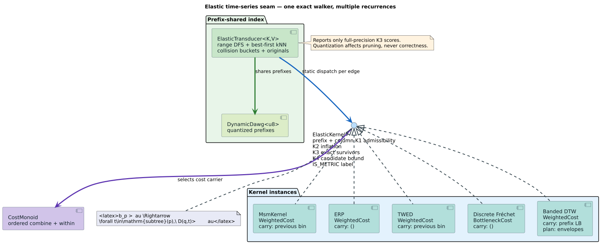

# Time Warp Edit Distance: source analysis and implementation contract

## 1. Purpose and provenance

Time Warp Edit Distance (TWED) is an edit distance for timestamped numeric
sequences. It combines three ideas: an edit penalty discourages gratuitous
insertions and deletions, a stiffness coefficient penalizes temporal
displacement, and segment costs compare adjacent samples so that time warping
retains local shape information.

The primary source is Marteau's 2009 paper, “Time Warp Edit Distance with
Stiffness Adjustment for Time Series Matching,” DOI
[10.1109/TPAMI.2008.76](https://doi.org/10.1109/TPAMI.2008.76). The revised
[HAL manuscript record](https://data.hal.science/document/hal-00135473v5) is
used to resolve the metric premise. The crate specializes the timestamped
definition to unit-spaced scalar series and preserves the paper's dynamic
programming structure.

This document separates four claims that are easy to conflate:

1. the exact scalar recurrence;
2. the interval relaxation needed by trie traversal;
3. the parameter domain in which TWED is a metric;
4. the lower bounds that are sufficient for exact pruning.

## 2. Symbols and terminology

All symbols are defined before they enter a recurrence.

| Symbol | Definition |
|---|---|
| `$`x=(x_1,\ldots,x_m)`$` | query series of `$`m`$` finite real samples |
| `$`y=(y_1,\ldots,y_n)`$` | reference series of `$`n`$` finite real samples |
| `$`t_i=i`$`, `$`s_j=j`$` | unit-spaced timestamps used by the crate |
| `$`x_0=y_0=0`$` | shared sentinel sample |
| `$`\nu`$` | non-negative temporal stiffness; the metric witness requires `$`\nu>0`$` |
| `$`\lambda`$` | non-negative constant deletion penalty |
| `$`D(i,j)`$` | optimal TWED between prefixes `$`x_{1:i}`$` and `$`y_{1:j}`$` |
| `$`I=[\ell,h]`$` | closed quantization interval containing a target sample |
| `$`\operatorname{dist}(a,I)`$` | minimum `$`\lvert a-v\rvert`$` over `$`v\in I`$` |
| `$`\operatorname{gap}(I,J)`$` | minimum `$`\lvert u-v\rvert`$` over `$`u\in I,v\in J`$` |

The word **deletion** covers either direction of the alignment: deleting from
`$`x`$` or inserting into `$`x`$` by deleting the corresponding sample from
`$`y`$`. Both are symmetric segment edits.

## 3. The unit-spaced recurrence

Define the cost of deleting query sample `$`x_i`$` after `$`x_{i-1}`$`:

```math
\delta_x(i)=\lvert x_i-x_{i-1}\rvert+\nu+\lambda.
```

The reference-side deletion `$`\delta_y(j)`$` is identical after replacing
`$`x`$` by `$`y`$`. Matching the two current segments costs:

```math
\mu(i,j)=
\lvert x_i-y_j\rvert+
\lvert x_{i-1}-y_{j-1}\rvert+
2\nu\lvert i-j\rvert.
```

The last term is the unit-time specialization of the paper's two timestamp
differences. The dynamic program is:

```math
D(i,j)=\min\begin{cases}
D(i-1,j)+\delta_x(i),\\
D(i-1,j-1)+\mu(i,j),\\
D(i,j-1)+\delta_y(j).
\end{cases}
```

The boundary is not an arbitrary constant. It accumulates every segment edit:

```math
D(i,0)=\sum_{r=1}^{i}\delta_x(r),\qquad
D(0,j)=\sum_{r=1}^{j}\delta_y(r),\qquad
D(0,0)=0.
```

Consequently the distance between an empty and a nonempty finite series is
finite. This matters to trie indexing because the trie root can represent a
stored empty candidate and must be exact-scored rather than silently omitted.

### 3.1 Literate two-row algorithm

The matrix depends only on its preceding row and current-row predecessor. The
implementation stores the shorter axis as columns, which changes memory but
not recurrence semantics.

**Purpose.** Compute exact TWED and abandon a row when non-negative future
steps cannot return below the cutoff.

**Invariant.** Before row `$`i`$` begins, `previous[j]` is exactly `$`D(i-1,j)`$`.
After column `$`j`$` is assigned, `current[j]` is exactly `$`D(i,j)`$`.

```text
ALGORITHM TWED-DISTANCE(x, y, nu, lambda, cutoff)
    if either series contains a non-finite sample then return NO-RESULT
    if y is longer than x then swap x and y

    previous[0] <- 0
    for j <- 1 through length(y)
        previous[j] <- previous[j-1] + DELETE-Y(j)

    for i <- 1 through length(x)
        current[0] <- previous[0] + DELETE-X(i)
        rowMinimum <- current[0]
        for j <- 1 through length(y)
            current[j] <- MINIMUM(
                previous[j]   + DELETE-X(i),
                previous[j-1] + MATCH-SEGMENTS(i,j),
                current[j-1]  + DELETE-Y(j))
            rowMinimum <- MINIMUM(rowMinimum, current[j])
        if rowMinimum > cutoff then return NO-RESULT
        swap(previous, current)

    if previous[length(y)] <= cutoff then return it
    otherwise return NO-RESULT
```

Every local term is non-negative. Once every cell in a completed row exceeds
the cutoff, every continuation also exceeds it. Exact time is
`$`\mathcal{O}(mn)`$`; live DP memory is `$`\mathcal{O}(\min(m,n))`$`.

## 4. Interval relaxation for the elastic trie



The trie stores quantization bins, not one concrete value per edge. TWED's
current leaf depends on the current and preceding target values, so the kernel
carries the preceding target interval `$`I_{j-1}`$`. At the root the carry is
the singleton sentinel interval `$`[0,0]`$`.

For query segment `$`(x_{i-1},x_i)`$`, current target interval `$`I_j`$`, and
previous target interval `$`I_{j-1}`$`, the exact interval minimum of the match
leaf is separable:

```math
\underline{\mu}(i,j)=
\operatorname{dist}(x_i,I_j)+
\operatorname{dist}(x_{i-1},I_{j-1})+
2\nu\lvert i-j\rvert.
```

The variables occur in distinct absolute-value terms, so minimizing their sum
over the rectangle `$`I_{j-1}\times I_j`$` equals the sum of the two independent
minima. No correlation assumption is introduced.

The target-deletion leaf is likewise an exact box minimum:

```math
\underline{\delta}_y(j)=
\operatorname{gap}(I_{j-1},I_j)+\nu+\lambda.
```

Query deletion remains scalar and exact. Replacing every target-dependent leaf
by a value no greater than every concrete realization gives a relaxed column
that is cellwise no greater than every represented concrete column. Singleton
intervals recover scalar leaves exactly, preventing the admissibility proof
from hiding a useless always-zero bound.

## 5. Candidate length lower bound

Any alignment changing length `$`m`$` to length `$`n`$` contains at least
`$`\lvert m-n\rvert`$` length-changing edits. Each pays `$`\lambda`$` plus
non-negative segment and timestamp terms. Therefore:

```math
\lvert m-n\rvert\lambda\le D(m,n).
```

This bound is deliberately modest. It becomes zero when `$`\lambda=0`$` and
does not inspect sample values. Its purpose is to reject impossible candidates
cheaply before exact dynamic programming, never to replace the carry-aware
column bound.

## 6. Metric domain and the corrected API contract

The primary source's metric proposition requires a non-negative deletion
penalty and a **strictly positive** coefficient on timestamp displacement. In
the crate's names this is:

```math
\nu>0,\qquad \lambda\ge0.
```

The strict inequality is load-bearing for identity of indiscernibles. When
`$`\nu=\lambda=0`$`, unequal sequences can have zero cost. The executable
witness used by the crate is:

```math
D([0,1],[1])=0.
```

Deleting the leading zero costs zero and leaves a zero-cost aligned segment.
Thus one Rust type cannot honestly make a static metric promise for the entire
non-negative parameter family.

The API encodes the distinction:

- `TwedConfig` accepts the complete normalized non-negative family and has
  `ElasticKernel::IS_METRIC = false`;
- `MetricTwedConfig::try_new` rejects non-finite values, `$`\nu\le0`$`, and
  `$`\lambda<0`$`;
- only `MetricTwedConfig` implements `MetricElasticKernel`.

This is stronger than a runtime warning: generic code requiring a metric
kernel cannot be instantiated with an unchecked TWED configuration.

## 7. Public usage

Use the raw family when studying a degenerate parameter regime or when no
triangle-dependent consumer is involved:

```rust
use liblevenshtein::time_series::TwedConfig;

let family = TwedConfig::new(0.0, 0.0);
assert_eq!(family.distance(&[0.0, 1.0], &[1.0]), 0.0);
```

Validate the metric premise for a type-level witness and exact trie search:

```rust
use liblevenshtein::time_series::{
    MetricTwedConfig, MetricTwedTransducer, QuantizationConfig,
};

fn main() -> Result<(), Box<dyn std::error::Error>> {
    let references = vec![vec![0.0, 1.0], vec![0.0, 2.0]];
    let kernel = MetricTwedConfig::try_new(0.5, 1.0)?;
    let index = MetricTwedTransducer::from_series(
        QuantizationConfig::for_u8(0.0, 2.0),
        kernel,
        &references,
    );
    let exact = index.search_range(&[0.0, 1.0], 0.0);
    assert_eq!(exact, vec![(0, 0.0)]);
    Ok(())
}
```

The compile-gated `doc_time_series_check` example exercises the same public
surface without the doctest's result wrapper.

## 8. Verification map

| Claim | Rocq | Verus | Z3 + cvc5 | Rust |
|---|---:|---:|---:|---:|
| match/delete interval admissibility | arbitrary-real theorem | integer theorem | negated obligations UNSAT | 2,000 generated paths and boxes |
| singleton-bin exactness | theorem | theorem | negated obligations UNSAT | exact scalar-column equality |
| length lower bound | arbitrary-script theorem | arithmetic theorem | negated prune query UNSAT | generated exact comparison |
| non-negative inflation and cutoff | theorem | theorem | negated obligations UNSAT | optimized/reference cutoff differential |
| metric parameter gate | strict-positivity lemmas | constructor obligations | invalid-domain queries UNSAT | compile-time marker and validation tests |
| symmetry, identity, triangle | script-composition kernel plus finite checks | local composition arithmetic | bounded counterexample search | 2,000 generated triples |
| trie completeness | generic `ElasticKernel` proof | generic proof | generic K1–K4 suite | 4,000 generated databases |

The representations are intentionally heterogeneous. Agreement reduces the
chance that a recurrence mistake is copied into every oracle.

## 9. Security and operational limits

Exact TWED remains quadratic in the worst case. A permissive cutoff, broad
quantization bins, or `$`\lambda=0`$` can weaken pruning enough to approach a
full scan. Deployments should cap query length, indexed-series length, total
samples per request, and candidate evaluations independently of observed
pruning.

Non-finite samples are rejected from exact search. Public parameters normalize
to finite non-negative values in `TwedConfig`, while the metric wrapper rejects
invalid values rather than normalizing them across a proof boundary. The
recursive trie depth equals target length, so ingestion limits also serve as
stack-depth guards.

## 10. Source-to-code map

| Concern | Repository artifact |
|---|---|
| production recurrence and interval kernel | `src/time_series/kernels/twed.rs` |
| public integration and generated search checks | `tests/twed_transducer_tests.rs` |
| compile-time metric contract | `tests/elastic_kernel_contract.rs` |
| compile-gated usage | `examples/doc_time_series_check.rs` |
| formal arithmetic | `docs/verification/twed/`, `docs/verification/verus/twed_kernel.rs`, `docs/verification/smt/twed_kernel.smt2` |
| pre-registered evaluation | `docs/scientific-ledger/twed-kernel-2026-08-01.md` |

## 11. References

- P.-F. Marteau, “Time Warp Edit Distance with Stiffness Adjustment for Time
  Series Matching,” *IEEE Transactions on Pattern Analysis and Machine
  Intelligence* 31(2), 306–318, 2009. DOI:
  [10.1109/TPAMI.2008.76](https://doi.org/10.1109/TPAMI.2008.76).
- P.-F. Marteau, revised manuscript record, version 5,
  [HAL hal-00135473v5](https://data.hal.science/document/hal-00135473v5).
