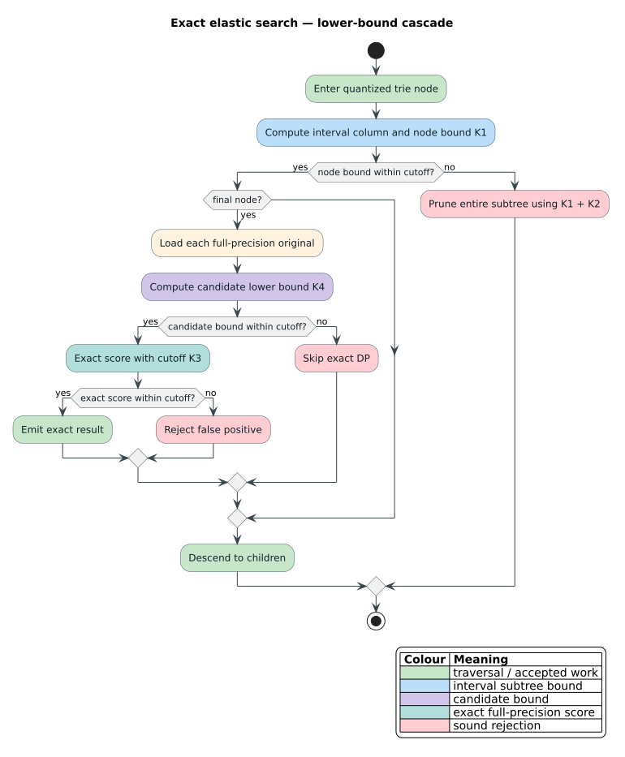

# Shared elastic-kernel UCR classification and pruning-economics protocol

## 1. Purpose and preregistration boundary

This ledger fixes the common evaluation protocol for Move-Split-Merge (MSM),
Edit distance with Real Penalty (ERP), Time Warp Edit Distance (TWED), discrete
Fréchet distance, and banded Dynamic Time Warping (DTW). It was written before
the generalized `elastic-ucr` command was used for an archive measurement.
Focused compilation and synthetic two-class tests preceded this document, but
they are implementation checks rather than observations of the registered
archive endpoint.

The scientific question is deliberately narrower than “which distance is
best?” The exact one-nearest-neighbour (1-NN) classifier provides a common
workload. The primary endpoint is the amount of exact dynamic-programming work
that survives each admissible pruning cascade. Accuracy and paired outcomes are
reported for context; no kernel is accepted or rejected because it wins an
accuracy ranking on this fixed, untuned slice.

## 2. Terms, symbols, and actors

Let `$`T`$` be a training split, `$`Q`$` its test split, and `$`L`$` the common
series length used by the historical selector. For a test series `$`q\in Q`$`,
the classifier returns the label of the first training series whose exact
distance is strictly smaller than every distance seen earlier in archive order.
The running best cost is `$`\tau`$`.

The harness observes two exact actors:

- the **flat actor** visits training candidates in source order, applies a
  kernel-specific candidate lower bound, and passes the running `$`\tau`$` to
  the exact recurrence;
- the **trie actor** shares interval-relaxed dynamic-programming columns across
  256-bin quantized prefixes, then verifies every survivor against its stored
  full-precision series.

Both actors must return the same nearest *distance*. The flat actor owns the
classification tie rule so the new MSM result remains comparable with the
historical experiment even when a trie visits equal-distance candidates in a
different order.



## 3. Fixed corpus slice and preprocessing

The source is the UCR/aeon 2018 univariate archive. A dataset is eligible when
its estimated quadratic work satisfies

```math
|T|\,|Q|\,L^2 \le 10^9.
```

Candidates are ordered by estimated work and then dataset name; at most 1,000
eligible datasets are retained. This is the same deterministic selector that
previously produced the 51-dataset MSM slice. The generalized run must record
the dataset names and the archive checksum so accidental slice drift is
detectable rather than averaged away.

Parsing and preprocessing are fixed:

1. accept UCR whitespace-separated `.txt` splits and UEA-style `.ts` splits;
2. treat `?` and `NaN` as missing;
3. linearly interpolate interior missing samples, extend the nearest finite
   endpoint at either boundary, and replace an entirely missing series by
   zeros;
4. preserve the archive's supplied scale—there is no per-series
   normalization;
5. derive the 256-bin trie quantizer from the **training split only** and clamp
   test values outside that range. Test data therefore cannot tune the index.

## 4. Fixed kernel configurations

No parameter is selected from test accuracy or timing.

| Measure | Registered configuration | Native reported cost |
|---|---|---|
| MSM | split/merge cost `$`c=1`$` | additive MSM cost |
| ERP | gap value `$`g=0`$` | additive absolute cost |
| TWED | stiffness `$`\nu=1`$`, gap penalty `$`\lambda=1`$` | additive TWED cost |
| discrete Fréchet | no tunable parameter | bottleneck distance |
| banded DTW | Sakoe–Chiba half-width `$`w=\max(1,\lceil 0.1L\rceil)`$` | squared cost inside the generic trie; root distance in the public wrapper |

The DTW rule is a fixed 10% window rather than a cross-validated window. It is
therefore an engineering comparison of one explicit shipped configuration,
not a reproduction of studies that tune the window per dataset.

## 5. Literate algorithm

The prose invariant appears before the pseudocode that realizes it: every
lower bound `$`b`$` admitted to the harness satisfies `$`b\le D(q,x)`$`. Thus a
candidate can be skipped only when `$`\tau<b`$`. Exact cutoff rejection is safe
because the recurrence returns `None` only when no score at most `$`\tau`$`
survives.

```text
procedure CLASSIFY-FLAT(training T, query q, kernel K)
    tau   := TOP(K)
    label := no-label
    plan  := K.plan(q)

    for candidate x in archive order do
        count candidate-considered
        if not K.within(K.candidate-lower-bound(q, x, plan), tau) then
            count candidate-bound-pruned
            continue

        count exact-evaluation
        distance := K.exact-with-cutoff(q, x, tau)
        if distance is absent then
            count cutoff-abandoned
        else if distance is strictly less than tau then
            tau   := distance
            label := x.label

    return (label, tau)
```

The trie actor uses the same candidate and exact gates after its prefix and
interval-column gates. Its telemetry is observational: increments occur after
the corresponding decision and never feed a bound, heap key, or result.

## 6. Executable accounting invariants

For each query and for every aggregate formed with checked or saturating
addition, the harness requires:

```math
E = P_{\mathrm{prefix}} + C_{\mathrm{built}},
```

```math
X = P_{\mathrm{candidate}} + N_{\mathrm{exact}},
```

```math
P_{\mathrm{column}} \le C_{\mathrm{built}},
\qquad
A_{\mathrm{cutoff}} \le N_{\mathrm{exact}}.
```

Here `$`E`$` is the number of inspected trie edges, `$`X`$` is the number of
full-precision candidates considered at admitted final nodes,
`$`P_{\mathrm{prefix}}`$`, `$`P_{\mathrm{column}}`$`, and
`$`P_{\mathrm{candidate}}`$` are the three lower-bound prune counts,
`$`C_{\mathrm{built}}`$` is the number of constructed interval columns,
`$`N_{\mathrm{exact}}`$` is the number of exact recurrence calls, and
`$`A_{\mathrm{cutoff}}`$` is the subset abandoned by the running cutoff.

These identities are API invariants and property-test oracles. They will also
be encoded in the repository's Verus and SMT accounting models; the formal
claim is arithmetic partition consistency, not a claim that counters prove a
kernel's analytic lower-bound theorem.

## 7. Pre-registered hypotheses and decision rules

| ID | Hypothesis | Fixed rule | Verdict |
|---|---|---|---|
| `elastic-ucr-001-slice` | Every measure observes the identical selected dataset and case sequence. | Dataset-name sequence, per-dataset case count, and archive checksum must agree across all five output files. | **accepted** — the executable gate found the same 51 dataset names and 13,754 case keys in every file. |
| `elastic-ucr-002-msm-compatibility` | Generalization preserves the historical MSM classification endpoint. | Require `$`11653/13754`$` MSM hits and `$`5664/13754`$` majority hits on the registered archive artifact; otherwise stop and diagnose before comparing measures. | **accepted** — accuracy and all three historical flat pruning counters match exactly. |
| `elastic-ucr-003-exact-actors` | Flat and trie actors return the same nearest native distance for every case. | Any mismatch aborts the process and invalidates that run. | **accepted** — all 68,770 measure/case comparisons completed without a mismatch. |
| `elastic-ucr-004-accounting` | Every reported pruning counter satisfies the partitions in Section 6. | Any failed invariant aborts the process; focused 2,000-case result-transparency properties must also pass. | **accepted** — every raw summary row and aggregate passed; Rocq, 13 Verus obligations, 12 Z3 queries, 12 cvc5 queries, and 4,000 generated searches agree. |
| `elastic-ucr-005-dtw-context` | Fixed-band DTW accuracy is broadly consistent with the plan's `$`0.83`$`–`$`0.86`$` contextual expectation. | Report the value without using the interval as a correctness gate; published tuned-window results and this fixed-window slice are not identical protocols. | **accepted as contextual** — observed accuracy was `$`0.842009597208`$`. |
| `elastic-ucr-006-pruning-economics` | Kernel-specific prefix, column, and candidate bounds reduce exact work by different amounts. | Report all raw counts, elapsed time, process peak resident memory, and native-distance checksum. No favorable direction is required and no counter may be omitted when zero. | **accepted as descriptive evidence** — Tables 1 and 2 report every registered count, including zero prefix prunes for four kernels. |
| `elastic-ucr-007-paired-outcomes` | Each elastic 1-NN arm differs from the majority-label baseline. | Submit the per-case binary pairs to pgmcp's paired-binary endpoint and report both discordant cells and the two-sided McNemar result; retain the raw case rows. | **accepted** — pgmcp computed all five two-sided continuity-corrected McNemar results; each is significant at `$`\alpha=0.05`$`. |

The pruning endpoint is descriptive. Ratios may be derived only alongside raw
numerators and denominators. Wall time is corroborating evidence because CPU
load, frequency, and memory behavior can dominate small arithmetic differences.

## 8. Recorded results

### 8.1 Classification and flat candidate cascade

Every row covers 51 datasets and 13,754 test cases. `LB` means the
kernel-specific candidate lower bound. `DP` means an exact dynamic-programming
evaluation. Elapsed time is the sum of per-dataset timed regions and includes
flat classification plus trie verification, but excludes archive discovery and
release compilation.

| Measure | Correct | Accuracy | Flat candidates | LB pruned | Exact DP | Cutoff abandoned | Elapsed ms | Peak RSS KiB | Native checksum |
|---|---:|---:|---:|---:|---:|---:|---:|---:|---:|
| MSM | 11,653 | 0.847244437982 | 1,306,949 | 152,272 | 1,154,677 | 1,087,933 | 144,273.301020 | 169,612 | 1,578,380.629141855519 |
| ERP | 11,858 | 0.862149192962 | 1,306,949 | 368,186 | 938,763 | 871,919 | 107,069.394305 | 169,136 | 4,287,337.931012114510 |
| TWED | 11,000 | 0.799767340410 | 1,306,949 | 85,642 | 1,221,307 | 1,156,174 | 170,872.895160 | 169,632 | 3,960,614.403140308335 |
| discrete Fréchet | 10,696 | 0.777664679366 | 1,306,949 | 995,028 | 311,921 | 241,138 | 29,063.445362 | 169,912 | 88,981.171150006616 |
| banded DTW | 11,581 | 0.842009597208 | 1,306,949 | 675,392 | 631,557 | 542,125 | 17,421.721074 | 169,652 | 78,364,758.759925141931 |

The majority baseline was 5,664 correct, or 0.411807474189. MSM reproduced
the previous 152,272 candidate-bound prunes, 1,154,677 exact evaluations, and
1,087,933 cutoff abandonments exactly. This exact match was a compatibility
gate, not a tolerance.

### 8.2 Generic trie cascade

| Measure | Visited nodes | Visited edges | Prefix pruned | Columns built | Column pruned | Queued subtrees pruned | Candidates | Candidate pruned | Exact DP | Cutoff abandoned |
|---|---:|---:|---:|---:|---:|---:|---:|---:|---:|---:|
| MSM | 77,398,980 | 78,492,453 | 0 | 78,492,453 | 987,813 | 119,414 | 53,134 | 0 | 53,134 | 30,178 |
| ERP | 69,951,228 | 71,097,379 | 0 | 71,097,379 | 1,071,152 | 88,753 | 39,874 | 209 | 39,665 | 13,557 |
| TWED | 85,229,872 | 86,278,155 | 0 | 86,278,155 | 934,679 | 127,358 | 55,976 | 0 | 55,976 | 33,297 |
| discrete Fréchet | 26,654,221 | 27,413,343 | 0 | 27,413,343 | 137,544 | 635,332 | 31,010 | 1,192 | 29,818 | 3,069 |
| banded DTW | 43,788,399 | 44,855,191 | 93,727 | 44,761,464 | 641,224 | 345,595 | 52,582 | 136 | 52,446 | 11,409 |

DTW is the only current kernel with a constant-time prefix gate, so zero prefix
prunes for the other four rows are expected and intentionally reported. The
Fréchet candidate cascade was strongest on this slice; TWED was weakest. Those
are observed configuration-specific facts, not new correctness premises.

### 8.3 Paired binary outcomes

pgmcp experiment `shared-elastic-ucr-paired-outcomes` (experiment 157,
hypothesis 157) computed the following results server-side. `Control only`
means majority was correct and the measure was wrong; `measure only` is the
reverse.

| Measure | Both correct | Control only | Measure only | Both wrong | Discordant | McNemar statistic | `$`p`$` value |
|---|---:|---:|---:|---:|---:|---:|---:|
| MSM | 5,249 | 415 | 6,404 | 1,686 | 6,819 | 5,258.270127584690 | 0.0 |
| ERP | 5,259 | 405 | 6,599 | 1,491 | 7,004 | 5,475.906482010279 | 0.0 |
| TWED | 5,078 | 586 | 5,922 | 2,168 | 6,508 | 4,373.421173939766 | 0.0 |
| discrete Fréchet | 4,920 | 744 | 5,776 | 2,314 | 6,520 | 3,882.049233128834 | 0.0 |
| banded DTW | 5,228 | 436 | 6,353 | 1,737 | 6,789 | 5,155.259390190014 | 0.0 |

The endpoint selected the continuity-corrected chi-squared McNemar calculation
for every row because each discordant count was large. The displayed zero
values are the server's floating-point underflow result, not a claim of a
mathematically zero probability.

### 8.4 Artifact identity

- UCR archive SHA-256:
  `662b07ff7c0ad14c9e541edb345ec3d5ddf0bd483494e18a8fc8d8ca715481dc`.
- MSM CSV SHA-256:
  `1b0872a11b11fde65f6678ff41ced91d1fd4c02ca0648ade04cbadef5c831ab0`.
- ERP CSV SHA-256:
  `77e6271695e08bfc14a15b6a0a5c1ff07ba5caaebe21e8e578ea1f49c0df6c3b`.
- TWED CSV SHA-256:
  `9a5e618e3abd7937a457a06c60f8c9215c249908600226aad0a8ae1e40749879`.
- discrete Fréchet CSV SHA-256:
  `0bee54e18974df4daf7383f133238b441586bab34926076884f7993fa3860089`.
- banded-DTW CSV SHA-256:
  `53a629346f549c99bcf9800d511523014106fac446aed38d45a08cba24ad06a0`.

`scripts/verify-elastic-ucr-gate.sh` independently re-parses all raw files and
passes only when the five slices, majority outcomes, row schemas, accounting
partitions, and historical MSM endpoint agree.

## 9. Output schema and reproducibility

One CSV is produced per measure. `summary` rows contain dataset metadata,
accuracy counts, both pruning-counter families, elapsed milliseconds, Linux
process high-water resident memory in KiB, a native-distance checksum, and the
configuration string. Two normalized `case` rows record majority and measure
correctness for each test case. A deterministic TSV reduction sums the raw
counts and takes the maximum process high-water mark.

```bash
scripts/run-academic-benchmarks.sh elastic-ucr --measure dtw
scripts/run-academic-benchmarks.sh elastic-ucr-all
```

Heavy runs remain under the script's `systemd-run` memory and swap caps. Corpus
and result artifacts stay under `target/academic-benchmarks`; temporary logs are
not scientific records and are removed after their evidence is recorded in
pgmcp.

## 10. Security and failure semantics

- Measure names are allowlisted before they reach Cargo, preventing an
  archive-run option from becoming shell syntax.
- Archive cell estimates use `u128`, so the selector does not wrap on ordinary
  platform-sized split counts and lengths.
- Non-finite post-imputation samples fail quantizer construction rather than
  entering heaps or floating-point total-order assumptions.
- Flat/trie disagreement, inconsistent counters, malformed numeric options,
  and unsupported archive layouts are hard failures. Partial output is not
  promoted to a summary.
- The memory cap and load guard limit denial-of-service exposure from quadratic
  recurrences. The cap is a resource boundary, not evidence of algorithmic
  correctness.

## 11. Sources

1. H. A. Dau, A. Bagnall, K. Kamgar, C.-C. M. Yeh, Y. Zhu, S. Gharghabi,
   C. A. Ratanamahatana, and E. Keogh, “The UCR Time Series Archive,” 2018.
   DOI: [10.48550/arXiv.1810.07758](https://doi.org/10.48550/arXiv.1810.07758).
2. A. Bagnall, J. Lines, A. Bostrom, J. Large, and E. Keogh, “The Great Time
   Series Classification Bake Off: A Review and Experimental Evaluation of
   Recent Algorithmic Advances,” *Data Mining and Knowledge Discovery* 31,
   606–660, 2017. DOI:
   [10.1007/s10618-016-0483-9](https://doi.org/10.1007/s10618-016-0483-9).
3. E. Keogh and C. A. Ratanamahatana, “Exact Indexing of Dynamic Time
   Warping,” *Knowledge and Information Systems* 7, 358–386, 2005. DOI:
   [10.1007/s10115-004-0154-9](https://doi.org/10.1007/s10115-004-0154-9).
