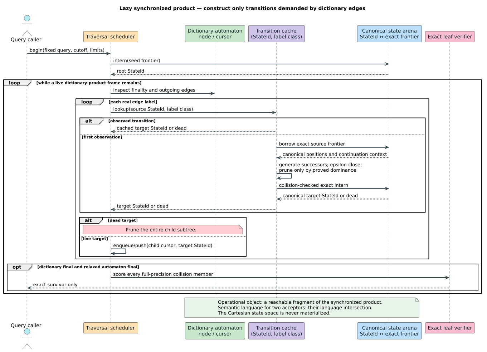
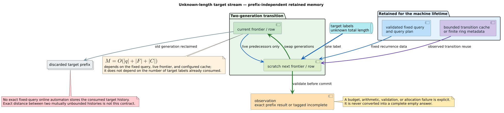

# Metric automata lazy-product and online-stability audit

## 1. Question and decision

This record independently audits the production automata named by
[`lazy-online-products.md`](../design/lazy-online-products.md). The question is
whether each machine constructs only reached synchronized-product states, uses
an iterative traversal, and retains a state whose size is independent of an
unknown target stream's consumed prefix.

The audit accepts that architecture for the production parameterized string
queries, universal and generalized online machines, scalar elastic online
machines, explicit-timestamp TWED, vector discrete Fréchet, and the bounded
dictionary-product continuations. It does **not** turn finite-batch scorers,
context-sensitive scans, approximate indexes, or test-only MSM compatibility
code into online metric automata. Metric status remains a separate typed-domain
claim.



Three documentation discrepancies were corrected during the audit:

1. `ElasticOnlineAutomaton` retains one fixed-size kernel carry. MSM, unit-grid
   TWED, and scalar Fréchet may use that carry for the immediately preceding
   target value or interval. The old Rustdoc incorrectly said that the machine
   retained no target sample at all; the correct claim is that it retains no
   *unbounded target prefix*.
2. Soft-DTW score evaluation retains two rows, but its gradient surface retains
   full forward and adjoint matrices. The architecture matrix now separates
   these bounds.
3. The design chapter repeated the stronger phrase “retains no consumed target
   prefix.” It now states the actual stability invariant: fixed-size kernel
   lookback is lawful, while retained memory has no term in consumed-prefix
   length.

The audit also found and the campaign repaired a real resource-accounting
defect: the generic elastic online constructor computed its reported scratch
storage before constructing a DTW `KeoghPlan`. `QueryPlanStorage` now reports
retained and construction-peak bytes separately; DTW accounts for four retained
query-width `f64` arrays and two transient query-width `usize` monotone deques.
`ElasticKernel::try_plan` allocates fallibly, and bounded online, range, kNN,
and certificate entry points preflight the peak and retain tagged arithmetic,
limit, and allocation failures.

The same campaign repaired the hidden allocation at exact leaf verification.
Generic bounded range K3, strict bounded kNN, and certificate K3 now share
`ExactPointWorkspace`: one fallible query plan, two cost generations, and two
active-row generations driven by the production online recurrence. The
workspace resets in place for every collision member. The specialized ERP
range product restores its existing `ErpFrontierMachine` worker from the
interned empty-target seed and consumes the candidate without another
query-width allocation. `ExactPointDecision` distinguishes `WithinCutoff`,
`AboveCutoff`, and structural `NoFiniteAlignment`; a structurally reachable
`TOP` under an unbounded cutoff remains tagged `NumericOverflow`.

Work accounting is conservative and checked before candidate mutation. Generic
range, kNN, and certificate paths charge $`(|q|+1)(|x|+1)`$ for candidate
$`x`$; the specialized ERP product charges $`2(|q|+1)|x|`$ for its bounded
sparse/dense transition work. Overflow or an insufficient page/operation limit
therefore pauses or terminates with a tagged incomplete outcome before K3.

Finalization is covered by the same fail-closed accounting. A paused range
continuation owns the only accumulated result vector and exposes it by borrow;
it does not clone and sort that vector on every page. Bounded completion
charges one `(old,destination)` permutation together with live workspace
scratch, orders by the total `(cost, discovery sequence)` key, and permutes the
unique-id payload vector in place through a step-bounded loop. Generic kNN
charges a fallible output conversion. Timestamped TWED instead maintains its
public output vector directly as an iterative max heap and sorts it in place by
`(distance, episode_id)`. This closes the previously unaccounted allocation at
result materialization while retaining deterministic ties.

## 2. Definitions and acceptance criteria

A **live semantic state** is the exact residual information needed to process
the next input label. **Scratch** is reusable storage whose contents do not
survive a committed transition. A **cache** stores semantics-preserving results
that can be evicted without changing the accepted language. A **traversal
structure** is an explicit heap stack, queue, or heap of dictionary/product
frames.

For a fixed finite query $`q`$, a live frontier $`F`$, and a bounded cache
$`C`$, unknown-prefix stability requires

```math
M=\mathcal{O}(|q|+|F|+|C|),
```

with no term in the number $`t`$ of target labels already consumed. A rolling
window of fixed width $`L`$ has the distinct lawful bound
$`\mathcal{O}(L)`$. A finite dictionary product may also retain explicit
frames proportional to current dictionary depth or scheduler width; bounded
evidence APIs must charge those frames separately.



An implementation passes this audit only when:

- transitions and dictionary traversal contain no input-depth recursion;
- the current residual and scratch are finite functions of the fixed query,
  configured cutoff, finite kernel lookback, and explicit limits;
- a cache miss constructs only an observed transition and exact canonical
  equality, rather than hash equality, controls interning;
- failure before commit is transactional and tagged on evidence-bearing APIs;
- exact, metric, quotient-metric, nonmetric, approximate, and analysis-only
  claims remain distinct; and
- executable oracle, retention, continuation, and constrained-stack evidence
  agrees with the source architecture.

## 3. Method and reproducibility

The audited worktree was
`liblevenshtein-rust-regresspec-complete`, branch
`codex/regresspec-temporal-complete`, at observed base commit
`61f92b8ac2cf518d0fd030c52a5dfa3dd36f57b0`. The worktree contained the active
campaign changes, so the commit identifies the starting revision rather than a
claim that the working tree was clean.

The audit used four evidence layers:

1. direct inspection of every struct field, transition loop, scratch reuse
   path, canonical-state arena, cache, and scheduler named below;
2. libcpg call-graph strongly connected components (SCCs), followed by an
   explicit source-path filter;
3. independent-oracle, retention, pause/resume, and fail-closed property tests;
4. constrained-stack tests using 128 KiB or 256 KiB worker stacks and deep
   streams or dictionary paths.

The final source-only pgmcp/libcpg recursion analysis is:

| Parameter | Value |
|---|---|
| Classic SCC run ID | `4579caaf-d869-4999-8951-934f4d164550` |
| Safe semantic-refresh run ID | `7a522729-d2ba-4468-bd81-c45c46464713` |
| Active all-features snapshot ID | `2c970600-8389-4109-b36e-39c643850ea9` |
| Project | `liblevenshtein-rust-regresspec-complete` |
| `include_nonproduction` | `false` |
| Result limit | `5000` |
| Minimum cross-file confidence | `0.9` |
| Indexed candidates / production-eligible files | `3122 / 1412` |
| Analyzed supported / unsupported / failed files | `1181 / 231 / 0` |
| Accepted call edges | `9538` |
| Ambiguous / low-confidence / unresolved edges excluded | `2203 / 12867 / 37520` |
| Project-wide direct candidates / mutual clusters | `103 / 25` |
| `src/time_series` plus `src/transducer` direct candidates / mutual clusters | `25 / 0` |
| Audited metric-automata direct candidates / mutual clusters | `0 / 0` |
| Safe all-features Rust files parsed / indexed / failed | `630 / 630 / 0` |
| Safe typed-SCC / stack-risk findings in audited metric automata | `0 / 0` |

The source-only production filter excluded worktree-local Cargo registries,
targets, tests, fixtures, and generated proof artifacts. The audit then applied
two explicit path projections. The broad projection over
`src/transducer/**/*.rs` and `src/time_series/**/*.rs` retained 25 conservative
direct candidates and zero mutual clusters. Inspection classified the direct
candidates as:

- same-named wrapper or trait delegation, which libcpg conservatively reports
  as a possible self-call;
- symmetric finite-batch scorers that swap operands at most once so the shorter
  operand becomes the retained row width; or
- the genuinely recursive Dyck correction-witness reconstruction in
  `src/transducer/language/dyck.rs`, which is not the iterative
  `LanguageQueryIterator` dictionary product.

The narrower metric-automata projection covers the compact string query
scheduler, dictionary traversal, language query product, legacy zipper,
temporal frontier/product arenas, elastic continuations, and timestamped-TWED
product. It retained zero classic direct candidates and zero mutual clusters.
The safe semantic snapshot likewise retained zero typed SCC and zero stack-risk
findings in that projection. Its one structural ownership finding identifies
the `Option<Arc<ZipperPathNode>>` parent spine and also records
`ZipperPathNode` as a custom-`Drop` member. That recursive *type shape* is
intentional; the custom destructor takes each parent before release and drains
the uniquely owned suffix in a `while` loop, stopping at the first shared
suffix. Rocq proves the release-step bound and shared-suffix stop law, Verus
checks the Rust-shaped linear-work/constant-call-stack refinement, and the
100,000-node shared-suffix test releases the final owner on a 64 KiB stack.

No audited `advance`, `step`, `resume`, `Iterator::next`, DFS product, online
metric transition, or bounded elastic scheduler belongs to a returned
recursion SCC. These reports remain supporting evidence, not proof: the classic
analysis excluded ambiguous, low-confidence, and unresolved edges, while safe
semantic mode does not execute Cargo, rust-analyzer, or macro expansion. Static
dispatch can hide dynamic behavior, and an SCC-free function can still call a
deeply recursive function outside the selected graph. The formal refinement
islands and constrained-stack tests cover that residual risk at the public
seams. They exercise the in-tree `DynamicDawg`, PathMap, and timestamped-u64
backends; a third-party `DictionaryNode` implementation can still introduce
recursion inside its own trait methods and must supply its own stack-safety
evidence. Logical byte accounting intentionally excludes allocator metadata
and capacity rounding, so it is a deterministic resource ABI rather than a
resident-set-size prediction.

## 4. String and language baseline audit

| Production surface | Live state and scratch | Cache and traversal | Retention / recursion verdict | Semantic boundary |
|---|---|---|---|---|
| `QueryIterator`: Standard, OSA, merge/split | Queue entries contain an opaque eight-byte `UnitCostFrontier`; positional misses borrow `StatePool` scratch | Packed one-word machine when eligible; otherwise exact-interned canonical states and observed characteristic-class transitions; `VecDeque` scheduler and backend-specific path strategy | Iterative. Query-local arena/cache can grow only over the finite reachable state/class space; dictionary breadth and results are not an unknown stream | Standard is metric; OSA is nonmetric; generic symmetric merge/split is metric only on its documented cost model |
| Unrestricted Damerau `QueryIterator` | Compact IDs denote exact lazy continuation frontiers, including pending transposition context | Same schedulers and path strategies; explicit representation ceiling at `u8::MAX` budget | Iterative; finite-query $`\mathcal{O}(k^2)`$ frontier envelope, not consumed-prefix retention | Metric typed algorithm; final scores still require explicit cutoff admission |
| `QueryIteratorF64` | Queue owns `GeneratedStateIdF64`; `StatePoolF64` materializes one reusable state only on a miss | Exact bitwise canonical-state interner, characteristic cache, observed transition map, explicit traversal queue | Iterative and lazy; convenience API has no production resource continuation, so it is not Regresspec absence evidence | Metric claims require symmetric, positive, validated weights; approximate float merging is prohibited |
| `OrderedQueryIterator` / `PriorityQueryIterator` | Same compact unit frontier; reusable state pool | Distance-bucket queues or priority heap; shared transition engine | Iterative; scheduler width is finite-dictionary state, not stream history | Ordering changes scheduling, not distance semantics |
| `UniversalOnlineAutomaton` for Standard, Transposition, merge/split | Fixed word, one canonical `UniversalState`, scalar consumed counter | No historical arena or target cache | Iterative. After the length/cutoff envelope dies, subsequent calls remain dead without allocation | Reference/correspondence surface; OSA remains nonmetric and only named proof islands may be claimed |
| `GeneralizedOnlineAutomaton` | $`r+1`$ committed source-width rows, one scratch row, finite target window, rebuilt UTF-8 text/offset scratch | Compiled immutable operation set; no history cache | Iterative and transactional. Both text and offsets are cleared and rebuilt from at most $`r`$ target scalars | Arbitrary operation sets and weights are not automatically metrics |
| `LanguageQueryIterator` | Queue carries `LanguageFrontierId`; canonical cost-indexed NFA/DFA state sets live once in an arena | Observed product transitions and explicit `VecDeque` traversal | Iterative dictionary product; finite automaton/cutoff and explicit language-state ceiling | Unit-edit language distance only. Dyck witness reconstruction is a separate recursive finite-batch operation |
| `PrefixQueryIterator` / `SubsequenceQueryIterator` | One path-local compact frontier or subsequence index per explicit DFS frame; one materialized current prefix | Explicit DFS stack and paged/eager edge source; caller pruner is balanced on enter/leave | Iterative; retained memory follows current dictionary depth | Structural query surfaces, not new metrics |
| `ContextualQueryIterator` | One full query column per pending prefix plus reusable column pool and prefix scratch | Explicit queue and parent path arena; characteristic sharing is intentionally disabled | Iterative but finite-dictionary only; scheduler width multiplies query-column storage | Context-dependent costs are nonmetric unless independently proved |
| Phonetic language product / articulatory scan | Unit-cost path uses language frontier IDs; fractional path owns a queue and parent-path arena | Incremental product for unit costs; bounded-depth full scan for contextual fractional scoring | Iterative traversal; fractional scan is not a stable online metric machine | Compatibility path, not metric-product evidence |

The compatibility `Intersection`, `IntersectionF64`, `AutomatonZipper`, and
historically named `IntersectionZipper` values own one caller-controlled full
state. They are not used as per-node state payloads by the production query
schedulers and therefore do not contradict the compact-product architecture.
`IntersectionZipper` is operationally a synchronized product whose language is
the component-language intersection; its shared path spine has iterative final
release, so path depth does not become native call-stack depth.

## 5. Metric and time-series audit

| Production surface | Live state and scratch | Cache and traversal | Unknown-length / stack verdict | Exact or metric boundary |
|---|---|---|---|---|
| Generic `ElasticOnlineAutomaton`: MSM, unit-grid TWED, scalar Fréchet, banded DTW | Fixed query and fallible plan; current/next query-width cost generations; sorted active row IDs; one fixed-size kernel carry | No historical state arena or stream cache | Iterative, transactional, and prefix-independent; retained and construction-peak plan/frontier bytes are separately accounted | MSM is metric only through `MetricMsmKernel`; positive-stiffness typed unit-grid TWED is metric; Fréchet needs the stutter quotient; DTW is never metric |
| `ErpOnlineAutomaton` | Query, deletion/suffix costs, two sparse canonical frontiers, generation-stamped query-width scratch | No stream-history cache | Iterative; 100,000-prefix correspondence and retention properties | Raw ERP is a pseudometric; `ErpQuotientSeries` supplies the gap-value quotient metric domain |
| `TimestampedTwedOnlineAutomaton` | Owned typed query, current/next columns and active IDs, exactly one previous target point | No history cache | Iterative, transactional, constant retained bytes across 100,000 points | Metric only for finite, strictly monotone, common-unit and common-origin timestamps with positive stiffness |
| `VectorFrechetOnlineAutomaton` | Whole-vector fixed query, current/next generations, sorted active row IDs | No history cache | Iterative and prefix-independent; dimensions are checked before commit | Metric only on the consecutive-stutter quotient; coordinates are never flattened |
| `BoundedRollingWindow` | One fixed-capacity circular sample window and scalar counters | No search state; emitted immutable snapshot is separately charged | Iterative, $`\mathcal{O}(L)`$ retained stream memory | Exact window selection, not an invertible update of an elastic DP residual |
| `RangeContinuation` / specialized ERP continuation | Immutable query/config/index borrow; explicit DFS frames; compact canonical state IDs; generic fallible exact workspace or seed-restored ERP worker | Exact interner; independently bounded transition cache; collision buckets are full-precision verified; one owned partial-result vector; charged final permutation | Iterative and resumable. Pauses never clone results; heap state is bounded by resource ledgers, product-state limits, current DFS depth, results, collision work, and the one reusable K3 scorer | Exact range only after exhaustion; borrowed partial exact members never prove absence |
| `TimestampedTwedRangeContinuation` | Typed query; explicit paged DFS frames; exact product-state arena; reusable sparse and exact verification columns | Exact deterministic state interning and bounded transition map | Iterative; 100,000-depth constrained-stack test and broad-fanout page bound | Exact metric TWED candidates are verified at full precision; incomplete is never complete empty |
| Quantized `TimeSeriesIndex` | Levenshtein query frontier over byte keys; original-series buckets retained by the index | Delegates traversal to production compact string product | Finite dictionary query, not an online stream | Approximate/advisory only; never absence or completeness evidence |
| Scalar and vector full scorers | Two rows or a band-width row pair for MSM, ERP, TWED, Fréchet, and DTW; finite operands are prevalidated | No dictionary traversal | Iterative finite-batch computation, not unknown-stream state | Exact scorer claim only; vector ERP and Fréchet use quotient domains, vector timestamped TWED is typed metric, vector banded DTW is nonmetric |
| Soft-DTW score / gradient | Score uses two rows; gradient retains full forward/adjoint matrices and output gradients | No product cache | Iterative finite-batch only; gradient storage is $`\mathcal{O}(mn)`$ and preflighted | Analysis-only differentiable loss, not a metric or absence-proof product |

Historical `MsmState`, `transition_msm_state`, and
`msm_distance_automaton` are compiled only under `cfg(test)`. The compatibility
wavefront name now delegates to the two-generation scorer, but the historical
automaton retains a complete finite grid and has incomplete formal status. It
is not a production online surface and remains prohibited as release evidence.

## 6. Executable evidence map

| Obligation | Executable evidence |
|---|---|
| Universal/parameterized correspondence | `tests/universal_vs_parameterized.rs`; universal module variant cases |
| Universal and generalized constrained-stack stability | `tests/string_online_stack_safety.rs`; 100,000 transitions on 128 KiB stacks |
| Generalized full-prefix exactness and bounded lookback | `online_ring_matches_independent_sparse_grid_oracle_exhaustively`; `online_ring_retention_is_independent_of_target_prefix_length` |
| Compact string product stack safety | `deep_focus_product_is_iterative_on_a_small_stack`; `hundred_thousand_unit_query_uses_sparse_targets_and_constant_call_stack` |
| Shared zipper-spine release | `transducer::intersection_zipper::path_node_tests::deep_shared_zipper_path_drop_is_stack_safe`; 100,000 nodes and a shared suffix released on a 64 KiB stack |
| Language product exactness | `tests/proptest_language_product.rs`: independent literal/regex oracles and resource ceiling |
| Scalar online prefix correspondence | `tests/proptest_elastic_online_automata.rs` for MSM, unit-grid TWED, Fréchet, DTW |
| ERP online/product exactness | `tests/proptest_erp_lazy_automaton_correspondence.rs` |
| Timestamped TWED online exactness | `tests/proptest_timestamped_twed_online.rs` |
| Vector Fréchet online exactness | `tests/proptest_vector_frechet_online.rs` |
| Every production temporal online machine on a constrained stack | `tests/temporal_online_stack_safety.rs`, 100,000 steps on 128 KiB |
| Generic exact product deep stack | `adversarial_dictionary_depth_uses_the_bounded_heap_stack`; certificate deep-path test |
| Timestamped product exactness, paging, cache erasure, resume | `tests/proptest_timestamped_twed_product.rs` |
| Exact range certificate replay and deep stack | `tests/proptest_elastic_range_certificates.rs` |
| Query-plan, K3 workspace, and finalization boundaries | `tests/proptest_query_plan_workspace.rs`: `query_plan_storage_matches_a_wider_checked_oracle`; `query_plan_storage_pins_all_three_overflow_sites`; `dtw_online_constructor_accepts_the_exact_peak_and_rejects_one_byte_less`; `every_bounded_dtw_endpoint_fails_closed_below_workspace_peak`; `bounded_range_charges_the_exact_finalization_permutation_peak` |
| Workspace reuse and failure classification | `tests/proptest_query_plan_workspace.rs`: `all_builtin_workspaces_reuse_one_query_allocation_across_alternating_lengths`; `structurally_impossible_top_is_not_numeric_overflow_but_reachable_top_is`; `workspace_usage_retains_a_query_plan_transient_construction_peak`; `specialized_erp_range_uses_the_checked_shared_finalizer`; `plan_failure_is_tagged_by_range_knn_and_certificate`; `empty_range_and_knn_do_not_construct_a_query_plan` |
| Timestamped output-backed heap | `time_series::timestamped_twed_index::tests::timestamped_knn_push_preserves_the_total_max_heap_order`; `tests/proptest_timestamped_twed_product.rs::bounded_knn_equals_independent_full_matrix_oracle`; 20 selected heap mutants, 19 caught and one compile-unviable |
| Scalar workspace/oracle and adjacent-cutoff agreement | `tests/proptest_bounded_scalar_kernels.rs`; `tests/proptest_elastic_online_automata.rs` |
| Rolling retention | `tests/rolling_temporal_query.rs` |
| Million-prefix abstract retention invariant | `tests/proptest_temporal_lazy_frontier_model.rs` |

These tests establish implementation correspondence and regression resistance;
they do not expand the formal manifest's proof claims.

## 7. Repair closure and final interpretation

The source-to-test trace for the closed repair is:

1. `src/time_series/elastic/mod.rs:78` defines `QueryPlanStorage`, and
   `src/time_series/kernels/dtw.rs:294` declares the four retained envelope
   arrays and two transient monotone deques.
2. `src/time_series/automaton/column.rs:31` defines the reusable
   `ExactPointWorkspace`; its `storage`, `try_new`, `advance`, and
   `score_candidate` methods are the shared fallible plan/frontier spine for
   online and bounded exact point scoring.
3. `src/time_series/elastic/walker.rs:1133` stores that workspace in resumable
   generic range; K3 uses it at `walker.rs:1599`. Strict bounded kNN constructs
   it once at `walker.rs:3094` and scores at `walker.rs:3172`. Certificate K3
   constructs it at `walker.rs:3740` and scores at `walker.rs:3963`.
4. `src/time_series/automaton/erp.rs:278` restores the specialized ERP worker
   from its interned seed for each full-precision candidate; the bounded range
   call is `src/time_series/elastic/walker.rs:2351`.
5. `tests/proptest_query_plan_workspace.rs:33-500` pins the checked arithmetic,
   exact/below-peak boundary, every bounded endpoint, all-built-in workspace
   reuse, tagged plan failure, structural/numeric distinction, and empty-index
   no-allocation fast path. Scalar recurrence and adjacent-binary64 cutoff
   correspondence remain pinned by `tests/proptest_bounded_scalar_kernels.rs`.

The legacy `ElasticKernel::exact_with_cutoff` remains an explicitly unbounded
compatibility scorer. Evidence-bearing bounded range, kNN, and certificate
paths do not call it. Their exact workspace is query-width, allocated once per
operation or continuation, and reused for every candidate; the specialized ERP
path reuses its already-accounted worker. A tagged construction, arithmetic,
work, or numeric failure cannot become `Complete` with an empty result.

The repaired architecture matches the library's core claim: it constructs the
reachable synchronized product on demand, carries compact residual identities
through iterative dictionary schedulers, and uses stable finite residuals for
unknown-length target streams. “Product” describes the operational
construction; “intersection” describes the language accepted when both
component machines accept.

## 8. References

- K. U. Schulz and S. Mihov, “Fast String Correction with
  Levenshtein-Automata,” *International Journal on Document Analysis and
  Recognition* 5(1), 2002.
  [doi:10.1007/s10032-002-0082-8](https://doi.org/10.1007/s10032-002-0082-8)
- R. A. Wagner and M. J. Fischer, “The string-to-string correction problem,”
  *Journal of the ACM* 21(1), 1974.
  [doi:10.1145/321796.321811](https://doi.org/10.1145/321796.321811)
- P. Marteau, “Time Warp Edit Distance with Stiffness Adjustment for Time
  Series Matching,” *IEEE Transactions on Pattern Analysis and Machine
  Intelligence* 31(2), 2009.
  [doi:10.1109/TPAMI.2008.76](https://doi.org/10.1109/TPAMI.2008.76)
- A. Stefan, V. Athitsos, and G. Das, “The Move-Split-Merge Metric for Time
  Series,” *IEEE Transactions on Knowledge and Data Engineering* 25(6), 2013.
  [doi:10.1109/TKDE.2012.88](https://doi.org/10.1109/TKDE.2012.88)
- M. Cuturi and M. Blondel, “Soft-DTW: a Differentiable Loss Function for
  Time-Series,” *Proceedings of ICML*, 2017.
  [arXiv:1703.01541](https://arxiv.org/abs/1703.01541)
